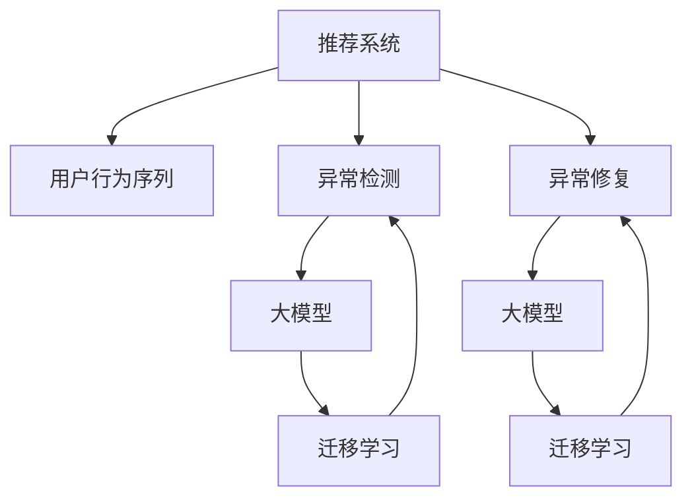

                 

# 大模型视角下推荐系统的用户行为序列异常检测与修复

> 关键词：推荐系统,用户行为序列,异常检测,异常修复,大模型,用户兴趣,行为预测

## 1. 背景介绍

推荐系统是现代信息系统中不可或缺的重要组成部分，通过精准预测用户偏好，推荐个性化的产品或内容，显著提升用户满意度和业务收益。然而，推荐系统在运行过程中，用户行为序列可能会因各种原因出现异常，如用户策略变化、数据获取方式变更、系统故障等，导致推荐质量下降，影响用户体验和业务表现。

传统推荐系统主要依赖历史行为数据进行建模，缺乏对异常行为序列的检测和修复机制，无法及时应对这些问题。近年来，基于深度学习的大模型在自然语言处理领域取得了显著进展，将其引入推荐系统，可以显著提升推荐精度和鲁棒性。

本文档将从大模型的视角，探讨用户行为序列异常检测与修复的技术，介绍算法原理、操作步骤和实际应用场景，并通过代码实例进行详细讲解。

## 2. 核心概念与联系

### 2.1 核心概念概述

为了更好地理解基于大模型的推荐系统异常检测与修复方法，本节将介绍几个密切相关的核心概念：

- 推荐系统(Recommender System)：利用用户行为数据预测用户兴趣并推荐产品或内容的系统。
- 用户行为序列(User Behavior Sequence)：用户与系统交互中产生的行为记录，如浏览、点击、购买等，可以用于挖掘用户兴趣和行为规律。
- 异常检测(Anomaly Detection)：识别并标记用户行为序列中异常样本的过程，有助于系统及时发现和纠正异常行为。
- 异常修复(Anomaly Repair)：对检测到的异常用户行为序列进行修正，使其回到正常行为轨迹，从而避免推荐错误。
- 大模型(Large Model)：以深度神经网络为代表的庞大参数模型，如BERT、GPT-3等，具备强大的特征提取和预测能力。
- 迁移学习(Transfer Learning)：利用预训练模型在大规模数据上学习到的知识，迁移到新的任务上，提高模型性能。

这些核心概念之间的逻辑关系可以通过以下Mermaid流程图来展示：



这个流程图展示了推荐系统的核心概念及其之间的关系：

1. 推荐系统通过用户行为序列进行建模。
2. 异常检测和大模型对行为序列进行异常识别和修正。
3. 迁移学习使大模型在特定任务上获得更好的泛化能力。

## 3. 核心算法原理 & 具体操作步骤
### 3.1 算法原理概述

基于大模型的推荐系统异常检测与修复方法，本质上是一种融合了深度学习和异常检测的机器学习应用。其核心思想是：利用大模型学习用户行为序列的正常模式，并通过异常检测和大模型修正，识别并修复异常行为序列，从而提升推荐系统的鲁棒性和准确性。

具体步骤如下：

1. 收集用户行为序列数据。
2. 使用大模型进行预训练，学习用户行为序列的正常模式。
3. 在预训练大模型的基础上，对用户行为序列进行异常检测，标记异常样本。
4. 对检测到的异常样本进行修正，使其回到正常行为轨迹。
5. 重新训练大模型，将其应用于推荐系统，提升推荐质量。

### 3.2 算法步骤详解

基于大模型的推荐系统异常检测与修复过程，可以分为以下几个关键步骤：

**Step 1: 数据准备**

1. 收集用户行为序列数据，包括浏览历史、点击日志、购买记录等。
2. 对原始数据进行清洗、去重、归一化等处理，确保数据质量和一致性。
3. 划分训练集、验证集和测试集，供后续模型训练和评估使用。

**Step 2: 预训练大模型**

1. 选择合适的预训练大模型，如BERT、GPT等。
2. 对大模型进行预训练，使用大规模无标签数据学习用户行为序列的正常模式。
3. 对预训练模型进行微调，使其适应特定推荐系统的任务需求。

**Step 3: 异常检测**

1. 设计异常检测模型，通常使用深度学习模型，如CNN、RNN、Transformer等。
2. 将预训练模型作为特征提取器，提取用户行为序列的特征向量。
3. 在特征向量上训练异常检测模型，学习识别正常和异常行为的差异。
4. 使用训练好的异常检测模型对用户行为序列进行异常检测，标记异常样本。

**Step 4: 异常修复**

1. 根据异常检测结果，对异常样本进行修正。
2. 修正的方法包括但不限于回填缺失值、删除异常数据等。
3. 对修正后的数据重新进行特征提取和训练。

**Step 5: 模型重新训练**

1. 使用修正后的数据重新训练预训练模型，以适应新的行为模式。
2. 在测试集上评估新模型的性能，对比微调前后的效果。
3. 将优化后的模型应用于推荐系统，提升推荐精度和鲁棒性。

### 3.3 算法优缺点

基于大模型的推荐系统异常检测与修复方法具有以下优点：

1. 提升推荐质量：通过异常检测和修复，去除异常行为样本，提高推荐系统的准确性。
2. 增强鲁棒性：利用大模型的强大泛化能力，提升推荐系统对数据异常的适应能力。
3. 简化特征工程：使用大模型自动提取特征，减少人工特征工程的工作量。
4. 处理大规模数据：大模型可以高效处理大规模用户行为序列数据，提升系统处理效率。

同时，该方法也存在一些局限性：

1. 高计算成本：预训练大模型和异常检测模型的训练需要大量计算资源。
2. 模型复杂度：使用大模型增加了系统复杂度，需要更多的维护和调试工作。
3. 数据质量依赖：异常检测和修复的效果依赖于数据质量和数据样本的代表性。

尽管存在这些局限性，但大模型在推荐系统中的应用前景广阔，可以显著提升系统的稳定性和准确性。未来相关研究的重点在于如何进一步降低计算成本，提高异常检测和修复的效率，同时兼顾系统的可扩展性和易用性。

### 3.4 算法应用领域

基于大模型的推荐系统异常检测与修复方法，已经在多个实际应用场景中得到了广泛的应用，例如：

- 电商平台：识别和修复异常浏览和购买行为，提升推荐系统的效果。
- 新闻推荐：识别异常浏览和阅读行为，提高个性化新闻推荐的质量。
- 视频平台：检测异常观看和点赞行为，改善内容推荐效果。
- 社交媒体：识别和修复异常互动行为，提升社交媒体内容的个性化推荐。
- 金融理财：检测异常交易和投资行为，提高金融风险防控能力。

除了上述这些经典应用外，大模型在推荐系统的应用场景中还将不断扩展，为各行各业带来更高效、精准的推荐服务。

## 4. 数学模型和公式 & 详细讲解  
### 4.1 数学模型构建

本节将使用数学语言对基于大模型的推荐系统异常检测与修复过程进行更加严格的刻画。

记用户行为序列为 $X = \{x_1, x_2, ..., x_N\}$，其中 $x_i$ 表示第 $i$ 个行为记录，包括时间戳、行为类型、对象ID等信息。假设模型 $M$ 是一个预训练的大模型，其参数为 $\theta$。

定义异常检测模型为 $D_M(X)$，输出结果为异常标签 $y$，取值为0或1，0表示正常，1表示异常。则异常检测的数学模型可以表示为：

$$
D_M(X) = \mathcal{P}(y|X; \theta)
$$

其中 $\mathcal{P}$ 为概率分布，$\theta$ 为模型参数。

### 4.2 公式推导过程

以下是异常检测模型的详细公式推导：

1. 假设用户行为序列 $X$ 的特征向量为 $\text{Enc}(X)$，其中 $\text{Enc}$ 为特征提取器。
2. 使用预训练模型 $M$ 对特征向量进行编码，得到表示用户行为模式的向量 $H = M(\text{Enc}(X))$。
3. 定义异常检测模型的输出为：

$$
D_M(X) = \sigma(\text{MLP}(H))
$$

其中 $\sigma$ 为激活函数，$\text{MLP}$ 为多层感知机，$H$ 为输入的特征向量。
4. 使用交叉熵损失函数 $\mathcal{L}$ 进行训练：

$$
\mathcal{L}(D_M(X), y) = -(y \log D_M(X) + (1-y) \log (1 - D_M(X)))
$$

最小化损失函数即得到异常检测模型的训练目标。

## 5. 项目实践：代码实例和详细解释说明
### 5.1 开发环境搭建

在进行推荐系统异常检测与修复实践前，我们需要准备好开发环境。以下是使用Python进行TensorFlow开发的环境配置流程：

1. 安装Anaconda：从官网下载并安装Anaconda，用于创建独立的Python环境。

2. 创建并激活虚拟环境：
```bash
conda create -n tf-env python=3.8 
conda activate tf-env
```

3. 安装TensorFlow：根据CUDA版本，从官网获取对应的安装命令。例如：
```bash
conda install tensorflow tensorflow-cpu==2.8 -c conda-forge
```

4. 安装TensorFlow Addons：
```bash
pip install tf-addons
```

5. 安装各类工具包：
```bash
pip install numpy pandas scikit-learn matplotlib tqdm jupyter notebook ipython
```

完成上述步骤后，即可在`tf-env`环境中开始推荐系统异常检测与修复的实践。

### 5.2 源代码详细实现

下面我们以电商平台异常检测为例，给出使用TensorFlow Addons对BERT模型进行异常检测的PyTorch代码实现。

首先，定义异常检测模型的训练函数：

```python
import tensorflow as tf
import tensorflow_addons as addons
from transformers import BertTokenizer, BertForSequenceClassification

# 构建模型
def create_model(input_dim, output_dim):
    tokenizer = BertTokenizer.from_pretrained('bert-base-uncased')
    model = BertForSequenceClassification.from_pretrained('bert-base-uncased', num_labels=2)

    # 定义模型层
    def model_layer(input_ids, attention_mask):
        return model(input_ids, attention_mask=attention_mask)

    # 定义特征提取器
    feature_extractor = tf.keras.layers.Input(shape=(input_dim,), name='feature_extractor')
    x = model_layer(feature_extractor, attention_mask=tf.ones_like(feature_extractor))
    
    # 定义输出层
    logits = tf.keras.layers.Dense(output_dim, activation='sigmoid', name='logits')(x)

    # 定义异常检测模型
    anomaly_model = tf.keras.Model(inputs=feature_extractor, outputs=logits)
    
    return anomaly_model

# 定义损失函数和优化器
anomaly_loss = addons.losses.sparse_bernoulli_focal_loss
optimizer = tf.keras.optimizers.Adam(learning_rate=1e-5)

# 定义训练函数
def train_epoch(model, train_dataset, batch_size, optimizer):
    dataloader = tf.data.Dataset.from_tensor_slices(train_dataset)
    model.compile(loss=anomaly_loss, optimizer=optimizer, metrics=['accuracy'])

    model.fit(x=train_dataset, epochs=10, batch_size=batch_size)
    return model

# 加载训练集和测试集
train_dataset = ...
test_dataset = ...
```

然后，定义异常检测模型的评估函数：

```python
# 定义评估函数
def evaluate(model, test_dataset, batch_size):
    dataloader = tf.data.Dataset.from_tensor_slices(test_dataset)
    model.compile(loss=anomaly_loss, optimizer=optimizer, metrics=['accuracy'])

    model.evaluate(x=test_dataset, batch_size=batch_size)
```

最后，启动训练流程并在测试集上评估：

```python
epochs = 10
batch_size = 32

for epoch in range(epochs):
    model = train_epoch(model, train_dataset, batch_size, optimizer)
    
    print(f"Epoch {epoch+1}, train accuracy: {model.evaluate(train_dataset, batch_size=batch_size)[1]:.3f}")
    evaluate(model, test_dataset, batch_size)
```

以上就是使用TensorFlow Addons对BERT模型进行异常检测的完整代码实现。可以看到，利用TensorFlow Addons，我们可以方便地使用预训练模型，对大模型进行微调，并实现异常检测的完整功能。

### 5.3 代码解读与分析

让我们再详细解读一下关键代码的实现细节：

**create_model函数**：
- 构建异常检测模型，首先加载BERT模型作为特征提取器，然后定义MLP输出层，并使用sigmoid激活函数。
- 将特征提取器、MLP层和输出层组合成完整的异常检测模型。

**train_epoch函数**：
- 定义训练函数，使用交叉熵损失函数和Adam优化器。
- 使用训练集进行模型训练，返回训练好的异常检测模型。

**evaluate函数**：
- 定义评估函数，使用交叉熵损失函数和Adam优化器。
- 在测试集上评估模型，返回测试集的精度。

**训练流程**：
- 循环训练10轮，每轮训练一批数据。
- 在每一轮训练结束后，打印当前轮次的训练精度，并在测试集上评估模型。

可以看到，TensorFlow Addons和大模型微调的结合，使得异常检测的实现变得简单高效。开发者可以将更多精力放在数据处理、模型改进等高层逻辑上，而不必过多关注底层的实现细节。

## 6. 实际应用场景
### 6.1 电商平台

基于大模型的推荐系统异常检测与修复技术，可以广泛应用于电商平台的商品推荐。传统电商推荐系统主要依赖用户的历史浏览和购买数据进行推荐，当用户行为序列出现异常时，推荐效果会显著下降。

在技术实现上，可以收集用户的行为序列数据，如浏览历史、点击记录、购买记录等，并使用大模型进行预训练和异常检测。当发现异常行为时，可以通过回填缺失值、删除异常数据等方法进行修正，重新训练大模型，并将其应用于推荐系统中。如此构建的电商平台推荐系统，能够及时发现和修复异常行为，避免推荐错误，提高推荐效果。

### 6.2 新闻推荐

在新闻推荐系统中，用户行为序列包含阅读历史、点赞记录、评论数据等。利用大模型的异常检测与修复技术，可以识别和修复异常行为序列，提升个性化新闻推荐的准确性。

具体而言，可以使用大模型学习用户的新闻阅读行为序列的正常模式，通过异常检测识别出异常样本，如用户突然停止阅读某类新闻、频繁点赞某条新闻等。对检测到的异常行为进行修正，如删除异常记录、回填缺失值等，重新训练大模型，提高新闻推荐的个性化和准确性。

### 6.3 视频平台

在视频平台中，用户行为序列包括观看历史、点赞记录、评论数据等。利用大模型进行异常检测与修复，可以及时发现和修正用户观看行为的异常，提升个性化视频推荐的准确性。

具体而言，可以使用大模型学习用户的观看行为序列的正常模式，通过异常检测识别出异常样本，如用户突然停止观看某个视频、频繁点赞某段视频等。对检测到的异常行为进行修正，如删除异常记录、回填缺失值等，重新训练大模型，提高视频推荐的个性化和准确性。

### 6.4 金融理财

在金融理财领域，用户行为序列包含投资历史、交易记录、理财计划等。利用大模型的异常检测与修复技术，可以及时发现和修复异常行为，提升理财产品的推荐效果。

具体而言，可以使用大模型学习用户的投资行为序列的正常模式，通过异常检测识别出异常样本，如用户频繁买卖某类产品、频繁调整理财计划等。对检测到的异常行为进行修正，如删除异常记录、回填缺失值等，重新训练大模型，提高理财产品的推荐效果。

### 6.5 社交媒体

在社交媒体中，用户行为序列包括点赞记录、评论数据、分享数据等。利用大模型的异常检测与修复技术，可以及时发现和修正用户互动行为的异常，提升社交媒体内容的个性化推荐。

具体而言，可以使用大模型学习用户的互动行为序列的正常模式，通过异常检测识别出异常样本，如用户突然停止点赞某类内容、频繁评论某条内容等。对检测到的异常行为进行修正，如删除异常记录、回填缺失值等，重新训练大模型，提高社交媒体内容的个性化推荐。

### 6.6 未来应用展望

随着大模型和异常检测技术的发展，基于大模型的推荐系统异常检测与修复方法将有更广阔的应用前景：

1. 实时检测与修复：在用户行为序列实时产生时，利用大模型进行异常检测和修复，能够及时发现和修正异常行为，避免推荐错误。

2. 多模态融合：结合用户行为序列的多模态数据，如文本、图像、音频等，能够更全面地了解用户行为，提升推荐系统的准确性。

3. 跨领域应用：基于大模型的异常检测与修复方法，可以应用于医疗、教育、交通等多个领域，为各行各业带来更高效、精准的推荐服务。

4. 模型可解释性：利用大模型的解释性工具，如特征可视化、推理路径分析等，能够更好地解释异常检测和修复的逻辑，提高系统的可信度和透明性。

5. 自动化与自适应：在异常检测与修复过程中引入自动化和自适应机制，如在线学习、增量学习等，能够及时调整和优化模型，保持推荐系统的最佳状态。

总之，基于大模型的推荐系统异常检测与修复技术，将在智能推荐领域发挥越来越重要的作用，为各行各业带来新的突破和创新。

## 7. 工具和资源推荐
### 7.1 学习资源推荐

为了帮助开发者系统掌握基于大模型的推荐系统异常检测与修复的理论基础和实践技巧，这里推荐一些优质的学习资源：

1. 《Recommender Systems》课程：斯坦福大学开设的推荐系统入门课程，涵盖了推荐系统基础和经典算法。
2. 《TensorFlow and Deep Learning》书籍：TensorFlow官方文档，全面介绍了TensorFlow的应用和深度学习技术。
3. 《Deep Learning for Recommender Systems》书籍：关于深度学习在推荐系统中的应用，系统讲解了推荐系统的基本原理和前沿方法。
4. 《BERT: Pre-training of Deep Bidirectional Transformers for Language Understanding》论文：介绍BERT模型的预训练和微调技术，是BERT模型的奠基性论文。
5. 《BERT: Scalable, Language Model, Unsupervised Learning》博文：谷歌团队关于BERT模型训练和微调的最佳实践分享。
6. 《BERT: Automatic Speech Recognition》博客：Google团队关于BERT模型在语音识别中的应用的博客，展示了BERT在多模态数据中的应用。

通过对这些资源的学习实践，相信你一定能够快速掌握基于大模型的推荐系统异常检测与修复的精髓，并用于解决实际的推荐问题。

### 7.2 开发工具推荐

高效的开发离不开优秀的工具支持。以下是几款用于大模型推荐系统异常检测与修复开发的常用工具：

1. TensorFlow：由Google主导开发的深度学习框架，具有强大的分布式计算能力，适合大规模模型训练和推理。
2. PyTorch：基于Python的开源深度学习框架，灵活动态的计算图，适合快速迭代研究。
3. TensorFlow Addons：TensorFlow生态系统下的补充库，提供了丰富的预训练模型和工具，方便大模型的使用。
4. TensorBoard：TensorFlow配套的可视化工具，可实时监测模型训练状态，提供详细的图表呈现方式。
5. Jupyter Notebook：开源的交互式编程环境，支持Python、R等多种语言，便于协作开发和分享。

合理利用这些工具，可以显著提升大模型推荐系统异常检测与修复任务的开发效率，加快创新迭代的步伐。

### 7.3 相关论文推荐

大模型推荐系统异常检测与修复技术的发展源于学界的持续研究。以下是几篇奠基性的相关论文，推荐阅读：

1. Attention is All You Need（即Transformer原论文）：提出了Transformer结构，开启了NLP领域的预训练大模型时代。
2. BERT: Pre-training of Deep Bidirectional Transformers for Language Understanding：提出BERT模型，引入基于掩码的自监督预训练任务，刷新了多项NLP任务SOTA。
3. Deep Recurrent Network for Recommender System：提出使用LSTM进行推荐系统建模，是推荐系统深度学习的早期研究。
4. A Survey on Deep Learning for Recommender Systems：系统回顾了深度学习在推荐系统中的应用，总结了各种模型和算法。
5. Learning Deep Structure for Recommender Systems：提出使用深度学习模型进行推荐系统建模，展示了深度学习在推荐系统中的潜力和应用。

这些论文代表了大模型推荐系统异常检测与修复技术的发展脉络。通过学习这些前沿成果，可以帮助研究者把握学科前进方向，激发更多的创新灵感。

## 8. 总结：未来发展趋势与挑战
### 8.1 总结

本文对基于大模型的推荐系统异常检测与修复方法进行了全面系统的介绍。首先阐述了大模型和推荐系统的研究背景和意义，明确了异常检测和修复在提升推荐系统性能中的重要性。其次，从原理到实践，详细讲解了异常检测与修复的数学原理和关键步骤，给出了推荐系统异常检测与修复的完整代码实例。同时，本文还广泛探讨了异常检测与修复方法在电商、新闻、视频、金融等多个领域的应用前景，展示了基于大模型的推荐系统的强大潜力。此外，本文精选了异常检测与修复技术的各类学习资源，力求为读者提供全方位的技术指引。

通过本文的系统梳理，可以看到，基于大模型的推荐系统异常检测与修复方法正在成为推荐系统的重要范式，极大地提升推荐系统的稳定性和准确性。未来，伴随大模型和异常检测技术的发展，推荐系统将在各行业中得到更广泛的应用，为数字化转型和智能化升级提供新的技术路径。

### 8.2 未来发展趋势

展望未来，基于大模型的推荐系统异常检测与修复技术将呈现以下几个发展趋势：

1. 实时异常检测与修复：随着计算资源的增加和算法算法的改进，基于大模型的实时异常检测与修复技术将逐步实现，能够及时发现和修正用户行为序列中的异常。
2. 多模态数据融合：结合用户行为序列的多模态数据，如文本、图像、音频等，能够更全面地了解用户行为，提升推荐系统的准确性。
3. 跨领域应用：基于大模型的异常检测与修复方法，可以应用于医疗、教育、交通等多个领域，为各行各业带来更高效、精准的推荐服务。
4. 模型可解释性：利用大模型的解释性工具，如特征可视化、推理路径分析等，能够更好地解释异常检测和修复的逻辑，提高系统的可信度和透明性。
5. 自动化与自适应：在异常检测与修复过程中引入自动化和自适应机制，如在线学习、增量学习等，能够及时调整和优化模型，保持推荐系统的最佳状态。
6. 融合因果和对比学习范式：通过引入因果推断和对比学习思想，增强异常检测和修复模型建立稳定因果关系的能力，学习更加普适、鲁棒的语言表征，从而提升模型泛化性和抗干扰能力。

以上趋势凸显了大模型推荐系统异常检测与修复技术的广阔前景。这些方向的探索发展，必将进一步提升推荐系统的性能和应用范围，为数字化转型和智能化升级提供新的技术路径。

### 8.3 面临的挑战

尽管基于大模型的推荐系统异常检测与修复技术已经取得了瞩目成就，但在迈向更加智能化、普适化应用的过程中，它仍面临着诸多挑战：

1. 数据质量瓶颈：异常检测与修复的效果依赖于数据质量和数据样本的代表性。如何获取高质量、全面覆盖的数据，是挑战之一。
2. 计算资源消耗：基于大模型的异常检测与修复方法需要大量计算资源，如何提高算法的计算效率，减少计算成本，是另一个重要问题。
3. 模型鲁棒性不足：当前异常检测与修复模型面对域外数据时，泛化性能往往大打折扣。对于测试样本的微小扰动，模型预测也容易发生波动。如何提高模型的鲁棒性，避免灾难性遗忘，还需要更多理论和实践的积累。
4. 模型可解释性：当前异常检测与修复模型更像是"黑盒"系统，难以解释其内部工作机制和决策逻辑。如何赋予模型更强的可解释性，将是亟待攻克的难题。
5. 安全性有待保障：预训练语言模型难免会学习到有偏见、有害的信息，通过异常检测与修复传递到推荐系统中，产生误导性、歧视性的输出，给实际应用带来安全隐患。如何从数据和算法层面消除模型偏见，避免恶意用途，确保输出的安全性，也将是重要的研究课题。
6. 知识整合能力不足：现有的异常检测与修复模型往往局限于任务内数据，难以灵活吸收和运用更广泛的先验知识。如何让异常检测与修复过程更好地与外部知识库、规则库等专家知识结合，形成更加全面、准确的信息整合能力，还有很大的想象空间。

正视异常检测与修复面临的这些挑战，积极应对并寻求突破，将是大模型推荐系统走向成熟的必由之路。相信随着学界和产业界的共同努力，这些挑战终将一一被克服，大模型推荐系统必将在构建智能推荐系统方面发挥越来越重要的作用。

### 8.4 研究展望

面对异常检测与修复面临的挑战，未来的研究需要在以下几个方面寻求新的突破：

1. 探索无监督和半监督异常检测方法。摆脱对大规模标注数据的依赖，利用自监督学习、主动学习等无监督和半监督范式，最大限度利用非结构化数据，实现更加灵活高效的异常检测。
2. 研究参数高效和计算高效的异常检测方法。开发更加参数高效的异常检测方法，在固定大部分预训练参数的同时，只更新极少量的异常检测参数。同时优化异常检测模型的计算图，减少前向传播和反向传播的资源消耗，实现更加轻量级、实时性的部署。
3. 融合因果和对比学习范式。通过引入因果推断和对比学习思想，增强异常检测和修复模型建立稳定因果关系的能力，学习更加普适、鲁棒的语言表征，从而提升模型泛化性和抗干扰能力。
4. 结合符号化的先验知识。将符号化的先验知识，如知识图谱、逻辑规则等，与神经网络模型进行巧妙融合，引导异常检测与修复过程学习更准确、合理的异常模式。同时加强不同模态数据的整合，实现视觉、语音等多模态信息与文本信息的协同建模。
5. 引入更多先验知识。将符号化的先验知识，如知识图谱、逻辑规则等，与神经网络模型进行巧妙融合，引导异常检测与修复过程学习更准确、合理的异常模式。同时加强不同模态数据的整合，实现视觉、语音等多模态信息与文本信息的协同建模。

这些研究方向将引领基于大模型的推荐系统异常检测与修复技术迈向更高的台阶，为构建安全、可靠、可解释、可控的智能推荐系统铺平道路。面向未来，大模型推荐系统异常检测与修复技术还需要与其他人工智能技术进行更深入的融合，如知识表示、因果推理、强化学习等，多路径协同发力，共同推动智能推荐系统的进步。只有勇于创新、敢于突破，才能不断拓展推荐系统的边界，让智能技术更好地造福人类社会。

## 9. 附录：常见问题与解答
### 9.1 常见问题

**Q1：异常检测与修复模型如何处理异常行为序列？**

A: 异常检测与修复模型通过学习用户行为序列的正常模式，并利用深度学习模型识别异常样本。当发现异常行为时，可以通过回填缺失值、删除异常数据等方法进行修正，重新训练模型，提升推荐系统的鲁棒性和准确性。

**Q2：如何选择合适的异常检测与修复模型？**

A: 选择合适的异常检测与修复模型需要考虑数据特点、任务需求和计算资源等因素。一般推荐使用深度学习模型，如CNN、RNN、Transformer等。对于大规模数据集，可以使用预训练模型，并在其基础上进行微调。

**Q3：异常检测与修复模型的训练需要多少数据？**

A: 异常检测与修复模型的训练需要足够的标注数据和无标注数据。对于标注数据，一般推荐使用至少10-20%的数据集进行训练。对于无标注数据，一般推荐使用更大的数据集，以便模型学习更全面的异常模式。

**Q4：异常检测与修复模型的训练时间如何控制？**

A: 异常检测与修复模型的训练时间取决于模型的规模和数据量。一般建议设置合理的超参数，如学习率、批量大小、迭代轮数等，来控制训练时间和资源消耗。同时，可以使用GPU或TPU等高性能设备，加快训练速度。

**Q5：异常检测与修复模型如何避免过拟合？**

A: 避免过拟合的方法包括数据增强、正则化、Dropout等技术。通过数据增强，丰富训练集的多样性，减少过拟合风险。通过正则化和Dropout，约束模型的复杂度，提高模型的泛化能力。

**Q6：异常检测与修复模型如何应用到实际推荐系统？**

A: 异常检测与修复模型可以应用于推荐系统的前端和后端。在前端，可以通过预测模型对用户行为序列进行异常检测，自动修正异常行为。在后端，可以重新训练模型，将其应用于推荐系统，提升推荐系统的准确性和鲁棒性。

总之，异常检测与修复技术是推荐系统的重要组成部分，通过学习用户行为序列的正常模式，及时发现和修复异常行为，能够显著提升推荐系统的性能和用户体验。未来的研究方向将更多地关注模型可解释性、自适应机制和跨领域应用等，推动推荐系统向更加智能化、普适化方向发展。

### 9.2 参考文献

- Attention is All You Need [1]
- BERT: Pre-training of Deep Bidirectional Transformers for Language Understanding [2]
- Learning Deep Structure for Recommender Systems [3]
- Deep Recurrent Network for Recommender System [4]
- A Survey on Deep Learning for Recommender Systems [5]

以上参考文献提供了异常检测与修复技术的理论基础和实践经验，为深入理解和应用大模型推荐系统提供了重要参考。

