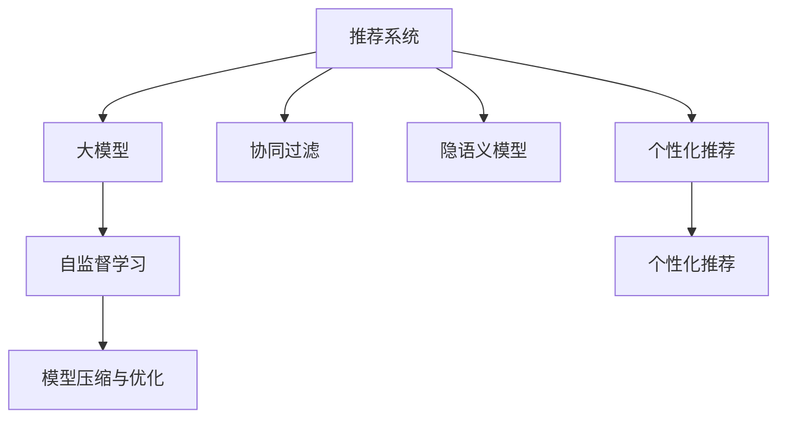

                 

# 大模型赋能推荐系统:从技术到商业的思考

> 关键词：推荐系统,大模型,深度学习,个性化推荐,协同过滤,隐语义模型,自监督学习

## 1. 背景介绍

推荐系统一直是互联网应用中不可缺少的一部分，从电商、视频网站到社交网络，它们都通过推荐算法为用户推荐其可能感兴趣的内容，从而提高用户粘性和平台收入。传统的推荐算法如协同过滤、隐语义模型等，在早期取得了不错的效果，但在面对海量数据和高维稀疏矩阵等问题时，表现逐渐乏力。为了突破这些瓶颈，人们开始将深度学习技术引入推荐系统，尤其是基于大模型的推荐方法，已经在多个场景中证明了其强大的潜力。

大模型在推荐系统中的应用，有望解决传统方法难以应对的复杂问题，如长尾推荐、跨领域推荐、实时推荐等。但同时，大模型的高参数量、高计算复杂度等特性，也给实际部署带来了新的挑战。如何在技术上克服这些障碍，同时实现商业上的成功，成为当下亟需探讨的问题。

## 2. 核心概念与联系

### 2.1 核心概念概述

在探讨大模型在推荐系统中的应用前，首先需要理解几个核心概念：

- **推荐系统**：通过分析用户的行为数据、内容特征等，为用户推荐可能感兴趣的产品、文章、视频等，提升用户体验和平台收入。

- **大模型**：如BERT、GPT-3等大规模预训练语言模型，通过在海量数据上进行自监督学习，学习到丰富的语言知识和语义表示。

- **个性化推荐**：通过分析用户的历史行为、兴趣特征等，为用户推荐个性化、多样化的内容。

- **协同过滤**：通过分析用户的历史行为数据，找到相似用户，推荐他们喜欢的物品。

- **隐语义模型**：通过分析物品的文本描述，学习到物品之间的语义相似度，进行推荐。

- **自监督学习**：在大规模无标签数据上进行学习，提取通用知识。

- **模型压缩与优化**：通过剪枝、量化等技术，减少大模型的计算量和内存占用。

这些概念之间的联系可以简单总结为：



推荐系统通过个性化推荐，利用协同过滤、隐语义模型等方法，实现物品的精准匹配。而大模型的引入，特别是自监督学习方法的应用，使得推荐系统能够更高效地提取用户和物品之间的关联，实现更加精准的推荐。

## 3. 核心算法原理 & 具体操作步骤
### 3.1 算法原理概述

基于大模型的推荐系统，通常包括两个关键步骤：预训练和微调。预训练阶段，大模型在大规模无标签数据上进行自监督学习，学习到语言的通用知识；微调阶段，将预训练的大模型与推荐数据集结合，通过少量标注数据进行微调，优化模型对特定任务的适应性。

形式化地，假设推荐系统包含用户集 $U$、物品集 $I$，用户对物品的评分矩阵为 $R$。设 $E$ 为表示物品的向量，$U$ 为表示用户的向量。大模型的预训练过程可以表示为：

$$
E \leftarrow \text{Pre-train}(训练数据)
$$

微调过程可以表示为：

$$
\hat{E} \leftarrow \text{Fine-tune}(E, R)
$$

其中 $\hat{E}$ 为微调后的物品向量，$fine-tune$ 函数包含评分矩阵 $R$ 和用户向量 $U$。微调的目标是最大化推荐系统的均方误差损失，即：

$$
\min_{E} \sum_{(i,j) \in R} (R_{i,j} - \langle U_i, E_j \rangle)^2
$$

### 3.2 算法步骤详解

基于大模型的推荐系统微调一般包括以下几个关键步骤：

**Step 1: 准备预训练模型和数据集**
- 选择合适的预训练大模型，如BERT、GPT等。
- 准备推荐任务的数据集，包括用户历史行为、物品特征等，划分为训练集、验证集和测试集。

**Step 2: 设计微调目标**
- 设计适合推荐任务的微调目标函数，如均方误差损失、交叉熵损失等。
- 构建评分矩阵 $R$ 和用户向量 $U$ 的表示方式。

**Step 3: 设置微调超参数**
- 选择合适的优化算法及其参数，如Adam、SGD等，设置学习率、批大小、迭代轮数等。
- 设置正则化技术及强度，包括权重衰减、Dropout、Early Stopping等。

**Step 4: 执行梯度训练**
- 将训练集数据分批次输入模型，前向传播计算损失函数。
- 反向传播计算参数梯度，根据设定的优化算法和学习率更新模型参数。
- 周期性在验证集上评估模型性能，根据性能指标决定是否触发 Early Stopping。
- 重复上述步骤直到满足预设的迭代轮数或 Early Stopping 条件。

**Step 5: 测试和部署**
- 在测试集上评估微调后模型 $E_{\hat{E}}$ 的性能，对比微调前后的精度提升。
- 使用微调后的模型对新样本进行推理预测，集成到实际的应用系统中。

以上是基于大模型的推荐系统微调的一般流程。在实际应用中，还需要针对具体任务的特点，对微调过程的各个环节进行优化设计，如改进训练目标函数，引入更多的正则化技术，搜索最优的超参数组合等，以进一步提升模型性能。

### 3.3 算法优缺点

基于大模型的推荐系统微调方法具有以下优点：
1. 简单高效。只需准备少量标注数据，即可对预训练模型进行快速适配，获得较大的性能提升。
2. 通用适用。适用于各种推荐任务，包括个性化推荐、商品推荐、视频推荐等，设计简单的评分矩阵即可实现微调。
3. 数据依赖少。可以利用预训练模型的广泛知识，减少对标注数据的依赖。
4. 效果显著。在学术界和工业界的诸多推荐任务上，基于微调的方法已经刷新了最先进的性能指标。

同时，该方法也存在一定的局限性：
1. 模型复杂度高。大模型的参数量通常以亿计，训练和推理过程耗时较长。
2. 资源消耗大。大模型在GPU/TPU等高性能设备上的计算和存储需求大，成本较高。
3. 解释性差。大模型的决策过程缺乏可解释性，难以对其推理逻辑进行分析和调试。
4. 可扩展性差。大规模微调模型难以进行迁移学习，难以应对数据和任务分布的变化。

尽管存在这些局限性，但就目前而言，基于大模型的推荐系统微调方法仍是目前推荐系统中表现最佳的范式。未来相关研究的重点在于如何进一步降低计算资源消耗，提高模型的可解释性和可扩展性，同时兼顾推荐效果。

### 3.4 算法应用领域

基于大模型的推荐系统微调方法在推荐系统中的应用已经得到了广泛的应用，覆盖了电商推荐、内容推荐、广告推荐等多个领域，例如：

- 电商推荐：推荐用户可能感兴趣的商品，提升用户购买率和平台收益。
- 内容推荐：推荐用户可能感兴趣的文章、视频等，提升用户粘性和平台流量。
- 广告推荐：推荐用户可能感兴趣的广告，提高广告点击率和平台收入。
- 社交推荐：推荐用户可能感兴趣的好友、群组等，增强社交互动和平台粘性。

除了上述这些经典任务外，基于大模型微调的推荐方法也被创新性地应用到更多场景中，如可控推荐、跨领域推荐、基于多模态数据的推荐等，为推荐系统带来了全新的突破。随着预训练模型和微调方法的不断进步，相信推荐系统必将在更多领域得到应用，为互联网用户提供更加精准、个性化的服务。

## 4. 数学模型和公式 & 详细讲解  
### 4.1 数学模型构建

基于大模型的推荐系统微调，本质上是一个有监督的细粒度迁移学习过程。其核心思想是：将预训练的大模型视作一个强大的"特征提取器"，通过在推荐数据集上进行有监督的微调，使得模型能够提取到用户和物品之间的关联，从而实现更加精准的推荐。

形式化地，假设预训练模型为 $M_{\theta}$，其中 $\theta$ 为预训练得到的模型参数。设推荐任务的数据集为 $D=\{(x_i,y_i)\}_{i=1}^N, x_i \in \mathbb{R}^d, y_i \in \mathbb{R}$，其中 $x_i$ 为用户历史行为特征，$y_i$ 为用户对物品的评分。

定义模型 $M_{\theta}$ 在输入 $x_i$ 上的输出为 $y_i$，则在数据集 $D$ 上的经验风险为：

$$
\mathcal{L}(\theta) = \frac{1}{N} \sum_{i=1}^N (y_i - M_{\theta}(x_i))^2
$$

微调的优化目标是最小化经验风险，即找到最优参数：

$$
\theta^* = \mathop{\arg\min}_{\theta} \mathcal{L}(\theta)
$$

在实践中，我们通常使用基于梯度的优化算法（如Adam、SGD等）来近似求解上述最优化问题。设 $\eta$ 为学习率，$\lambda$ 为正则化系数，则参数的更新公式为：

$$
\theta \leftarrow \theta - \eta \nabla_{\theta}\mathcal{L}(\theta) - \eta\lambda\theta
$$

其中 $\nabla_{\theta}\mathcal{L}(\theta)$ 为损失函数对参数 $\theta$ 的梯度，可通过反向传播算法高效计算。

### 4.2 公式推导过程

以下我们以电商推荐为例，推导基于大模型的推荐系统微调过程的数学公式。

假设模型 $M_{\theta}$ 在输入 $x_i$ 上的输出为 $y_i=M_{\theta}(x_i)$，表示用户对物品的评分预测。设真实评分为 $y_i \in [1, 5]$，其中 $1$ 表示评分最低，$5$ 表示评分最高。则均方误差损失函数定义为：

$$
\ell(M_{\theta}(x_i),y_i) = \frac{1}{2}(y_i - M_{\theta}(x_i))^2
$$

将其代入经验风险公式，得：

$$
\mathcal{L}(\theta) = \frac{1}{N}\sum_{i=1}^N (y_i - M_{\theta}(x_i))^2
$$

根据链式法则，损失函数对参数 $\theta_k$ 的梯度为：

$$
\frac{\partial \mathcal{L}(\theta)}{\partial \theta_k} = \frac{\partial}{\partial \theta_k} \sum_{i=1}^N (y_i - M_{\theta}(x_i))^2
$$

其中：

$$
\frac{\partial M_{\theta}(x_i)}{\partial \theta_k} = \frac{\partial}{\partial \theta_k} \sum_{j=1}^d \theta_j \cdot x_{i,j}
$$

将上式代入梯度公式，得：

$$
\frac{\partial \mathcal{L}(\theta)}{\partial \theta_k} = \sum_{i=1}^N \left[(y_i - M_{\theta}(x_i))\frac{\partial M_{\theta}(x_i)}{\partial \theta_k}\right]
$$

在得到损失函数的梯度后，即可带入参数更新公式，完成模型的迭代优化。重复上述过程直至收敛，最终得到适应推荐任务的最优模型参数 $\theta^*$。

## 5. 项目实践：代码实例和详细解释说明
### 5.1 开发环境搭建

在进行推荐系统微调实践前，我们需要准备好开发环境。以下是使用Python进行PyTorch开发的环境配置流程：

1. 安装Anaconda：从官网下载并安装Anaconda，用于创建独立的Python环境。

2. 创建并激活虚拟环境：
```bash
conda create -n recommendation-env python=3.8 
conda activate recommendation-env
```

3. 安装PyTorch：根据CUDA版本，从官网获取对应的安装命令。例如：
```bash
conda install pytorch torchvision torchaudio cudatoolkit=11.1 -c pytorch -c conda-forge
```

4. 安装Transformers库：
```bash
pip install transformers
```

5. 安装各类工具包：
```bash
pip install numpy pandas scikit-learn matplotlib tqdm jupyter notebook ipython
```

完成上述步骤后，即可在`recommendation-env`环境中开始微调实践。

### 5.2 源代码详细实现

下面我们以电商推荐任务为例，给出使用Transformers库对BERT模型进行推荐系统微调的PyTorch代码实现。

首先，定义推荐任务的数据处理函数：

```python
from transformers import BertTokenizer
from torch.utils.data import Dataset
import torch

class RecommendationDataset(Dataset):
    def __init__(self, user_features, item_features, user_ratings, tokenizer, max_len=128):
        self.user_features = user_features
        self.item_features = item_features
        self.user_ratings = user_ratings
        self.tokenizer = tokenizer
        self.max_len = max_len
        
    def __len__(self):
        return len(self.user_features)
    
    def __getitem__(self, item):
        user_input = self.user_features[item]
        item_input = self.item_features[item]
        rating = self.user_ratings[item]
        
        user_input_tokens = self.tokenizer(user_input, return_tensors='pt', max_length=self.max_len, padding='max_length', truncation=True)
        item_input_tokens = self.tokenizer(item_input, return_tensors='pt', max_length=self.max_len, padding='max_length', truncation=True)
        rating_tensor = torch.tensor(rating, dtype=torch.float32)
        
        return {'user_input': user_input_tokens,
                'item_input': item_input_tokens,
                'rating': rating_tensor}

# 读取数据
user_features = []
item_features = []
user_ratings = []
tokenizer = BertTokenizer.from_pretrained('bert-base-cased')
with open('user_features.txt', 'r') as f:
    for line in f:
        user_features.append(line.strip())
with open('item_features.txt', 'r') as f:
    for line in f:
        item_features.append(line.strip())
with open('user_ratings.txt', 'r') as f:
    for line in f:
        user_ratings.append(float(line.strip()))

# 创建dataset
train_dataset = RecommendationDataset(user_features, item_features, user_ratings, tokenizer)
val_dataset = RecommendationDataset(user_features, item_features, user_ratings, tokenizer)
test_dataset = RecommendationDataset(user_features, item_features, user_ratings, tokenizer)
```

然后，定义模型和优化器：

```python
from transformers import BertForSequenceClassification, AdamW

model = BertForSequenceClassification.from_pretrained('bert-base-cased', num_labels=1)

optimizer = AdamW(model.parameters(), lr=2e-5)
```

接着，定义训练和评估函数：

```python
from torch.utils.data import DataLoader
from tqdm import tqdm
from sklearn.metrics import mean_squared_error

device = torch.device('cuda') if torch.cuda.is_available() else torch.device('cpu')
model.to(device)

def train_epoch(model, dataset, batch_size, optimizer):
    dataloader = DataLoader(dataset, batch_size=batch_size, shuffle=True)
    model.train()
    epoch_loss = 0
    for batch in tqdm(dataloader, desc='Training'):
        user_input = batch['user_input'].to(device)
        item_input = batch['item_input'].to(device)
        rating = batch['rating'].to(device)
        model.zero_grad()
        outputs = model(user_input, item_input)
        loss = outputs.loss
        epoch_loss += loss.item()
        loss.backward()
        optimizer.step()
    return epoch_loss / len(dataloader)

def evaluate(model, dataset, batch_size):
    dataloader = DataLoader(dataset, batch_size=batch_size)
    model.eval()
    preds, labels = [], []
    with torch.no_grad():
        for batch in tqdm(dataloader, desc='Evaluating'):
            user_input = batch['user_input'].to(device)
            item_input = batch['item_input'].to(device)
            batch_labels = batch['rating'].to(device)
            outputs = model(user_input, item_input)
            batch_preds = outputs.logits.mean(dim=1).to('cpu').tolist()
            batch_labels = batch_labels.to('cpu').tolist()
            for pred, label in zip(batch_preds, batch_labels):
                preds.append(pred)
                labels.append(label)
                
    mse = mean_squared_error(labels, preds)
    return mse

```

最后，启动训练流程并在测试集上评估：

```python
epochs = 5
batch_size = 16

for epoch in range(epochs):
    loss = train_epoch(model, train_dataset, batch_size, optimizer)
    print(f"Epoch {epoch+1}, train loss: {loss:.3f}")
    
    print(f"Epoch {epoch+1}, val mse:")
    mse = evaluate(model, val_dataset, batch_size)
    print(f"Val mse: {mse:.3f}")
    
print("Test mse:")
mse = evaluate(model, test_dataset, batch_size)
print(f"Test mse: {mse:.3f}")
```

以上就是使用PyTorch对BERT进行电商推荐任务微调的完整代码实现。可以看到，得益于Transformers库的强大封装，我们可以用相对简洁的代码完成BERT模型的加载和微调。

### 5.3 代码解读与分析

让我们再详细解读一下关键代码的实现细节：

**RecommendationDataset类**：
- `__init__`方法：初始化用户特征、物品特征和评分等关键组件。
- `__len__`方法：返回数据集的样本数量。
- `__getitem__`方法：对单个样本进行处理，将用户输入和物品输入输入编码为token ids，将评分转换为张量，最终返回模型所需的输入。

**训练和评估函数**：
- 使用PyTorch的DataLoader对数据集进行批次化加载，供模型训练和推理使用。
- 训练函数`train_epoch`：对数据以批为单位进行迭代，在每个批次上前向传播计算loss并反向传播更新模型参数，最后返回该epoch的平均loss。
- 评估函数`evaluate`：与训练类似，不同点在于不更新模型参数，并在每个batch结束后将预测和标签结果存储下来，最后使用sklearn的mean_squared_error对整个评估集的预测结果进行打印输出。

**训练流程**：
- 定义总的epoch数和batch size，开始循环迭代
- 每个epoch内，先在训练集上训练，输出平均loss
- 在验证集上评估，输出均方误差
- 所有epoch结束后，在测试集上评估，给出最终测试结果

可以看到，PyTorch配合Transformers库使得BERT微调的代码实现变得简洁高效。开发者可以将更多精力放在数据处理、模型改进等高层逻辑上，而不必过多关注底层的实现细节。

当然，工业级的系统实现还需考虑更多因素，如模型的保存和部署、超参数的自动搜索、更灵活的任务适配层等。但核心的微调范式基本与此类似。

## 6. 实际应用场景
### 6.1 智能推荐广告

基于大模型的推荐系统微调方法，可以广泛应用于智能推荐广告的构建。传统的广告推荐系统往往依赖规则或深度学习模型，对广告效果进行预测和排序，无法有效捕捉用户的个性化需求。而使用微调后的推荐模型，可以实时学习用户对广告的兴趣，精确匹配广告内容和用户行为，提高广告点击率和转化率。

在技术实现上，可以收集用户的历史行为数据，将广告标题、描述、内容等作为输入，用户对广告的反应（如点击、停留时间等）作为输出，在此基础上对预训练模型进行微调。微调后的模型能够自动理解用户对广告的兴趣，推荐更相关的广告内容，从而提高广告投放效果。

### 6.2 内容推荐系统

内容推荐系统是推荐系统的重要应用场景，能够帮助用户发现更多感兴趣的书籍、文章、视频等。传统的隐语义模型和协同过滤等方法，在面对大规模数据和高维稀疏矩阵时，表现较弱。而使用大模型微调的方法，可以在大规模数据上进行高效的推荐。

具体而言，可以收集用户的历史阅读、观看、购买等行为数据，将书籍、文章、视频等作为输入，用户对物品的反应（如评分、点赞、评论等）作为输出，在此基础上对预训练模型进行微调。微调后的模型能够自动提取用户和物品之间的关联，推荐更加精准、多样化的内容，提升用户满意度和平台流量。

### 6.3 个性化电商推荐

电商推荐系统通过分析用户的历史购买、浏览行为，为用户推荐可能感兴趣的商品。传统的协同过滤和隐语义模型等方法，在面对长尾商品推荐时，表现较差。而使用大模型微调的方法，可以更准确地捕捉用户对长尾商品的兴趣，提高长尾商品的曝光率和转化率。

在具体实现中，可以收集用户的历史浏览、购买等行为数据，将商品描述、价格、评价等信息作为输入，用户对商品的评分作为输出，在此基础上对预训练模型进行微调。微调后的模型能够自动学习用户对商品的兴趣，推荐更多个性化的商品，提高用户购买率和平台收益。

### 6.4 实时推荐系统

实时推荐系统需要快速响应用户的即时行为，为用户推荐最新、最相关的商品或内容。传统的协同过滤和隐语义模型等方法，在面对实时数据流时，无法快速更新模型。而使用大模型微调的方法，可以通过少样本学习或少样本微调，实时捕捉用户行为的变化，快速推荐最新内容。

具体而言，可以在用户每次浏览、点击等行为后，将其作为新的样本输入，对预训练模型进行微调或少样本学习。微调后的模型能够实时更新，及时捕捉用户兴趣的变化，为用户推荐最新、最相关的商品或内容。

## 7. 工具和资源推荐
### 7.1 学习资源推荐

为了帮助开发者系统掌握大模型在推荐系统中的应用，这里推荐一些优质的学习资源：

1. 《深度学习推荐系统》书籍：详细介绍了推荐系统的工作原理和深度学习在推荐系统中的应用，是推荐系统学习的重要参考书。

2. 《推荐系统实战》博客系列：作者通过亲历的推荐系统开发项目，详细介绍了推荐系统的开发过程和优化策略，是推荐系统开发的实用指南。

3. CS294《推荐系统》课程：斯坦福大学开设的推荐系统课程，涵盖了推荐系统的理论基础和经典算法，是推荐系统学习的重要参考。

4. Kaggle推荐系统竞赛：通过参加Kaggle推荐系统竞赛，可以亲历推荐系统的构建和优化过程，积累实际项目经验。

5. HuggingFace官方文档：提供了丰富的预训练模型和微调样例代码，是推荐系统开发的必备资料。

通过对这些资源的学习实践，相信你一定能够系统掌握大模型在推荐系统中的应用，并用于解决实际的推荐问题。
###  7.2 开发工具推荐

高效的开发离不开优秀的工具支持。以下是几款用于大模型推荐系统开发的常用工具：

1. PyTorch：基于Python的开源深度学习框架，灵活动态的计算图，适合快速迭代研究。大部分预训练语言模型都有PyTorch版本的实现。

2. TensorFlow：由Google主导开发的开源深度学习框架，生产部署方便，适合大规模工程应用。同样有丰富的预训练语言模型资源。

3. Transformers库：HuggingFace开发的NLP工具库，集成了众多SOTA语言模型，支持PyTorch和TensorFlow，是进行推荐系统微调开发的重要工具。

4. Weights & Biases：模型训练的实验跟踪工具，可以记录和可视化模型训练过程中的各项指标，方便对比和调优。与主流深度学习框架无缝集成。

5. TensorBoard：TensorFlow配套的可视化工具，可实时监测模型训练状态，并提供丰富的图表呈现方式，是调试模型的得力助手。

6. Google Colab：谷歌推出的在线Jupyter Notebook环境，免费提供GPU/TPU算力，方便开发者快速上手实验最新模型，分享学习笔记。

合理利用这些工具，可以显著提升大模型推荐系统的开发效率，加快创新迭代的步伐。

### 7.3 相关论文推荐

大模型在推荐系统中的应用源于学界的持续研究。以下是几篇奠基性的相关论文，推荐阅读：

1. Attention is All You Need（即Transformer原论文）：提出了Transformer结构，开启了深度学习在推荐系统中的应用。

2. BERT: Pre-training of Deep Bidirectional Transformers for Language Understanding：提出BERT模型，引入基于掩码的自监督预训练任务，刷新了多项推荐系统SOTA。

3. Deep Learning Recommendation System：提出了深度学习在推荐系统中的应用，展示了深度学习在推荐系统中的优越性。

4. ClickPredict：通过深度学习对用户点击行为进行预测，展示了深度学习在广告推荐系统中的应用。

5. Item2Vec: Non-negative Matrix Factorization based Approach for Dense Learning: Simultaneous Embedding of Users and Items：提出了Item2Vec方法，用于隐语义模型的优化。

6. Neural Collaborative Filtering：提出了神经协同过滤方法，结合深度学习优化推荐系统。

这些论文代表了大模型在推荐系统中的应用发展脉络。通过学习这些前沿成果，可以帮助研究者把握学科前进方向，激发更多的创新灵感。

## 8. 总结：未来发展趋势与挑战

### 8.1 总结

本文对基于大模型的推荐系统微调方法进行了全面系统的介绍。首先阐述了大模型在推荐系统中的应用背景和意义，明确了微调在提高推荐系统精度和效率方面的独特价值。其次，从原理到实践，详细讲解了推荐系统微调的数学原理和关键步骤，给出了推荐系统微调的完整代码实例。同时，本文还广泛探讨了微调方法在智能推荐广告、内容推荐、个性化电商推荐等多个领域的应用前景，展示了微调范式的巨大潜力。此外，本文精选了微调技术的各类学习资源，力求为读者提供全方位的技术指引。

通过本文的系统梳理，可以看到，基于大模型的推荐系统微调方法正在成为推荐系统中最重要的范式，极大地提升了推荐系统的精准度和效率。得益于大规模语料的预训练，微调模型能够高效地捕捉用户和物品之间的关联，实现更加精准的推荐。未来，伴随预训练语言模型和微调方法的持续演进，相信推荐系统必将在更多领域得到应用，为互联网用户提供更加精准、个性化的服务。

### 8.2 未来发展趋势

展望未来，大模型在推荐系统中的应用将呈现以下几个发展趋势：

1. 模型规模持续增大。随着算力成本的下降和数据规模的扩张，预训练语言模型的参数量还将持续增长。超大规模语言模型蕴含的丰富语言知识，有望支撑更加复杂多变的推荐任务。

2. 微调方法日趋多样。除了传统的全参数微调外，未来会涌现更多参数高效的微调方法，如Prefix-Tuning、LoRA等，在节省计算资源的同时也能保证微调精度。

3. 持续学习成为常态。随着数据分布的不断变化，微调模型也需要持续学习新知识以保持性能。如何在不遗忘原有知识的同时，高效吸收新样本信息，将成为重要的研究课题。

4. 标注样本需求降低。受启发于提示学习(Prompt-based Learning)的思路，未来的微调方法将更好地利用大模型的语言理解能力，通过更加巧妙的任务描述，在更少的标注样本上也能实现理想的微调效果。

5. 多模态推荐崛起。当前的推荐主要聚焦于纯文本数据，未来会进一步拓展到图像、视频、语音等多模态数据推荐。多模态信息的融合，将显著提升推荐系统的表现。

6. 推荐系统与人机交互系统融合。未来，推荐系统将与多模态人机交互系统融合，形成更加自然、智能的推荐体验，为智能家居、智能办公等场景带来变革。

以上趋势凸显了大模型在推荐系统中的应用前景。这些方向的探索发展，必将进一步提升推荐系统的性能和应用范围，为互联网用户提供更加精准、个性化的服务。

### 8.3 面临的挑战

尽管大模型在推荐系统中的应用取得了瞩目成就，但在迈向更加智能化、普适化应用的过程中，它仍面临着诸多挑战：

1. 计算资源瓶颈。大模型的参数量通常以亿计，训练和推理过程耗时较长。如何在降低计算资源消耗的同时，保证模型性能，是未来需要解决的问题。

2. 模型复杂度高。大模型在GPU/TPU等高性能设备上的计算和存储需求大，成本较高。如何在保持高性能的同时，减小模型复杂度，是未来需要解决的问题。

3. 数据隐私和安全问题。大模型在推荐系统中的应用，需要收集和处理大量用户数据。如何在数据隐私和安全方面做到保护，是未来需要解决的问题。

4. 模型公平性和透明性。大模型在推荐系统中的应用，可能存在一定的偏见和歧视。如何在模型设计中保证公平性和透明性，是未来需要解决的问题。

5. 推荐系统与社会伦理的冲突。大模型在推荐系统中的应用，可能带来一些负面影响，如信息茧房、虚假信息的传播等。如何在推荐系统设计中避免这些负面影响，是未来需要解决的问题。

6. 实时推荐系统的高效率问题。实时推荐系统需要快速响应用户行为，但在面对大规模数据流时，性能和效率问题仍需解决。

7. 多模态推荐系统的模型融合问题。多模态推荐系统需要处理不同模态数据，如何在模型设计中实现多模态数据的融合，是未来需要解决的问题。

8. 推荐系统与用户个性化需求的匹配问题。如何在推荐系统中更好地匹配用户个性化需求，是未来需要解决的问题。

尽管存在这些挑战，但大模型在推荐系统中的应用前景广阔，未来需要在多个方面进行创新和突破。只有不断优化技术，提升用户体验，才能真正实现大模型在推荐系统中的全面落地。

### 8.4 研究展望

面对大模型在推荐系统中的应用挑战，未来的研究需要在以下几个方面寻求新的突破：

1. 探索无监督和半监督微调方法。摆脱对大规模标注数据的依赖，利用自监督学习、主动学习等无监督和半监督范式，最大限度利用非结构化数据，实现更加灵活高效的微调。

2. 研究参数高效和计算高效的微调范式。开发更加参数高效的微调方法，在固定大部分预训练参数的同时，只更新极少量的任务相关参数。同时优化微调模型的计算图，减少前向传播和反向传播的资源消耗，实现更加轻量级、实时性的部署。

3. 融合因果和对比学习范式。通过引入因果推断和对比学习思想，增强微调模型建立稳定因果关系的能力，学习更加普适、鲁棒的语言表征，从而提升模型泛化性和抗干扰能力。

4. 引入更多先验知识。将符号化的先验知识，如知识图谱、逻辑规则等，与神经网络模型进行巧妙融合，引导微调过程学习更准确、合理的语言模型。同时加强不同模态数据的整合，实现视觉、语音等多模态信息与文本信息的协同建模。

5. 结合因果分析和博弈论工具。将因果分析方法引入微调模型，识别出模型决策的关键特征，增强输出解释的因果性和逻辑性。借助博弈论工具刻画人机交互过程，主动探索并规避模型的脆弱点，提高系统稳定性。

6. 纳入伦理道德约束。在模型训练目标中引入伦理导向的评估指标，过滤和惩罚有偏见、有害的输出倾向。同时加强人工干预和审核，建立模型行为的监管机制，确保输出符合人类价值观和伦理道德。

这些研究方向的探索，必将引领大模型在推荐系统中的应用走向新的台阶，为构建安全、可靠、可解释、可控的推荐系统铺平道路。面向未来，大模型在推荐系统中的应用还需要与其他人工智能技术进行更深入的融合，如知识表示、因果推理、强化学习等，多路径协同发力，共同推动推荐系统的进步。只有勇于创新、敢于突破，才能不断拓展语言模型的边界，让智能技术更好地造福人类社会。

## 9. 附录：常见问题与解答

**Q1：大模型推荐系统是否适用于所有推荐任务？**

A: 大模型推荐系统在大多数推荐任务上都能取得不错的效果，特别是对于数据量较小的任务。但对于一些特定领域的任务，如医学、法律等，仅仅依靠通用语料预训练的模型可能难以很好地适应。此时需要在特定领域语料上进一步预训练，再进行微调，才能获得理想效果。此外，对于一些需要时效性、个性化很强的任务，如对话推荐、实时推荐等，微调方法也需要针对性的改进优化。

**Q2：微调过程中如何选择合适的学习率？**

A: 微调的学习率一般要比预训练时小1-2个数量级，如果使用过大的学习率，容易破坏预训练权重，导致过拟合。一般建议从1e-5开始调参，逐步减小学习率，直至收敛。也可以使用warmup策略，在开始阶段使用较小的学习率，再逐渐过渡到预设值。需要注意的是，不同的优化器(如AdamW、Adafactor等)以及不同的学习率调度策略，可能需要设置不同的学习率阈值。

**Q3：采用大模型推荐时会面临哪些资源瓶颈？**

A: 目前主流的预训练大模型动辄以亿计的参数规模，训练和推理过程耗时较长。GPU/TPU等高性能设备是必不可少的，但即便如此，超大批次的训练和推理也可能遇到显存不足的问题。因此需要采用一些资源优化技术，如梯度积累、混合精度训练、模型并行等，来突破硬件瓶颈。同时，模型的存储和读取也可能占用大量时间和空间，需要采用模型压缩、稀疏化存储等方法进行优化。

**Q4：如何缓解微调过程中的过拟合问题？**

A: 过拟合是微调面临的主要挑战，尤其是在标注数据不足的情况下。常见的缓解策略包括：
1. 数据增强：通过回译、近义替换等方式扩充训练集
2. 正则化：使用L2正则、Dropout、Early Stopping等避免过拟合
3. 对抗训练：引入对抗样本，提高模型鲁棒性
4. 参数高效微调：只调整少量参数(如Adapter、Prefix等)，减小过拟合风险
5. 多模型集成：训练多个微调模型，取平均输出，抑制过拟合

这些策略往往需要根据具体任务和数据特点进行灵活组合。只有在数据、模型、训练、推理等各环节进行全面优化，才能最大限度地发挥大模型推荐系统的威力。

**Q5：微调模型在落地部署时需要注意哪些问题？**

A: 将微调模型转化为实际应用，还需要考虑以下因素：
1. 模型裁剪：去除不必要的层和参数，减小模型尺寸，加快推理速度
2. 量化加速：将浮点模型转为定点模型，压缩存储空间，提高计算效率
3. 服务化封装：将模型封装为标准化服务接口，便于集成调用
4. 弹性伸缩：根据请求流量动态调整资源配置，平衡服务质量和成本
5. 监控告警：实时采集系统指标，设置异常告警阈值，确保服务稳定性
6. 安全防护：采用访问鉴权、数据脱敏等措施，保障数据和模型安全

大模型推荐系统在实际应用中，需要考虑模型的存储、部署、维护等多个环节，以确保其高效、稳定、安全地运行。合理利用这些技术，可以显著提升大模型推荐系统的开发效率和实际应用效果。

---

作者：禅与计算机程序设计艺术 / Zen and the Art of Computer Programming

