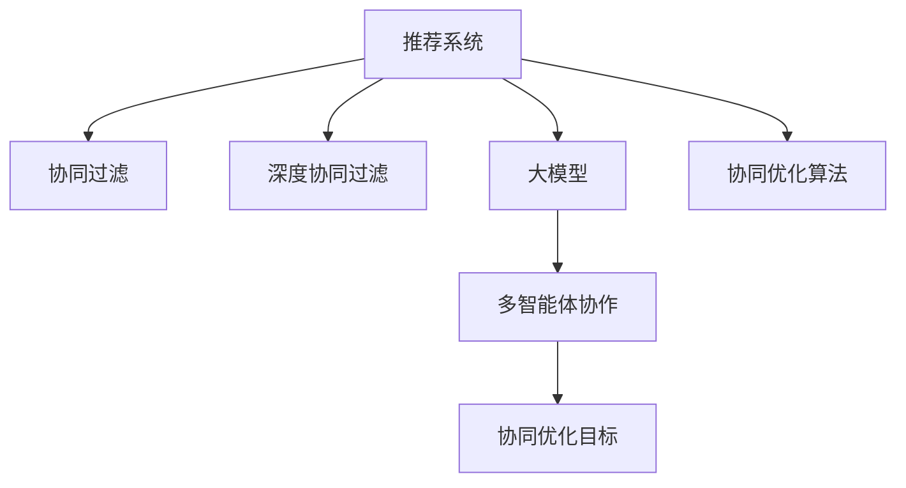

                 

# 大模型驱动的推荐系统多智能体协作

> 关键词：大模型,多智能体协作,推荐系统,协同过滤,深度学习,协同优化

## 1. 背景介绍

### 1.1 问题由来
随着电子商务平台和内容服务应用的蓬勃发展，推荐系统逐渐成为用户体验和业务转化的核心。优秀的推荐系统能够提供精准而个性化的内容推荐，使用户在纷繁的信息流中发现最感兴趣的物品。然而，推荐系统面临高维稀疏性、数据冷启动、动态需求响应等诸多挑战，传统的协同过滤算法往往难以应对这些复杂性。

为了提升推荐系统的效果，研究者们不断探索新的技术方法。近年来，随着预训练语言模型和大规模深度学习技术的发展，基于大模型的推荐系统逐渐成为热门方向。利用大模型强大的表征能力，推荐系统可以实现更加复杂的特征提取和模式识别。

与此同时，推荐系统通常需要处理海量用户数据和物品数据，涉及机器学习、分布式计算、数据工程等众多技术领域，需要多方面的协作才能高效运行。这使得推荐系统具有显著的多智能体特征，即推荐过程中涉及多个组件和角色的协同工作，包括数据采集、用户画像构建、物品召回、特征工程、模型训练和评估等多个环节。

因此，本文旨在探索基于大模型的推荐系统多智能体协作方法，通过协同优化提升推荐系统的效果和运行效率，使其更好地服务于用户，推动行业发展。

### 1.2 问题核心关键点
推荐系统的大模型驱动多智能体协作主要包括以下几个关键点：

- 构建多智能体推荐框架。将推荐系统视为多个智能体的协作系统，涉及数据治理、特征工程、模型训练等多个环节。

- 优化多智能体协作的协同机制。设计合适的智能体间通信协议和数据流转机制，确保各智能体高效协同。

- 利用大模型提升推荐系统的特征表达能力。基于大模型强大的表征能力，提取更加丰富的特征信息，提升推荐精度。

- 设计多智能体协同优化的模型。基于协同优化目标，构建多智能体模型，优化各智能体的行为策略，提升整体推荐效果。

这些关键点共同构成了基于大模型的推荐系统多智能体协作的研究框架，旨在通过协同优化，提升推荐系统的智能化水平和运行效率，为其落地应用奠定坚实基础。

## 2. 核心概念与联系

### 2.1 核心概念概述

为更好地理解基于大模型的推荐系统多智能体协作方法，本节将介绍几个密切相关的核心概念：

- 推荐系统(Recommendation System)：通过分析用户行为数据，预测用户对未交互物品的偏好，为其推荐最合适的物品。

- 协同过滤(Collaborative Filtering)：利用用户和物品的评分数据，通过相似性计算推荐物品。协同过滤是推荐系统中最基础、效果最好的方法之一。

- 深度协同过滤(Deep Collaborative Filtering)：利用深度学习技术提升协同过滤的特征表达能力，捕捉更加复杂和抽象的用户行为特征。

- 大模型(Transformer)：以自回归模型(如GPT)或自编码模型(如BERT)为代表的大规模预训练语言模型，具有强大的表征能力和泛化能力。

- 推荐系统多智能体协作(Multi-Agent Recommendation System Collaboration)：推荐系统涉及多个智能体的协同工作，通过协同优化提升推荐效果。

这些核心概念之间的逻辑关系可以通过以下Mermaid流程图来展示：



这个流程图展示了大模型的推荐系统多智能体协作的核心概念及其之间的关系：

1. 推荐系统通过协同过滤、深度协同过滤和大模型等技术手段，实现精准推荐。
2. 多智能体协作通过协同优化目标和算法，提升各智能体的协同工作效果。
3. 协同优化目标与算法共同作用于协同过滤、深度协同过滤和大模型的协同优化。

这些概念共同构成了大模型推荐系统的多智能体协作框架，为其提供理论和实践的支撑。

## 3. 核心算法原理 & 具体操作步骤
### 3.1 算法原理概述

基于大模型的推荐系统多智能体协作，本质上是一个多智能体系统(Multi-Agent System,MAS)的优化问题。其核心思想是：将推荐系统视为一个由多个智能体组成的多智能体系统，各智能体通过协同工作，最大化整体的推荐效果。

形式化地，假设推荐系统中的智能体集合为 $A=\{a_1, a_2, ..., a_n\}$，每个智能体 $a_i$ 对应的优化目标为 $f_i(x_i)$，其中 $x_i$ 为智能体 $a_i$ 的决策变量，即 $x_i$ 表示智能体 $a_i$ 在协同过滤、深度协同过滤和大模型等环节的决策参数。各智能体间的协同优化目标为 $F(A) = \sum_{i=1}^{n} f_i(x_i)$。

目标是通过协同优化算法，使得 $F(A)$ 最大化，即找到一组全局最优的决策变量 $x^* = (x_1^*, x_2^*, ..., x_n^*)$，使得 $F(A)$ 达到最优。

### 3.2 算法步骤详解

基于大模型的推荐系统多智能体协作一般包括以下几个关键步骤：

**Step 1: 构建多智能体推荐框架**
- 根据推荐系统的需求，设计多智能体协作框架。框架应包括用户画像构建、物品召回、特征工程、模型训练和评估等多个环节。
- 确定各智能体的职责和功能，如用户画像智能体、物品召回智能体、特征工程智能体等。

**Step 2: 设计多智能体通信协议**
- 设计智能体间的通信协议，包括消息传递的格式和频率，确保各智能体能够高效地交换信息。
- 设计数据流转机制，明确数据的输入输出路径，避免数据瓶颈和冗余。

**Step 3: 引入大模型提升特征表达**
- 将大模型引入推荐系统特征工程环节，利用其强大的表征能力，提取更加丰富和抽象的特征信息。
- 根据推荐任务的具体需求，选择合适的预训练语言模型，如BERT、GPT等，进行微调或微结构化。

**Step 4: 构建协同优化模型**
- 根据协同优化目标，设计多智能体优化模型，如博弈论、强化学习、协同优化算法等。
- 定义各智能体的决策空间，如用户画像智能体的超参数选择、物品召回智能体的召回算法等。
- 设计各智能体之间的约束条件，如数据隐私保护、模型一致性等。

**Step 5: 协同训练与评估**
- 使用协同优化模型，通过迭代优化各智能体的决策变量，提升整体推荐效果。
- 在训练过程中，使用协同过滤、深度协同过滤等传统算法作为基准，评估协同优化模型的提升效果。
- 定期在推荐系统中进行实验验证，评估协同优化模型的实际应用效果。

以上是基于大模型的推荐系统多智能体协作的一般流程。在实际应用中，还需要针对具体任务的特点，对协同优化模型进行优化设计，如改进训练目标函数，引入更多的协同优化算法等，以进一步提升推荐系统的效果。

### 3.3 算法优缺点

基于大模型的推荐系统多智能体协作方法具有以下优点：
1. 高效协同。通过多智能体协作，优化各组件的决策，提升整体推荐系统的效果。
2. 提升特征表达能力。利用大模型的强大表征能力，提取更加丰富和抽象的特征信息，提升推荐精度。
3. 灵活配置。通过定义各智能体的职责和决策空间，适应不同的推荐场景和需求。

同时，该方法也存在一定的局限性：
1. 模型复杂度高。引入大模型和协同优化算法，使得推荐系统的复杂度增加，调参难度增大。
2. 计算资源消耗大。大模型需要占用大量的计算资源，协同优化算法也需要较大的计算量。
3. 数据隐私风险。协同优化过程中，各智能体需要共享部分数据，存在数据隐私风险。
4. 协同效果依赖于智能体设计。协同优化效果依赖于各智能体的设计质量，设计不当可能适得其反。

尽管存在这些局限性，但就目前而言，基于大模型的推荐系统多智能体协作方法仍是大模型推荐系统的主要研究范式。未来相关研究的重点在于如何进一步降低模型复杂度，提高协同优化算法的效率，同时兼顾数据隐私和安全等因素。

### 3.4 算法应用领域

基于大模型的推荐系统多智能体协作方法，已经在众多领域得到应用，具体包括：

- 电商平台推荐系统：如淘宝、京东等电商平台的推荐引擎，通过协同优化提升商品推荐效果。
- 内容服务推荐系统：如Netflix、Spotify等流媒体平台的推荐系统，通过多智能体协作提供个性化视频、音频推荐。
- 社交网络推荐系统：如微信、微博等社交网络的个性化推荐功能，通过协同优化提升用户互动体验。
- 智能广告推荐系统：如Google AdSense、Facebook Ads等广告推荐平台，通过协同优化提升广告投放效果。
- 金融科技推荐系统：如银行、证券等金融机构的用户推荐系统，通过多智能体协作优化理财、投资等服务。

除了上述这些经典应用外，大模型推荐系统的多智能体协作方法，还将在更多场景中得到应用，如智能推荐助手、智能健康系统、智能物流等，为各行各业带来新的发展机遇。

## 4. 数学模型和公式 & 详细讲解  
### 4.1 数学模型构建

本节将使用数学语言对基于大模型的推荐系统多智能体协作过程进行更加严格的刻画。

记推荐系统中的智能体集合为 $A=\{a_1, a_2, ..., a_n\}$，其中 $a_i$ 表示第 $i$ 个智能体，智能体的决策变量为 $x_i \in \mathcal{X}_i$，其中 $\mathcal{X}_i$ 表示智能体 $a_i$ 的决策空间。假设智能体 $a_i$ 的优化目标为 $f_i(x_i)$，协同优化目标为 $F(A) = \sum_{i=1}^{n} f_i(x_i)$。

为了最大化协同优化目标，可以使用协同优化算法（如协同优化博弈、强化学习等），通过迭代更新各智能体的决策变量，使得 $F(A)$ 达到最优。常用的协同优化算法包括：

- 协同优化博弈：定义智能体间的博弈规则，通过最大化全局收益函数，优化各智能体的决策。
- 协同优化算法：基于协同过滤、深度协同过滤等传统算法，设计协同优化目标，通过迭代更新各智能体的决策变量，提升推荐效果。
- 强化学习：设计协同优化环境，各智能体通过与环境交互，学习最优的决策策略，实现协同优化。

### 4.2 公式推导过程

以下我们以协同优化博弈为例，推导其公式。

假设智能体集合 $A$ 包含两个智能体 $a_1$ 和 $a_2$，分别表示用户画像智能体和物品召回智能体。用户画像智能体的优化目标为 $f_1(x_1)$，物品召回智能体的优化目标为 $f_2(x_2)$。协同优化目标为 $F(A) = f_1(x_1) + f_2(x_2)$。

定义智能体间博弈的策略集为 $\mathcal{S}_1 \times \mathcal{S}_2$，其中 $S_1$ 和 $S_2$ 分别表示用户画像智能体和物品召回智能体的策略集。假设用户画像智能体的策略为 $s_1$，物品召回智能体的策略为 $s_2$，则博弈的收益函数为：

$$
\pi(s_1, s_2) = f_1(x_1) + f_2(x_2)
$$

其中 $x_1$ 和 $x_2$ 分别为用户画像智能体和物品召回智能体的决策变量。

博弈的纳什均衡策略可以通过求解以下方程组获得：

$$
\begin{aligned}
\frac{\partial f_1(x_1)}{\partial x_1} &= 0 \\
\frac{\partial f_2(x_2)}{\partial x_2} &= 0 \\
\end{aligned}
$$

求解上述方程组，即得到博弈的纳什均衡策略 $(s_1^*, s_2^*)$，其中 $s_1^*$ 和 $s_2^*$ 分别表示用户画像智能体和物品召回智能体的最优策略。

在得到博弈的纳什均衡策略后，各智能体的决策变量 $x_1^*$ 和 $x_2^*$ 可以带入优化目标 $F(A)$ 中，进一步计算协同优化目标的最大值。

## 5. 项目实践：代码实例和详细解释说明
### 5.1 开发环境搭建

在进行推荐系统多智能体协作实践前，我们需要准备好开发环境。以下是使用Python进行TensorFlow和PyTorch开发的环境配置流程：

1. 安装Anaconda：从官网下载并安装Anaconda，用于创建独立的Python环境。

2. 创建并激活虚拟环境：
```bash
conda create -n tf-env python=3.8 
conda activate tf-env
```

3. 安装TensorFlow：根据CUDA版本，从官网获取对应的安装命令。例如：
```bash
conda install tensorflow
```

4. 安装PyTorch：根据CUDA版本，从官网获取对应的安装命令。例如：
```bash
conda install pytorch torchvision torchaudio cudatoolkit=11.1 -c pytorch -c conda-forge
```

5. 安装各类工具包：
```bash
pip install numpy pandas scikit-learn matplotlib tqdm jupyter notebook ipython
```

完成上述步骤后，即可在`tf-env`环境中开始多智能体协作实践。

### 5.2 源代码详细实现

下面我们以协同过滤推荐系统为例，给出使用TensorFlow进行多智能体协作的PyTorch代码实现。

首先，定义协同过滤模型的用户画像智能体：

```python
import tensorflow as tf
from transformers import BertTokenizer
from transformers import TFAutoModelForSequenceClassification

class UserProfile:
    def __init__(self, model, tokenizer, batch_size):
        self.model = model
        self.tokenizer = tokenizer
        self.batch_size = batch_size

    def __call__(self, user_id):
        # 获取用户历史行为数据
        history = self.retrieve_user_history(user_id)

        # 对历史行为数据进行编码
        encoded = self.tokenizer(history, return_tensors='tf', padding='max_length', truncation=True)
        input_ids = encoded['input_ids'][0]
        attention_mask = encoded['attention_mask'][0]

        # 输入到模型进行用户画像表示学习
        with tf.device('/cpu:0'):
            logits = self.model(input_ids, attention_mask=attention_mask)

        # 输出用户画像表示
        user_profile = tf.argmax(logits, axis=-1, output_type=tf.int32)
        return user_profile
```

然后，定义物品召回智能体：

```python
class ItemRecommender:
    def __init__(self, model, tokenizer, batch_size):
        self.model = model
        self.tokenizer = tokenizer
        self.batch_size = batch_size

    def __call__(self, item_id):
        # 获取物品描述
        description = self.retrieve_item_description(item_id)

        # 对物品描述进行编码
        encoded = self.tokenizer(description, return_tensors='tf', padding='max_length', truncation=True)
        input_ids = encoded['input_ids'][0]
        attention_mask = encoded['attention_mask'][0]

        # 输入到模型进行物品特征表示学习
        with tf.device('/cpu:0'):
            logits = self.model(input_ids, attention_mask=attention_mask)

        # 输出物品特征表示
        item_feature = tf.argmax(logits, axis=-1, output_type=tf.int32)
        return item_feature
```

接着，定义多智能体协作的协同过滤推荐系统：

```python
class MultiAgentCollaborativeFiltering:
    def __init__(self, user_profile, item_recommender, batch_size):
        self.user_profile = user_profile
        self.item_recommender = item_recommender
        self.batch_size = batch_size

    def __call__(self, user_id, item_ids):
        # 获取用户画像和物品特征表示
        user_profile = self.user_profile(user_id)
        item_features = [self.item_recommender(item_id) for item_id in item_ids]

        # 计算用户与物品间的协同过滤分数
        scores = user_profile * item_features

        # 对物品进行排序，返回推荐物品列表
        top_items = tf.argsort(scores, axis=-1)[::-1].tolist()
        return top_items[:5]
```

最后，启动协同过滤推荐系统：

```python
# 加载用户画像模型和物品召回模型
user_profile_model = TFAutoModelForSequenceClassification.from_pretrained('bert-base-cased')
item_recommender_model = TFAutoModelForSequenceClassification.from_pretrained('bert-base-cased')

# 创建智能体对象
user_profile = UserProfile(user_profile_model, BertTokenizer.from_pretrained('bert-base-cased'), batch_size=16)
item_recommender = ItemRecommender(item_recommender_model, BertTokenizer.from_pretrained('bert-base-cased'), batch_size=16)

# 启动协同过滤推荐系统
multi_agent = MultiAgentCollaborativeFiltering(user_profile, item_recommender, batch_size=16)

# 对用户进行推荐
top_items = multi_agent(user_id, item_ids)
print(top_items)
```

以上就是使用TensorFlow对协同过滤推荐系统进行多智能体协作的完整代码实现。可以看到，通过定义用户画像智能体和物品召回智能体，并将它们封装成协同过滤推荐系统，我们可以很方便地实现推荐过程的多智能体协作。

### 5.3 代码解读与分析

让我们再详细解读一下关键代码的实现细节：

**UserProfile类**：
- `__init__`方法：初始化用户画像智能体的模型、分词器和批次大小。
- `__call__`方法：根据用户ID获取用户历史行为数据，进行编码和输入，通过用户画像模型学习用户画像表示，最终输出用户画像向量。

**ItemRecommender类**：
- `__init__`方法：初始化物品召回智能体的模型、分词器和批次大小。
- `__call__`方法：根据物品ID获取物品描述，进行编码和输入，通过物品召回模型学习物品特征表示，最终输出物品特征向量。

**MultiAgentCollaborativeFiltering类**：
- `__init__`方法：初始化协同过滤推荐系统的用户画像智能体和物品召回智能体，以及批次大小。
- `__call__`方法：根据用户ID和物品ID，调用用户画像智能体和物品召回智能体，计算协同过滤分数，并返回前5个推荐物品ID。

**协同过滤推荐系统**：
- 通过定义用户画像智能体和物品召回智能体，实现推荐系统的多智能体协作。
- 用户画像智能体通过历史行为数据学习用户画像表示，物品召回智能体通过物品描述学习物品特征表示。
- 协同过滤推荐系统通过计算用户画像和物品特征的协同过滤分数，实现物品推荐。

**推荐过程**：
- 加载预训练模型和分词器。
- 创建用户画像智能体和物品召回智能体的对象。
- 启动协同过滤推荐系统，对用户进行推荐，并输出前5个推荐物品ID。

可以看到，多智能体协作推荐系统的代码实现相对简洁，主要通过定义智能体的功能接口和调用逻辑，便能实现协同过滤推荐的过程。

当然，工业级的系统实现还需考虑更多因素，如模型的保存和部署、超参数的自动搜索、更灵活的任务适配层等。但核心的多智能体协作思想基本与此类似。

## 6. 实际应用场景
### 6.1 电商平台推荐系统

电商平台推荐系统是多智能体协作的典型应用场景。用户画像智能体可以从用户历史浏览和购买记录中提取用户画像，物品召回智能体可以从商品库中召回相关商品。通过协同过滤推荐系统，用户画像智能体和物品召回智能体协作完成个性化推荐。

在技术实现上，可以设计用户画像智能体负责用户画像建模，物品召回智能体负责商品召回，协同过滤推荐系统负责计算推荐分数。各智能体通过共享数据和计算资源，协作完成推荐任务。

### 6.2 内容服务推荐系统

内容服务推荐系统如Netflix、Spotify等，涉及视频、音频等多媒体内容。用户画像智能体可以提取用户行为特征，物品召回智能体可以从视频、音频库中召回相关内容。协同过滤推荐系统可以计算用户与内容的协同过滤分数，实现内容推荐。

在技术实现上，可以设计用户画像智能体负责用户画像建模，物品召回智能体负责内容召回，协同过滤推荐系统负责计算推荐分数。各智能体通过共享数据和计算资源，协作完成推荐任务。

### 6.3 社交网络推荐系统

社交网络推荐系统如微信、微博等，涉及用户互动数据。用户画像智能体可以从用户互动数据中提取用户画像，物品召回智能体可以从朋友圈、微博等社交网络中召回相关内容。协同过滤推荐系统可以计算用户与内容的协同过滤分数，实现内容推荐。

在技术实现上，可以设计用户画像智能体负责用户画像建模，物品召回智能体负责内容召回，协同过滤推荐系统负责计算推荐分数。各智能体通过共享数据和计算资源，协作完成推荐任务。

### 6.4 智能广告推荐系统

智能广告推荐系统如Google AdSense、Facebook Ads等，涉及广告投放数据。用户画像智能体可以从用户历史广告互动数据中提取用户画像，物品召回智能体可以从广告库中召回相关广告。协同过滤推荐系统可以计算用户与广告的协同过滤分数，实现广告投放推荐。

在技术实现上，可以设计用户画像智能体负责用户画像建模，物品召回智能体负责广告召回，协同过滤推荐系统负责计算推荐分数。各智能体通过共享数据和计算资源，协作完成推荐任务。

### 6.5 金融科技推荐系统

金融科技推荐系统如银行、证券等，涉及用户理财、投资数据。用户画像智能体可以从用户理财、投资数据中提取用户画像，物品召回智能体可以从理财、投资产品中召回相关产品。协同过滤推荐系统可以计算用户与产品的协同过滤分数，实现理财、投资产品推荐。

在技术实现上，可以设计用户画像智能体负责用户画像建模，物品召回智能体负责产品召回，协同过滤推荐系统负责计算推荐分数。各智能体通过共享数据和计算资源，协作完成推荐任务。

## 7. 工具和资源推荐
### 7.1 学习资源推荐

为了帮助开发者系统掌握大模型推荐系统多智能体协作的理论基础和实践技巧，这里推荐一些优质的学习资源：

1. 《Recommender Systems: From Theory to Practice》书籍：深入浅出地介绍了推荐系统的基础原理和推荐算法，并结合实际应用场景进行了详细介绍。

2. 《Deep Learning for Recommendation Engines》在线课程：由斯坦福大学教授授课，系统讲解了深度学习在推荐系统中的应用，涵盖了协同过滤、深度协同过滤等经典算法。

3. 《Multi-Agent Reinforcement Learning》书籍：系统介绍了多智能体系统理论基础和强化学习技术，并结合推荐系统进行了具体应用。

4. 《Recommender Systems with Deep Learning》在线课程：由新加坡国立大学教授授课，系统讲解了深度学习在推荐系统中的应用，涵盖协同过滤、深度协同过滤等经典算法。

5. 《Large-Scale Deep Learning for Recommender Systems》在线课程：由微软研究员授课，系统讲解了大模型在推荐系统中的应用，结合实际案例进行了深入讲解。

通过对这些资源的学习实践，相信你一定能够快速掌握大模型推荐系统的多智能体协作精髓，并用于解决实际的推荐问题。
###  7.2 开发工具推荐

高效的开发离不开优秀的工具支持。以下是几款用于大模型推荐系统多智能体协作开发的常用工具：

1. TensorFlow：由Google主导开发的开源深度学习框架，生产部署方便，适合大规模工程应用。

2. PyTorch：基于Python的开源深度学习框架，灵活动态的计算图，适合快速迭代研究。

3. Scikit-learn：基于Python的数据处理和机器学习库，简单易用，适合快速数据处理和特征工程。

4. NLTK：自然语言处理工具包，提供了丰富的NLP功能，方便文本数据处理。

5. HuggingFace Transformers库：提供了多种预训练语言模型的实现，支持深度学习任务开发。

6. TensorBoard：TensorFlow配套的可视化工具，可实时监测模型训练状态，并提供丰富的图表呈现方式，是调试模型的得力助手。

7. Weights & Biases：模型训练的实验跟踪工具，可以记录和可视化模型训练过程中的各项指标，方便对比和调优。

8. Jupyter Notebook：交互式Python代码开发环境，方便编写、调试和分享代码。

合理利用这些工具，可以显著提升大模型推荐系统的多智能体协作开发效率，加快创新迭代的步伐。

### 7.3 相关论文推荐

大模型推荐系统的多智能体协作方法发展迅速，以下是几篇奠基性的相关论文，推荐阅读：

1. TensorFlow Tutorial on Recommender Systems: Large-Scale Machine Learning with TensorFlow：介绍了TensorFlow在推荐系统中的应用，涵盖协同过滤、深度协同过滤、多智能体协作等多个方面。

2. Multi-Task Learning in Recommendation Systems: A Survey and Future Directions：总结了多任务学习在推荐系统中的应用，涵盖协同过滤、深度协同过滤、多智能体协作等多个方面。

3. A Survey on Multi-Agent Recommendation Systems：总结了多智能体推荐系统的理论基础和实际应用，涵盖协同过滤、深度协同过滤、多智能体协作等多个方面。

4. Collaborative Filtering for Recommendation Systems: A Survey：总结了协同过滤在推荐系统中的应用，涵盖传统协同过滤、深度协同过滤、多智能体协作等多个方面。

5. Multi-Task Learning in Recommendation Systems：总结了多任务学习在推荐系统中的应用，涵盖协同过滤、深度协同过滤、多智能体协作等多个方面。

这些论文代表了大模型推荐系统多智能体协作技术的发展脉络。通过学习这些前沿成果，可以帮助研究者把握学科前进方向，激发更多的创新灵感。

## 8. 总结：未来发展趋势与挑战
### 8.1 总结

本文对基于大模型的推荐系统多智能体协作方法进行了全面系统的介绍。首先阐述了大模型推荐系统的背景和意义，明确了多智能体协作在提升推荐系统效果和运行效率方面的独特价值。其次，从原理到实践，详细讲解了协同优化和多智能体协作的数学模型和实现流程，给出了多智能体协作推荐系统的代码实例。同时，本文还广泛探讨了多智能体协作在电商、内容服务、社交网络、广告、金融科技等多个领域的应用前景，展示了多智能体协作的巨大潜力。

通过本文的系统梳理，可以看到，基于大模型的推荐系统多智能体协作方法正在成为推荐系统的主要研究范式，极大地拓展了推荐系统的智能化水平和运行效率，为其落地应用奠定了坚实基础。未来，伴随大模型和协同优化方法的持续演进，相信推荐系统必将在更广阔的应用领域大放异彩，深刻影响人类的信息获取和决策过程。

### 8.2 未来发展趋势

展望未来，大模型推荐系统多智能体协作方法将呈现以下几个发展趋势：

1. 多智能体协作的深度化。随着深度学习技术的不断进步，协同优化算法和模型将更加复杂，能够更好地捕捉用户行为和物品特征的内在关联。

2. 多智能体协作的动态化。推荐系统需要不断适应用户需求和市场变化，动态调整各智能体的策略，实现实时优化。

3. 多智能体协作的个性化。利用用户画像智能体和物品召回智能体的协同优化，能够更好地个性化推荐，满足用户的独特需求。

4. 多智能体协作的多模态化。引入视觉、语音等多模态数据，通过多智能体协作，实现更全面、准确的用户画像建模和物品特征表示。

5. 多智能体协作的联邦化。通过联邦学习技术，各智能体可以共享模型参数，避免数据隐私泄露，提升协同优化效果。

6. 多智能体协作的可解释化。通过可解释的推荐算法和用户画像模型，提升推荐系统的透明度和可信度，保障用户权益。

以上趋势凸显了大模型推荐系统多智能体协作技术的广阔前景。这些方向的探索发展，必将进一步提升推荐系统的智能化水平和运行效率，为其落地应用提供更加坚实的技术支撑。

### 8.3 面临的挑战

尽管大模型推荐系统多智能体协作技术已经取得了显著成果，但在迈向更加智能化、普适化应用的过程中，它仍面临着诸多挑战：

1. 模型复杂度高。多智能体协作引入了更多的协同优化算法和模型，使得推荐系统的复杂度增加，调参难度增大。

2. 计算资源消耗大。大模型需要占用大量的计算资源，协同优化算法也需要较大的计算量。

3. 数据隐私风险。协同优化过程中，各智能体需要共享部分数据，存在数据隐私风险。

4. 协同效果依赖于智能体设计。协同优化效果依赖于各智能体的设计质量，设计不当可能适得其反。

5. 实时响应能力不足。推荐系统需要实时响应用户需求，动态调整各智能体的策略，这在现有技术条件下仍是一个挑战。

6. 模型可解释性不足。多智能体协作推荐系统的决策过程通常缺乏可解释性，难以对其推理逻辑进行分析和调试。

尽管存在这些挑战，但就目前而言，基于大模型的推荐系统多智能体协作方法仍是大模型推荐系统的主要研究范式。未来相关研究的重点在于如何进一步降低模型复杂度，提高协同优化算法的效率，同时兼顾数据隐私和安全等因素。

### 8.4 研究展望

面对大模型推荐系统多智能体协作所面临的挑战，未来的研究需要在以下几个方面寻求新的突破：

1. 探索轻量级多智能体协作方法。开发轻量级协同优化算法和模型，在保证推荐效果的同时，降低计算资源消耗。

2. 引入可解释性增强技术。通过可解释的推荐算法和用户画像模型，提升推荐系统的透明度和可信度，保障用户权益。

3. 引入联邦学习技术。通过联邦学习技术，各智能体可以共享模型参数，避免数据隐私泄露，提升协同优化效果。

4. 融合多种优化技术。结合因果推理、强化学习等优化技术，提高多智能体协作的鲁棒性和灵活性。

5. 引入多模态协同优化。通过视觉、语音等多模态数据的融合，实现更全面、准确的用户画像建模和物品特征表示。

6. 纳入伦理道德约束。在模型训练目标中引入伦理导向的评估指标，过滤和惩罚有偏见、有害的输出倾向，确保推荐系统的公平性和公正性。

这些研究方向的探索，必将引领大模型推荐系统多智能体协作技术迈向更高的台阶，为构建智能推荐系统提供更加坚实的技术支撑。面向未来，大模型推荐系统多智能体协作技术还需要与其他人工智能技术进行更深入的融合，如知识表示、因果推理、强化学习等，多路径协同发力，共同推动推荐系统技术的进步。只有勇于创新、敢于突破，才能不断拓展推荐系统的边界，让智能技术更好地造福人类社会。

## 9. 附录：常见问题与解答

**Q1：大模型推荐系统多智能体协作是否可以用于任何推荐任务？**

A: 大模型推荐系统多智能体协作可以应用于大部分推荐任务，尤其是对于数据冷启动、高维稀疏等问题复杂的推荐场景。但对于一些简单、明确的推荐任务，如基于内容的推荐，传统协同过滤算法可能更加高效。

**Q2：多智能体协作推荐系统中各智能体的职责如何设计？**

A: 设计多智能体协作推荐系统时，需要根据推荐系统的具体需求，合理设计各智能体的职责。通常包括：
- 用户画像智能体：负责从用户历史行为数据中提取用户画像，学习用户兴趣和行为特征。
- 物品召回智能体：负责从物品库中召回相关物品，学习物品特征和属性。
- 协同过滤推荐系统：负责计算用户与物品间的协同过滤分数，实现个性化推荐。

各智能体的职责应互相配合，形成完整的推荐流程。

**Q3：多智能体协作推荐系统如何处理数据隐私问题？**

A: 多智能体协作推荐系统需要共享数据，存在数据隐私风险。为了保护用户隐私，可以采用以下措施：
- 数据匿名化：对用户和物品数据进行匿名化处理，保护用户隐私。
- 差分隐私：在数据共享过程中，加入噪声，防止数据泄露。
- 联邦学习：通过联邦学习技术，各智能体在本地训练模型，只共享模型参数，不共享原始数据。

通过这些措施，可以保护用户隐私，同时提升协同优化效果。

**Q4：如何衡量多智能体协作推荐系统的性能？**

A: 衡量多智能体协作推荐系统的性能，可以采用以下指标：
- 准确率(Accuracy)：推荐系统正确预测的比例。
- 召回率(Recall)：推荐系统正确召回的比例。
- F1-score：准确率和召回率的调和平均，用于综合评估推荐系统性能。
- 覆盖率(Coverage)：推荐系统中不同类型物品的覆盖比例，用于评估推荐系统的多样性。
- 用户满意度(User Satisfaction)：用户对推荐结果的满意度，可以通过用户反馈等手段进行评估。

通过这些指标，可以全面评估推荐系统的性能，提升用户推荐效果。

**Q5：多智能体协作推荐系统是否需要调整超参数？**

A: 多智能体协作推荐系统需要调整多个智能体的超参数，如用户画像智能体的超参数、物品召回智能体的超参数等。通常需要根据具体任务和数据特点进行调参。超参数的调整可以采用网格搜索、随机搜索、贝叶斯优化等方法。

**Q6：多智能体协作推荐系统是否可以离线训练？**

A: 多智能体协作推荐系统通常需要在线学习，根据用户实时行为数据进行推荐。离线训练可以用于模型初始化，但在实际应用中，需要考虑实时性要求，保持模型的动态更新。

**Q7：多智能体协作推荐系统是否适用于大规模分布式系统？**

A: 多智能体协作推荐系统适用于大规模分布式系统。通过分布式计算，各智能体可以在多个节点上协同工作，提升推荐系统的计算能力和响应速度。

**Q8：多智能体协作推荐系统是否可以结合其他推荐技术？**

A: 多智能体协作推荐系统可以结合其他推荐技术，如基于内容的推荐、混合推荐等。通过多路径协同发力，提升推荐系统的综合性能。

这些问题的解答，可以帮助开发者更好地理解大模型推荐系统多智能体协作的方法和应用，为其系统设计和优化提供指导。

