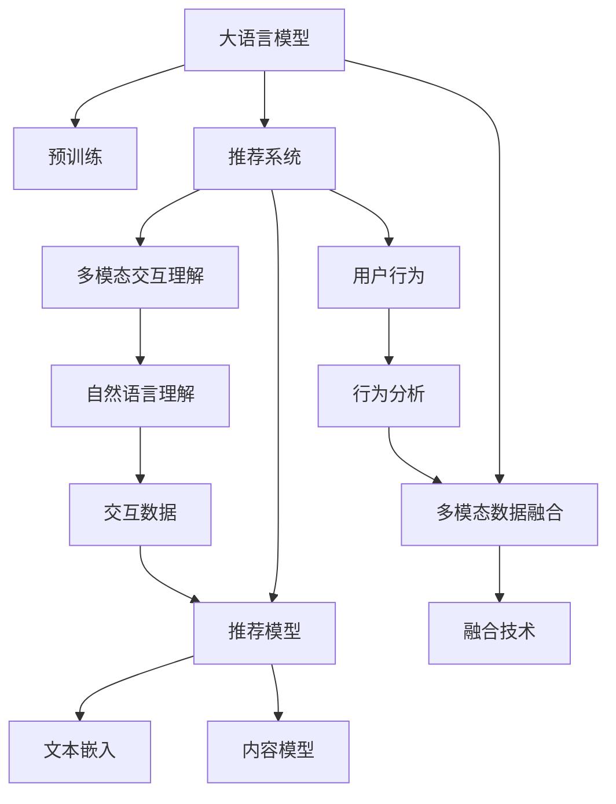

                 

## 1. 背景介绍

随着移动互联网的快速普及和智能设备的广泛应用，推荐系统已经成为各个行业标配的基础设施。推荐系统不仅能够提升用户体验，还能显著提升企业运营效率和收益。但是，随着推荐任务变得日益复杂，传统基于深度学习特征工程的技术范式已经难以满足需求。大语言模型预训练技术的兴起，为推荐系统技术带来了新的突破，带来了多模态交互理解的全新视角。

### 1.1 问题由来
推荐系统的发展经历了基于协同过滤、基于知识图谱、基于深度学习等多个阶段，但这些方法都存在着一些固有的局限性。协同过滤需要大量用户行为数据，在初期冷启动时效果不佳；基于知识图谱的推荐方式，其结构化的知识难以覆盖到互联网的海量非结构化数据；深度学习特征工程技术虽然可以解决个性化推荐问题，但需要专家团队长期迭代优化特征工程，往往需要大量的研发投入。

随着近年来深度学习技术的持续发展，多模态交互理解的算法技术逐渐浮出水面，为推荐系统带来了新的突破。其中，大语言模型预训练技术尤为引人注目，其在理解人类自然语言方面展现出了卓越的能力。那么，如何利用大语言模型预训练技术改进推荐系统，成为当下热门的研究话题。

### 1.2 问题核心关键点
本文将从多个角度探讨大语言模型在推荐系统中的应用：
1. 利用预训练的大语言模型理解用户输入的文本信息，实现自然语言理解。
2. 与多模态数据融合，获取用户更丰富的上下文信息，提升推荐效果。
3. 探索多模态交互理解的算法实现，提升推荐系统对用户行为的认知。
4. 结合用户交互数据，进行实时的个性化推荐，提升用户体验。
5. 优化推荐模型的推理速度和资源占用，实现高效的多模态推荐服务。

### 1.3 问题研究意义
利用大语言模型预训练技术，可以在很大程度上提升推荐系统的智能化水平。通过自然语言理解，推荐系统将能够更加灵活、精准地进行内容推荐。多模态交互理解使得推荐系统可以综合分析图像、文本、行为等不同类型的信息，提供更加全面、个性化的服务。同时，基于大语言模型推荐系统的优化，还能带来计算效率的提升和推荐性能的改善。

## 2. 核心概念与联系

### 2.1 核心概念概述

在探讨大语言模型在推荐系统中的应用之前，我们先定义一些关键概念：

- **大语言模型(Large Language Model, LLM)**：以自回归(如GPT)或自编码(如BERT)模型为代表的大规模预训练语言模型。通过在大规模无标签文本语料上进行预训练，学习通用的语言表示，具备强大的语言理解和生成能力。

- **预训练(Pre-training)**：指在大规模无标签文本语料上，通过自监督学习任务训练通用语言模型的过程。常见的预训练任务包括言语建模、掩码语言模型等。预训练使得模型学习到语言的通用表示。

- **推荐系统(Recommendation System)**：通过分析用户历史行为数据，结合业务规则和产品信息，为每个用户推荐最符合其需求的物品的自动化系统。

- **多模态(多模态数据融合)**：指融合多种模态(如文本、图像、声音、行为等)的信息，获取更丰富、全面的用户行为信息。

- **推荐模型(Recommendation Model)**：用于建模推荐系统核心算法，包括基于协同过滤、基于深度学习、基于知识图谱等多种模型。

- **多模态交互理解**：指通过多模态数据融合，实现对用户行为的深入理解，从而提供更加精准的推荐服务。

- **自然语言理解(Natural Language Understanding, NLU)**：通过大语言模型预训练技术，理解用户输入的自然语言，获取有价值的上下文信息。

- **文本嵌入(Text Embedding)**：将文本转化为低维向量形式，方便模型处理和推理。

- **交互数据(Interaction Data)**：用户与推荐系统进行交互所产生的数据，如点击、浏览、评价等。

- **内容模型(Content Model)**：用于描述推荐系统中的物品信息，包括文本、图片、音频等多种形式。

这些概念之间的逻辑关系可以通过以下Mermaid流程图来展示：



这个流程图展示了大语言模型与推荐系统之间的联系：

1. 大语言模型通过预训练学习通用语言表示，为推荐系统提供强大的自然语言理解能力。
2. 推荐系统结合多模态数据融合技术，获取用户更多维度的上下文信息。
3. 自然语言理解与多模态数据融合相结合，提升推荐模型的综合表现。
4. 文本嵌入将文本转化为低维向量形式，方便推荐模型进行推理。
5. 内容模型描述推荐系统中的物品信息，提供推荐的物品候选集。
6. 用户行为分析与多模态数据融合相结合，构建完整的用户画像。
7. 交互数据提供实时反馈，提升推荐系统的精准度。

## 3. 核心算法原理 & 具体操作步骤

### 3.1 算法原理概述

利用大语言模型预训练技术改进推荐系统，主要包含两个关键步骤：

1. **自然语言理解**：通过大语言模型预训练技术，理解用户输入的文本信息，获取有价值的上下文信息。
2. **多模态数据融合**：将文本、图像、行为等不同模态的数据进行融合，获取更全面、丰富的用户行为信息。

在实现上，我们可以将推荐系统视为一个双输入的模型，其中自然语言理解模块和大语言模型作为模型的输入，通过多模态数据融合获取用户行为数据，再结合用户画像和物品信息，输出推荐结果。

### 3.2 算法步骤详解

下面是具体的算法步骤：

**Step 1: 准备预训练模型和大语言模型**
- 选择合适的预训练语言模型，如BERT、GPT等，作为输入的上下文向量生成器。
- 构建大语言模型，用于自然语言理解，如使用GPT-2或GPT-3等模型。

**Step 2: 设计输入格式**
- 设计输入文本格式，通常包含用户输入的查询文本和物品描述文本，用于构建模型的输入。
- 引入时间序列特征，如用户浏览序列、行为序列等，用于捕捉用户行为的时间动态性。

**Step 3: 预处理文本数据**
- 对输入文本进行分词、去除停用词等预处理操作，减少噪声干扰。
- 引入图像、音频等多模态数据，进行统一的处理和编码。

**Step 4: 构建输入嵌入**
- 使用预训练的文本嵌入模型，如Word2Vec、GloVe等，将输入文本转化为低维向量形式。
- 使用大语言模型对输入文本进行编码，生成上下文向量。

**Step 5: 融合多模态数据**
- 使用多模态融合技术，如平均池化、拼接等，将文本嵌入与图像、音频等多模态数据进行融合。
- 引入行为序列特征，结合多模态数据构建用户行为矩阵。

**Step 6: 设计推荐模型**
- 选择合适的推荐模型，如矩阵分解、深度神经网络、图神经网络等。
- 将多模态数据和用户行为矩阵作为推荐模型的输入，输出推荐结果。

**Step 7: 推理和评估**
- 对推荐结果进行推理和评估，使用AUC、RMSE等指标评估推荐模型性能。
- 不断优化模型参数和融合技术，提升推荐系统效果。

**Step 8: 部署和优化**
- 将推荐模型部署到生产环境，实现实时推荐服务。
- 优化推荐模型的推理速度和资源占用，提升推荐系统的性能。

### 3.3 算法优缺点

利用大语言模型预训练技术改进推荐系统，具有以下优点：

1. **提升自然语言理解能力**：通过预训练大语言模型，推荐系统能够理解用户输入的文本信息，获取有价值的上下文信息，提升推荐的精准度。
2. **多模态数据融合**：融合文本、图像、行为等不同模态的数据，获取更全面、丰富的用户行为信息，提升推荐系统的综合表现。
3. **提升模型泛化能力**：大语言模型预训练技术能够提升模型的泛化能力，使其在处理新数据时表现更佳。
4. **优化推荐模型的推理速度**：通过多模态数据融合技术，优化推荐模型的推理速度和资源占用，提升系统的实时性。

同时，该方法也存在一些局限性：

1. **高计算成本**：预训练大语言模型需要大量的计算资源和时间，成本较高。
2. **数据依赖性强**：推荐系统需要大量的用户行为数据和多模态数据，获取和处理成本较高。
3. **隐私问题**：在多模态数据融合中，用户的隐私保护是一个重要问题，需要慎重处理。
4. **模型复杂度高**：融合多模态数据和自然语言理解，模型复杂度较高，需要专业的团队进行开发和优化。
5. **推荐模型鲁棒性**：大语言模型的预训练过程可能存在噪音，影响模型的鲁棒性，需要进一步优化。

尽管存在这些局限性，但大语言模型预训练技术在推荐系统中的应用仍具有广阔的前景，尤其是在多模态数据融合和自然语言理解方面展现了卓越的能力。

### 3.4 算法应用领域

利用大语言模型预训练技术改进推荐系统，已经在多个领域得到了应用，例如：

- **电商推荐**：通过用户评论、商品描述等多模态数据融合，实现商品推荐和广告推荐，提升用户购物体验。
- **视频推荐**：利用用户观看历史、评价等多模态数据，实现视频推荐，提升用户观看体验。
- **音乐推荐**：结合用户听歌历史、评论等多模态数据，实现音乐推荐，提升用户听觉体验。
- **新闻推荐**：通过用户阅读历史、点击行为等文本数据，实现新闻推荐，提升用户阅读体验。
- **旅游推荐**：结合用户浏览历史、评价等文本数据，实现旅游推荐，提升用户旅游体验。

除了上述这些经典领域，大语言模型预训练技术在推荐系统中的应用还在不断拓展，为各行各业带来了新的发展机遇。

## 4. 数学模型和公式 & 详细讲解

### 4.1 数学模型构建

假设推荐系统模型为$f$，用户输入为$x$，物品信息为$y$，自然语言理解模型为$g$，大语言模型为$h$，多模态融合技术为$\varphi$，推荐模型为$r$。则推荐系统的数学模型为：

$$
y = r(f(g(h(x)), \varphi(x, y))
$$

其中：
- $g$用于自然语言理解，将用户输入转化为上下文向量。
- $h$用于大语言模型预训练，生成上下文向量。
- $\varphi$用于多模态融合，将不同模态的数据进行融合。
- $r$用于推荐模型，输出推荐结果。

### 4.2 公式推导过程

以基于深度神经网络的推荐模型为例，进行公式推导：

1. **自然语言理解模块**：
   - 输入文本$x$，通过预训练的大语言模型$h$生成上下文向量$c$：
   $$
   c = h(x)
   $$
   - 通过自然语言理解模型$g$，将上下文向量$c$转化为用户意图向量$u$：
   $$
   u = g(c)
   $$

2. **多模态数据融合**：
   - 假设输入文本$x$有$m$个文本嵌入向量$v_1, v_2, \ldots, v_m$。
   - 将文本嵌入向量与物品信息$y$进行拼接：
   $$
   v' = [v_1; v_2; \ldots; v_m; y]
   $$
   - 使用平均池化技术$\varphi$对拼接后的向量进行编码，生成多模态融合向量$p$：
   $$
   p = \varphi(v')
   $$

3. **推荐模型推理**：
   - 将用户意图向量$u$与多模态融合向量$p$作为输入，输出推荐结果$y'$：
   $$
   y' = r(u, p)
   $$

### 4.3 案例分析与讲解

以视频推荐为例，展示大语言模型在推荐系统中的应用：

1. **输入格式设计**：
   - 用户输入为视频标题、摘要等文本信息。
   - 物品信息包括视频标题、导演、时长、评分等。

2. **预处理文本数据**：
   - 对视频标题、摘要等文本信息进行分词、去除停用词等预处理操作。
   - 将视频导演、时长、评分等转化为标签形式。

3. **构建输入嵌入**：
   - 使用Word2Vec或GloVe等文本嵌入模型，将视频标题和摘要转化为低维向量形式。
   - 使用大语言模型对视频标题和摘要进行编码，生成上下文向量。

4. **融合多模态数据**：
   - 将视频标题和摘要的文本嵌入向量与导演、时长、评分等标签向量进行拼接。
   - 使用平均池化技术对拼接后的向量进行编码，生成多模态融合向量。

5. **设计推荐模型**：
   - 使用深度神经网络模型，将用户意图向量与多模态融合向量作为输入，输出推荐结果。

6. **推理和评估**：
   - 对推荐结果进行推理和评估，使用AUC、RMSE等指标评估推荐模型性能。
   - 不断优化模型参数和融合技术，提升推荐系统效果。

通过以上案例分析，可以看到大语言模型在推荐系统中的应用流程。

## 5. 项目实践：代码实例和详细解释说明

### 5.1 开发环境搭建

在进行推荐系统项目开发前，我们需要准备好开发环境。以下是使用Python进行PyTorch开发的环境配置流程：

1. 安装Anaconda：从官网下载并安装Anaconda，用于创建独立的Python环境。

2. 创建并激活虚拟环境：
```bash
conda create -n recsys-env python=3.8 
conda activate recsys-env
```

3. 安装PyTorch：根据CUDA版本，从官网获取对应的安装命令。例如：
```bash
conda install pytorch torchvision torchaudio cudatoolkit=11.1 -c pytorch -c conda-forge
```

4. 安装相关库：
```bash
pip install torch torchtext transformers numpy pandas scikit-learn matplotlib tqdm jupyter notebook ipython
```

完成上述步骤后，即可在`recsys-env`环境中开始推荐系统开发。

### 5.2 源代码详细实现

下面是推荐系统的代码实现，以视频推荐为例：

1. 构建自然语言理解模型：

```python
import torch
from transformers import BertTokenizer, BertModel

tokenizer = BertTokenizer.from_pretrained('bert-base-uncased')
model = BertModel.from_pretrained('bert-base-uncased')

def encode_text(text):
    tokens = tokenizer.encode(text, add_special_tokens=False)
    return model(tokens)[0]
```

2. 构建多模态融合模型：

```python
import numpy as np

def concatenate(x, y):
    return np.concatenate([x, y], axis=0)

def average_pooling(x):
    return np.mean(x, axis=0)

def fuse_data(texts, items):
    texts = [encode_text(text) for text in texts]
    items = np.array(items)
    features = concatenate(texts, items)
    fused_data = average_pooling(features)
    return fused_data
```

3. 构建推荐模型：

```python
import torch.nn as nn
import torch.nn.functional as F

class Recommender(nn.Module):
    def __init__(self, input_dim, output_dim):
        super(Recommender, self).__init__()
        self.fc = nn.Linear(input_dim, output_dim)
    
    def forward(self, x):
        return F.linear(x, self.fc.weight, self.fc.bias)
```

4. 训练和评估模型：

```python
import torch.optim as optim
from sklearn.metrics import roc_auc_score

def train(model, data, epochs, batch_size):
    optimizer = optim.Adam(model.parameters(), lr=0.001)
    for epoch in range(epochs):
        total_loss = 0
        for i in range(0, len(data), batch_size):
            batch = data[i:i+batch_size]
            inputs = torch.from_numpy(batch['x'].values)
            targets = torch.from_numpy(batch['y'].values)
            optimizer.zero_grad()
            outputs = model(inputs)
            loss = F.binary_cross_entropy(outputs, targets)
            total_loss += loss.item()
            loss.backward()
            optimizer.step()
        print(f'Epoch {epoch+1}, Loss: {total_loss/len(data)}')
    
def evaluate(model, data, batch_size):
    y_pred = []
    y_true = []
    for i in range(0, len(data), batch_size):
        batch = data[i:i+batch_size]
        inputs = torch.from_numpy(batch['x'].values)
        targets = torch.from_numpy(batch['y'].values)
        outputs = model(inputs)
        y_pred.append(outputs.data.numpy())
        y_true.append(targets.data.numpy())
    y_pred = np.concatenate(y_pred)
    y_true = np.concatenate(y_true)
    roc_auc = roc_auc_score(y_true, y_pred)
    print(f'ROC-AUC Score: {roc_auc}')
```

### 5.3 代码解读与分析

让我们再详细解读一下关键代码的实现细节：

**自然语言理解模型**：
- `BertTokenizer`用于分词和编码。
- `BertModel`用于生成上下文向量。
- `encode_text`方法将输入文本进行分词和编码，返回上下文向量。

**多模态融合模型**：
- `concatenate`方法将文本嵌入向量与物品标签向量进行拼接。
- `average_pooling`方法对拼接后的向量进行平均池化编码。
- `fuse_data`方法将文本和物品信息进行融合，生成多模态融合向量。

**推荐模型**：
- `Recommender`类定义了一个简单的神经网络推荐模型，使用线性回归进行输出。
- `forward`方法实现前向传播，使用线性层输出推荐结果。

**训练和评估模型**：
- `train`方法使用Adam优化器进行模型训练，在每个epoch计算损失并更新模型参数。
- `evaluate`方法在测试集上评估推荐模型，计算ROC-AUC得分。
- `roc_auc_score`方法计算模型性能的ROC-AUC得分。

## 6. 实际应用场景

### 6.1 智能推荐服务

基于大语言模型预训练技术改进推荐系统，可以在智能推荐服务中发挥重要作用。通过自然语言理解和大语言模型预训练，推荐系统能够更加精准地理解用户意图和行为，提供个性化的推荐服务。

在实际应用中，推荐系统可以根据用户输入的查询文本，结合物品描述、用户行为等多模态数据，进行实时推荐。例如，在电商平台上，用户输入对某产品的评价文本，系统可以结合该产品的标题、图片、评分等多模态数据，生成个性化的推荐列表。在视频平台，用户输入对某个视频的评价文本，系统可以结合视频标题、导演、时长等多模态数据，生成个性化的视频推荐列表。

### 6.2 广告推荐系统

广告推荐系统需要根据用户行为和兴趣，动态调整广告展示策略，提升广告点击率和转化率。利用大语言模型预训练技术，广告推荐系统能够更加精准地理解用户意图和行为，优化广告投放策略。

在广告推荐系统中，用户输入的广告展示内容，系统可以通过自然语言理解和大语言模型预训练，生成用户意图向量。结合用户行为数据和广告信息，动态调整广告投放策略，提升广告效果。例如，在新闻平台上，用户浏览某篇新闻后，系统可以结合该新闻的标题、摘要、作者等多模态数据，生成个性化广告推荐列表。

### 6.3 视频推荐系统

视频推荐系统需要根据用户观看历史和行为，动态调整视频推荐策略，提升用户观看体验。利用大语言模型预训练技术，视频推荐系统能够更加精准地理解用户意图和行为，优化视频推荐策略。

在视频推荐系统中，用户观看某视频后，系统可以结合该视频的标题、导演、时长、评分等多模态数据，生成个性化视频推荐列表。例如，在视频平台上，用户观看某部电影后，系统可以结合该电影的预告片、导演、演员等多模态数据，生成个性化电影推荐列表。

### 6.4 未来应用展望

随着大语言模型预训练技术的不断发展，基于该技术的推荐系统应用前景广阔。未来，推荐系统将更加注重自然语言理解和多模态数据融合，提升推荐系统的综合表现。同时，推荐系统的应用领域也将不断拓展，涵盖更多的行业和应用场景。

## 7. 工具和资源推荐

### 7.1 学习资源推荐

为了帮助开发者系统掌握大语言模型在推荐系统中的应用，这里推荐一些优质的学习资源：

1. **《推荐系统实战》书籍**：系统介绍推荐系统的基本原理和算法，涵盖协同过滤、深度学习、知识图谱等多种推荐模型。

2. **CS229《机器学习》课程**：斯坦福大学开设的机器学习明星课程，讲解机器学习和推荐系统的基础理论。

3. **《自然语言处理综论》书籍**：介绍自然语言处理的基本理论和常用技术，涵盖分词、词向量、序列建模等多种方法。

4. **《TensorFlow实战推荐系统》书籍**：讲解TensorFlow在推荐系统中的应用，涵盖深度学习、自然语言处理等多种技术。

5. **NIPS推荐系统会议论文集**：推荐系统领域的顶级会议论文集，涵盖最新研究进展和技术突破。

通过对这些资源的学习实践，相信你一定能够快速掌握大语言模型在推荐系统中的应用，并用于解决实际的推荐问题。

### 7.2 开发工具推荐

高效的开发离不开优秀的工具支持。以下是几款用于推荐系统开发的常用工具：

1. **PyTorch**：基于Python的开源深度学习框架，灵活动态的计算图，适合快速迭代研究。大部分预训练语言模型都有PyTorch版本的实现。

2. **TensorFlow**：由Google主导开发的开源深度学习框架，生产部署方便，适合大规模工程应用。同样有丰富的预训练语言模型资源。

3. **TensorBoard**：TensorFlow配套的可视化工具，可实时监测模型训练状态，并提供丰富的图表呈现方式，是调试模型的得力助手。

4. **Weights & Biases**：模型训练的实验跟踪工具，可以记录和可视化模型训练过程中的各项指标，方便对比和调优。与主流深度学习框架无缝集成。

5. **Jupyter Notebook**：强大的笔记本开发环境，支持代码、数据和文档的混合编辑和共享。

合理利用这些工具，可以显著提升推荐系统的开发效率，加快创新迭代的步伐。

### 7.3 相关论文推荐

大语言模型预训练技术在推荐系统中的应用源于学界的持续研究。以下是几篇奠基性的相关论文，推荐阅读：

1. Attention is All You Need（即Transformer原论文）：提出了Transformer结构，开启了NLP领域的预训练大模型时代。

2. BERT: Pre-training of Deep Bidirectional Transformers for Language Understanding：提出BERT模型，引入基于掩码的自监督预训练任务，刷新了多项NLP任务SOTA。

3. Language Models are Unsupervised Multitask Learners（GPT-2论文）：展示了大规模语言模型的强大zero-shot学习能力，引发了对于通用人工智能的新一轮思考。

4. Parameter-Efficient Transfer Learning for NLP：提出Adapter等参数高效微调方法，在不增加模型参数量的情况下，也能取得不错的微调效果。

5. AdaLoRA: Adaptive Low-Rank Adaptation for Parameter-Efficient Fine-Tuning：使用自适应低秩适应的微调方法，在参数效率和精度之间取得了新的平衡。

这些论文代表了大语言模型在推荐系统中的应用发展脉络。通过学习这些前沿成果，可以帮助研究者把握学科前进方向，激发更多的创新灵感。

## 8. 总结：未来发展趋势与挑战

### 8.1 总结

本文对大语言模型在推荐系统中的应用进行了全面系统的介绍。首先阐述了大语言模型预训练技术的研究背景和意义，明确了其在大语言模型微调中的独特价值。其次，从原理到实践，详细讲解了自然语言理解和多模态数据融合的数学模型和算法步骤，给出了推荐系统开发的完整代码实例。同时，本文还广泛探讨了大语言模型预训练技术在智能推荐、广告推荐、视频推荐等多个推荐系统中的应用前景，展示了其广阔的潜力。此外，本文精选了推荐系统的各类学习资源，力求为读者提供全方位的技术指引。

通过本文的系统梳理，可以看到，利用大语言模型预训练技术改进推荐系统，能够在很大程度上提升推荐系统的智能化水平。通过自然语言理解和多模态数据融合，推荐系统能够更加精准地理解用户意图和行为，提供个性化的推荐服务。未来，随着预训练语言模型和推荐系统技术的持续演进，基于大语言模型的推荐系统必将在更多行业和应用场景中发挥作用，为人类生活带来更智能、更便捷的体验。

### 8.2 未来发展趋势

展望未来，大语言模型预训练技术在推荐系统中的应用将呈现以下几个发展趋势：

1. **多模态数据融合的深度学习化**：融合文本、图像、行为等多种模态的数据，提升推荐系统的综合表现。未来将更多地采用深度神经网络、卷积神经网络等方法，对多模态数据进行融合。

2. **推荐系统的实时化**：利用大语言模型预训练技术，提升推荐系统的实时性。通过自然语言理解和多模态数据融合，实时分析用户行为，生成个性化推荐。

3. **推荐系统的个性化**：结合用户行为、兴趣、上下文等多维信息，提供更加个性化的推荐服务。未来将更多地采用推荐系统协同过滤、基于深度学习等方法，提升个性化推荐效果。

4. **推荐系统的语义化**：利用大语言模型预训练技术，提升推荐系统的语义理解能力。通过自然语言理解，推荐系统能够更加精准地理解用户意图，生成更加符合用户需求的推荐内容。

5. **推荐系统的透明化**：利用大语言模型预训练技术，提升推荐系统的透明性。通过可解释性技术，对推荐过程进行可视化，提高用户对推荐系统的信任度。

以上趋势凸显了大语言模型预训练技术在推荐系统中的应用前景。这些方向的探索发展，必将进一步提升推荐系统的智能化水平，带来更多的商业价值和社会效益。

### 8.3 面临的挑战

尽管大语言模型预训练技术在推荐系统中的应用已取得初步成果，但在迈向更加智能化、普适化应用的过程中，仍面临诸多挑战：

1. **计算成本高**：预训练大语言模型需要大量的计算资源和时间，成本较高。如何优化预训练过程，降低计算成本，是一个重要的研究方向。

2. **数据依赖性强**：推荐系统需要大量的用户行为数据和多模态数据，获取和处理成本较高。如何获取和处理海量数据，提高数据利用率，是一个重要的问题。

3. **隐私问题**：在多模态数据融合中，用户的隐私保护是一个重要问题，需要慎重处理。如何在保护用户隐私的前提下，获取和利用多模态数据，是一个重要的研究方向。

4. **模型鲁棒性不足**：大语言模型的预训练过程可能存在噪音，影响模型的鲁棒性。如何提高模型的鲁棒性，避免灾难性遗忘，还需要更多理论和实践的积累。

5. **推荐模型复杂度高**：融合多模态数据和自然语言理解，模型复杂度较高，需要专业的团队进行开发和优化。如何在模型复杂度和性能之间取得平衡，是一个重要的研究方向。

6. **推荐模型泛化能力不足**：多模态数据融合技术虽然提升了推荐系统的表现，但模型泛化能力仍显不足。如何在保持模型表现的同时，提升模型的泛化能力，是一个重要的研究方向。

尽管存在这些挑战，但大语言模型预训练技术在推荐系统中的应用仍具有广阔的前景，尤其是在自然语言理解和多模态数据融合方面展现了卓越的能力。未来，我们需要在计算成本、数据获取、隐私保护等方面进行深入研究，推动大语言模型预训练技术在推荐系统中的广泛应用。

### 8.4 研究展望

面对大语言模型预训练技术在推荐系统中的应用所面临的挑战，未来的研究需要在以下几个方面寻求新的突破：

1. **优化预训练过程**：采用更高效的计算框架，优化预训练过程，降低计算成本。

2. **数据隐私保护**：研究数据隐私保护技术，在保护用户隐私的前提下，获取和利用多模态数据。

3. **提升模型鲁棒性**：研究模型鲁棒性提升技术，提高模型的泛化能力和鲁棒性。

4. **降低模型复杂度**：研究模型复杂度优化技术，在保持模型表现的同时，降低模型复杂度。

5. **提升推荐系统性能**：结合用户行为、兴趣、上下文等多维信息，提供更加个性化的推荐服务。

6. **提升推荐系统透明性**：研究推荐系统透明性技术，对推荐过程进行可视化，提高用户对推荐系统的信任度。

通过以上研究方向的探索发展，必将进一步推动大语言模型预训练技术在推荐系统中的广泛应用，为人类生活带来更智能、更便捷的体验。

## 9. 附录：常见问题与解答

**Q1：大语言模型预训练技术在推荐系统中如何提升推荐效果？**

A: 大语言模型预训练技术在推荐系统中的应用主要体现在两个方面：

1. **自然语言理解**：通过大语言模型预训练技术，推荐系统能够理解用户输入的文本信息，获取有价值的上下文信息，提升推荐的精准度。

2. **多模态数据融合**：融合文本、图像、行为等多种模态的数据，获取更全面、丰富的用户行为信息，提升推荐系统的综合表现。

3. **提升模型泛化能力**：大语言模型预训练技术能够提升模型的泛化能力，使其在处理新数据时表现更佳。

4. **优化推荐模型的推理速度**：通过多模态数据融合技术，优化推荐模型的推理速度和资源占用，提升系统的实时性。

总之，大语言模型预训练技术在推荐系统中通过自然语言理解和多模态数据融合，能够提升推荐系统的精准度、综合表现、泛化能力和实时性，带来更好的用户体验。

**Q2：利用大语言模型预训练技术改进推荐系统有哪些具体步骤？**

A: 利用大语言模型预训练技术改进推荐系统的具体步骤包括：

1. **自然语言理解**：通过大语言模型预训练技术，理解用户输入的文本信息，生成用户意图向量。

2. **多模态数据融合**：融合文本、图像、行为等多种模态的数据，获取更全面、丰富的用户行为信息。

3. **构建推荐模型**：选择合适的推荐模型，如矩阵分解、深度神经网络、图神经网络等。

4. **训练和评估模型**：使用推荐系统的训练数据，训练模型，并在测试数据上评估模型性能。

5. **优化模型参数和融合技术**：不断优化模型参数和融合技术，提升推荐系统效果。

6. **部署和优化**：将推荐模型部署到生产环境，实现实时推荐服务，优化推荐模型的推理速度和资源占用。

通过以上步骤，利用大语言模型预训练技术改进推荐系统，可以在自然语言理解和多模态数据融合方面取得更好的效果，提升推荐系统的精准度和综合表现。

**Q3：利用大语言模型预训练技术改进推荐系统时，如何处理用户隐私问题？**

A: 利用大语言模型预训练技术改进推荐系统时，用户隐私保护是一个重要的问题。以下是一些常用的隐私保护方法：

1. **数据匿名化**：在数据预处理阶段，对用户的个人信息进行匿名化处理，保护用户隐私。

2. **差分隐私**：在数据收集和处理过程中，使用差分隐私技术，降低用户个人信息泄露的风险。

3. **联邦学习**：采用联邦学习技术，将用户数据分散在多个设备上进行训练，保护用户隐私。

4. **模型剪枝**：在模型训练阶段，对模型进行剪枝处理，去除不重要的参数，降低模型复杂度，保护用户隐私。

5. **安全多方计算**：在多模态数据融合过程中，采用安全多方计算技术，保护用户隐私。

通过以上方法，可以在保护用户隐私的前提下，利用大语言模型预训练技术改进推荐系统，提升推荐系统的精准度和综合表现。

**Q4：利用大语言模型预训练技术改进推荐系统时，如何优化推荐模型的推理速度？**

A: 利用大语言模型预训练技术改进推荐系统时，优化推荐模型的推理速度是一个重要的研究方向。以下是一些常用的优化方法：

1. **模型剪枝**：在模型训练阶段，对模型进行剪枝处理，去除不重要的参数，降低模型复杂度，提升推理速度。

2. **量化技术**：将浮点模型转为定点模型，压缩存储空间，提高计算效率。

3. **分布式训练**：采用分布式训练技术，将模型训练任务分散到多个设备上进行，提升训练速度和推理速度。

4. **推理加速技术**：使用推理加速技术，如TensorRT、ONNX等，对推理过程进行优化，提升推理速度。

5. **多任务学习**：结合多个推荐任务，共同训练模型，提高模型推理速度。

通过以上方法，可以优化推荐模型的推理速度和资源占用，提升推荐系统的实时性和用户体验。

**Q5：利用大语言模型预训练技术改进推荐系统时，如何优化模型参数和融合技术？**

A: 利用大语言模型预训练技术改进推荐系统时，优化模型参数和融合技术是一个重要的研究方向。以下是一些常用的优化方法：

1. **超参数调优**：通过网格搜索、随机搜索等方法，寻找最优的模型参数组合。

2. **迁移学习**：在多模态数据融合过程中，利用迁移学习技术，将已有领域的知识迁移到新的领域，提升模型的表现。

3. **模型压缩**：在模型训练阶段，对模型进行压缩处理，降低模型复杂度，提高推理速度。

4. **融合算法优化**：在多模态数据融合过程中，优化融合算法，提升融合效果。

5. **融合特征选择**：在多模态数据融合过程中，选择最优的特征进行融合，提升融合效果。

通过以上方法，可以优化模型参数和融合技术，提升推荐系统的精准度和综合表现。

**Q6：利用大语言模型预训练技术改进推荐系统时，如何提升推荐系统的透明性？**

A: 利用大语言模型预训练技术改进推荐系统时，提升推荐系统的透明性是一个重要的研究方向。以下是一些常用的方法：

1. **可解释性技术**：采用可解释性技术，如LIME、SHAP等，对推荐过程进行可视化，提高用户对推荐系统的信任度。

2. **用户反馈机制**：在推荐系统中引入用户反馈机制，收集用户的反馈信息，优化推荐算法。

3. **推荐规则设计**：设计透明的推荐规则，提高推荐系统的可信度。

4. **推荐系统审计**：对推荐系统进行审计，确保推荐系统的透明性和公平性。

通过以上方法，可以提升推荐系统的透明性和可信度，提高用户对推荐系统的信任度。

总之，利用大语言模型预训练技术改进推荐系统，需要在自然语言理解和多模态数据融合方面取得更好的效果，提升推荐系统的精准度和综合表现。同时，需要注意用户隐私保护、推理速度优化、模型参数和融合技术优化以及推荐系统透明性等问题，不断推动大语言模型预训练技术在推荐系统中的应用。

