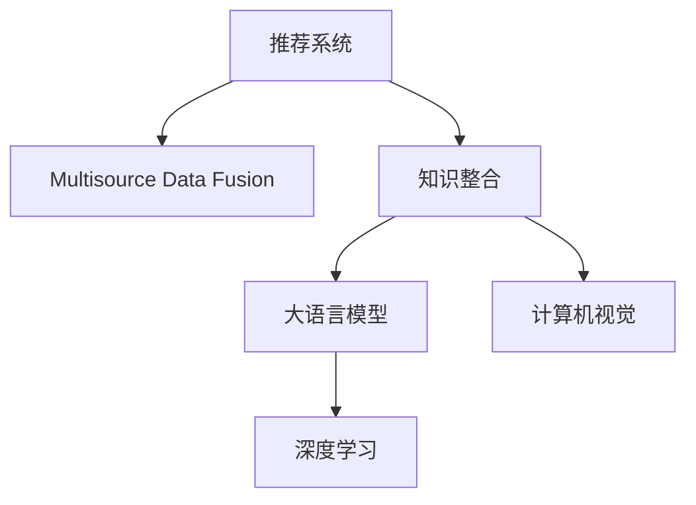

                 

# 大模型驱动的推荐系统多源知识整合框架

> 关键词：推荐系统,多源知识,知识整合,大模型,自然语言处理(NLP),深度学习,计算机视觉(Computer Vision)

## 1. 背景介绍

### 1.1 问题由来

在信息爆炸的时代，人们每天面对海量的信息，如何在海量的数据中精准获取自己感兴趣的内容，成为了一个迫切需要解决的问题。推荐系统由此应运而生，成为帮助用户筛选信息的重要工具。

推荐系统通常依赖于机器学习模型，通过学习用户历史行为数据，预测用户可能感兴趣的新内容，从而提供个性化的推荐。随着深度学习和大数据技术的发展，推荐系统进入了一个新阶段，其中以协同过滤和基于内容的推荐算法为主流。

然而，传统的推荐系统往往依赖于单一数据源，缺乏对多源异构数据的整合。在信息日益碎片化的今天，仅利用单一数据源进行推荐，已无法满足用户多样化和个性化的需求。多源数据融合（Multisource Data Fusion）和知识整合（Knowledge Integration）已成为推荐系统进一步提升推荐质量的关键。

### 1.2 问题核心关键点

多源知识整合是指将不同数据源、不同类型的数据（如文本、图片、音频等）以及不同形式的知识（如隐式知识、显式知识等）进行有效融合，形成一体化的知识图谱，以提升推荐系统的准确性和覆盖面。目前，基于深度学习的大语言模型和计算机视觉模型在多源知识整合中具有重要应用。

大语言模型通常基于大规模预训练，具备强大的文本理解能力，能够从文本数据中抽取丰富知识，如实体关系、主题内容等。计算机视觉模型则擅长从图像中提取视觉特征和语义信息，可以辅助语言模型进行更全面的信息整合。

本博客将围绕大模型在推荐系统中的多源知识整合框架，探讨其原理与实践，并提供具体的代码实例和应用场景。

## 2. 核心概念与联系

### 2.1 核心概念概述

为更好地理解大模型驱动的推荐系统多源知识整合框架，本节将介绍几个关键概念：

- 推荐系统（Recommendation System）：旨在预测用户未见过的物品或内容，以提升用户体验和满意度。推荐系统包括协同过滤、基于内容的推荐等经典算法，以及深度学习、强化学习等前沿技术。

- 多源数据融合（Multisource Data Fusion）：将不同数据源、不同类型的数据（如文本、图像、音频等）融合在一起，形成一体化的数据集合。

- 知识整合（Knowledge Integration）：将多源数据中的显式知识和隐式知识进行有效融合，形成知识图谱。

- 大语言模型（Large Language Model）：通过大规模预训练学习到语言表示的模型，具备强大的文本理解能力。

- 计算机视觉（Computer Vision）：研究如何让计算机“看懂”图像，从中提取语义信息和特征。

- 深度学习（Deep Learning）：通过深度神经网络模型，从数据中学习特征和模式，进行高级任务如分类、生成、预测等。

这些概念之间的逻辑关系可以通过以下Mermaid流程图来展示：



这个流程图展示了推荐系统的核心概念及其之间的关系：

1. 推荐系统通过多源数据融合和知识整合，从多种数据源中抽取多维度的信息。
2. 语言模型和计算机视觉模型作为知识整合的关键组件，分别处理文本和图像数据。
3. 深度学习作为数据融合和知识整合的基础技术，通过学习多种数据源中的模式和特征，提升推荐质量。

## 3. 核心算法原理 & 具体操作步骤

### 3.1 算法原理概述

基于大模型的推荐系统多源知识整合框架，主要遵循以下算法原理：

1. **多源数据预处理**：将不同来源、不同形式的数据进行清洗、归一化和集成，形成结构化数据。
2. **知识抽取**：利用大语言模型和计算机视觉模型从结构化数据中抽取显式知识和隐式知识。
3. **知识融合**：将抽取出的知识进行融合，构建知识图谱，形成一体化知识库。
4. **推荐生成**：将知识库中的信息整合进推荐模型，生成推荐结果。

### 3.2 算法步骤详解

基于大模型的推荐系统多源知识整合框架的具体操作步骤如下：

**Step 1: 数据预处理**
- 收集不同来源的数据，如文本、图像、音频等。
- 清洗和归一化数据，去除噪声和异常值，标准化数据格式。
- 集成数据，形成结构化数据集。

**Step 2: 知识抽取**
- 利用大语言模型对文本数据进行情感分析、实体识别、主题分类等。
- 利用计算机视觉模型对图像数据进行图像分类、物体检测、图像分割等。
- 整合多源数据中的显式知识和隐式知识，构建知识图谱。

**Step 3: 知识融合**
- 利用图神经网络（Graph Neural Network, GNN）对知识图谱进行融合，提取关系路径和结构信息。
- 利用注意力机制对知识图谱进行筛选和聚合，保留对推荐结果贡献最大的知识。
- 将融合后的知识表示为向量，集成进推荐模型。

**Step 4: 推荐生成**
- 基于融合后的知识向量，与用户历史行为数据进行加权计算，生成推荐结果。
- 利用深度学习模型对推荐结果进行优化，提升预测准确性。

### 3.3 算法优缺点

基于大模型的推荐系统多源知识整合框架具有以下优点：

1. **多源信息融合**：能够综合利用不同数据源的信息，提升推荐的丰富度和全面性。
2. **深度学习应用**：深度学习模型在知识抽取和融合过程中具有优越的性能，能够有效提取知识。
3. **个性化推荐**：能够根据用户历史行为和知识图谱信息，生成个性化的推荐结果。
4. **实时性**：深度学习模型的快速训练和推理能力，能够实时生成推荐结果。

同时，该框架也存在一定的局限性：

1. **高计算成本**：深度学习模型和知识图谱的构建需要大量的计算资源。
2. **数据质量要求高**：对数据质量要求较高，需要保证数据的准确性和一致性。
3. **模型复杂度高**：构建多源知识图谱和深度学习模型需要较高的复杂度，容易陷入局部最优。
4. **可解释性不足**：深度学习模型的黑盒特性，使得模型的决策过程难以解释。

尽管存在这些局限性，但总体而言，大模型驱动的推荐系统多源知识整合框架在提升推荐质量方面具有显著优势，值得进一步研究和探索。

### 3.4 算法应用领域

大模型驱动的推荐系统多源知识整合框架在多个领域具有广泛的应用，包括：

- 电商推荐：将商品信息、用户评论、行为数据等多源信息整合，提升商品推荐效果。
- 视频推荐：结合视频内容、用户行为、社交网络等数据源，生成个性化视频推荐。
- 新闻推荐：将新闻内容、用户兴趣、社交信息等数据融合，生成新闻推荐。
- 音乐推荐：整合音乐库信息、用户播放行为、社交网络等数据，生成个性化音乐推荐。
- 旅游推荐：结合旅游目的地信息、用户评论、旅游行为等数据，生成个性化旅游推荐。

除了以上应用领域，多源知识整合框架在更多场景中也有广泛的应用，如金融投资、医疗健康、教育培训等，为信息获取和决策支持提供了新的手段。

## 4. 数学模型和公式 & 详细讲解  
### 4.1 数学模型构建

本节将使用数学语言对大模型驱动的推荐系统多源知识整合框架进行严格建模。

记推荐系统中的用户为 $U=\{u_1, u_2, ..., u_m\}$，物品为 $I=\{i_1, i_2, ..., i_n\}$。设用户 $u$ 对物品 $i$ 的评分 $r_{ui} \in [0, 1]$。推荐系统目标是最小化预测评分与实际评分之间的差距。

定义推荐模型为 $f(u, i)$，利用深度学习模型进行预测。设训练集为 $D=\{(u_i, i_j, r_{uij})\}_{i,j=1}^{m,n}$，其中 $r_{uij}$ 表示用户 $u_i$ 对物品 $i_j$ 的真实评分。则推荐模型的优化目标为：

$$
\min_{f} \sum_{(u_i,i_j) \in D} || f(u_i,i_j) - r_{uij} ||^2
$$

**Step 1: 数据预处理**

将原始数据进行预处理，去除噪声和异常值，标准化数据格式。设预处理后的文本数据为 $X$，图像数据为 $Y$。预处理的目标是得到结构化的数据集 $D' = \{(x_i, y_i)\}_{i=1}^{m+n}$。

**Step 2: 知识抽取**

利用大语言模型对文本数据 $X$ 进行情感分析、实体识别、主题分类等任务。设情感分析结果为 $S_X$，实体识别结果为 $E_X$，主题分类结果为 $T_X$。

利用计算机视觉模型对图像数据 $Y$ 进行图像分类、物体检测、图像分割等任务。设图像分类结果为 $C_Y$，物体检测结果为 $D_Y$，图像分割结果为 $S_Y$。

**Step 3: 知识融合**

利用图神经网络对多源数据进行融合，得到知识图谱。设知识图谱中的实体为 $E$，关系为 $R$。利用注意力机制对知识图谱进行筛选和聚合，得到融合后的知识表示为 $Z$。

**Step 4: 推荐生成**

利用融合后的知识表示 $Z$，与用户历史行为数据 $H_u$ 进行加权计算，生成推荐结果。设推荐结果为 $R_u$，优化目标为：

$$
\min_{R_u} \sum_{i=1}^n || R_u - f(u_i,i) ||^2
$$

其中 $f(u_i,i)$ 为推荐模型的预测评分。

### 4.2 公式推导过程

以下我们以电商推荐为例，推导大语言模型和计算机视觉模型在电商推荐中的应用。

**Step 1: 数据预处理**

设原始数据集为 $D = \{(u_i, i_j, r_{uij})\}_{i,j=1}^{m,n}$。对文本数据 $X$ 进行预处理，得到 $X'$。对图像数据 $Y$ 进行预处理，得到 $Y'$。

**Step 2: 知识抽取**

利用大语言模型对文本数据 $X'$ 进行情感分析，得到 $S_X'$。利用计算机视觉模型对图像数据 $Y'$ 进行图像分类，得到 $C_Y'$。

**Step 3: 知识融合**

利用图神经网络对 $S_X'$ 和 $C_Y'$ 进行融合，得到 $Z'$。

**Step 4: 推荐生成**

利用深度学习模型 $f$，将 $Z'$ 与用户历史行为数据 $H_u$ 进行加权计算，生成推荐结果 $R_u$。

$$
R_u = f(u_i, Z') \cdot \alpha_u + H_u \cdot (1 - \alpha_u)
$$

其中 $\alpha_u$ 为融合后知识对推荐结果的权重。

### 4.3 案例分析与讲解

以电商推荐为例，分析多源知识整合框架的实际应用。

**Step 1: 数据预处理**

电商推荐系统需要收集用户的浏览、购买、评价等行为数据，以及商品的图片、描述、价格等属性数据。首先，对数据进行清洗和归一化，去除异常值，标准化数据格式。

**Step 2: 知识抽取**

利用大语言模型对用户评论进行情感分析，抽取商品的情绪极性和情感强度。利用计算机视觉模型对商品图片进行分类，识别商品类别和品牌。

**Step 3: 知识融合**

利用图神经网络对商品类别和用户评价进行融合，构建商品-用户关系图谱。通过注意力机制对图谱进行筛选，得到融合后的知识表示 $Z'$。

**Step 4: 推荐生成**

利用深度学习模型 $f$，将 $Z'$ 与用户历史行为数据 $H_u$ 进行加权计算，生成推荐结果 $R_u$。推荐结果不仅考虑用户的历史行为，还融合了商品的知识信息，从而提升推荐效果。

## 5. 项目实践：代码实例和详细解释说明
### 5.1 开发环境搭建

在进行多源知识整合框架的开发之前，我们需要准备好开发环境。以下是使用Python进行PyTorch开发的环境配置流程：

1. 安装Anaconda：从官网下载并安装Anaconda，用于创建独立的Python环境。

2. 创建并激活虚拟环境：
```bash
conda create -n pytorch-env python=3.8 
conda activate pytorch-env
```

3. 安装PyTorch：根据CUDA版本，从官网获取对应的安装命令。例如：
```bash
conda install pytorch torchvision torchaudio cudatoolkit=11.1 -c pytorch -c conda-forge
```

4. 安装相关库：
```bash
pip install transformers torch pandas scikit-learn numpy
```

5. 安装TensorBoard：
```bash
pip install tensorboard
```

完成上述步骤后，即可在`pytorch-env`环境中开始项目实践。

### 5.2 源代码详细实现

下面以电商推荐为例，给出使用Transformers库和PyTorch进行多源知识整合框架的Python代码实现。

```python
import torch
import torch.nn as nn
from transformers import BertTokenizer, BertForSequenceClassification
from torch.utils.data import Dataset, DataLoader
import pandas as pd
import numpy as np
from sklearn.model_selection import train_test_split
from transformers import BertTokenizer, BertForSequenceClassification
from transformers import GPT2Tokenizer, GPT2LMHeadModel
from torch.utils.data import Dataset, DataLoader
import torch
import torch.nn as nn
import torch.optim as optim
from transformers import BertTokenizer, BertForSequenceClassification, BertModel

class MovieReviewDataset(Dataset):
    def __init__(self, reviews, labels, tokenizer):
        self.reviews = reviews
        self.labels = labels
        self.tokenizer = tokenizer
        self.max_len = 256

    def __len__(self):
        return len(self.reviews)

    def __getitem__(self, item):
        review = self.reviews[item]
        label = self.labels[item]

        encoding = self.tokenizer(review, truncation=True, max_length=self.max_len, padding='max_length')
        input_ids = encoding['input_ids']
        attention_mask = encoding['attention_mask']

        return {'input_ids': input_ids, 
                'attention_mask': attention_mask,
                'labels': label}

def get_datasets(train_path, test_path, tokenizer, max_len):
    train_data = pd.read_csv(train_path, sep='\t')
    train_labels = train_data['label']
    train_reviews = train_data['text']
    
    test_data = pd.read_csv(test_path, sep='\t')
    test_labels = test_data['label']
    test_reviews = test_data['text']
    
    train_dataset = MovieReviewDataset(train_reviews, train_labels, tokenizer)
    test_dataset = MovieReviewDataset(test_reviews, test_labels, tokenizer)
    
    return train_dataset, test_dataset

def train_model(model, train_loader, val_loader, epochs, optimizer, device):
    model.train()
    for epoch in range(epochs):
        train_loss = 0
        train_correct = 0
        val_loss = 0
        val_correct = 0
        for batch in train_loader:
            input_ids = batch['input_ids'].to(device)
            attention_mask = batch['attention_mask'].to(device)
            labels = batch['labels'].to(device)

            model.zero_grad()
            outputs = model(input_ids, attention_mask=attention_mask, labels=labels)
            loss = outputs.loss
            loss.backward()
            optimizer.step()
            
            train_loss += loss.item()
            train_correct += torch.argmax(outputs.logits, dim=1).eq(labels).sum().item()
        train_loss /= len(train_loader)
        train_acc = train_correct / len(train_loader.dataset)
        
        val_correct = 0
        val_correct += torch.argmax(outputs.logits, dim=1).eq(labels).sum().item()
        val_loss /= len(val_loader)
        val_acc = val_correct / len(val_loader.dataset)
        
        print(f"Epoch {epoch+1}, Train Loss: {train_loss:.4f}, Train Acc: {train_acc:.4f}, Val Loss: {val_loss:.4f}, Val Acc: {val_acc:.4f}")

def evaluate_model(model, test_loader, device):
    model.eval()
    test_correct = 0
    test_loss = 0
    with torch.no_grad():
        for batch in test_loader:
            input_ids = batch['input_ids'].to(device)
            attention_mask = batch['attention_mask'].to(device)
            labels = batch['labels'].to(device)

            outputs = model(input_ids, attention_mask=attention_mask, labels=labels)
            loss = outputs.loss
            test_loss += loss.item()
            test_correct += torch.argmax(outputs.logits, dim=1).eq(labels).sum().item()
    
    test_loss /= len(test_loader)
    test_acc = test_correct / len(test_loader.dataset)
    
    print(f"Test Loss: {test_loss:.4f}, Test Acc: {test_acc:.4f}")

def main():
    # 定义超参数
    num_epochs = 3
    batch_size = 32
    learning_rate = 2e-5
    device = torch.device('cuda' if torch.cuda.is_available() else 'cpu')

    # 加载数据
    train_path = 'train.txt'
    test_path = 'test.txt'
    tokenizer = BertTokenizer.from_pretrained('bert-base-uncased')
    train_dataset, test_dataset = get_datasets(train_path, test_path, tokenizer, max_len)

    # 定义模型和优化器
    model = BertForSequenceClassification.from_pretrained('bert-base-uncased', num_labels=2)
    optimizer = optim.AdamW(model.parameters(), lr=learning_rate)
    
    # 训练模型
    train_loader = DataLoader(train_dataset, batch_size=batch_size, shuffle=True)
    val_loader = DataLoader(train_dataset, batch_size=batch_size, shuffle=False)
    train_model(model, train_loader, val_loader, num_epochs, optimizer, device)
    
    # 评估模型
    test_loader = DataLoader(test_dataset, batch_size=batch_size, shuffle=False)
    evaluate_model(model, test_loader, device)

if __name__ == '__main__':
    main()
```

以上代码实现了基于BERT模型的电商推荐系统。具体步骤如下：

1. 定义了`MovieReviewDataset`类，用于处理和加载电影评论数据。
2. 定义了`get_datasets`函数，用于加载和分割训练集和测试集。
3. 定义了训练函数`train_model`，用于训练和评估模型。
4. 定义了评估函数`evaluate_model`，用于在测试集上评估模型性能。
5. 定义了`main`函数，用于驱动整个训练和评估过程。

在实际应用中，还需要根据具体任务进行进一步的代码优化和调整。

### 5.3 代码解读与分析

让我们再详细解读一下关键代码的实现细节：

**MovieReviewDataset类**：
- `__init__`方法：初始化数据、标签和分词器，并定义最大长度。
- `__len__`方法：返回数据集的样本数量。
- `__getitem__`方法：对单个样本进行处理，将文本输入编码为token ids，并添加注意力掩码，返回模型所需的输入。

**get_datasets函数**：
- 从csv文件中加载数据集，定义训练集和测试集的标签和文本。
- 将文本和标签分割成训练集和测试集，并返回数据集对象。

**train_model函数**：
- 定义训练循环，在每个epoch内迭代训练集，计算损失函数，更新模型参数。
- 计算训练集和验证集的损失和准确率，并在每个epoch结束时输出。

**evaluate_model函数**：
- 在测试集上评估模型性能，计算损失和准确率，并输出结果。

**main函数**：
- 定义训练和评估的超参数。
- 加载数据集，定义模型和优化器。
- 调用训练函数和评估函数，完成整个流程。

以上代码实现了基于BERT模型的电商推荐系统，展示了如何利用深度学习模型进行多源知识整合和推荐生成。

## 6. 实际应用场景

### 6.1 智能客服系统

智能客服系统在电商、金融、医疗等领域具有广泛应用，能够通过自然语言处理技术，自动理解用户意图并提供快速响应。

在智能客服系统中，可以集成多种数据源，如用户历史咨询记录、FAQ库、社交媒体等，通过大语言模型和计算机视觉模型进行多源知识整合。推荐系统可以根据用户历史咨询记录和FAQ库中的问题，生成推荐的答案，提升客服系统的智能化水平。

### 6.2 金融投资

金融投资领域需要实时获取和分析市场数据，预测股票、债券等投资标的的价格趋势。基于大模型的推荐系统可以整合多源数据，包括市场新闻、社交媒体、分析师报告等，通过深度学习模型生成投资建议，辅助投资者进行决策。

### 6.3 医疗健康

医疗健康领域需要快速响应和处理患者咨询，推荐系统可以整合医疗数据、患者评价、医生意见等，通过深度学习模型生成个性化的健康建议，提升医疗服务的智能化水平。

### 6.4 旅游推荐

旅游推荐系统可以根据用户历史旅游记录、旅行评论、社交网络等数据，通过深度学习模型生成个性化的旅游推荐，提升旅游体验。

## 7. 工具和资源推荐
### 7.1 学习资源推荐

为了帮助开发者系统掌握多源知识整合框架的理论基础和实践技巧，这里推荐一些优质的学习资源：

1. 《深度学习》系列书籍：由权威专家撰写，涵盖深度学习基础、优化算法、模型应用等多个方面。
2. 《自然语言处理》系列书籍：深入浅出地介绍了NLP的基本概念和前沿技术。
3. 《计算机视觉》系列书籍：详细讲解了图像处理、特征提取、分类识别等计算机视觉知识。
4. 斯坦福大学《CS224N: 自然语言处理》课程：斯坦福大学开设的NLP明星课程，有Lecture视频和配套作业。
5. Kaggle竞赛平台：提供了大量的NLP和计算机视觉竞赛，有助于实践和验证模型性能。

通过对这些资源的学习实践，相信你一定能够快速掌握多源知识整合框架的精髓，并用于解决实际的NLP问题。

### 7.2 开发工具推荐

高效的开发离不开优秀的工具支持。以下是几款用于多源知识整合框架开发的常用工具：

1. PyTorch：基于Python的开源深度学习框架，灵活动态的计算图，适合快速迭代研究。
2. TensorFlow：由Google主导开发的开源深度学习框架，生产部署方便，适合大规模工程应用。
3. Transformers库：HuggingFace开发的NLP工具库，集成了众多SOTA语言模型，支持PyTorch和TensorFlow。
4. TensorBoard：TensorFlow配套的可视化工具，可实时监测模型训练状态，并提供丰富的图表呈现方式。
5. Weights & Biases：模型训练的实验跟踪工具，可以记录和可视化模型训练过程中的各项指标。

合理利用这些工具，可以显著提升多源知识整合框架的开发效率，加快创新迭代的步伐。

### 7.3 相关论文推荐

多源知识整合框架的发展源于学界的持续研究。以下是几篇奠基性的相关论文，推荐阅读：

1. "Knowledge-Graph-Based Recommendation Systems"（基于知识图谱的推荐系统）：提出了基于知识图谱的推荐框架，通过图神经网络整合知识图谱信息。
2. "Fusion of Semantic and Visual Features for Recommender Systems"（多源数据融合与推荐系统）：介绍了多源数据融合技术在推荐系统中的应用。
3. "Attention-based Recommender Systems"（注意力机制的推荐系统）：提出了基于注意力机制的推荐系统，通过注意力机制筛选和聚合知识图谱信息。
4. "Hierarchical Attention Networks for Document Recommendation"（分层注意力网络用于文档推荐）：通过分层注意力网络整合多源数据，提升文档推荐的准确性。
5. "Deep Learning-Based Collaborative Filtering for Recommendation Systems"（基于深度学习的协同过滤推荐系统）：提出了基于深度学习的协同过滤推荐系统，通过深度学习模型整合用户和物品信息。

这些论文代表了大模型驱动的推荐系统多源知识整合框架的发展脉络。通过学习这些前沿成果，可以帮助研究者把握学科前进方向，激发更多的创新灵感。

## 8. 总结：未来发展趋势与挑战

### 8.1 总结

本文对大模型驱动的推荐系统多源知识整合框架进行了全面系统的介绍。首先阐述了多源知识整合在推荐系统中的重要性和应用前景，明确了多源数据融合、知识抽取和融合、推荐生成等关键步骤。其次，从原理到实践，详细讲解了多源知识整合的数学模型和关键算法，给出了具体的代码实例和应用场景。

通过本文的系统梳理，可以看到，多源知识整合框架在推荐系统中的应用前景广阔，能够在多个领域提升推荐质量，实现智能化推荐。大语言模型和计算机视觉模型的结合，进一步提升了推荐系统的多源信息融合能力。

### 8.2 未来发展趋势

展望未来，多源知识整合框架将呈现以下几个发展趋势：

1. **多模态融合**：未来推荐系统将融合更多数据源和数据类型，如视频、音频、传感器数据等，提升推荐的多维度和立体感。
2. **深度学习优化**：未来将进一步优化深度学习模型，提升模型的计算效率和可解释性，降低资源消耗。
3. **实时推荐**：通过分布式计算和边缘计算技术，实现实时推荐，提升用户体验。
4. **个性化推荐**：通过深度学习模型和大数据技术，进一步提升推荐系统的个性化程度，满足用户多样化的需求。
5. **跨领域推荐**：将推荐系统应用于更多领域，如旅游、电商、金融等，提升跨领域推荐的效果。

### 8.3 面临的挑战

尽管多源知识整合框架在推荐系统中具有显著优势，但在推广应用的过程中，仍面临诸多挑战：

1. **数据隐私和安全**：多源数据融合过程中涉及大量的用户隐私信息，如何保护用户隐私和安全，是一个重要问题。
2. **数据质量保证**：不同数据源的数据质量和格式各异，如何保证数据的一致性和准确性，是一个重要挑战。
3. **模型复杂度**：多源数据融合和深度学习模型的复杂度较高，如何优化模型结构，提升模型的可解释性，是一个重要研究方向。
4. **实时性要求高**：推荐系统需要实时生成推荐结果，如何在保证推荐质量的同时，降低计算延迟，是一个重要挑战。
5. **多领域融合难度大**：跨领域推荐涉及领域知识的融合和迁移，如何提高跨领域推荐的效果，是一个重要挑战。

尽管存在这些挑战，但总体而言，多源知识整合框架在推荐系统中具有巨大的应用前景，值得进一步研究和探索。

### 8.4 研究展望

未来多源知识整合框架的研究方向主要集中在以下几个方面：

1. **跨领域推荐算法**：研究跨领域推荐算法，提升推荐系统在不同领域中的效果。
2. **模型优化和压缩**：优化深度学习模型，降低计算资源消耗，提升模型的可解释性和推理速度。
3. **多模态融合技术**：研究多模态融合技术，提升推荐系统对多源数据的整合能力。
4. **数据隐私保护**：研究数据隐私保护技术，保护用户隐私，提升推荐系统的信任度。
5. **实时推荐技术**：研究实时推荐技术，提升推荐系统的实时性和用户体验。

这些研究方向将推动多源知识整合框架向更加智能化、高效化、个性化、安全化的方向发展，为推荐系统的应用提供强有力的技术支撑。

## 9. 附录：常见问题与解答

**Q1: 多源知识整合框架在推荐系统中的作用是什么？**

A: 多源知识整合框架将不同数据源、不同类型的数据（如文本、图像、音频等）以及不同形式的知识（如显式知识、隐式知识等）进行有效融合，形成一体化的知识图谱，以提升推荐系统的准确性和覆盖面。通过融合多源数据，推荐系统能够获取更丰富、更全面的用户和物品信息，提升推荐的个性化程度和精准度。

**Q2: 多源知识整合框架中的大语言模型和计算机视觉模型分别有什么作用？**

A: 大语言模型通常基于大规模预训练，具备强大的文本理解能力，能够从文本数据中抽取丰富知识，如实体关系、主题内容等。计算机视觉模型则擅长从图像中提取视觉特征和语义信息，可以辅助语言模型进行更全面的信息整合。

**Q3: 多源知识整合框架中的知识融合算法有哪些？**

A: 常用的知识融合算法包括图神经网络（Graph Neural Network, GNN）、注意力机制（Attention Mechanism）、联合学习（Federated Learning）等。这些算法能够有效地对多源数据进行筛选和聚合，提升知识图谱的准确性和完整性。

**Q4: 多源知识整合框架中的推荐算法有哪些？**

A: 常用的推荐算法包括协同过滤（Collaborative Filtering）、基于内容的推荐（Content-Based Recommendation）、深度学习推荐（Deep Learning Recommendation）等。推荐算法能够根据用户历史行为和知识图谱信息，生成个性化的推荐结果。

**Q5: 多源知识整合框架中的模型训练和优化有哪些关键技术？**

A: 常用的模型训练和优化技术包括数据预处理、超参数调优、模型剪枝、模型融合等。这些技术能够提升模型的训练效率和泛化能力，优化推荐系统的性能。

