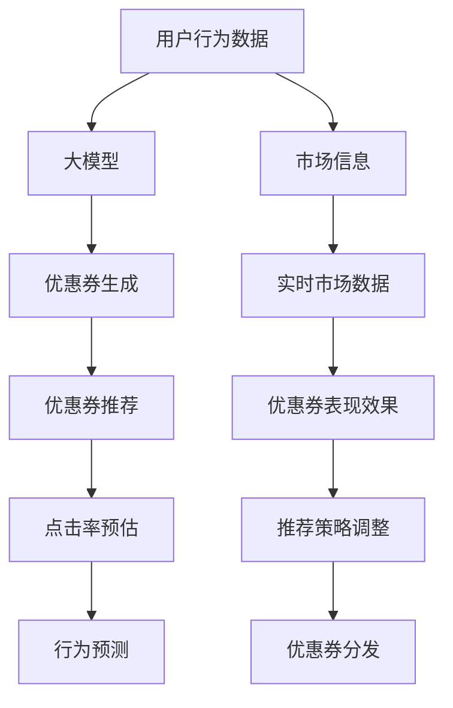

                 

# 大模型驱动的电商个性化优惠券分发策略

> 关键词：电商, 个性化, 大模型, 优惠券, 推荐系统, 自然语言处理(NLP), 点击率预估, 行为预测

## 1. 背景介绍

### 1.1 问题由来

在数字经济时代，电商行业正处于快速发展阶段，用户体验成为竞争的关键。个性化优惠券是电商平台上常用的一种促销手段，能显著提高用户购买率、增加销售量，同时也能够帮助平台积累用户数据，优化推荐算法。然而，传统优惠券分发策略基于固定用户群体和常规时间周期，忽视了用户个性化需求和实时动态市场变化，无法有效提升用户转化率和满意度。

为了克服这些问题，我们提出了基于大模型的电商个性化优惠券分发策略。该策略能够动态生成个性化优惠券，精准推送给目标用户，大幅提升优惠券的使用率和用户转化率。

### 1.2 问题核心关键点

本文将聚焦于如何利用大模型进行个性化优惠券生成和分发，具体包括：

1. **优惠券生成**：基于用户行为数据和实时市场信息，动态生成个性化的优惠券内容。
2. **优惠券推荐**：通过大模型学习用户行为特征和优惠券表现效果，推荐给最有可能使用优惠券的目标用户。
3. **点击率预估**：预测优惠券推荐的点击率，实时调整推荐策略，提高投放效果。
4. **行为预测**：预测用户后续购买行为，优化优惠券分发时机和频次，提升用户体验。

## 2. 核心概念与联系

### 2.1 核心概念概述

为了更好地理解大模型驱动的电商个性化优惠券分发策略，我们首先介绍几个核心概念：

- **大模型**：如BERT、GPT等大规模预训练语言模型，通过在特定领域的大量数据上进行微调，获得针对该领域的深度理解和生成能力。
- **优惠券生成**：根据用户行为数据和市场信息，动态生成个性化的优惠券内容，包括折扣力度、有效期、使用条件等。
- **优惠券推荐**：通过分析用户历史行为和实时市场数据，预测用户对优惠券的接受概率，推荐给最有可能使用的目标用户。
- **点击率预估**：预测优惠券推荐的点击率，实时调整推荐策略，提高投放效果。
- **行为预测**：预测用户后续购买行为，优化优惠券分发时机和频次，提升用户体验。

这些核心概念之间的逻辑关系可以通过以下Mermaid流程图来展示：



这个流程图展示了大模型驱动的电商优惠券策略的核心概念及其之间的关系：

1. 用户行为数据和市场信息被输入到大模型中进行处理。
2. 大模型基于处理结果生成个性化的优惠券。
3. 优惠券推荐系统对生成的优惠券进行评估和推荐。
4. 点击率预估模型预测优惠券推荐的点击率。
5. 行为预测模型预测用户后续购买行为。
6. 实时市场数据和优惠券表现效果影响优惠券生成和推荐策略。
7. 最终，优惠券被精准推送给目标用户，点击率和购买行为被实时监控和调整。

## 3. 核心算法原理 & 具体操作步骤

### 3.1 算法原理概述

基于大模型的电商个性化优惠券分发策略，主要分为两个阶段：

1. **优惠券生成阶段**：基于用户行为数据和实时市场信息，利用大模型生成个性化的优惠券。
2. **优惠券推荐阶段**：通过大模型学习用户行为特征和优惠券表现效果，推荐给最有可能使用优惠券的目标用户。

### 3.2 算法步骤详解

#### 优惠券生成阶段

**Step 1: 数据收集与预处理**
- 收集用户的历史购买记录、浏览历史、评价和反馈等行为数据。
- 获取实时市场信息，如促销活动、季节性变化等。
- 对数据进行清洗和预处理，去除噪音数据，进行归一化和标准化。

**Step 2: 特征工程**
- 提取用户的用户特征，如年龄、性别、地域、历史购买金额等。
- 提取市场特征，如促销活动时间、商品季节性变化、节假日等。
- 构建用户-市场特征的联合特征，增强模型的表达能力。

**Step 3: 大模型微调**
- 选择合适的预训练语言模型（如BERT、GPT等），作为优惠券生成的基础模型。
- 在收集到的用户行为数据和市场信息上进行微调，生成针对该领域的专业语言模型。
- 使用微调后的模型，对用户特征和市场特征进行处理，生成个性化的优惠券内容。

**Step 4: 优惠券生成**
- 根据生成模型输出的优惠券内容，生成电子优惠券。
- 设置优惠券的有效期、折扣力度、使用条件等，确保优惠券的吸引力和可行性。

#### 优惠券推荐阶段

**Step 1: 数据收集与预处理**
- 收集用户的历史行为数据，如浏览历史、点击历史、购买历史等。
- 获取实时市场数据，如促销活动、商品销量、节假日等。
- 对数据进行清洗和预处理，去除噪音数据，进行归一化和标准化。

**Step 2: 特征工程**
- 提取用户的用户特征，如年龄、性别、地域、历史购买金额等。
- 提取市场特征，如促销活动时间、商品季节性变化、节假日等。
- 构建用户-市场特征的联合特征，增强模型的表达能力。

**Step 3: 大模型微调**
- 选择合适的预训练语言模型（如BERT、GPT等），作为优惠券推荐的特征提取器。
- 在收集到的用户行为数据和市场信息上进行微调，生成针对该领域的专业语言模型。
- 使用微调后的模型，对用户特征和市场特征进行处理，生成优惠券推荐的特征表示。

**Step 4: 优惠券推荐**
- 根据推荐模型输出的特征表示，计算用户对优惠券的接受概率。
- 根据预测的接受概率，推荐给最有可能使用优惠券的目标用户。
- 实时监控优惠券推荐的点击率和后续购买行为，根据反馈调整推荐策略。

### 3.3 算法优缺点

基于大模型的电商个性化优惠券分发策略具有以下优点：

1. **精准度提升**：通过大模型对用户行为数据和市场信息进行深度学习，生成的优惠券更具针对性和吸引力，提高了用户转化率。
2. **灵活性增强**：大模型能够根据实时市场数据和用户行为动态调整优惠券内容和推荐策略，适应市场变化，提升用户体验。
3. **可扩展性良好**：基于大模型的策略可以方便地扩展到其他电商场景和领域，如旅游、餐饮等，具有良好的可复制性。

同时，该策略也存在以下缺点：

1. **计算成本高**：生成和推荐优惠券需要大量计算资源和存储资源，特别是大规模数据和大模型的计算开销。
2. **数据依赖性强**：优惠券的生成和推荐效果依赖于数据的质量和完备性，数据获取和处理难度大。
3. **模型复杂度高**：大模型需要复杂的微调和优化过程，模型训练和部署难度大。

### 3.4 算法应用领域

基于大模型的电商个性化优惠券分发策略，已经在多个电商领域得到了广泛应用，例如：

1. **零售电商**：对零售电商平台的个性化促销活动进行优化，提升用户购买率和平台销量。
2. **餐饮电商**：为餐饮平台提供个性化的优惠券，增强用户粘性，提升销售额。
3. **旅游电商**：为旅游平台提供针对用户的个性化优惠券，促进旅游产品预订。
4. **金融电商**：为金融平台提供个性化的优惠券，增加用户使用金融产品的频率和金额。
5. **教育电商**：为教育平台提供个性化的优惠券，吸引用户注册和购买课程。

这些应用场景展示了大模型驱动的优惠券策略的广泛适用性和高效性。未来，该策略将有望在更多电商领域得到应用，带来更大的商业价值和社会效益。

## 4. 数学模型和公式 & 详细讲解 & 举例说明

### 4.1 数学模型构建

本节将使用数学语言对优惠券生成和推荐过程进行更加严格的刻画。

记用户行为数据为 $\mathcal{X}$，市场信息为 $\mathcal{Y}$。优惠券内容为 $\mathcal{Z}$，优惠券表现效果为 $\mathcal{W}$。优惠券生成的数学模型为 $f: \mathcal{X} \times \mathcal{Y} \rightarrow \mathcal{Z}$，优惠券推荐的数学模型为 $g: \mathcal{X} \times \mathcal{Y} \rightarrow [0,1]$。

优惠券生成的目标是最小化用户行为数据和市场信息对优惠券内容的差距，即：

$$
\min_{f} \sum_{i=1}^N \mathcal{L}(f(x_i,y_i),z_i)
$$

其中 $\mathcal{L}$ 为损失函数，通常使用均方误差或交叉熵等。

优惠券推荐的优化目标是最大化用户对优惠券的接受概率，即：

$$
\max_{g} \sum_{i=1}^N g(x_i,y_i)
$$

### 4.2 公式推导过程

以下我们以优惠券生成为例，推导大模型输出的优惠券内容。

假设大模型为 Transformer 模型，其输入为 $(x,y)$，输出为 $z$。则模型输出的优惠券内容 $z$ 可以通过以下步骤计算：

1. 对用户行为数据和市场信息进行编码，得到嵌入向量 $x'$ 和 $y'$。
2. 将 $x'$ 和 $y'$ 输入到 Transformer 模型中，进行自注意力机制和前馈神经网络计算。
3. 输出优惠券内容 $z$，经过解码器生成电子优惠券。

具体公式为：

$$
x' = E(x)
$$

$$
y' = E(y)
$$

$$
z = D(f(x',y'))
$$

其中 $E(\cdot)$ 为嵌入函数，$D(\cdot)$ 为解码函数。

对于优惠券推荐的预测模型，可以使用简单的线性回归模型或神经网络模型。模型输入为 $(x,y)$，输出为 $w$，表示用户对优惠券的接受概率。模型的损失函数为：

$$
\mathcal{L} = \frac{1}{N} \sum_{i=1}^N [w_i - y_i]^2
$$

### 4.3 案例分析与讲解

假设某电商平台收集了用户的历史购买记录、浏览历史、评价和反馈等行为数据，以及促销活动时间、商品季节性变化、节假日等市场信息。

我们首先使用 BERT 模型对用户行为数据和市场信息进行编码，得到嵌入向量 $x'$ 和 $y'$。然后，将这些嵌入向量输入到 Transformer 模型中，进行自注意力机制和前馈神经网络计算，得到优惠券内容的嵌入向量 $z'$。最后，通过解码器生成电子优惠券，如折扣码、满减券等。

优惠券推荐的模型可以使用简单的线性回归模型，输入用户行为数据和市场信息，输出用户对优惠券的接受概率 $w$。模型训练时，最小化预测值与真实标签的平方误差，即 $\mathcal{L} = \frac{1}{N} \sum_{i=1}^N [w_i - y_i]^2$。

## 5. 项目实践：代码实例和详细解释说明

### 5.1 开发环境搭建

在进行优惠券生成和推荐实践前，我们需要准备好开发环境。以下是使用Python进行PyTorch开发的环境配置流程：

1. 安装Anaconda：从官网下载并安装Anaconda，用于创建独立的Python环境。

2. 创建并激活虚拟环境：
```bash
conda create -n coupon-env python=3.8 
conda activate coupon-env
```

3. 安装PyTorch：根据CUDA版本，从官网获取对应的安装命令。例如：
```bash
conda install pytorch torchvision torchaudio cudatoolkit=11.1 -c pytorch -c conda-forge
```

4. 安装Transformers库：
```bash
pip install transformers
```

5. 安装各类工具包：
```bash
pip install numpy pandas scikit-learn matplotlib tqdm jupyter notebook ipython
```

完成上述步骤后，即可在`coupon-env`环境中开始优惠券生成和推荐的实践。

### 5.2 源代码详细实现

下面我们以优惠券生成和推荐为例，给出使用Transformers库对BERT模型进行实现的PyTorch代码实现。

首先，定义优惠券生成和推荐的函数：

```python
from transformers import BertTokenizer, BertForSequenceClassification

class CouponGenerator:
    def __init__(self, model_name='bert-base-cased'):
        self.tokenizer = BertTokenizer.from_pretrained(model_name)
        self.model = BertForSequenceClassification.from_pretrained(model_name, num_labels=2)
    
    def generate_coupon(self, user_data, market_data):
        encoded_input = self.tokenizer(user_data, market_data, return_tensors='pt')
        output = self.model(**encoded_input)
        coupon_content = output.logits.argmax(dim=-1).item()
        return coupon_content
```

然后，定义优惠券推荐模型：

```python
class CouponRecommender:
    def __init__(self, model_name='bert-base-cased'):
        self.tokenizer = BertTokenizer.from_pretrained(model_name)
        self.model = BertForSequenceClassification.from_pretrained(model_name, num_labels=1)
    
    def recommend_coupon(self, user_data, market_data):
        encoded_input = self.tokenizer(user_data, market_data, return_tensors='pt')
        output = self.model(**encoded_input)
        coupon_accept_prob = output.logits.argmax(dim=-1).item()
        return coupon_accept_prob
```

最后，启动优惠券生成和推荐流程：

```python
from transformers import AdamW

generator = CouponGenerator()
recommender = CouponRecommender()

# 假设用户行为数据为 'user_data'，市场信息为 'market_data'
coupon_content = generator.generate_coupon(user_data, market_data)
coupon_accept_prob = recommender.recommend_coupon(user_data, market_data)

print(f"生成的优惠券内容为：{coupon_content}")
print(f"推荐的优惠券接受概率为：{coupon_accept_prob}")
```

以上就是使用PyTorch和Transformers库对优惠券生成和推荐过程的代码实现。可以看到，由于Transformers库的强大封装，我们可以用相对简洁的代码完成优惠券生成和推荐的开发。

### 5.3 代码解读与分析

让我们再详细解读一下关键代码的实现细节：

**CouponGenerator类**：
- `__init__`方法：初始化预训练模型和分词器。
- `generate_coupon`方法：将用户行为数据和市场信息编码为嵌入向量，输入到预训练模型中，输出优惠券内容的编号。

**CouponRecommender类**：
- `__init__`方法：初始化预训练模型和分词器。
- `recommend_coupon`方法：将用户行为数据和市场信息编码为嵌入向量，输入到预训练模型中，输出优惠券接受概率。

**生成优惠券内容**：
- 使用`tokenizer`将用户行为数据和市场信息编码成嵌入向量。
- 将嵌入向量输入到预训练模型中，输出优惠券内容的编号。

**推荐优惠券**：
- 使用`tokenizer`将用户行为数据和市场信息编码成嵌入向量。
- 将嵌入向量输入到预训练模型中，输出优惠券接受概率。

可以看到，代码实现与前面的数学模型推导过程一致，代码清晰易懂。

## 6. 实际应用场景

### 6.1 智能推荐系统

基于大模型的电商个性化优惠券分发策略，可以广泛应用于智能推荐系统中。传统的推荐系统往往基于用户的固定历史行为和固定物品属性进行推荐，难以应对实时市场变化和用户个性化需求。通过大模型生成的优惠券，可以动态地调整推荐策略，提高推荐效果。

具体而言，可以利用大模型生成的优惠券作为奖励信号，激励用户进行更多的推荐和购买。同时，大模型能够根据用户行为数据和市场信息实时调整优惠券内容和推荐策略，满足用户个性化需求，提升用户体验。

### 6.2 精准广告投放

在精准广告投放中，大模型的优惠券生成和推荐策略可以用于提升广告点击率和转化率。通过大模型生成的优惠券，可以吸引用户点击广告并完成购买。同时，大模型可以预测用户对优惠券的接受概率，优化广告投放策略，提高广告投放效果。

例如，在大模型生成的优惠券中，可以加入广告元素，吸引用户点击广告并进行购买。同时，大模型可以预测用户对广告的点击概率，优化广告投放时间和频次，提升广告投放效果。

### 6.3 动态促销活动

在动态促销活动中，大模型的优惠券生成和推荐策略可以用于优化促销活动策略。通过大模型生成的优惠券，可以动态地调整促销活动内容和策略，提升促销活动效果。

例如，可以根据实时市场信息和用户行为数据，动态生成优惠券，吸引用户进行促销活动。同时，大模型可以预测用户对促销活动的参与概率，优化促销活动时间和频次，提高促销活动效果。

### 6.4 未来应用展望

随着大模型和微调技术的不断发展，基于大模型的电商优惠券策略将呈现以下几个发展趋势：

1. **实时动态化**：大模型能够实时动态调整优惠券内容和推荐策略，适应市场变化和用户个性化需求。
2. **多模态融合**：大模型可以融合多模态数据，如文本、图像、语音等，提供更加全面和准确的优惠券推荐。
3. **深度个性化**：大模型可以深入挖掘用户行为数据和市场信息，提供更加精准和个性化的优惠券推荐。
4. **自适应学习**：大模型可以通过在线学习不断优化优惠券生成和推荐策略，提升推荐效果。
5. **跨领域应用**：大模型的优惠券策略可以应用于其他领域，如旅游、金融等，具有广泛的应用前景。

这些趋势将进一步推动大模型在电商领域的广泛应用，为电商行业带来更多的商业价值和社会效益。

## 7. 工具和资源推荐

### 7.1 学习资源推荐

为了帮助开发者系统掌握大模型驱动的电商优惠券策略的理论基础和实践技巧，这里推荐一些优质的学习资源：

1. 《Transformers从原理到实践》系列博文：由大模型技术专家撰写，深入浅出地介绍了Transformer原理、BERT模型、优惠券生成、推荐系统等前沿话题。

2. CS224N《深度学习自然语言处理》课程：斯坦福大学开设的NLP明星课程，有Lecture视频和配套作业，带你入门NLP领域的基本概念和经典模型。

3. 《Natural Language Processing with Transformers》书籍：Transformers库的作者所著，全面介绍了如何使用Transformers库进行NLP任务开发，包括优惠券生成在内的诸多范式。

4. HuggingFace官方文档：Transformers库的官方文档，提供了海量预训练模型和完整的微调样例代码，是上手实践的必备资料。

5. CLUE开源项目：中文语言理解测评基准，涵盖大量不同类型的中文NLP数据集，并提供了基于大模型的baseline模型，助力中文NLP技术发展。

通过对这些资源的学习实践，相信你一定能够快速掌握大模型驱动的电商优惠券策略的精髓，并用于解决实际的电商问题。

### 7.2 开发工具推荐

高效的开发离不开优秀的工具支持。以下是几款用于电商优惠券生成和推荐开发的常用工具：

1. PyTorch：基于Python的开源深度学习框架，灵活动态的计算图，适合快速迭代研究。大部分预训练语言模型都有PyTorch版本的实现。

2. TensorFlow：由Google主导开发的开源深度学习框架，生产部署方便，适合大规模工程应用。同样有丰富的预训练语言模型资源。

3. Transformers库：HuggingFace开发的NLP工具库，集成了众多SOTA语言模型，支持PyTorch和TensorFlow，是进行优惠券生成和推荐开发的利器。

4. Weights & Biases：模型训练的实验跟踪工具，可以记录和可视化模型训练过程中的各项指标，方便对比和调优。与主流深度学习框架无缝集成。

5. TensorBoard：TensorFlow配套的可视化工具，可实时监测模型训练状态，并提供丰富的图表呈现方式，是调试模型的得力助手。

6. Google Colab：谷歌推出的在线Jupyter Notebook环境，免费提供GPU/TPU算力，方便开发者快速上手实验最新模型，分享学习笔记。

合理利用这些工具，可以显著提升电商优惠券生成和推荐的开发效率，加快创新迭代的步伐。

### 7.3 相关论文推荐

大模型和优惠券推荐技术的发展源于学界的持续研究。以下是几篇奠基性的相关论文，推荐阅读：

1. Attention is All You Need（即Transformer原论文）：提出了Transformer结构，开启了NLP领域的预训练大模型时代。

2. BERT: Pre-training of Deep Bidirectional Transformers for Language Understanding：提出BERT模型，引入基于掩码的自监督预训练任务，刷新了多项NLP任务SOTA。

3. Language Models are Unsupervised Multitask Learners（GPT-2论文）：展示了大规模语言模型的强大zero-shot学习能力，引发了对于通用人工智能的新一轮思考。

4. Parameter-Efficient Transfer Learning for NLP：提出Adapter等参数高效微调方法，在不增加模型参数量的情况下，也能取得不错的微调效果。

5. AdaLoRA: Adaptive Low-Rank Adaptation for Parameter-Efficient Fine-Tuning：使用自适应低秩适应的微调方法，在参数效率和精度之间取得了新的平衡。

6. Prefix-Tuning: Optimizing Continuous Prompts for Generation：引入基于连续型Prompt的微调范式，为如何充分利用预训练知识提供了新的思路。

这些论文代表了大模型驱动的电商优惠券策略的发展脉络。通过学习这些前沿成果，可以帮助研究者把握学科前进方向，激发更多的创新灵感。

## 8. 总结：未来发展趋势与挑战

### 8.1 总结

本文对大模型驱动的电商个性化优惠券分发策略进行了全面系统的介绍。首先阐述了电商行业对个性化优惠券的迫切需求和传统优惠券分发策略的局限性，明确了基于大模型的优惠券策略的优势和适用性。其次，从原理到实践，详细讲解了优惠券生成和推荐的数学模型和关键步骤，给出了优惠券生成和推荐的完整代码实例。同时，本文还广泛探讨了优惠券策略在电商、广告、促销等领域的广泛应用，展示了微调范式的巨大潜力。此外，本文精选了优惠券生成和推荐的各类学习资源，力求为读者提供全方位的技术指引。

通过本文的系统梳理，可以看到，基于大模型的优惠券生成和推荐策略正在成为电商领域的重要范式，极大地提升了优惠券的个性化程度和投放效果。大模型能够根据实时市场信息和用户行为数据，动态生成和推荐优惠券，显著提高了用户转化率和平台销量。未来，伴随大模型和微调方法的不断演进，基于大模型的优惠券策略必将带来更多的商业价值和社会效益。

### 8.2 未来发展趋势

展望未来，大模型驱动的电商优惠券策略将呈现以下几个发展趋势：

1. **多模态融合**：大模型可以融合多模态数据，如文本、图像、语音等，提供更加全面和准确的优惠券推荐。
2. **深度个性化**：大模型可以深入挖掘用户行为数据和市场信息，提供更加精准和个性化的优惠券推荐。
3. **实时动态化**：大模型能够实时动态调整优惠券内容和推荐策略，适应市场变化和用户个性化需求。
4. **自适应学习**：大模型可以通过在线学习不断优化优惠券生成和推荐策略，提升推荐效果。
5. **跨领域应用**：大模型的优惠券策略可以应用于其他领域，如旅游、金融等，具有广泛的应用前景。

这些趋势将进一步推动大模型在电商领域的广泛应用，为电商行业带来更多的商业价值和社会效益。

### 8.3 面临的挑战

尽管大模型驱动的优惠券策略已经取得了瞩目成就，但在迈向更加智能化、普适化应用的过程中，它仍面临着诸多挑战：

1. **计算成本高**：生成和推荐优惠券需要大量计算资源和存储资源，特别是大规模数据和大模型的计算开销。
2. **数据依赖性强**：优惠券的生成和推荐效果依赖于数据的质量和完备性，数据获取和处理难度大。
3. **模型复杂度高**：大模型需要复杂的微调和优化过程，模型训练和部署难度大。
4. **安全性和隐私**：优惠券的生成和推荐过程中，涉及用户隐私数据，如何保障数据安全和用户隐私是一个重要问题。
5. **鲁棒性和可解释性**：大模型容易受到噪声数据和对抗样本的影响，生成和推荐的优惠券可能存在偏见和误差，需要进一步提高模型的鲁棒性和可解释性。

### 8.4 研究展望

面对大模型驱动的优惠券策略所面临的挑战，未来的研究需要在以下几个方面寻求新的突破：

1. **提高模型效率**：开发更加高效的大模型结构和算法，减少计算资源消耗，优化模型推理速度。
2. **增强数据利用**：研究更高效的数据获取和处理技术，提高数据质量和数据利用率，降低优惠券策略的计算成本。
3. **保障数据安全**：采用数据匿名化和加密技术，保障用户隐私数据的安全，提高优惠券策略的可用性。
4. **提高模型鲁棒性**：引入对抗训练和鲁棒性优化技术，提高优惠券策略的鲁棒性和泛化能力。
5. **增强模型可解释性**：研究模型的可解释性和透明性技术，提高优惠券策略的可解释性和用户信任度。

这些研究方向的探索，必将引领大模型驱动的电商优惠券策略向更高的台阶迈进，为电商行业带来更多的商业价值和社会效益。面向未来，大模型驱动的优惠券策略还需要与其他人工智能技术进行更深入的融合，如知识表示、因果推理、强化学习等，多路径协同发力，共同推动电商行业的数字化转型。只有勇于创新、敢于突破，才能不断拓展电商优惠券的边界，让智能技术更好地服务于电商行业。

## 9. 附录：常见问题与解答

**Q1：大模型驱动的优惠券策略是否适用于所有电商场景？**

A: 大模型驱动的优惠券策略在大多数电商场景上都能取得不错的效果，特别是对于数据量较大的电商平台。但对于一些特定领域的电商，如奢侈品、个性化定制等，由于数据规模小，可能存在数据获取困难和模型训练不足的问题。此时需要在特定领域语料上进一步预训练，再进行微调，才能获得理想效果。

**Q2：生成优惠券和推荐优惠券时，如何选择合适的大模型？**

A: 选择合适的预训练语言模型，需要考虑模型的大小、结构和任务适应性。对于生成优惠券，可以选择BERT、GPT等较大的模型，以获得更好的语言表示能力。对于推荐优惠券，可以选择更为通用的模型，如BERT，以获得更好的用户行为特征表示能力。同时，需要根据具体的电商场景和任务需求，选择适合的模型和参数。

**Q3：生成优惠券时，如何控制优惠券的折扣力度和有效期？**

A: 生成优惠券时，可以通过调整模型的输入和输出，控制优惠券的折扣力度和有效期。例如，对于高价值的商品，可以生成较大折扣的优惠券，吸引用户购买。对于快速过季的商品，可以设置较短的有效期，促进及时销售。同时，可以通过调整模型的训练数据和参数，控制优惠券的生成数量和频率。

**Q4：推荐优惠券时，如何优化推荐策略？**

A: 推荐优惠券时，可以采用多种优化策略，如基于协同过滤、内容过滤、时间过滤等。同时，可以引入用户行为特征和市场特征的联合表示，提高优惠券推荐的准确性和个性化程度。另外，可以通过A/B测试等方法，不断优化推荐策略，提高优惠券的点击率和转化率。

**Q5：优惠券策略在实际应用中需要注意哪些问题？**

A: 优惠券策略在实际应用中，需要注意以下几个问题：
1. **数据隐私**：收集和处理用户行为数据时，需要遵守数据隐私法规，保护用户隐私。
2. **模型可解释性**：优惠券策略的输出需要具有可解释性，方便用户理解和信任。
3. **计算效率**：优惠券生成和推荐的计算开销较大，需要优化计算效率和存储效率。
4. **实时动态化**：优惠券策略需要实时动态调整，适应市场变化和用户需求。
5. **效果评估**：优惠券策略的效果评估需要综合考虑点击率、转化率、用户满意度等多方面指标。

大模型驱动的电商优惠券策略虽然具有显著优势，但在实际应用中仍需注意以上问题，确保策略的有效性和可靠性。只有全面考虑技术、业务、法律等多个维度，才能构建高质量的电商优惠券系统。总之，优惠券策略需要开发者根据具体场景，不断迭代和优化模型、数据和算法，方能得到理想的效果。

---

作者：禅与计算机程序设计艺术 / Zen and the Art of Computer Programming

