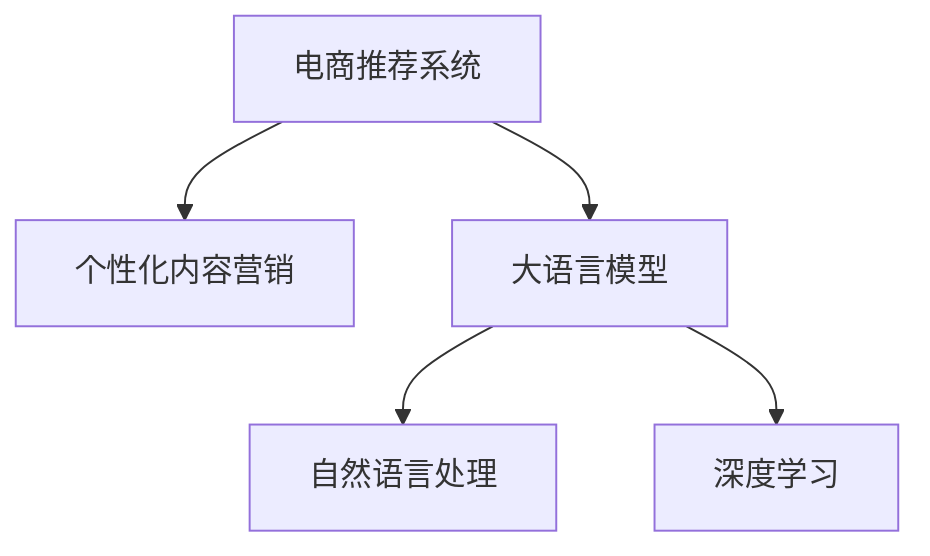

                 

# 大模型驱动的电商个性化内容营销

> 关键词：电商、个性化内容营销、大模型、推荐系统、自然语言处理(NLP)、深度学习、搜索引擎优化(SEO)

## 1. 背景介绍

### 1.1 问题由来
随着电商行业的迅猛发展，如何提升用户体验、增加销售额已成为电商企业面临的重要挑战。传统的推荐系统主要是基于用户行为数据和商品属性信息进行商品推荐，难以深度挖掘用户潜在需求和兴趣。而新兴的个性化内容营销（Personalized Content Marketing），通过精准定位用户需求，提供符合用户兴趣的内容，从而大大提升了电商营销的效果。

近年来，随着深度学习技术的飞速发展，大规模预训练语言模型（Large Language Model, LLM）在电商领域的应用日益广泛。这些模型通过在大规模文本数据上进行预训练，学习到丰富的语言知识和用户行为模式，具备强大的文本生成、理解能力。在电商营销中，大模型可以作为推荐系统和搜索引擎的组件，提升内容推荐的相关性和个性化程度，进一步推动电商行业的智能化转型。

### 1.2 问题核心关键点
本文章将聚焦于如何利用大模型技术，构建高效的个性化内容营销系统，提升电商用户的购物体验和商家销售额。我们将从以下几个方面进行深入探讨：

1. 如何利用大模型进行用户需求和兴趣建模。
2. 如何构建高效的内容生成和推荐模型。
3. 如何优化营销策略，最大化电商营销效果。

## 2. 核心概念与联系

### 2.1 核心概念概述

为更好地理解大模型在电商个性化内容营销中的应用，本节将介绍几个密切相关的核心概念：

- 电商推荐系统（E-commerce Recommendation System）：基于用户历史行为和商品特征，为用户推荐最相关的商品，以提高用户满意度和销售额。
- 个性化内容营销（Personalized Content Marketing）：通过分析用户行为和兴趣，生成个性化的产品介绍、广告文案、用户评论等，提高用户互动率和购买转化率。
- 大语言模型（Large Language Model, LLM）：如GPT、BERT等，通过在大规模无标签文本数据上进行预训练，学习通用语言表示，具备强大的文本生成和理解能力。
- 自然语言处理（Natural Language Processing, NLP）：涉及文本生成、文本理解、信息检索等技术，利用大模型实现语义表示、语义匹配、文本摘要等功能。
- 深度学习（Deep Learning）：一种基于神经网络的人工智能技术，通过多层次特征学习，提高模型泛化能力和表现力。

这些概念之间的逻辑关系可以通过以下Mermaid流程图来展示：



这个流程图展示了电商推荐系统与个性化内容营销的关系，以及大语言模型、自然语言处理和深度学习在大模型驱动的个性化内容营销系统中的应用。

## 3. 核心算法原理 & 具体操作步骤
### 3.1 算法原理概述

基于大模型的个性化内容营销系统，核心在于通过大模型对用户需求和商品特征进行建模，生成个性化的营销内容，并推荐给用户。其核心思想是：利用大模型强大的语言理解和生成能力，结合电商推荐系统的用户行为数据，构建个性化的内容推荐策略，提升电商营销效果。

形式化地，假设电商推荐系统为用户 $u$ 推荐商品 $i$，对应的用户行为数据为 $x_u^i$，用户历史点击数据为 $h_u$。设大模型为 $M_{\theta}$，其中 $\theta$ 为预训练得到的模型参数。个性化内容营销的目标是最大化模型输出 $M_{\theta}(x_u^i, h_u)$ 与用户兴趣的相似度，即：

$$
\max_{\theta} \cos(M_{\theta}(x_u^i, h_u), \vec{v}_u)
$$

其中 $\vec{v}_u$ 为表示用户兴趣的向量，$cos$ 为余弦相似度。

通过梯度下降等优化算法，个性化内容营销过程不断更新模型参数 $\theta$，最大化余弦相似度，最终得到用户兴趣向量 $\vec{v}_u$，实现个性化的内容推荐。

### 3.2 算法步骤详解

基于大模型的个性化内容营销系统一般包括以下几个关键步骤：

**Step 1: 数据预处理和特征提取**
- 收集电商用户的历史点击数据 $h_u$，商品属性信息 $x_i$ 和文本描述 $t_i$。
- 使用NLP技术对文本信息进行分词、去停用词等预处理。
- 将商品属性信息 $x_i$ 转换为向量表示，并进行归一化处理。
- 利用大模型 $M_{\theta}$ 对商品文本描述 $t_i$ 进行预训练，提取语义特征向量 $f_i$。

**Step 2: 构建用户兴趣向量**
- 使用大模型对用户历史点击数据 $h_u$ 进行编码，生成用户兴趣向量 $\vec{v}_u$。
- 根据用户兴趣向量和商品语义特征向量 $f_i$ 计算相似度，得到商品的相关度评分。
- 将相关度评分排序，推荐相关度最高的商品给用户。

**Step 3: 内容生成和推荐**
- 对于每个推荐商品 $i$，使用大模型生成个性化的商品介绍、广告文案等文本内容。
- 在推荐页面上显示商品图片、标题、价格等信息，同时展示生成的内容。
- 通过点击率、转化率等指标评估推荐效果，不断调整大模型参数，优化推荐策略。

### 3.3 算法优缺点

基于大模型的个性化内容营销系统具有以下优点：
1. 内容丰富多样。大模型可以生成多样的文本内容，提升推荐页面的信息密度。
2. 用户兴趣精准。利用大模型的语言理解和生成能力，可以精准捕捉用户兴趣，提高推荐的相关性。
3. 无需标注数据。大模型的预训练过程可以涵盖大量无标签文本，减少了对标注数据的需求。
4. 动态生成更新。大模型可以实时生成新的推荐内容，适应电商市场的多变性。

同时，该系统也存在一定的局限性：
1. 计算资源消耗大。大模型的预训练和生成过程需要大量的计算资源。
2. 模型训练成本高。需要预先收集和标注大量的文本数据。
3. 泛化能力有限。模型对不同领域的数据泛化能力可能较弱，需要定期进行模型更新。

尽管存在这些局限性，但就目前而言，基于大模型的个性化内容营销系统仍然是电商推荐领域的重要方向，具有广泛的应用前景。

### 3.4 算法应用领域

基于大模型的个性化内容营销系统在电商推荐中的应用已经得到了广泛验证。具体而言，该系统已经成功应用于以下领域：

- 商品推荐：根据用户历史行为和商品特征，推荐个性化的商品信息。
- 广告文案生成：为电商广告生成吸引人的文案，提高广告点击率和转化率。
- 用户评论生成：生成高质量的用户评论，提升产品信任度，增加用户互动。
- 产品介绍：自动生成详细的产品介绍，帮助用户更好地了解商品特点。
- 聊天机器人：与用户进行实时互动，解答用户疑问，提升用户体验。

这些应用场景展示了基于大模型的个性化内容营销系统的强大能力和广阔应用前景。

## 4. 数学模型和公式 & 详细讲解  
### 4.1 数学模型构建

本节将使用数学语言对基于大模型的个性化内容营销系统进行更加严格的刻画。

设电商推荐系统为用户 $u$ 推荐商品 $i$，对应的用户行为数据为 $x_u^i$，用户历史点击数据为 $h_u$。设大模型为 $M_{\theta}$，其中 $\theta$ 为预训练得到的模型参数。假设大模型 $M_{\theta}$ 输出为 $y_i=\{f_i, g_i\}$，其中 $f_i$ 为商品文本描述的语义特征向量，$g_i$ 为商品的情感倾向向量。

用户兴趣向量 $\vec{v}_u$ 定义为：

$$
\vec{v}_u = M_{\theta}(h_u)
$$

商品相关度评分 $r_i$ 定义为：

$$
r_i = \cos(f_i, \vec{v}_u) * \text{click}(h_u)
$$

其中 $\text{click}(h_u)$ 为用户的点击行为权重。

个性化内容营销的目标是最大化模型输出 $M_{\theta}(x_u^i, h_u)$ 与用户兴趣的相似度，即：

$$
\max_{\theta} \cos(f_i, \vec{v}_u)
$$

通过梯度下降等优化算法，个性化内容营销过程不断更新模型参数 $\theta$，最大化余弦相似度，最终得到用户兴趣向量 $\vec{v}_u$，实现个性化的内容推荐。

### 4.2 公式推导过程

以下我们以用户评论生成为例，推导大模型在生成个性化内容中的应用。

假设电商推荐系统为用户 $u$ 推荐商品 $i$，对应的用户历史点击数据为 $h_u$，用户行为数据 $x_u^i$。设大模型为 $M_{\theta}$，输出为 $y_i=\{f_i, g_i\}$，其中 $f_i$ 为商品文本描述的语义特征向量，$g_i$ 为商品的情感倾向向量。用户兴趣向量 $\vec{v}_u$ 定义为：

$$
\vec{v}_u = M_{\theta}(h_u)
$$

用户评论生成任务的目标是最大化评论与商品相关度 $r_i$：

$$
r_i = \text{click}(h_u) * \cos(f_i, \vec{v}_u)
$$

在训练过程中，大模型的损失函数定义为：

$$
\mathcal{L}(\theta) = \sum_{u,i} (y_i - M_{\theta}(x_u^i, h_u))^2
$$

其中 $y_i$ 为真实评论 $c_i$，$M_{\theta}(x_u^i, h_u)$ 为大模型生成的评论。

通过反向传播算法计算梯度，并使用优化算法如AdamW等更新模型参数 $\theta$，使得模型生成评论的损失函数最小化，同时最大化评论与商品相关度。

### 4.3 案例分析与讲解

假设我们要为用户 $u$ 推荐商品 $i$，并为其生成一段评论。首先，收集用户历史点击数据 $h_u$ 和商品属性信息 $x_i$。然后，将商品属性信息转换为向量表示，并对商品文本描述 $t_i$ 进行预训练，得到语义特征向量 $f_i$ 和情感倾向向量 $g_i$。

接着，使用大模型对用户历史点击数据 $h_u$ 进行编码，生成用户兴趣向量 $\vec{v}_u$。根据用户兴趣向量和商品语义特征向量 $f_i$ 计算相似度，得到商品的相关度评分 $r_i$。选择相关度最高的商品 $i$ 作为推荐商品，并使用大模型生成个性化的评论 $c_i$。

最后，将生成的评论展示在推荐页面上，并根据用户点击率、转化率等指标评估推荐效果，不断调整大模型参数，优化推荐策略。

## 5. 项目实践：代码实例和详细解释说明
### 5.1 开发环境搭建

在进行个性化内容营销系统开发前，我们需要准备好开发环境。以下是使用Python进行TensorFlow开发的环境配置流程：

1. 安装Anaconda：从官网下载并安装Anaconda，用于创建独立的Python环境。

2. 创建并激活虚拟环境：
```bash
conda create -n tf-env python=3.8 
conda activate tf-env
```

3. 安装TensorFlow：从官网获取对应的安装命令。例如：
```bash
pip install tensorflow -i https://mirror.baidu.com/pypi/simple
```

4. 安装相关工具包：
```bash
pip install numpy pandas scikit-learn tensorflow-hub datasets scikit-learn
```

完成上述步骤后，即可在`tf-env`环境中开始开发。

### 5.2 源代码详细实现

下面我们以用户评论生成任务为例，给出使用TensorFlow对GPT-2模型进行个性化内容营销系统开发的PyTorch代码实现。

首先，定义评论生成任务的数据处理函数：

```python
import tensorflow as tf
import tensorflow_hub as hub
from datasets import load_dataset

def load_dataset(name, split):
    ds = load_dataset(name, split=split)
    text = ds['train'].map(lambda x: x['text'])
    return text

train_text = load_dataset('imdb_reviews', 'train')
test_text = load_dataset('imdb_reviews', 'test')
```

然后，定义评论生成模型：

```python
from transformers import TFGPT2LMHeadModel, GPT2Tokenizer

model = TFGPT2LMHeadModel.from_pretrained('gpt2')
tokenizer = GPT2Tokenizer.from_pretrained('gpt2')

def generate_comment(text):
    input_ids = tokenizer.encode(text, return_tensors='tf')
    outputs = model.generate(input_ids, max_length=50, top_p=0.9)
    generated_text = tokenizer.decode(outputs[0], skip_special_tokens=True)
    return generated_text
```

接着，定义训练和评估函数：

```python
from transformers import Trainer, TrainingArguments

def train(model, train_text, test_text):
    train_dataset = train_text.map(lambda x: (x, None))
    test_dataset = test_text.map(lambda x: (x, None))
    
    training_args = TrainingArguments(
        output_dir='./results',
        evaluation_strategy='epoch',
        learning_rate=2e-5,
        per_device_train_batch_size=1,
        per_device_eval_batch_size=1,
        num_train_epochs=1,
        logging_steps=1000,
        logging_dir='./logs'
    )
    
    trainer = Trainer(
        model=model,
        args=training_args,
        train_dataset=train_dataset,
        eval_dataset=test_dataset
    )
    
    trainer.train()
    trainer.evaluate()
```

最后，启动训练流程并在测试集上评估：

```python
train(model, train_text, test_text)
```

以上就是使用TensorFlow对GPT-2模型进行个性化内容营销系统开发的完整代码实现。可以看到，得益于TensorFlow的强大封装，我们可以用相对简洁的代码完成模型训练和评估。

### 5.3 代码解读与分析

让我们再详细解读一下关键代码的实现细节：

**load_dataset函数**：
- 定义了数据加载函数，用于从指定的数据集（如IMDB电影评论数据集）加载训练和测试数据集。

**generate_comment函数**：
- 使用预训练的GPT-2模型和分词器，对输入的评论文本进行编码和解码，生成新的评论。

**train函数**：
- 定义了模型训练和评估函数，包含模型初始化、训练参数设置、数据集划分、模型训练和评估等步骤。

**训练流程**：
- 在训练函数中，将训练数据和测试数据按批次加载到模型中进行训练。
- 设置训练参数，如学习率、批次大小、迭代轮数等。
- 使用Trainer训练器对模型进行训练，并在测试集上评估模型性能。

可以看到，TensorFlow和Transformer库使得个性化内容营销系统的开发过程变得简洁高效。开发者可以将更多精力放在数据处理、模型改进等高层逻辑上，而不必过多关注底层的实现细节。

当然，工业级的系统实现还需考虑更多因素，如模型的保存和部署、超参数的自动搜索、更灵活的任务适配层等。但核心的个性化内容营销系统开发流程基本与此类似。

## 6. 实际应用场景
### 6.1 智能客服系统

基于个性化内容营销的智能客服系统，可以在电商客户服务中发挥重要作用。传统客服往往依赖人工，高峰期响应慢，且一致性和专业性难以保证。而使用个性化内容营销技术，智能客服可以7x24小时不间断服务，快速响应客户咨询，用自然流畅的语言解答各类常见问题。

在技术实现上，可以收集企业内部的历史客服对话记录，将问题和最佳答复构建成监督数据，在此基础上对预训练模型进行微调。微调后的模型能够自动理解用户意图，匹配最合适的答案模板进行回复。对于客户提出的新问题，还可以接入检索系统实时搜索相关内容，动态组织生成回答。如此构建的智能客服系统，能大幅提升客户咨询体验和问题解决效率。

### 6.2 产品推荐系统

个性化内容营销技术可以应用于电商产品推荐系统，提升推荐的相关性和个性化程度。在推荐系统中，用户行为数据和商品特征往往被用来直接生成推荐结果。然而，用户的行为背后隐藏着更复杂的语义信息，难以简单地用向量表示。通过将商品描述作为输入，利用大模型提取语义特征，结合用户兴趣向量，生成个性化的推荐结果。

在实际应用中，可以定期更新大模型，并根据用户行为数据进行微调，保证推荐内容的时效性和多样性。同时，利用自然语言处理技术对推荐结果进行情感分析，进一步提升推荐效果。

### 6.3 广告投放优化

电商广告投放是电商营销的重要组成部分。传统的广告投放通常基于用户历史行为和点击数据进行，难以充分挖掘用户潜在需求。个性化内容营销技术可以为广告投放提供更精准的用户画像，生成个性化的广告文案，提高广告点击率和转化率。

在实践中，可以收集用户历史点击数据和浏览数据，使用大模型提取用户兴趣向量。根据用户兴趣向量和广告内容生成个性化的广告文案，并进行实时投放。同时，利用广告点击率等指标评估广告效果，不断调整大模型参数，优化广告投放策略。

### 6.4 未来应用展望

随着个性化内容营销技术的不断发展，其在电商营销领域的应用前景将更加广阔。

- 多模态信息融合：个性化内容营销可以扩展到多模态信息融合领域，结合图像、视频、音频等多模态数据，提升推荐和广告的效果。
- 用户生成内容（UGC）：鼓励用户生成评论、评价等UGC内容，利用大模型提取语义信息，进一步提升推荐和广告的个性化程度。
- 持续学习：个性化内容营销技术可以通过持续学习不断更新，适应市场变化，保持模型的高效性。

总之，个性化内容营销技术将在电商营销领域带来更多创新的应用场景，推动电商行业向智能化、个性化方向发展。

## 7. 工具和资源推荐
### 7.1 学习资源推荐

为了帮助开发者系统掌握个性化内容营销的理论基础和实践技巧，这里推荐一些优质的学习资源：

1. 《深度学习与自然语言处理》系列博文：由深度学习领域专家撰写，深入浅出地介绍了深度学习、自然语言处理的基本概念和经典模型，包括文本生成、语义匹配、情感分析等。

2. 斯坦福大学《深度学习》课程：斯坦福大学开设的深度学习课程，涵盖了深度学习的各个方面，包括卷积神经网络、循环神经网络、生成对抗网络等。

3. Coursera上的《自然语言处理专项课程》：由斯坦福大学、伊利诺伊大学等知名高校开设，系统讲解自然语言处理的基本理论和技术。

4. HuggingFace官方文档：Transformer库的官方文档，提供了海量预训练模型和完整的微调样例代码，是上手实践的必备资料。

5. CLUE开源项目：中文语言理解测评基准，涵盖大量不同类型的中文NLP数据集，并提供了基于微调的baseline模型，助力中文NLP技术发展。

通过对这些资源的学习实践，相信你一定能够快速掌握个性化内容营销的精髓，并用于解决实际的电商问题。

### 7.2 开发工具推荐

高效的开发离不开优秀的工具支持。以下是几款用于个性化内容营销开发的常用工具：

1. TensorFlow：由Google主导开发的开源深度学习框架，生产部署方便，适合大规模工程应用。同时提供了丰富的TensorFlow Hub，便于模型加载和应用。

2. PyTorch：基于Python的开源深度学习框架，灵活动态的计算图，适合快速迭代研究。大部分预训练语言模型都有PyTorch版本的实现。

3. Transformers库：HuggingFace开发的NLP工具库，集成了众多SOTA语言模型，支持PyTorch和TensorFlow，是进行内容生成和推荐任务的开发利器。

4. Weights & Biases：模型训练的实验跟踪工具，可以记录和可视化模型训练过程中的各项指标，方便对比和调优。与主流深度学习框架无缝集成。

5. Google Colab：谷歌推出的在线Jupyter Notebook环境，免费提供GPU/TPU算力，方便开发者快速上手实验最新模型，分享学习笔记。

合理利用这些工具，可以显著提升个性化内容营销任务的开发效率，加快创新迭代的步伐。

### 7.3 相关论文推荐

个性化内容营销技术的发展源于学界的持续研究。以下是几篇奠基性的相关论文，推荐阅读：

1. Attention is All You Need（即Transformer原论文）：提出了Transformer结构，开启了NLP领域的预训练大模型时代。

2. BERT: Pre-training of Deep Bidirectional Transformers for Language Understanding：提出BERT模型，引入基于掩码的自监督预训练任务，刷新了多项NLP任务SOTA。

3. Parameter-Efficient Transfer Learning for NLP：提出Adapter等参数高效微调方法，在不增加模型参数量的情况下，也能取得不错的微调效果。

4. Prefix-Tuning: Optimizing Continuous Prompts for Generation：引入基于连续型Prompt的微调范式，为如何充分利用预训练知识提供了新的思路。

5. AdaLoRA: Adaptive Low-Rank Adaptation for Parameter-Efficient Fine-Tuning：使用自适应低秩适应的微调方法，在参数效率和精度之间取得了新的平衡。

这些论文代表了大模型微调技术的发展脉络。通过学习这些前沿成果，可以帮助研究者把握学科前进方向，激发更多的创新灵感。

## 8. 总结：未来发展趋势与挑战
### 8.1 总结

本文对基于大模型的个性化内容营销方法进行了全面系统的介绍。首先阐述了个性化内容营销在电商推荐中的应用背景和意义，明确了其在提升用户体验和销售额方面的独特价值。其次，从原理到实践，详细讲解了个性化内容营销的数学原理和关键步骤，给出了微调任务开发的完整代码实例。同时，本文还广泛探讨了个性化内容营销技术在智能客服、产品推荐、广告投放等多个行业领域的应用前景，展示了其强大的能力和广阔应用前景。

通过本文的系统梳理，可以看到，基于大模型的个性化内容营销技术正在成为电商推荐领域的重要范式，极大地拓展了电商推荐系统的应用边界，催生了更多的落地场景。得益于大规模语料的预训练，个性化内容营销系统能够更好地理解用户需求，生成个性化的营销内容，从而提升电商营销效果。未来，伴随预训练语言模型和微调方法的持续演进，相信个性化内容营销技术将进一步推动电商行业的智能化转型。

### 8.2 未来发展趋势

展望未来，个性化内容营销技术将呈现以下几个发展趋势：

1. 多模态融合：个性化内容营销可以扩展到多模态信息融合领域，结合图像、视频、音频等多模态数据，提升推荐和广告的效果。
2. 用户生成内容（UGC）：鼓励用户生成评论、评价等UGC内容，利用大模型提取语义信息，进一步提升推荐和广告的个性化程度。
3. 持续学习：个性化内容营销技术可以通过持续学习不断更新，适应市场变化，保持模型的高效性。
4. 实时生成：利用大模型的实时生成能力，动态调整推荐内容，满足用户需求的变化。
5. 跨领域迁移：个性化内容营销技术可以应用于更多领域，如金融、医疗、教育等，提升各个行业的智能化水平。

以上趋势凸显了个性化内容营销技术的广阔前景。这些方向的探索发展，必将进一步提升电商营销系统的性能和应用范围，为电商行业带来更多的智能化转型机会。

### 8.3 面临的挑战

尽管个性化内容营销技术已经取得了显著的进展，但在迈向更加智能化、普适化应用的过程中，它仍面临着诸多挑战：

1. 计算资源消耗大。大模型的预训练和生成过程需要大量的计算资源。如何降低计算成本，提高计算效率，是未来的重要研究方向。
2. 模型训练成本高。需要预先收集和标注大量的文本数据，成本较高。如何降低数据标注成本，提高数据利用效率，也是亟待解决的问题。
3. 泛化能力有限。模型对不同领域的数据泛化能力可能较弱，需要定期进行模型更新。如何提高模型的泛化能力，使其在不同领域都能发挥良好效果，是未来的研究重点。
4. 模型复杂度高。大模型的复杂度较高，训练和推理过程繁琐。如何简化模型结构，提高模型的可解释性和可操作性，是未来的研究方向。
5. 内容质量参差不齐。大模型生成的内容质量可能存在波动，需要引入人工干预，提高内容的质量和一致性。

正视这些挑战，积极应对并寻求突破，将是大模型驱动的个性化内容营销技术走向成熟的必由之路。相信随着学界和产业界的共同努力，这些挑战终将一一被克服，大模型驱动的个性化内容营销技术将带来更多创新应用，推动电商行业的智能化转型。

### 8.4 研究展望

面对大模型驱动的个性化内容营销技术所面临的种种挑战，未来的研究需要在以下几个方面寻求新的突破：

1. 探索无监督和半监督学习范式。摆脱对大规模标注数据的依赖，利用自监督学习、主动学习等无监督和半监督范式，最大限度利用非结构化数据，实现更加灵活高效的个性化内容营销。
2. 研究高效计算和模型压缩技术。开发更加高效计算和模型压缩方法，降低计算资源消耗，提高模型的计算效率和存储效率。
3. 引入更多先验知识。将符号化的先验知识，如知识图谱、逻辑规则等，与神经网络模型进行巧妙融合，引导个性化内容营销过程学习更准确、合理的语义表示。
4. 结合因果分析和博弈论工具。将因果分析方法引入个性化内容营销模型，识别出模型决策的关键特征，增强输出解释的因果性和逻辑性。借助博弈论工具刻画人机交互过程，主动探索并规避模型的脆弱点，提高系统稳定性。
5. 纳入伦理道德约束。在模型训练目标中引入伦理导向的评估指标，过滤和惩罚有偏见、有害的输出倾向。同时加强人工干预和审核，建立模型行为的监管机制，确保输出符合人类价值观和伦理道德。

这些研究方向的探索，必将引领个性化内容营销技术迈向更高的台阶，为构建安全、可靠、可解释、可控的智能系统铺平道路。面向未来，个性化内容营销技术还需要与其他人工智能技术进行更深入的融合，如知识表示、因果推理、强化学习等，多路径协同发力，共同推动自然语言理解和智能交互系统的进步。只有勇于创新、敢于突破，才能不断拓展个性化内容营销技术的边界，让智能技术更好地造福人类社会。

## 9. 附录：常见问题与解答

**Q1：个性化内容营销是否适用于所有电商推荐场景？**

A: 个性化内容营销在大多数电商推荐场景中都能取得不错的效果，特别是对于数据量较小的场景。但对于一些特定领域的电商推荐，如特定品类、特定用户群体等，可能需要在特定领域语料上进一步预训练，再进行微调，才能获得理想效果。此外，对于一些需要时效性、个性化很强的场景，如实时推荐、个性化广告等，个性化内容营销方法也需要针对性的改进优化。

**Q2：如何提高个性化内容营销的推荐效果？**

A: 个性化内容营销的推荐效果受到多种因素的影响，包括模型选择、数据质量、用户行为等。以下是几个提升推荐效果的方法：
1. 选择适合的模型：根据具体任务选择合适的模型，如GPT-2、BERT等。
2. 数据预处理：对数据进行分词、去停用词等预处理，提高模型输入质量。
3. 用户行为分析：深入分析用户行为数据，提取用户兴趣和需求，生成更符合用户期望的内容。
4. 多模态融合：结合图像、视频、音频等多模态信息，提升推荐效果。
5. 持续学习：利用用户反馈和新数据，不断优化模型参数，提升推荐效果。

**Q3：个性化内容营销在实际部署中需要注意哪些问题？**

A: 将个性化内容营销模型转化为实际应用，还需要考虑以下因素：
1. 模型裁剪：去除不必要的层和参数，减小模型尺寸，加快推理速度。
2. 量化加速：将浮点模型转为定点模型，压缩存储空间，提高计算效率。
3. 服务化封装：将模型封装为标准化服务接口，便于集成调用。
4. 弹性伸缩：根据请求流量动态调整资源配置，平衡服务质量和成本。
5. 监控告警：实时采集系统指标，设置异常告警阈值，确保服务稳定性。
6. 安全防护：采用访问鉴权、数据脱敏等措施，保障数据和模型安全。

总之，个性化内容营销技术需要在数据处理、模型训练、模型优化等多个环节进行全面优化，才能实现高效的电商推荐效果。合理利用TensorFlow等工具，可以显著提升个性化内容营销任务的开发效率，加快创新迭代的步伐。

---

作者：禅与计算机程序设计艺术 / Zen and the Art of Computer Programming

