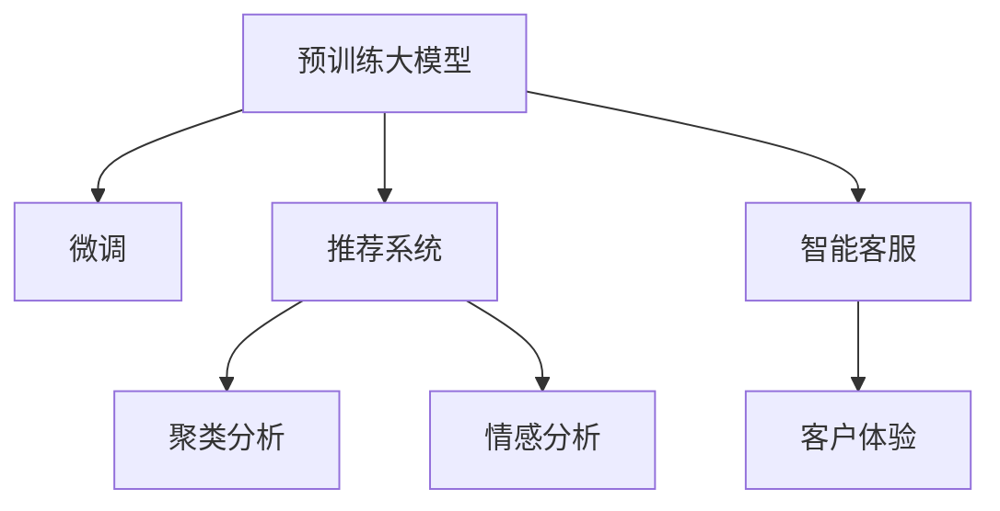

                 

# 大模型驱动的电商平台智能客户洞察

> 关键词：大模型,客户洞察,电商平台,人工智能,推荐系统,智能推荐,客户细分,消费者行为分析,智能客服,数据挖掘

## 1. 背景介绍

### 1.1 问题由来

在当今数字化时代，电商平台已经成为消费者购物的重要渠道。面对日趋激烈的市场竞争，如何更好地理解客户需求、提升客户体验，成为各大电商平台亟待解决的重大问题。传统的客户洞察方式往往依赖于手工数据提取和复杂的人工分析，不仅成本高昂，且效率低下。近年来，得益于深度学习和大数据技术的快速发展，大模型和智能算法开始逐步应用于电商平台客户洞察领域，显著提升了客户分析的深度和广度。

### 1.2 问题核心关键点

大模型驱动的客户洞察，是指利用预训练大模型（如BERT、GPT、BigBird等），通过深入分析客户行为数据（如浏览记录、购买历史、搜索关键词等），挖掘客户潜在需求，实现客户个性化推荐、精准营销、智能客服等效果。其核心关键点包括：

1. **数据获取与预处理**：高效获取平台内的客户行为数据，并对其进行处理和清洗，确保数据的质量和完整性。
2. **大模型微调与集成**：利用已有的大模型进行微调，或集成多个大模型，构建客户洞察能力更强的系统。
3. **智能算法与推荐**：结合推荐系统、聚类分析、情感分析等智能算法，优化推荐和细分策略。
4. **实时监控与迭代**：实时监控客户行为数据，持续迭代微调模型，提升客户洞察的实时性和准确性。
5. **客户体验优化**：通过智能客服、个性化推荐、精准营销等手段，提升客户满意度和平台粘性。

## 2. 核心概念与联系

### 2.1 核心概念概述

为更好地理解大模型驱动的电商平台客户洞察，本节将介绍几个密切相关的核心概念：

- **预训练大模型(Pretrained Large Model)**：如BERT、GPT、BigBird等，通过在大规模无标签文本数据上进行自监督预训练，学习通用的语言表示和知识。
- **微调(Fine-tuning)**：指在预训练模型的基础上，使用有标签数据进行微调，适应特定任务。
- **推荐系统(Recommendation System)**：根据用户的历史行为数据，推荐其可能感兴趣的商品或服务。
- **聚类分析(Clustering Analysis)**：将用户分为不同的群体，便于制定差异化策略。
- **情感分析(Sentiment Analysis)**：分析用户评论、反馈等文本数据，了解用户情绪和满意度。
- **智能客服(Chatbot)**：使用自然语言处理技术，提供自动化的客服支持。

这些核心概念之间的逻辑关系可以通过以下Mermaid流程图来展示：



这个流程图展示了大模型驱动的客户洞察的核心概念及其之间的关系：

1. 预训练大模型通过自监督预训练学习语言表示。
2. 微调模型通过有监督学习适应特定任务，如推荐、聚类、情感分析等。
3. 推荐系统、聚类分析、情感分析等算法对微调模型进行补充，提高洞察深度和广度。
4. 智能客服通过微调模型实现自动化支持，提升客户体验。

## 3. 核心算法原理 & 具体操作步骤

### 3.1 算法原理概述

大模型驱动的电商平台客户洞察，本质上是通过大模型的预训练和微调，结合推荐系统、聚类分析、情感分析等智能算法，实现对客户行为数据的深度分析和智能化应用。其核心思想是：

1. **数据预处理**：收集和清洗客户行为数据，如浏览记录、购买历史、搜索关键词等。
2. **大模型微调**：在预训练模型的基础上，使用有标签数据进行微调，构建针对特定任务的模型。
3. **智能算法应用**：结合推荐系统、聚类分析、情感分析等算法，进行深入分析和个性化推荐。
4. **客户体验优化**：通过智能客服、个性化推荐、精准营销等手段，提升客户满意度和平台粘性。

### 3.2 算法步骤详解

基于大模型驱动的电商平台客户洞察一般包括以下几个关键步骤：

**Step 1: 数据预处理**

- 收集电商平台内的客户行为数据，包括浏览记录、购买历史、搜索关键词、评价反馈等。
- 对数据进行清洗和预处理，如去除噪声、处理缺失值、归一化等。
- 将数据转化为模型所需格式，如将文本数据转化为token ids、标签等。

**Step 2: 大模型微调**

- 选择合适的预训练语言模型，如BERT、GPT等。
- 使用部分标注数据，对预训练模型进行微调，构建特定任务的模型。
- 微调过程中，选择合适的学习率、正则化技术、优化算法等。
- 通过交叉验证等方法，评估模型性能，选取最优参数。

**Step 3: 智能算法应用**

- 结合推荐系统、聚类分析、情感分析等智能算法，对微调模型进行补充。
- 使用微调后的模型进行客户行为分析，识别潜在需求。
- 通过聚类分析，将客户分为不同的群体，制定差异化策略。
- 使用情感分析，了解客户情绪和满意度，优化产品和服务。

**Step 4: 客户体验优化**

- 结合智能客服、个性化推荐、精准营销等手段，提升客户体验。
- 智能客服使用微调后的模型，自动解答客户问题，提供个性化支持。
- 个性化推荐系统根据客户行为数据，推荐相关商品，提高转化率。
- 精准营销通过分析客户行为数据，制定更加有针对性的营销策略，提升客户粘性。

### 3.3 算法优缺点

大模型驱动的电商平台客户洞察方法具有以下优点：

1. **深度分析能力**：通过大模型的微调和智能算法的应用，可以深入挖掘客户行为数据，发现潜在的消费趋势和需求。
2. **实时性**：通过实时监控客户行为数据，持续迭代微调模型，实现动态调整和优化。
3. **个性化推荐**：结合推荐系统，提供个性化的商品推荐，提升客户满意度和购买转化率。
4. **客户细分**：通过聚类分析，将客户分为不同的群体，制定差异化策略，提升营销效果。
5. **智能客服**：使用自然语言处理技术，提供自动化的客服支持，提高客户服务效率和满意度。

同时，该方法也存在一定的局限性：

1. **数据隐私问题**：收集和分析客户行为数据时，需要处理大量的个人隐私信息，可能面临隐私保护的法律风险。
2. **数据质量要求高**：客户行为数据的准确性和完整性直接影响洞察结果，数据质量较低可能导致分析偏差。
3. **计算资源需求高**：大模型和智能算法需要大量计算资源，尤其是微调模型和实时分析环节，可能对计算资源提出高要求。
4. **算法复杂性高**：多种智能算法结合使用，模型复杂度高，调试和优化难度较大。

尽管存在这些局限性，但就目前而言，大模型驱动的客户洞察方法仍是大数据分析和智能推荐领域的主流范式。未来相关研究的重点在于如何进一步降低数据隐私风险，提升数据质量，优化算法性能，并兼顾模型的可解释性和伦理性等因素。

### 3.4 算法应用领域

大模型驱动的电商平台客户洞察方法，已经在多个领域得到广泛应用，例如：

- **个性化推荐**：根据用户的历史行为数据，推荐其可能感兴趣的商品或服务。
- **客户细分**：将用户分为不同的群体，制定差异化策略，提高营销效果。
- **智能客服**：使用自然语言处理技术，提供自动化的客服支持，提升客户服务效率和满意度。
- **消费趋势分析**：分析客户行为数据，了解消费趋势，优化产品和服务。
- **客户满意度评估**：使用情感分析，了解客户情绪和满意度，优化产品和服务。

除了上述这些经典应用外，大模型驱动的客户洞察方法还在广告投放、库存管理、供应链优化等领域不断拓展，为电商平台带来了巨大的商业价值。

## 4. 数学模型和公式 & 详细讲解 & 举例说明

### 4.1 数学模型构建

在本节中，我们将使用数学语言对大模型驱动的电商平台客户洞察过程进行更加严格的刻画。

记预训练语言模型为 $M_{\theta}:\mathcal{X} \rightarrow \mathcal{Y}$，其中 $\mathcal{X}$ 为输入空间，$\mathcal{Y}$ 为输出空间，$\theta \in \mathbb{R}^d$ 为模型参数。假设客户行为数据集为 $D=\{(x_i,y_i)\}_{i=1}^N, x_i \in \mathcal{X}, y_i \in \mathcal{Y}$。

定义客户行为数据的损失函数为 $\ell(M_{\theta}(x),y)$，则在数据集 $D$ 上的经验风险为：

$$
\mathcal{L}(\theta) = \frac{1}{N}\sum_{i=1}^N \ell(M_{\theta}(x_i),y_i)
$$

微调的目标是最小化经验风险，即找到最优参数：

$$
\theta^* = \mathop{\arg\min}_{\theta} \mathcal{L}(\theta)
$$

在实践中，我们通常使用基于梯度的优化算法（如SGD、Adam等）来近似求解上述最优化问题。设 $\eta$ 为学习率，$\lambda$ 为正则化系数，则参数的更新公式为：

$$
\theta \leftarrow \theta - \eta \nabla_{\theta}\mathcal{L}(\theta) - \eta\lambda\theta
$$

其中 $\nabla_{\theta}\mathcal{L}(\theta)$ 为损失函数对参数 $\theta$ 的梯度，可通过反向传播算法高效计算。

### 4.2 公式推导过程

以下我们以客户行为数据分类任务为例，推导交叉熵损失函数及其梯度的计算公式。

假设客户行为数据 $x_i$ 的标签为 $y_i \in \{0,1\}$，模型 $M_{\theta}$ 在输入 $x_i$ 上的输出为 $\hat{y}=M_{\theta}(x_i) \in [0,1]$，表示客户属于某个类别的概率。则二分类交叉熵损失函数定义为：

$$
\ell(M_{\theta}(x),y) = -[y\log \hat{y} + (1-y)\log (1-\hat{y})]
$$

将其代入经验风险公式，得：

$$
\mathcal{L}(\theta) = -\frac{1}{N}\sum_{i=1}^N [y_i\log M_{\theta}(x_i)+(1-y_i)\log(1-M_{\theta}(x_i))]
$$

根据链式法则，损失函数对参数 $\theta_k$ 的梯度为：

$$
\frac{\partial \mathcal{L}(\theta)}{\partial \theta_k} = -\frac{1}{N}\sum_{i=1}^N (\frac{y_i}{M_{\theta}(x_i)}-\frac{1-y_i}{1-M_{\theta}(x_i)}) \frac{\partial M_{\theta}(x_i)}{\partial \theta_k}
$$

其中 $\frac{\partial M_{\theta}(x_i)}{\partial \theta_k}$ 可进一步递归展开，利用自动微分技术完成计算。

在得到损失函数的梯度后，即可带入参数更新公式，完成模型的迭代优化。重复上述过程直至收敛，最终得到适应客户洞察任务的最优模型参数 $\theta^*$。

## 5. 项目实践：代码实例和详细解释说明

### 5.1 开发环境搭建

在进行客户洞察实践前，我们需要准备好开发环境。以下是使用Python进行PyTorch开发的环境配置流程：

1. 安装Anaconda：从官网下载并安装Anaconda，用于创建独立的Python环境。

2. 创建并激活虚拟环境：
```bash
conda create -n pytorch-env python=3.8 
conda activate pytorch-env
```

3. 安装PyTorch：根据CUDA版本，从官网获取对应的安装命令。例如：
```bash
conda install pytorch torchvision torchaudio cudatoolkit=11.1 -c pytorch -c conda-forge
```

4. 安装Transformers库：
```bash
pip install transformers
```

5. 安装各类工具包：
```bash
pip install numpy pandas scikit-learn matplotlib tqdm jupyter notebook ipython
```

完成上述步骤后，即可在`pytorch-env`环境中开始客户洞察实践。

### 5.2 源代码详细实现

下面我们以电商平台客户分类任务为例，给出使用Transformers库对BERT模型进行客户分类的PyTorch代码实现。

首先，定义客户分类任务的数据处理函数：

```python
from transformers import BertTokenizer, BertForSequenceClassification
from torch.utils.data import Dataset
import torch

class CustomerDataset(Dataset):
    def __init__(self, texts, labels, tokenizer, max_len=128):
        self.texts = texts
        self.labels = labels
        self.tokenizer = tokenizer
        self.max_len = max_len
        
    def __len__(self):
        return len(self.texts)
    
    def __getitem__(self, item):
        text = self.texts[item]
        label = self.labels[item]
        
        encoding = self.tokenizer(text, return_tensors='pt', max_length=self.max_len, padding='max_length', truncation=True)
        input_ids = encoding['input_ids'][0]
        attention_mask = encoding['attention_mask'][0]
        
        # 对label进行编码
        encoded_label = [1 if label == 'A' else 0 for label in self.labels] 
        encoded_label.extend([0] * (self.max_len - len(encoded_label)))
        labels = torch.tensor(encoded_label, dtype=torch.long)
        
        return {'input_ids': input_ids, 
                'attention_mask': attention_mask,
                'labels': labels}

# 创建dataset
tokenizer = BertTokenizer.from_pretrained('bert-base-cased')
train_dataset = CustomerDataset(train_texts, train_labels, tokenizer)
dev_dataset = CustomerDataset(dev_texts, dev_labels, tokenizer)
test_dataset = CustomerDataset(test_texts, test_labels, tokenizer)
```

然后，定义模型和优化器：

```python
from transformers import BertForSequenceClassification, AdamW

model = BertForSequenceClassification.from_pretrained('bert-base-cased', num_labels=2)

optimizer = AdamW(model.parameters(), lr=2e-5)
```

接着，定义训练和评估函数：

```python
from torch.utils.data import DataLoader
from tqdm import tqdm
from sklearn.metrics import classification_report

device = torch.device('cuda') if torch.cuda.is_available() else torch.device('cpu')
model.to(device)

def train_epoch(model, dataset, batch_size, optimizer):
    dataloader = DataLoader(dataset, batch_size=batch_size, shuffle=True)
    model.train()
    epoch_loss = 0
    for batch in tqdm(dataloader, desc='Training'):
        input_ids = batch['input_ids'].to(device)
        attention_mask = batch['attention_mask'].to(device)
        labels = batch['labels'].to(device)
        model.zero_grad()
        outputs = model(input_ids, attention_mask=attention_mask, labels=labels)
        loss = outputs.loss
        epoch_loss += loss.item()
        loss.backward()
        optimizer.step()
    return epoch_loss / len(dataloader)

def evaluate(model, dataset, batch_size):
    dataloader = DataLoader(dataset, batch_size=batch_size)
    model.eval()
    preds, labels = [], []
    with torch.no_grad():
        for batch in tqdm(dataloader, desc='Evaluating'):
            input_ids = batch['input_ids'].to(device)
            attention_mask = batch['attention_mask'].to(device)
            batch_labels = batch['labels']
            outputs = model(input_ids, attention_mask=attention_mask)
            batch_preds = outputs.logits.argmax(dim=2).to('cpu').tolist()
            batch_labels = batch_labels.to('cpu').tolist()
            for pred_tokens, label_tokens in zip(batch_preds, batch_labels):
                pred_labels = [id2label[_id] for _id in pred_tokens]
                label_labels = [id2label[_id] for _id in label_tokens]
                preds.append(pred_labels[:len(label_labels)])
                labels.append(label_labels)
                
    print(classification_report(labels, preds))
```

最后，启动训练流程并在测试集上评估：

```python
epochs = 5
batch_size = 16

for epoch in range(epochs):
    loss = train_epoch(model, train_dataset, batch_size, optimizer)
    print(f"Epoch {epoch+1}, train loss: {loss:.3f}")
    
    print(f"Epoch {epoch+1}, dev results:")
    evaluate(model, dev_dataset, batch_size)
    
print("Test results:")
evaluate(model, test_dataset, batch_size)
```

以上就是使用PyTorch对BERT进行客户分类任务微调的完整代码实现。可以看到，得益于Transformers库的强大封装，我们可以用相对简洁的代码完成BERT模型的加载和微调。

### 5.3 代码解读与分析

让我们再详细解读一下关键代码的实现细节：

**CustomerDataset类**：
- `__init__`方法：初始化文本、标签、分词器等关键组件。
- `__len__`方法：返回数据集的样本数量。
- `__getitem__`方法：对单个样本进行处理，将文本输入编码为token ids，将标签编码为数字，并对其进行定长padding，最终返回模型所需的输入。

**模型和优化器**：
- 使用预训练的BERT模型，并将其应用于二分类任务。
- 使用AdamW优化器，并设置合适的学习率。

**训练和评估函数**：
- 使用PyTorch的DataLoader对数据集进行批次化加载，供模型训练和推理使用。
- 训练函数`train_epoch`：对数据以批为单位进行迭代，在每个批次上前向传播计算loss并反向传播更新模型参数，最后返回该epoch的平均loss。
- 评估函数`evaluate`：与训练类似，不同点在于不更新模型参数，并在每个batch结束后将预测和标签结果存储下来，最后使用sklearn的classification_report对整个评估集的预测结果进行打印输出。

**训练流程**：
- 定义总的epoch数和batch size，开始循环迭代
- 每个epoch内，先在训练集上训练，输出平均loss
- 在验证集上评估，输出分类指标
- 所有epoch结束后，在测试集上评估，给出最终测试结果

可以看到，PyTorch配合Transformers库使得BERT微调的代码实现变得简洁高效。开发者可以将更多精力放在数据处理、模型改进等高层逻辑上，而不必过多关注底层的实现细节。

当然，工业级的系统实现还需考虑更多因素，如模型的保存和部署、超参数的自动搜索、更灵活的任务适配层等。但核心的微调范式基本与此类似。

## 6. 实际应用场景

### 6.1 智能推荐系统

智能推荐系统是电商平台客户洞察的重要应用之一。通过分析客户的历史行为数据，智能推荐系统能够实时推荐用户可能感兴趣的商品，提高转化率和客户满意度。

具体而言，可以收集用户浏览、点击、购买等行为数据，提取用户的历史兴趣标签。将标签作为模型输入，用户行为数据作为监督信号，在此基础上对预训练模型进行微调，构建推荐模型。微调后的模型能够根据用户的行为数据，预测其对商品类别的兴趣程度，从而进行精准推荐。

### 6.2 客户细分与精准营销

客户细分是电商平台客户洞察的核心环节，通过将客户分为不同的群体，能够制定更有效的营销策略，提升广告效果和用户留存率。

利用大模型微调技术，可以构建客户分类的预测模型。首先收集用户的多种行为数据，如浏览记录、购买历史、评价反馈等，作为模型输入。通过聚类分析等算法，将客户分为不同的群体，并分析各个群体的特征和需求。根据不同群体的特点，制定个性化的营销策略，提高营销效果和客户满意度。

### 6.3 智能客服与客户反馈分析

智能客服和客户反馈分析是电商平台客户洞察的另一个重要应用。通过自然语言处理技术，智能客服能够自动解答客户问题，提供24小时不间断的客户支持。同时，收集客户反馈和评价数据，利用情感分析等算法，分析客户的情绪和满意度，及时优化产品和服务。

在智能客服方面，可以收集用户与客服的对话记录，作为模型输入。通过微调预训练模型，使模型能够自动理解客户意图，匹配最合适的答案模板进行回复。在客户反馈分析方面，可以将客户的评论和反馈数据作为模型输入，利用情感分析算法，分析客户的情绪倾向和满意度，为产品优化提供依据。

### 6.4 未来应用展望

随着大模型和智能算法的不断发展，基于大模型驱动的电商平台客户洞察技术将呈现以下几个发展趋势：

1. **深度强化学习**：结合强化学习技术，构建智能推荐系统，进一步提升推荐的精准度和用户体验。
2. **多模态融合**：结合视觉、语音、文本等多模态数据，构建更全面的客户洞察系统。
3. **联邦学习**：在保护客户隐私的前提下，通过联邦学习技术，在多个平台间共享客户洞察模型，提升模型的泛化能力。
4. **实时个性化推荐**：结合实时数据流处理技术，实现实时个性化推荐，提高客户满意度和粘性。
5. **跨领域知识图谱**：构建跨领域的知识图谱，整合多种外部知识源，提升客户洞察的深度和广度。
6. **模型解释与可解释性**：开发更加可解释的客户洞察模型，提升模型的透明度和可信度。

这些趋势凸显了大模型驱动的电商平台客户洞察技术的广阔前景。这些方向的探索发展，必将进一步提升客户洞察的深度和广度，为电商平台带来更大的商业价值。

## 7. 工具和资源推荐

### 7.1 学习资源推荐

为了帮助开发者系统掌握大模型驱动的电商平台客户洞察的理论基础和实践技巧，这里推荐一些优质的学习资源：

1. 《深度学习理论与实践》系列博文：由大模型技术专家撰写，深入浅出地介绍了深度学习的基本原理和应用案例。
2. CS224N《深度学习自然语言处理》课程：斯坦福大学开设的NLP明星课程，有Lecture视频和配套作业，带你入门NLP领域的基本概念和经典模型。
3. 《Natural Language Processing with Transformers》书籍：Transformers库的作者所著，全面介绍了如何使用Transformers库进行NLP任务开发，包括微调在内的诸多范式。
4. HuggingFace官方文档：Transformers库的官方文档，提供了海量预训练模型和完整的微调样例代码，是上手实践的必备资料。
5. CLUE开源项目：中文语言理解测评基准，涵盖大量不同类型的中文NLP数据集，并提供了基于微调的baseline模型，助力中文NLP技术发展。

通过对这些资源的学习实践，相信你一定能够快速掌握大模型驱动的电商平台客户洞察的精髓，并用于解决实际的NLP问题。

### 7.2 开发工具推荐

高效的开发离不开优秀的工具支持。以下是几款用于大模型驱动的电商平台客户洞察开发的常用工具：

1. PyTorch：基于Python的开源深度学习框架，灵活动态的计算图，适合快速迭代研究。大部分预训练语言模型都有PyTorch版本的实现。
2. TensorFlow：由Google主导开发的开源深度学习框架，生产部署方便，适合大规模工程应用。同样有丰富的预训练语言模型资源。
3. Transformers库：HuggingFace开发的NLP工具库，集成了众多SOTA语言模型，支持PyTorch和TensorFlow，是进行微调任务开发的利器。
4. Weights & Biases：模型训练的实验跟踪工具，可以记录和可视化模型训练过程中的各项指标，方便对比和调优。与主流深度学习框架无缝集成。
5. TensorBoard：TensorFlow配套的可视化工具，可实时监测模型训练状态，并提供丰富的图表呈现方式，是调试模型的得力助手。
6. Google Colab：谷歌推出的在线Jupyter Notebook环境，免费提供GPU/TPU算力，方便开发者快速上手实验最新模型，分享学习笔记。

合理利用这些工具，可以显著提升大模型驱动的电商平台客户洞察任务的开发效率，加快创新迭代的步伐。

### 7.3 相关论文推荐

大模型驱动的电商平台客户洞察技术的发展源于学界的持续研究。以下是几篇奠基性的相关论文，推荐阅读：

1. Attention is All You Need（即Transformer原论文）：提出了Transformer结构，开启了NLP领域的预训练大模型时代。
2. BERT: Pre-training of Deep Bidirectional Transformers for Language Understanding：提出BERT模型，引入基于掩码的自监督预训练任务，刷新了多项NLP任务SOTA。
3. Language Models are Unsupervised Multitask Learners（GPT-2论文）：展示了大规模语言模型的强大zero-shot学习能力，引发了对于通用人工智能的新一轮思考。
4. Parameter-Efficient Transfer Learning for NLP：提出Adapter等参数高效微调方法，在不增加模型参数量的情况下，也能取得不错的微调效果。
5. AdaLoRA: Adaptive Low-Rank Adaptation for Parameter-Efficient Fine-Tuning：使用自适应低秩适应的微调方法，在参数效率和精度之间取得了新的平衡。
6. Deep Recommendation Systems: A Systematic Survey and Tutorial：一篇综述性论文，总结了推荐系统的多种算法和应用，包括基于大模型的推荐系统。

这些论文代表了大模型驱动的电商平台客户洞察技术的发展脉络。通过学习这些前沿成果，可以帮助研究者把握学科前进方向，激发更多的创新灵感。

## 8. 总结：未来发展趋势与挑战

### 8.1 总结

本文对基于大模型驱动的电商平台智能客户洞察方法进行了全面系统的介绍。首先阐述了客户洞察技术的研究背景和意义，明确了大模型微调在拓展预训练模型应用、提升客户分析深度和广度方面的独特价值。其次，从原理到实践，详细讲解了大模型微调的方法论和关键步骤，给出了客户洞察任务开发的完整代码实例。同时，本文还广泛探讨了大模型驱动的客户洞察方法在推荐系统、客户细分、智能客服等领域的实际应用，展示了该方法的巨大潜力。此外，本文精选了大模型驱动客户洞察的各类学习资源，力求为读者提供全方位的技术指引。

通过本文的系统梳理，可以看到，基于大模型驱动的电商平台客户洞察方法已经成为电商平台客户分析的主流范式，极大地提升了客户洞察的深度和广度，显著提高了客户满意度、转化率和平台粘性。未来，伴随预训练语言模型和智能算法的持续演进，基于大模型驱动的客户洞察技术必将在更多领域得到应用，为电商平台带来更大的商业价值。

### 8.2 未来发展趋势

展望未来，大模型驱动的电商平台客户洞察技术将呈现以下几个发展趋势：

1. **深度强化学习**：结合强化学习技术，构建智能推荐系统，进一步提升推荐的精准度和用户体验。
2. **多模态融合**：结合视觉、语音、文本等多模态数据，构建更全面的客户洞察系统。
3. **联邦学习**：在保护客户隐私的前提下，通过联邦学习技术，在多个平台间共享客户洞察模型，提升模型的泛化能力。
4. **实时个性化推荐**：结合实时数据流处理技术，实现实时个性化推荐，提高客户满意度和粘性。
5. **跨领域知识图谱**：构建跨领域的知识图谱，整合多种外部知识源，提升客户洞察的深度和广度。
6. **模型解释与可解释性**：开发更加可解释的客户洞察模型，提升模型的透明度和可信度。

这些趋势凸显了大模型驱动的电商平台客户洞察技术的广阔前景。这些方向的探索发展，必将进一步提升客户洞察的深度和广度，为电商平台带来更大的商业价值。

### 8.3 面临的挑战

尽管大模型驱动的电商平台客户洞察技术已经取得了瞩目成就，但在迈向更加智能化、普适化应用的过程中，它仍面临着诸多挑战：

1. **数据隐私问题**：收集和分析客户行为数据时，需要处理大量的个人隐私信息，可能面临隐私保护的法律风险。
2. **数据质量要求高**：客户行为数据的准确性和完整性直接影响洞察结果，数据质量较低可能导致分析偏差。
3. **计算资源需求高**：大模型和智能算法需要大量计算资源，尤其是微调模型和实时分析环节，可能对计算资源提出高要求。
4. **算法复杂性高**：多种智能算法结合使用，模型复杂度高，调试和优化难度较大。
5. **模型可解释性不足**：当前的大模型和智能算法往往缺乏可解释性，难以解释其内部工作机制和决策逻辑。
6. **模型鲁棒性有待提高**：模型面对域外数据时，泛化性能往往大打折扣。对于测试样本的微小扰动，模型预测也容易发生波动。

尽管存在这些挑战，但就目前而言，大模型驱动的电商平台客户洞察方法仍是大数据分析和智能推荐领域的主流范式。未来相关研究的重点在于如何进一步降低数据隐私风险，提升数据质量，优化算法性能，并兼顾模型的可解释性和伦理性等因素。

### 8.4 研究展望

面对大模型驱动的电商平台客户洞察所面临的种种挑战，未来的研究需要在以下几个方面寻求新的突破：

1. **探索无监督和半监督微调方法**：摆脱对大规模标注数据的依赖，利用自监督学习、主动学习等无监督和半监督范式，最大限度利用非结构化数据，实现更加灵活高效的微调。
2. **研究参数高效和计算高效的微调范式**：开发更加参数高效的微调方法，在固定大部分预训练参数的同时，只更新极少量的任务相关参数。同时优化微调模型的计算图，减少前向传播和反向传播的资源消耗，实现更加轻量级、实时性的部署。
3. **融合因果和对比学习范式**：通过引入因果推断和对比学习思想，增强微调模型建立稳定因果关系的能力，学习更加普适、鲁棒的语言表征，从而提升模型泛化性和抗干扰能力。
4. **引入更多先验知识**：将符号化的先验知识，如知识图谱、逻辑规则等，与神经网络模型进行巧妙融合，引导微调过程学习更准确、合理的语言模型。同时加强不同模态数据的整合，实现视觉、语音等多模态信息与文本信息的协同建模。
5. **结合因果分析和博弈论工具**：将因果分析方法引入微调模型，识别出模型决策的关键特征，增强输出解释的因果性和逻辑性。借助博弈论工具刻画人机交互过程，主动探索并规避模型的脆弱点，提高系统稳定性。
6. **纳入伦理道德约束**：在模型训练目标中引入伦理导向的评估指标，过滤和惩罚有偏见、有害的输出倾向。同时加强人工干预和审核，建立模型行为的监管机制，确保输出符合人类价值观和伦理道德。

这些研究方向的探索，必将引领大模型驱动的电商平台客户洞察技术迈向更高的台阶，为构建安全、可靠、可解释、可控的智能系统铺平道路。面向未来，大模型驱动的电商平台客户洞察技术还需要与其他人工智能技术进行更深入的融合，如知识表示、因果推理、强化学习等，多路径协同发力，共同推动自然语言理解和智能交互系统的进步。只有勇于创新、敢于突破，才能不断拓展语言模型的边界，让智能技术更好地造福人类社会。

## 9. 附录：常见问题与解答

**Q1：大模型驱动的客户洞察是否适用于所有电商平台？**

A: 大模型驱动的客户洞察方法在大多数电商平台都能取得不错的效果，特别是对于数据量较大的平台。但对于一些中小型电商平台，由于数据量不足，可能难以充分发挥大模型的潜力。此时需要在特定领域语料上进一步预训练，再进行微调，才能获得理想效果。

**Q2：如何选择合适的微调模型和算法？**

A: 在选择微调模型和算法时，需要考虑平台的具体业务场景和数据特点。对于推荐系统，可以使用预训练的推荐模型（如BPR、FM等），再结合大模型进行微调。对于客户细分和智能客服，可以使用预训练的语言模型（如BERT、GPT等），再结合聚类分析、情感分析等算法进行微调。

**Q3：微调过程中如何处理数据隐私问题？**

A: 处理数据隐私问题时，可以采用数据匿名化和数据分割等方法。将客户数据进行匿名化处理，去除个人敏感信息，然后对匿名数据进行微调。对于客户细分和智能客服等需要访问客户个人信息的场景，可以在保护隐私的前提下，采用联邦学习等技术，在多个平台间共享微调模型，提升模型的泛化能力。

**Q4：如何提升微调模型的鲁棒性？**

A: 提升微调模型的鲁棒性，可以从以下几个方面入手：
1. 数据增强：通过回译、近义替换等方式扩充训练集，增加模型泛化能力。
2. 正则化：使用L2正则、Dropout、Early Stopping等方法，防止模型过拟合。
3. 对抗训练：引入对抗样本，提高模型鲁棒性。
4. 参数高效微调：使用如Adapter、Prefix等方法，只更新少量的模型参数，减少过拟合风险。
5. 集成学习：结合多个微调模型，取平均输出，抑制过拟合。

**Q5：微调模型在落地部署时需要注意哪些问题？**

A: 将微调模型转化为实际应用，还需要考虑以下因素：
1. 模型裁剪：去除不必要的层和参数，减小模型尺寸，加快推理速度。
2. 量化加速：将浮点模型转为定点模型，压缩存储空间，提高计算效率。
3. 服务化封装：将模型封装为标准化服务接口，便于集成调用。
4. 弹性伸缩：根据请求流量动态调整资源配置，平衡服务质量和成本。
5. 监控告警：实时采集系统指标，设置异常告警阈值，确保服务稳定性。
6. 安全防护：采用访问鉴权、数据脱敏等措施，保障数据和模型安全。

大模型驱动的电商平台客户洞察为NLP应用开启了广阔的想象空间，但如何将强大的性能转化为稳定、高效、安全的业务价值，还需要工程实践的不断打磨。唯有从数据、算法、工程、业务等多个维度协同发力，才能真正实现人工智能技术在垂直行业的规模化落地。总之，微调需要开发者根据具体任务，不断迭代和优化模型、数据和算法，方能得到理想的效果。

---

作者：禅与计算机程序设计艺术 / Zen and the Art of Computer Programming

