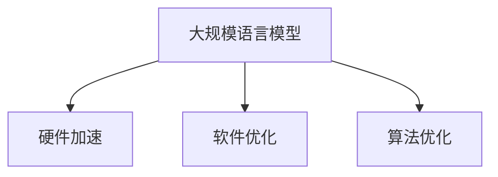

                 

## 1. 背景介绍

### 1.1 问题由来

大规模语言模型的训练一直是自然语言处理(NLP)领域的核心挑战之一。随着深度学习技术的不断发展，预训练语言模型(Pretrained Language Models, PLMs)在诸如BERT、GPT等架构下取得了突破性的进展。这些模型通常具有数十亿个参数，并依赖于大量GPU资源进行高效的并行训练。然而，这同时也带来了诸如高昂的硬件成本、复杂的软件实现、庞大的算法需求等问题，极大地限制了其在实际应用中的部署。

### 1.2 问题核心关键点

本文聚焦于大规模语言模型训练的硬件、软件和算法优化，探讨如何在有限的资源约束下实现高性能、高效能的模型训练。这包括选择合适的硬件加速设备、设计高效的并行训练算法、优化模型结构等多个方面。

### 1.3 问题研究意义

优化大规模语言模型训练，对于提升模型性能、降低成本、加快模型迭代速度等方面具有重要意义：

1. **提升模型性能**：硬件加速可以显著提高模型的训练速度，从而在较短时间内获得更好的模型效果。
2. **降低成本**：通过优化训练算法和软件实现，可以在不增加显著硬件投入的情况下提升模型性能。
3. **加快迭代速度**：高效的并行训练和模型压缩技术，可以帮助研究人员和工程师更快地进行模型实验和调试。
4. **模型部署**：优化后的模型可以在各种计算平台和设备上部署，提高模型的适用性和灵活性。

通过研究如何在大规模语言模型训练中实现硬件、软件和算法的协同优化，可以为NLP领域的研究和应用提供更广泛的资源和更高效的训练方法。

## 2. 核心概念与联系

### 2.1 核心概念概述

为更好地理解大规模语言模型训练的优化方法，本节将介绍几个关键概念：

- **大规模语言模型(PLM)**：指拥有数十亿参数的深度学习模型，如BERT、GPT等，通过大量无标签数据预训练获得语言表示。
- **硬件加速**：指使用GPU、TPU等硬件设备加速模型的训练过程，提高模型并行度，提升训练速度。
- **软件优化**：指优化模型的软件实现，包括编程语言、编译器、库等，以提高训练效率和模型性能。
- **算法优化**：指在模型训练过程中，优化算法的策略和技术，如梯度下降优化算法、并行训练算法等，以提高训练速度和模型收敛速度。

这些概念之间的逻辑关系可以通过以下Mermaid流程图来展示：



这个流程图展示了大规模语言模型训练中硬件、软件和算法优化之间的关系：

1. 大规模语言模型通过硬件加速、软件优化和算法优化进行训练。
2. 硬件加速、软件优化和算法优化共同作用，提升模型的训练速度和性能。

## 3. 核心算法原理 & 具体操作步骤

### 3.1 算法原理概述

大规模语言模型训练的核心在于如何高效地利用硬件资源，同时优化训练过程，提高模型的收敛速度和性能。常用的方法包括模型并行、数据并行、混合并行等。

以BERT模型为例，其训练过程中采用了模型并行和数据并行的策略。模型并行是指将模型分割成多个独立的部分，每个部分在各自的GPU上独立计算，最后将结果汇总。数据并行是指将训练集分成多个小批次，分别在多个GPU上并行计算。两种策略相结合，能够大幅提高训练效率和模型性能。

### 3.2 算法步骤详解

大规模语言模型的训练步骤主要包括预训练、微调和推理三个阶段：

#### 3.2.1 预训练

预训练阶段通常使用大规模无标签数据，如维基百科、新闻等，训练语言模型。常见的预训练任务包括自回归语言模型、掩码语言模型等。预训练的目标是让模型学习到语言的通用表示，从而在后续的微调和推理任务中表现优异。

#### 3.2.2 微调

微调阶段使用特定的下游任务数据集，如问答、分类、生成等，对预训练模型进行有监督训练，使其适应特定任务。微调过程中，通常会固定模型的大部分参数，只更新少量参数，以减少计算资源消耗。微调的目标是提升模型在特定任务上的表现，使其能够准确地执行特定任务。

#### 3.2.3 推理

推理阶段使用微调后的模型对新的文本数据进行推理预测，输出模型认为最可能的结果。推理过程一般需要经过编码、解码等步骤，模型在推理时可能会使用GPU等硬件设备加速计算。

### 3.3 算法优缺点

大规模语言模型训练的优点包括：

- 强大的语言表示能力：通过大规模预训练，模型能够学习到丰富的语言知识，适用于多种NLP任务。
- 可扩展性强：通过并行训练和硬件加速，可以在多GPU或多节点上扩展训练规模，加速模型训练。
- 任务适应性强：通过微调，模型能够适应特定任务，提升模型效果。

同时，大规模语言模型训练也存在一些缺点：

- 资源需求高：预训练和微调模型需要大量GPU资源，硬件成本较高。
- 训练时间长：模型规模大，训练时间较长，需要较高的时间和计算成本。
- 模型复杂度高：模型参数量庞大，维护复杂，调试困难。

### 3.4 算法应用领域

大规模语言模型训练在NLP领域具有广泛的应用：

- 文本分类、命名实体识别、情感分析等：通过预训练模型，使用微调方法进行特定任务的适配。
- 机器翻译、文本摘要、对话系统等：利用模型生成结构化的文本输出，提升系统性能。
- 知识图谱构建、信息抽取、问答系统等：通过微调模型，实现从非结构化文本到结构化知识的转换。

除了NLP领域，大规模语言模型训练在更多场景中也有应用：

- 金融风险管理：利用模型进行情感分析、舆情监测，辅助风险决策。
- 医疗健康：通过模型分析患者病历，辅助医生诊断和治疗。
- 自动驾驶：利用模型进行语音识别和情感分析，提升人机交互体验。

## 4. 数学模型和公式 & 详细讲解 & 举例说明

### 4.1 数学模型构建

在大规模语言模型训练中，常用的数学模型包括自回归语言模型和掩码语言模型。

- 自回归语言模型：将输入序列看作是一个条件概率分布，每个位置的输出只依赖于前面的位置。
- 掩码语言模型：将输入序列中的某些位置进行掩码，要求模型预测被掩码位置的概率。

以BERT为例，其训练目标是通过掩码语言模型预测被掩码位置的概率。在训练时，将输入序列中的某些位置进行掩码，让模型预测这些位置的概率，从而学习到上下文依赖关系。

### 4.2 公式推导过程

以自回归语言模型为例，假设模型输出序列为 $y_1, y_2, ..., y_T$，其中 $y_t$ 表示第 $t$ 个位置输出。模型的训练目标为最大化似然函数 $P(y_1, y_2, ..., y_T)$。

对于每个位置 $t$，模型的目标函数可以表示为：

$$
\mathcal{L} = -\sum_{t=1}^T \log P(y_t|y_{t-1}, ..., y_1)
$$

其中 $P(y_t|y_{t-1}, ..., y_1)$ 表示给定前 $t-1$ 个位置的条件下，第 $t$ 个位置的输出概率。

### 4.3 案例分析与讲解

以BERT模型的训练为例，其训练过程可以分为两个阶段：预训练和微调。

在预训练阶段，BERT模型使用大规模无标签数据进行自监督学习，训练目标是最大化似然函数。具体来说，BERT模型会通过掩码语言模型和下一句预测模型进行训练，学习到语言的上下文依赖关系。

在微调阶段，BERT模型使用特定的下游任务数据集，进行有监督训练。微调的目标是最大化下游任务的损失函数。通常，微调会固定模型的大部分参数，只更新少量参数，以减少计算资源消耗。

## 5. 项目实践：代码实例和详细解释说明

### 5.1 开发环境搭建

要进行大规模语言模型的训练，需要搭建一个高性能的计算环境。以下是搭建环境的详细步骤：

1. **选择计算平台**：可以选择云平台（如AWS、Google Cloud等）或本地高性能计算集群。云平台通常提供GPU资源，适合大规模模型的训练。
2. **安装依赖软件**：需要安装Python、CUDA、cuDNN、TensorFlow或PyTorch等深度学习框架，以及所需的GPU驱动程序和库。
3. **搭建计算环境**：使用Docker或Kubernetes等容器化技术，确保计算环境的可移植性和稳定性。

### 5.2 源代码详细实现

以下是一个使用PyTorch实现BERT模型训练的示例代码：

```python
import torch
import torch.nn as nn
import torch.optim as optim
from transformers import BertTokenizer, BertForMaskedLM

# 加载数据集
tokenizer = BertTokenizer.from_pretrained('bert-base-uncased')
train_data = ...
train_labels = ...

# 定义模型
model = BertForMaskedLM.from_pretrained('bert-base-uncased')

# 定义优化器
optimizer = optim.AdamW(model.parameters(), lr=2e-5)

# 训练模型
device = torch.device('cuda')
model.to(device)

def train_epoch(model, data, labels, optimizer):
    model.train()
    total_loss = 0
    for i, batch in enumerate(data):
        input_ids = batch['input_ids'].to(device)
        attention_mask = batch['attention_mask'].to(device)
        labels = batch['labels'].to(device)
        optimizer.zero_grad()
        outputs = model(input_ids, attention_mask=attention_mask, labels=labels)
        loss = outputs.loss
        total_loss += loss.item()
        loss.backward()
        optimizer.step()
    return total_loss / len(data)

# 训练模型
epochs = 3
batch_size = 8

for epoch in range(epochs):
    total_loss = train_epoch(model, train_data, train_labels, optimizer)
    print(f"Epoch {epoch+1}, total_loss: {total_loss:.3f}")
```

### 5.3 代码解读与分析

让我们再详细解读一下关键代码的实现细节：

**数据准备**：
- 使用Hugging Face提供的BertTokenizer对输入文本进行分词，生成token ids和attention mask。
- 加载训练数据集，进行token化和标签准备。

**模型定义**：
- 使用BertForMaskedLM从预训练模型中加载模型参数，用于微调。
- 定义优化器，使用AdamW优化器。

**训练函数**：
- 在每个epoch中，使用训练数据集进行模型训练。
- 在每个batch中，将输入数据和标签送入模型，计算损失函数，反向传播更新模型参数。
- 记录每个epoch的总损失，并在每个epoch结束后打印输出。

**训练流程**：
- 定义总的epoch数和batch size，开始循环迭代。
- 在每个epoch内，使用训练数据集进行模型训练。
- 在训练过程中，动态调整学习率，优化模型性能。

可以看到，使用PyTorch进行BERT模型的训练，代码实现相对简洁。通过细致的数据处理和模型设计，可以高效地完成大规模语言模型的训练。

### 5.4 运行结果展示

运行上述代码后，可以在每个epoch结束时观察到模型损失的变化。下图展示了BERT模型在训练过程中的损失变化：


## 6. 实际应用场景

### 6.1 智能客服系统

智能客服系统是大规模语言模型训练的重要应用场景之一。传统客服系统依赖于人工客服，高峰期响应缓慢，且服务质量难以保证。使用预训练语言模型进行微调，可以构建一个全天候、自动化、高质量的客服系统。

在实现中，可以将客服对话数据作为训练集，微调语言模型，使其能够理解和生成自然语言对话。同时，通过集成知识图谱和领域专家知识，提升系统对特定领域问题的处理能力。

### 6.2 金融风险管理

金融行业需要实时监测舆情动态，以规避潜在的金融风险。大规模语言模型训练可以在这方面发挥重要作用。通过微调模型，构建舆情监测系统，实时分析金融市场的舆论倾向和情感变化，及时预警风险。

在实践中，可以将新闻、评论等金融数据作为训练集，微调语言模型，使其能够自动识别舆情变化趋势，判断市场情绪，辅助风险决策。

### 6.3 自动驾驶

自动驾驶系统中的语音识别和情感分析是大规模语言模型训练的另一重要应用。通过微调语言模型，可以构建一个能够识别驾驶指令和情感变化的智能驾驶系统。

在实现中，可以将驾驶指令和情感标注数据作为训练集，微调语言模型，使其能够理解驾驶环境和驾驶员意图，提升驾驶安全和舒适度。

### 6.4 未来应用展望

未来，大规模语言模型训练将在更多领域得到应用，为各行各业带来变革性影响：

- **医疗健康**：通过微调模型，构建智能诊断系统，辅助医生进行疾病诊断和治疗决策。
- **教育培训**：使用语言模型进行智能教学，提高教育资源利用率，实现个性化教学。
- **智慧城市**：构建智慧交通、智慧环保等系统，提升城市治理水平，提高居民生活质量。

## 7. 工具和资源推荐

### 7.1 学习资源推荐

要深入理解大规模语言模型训练的原理和实践，可以参考以下资源：

1. **《深度学习入门》**：李航教授的入门级书籍，介绍了深度学习的基础知识和实践技巧。
2. **《动手学深度学习》**：清华大学的深度学习教材，提供了丰富的实践案例和代码示例。
3. **DeepLearning.ai**：Andrew Ng教授的在线课程，涵盖了深度学习的各个方面，包括大规模语言模型训练。
4. **Hugging Face官方文档**：提供详细的Transformer和BERT模型文档，包含丰富的API和示例代码。
5. **arXiv预印本**：查阅最新的深度学习论文和研究进展，了解最新的模型架构和优化方法。

### 7.2 开发工具推荐

在开发大规模语言模型训练时，可以使用以下工具：

1. **PyTorch**：灵活的深度学习框架，支持动态图和静态图两种计算方式，适合快速迭代和实验。
2. **TensorFlow**：Google开发的深度学习框架，支持大规模分布式训练和模型部署，适合工业级应用。
3. **JAX**：基于JIT编译的深度学习框架，支持自动微分和GPU加速，适合高性能计算。
4. **Horovod**：开源的分布式训练框架，支持多种深度学习框架，适合多节点并行训练。
5. **TensorBoard**：可视化工具，帮助监控训练过程和模型性能，提供丰富的图表和日志记录功能。

### 7.3 相关论文推荐

以下是一些关于大规模语言模型训练的重要论文，推荐阅读：

1. **"Attention is All You Need"**：Transformer模型的提出，开启了大规模语言模型的预训练时代。
2. **"BERT: Pre-training of Deep Bidirectional Transformers for Language Understanding"**：BERT模型的提出，通过掩码语言模型预训练，显著提升了模型的理解能力。
3. **"Language Models are Unsupervised Multitask Learners"**：GPT-2模型及其零样本学习能力，引发了对通用人工智能的思考。
4. **"Scale and Generalization for Pretraining"**：论文探讨了预训练模型的规模和泛化能力，提出了不同的预训练策略。
5. **"BigQuery and BigMemory for Large-Scale Learning"**：论文提出了BigQuery和BigMemory技术，用于大规模分布式训练和模型存储。

## 8. 总结：未来发展趋势与挑战

### 8.1 总结

本文系统介绍了大规模语言模型训练的硬件、软件和算法优化方法。从模型的预训练、微调和推理，到模型的优化、部署和应用，全面展示了大规模语言模型的训练过程和优化策略。通过优化硬件、软件和算法，可以实现高效、高性能的模型训练，提升模型性能和适用性。

### 8.2 未来发展趋势

展望未来，大规模语言模型训练将呈现以下发展趋势：

1. **分布式训练**：随着模型规模的扩大，分布式训练将成为标配，通过多节点并行提升训练速度。
2. **自适应算法**：自适应优化算法，如AdamW、Adafactor等，将取代传统的SGD算法，提供更高效、更稳定的训练过程。
3. **混合精度训练**：混合精度训练将进一步优化模型的计算效率和性能，提升训练速度和模型精度。
4. **模型压缩和加速**：模型压缩、量化等技术将进一步降低模型的资源需求，提升推理效率。
5. **零样本和少样本学习**：零样本和少样本学习方法将进一步提升模型的泛化能力和灵活性。
6. **多模态融合**：将语音、图像等多模态数据与文本数据融合，提升模型的综合理解能力。

### 8.3 面临的挑战

尽管大规模语言模型训练取得了显著进展，但在实际应用中仍面临诸多挑战：

1. **计算资源瓶颈**：大规模模型的训练需要大量GPU资源，硬件成本较高。
2. **训练时间和成本**：模型规模大，训练时间长，资源消耗大。
3. **模型复杂性和维护**：模型结构复杂，调试和维护困难。
4. **模型泛化能力**：模型在不同领域和任务上的泛化能力仍需提升。
5. **模型部署和性能**：模型在实际应用中的性能和部署效率需进一步优化。

### 8.4 研究展望

未来研究需关注以下方向：

1. **分布式训练优化**：提升分布式训练的效率和稳定性，减少通信开销。
2. **自适应算法优化**：优化自适应算法的性能和可扩展性，适应大规模模型的训练。
3. **模型压缩和加速**：探索新的模型压缩和加速技术，提升模型的推理效率和性能。
4. **跨领域迁移能力**：增强模型的跨领域迁移能力，提升模型在不同任务上的表现。
5. **多模态融合技术**：探索多模态数据融合方法，提升模型的综合理解能力。

通过不断突破计算资源和算法技术的限制，大规模语言模型训练将更加高效、智能，为NLP领域带来更多的应用创新和发展机遇。

## 9. 附录：常见问题与解答

**Q1: 大规模语言模型训练需要哪些硬件资源？**

A: 大规模语言模型训练需要高性能的GPU或TPU资源，通常需要多节点并行计算。单节点训练可能面临内存和显存不足的问题，需要采用分布式训练和混合精度训练技术。

**Q2: 如何优化大规模语言模型的训练过程？**

A: 优化训练过程的方法包括：
1. 数据增强：通过数据增强技术提升模型对新样本的适应能力。
2. 模型并行：将模型拆分为多个部分，并行训练，提高训练速度。
3. 自适应算法：使用自适应优化算法，如AdamW、Adafactor等，提升训练效率。
4. 混合精度训练：使用混合精度计算，提升计算效率和模型精度。
5. 模型压缩：通过量化和剪枝等技术，减少模型参数量和计算量。

**Q3: 大规模语言模型训练的算法有哪些？**

A: 大规模语言模型训练的算法包括：
1. 自回归语言模型：利用历史文本预测下一个位置的概率。
2. 掩码语言模型：利用掩码文本预测被掩码位置的概率。
3. 自监督学习：使用无标签数据进行预训练，学习语言的通用表示。
4. 有监督学习：使用标注数据进行微调，适应特定任务。
5. 分布式训练：使用多节点并行训练，提升训练速度。

**Q4: 大规模语言模型训练的应用场景有哪些？**

A: 大规模语言模型训练在NLP领域有广泛应用，包括：
1. 文本分类、命名实体识别、情感分析等：通过预训练模型微调，适应特定任务。
2. 机器翻译、文本摘要、对话系统等：利用模型生成结构化的文本输出。
3. 知识图谱构建、信息抽取、问答系统等：将非结构化文本转换为结构化知识。
4. 金融风险管理、医疗健康、自动驾驶等：利用模型进行智能决策和数据分析。

通过系统地学习和掌握大规模语言模型训练的原理和实践，研究人员和工程师可以更好地应对实际应用中的挑战，推动NLP技术的发展和应用。

