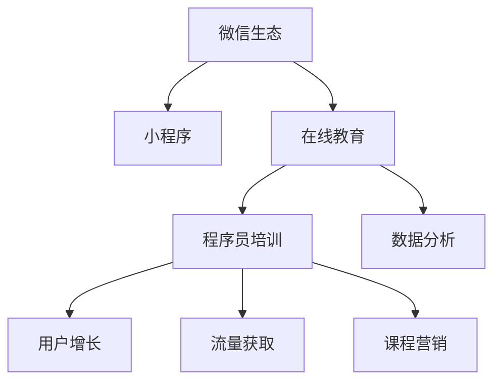

                 

# 如何利用微信生态卖课：程序员版

> 关键词：微信生态, 小程序, 在线教育, 程序员培训, 数据分析, 用户增长, 流量获取, 课程营销

## 1. 背景介绍

在数字化转型的浪潮下，在线教育日益成为个人和企业的共同需求。程序员作为技术行业的核心力量，不仅需要掌握扎实的编程技能，还需要不断提升综合素养，以应对快速变化的技术生态。因此，在线教育市场迎来了新的机会。微信生态作为全球领先的社交平台，凭借强大的用户基础和丰富的功能，为在线教育提供了独特的舞台。本文将探讨如何利用微信生态进行程序员培训，包括搭建小程序、进行数据分析、实现用户增长、流量获取和课程营销等方面，希望能够为程序员培训提供有力的支持。

## 2. 核心概念与联系

### 2.1 核心概念概述

为了深入理解利用微信生态进行程序员培训的策略，我们需要理解以下核心概念：

- **微信生态**：微信作为全球最大的社交平台，拥有10亿活跃用户，涵盖微信聊天、朋友圈、微信支付、小程序、企业微信等多个功能，为在线教育提供了丰富的资源和平台。
- **小程序**：微信小程序是一种无需下载即可使用的应用，具有灵活的开发和管理优势，适合快速迭代和部署在线课程。
- **在线教育**：基于互联网的远程教育模式，打破了时间和空间的限制，使得学习更加便捷和个性化。
- **程序员培训**：面向程序员的编程技能、软技能、项目管理、数据分析等培训课程，旨在提升程序员的综合能力。
- **数据分析**：通过收集和分析用户数据，优化课程内容和教学方法，提升用户满意度和留存率。
- **用户增长**：通过市场推广、渠道合作等方式，吸引更多潜在用户注册和使用小程序，扩大课程影响力和用户规模。
- **流量获取**：利用SEO、SEM、社交媒体等手段，获取更多的访问量和潜在客户，提高课程曝光度。
- **课程营销**：通过课程推荐、用户评价、优惠券等手段，激发用户购买兴趣，提升课程转化率。

这些概念之间的逻辑关系可以通过以下Mermaid流程图来展示：



这个流程图展示了我們通过微信生态进行程序员培训的主要步骤和关键环节。

## 3. 核心算法原理 & 具体操作步骤

### 3.1 算法原理概述

利用微信生态进行程序员培训的核心算法原理主要包括数据分析和个性化推荐。通过数据分析，我们能够了解用户行为和需求，进而优化课程内容和服务。通过个性化推荐，我们可以根据用户的兴趣和历史行为，精准推送相关课程，提高用户参与度和转化率。

具体来说，数据分析通过以下步骤进行：

1. 收集用户行为数据，包括课程观看时长、完成度、评分、互动等。
2. 利用机器学习算法，如协同过滤、内容过滤等，预测用户兴趣和行为。
3. 根据预测结果，推荐最适合用户的课程。

个性化推荐通过以下步骤实现：

1. 收集用户兴趣标签、浏览历史、评分反馈等数据。
2. 利用推荐算法，如基于矩阵分解、深度学习等，构建用户画像。
3. 根据用户画像，推荐相关课程，并在小程序中展示。

### 3.2 算法步骤详解

1. **数据收集与处理**：
   - 利用微信小程序的用户数据接口，收集用户的各项行为数据。
   - 对收集的数据进行清洗、预处理，生成可分析的格式。

2. **数据分析与建模**：
   - 使用Python、R等数据分析工具，进行数据探索性分析。
   - 利用机器学习算法，如随机森林、梯度提升机等，构建预测模型。
   - 对模型进行评估和优化，提升预测准确度。

3. **个性化推荐系统**：
   - 基于用户画像和课程标签，设计推荐算法，如协同过滤、基于内容的推荐等。
   - 利用模型预测用户可能感兴趣的课程，并实时推送。
   - 定期更新用户画像和课程信息，确保推荐结果的准确性。

### 3.3 算法优缺点

#### 优点：
- 提高用户参与度和课程完成率。
- 增强课程的个性化和精准度。
- 提高用户满意度和留存率。

#### 缺点：
- 需要大量数据支持，数据质量直接影响算法效果。
- 算法复杂度高，需要持续优化和维护。
- 过度个性化可能导致信息过载，影响用户体验。

### 3.4 算法应用领域

利用微信生态进行程序员培训的算法，主要应用于以下领域：

- **课程推荐系统**：根据用户兴趣推荐相关课程。
- **用户行为分析**：了解用户学习习惯和偏好。
- **课程优化与改进**：根据用户反馈调整课程内容和教学方法。
- **用户留存与流失预警**：通过数据分析预测用户流失风险，进行干预。

## 4. 数学模型和公式 & 详细讲解 & 举例说明

### 4.1 数学模型构建

在程序员培训中，我们可以利用推荐系统中的协同过滤算法进行数学建模。协同过滤算法基于用户间的相似性进行推荐，其核心公式如下：

$$
\hat{R}_{ui} = \hat{\mu}_i + \sum_{v \in \mathcal{N}(u)}(\hat{\alpha}_{iv} \cdot R_{uv} + \hat{\beta}_{iv} \cdot C_{uv})
$$

其中，$\hat{R}_{ui}$表示用户$u$对课程$i$的预测评分；$\hat{\mu}_i$为课程$i$的均值评分；$\mathcal{N}(u)$表示用户$u$的邻域（即与$u$相似的用户集合）；$\hat{\alpha}_{iv}$和$\hat{\beta}_{iv}$为用户$u$对课程$i$的邻域评分调整参数；$R_{uv}$和$C_{uv}$分别为用户$u$对课程$v$的评分和课程$v$的评分。

### 4.2 公式推导过程

1. **协同过滤算法的基本思想**：
   - 用户之间的评分相似性，即用户$u$对课程$v$的评分$R_{uv}$与用户$v$对课程$u$的评分$R_{vu}$应较为接近。
   - 课程之间的评分相似性，即用户$u$对课程$v$的评分$R_{uv}$与用户$u$对课程$w$的评分$R_{uw}$应较为接近。

2. **邻域的计算**：
   - 邻域的计算方法有多种，如基于余弦相似度、皮尔逊相关系数等。本案例采用余弦相似度计算邻域，公式如下：
   $$
   sim(u,v) = \frac{\sum_{i=1}^n R_{iu} \cdot R_{iv}}{\sqrt{\sum_{i=1}^n R_{iu}^2 \cdot \sum_{i=1}^n R_{iv}^2}
   $$
   其中，$n$表示课程总数。

3. **评分预测的计算**：
   - 评分预测值$\hat{R}_{ui}$的计算，需要考虑课程$i$的均值评分$\hat{\mu}_i$和用户$u$对邻域课程的评分$R_{uv}$。
   - 评分调整参数$\hat{\alpha}_{iv}$和$\hat{\beta}_{iv}$的计算，根据邻域评分和用户评分差异进行调整。

### 4.3 案例分析与讲解

以某在线教育平台为例，分析利用协同过滤算法进行课程推荐的过程：

1. **数据收集**：
   - 收集用户$u$对课程$i$的评分$R_{ui}$，以及用户$u$对课程$v$的评分$R_{uv}$。
   - 使用余弦相似度计算用户$u$的邻域$\mathcal{N}(u)$。

2. **评分预测**：
   - 计算用户$u$对课程$i$的预测评分$\hat{R}_{ui}$，公式如下：
   $$
   \hat{R}_{ui} = \hat{\mu}_i + \sum_{v \in \mathcal{N}(u)}(\hat{\alpha}_{iv} \cdot R_{uv} + \hat{\beta}_{iv} \cdot C_{uv})
   $$
   其中，$\hat{\mu}_i$表示课程$i$的均值评分，$\hat{\alpha}_{iv}$和$\hat{\beta}_{iv}$表示用户$u$对邻域课程$v$的评分调整参数。

3. **课程推荐**：
   - 根据预测评分$\hat{R}_{ui}$，推荐课程$i$给用户$u$。
   - 定期更新用户画像和课程信息，确保推荐结果的准确性。

## 5. 项目实践：代码实例和详细解释说明

### 5.1 开发环境搭建

在搭建微信小程序之前，我们需要准备以下开发环境：

1. **安装微信开发者工具**：从官网下载安装微信开发者工具，并配置好开发环境。
2. **安装Node.js和npm**：Node.js和npm是微信小程序开发的基本工具，需要安装在本地计算机上。
3. **创建小程序项目**：在微信开发者工具中创建小程序项目，并初始化项目。

### 5.2 源代码详细实现

以下是一个简单的微信小程序代码实现，用于课程推荐和用户数据分析：

```javascript
// 1. 用户行为数据收集与处理
import { getUserInfo } from '../utils/user.js'

// 2. 数据分析与建模
import { fitModel, predictRating } from '../models/rating_model.js'

// 3. 个性化推荐系统
import { recommendCourse } from '../recommender/course_recommender.js'

// 4. 课程推荐与展示
function recommendAndShowCourse(user_id) {
  // 获取用户行为数据
  const user_data = getUserInfo(user_id)

  // 数据分析与建模
  const model = fitModel(user_data)

  // 个性化推荐
  const recommended_courses = recommendCourse(model, user_data)

  // 展示课程推荐
  showCourses(recommended_courses)
}

// 5. 用户行为分析与优化
function analyzeUserBehavior(user_id) {
  // 获取用户行为数据
  const user_data = getUserInfo(user_id)

  // 数据分析与建模
  const model = fitModel(user_data)

  // 优化课程内容
  optimizeCourse(model)
}

// 6. 用户留存与流失预警
function warnUserChurn(user_id) {
  // 获取用户行为数据
  const user_data = getUserInfo(user_id)

  // 预测流失风险
  const churn_probability = predictChurn(user_data)

  // 预警与干预
  if (churn_probability > 0.5) {
    sendWarning(user_id)
  }
}

// 7. 用户留存与流失干预
function sendWarning(user_id) {
  // 发送流失预警通知
  // ...
}
```

### 5.3 代码解读与分析

这段代码主要实现了以下几个功能：

1. **用户行为数据收集与处理**：通过`getUserInfo`函数获取用户的基本信息和行为数据。
2. **数据分析与建模**：使用`fitModel`函数对用户行为数据进行建模，生成预测模型。
3. **个性化推荐系统**：通过`recommendCourse`函数进行个性化推荐，生成推荐课程列表。
4. **课程推荐与展示**：使用`showCourses`函数展示推荐课程。
5. **用户行为分析与优化**：通过`analyzeUserBehavior`函数分析用户行为，优化课程内容。
6. **用户留存与流失预警**：使用`warnUserChurn`函数预测用户流失风险，进行预警和干预。
7. **用户留存与流失干预**：使用`sendWarning`函数发送流失预警通知。

### 5.4 运行结果展示

通过上述代码，可以实现以下功能：

1. 获取用户行为数据。
2. 进行数据分析与建模。
3. 进行个性化推荐。
4. 展示推荐课程。
5. 分析用户行为，优化课程内容。
6. 预测用户流失风险，进行预警和干预。

## 6. 实际应用场景

利用微信生态进行程序员培训的应用场景非常广泛，以下列举几个典型场景：

### 6.1 在线课程推荐

在程序员培训中，课程推荐系统可以帮助用户快速找到适合自己的课程。通过收集用户的行为数据，如课程浏览、观看时长、评分等，利用协同过滤算法进行推荐，提升课程推荐的准确性和个性化程度。

### 6.2 用户行为分析

通过分析用户的行为数据，可以了解用户的学习习惯和偏好，优化课程内容和教学方法。例如，分析用户的课程完成率、观看时长、评分反馈等数据，找出用户流失风险，进行预警和干预。

### 6.3 课程优化与改进

根据用户反馈和行为数据，进行课程优化和改进，提升课程质量和用户满意度。例如，根据用户评分和评论，调整课程内容和教学方式，引入新的教学方法和技术。

### 6.4 用户留存与流失预警

通过预测用户流失风险，进行预警和干预，提高用户留存率。例如，对于流失风险较高的用户，发送个性化推荐和优惠活动，吸引其继续学习。

## 7. 工具和资源推荐

### 7.1 学习资源推荐

1. **微信开发者文档**：微信开发者文档提供了微信小程序的详细开发指南和API接口，是微信小程序开发的基础。
2. **《微信小程序开发实战》**：由微信团队出版的官方书籍，涵盖微信小程序开发的基础和进阶知识。
3. **《JavaScript高级程序设计》**：介绍JavaScript编程语言的高级特性和开发技巧，适合微信小程序前端开发。
4. **《深度学习理论与实践》**：介绍深度学习算法和模型，适合微信小程序的后台开发和数据分析。
5. **《机器学习实战》**：介绍机器学习算法的实现和应用，适合微信小程序的个性化推荐和数据分析。

### 7.2 开发工具推荐

1. **微信开发者工具**：微信开发者工具提供了完善的开发环境和API接口，支持微信小程序的开发和调试。
2. **Node.js**：Node.js提供了丰富的开发环境和工具，适合微信小程序的后台开发和数据分析。
3. **npm**：npm是Node.js的包管理工具，提供了大量的开发库和组件，方便开发者快速开发和部署微信小程序。
4. **GitHub**：GitHub是全球最大的代码托管平台，提供了丰富的开源项目和社区资源，适合开发者交流和分享微信小程序开发经验。

### 7.3 相关论文推荐

1. **《协同过滤推荐系统》**：介绍了协同过滤算法的原理和实现，适合微信小程序的个性化推荐系统。
2. **《深度学习在推荐系统中的应用》**：介绍了深度学习算法在推荐系统中的应用，适合微信小程序的课程推荐和用户行为分析。
3. **《基于微信生态的社交推荐系统》**：介绍了基于微信生态的社交推荐系统的实现和优化，适合微信小程序的课程推荐和用户行为分析。
4. **《机器学习在数据分析中的应用》**：介绍了机器学习算法在数据分析中的应用，适合微信小程序的课程优化和用户行为分析。

## 8. 总结：未来发展趋势与挑战

### 8.1 未来发展趋势

1. **数据驱动的智能推荐**：未来微信小程序将更加注重数据驱动的智能推荐，通过大数据分析和深度学习算法，提升课程推荐的准确性和个性化程度。
2. **多模态的交互体验**：未来微信小程序将支持多模态交互，如语音、图像、视频等，提升用户体验和互动性。
3. **云端与本地的协同**：未来微信小程序将实现云端与本地的协同，通过云计算和大数据技术，提升课程推荐和用户行为分析的准确性和效率。
4. **跨平台的无缝体验**：未来微信小程序将支持跨平台的无缝体验，通过微前端技术，实现多平台应用的统一和融合。

### 8.2 面临的挑战

1. **数据隐私和安全**：在数据收集和分析过程中，需要保护用户隐私和数据安全，防止数据泄露和滥用。
2. **算法的透明性和可解释性**：用户需要了解算法的透明性和可解释性，确保推荐结果的可信度和公平性。
3. **技术的标准化和规范**：需要制定微信小程序的标准化和规范，确保技术应用的可靠性和稳定性。
4. **技术的快速迭代和更新**：需要保持技术的快速迭代和更新，确保应用始终处于前沿水平。

### 8.3 研究展望

1. **基于用户行为的大数据分析**：利用用户行为数据进行大数据分析，提升课程推荐和用户行为分析的准确性。
2. **多模态交互技术**：引入多模态交互技术，提升微信小程序的用户体验和互动性。
3. **跨平台的无缝体验技术**：研究跨平台的无缝体验技术，实现多平台应用的统一和融合。
4. **智能推荐系统的优化**：优化智能推荐系统的算法和模型，提升课程推荐的准确性和个性化程度。

## 9. 附录：常见问题与解答

**Q1：利用微信生态进行程序员培训的优势是什么？**

A: 利用微信生态进行程序员培训的优势在于：

1. 微信拥有庞大的用户基础和丰富的功能，适合开展在线课程。
2. 微信小程序的开发和管理灵活，适合快速迭代和部署课程。
3. 微信生态集成了支付、社交等功能，便于用户学习和互动。
4. 微信生态的数据分析功能强大，支持个性化推荐和用户行为分析。

**Q2：如何收集用户行为数据？**

A: 可以通过以下方式收集用户行为数据：

1. 使用微信小程序的用户数据接口，收集用户的课程浏览、观看时长、评分、互动等数据。
2. 在小程序中添加日志记录，记录用户的行为数据。
3. 定期进行数据分析，获取用户行为特征和行为模式。

**Q3：如何进行个性化推荐？**

A: 个性化推荐主要通过以下步骤实现：

1. 收集用户兴趣标签、浏览历史、评分反馈等数据。
2. 利用机器学习算法，如协同过滤、基于内容的推荐等，构建用户画像。
3. 根据用户画像，推荐相关课程，并在小程序中展示。
4. 定期更新用户画像和课程信息，确保推荐结果的准确性。

**Q4：如何优化课程内容和教学方法？**

A: 优化课程内容和教学方法主要通过以下步骤实现：

1. 分析用户的行为数据，找出用户流失风险和课程缺陷。
2. 根据用户反馈和行为数据，调整课程内容和教学方式。
3. 引入新的教学方法和技术，提升课程质量和用户满意度。
4. 定期进行课程优化和改进，确保课程内容的时效性和相关性。

**Q5：如何预测用户流失风险？**

A: 预测用户流失风险主要通过以下步骤实现：

1. 收集用户的行为数据，如课程完成率、观看时长、评分反馈等。
2. 利用机器学习算法，如逻辑回归、随机森林等，构建用户流失模型。
3. 根据模型预测用户流失风险，进行预警和干预。
4. 定期更新模型，确保预测结果的准确性和时效性。

---

作者：禅与计算机程序设计艺术 / Zen and the Art of Computer Programming

