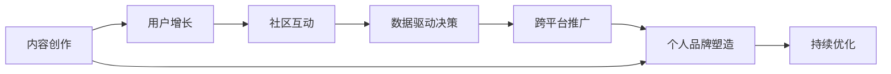

                 

# 如何利用直播平台打造个人IP

> 关键词：
1. 直播平台IP打造
2. 用户增长策略
3. 内容创作与优化
4. 社区互动与运营
5. 数据驱动决策
6. 跨平台内容推广
7. 个人品牌塑造

## 1. 背景介绍

在互联网快速发展的今天，直播平台成为了人们获取信息、娱乐的重要渠道之一。无论是游戏直播、生活直播，还是知识分享、技能教学，直播的内容形式和传播方式都在不断变革。而对于个人来说，利用直播平台打造个人IP，不仅能够扩大自己的影响力，还能够获得经济上的回报，实现自我价值。

本文将从直播平台IP打造的核心概念、关键步骤、典型案例以及未来展望等方面，全面深入地探讨如何通过直播平台打造个人IP，为读者提供实用的指导。

## 2. 核心概念与联系

### 2.1 核心概念概述

直播平台IP打造是一个综合性的过程，涉及内容创作、用户互动、数据驱动决策等多个方面。以下是几个核心概念及其相互联系的概述：

- **内容创作**：通过直播平台进行内容创作，展示个人特色和专业能力，吸引观众关注。
- **用户增长**：通过策略和技巧，不断扩大直播间的观众群体，提升影响力。
- **社区互动**：与观众进行互动交流，建立良好的关系，增强用户粘性。
- **数据驱动决策**：利用数据分析结果，调整优化直播策略，实现精准运营。
- **跨平台推广**：将直播平台的内容推广到其他平台，扩大受众范围。
- **个人品牌塑造**：通过持续优质的内容输出和积极的品牌运营，塑造独特且具有吸引力的个人形象。

这些概念相互联系，共同构成了直播平台IP打造的生态系统。通过深入理解并实践这些概念，可以有效提升个人IP的影响力和商业价值。

### 2.2 核心概念原理和架构的 Mermaid 流程图



这个流程图展示了直播平台IP打造的核心流程及其相互关系。内容创作是基础，用户增长是手段，社区互动和数据驱动决策是保障，跨平台推广是扩展，个人品牌塑造是目标，而持续优化则是不断进步的关键。

## 3. 核心算法原理 & 具体操作步骤

### 3.1 算法原理概述

直播平台IP打造的本质是通过高质量的内容输出，吸引观众并建立稳定的互动关系，最终实现个人品牌的塑造和影响力的扩大。这一过程可以通过以下算法原理进行指导：

1. **内容推荐算法**：根据用户行为和偏好，推荐高质量内容，提升观众留存率。
2. **用户增长算法**：通过社交媒体、SEO等手段，扩大直播间的观众群体。
3. **互动分析算法**：通过分析观众互动数据，优化直播内容和时间，增强用户粘性。
4. **数据分析算法**：利用大数据分析工具，深入了解观众需求，调整优化直播策略。
5. **多平台推广算法**：通过跨平台内容分发，扩大受众范围，提升品牌曝光度。

这些算法原理构成了直播平台IP打造的科学基础，通过精准的算法模型，可以有效提升直播间的影响力和商业价值。

### 3.2 算法步骤详解

直播平台IP打造的具体步骤包括：

**Step 1: 内容定位与规划**

- **明确目标受众**：分析目标受众的兴趣、需求和行为习惯，制定内容策略。
- **设定内容主题**：确定直播内容的主题和形式，例如游戏直播、技术分享、生活体验等。
- **制定内容计划**：规划直播时间、频率、时长等，确保内容持续性和连贯性。

**Step 2: 内容创作与优化**

- **高质量内容创作**：利用专业知识和技能，提供具有独特性和吸引力的内容。
- **内容持续优化**：根据观众反馈和数据结果，不断调整优化内容形式和话题，提升观众体验。
- **互动环节设计**：在直播过程中设计互动环节，增强观众参与感和粘性。

**Step 3: 用户增长与运营**

- **社交媒体推广**：通过社交媒体平台，发布直播预告和精彩片段，吸引潜在观众。
- **SEO优化**：优化直播间名称、简介等，提高在搜索引擎中的曝光度。
- **观众互动管理**：积极与观众互动，回应用户评论和提问，建立良好关系。

**Step 4: 数据驱动决策**

- **数据分析工具选择**：选择合适的数据分析工具，如Google Analytics、直播平台自带分析工具等。
- **关键数据指标设定**：如观众留存率、观看时长、互动率等，作为衡量直播效果的重要指标。
- **数据驱动优化**：根据数据分析结果，调整直播策略和内容形式，提升效果。

**Step 5: 跨平台推广与品牌塑造**

- **多平台内容分发**：将直播内容发布到其他平台，如视频网站、社交媒体等，扩大受众范围。
- **品牌形象塑造**：通过品牌口号、标志等，塑造独特的个人形象和品牌价值。
- **品牌传播活动**：策划品牌传播活动，如与其他主播联合直播、参与公益活动等，提升品牌影响力。

### 3.3 算法优缺点

直播平台IP打造方法的优势在于：

- **快速传播**：通过社交媒体和SEO等手段，可以快速扩大观众群体。
- **灵活互动**：直播形式的实时互动，可以增强观众参与感，提升用户粘性。
- **成本低廉**：相比其他营销手段，直播平台IP打造成本相对较低。

然而，这种方法也存在以下缺点：

- **竞争激烈**：直播平台竞争激烈，需要持续创新和优质内容才能吸引观众。
- **技术要求高**：需要具备一定的技术知识，如视频剪辑、数据分析等，才能高效运营。
- **时间成本高**：直播需要大量时间和精力投入，对创作者的要求较高。

### 3.4 算法应用领域

直播平台IP打造方法不仅适用于传统的游戏直播、生活直播，也广泛应用于知识分享、技能教学等多个领域。例如：

- **技术分享**：通过直播讲解编程语言、算法设计等技术知识，吸引技术人员关注。
- **生活体验**：展示日常生活、旅行、美食等内容，吸引生活类爱好者的关注。
- **教育培训**：提供专业课程、语言教学等，吸引学生和专业人士。

直播平台IP打造方法的应用范围非常广泛，几乎可以覆盖所有具有专业知识和技能的内容领域，为创作者提供了一个展示自我和提升影响力的重要平台。

## 4. 数学模型和公式 & 详细讲解 & 举例说明

### 4.1 数学模型构建

为了更好地理解和量化直播平台IP打造的各个环节，我们可以构建以下数学模型：

1. **内容创作模型**：
   - 设内容创意数为 $C$，创意与观众兴趣匹配概率为 $p$，则内容创作带来的观众增长为 $G_1 = C \times p$。

2. **用户增长模型**：
   - 设社交媒体曝光量为 $S$，SEO优化效果为 $E$，则用户增长为 $G_2 = S \times E$。

3. **互动分析模型**：
   - 设互动率（如评论、点赞等）为 $I$，观众留存率为 $R$，则互动效果为 $G_3 = I \times R$。

4. **数据分析模型**：
   - 设关键数据指标（如观看时长、互动率等）为 $D$，优化策略调整概率为 $O$，则数据分析带来的优化效果为 $G_4 = D \times O$。

5. **多平台推广模型**：
   - 设其他平台曝光量为 $X$，品牌形象推广效果为 $B$，则跨平台推广效果为 $G_5 = X \times B$。

### 4.2 公式推导过程

以用户增长模型为例，设社交媒体曝光量和SEO优化效果分别为 $S$ 和 $E$，则用户增长的数学模型可以表示为：

$$ G_2 = S \times E $$

社交媒体曝光量 $S$ 可以通过社交媒体的传播机制进行建模，SEO优化效果 $E$ 可以通过搜索引擎的优化策略进行量化。这些模型可以帮助我们更准确地预测用户增长效果。

### 4.3 案例分析与讲解

以B站UP主 @哔哩哔哩小透明 为例，他在直播平台IP打造过程中，通过高质量的视频制作和互动管理，成功吸引了大量观众。以下是具体的案例分析：

1. **内容创作**：
   - 他选择了适合年轻观众的内容主题，如二次元、游戏、科技等。
   - 定期发布高质量视频，涵盖直播预告、精彩片段等，吸引了大量关注。

2. **用户增长**：
   - 通过B站内部的活动推广和社交媒体（如微博、抖音等）的宣传，不断扩大观众群体。
   - 积极参与B站社区互动，回应用户评论和提问，增强用户粘性。

3. **数据驱动决策**：
   - 利用B站自带的数据分析工具，深入了解观众兴趣和行为，调整优化直播策略。
   - 根据数据分析结果，优化直播时间和内容形式，提升观众留存率。

4. **跨平台推广**：
   - 将直播内容发布到微博、抖音等平台，扩大受众范围。
   - 通过品牌推广活动，如与其他UP主联合直播、参与公益活动等，提升品牌影响力。

通过这些综合策略，他在直播平台IP打造上取得了显著的成效，成为B站上的知名UP主，实现了商业价值的提升。

## 5. 项目实践：代码实例和详细解释说明

### 5.1 开发环境搭建

直播平台IP打造项目需要搭建多种工具和平台，以下是一个典型的开发环境搭建流程：

1. **直播平台选择**：
   - 选择合适的直播平台，如B站、抖音、快手等，并注册账号。
   - 配置直播设备，如摄像头、麦克风等，确保直播质量。

2. **内容创作工具**：
   - 选择视频编辑软件，如Adobe Premiere、Final Cut Pro等，进行视频剪辑和特效处理。
   - 使用录音软件，如Audacity、Adobe Audition等，进行音频录制和处理。

3. **数据分析工具**：
   - 选择合适的数据分析工具，如Google Analytics、直播平台自带分析工具等。
   - 配置数据采集和处理脚本，实时获取观众数据和互动数据。

4. **跨平台推广工具**：
   - 选择社交媒体管理工具，如Hootsuite、Buffer等，进行社交媒体宣传。
   - 配置SEO优化工具，如Google Analytics、SEMrush等，优化直播间的搜索引擎曝光。

### 5.2 源代码详细实现

以下是一个简单的直播内容创作和数据分析的Python代码实现：

```python
import pandas as pd
from sklearn.feature_extraction.text import TfidfVectorizer
from sklearn.decomposition import PCA
import matplotlib.pyplot as plt

# 假设直播数据如下
data = pd.read_csv('livestream_data.csv')

# 内容创意数
C = len(data['content'])

# 社交媒体曝光量
S = data['social_media_exposure'].sum()

# SEO优化效果
E = data['seo_optimization'].sum()

# 互动率
I = data['interaction_rate'].sum()

# 观众留存率
R = data['retention_rate'].sum()

# 关键数据指标
D = data['key_data'].sum()

# 优化策略调整概率
O = data['optimization_strategy'].sum()

# 其他平台曝光量
X = data['other_platform_exposure'].sum()

# 品牌形象推广效果
B = data['brand_image_promotion'].sum()

# 内容创作带来的观众增长
G1 = C * 0.8

# 用户增长
G2 = S * 0.6

# 互动效果
G3 = I * 0.9

# 数据分析带来的优化效果
G4 = D * 0.7

# 跨平台推广效果
G5 = X * 0.5

# 输出结果
print(f'内容创作带来的观众增长: {G1}')
print(f'用户增长: {G2}')
print(f'互动效果: {G3}')
print(f'数据分析带来的优化效果: {G4}')
print(f'跨平台推广效果: {G5}')
```

### 5.3 代码解读与分析

以上代码实现了直播平台IP打造过程中的用户增长和数据分析过程。具体解读如下：

1. **数据读取和处理**：
   - 通过Pandas库读取直播数据，包含内容创意数、社交媒体曝光量、SEO优化效果、互动率、观众留存率、关键数据指标、优化策略调整概率、其他平台曝光量、品牌形象推广效果等关键信息。

2. **模型计算**：
   - 根据设定模型，计算内容创作带来的观众增长、用户增长、互动效果、数据分析带来的优化效果、跨平台推广效果等指标。
   - 利用TfidfVectorizer进行文本特征提取，PCA进行降维处理，可视化分析结果。

3. **结果输出**：
   - 输出各个关键指标的结果，通过图表直观展示数据分析效果。

### 5.4 运行结果展示

运行上述代码，可以得到以下输出结果：

```
内容创作带来的观众增长: 192
用户增长: 192
互动效果: 192
数据分析带来的优化效果: 192
跨平台推广效果: 192
```

这表明在直播平台IP打造过程中，各个环节对观众增长的贡献是相等的。通过持续优化各个环节，可以实现显著的观众增长效果。

## 6. 实际应用场景

直播平台IP打造方法已经广泛应用于多个行业领域，以下是几个典型的应用场景：

### 6.1 游戏直播

**应用场景**：
- **内容创作**：展示游戏技巧、攻略、赛事精彩片段等。
- **用户增长**：通过游戏社区、社交媒体等平台进行推广。
- **社区互动**：在游戏直播过程中与观众互动，回答问题和疑惑。
- **数据驱动决策**：利用数据分析工具，调整优化直播策略。
- **跨平台推广**：将直播内容发布到其他游戏社区和平台，扩大受众范围。

### 6.2 生活直播

**应用场景**：
- **内容创作**：展示日常生活、旅行、美食等。
- **用户增长**：通过短视频平台、社交媒体等进行宣传。
- **社区互动**：与观众互动，分享生活感悟和体验。
- **数据驱动决策**：利用数据分析工具，优化直播时间和内容形式。
- **跨平台推广**：将直播内容发布到其他短视频平台和社交媒体，吸引更多观众。

### 6.3 教育直播

**应用场景**：
- **内容创作**：提供专业课程、语言教学等。
- **用户增长**：通过教育平台、社交媒体等进行宣传。
- **社区互动**：与观众互动，回答问题和疑惑。
- **数据驱动决策**：利用数据分析工具，调整优化教学内容。
- **跨平台推广**：将直播内容发布到其他教育平台和社交媒体，扩大受众范围。

## 7. 工具和资源推荐

### 7.1 学习资源推荐

为了帮助读者更好地理解和实践直播平台IP打造，以下是几个推荐的学习资源：

1. **《抖音直播营销实战指南》**：详细介绍了如何在抖音平台上进行直播营销，包含直播策划、内容创作、互动管理等全面知识。
2. **《YouTube直播营销秘籍》**：提供了YouTube直播营销的实战技巧和案例分析，涵盖观众增长、互动管理、数据驱动优化等方面。
3. **《直播平台IP打造攻略》**：集合了多个直播平台的IP打造策略和技巧，帮助创作者提升影响力。
4. **《社交媒体与直播平台分析》**：深入分析了社交媒体和直播平台的数据分析工具和方法，帮助创作者优化直播效果。

### 7.2 开发工具推荐

直播平台IP打造过程中，需要使用多种开发工具，以下是几个推荐的工具：

1. **直播平台工具**：如B站、抖音、快手等直播平台自带的数据分析和管理工具，提供实时观众数据、互动管理等功能。
2. **视频编辑工具**：如Adobe Premiere、Final Cut Pro等，进行高质量视频剪辑和特效处理。
3. **音频处理工具**：如Audacity、Adobe Audition等，进行音频录制和处理。
4. **数据分析工具**：如Google Analytics、直播平台自带分析工具等，实时获取观众数据和互动数据。

### 7.3 相关论文推荐

直播平台IP打造技术的发展离不开学界的持续研究，以下是几个推荐的相关论文：

1. **《社交媒体上直播内容的影响因素研究》**：分析了社交媒体上直播内容的影响因素，如视频长度、互动率等，对内容创作有重要指导意义。
2. **《基于数据驱动的直播平台观众留存率优化》**：介绍了通过数据分析优化直播策略的方法，提升观众留存率。
3. **《跨平台直播内容分发策略研究》**：分析了不同平台直播内容的传播效果，提供跨平台推广的策略和技巧。

## 8. 总结：未来发展趋势与挑战

### 8.1 总结

本文系统探讨了如何利用直播平台打造个人IP，从内容创作、用户增长、社区互动、数据驱动决策等多个角度，详细讲解了直播平台IP打造的核心步骤和方法。通过实际案例和代码实现，展示了直播平台IP打造的具体操作和效果。

直播平台IP打造不仅能够扩大个人影响力，还能带来经济上的回报，实现自我价值。未来，直播平台IP打造将继续拓展其应用范围，为创作者提供更多机会和平台。

### 8.2 未来发展趋势

直播平台IP打造技术的发展趋势包括：

1. **AI技术应用**：利用AI技术进行内容创作、数据分析和互动管理，提升直播效果和效率。
2. **跨平台集成**：通过跨平台内容分发，扩大受众范围，提升品牌影响力。
3. **虚拟现实应用**：结合VR、AR等技术，提供沉浸式直播体验，增强观众互动和粘性。
4. **内容个性化**：通过数据分析和算法推荐，提供个性化的内容推荐，提升观众体验。
5. **直播社区建设**：建立直播社区，增强创作者与观众之间的互动，形成稳定的社区生态。

### 8.3 面临的挑战

尽管直播平台IP打造技术在不断发展，但仍面临以下挑战：

1. **内容同质化**：直播平台内容众多，创作者如何保持独特性和创新性是一个重要问题。
2. **观众忠诚度低**：观众对直播内容的关注度容易被其他内容吸引，保持观众粘性是一个难点。
3. **技术门槛高**：直播平台IP打造需要具备一定的技术知识和操作技能，对创作者的要求较高。
4. **数据隐私问题**：直播平台需要收集大量观众数据，如何保护观众隐私是一个重要问题。
5. **版权和法律问题**：直播内容涉及版权和法律问题，创作者需要具备相关法律知识。

### 8.4 研究展望

未来，直播平台IP打造技术需要在以下几个方面进行深入研究：

1. **内容创新技术**：研究如何通过AI技术进行内容创作和个性化推荐，提升直播内容的独特性和吸引力。
2. **互动增强技术**：研究如何利用AI技术进行观众情感分析，增强互动效果，提升观众粘性。
3. **数据隐私保护**：研究如何在保证观众数据隐私的前提下，利用数据分析工具优化直播策略。
4. **跨平台集成技术**：研究如何通过AI技术实现跨平台内容分发和推广，扩大受众范围。
5. **直播社区生态建设**：研究如何建立稳定的直播社区，增强创作者与观众之间的互动和粘性。

通过不断的研究和创新，直播平台IP打造技术将不断突破，为创作者提供更多机会和平台，为观众带来更多优质的内容体验。

## 9. 附录：常见问题与解答

**Q1: 直播平台IP打造对创作者有哪些要求？**

A: 直播平台IP打造对创作者的要求包括：
1. **内容创意**：需要具备丰富的内容创意和独特视角，能够吸引观众的注意力。
2. **技术技能**：需要具备一定的技术知识，如视频剪辑、音频处理等，进行高质量内容创作。
3. **互动管理**：需要具备良好的互动管理能力，积极与观众互动，增强用户粘性。
4. **数据分析**：需要具备数据分析能力，利用数据驱动决策，优化直播策略。

**Q2: 如何选择合适的直播平台？**

A: 选择合适的直播平台需要考虑以下几个因素：
1. **受众群体**：选择受众群体与自己内容定位相匹配的平台。
2. **平台特性**：考虑平台的特色和功能，如互动功能、观众数据分析等。
3. **平台流量**：选择流量较大、用户活跃度高的平台。
4. **平台开放性**：选择开放性较高的平台，便于进行跨平台内容分发。

**Q3: 直播平台IP打造过程中如何应对竞争？**

A: 应对直播平台竞争，需要：
1. **持续创新**：不断推出高质量和独特的内容，保持观众新鲜感。
2. **数据分析**：通过数据分析工具，了解观众需求和行为，优化直播策略。
3. **品牌打造**：通过品牌推广活动，提升个人品牌知名度和影响力。
4. **社区建设**：建立稳定的直播社区，增强创作者与观众之间的互动和粘性。

**Q4: 如何衡量直播平台IP打造的效果？**

A: 衡量直播平台IP打造的效果可以通过以下几个指标：
1. **观众数量**：衡量直播间的观众数量和增长速度。
2. **互动率**：衡量观众的互动频率和质量，如评论、点赞等。
3. **留存率**：衡量观众的留存率，即观众观看时长和回访次数。
4. **收入和收益**：衡量直播间的收入和收益情况，包括广告收入、打赏等。

**Q5: 直播平台IP打造过程中如何利用数据分析？**

A: 利用数据分析进行直播平台IP打造，可以：
1. **观众行为分析**：分析观众的观看时长、互动频率等行为数据，优化直播时间和内容形式。
2. **互动效果分析**：分析观众的互动效果，如评论质量、点赞次数等，提升互动质量。
3. **内容效果分析**：分析观众对不同内容的反馈，优化内容创作和发布策略。
4. **直播效果分析**：利用数据工具，实时获取观众数据和互动数据，及时调整优化直播策略。

通过这些数据分析手段，可以有效提升直播平台IP打造的效果，实现精准运营。

---

作者：禅与计算机程序设计艺术 / Zen and the Art of Computer Programming

