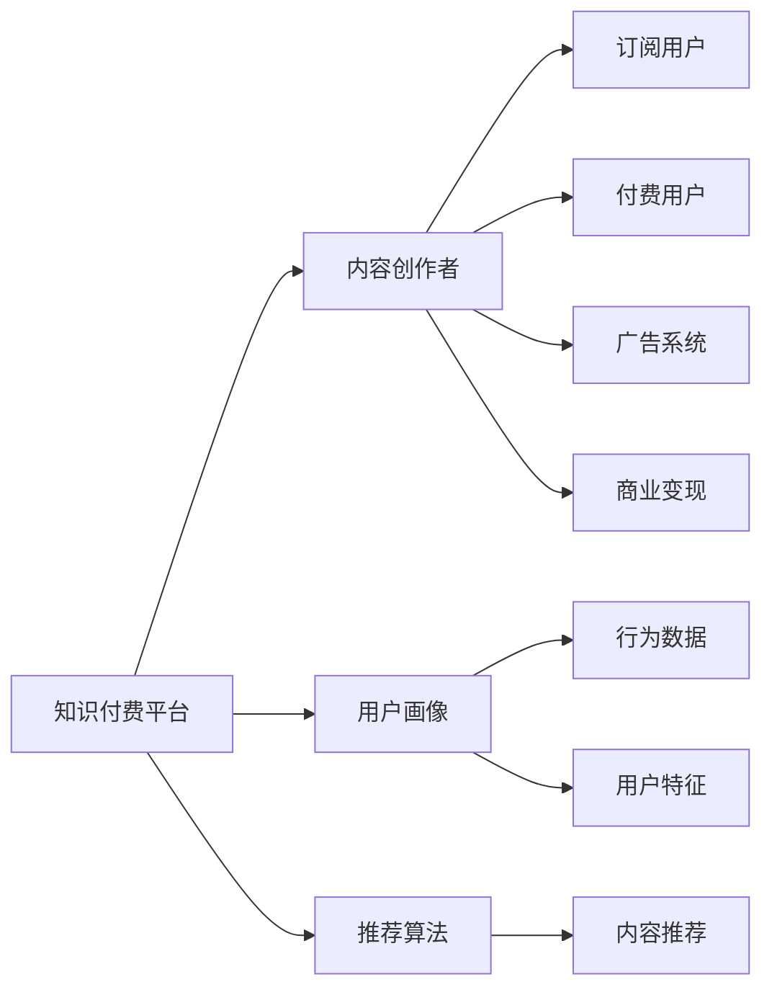

                 

# 如何利用知识付费实现个人品牌溢价？

在数字化和信息化的浪潮下，知识付费作为一种新兴的商业模式，为个人品牌的发展提供了新的机遇。本文将从技术角度深入探讨如何利用知识付费实现个人品牌溢价，通过以下几个核心概念和算法原理，提供系统化的解决方案。

## 1. 背景介绍

### 1.1 知识付费的兴起

知识付费是指通过购买或订阅知识内容，获取专业知识和经验，提升个人能力的一种模式。随着互联网普及和知识信息的爆炸性增长，知识付费市场迅速崛起，催生了众多的知识分享平台和内容创作者。

### 1.2 个人品牌溢价的重要性

个人品牌溢价是指通过个人品牌塑造和提升，获得超出市场平均水平的价值回报。在知识付费领域，个人品牌溢价不仅是获取更高收入的途径，更是增强市场竞争力的关键。

## 2. 核心概念与联系

### 2.1 核心概念概述

为深入理解如何利用知识付费实现个人品牌溢价，我们首先梳理几个关键概念：

- **知识付费平台**：如知乎、得到、微信读书等，提供付费内容交易的基础设施。
- **内容创作者**：通过提供有价值的知识内容，吸引用户订阅或购买，实现收益的个人或团队。
- **用户画像**：通过用户行为数据分析，构建用户画像，实现精准推荐和个性化服务。
- **推荐算法**：基于用户画像和内容属性，优化推荐结果，提升用户体验和留存率。
- **广告与商业变现**：通过平台内置的广告系统和合作伙伴推荐，实现商业变现。

这些概念之间相互关联，共同构成知识付费生态系统的核心。

### 2.2 核心概念原理和架构的 Mermaid 流程图



## 3. 核心算法原理 & 具体操作步骤

### 3.1 算法原理概述

利用知识付费实现个人品牌溢价，主要涉及以下几个核心算法原理：

- **推荐算法**：通过构建用户画像和内容属性特征，利用协同过滤、内容推荐等技术，优化推荐结果，提升用户体验和留存率。
- **定价策略**：根据内容价值、用户画像、市场竞争等因素，制定合理的定价策略，实现差异化收费和最大化收益。
- **用户行为分析**：利用大数据分析技术，对用户行为进行深入挖掘，发现隐藏的需求和偏好，为产品优化和市场策略提供支持。
- **社交网络分析**：通过分析用户的社交网络关系，推荐相关内容，增强用户粘性和品牌忠诚度。

### 3.2 算法步骤详解

以下是利用知识付费实现个人品牌溢价的具体操作步骤：

#### Step 1: 数据收集与预处理

- **数据来源**：收集知识付费平台的用户行为数据、交易数据、内容属性数据等，作为推荐算法的训练数据。
- **数据清洗**：去除噪声、缺失值、重复数据，确保数据质量。
- **特征工程**：提取用户特征、内容特征、行为特征等，为推荐算法提供输入。

#### Step 2: 用户画像构建

- **用户特征提取**：根据用户的浏览历史、购买记录、搜索关键词等行为数据，提取用户的基本特征、兴趣偏好、消费能力等。
- **用户画像建模**：将用户特征通过模型进行聚合，形成完整的用户画像，用于个性化推荐。

#### Step 3: 内容属性提取

- **内容特征提取**：从标题、摘要、标签等文本信息中，提取关键特征，如关键词、主题、难度等。
- **内容评分**：利用人工或自动化方法，对内容进行打分，评估其质量和价值。

#### Step 4: 推荐算法训练与优化

- **模型选择**：根据业务需求选择合适的推荐算法，如协同过滤、内容推荐、混合推荐等。
- **模型训练**：利用用户画像和内容属性数据，训练推荐模型，优化推荐结果。
- **模型评估**：通过A/B测试、用户反馈等方法，评估模型效果，进行持续优化。

#### Step 5: 定价策略制定

- **价值评估**：根据内容质量、难度、时长等因素，评估内容的价值。
- **差异化定价**：根据用户画像和内容属性，制定差异化定价策略，实现最大化收益。

#### Step 6: 用户行为分析与优化

- **行为分析**：利用大数据分析技术，对用户行为进行深入挖掘，发现隐藏的需求和偏好。
- **产品优化**：根据分析结果，优化内容和推荐系统，提升用户体验和满意度。

#### Step 7: 社交网络分析与利用

- **社交网络构建**：通过分析用户的社交网络关系，构建社交网络图谱。
- **社交推荐**：利用社交网络信息，推荐相关内容，增强用户粘性和品牌忠诚度。

### 3.3 算法优缺点

#### 优点：

1. **精准推荐**：通过用户画像和内容属性，实现精准推荐，提升用户体验和留存率。
2. **差异化收费**：根据用户画像和内容属性，制定差异化定价策略，实现最大化收益。
3. **用户粘性增强**：通过社交网络分析和个性化推荐，增强用户粘性和品牌忠诚度。

#### 缺点：

1. **数据依赖性强**：推荐算法的效果很大程度上依赖于数据的完整性和质量，数据收集和处理成本较高。
2. **用户隐私问题**：用户画像和行为数据的收集和使用，可能涉及隐私和伦理问题。
3. **模型复杂度高**：推荐算法模型复杂度高，需要较高的计算资源和存储能力。

### 3.4 算法应用领域

基于推荐算法和定价策略的知识付费平台，广泛应用于以下几个领域：

- **教育培训**：如Coursera、Udacity等平台，提供专业的在线课程和认证，实现知识传递和技能提升。
- **技术研发**：如GitHub、Stack Overflow等平台，提供编程代码、技术文档等资源，加速技术交流和创新。
- **健康医疗**：如HealthTap、DoctorOnDemand等平台，提供专业医疗咨询和健康管理服务，提升医疗服务质量和效率。
- **艺术文化**：如Khan Academy、TED等平台，提供丰富的艺术和文化资源，推动文化交流和传承。
- **娱乐休闲**：如Spotify、Netflix等平台，提供音乐、视频、游戏等内容，丰富用户娱乐生活。

## 4. 数学模型和公式 & 详细讲解

### 4.1 数学模型构建

我们以协同过滤推荐算法为例，构建推荐模型的数学模型。设用户集合为$U$，内容集合为$I$，用户$u$对内容$i$的评分$R_{ui} \in [0,1]$，用户$u$对内容$i$的评分矩阵为$R \in \mathbb{R}^{n \times m}$，其中$n$为内容数量，$m$为用户数量。推荐算法的目标是最小化预测评分与真实评分之间的均方误差。

设用户$u$对内容$i$的预测评分为$\hat{R}_{ui}$，推荐算法的目标函数为：

$$
\min_{\theta} \frac{1}{2m} \sum_{i=1}^m \sum_{u=1}^n (R_{ui} - \hat{R}_{ui})^2
$$

其中$\theta$为模型参数。

### 4.2 公式推导过程

协同过滤推荐算法基于用户和内容的协同信息，通过计算用户$u$对内容$i$的相似度$S_{ui}$，预测用户$u$对内容$i$的评分。协同信息可以通过余弦相似度、皮尔逊相关系数等方法计算。

假设用户$u$和内容$i$的相似度为$S_{ui} \in [0,1]$，推荐算法的预测评分公式为：

$$
\hat{R}_{ui} = \sum_{v=1}^m R_{vi}S_{uv}
$$

其中$S_{uv}$为用户$u$和用户$v$的相似度，通常基于用户行为数据计算得到。

### 4.3 案例分析与讲解

以Coursera平台为例，分析其利用知识付费实现个人品牌溢价的方法：

1. **数据收集与预处理**：Coursera收集用户的注册信息、学习行为、课程评价等数据，进行数据清洗和特征提取。
2. **用户画像构建**：Coursera构建用户画像，分析用户的学习偏好、课程选择等行为特征，实现个性化推荐。
3. **内容属性提取**：Coursera提取课程标题、课程简介、讲师信息等特征，评估课程价值。
4. **推荐算法训练与优化**：Coursera利用协同过滤算法，训练推荐模型，优化推荐结果。
5. **定价策略制定**：Coursera根据课程难度、课时、讲师名气等，制定差异化定价策略，实现最大化收益。
6. **用户行为分析与优化**：Coursera分析用户行为数据，发现课程选题趋势和用户需求，优化课程内容和推荐系统。
7. **社交网络分析与利用**：Coursera利用用户社交网络信息，推荐相关课程，增强用户粘性和品牌忠诚度。

## 5. 项目实践：代码实例和详细解释说明

### 5.1 开发环境搭建

搭建知识付费平台开发环境，需要以下步骤：

1. **选择框架**：如Django、Flask等，构建Web应用框架。
2. **数据存储**：选择合适的数据库（如MySQL、PostgreSQL），存储用户行为数据、内容数据等。
3. **数据处理**：使用Python（Pandas、NumPy等）进行数据清洗、特征提取等预处理工作。
4. **模型训练**：使用机器学习库（如Scikit-learn、TensorFlow）训练推荐模型。
5. **系统集成**：将推荐模型集成到Web应用中，实现个性化推荐和定价策略。

### 5.2 源代码详细实现

以下是一个简单的Python代码示例，展示了如何使用Scikit-learn实现协同过滤推荐算法：

```python
from sklearn.neighbors import NearestNeighbors
import numpy as np

# 用户行为数据
users = np.array([[1, 2, 3], [2, 3, 4], [3, 4, 5]])
items = np.array([[1, 0, 0], [0, 2, 3], [0, 0, 4]])

# 计算相似度矩阵
similarity_matrix = 1 - np.linalg.norm(items - users, axis=1) / np.linalg.norm(items, axis=1)

# 训练协同过滤模型
model = NearestNeighbors(metric='cosine', algorithm='brute')
model.fit(similarity_matrix)

# 预测评分
user = np.array([1, 2, 3])
item = np.array([0, 2, 3])
similarity = model.kneighbors((user, item), n_neighbors=5, return_distance=False)[0]
prediction = np.average(np.array([users[i] for i in similarity]))
```

### 5.3 代码解读与分析

代码实现中，我们首先定义了用户行为数据和内容数据。然后，利用Scikit-learn中的NearestNeighbors算法，计算用户和内容之间的余弦相似度，构建相似度矩阵。接着，利用余弦相似度矩阵训练协同过滤模型，最后预测用户对内容的评分。

### 5.4 运行结果展示

运行上述代码，可以得到用户对内容的预测评分。例如，用户对内容的预测评分为0.9，表示用户对该内容的评分可能为0.9。

## 6. 实际应用场景

### 6.1 教育培训

在教育培训领域，知识付费平台如Coursera、Udacity等，通过提供高质量的在线课程，帮助用户提升职业技能和知识水平。平台利用推荐算法，根据用户的学习行为和偏好，推荐相关课程，实现个性化学习。

### 6.2 技术研发

在技术研发领域，知识付费平台如GitHub、Stack Overflow等，提供编程代码、技术文档等资源，帮助开发者提升编程能力和技术水平。平台利用推荐算法，根据用户的阅读行为和问题历史，推荐相关资源，加速技术交流和创新。

### 6.3 健康医疗

在健康医疗领域，知识付费平台如HealthTap、DoctorOnDemand等，提供专业医疗咨询和健康管理服务，帮助用户解决健康问题。平台利用推荐算法，根据用户的健康状况和咨询历史，推荐相关资源，提升医疗服务质量和效率。

### 6.4 艺术文化

在艺术文化领域，知识付费平台如Khan Academy、TED等，提供丰富的艺术和文化资源，推动文化交流和传承。平台利用推荐算法，根据用户的兴趣偏好，推荐相关内容，增强用户粘性和品牌忠诚度。

### 6.5 娱乐休闲

在娱乐休闲领域，知识付费平台如Spotify、Netflix等，提供音乐、视频、游戏等内容，丰富用户娱乐生活。平台利用推荐算法，根据用户的娱乐偏好，推荐相关内容，提升用户体验和满意度。

## 7. 工具和资源推荐

### 7.1 学习资源推荐

1. **机器学习基础**：如《机器学习实战》、Coursera《Machine Learning》课程等。
2. **推荐系统**：如《推荐系统实战》、Stanford《Introduction to Recommender Systems》课程等。
3. **数据处理**：如《Python数据科学手册》、Kaggle数据集等。
4. **Web开发**：如《Django实战》、Flask官方文档等。

### 7.2 开发工具推荐

1. **框架选择**：如Django、Flask等。
2. **数据库选择**：如MySQL、PostgreSQL等。
3. **数据处理工具**：如Pandas、NumPy等。
4. **模型训练工具**：如Scikit-learn、TensorFlow等。

### 7.3 相关论文推荐

1. **协同过滤算法**：如《A Survey of Collaborative Filtering Recommendation Algorithms》等。
2. **深度学习推荐系统**：如《Deep Neural Networks for Collaborative Filtering》等。
3. **推荐系统评估**：如《Evaluation of Recommendation Systems》等。

## 8. 总结：未来发展趋势与挑战

### 8.1 研究成果总结

本文从技术角度深入探讨了如何利用知识付费实现个人品牌溢价，主要涉及推荐算法和定价策略等核心概念。通过理论分析、案例讲解和代码实践，全面展示了知识付费平台的开发流程和关键技术点。

### 8.2 未来发展趋势

未来知识付费领域将呈现以下几个发展趋势：

1. **个性化推荐技术提升**：随着推荐算法的发展，个性化推荐技术将更加精准，用户粘性将进一步增强。
2. **跨领域内容融合**：知识付费平台将逐步整合不同领域的知识内容，提供更加丰富和多样化的服务。
3. **社交网络深度挖掘**：利用社交网络分析技术，深入挖掘用户关系和行为特征，优化推荐结果。
4. **用户反馈与迭代优化**：通过用户反馈，不断优化推荐算法和定价策略，提升用户体验和满意度。

### 8.3 面临的挑战

尽管知识付费技术不断进步，但在实际应用中仍面临诸多挑战：

1. **数据隐私和安全**：用户行为数据的收集和使用，涉及隐私和伦理问题。如何在保护用户隐私的前提下，提高推荐效果，是一个重要课题。
2. **计算资源限制**：推荐算法模型复杂度高，需要较高的计算资源和存储能力。如何优化算法模型，降低计算资源消耗，是一个重要的研究方向。
3. **内容质量和多样性**：知识付费平台的内容质量和多样性直接影响用户体验和留存率。如何提高内容质量，丰富内容形式，是一个持续的挑战。
4. **定价策略合理性**：合理定价策略的制定，需要在内容价值和用户需求之间取得平衡。如何在差异化收费策略中实现最大化收益，是一个重要的研究方向。

### 8.4 研究展望

未来的知识付费平台需要从以下几个方向进行持续研究：

1. **推荐算法优化**：进一步优化推荐算法，提高个性化推荐精度，增强用户粘性。
2. **内容质量提升**：通过技术手段和用户反馈，提高内容质量和多样性，提升用户体验。
3. **隐私保护加强**：加强用户隐私保护，通过匿名化和数据加密等技术，确保数据安全。
4. **跨领域内容融合**：整合不同领域的知识内容，提供更加丰富和多样化的服务，满足用户多元需求。
5. **用户体验优化**：通过用户反馈和迭代优化，不断提升平台的用户体验和满意度。

总之，利用知识付费实现个人品牌溢价，需要在推荐算法、定价策略、用户行为分析等多个方面进行综合优化，才能在激烈的市场竞争中脱颖而出。未来，随着技术的不断进步和应用场景的拓展，知识付费领域将迎来更加广阔的发展前景。

## 9. 附录：常见问题与解答

**Q1: 如何选择合适的推荐算法？**

A: 根据业务需求选择合适的推荐算法。常见的推荐算法包括协同过滤、内容推荐、混合推荐等。协同过滤适用于用户和内容之间存在明显协同关系的数据集。内容推荐适用于用户对内容的偏好具有明显区分度的数据集。混合推荐则结合了协同过滤和内容推荐，提升推荐效果。

**Q2: 如何提高推荐系统的准确性？**

A: 提高推荐系统的准确性需要多方面的优化：

1. 数据质量：保证数据完整性和准确性，去除噪声和异常值。
2. 特征工程：提取有意义的特征，提高特征表达能力。
3. 模型选择：选择合适的推荐算法，根据数据特点进行优化。
4. 算法优化：通过A/B测试和用户反馈，不断优化推荐算法。
5. 交叉验证：使用交叉验证方法，评估推荐系统的效果。

**Q3: 推荐系统如何应对用户冷启动问题？**

A: 用户冷启动问题是指新用户没有足够的行为数据，导致无法进行推荐。解决冷启动问题的方法包括：

1. 使用用户兴趣标签：通过用户注册信息或社交网络关系，获取用户兴趣标签，进行冷启动推荐。
2. 利用协同过滤：根据用户对已有内容的评分，进行冷启动推荐。
3. 引入用户生成内容：利用用户生成评论、评分等信息，进行冷启动推荐。

**Q4: 推荐系统如何避免推荐同质化？**

A: 推荐同质化是指推荐结果过于相似，导致用户获取的信息单一。解决同质化问题的方法包括：

1. 多样性约束：在推荐算法中加入多样性约束，确保推荐结果的丰富性。
2. 上下文感知：根据上下文信息，推荐更多元化的内容。
3. 用户偏好调整：通过用户反馈和行为数据，调整推荐策略，避免过度推荐某一类内容。

**Q5: 推荐系统如何处理长尾内容？**

A: 长尾内容是指用户访问量较低的少数内容。处理长尾内容的方法包括：

1. 多样性优先：在推荐算法中增加多样性权重，提高长尾内容的曝光率。
2. 长尾内容激励：通过激励机制，鼓励用户生成和分享长尾内容。
3. 内容推荐算法改进：优化内容推荐算法，提高长尾内容的识别和推荐能力。

通过上述方法和技术，可以有效地解决知识付费平台在推荐系统设计中面临的各种问题，提升用户体验和品牌溢价。

---

作者：禅与计算机程序设计艺术 / Zen and the Art of Computer Programming

