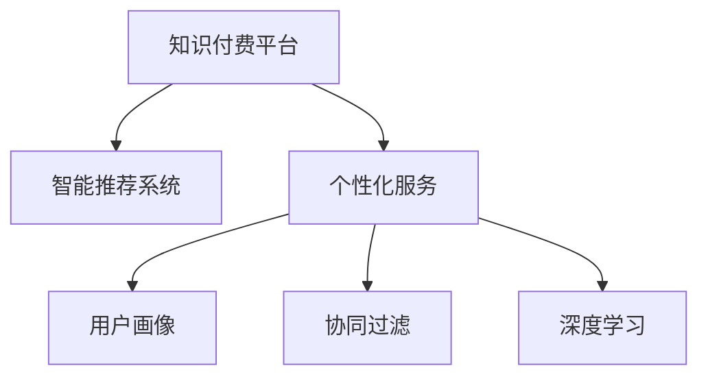

                 

# 如何利用知识付费实现智能化推荐与个性化服务？

在当前快速发展的互联网时代，知识付费正在成为一种流行的消费模式。通过订阅、购买等方式，用户可以获取各种专业知识和技能，从而提高个人能力、解决实际问题。然而，面对海量的知识资源和各式各样的需求，用户如何找到最适合自己的内容，是知识付费平台亟待解决的问题。本文将探讨如何利用智能推荐技术，实现个性化的知识付费服务，提升用户体验，推动知识付费行业的健康发展。

## 1. 背景介绍

### 1.1 知识付费的兴起

随着互联网普及和数字化转型加速，知识付费行业呈现出迅猛发展态势。知识付费模式不仅仅局限于线上课程，还包括电子书、音频、视频、咨询等多种形式。如今，越来越多的人愿意为了获取知识和技能而付费，不再局限于传统的免费信息获取方式。知识付费平台的兴起，正是基于人们对高质量知识内容需求的增长。

### 1.2 智能推荐的重要性

在知识付费平台中，智能推荐系统扮演着至关重要的角色。它能够根据用户的浏览历史、搜索行为、评价反馈等数据，实时推荐最适合用户的内容。智能推荐不仅可以提高用户黏性，还能提升平台收入和用户满意度。然而，随着用户需求的多样化和个性化发展，传统的推荐算法已经难以满足用户的期望，如何实现更加精准的推荐，成为了一个关键挑战。

## 2. 核心概念与联系

### 2.1 核心概念概述

为了更好地理解知识付费中的智能化推荐与个性化服务，本节将介绍几个关键概念：

- **知识付费平台(Knowledge-based Platform)**：提供各种付费知识内容的平台，如Coursera、Udemy、得到等。
- **智能推荐系统(Recommendation System)**：基于用户行为数据，推荐最相关内容的系统，广泛应用于电商、视频、音乐等互联网领域。
- **个性化服务(Personalized Service)**：根据用户特定需求和偏好，提供定制化的内容和服务。
- **用户画像(User Profile)**：通过收集用户的多维度数据，构建用户特征模型，用于个性化推荐和差异化服务。
- **协同过滤(Collaborative Filtering)**：一种基于用户和项目相似度的推荐算法，常用于新用户或新物品推荐。
- **深度学习(Deep Learning)**：利用多层神经网络，学习复杂特征和模式，提升推荐效果。

这些概念之间的逻辑关系可以通过以下Mermaid流程图来展示：



这个流程图展示了知识付费平台的核心组件及其之间的联系：

1. 知识付费平台通过智能推荐系统，为用户提供个性化服务。
2. 个性化服务基于用户画像，而用户画像又依赖于协同过滤和深度学习等技术来构建。
3. 协同过滤和深度学习都是智能推荐系统中重要的推荐技术。

## 3. 核心算法原理 & 具体操作步骤

### 3.1 算法原理概述

基于知识付费的智能推荐与个性化服务，其核心算法原理是利用机器学习技术，对用户行为数据进行分析，构建用户画像，从而推荐出最符合用户需求的内容。其核心流程包括：

1. **数据收集**：从用户浏览记录、搜索关键词、评论反馈等渠道收集数据。
2. **特征提取**：对用户行为数据进行预处理和特征提取，形成用户画像。
3. **模型训练**：利用协同过滤、深度学习等算法，训练推荐模型。
4. **推荐生成**：基于训练好的模型，对新内容进行实时推荐。

### 3.2 算法步骤详解

#### 3.2.1 数据收集

在知识付费平台中，数据收集是推荐系统的基础。常见的数据来源包括：

- **用户浏览记录**：用户访问过的课程、文章、视频等内容的ID和时间。
- **搜索关键词**：用户在搜索框中输入的关键词。
- **评价和评论**：用户对课程或内容的评分和评论。
- **个人资料**：用户的年龄、性别、职业等基本信息。
- **历史支付记录**：用户购买和订阅的历史信息。

#### 3.2.2 特征提取

特征提取是构建用户画像的关键步骤，常用的方法包括：

- **词袋模型(Bag of Words, BOW)**：将文本内容转化为词频向量，表示用户对不同内容的主题兴趣。
- **TF-IDF**：计算词语在文本中的重要性，反映用户对特定主题的关注度。
- **用户兴趣向量化**：将用户行为数据转换为高维向量，便于模型处理和推荐。

#### 3.2.3 模型训练

推荐模型训练通常包括两个步骤：

- **协同过滤**：利用用户和项目之间的相似度，推荐新内容。常见的算法包括基于用户的协同过滤和基于项目的协同过滤。
- **深度学习**：利用神经网络模型，学习用户和内容的深层次特征，提升推荐效果。常用的模型包括卷积神经网络(CNN)、循环神经网络(RNN)、长短时记忆网络(LSTM)等。

#### 3.2.4 推荐生成

推荐生成是推荐系统的核心环节，主要包括以下步骤：

- **相似度计算**：计算用户和内容之间的相似度，找到最相关的物品。
- **排序算法**：利用评分模型或排序算法，对推荐结果进行排序，保证推荐质量。
- **实时推荐**：根据用户实时行为，动态更新推荐列表。

### 3.3 算法优缺点

基于知识付费的智能推荐与个性化服务，具有以下优点：

- **提高用户满意度**：通过个性化推荐，用户能够更快地找到所需内容，提升学习效率和体验。
- **增加平台收入**：精准推荐能够提升用户付费意愿，提高平台订阅率和购买率。
- **降低运营成本**：减少用户查找内容的时间，减少客服和营销成本。

同时，该方法也存在一些局限性：

- **数据隐私问题**：大量数据收集和处理，可能涉及用户隐私保护。
- **数据偏差问题**：用户行为数据可能存在偏差，影响推荐效果。
- **模型复杂度**：深度学习模型需要大量计算资源，可能存在过拟合风险。
- **冷启动问题**：新用户或新内容难以获得有效推荐。

### 3.4 算法应用领域

基于知识付费的智能推荐与个性化服务，已经广泛应用于以下领域：

- **课程推荐**：为用户推荐与其学习兴趣和历史行为相符的课程。
- **书籍推荐**：根据用户阅读偏好推荐相关书籍。
- **视频推荐**：根据用户观影历史推荐最新视频和相关内容。
- **音频推荐**：推荐与用户音乐口味相符的音频内容。
- **个性化订阅**：根据用户需求推荐适合的订阅计划和课程包。

## 4. 数学模型和公式 & 详细讲解 & 举例说明

### 4.1 数学模型构建

本节将使用数学语言对知识付费平台中的智能推荐与个性化服务进行更加严格的刻画。

记用户集为 $U$，内容集为 $I$，用户与内容之间的评分矩阵为 $R_{UI}$，其中 $R_{ui}$ 表示用户 $u$ 对内容 $i$ 的评分。用户画像为 $P_u$，内容画像为 $P_i$，协同过滤模型为 $CF$，深度学习模型为 $DL$，推荐结果为 $R_{\text{rec}}$。

推荐系统的目标是最大化用户满意度和平台收益，可以定义如下目标函数：

$$
\max_{P_u, P_i} \sum_{u \in U} \sum_{i \in I} P_u R_{\text{rec}} + \lambda \left(\sum_{u \in U} ||P_u||_2 + \sum_{i \in I} ||P_i||_2\right)
$$

其中 $\lambda$ 为正则化系数，$||P_u||_2$ 和 $||P_i||_2$ 分别为用户画像和内容画像的范数。

### 4.2 公式推导过程

以下我们以基于协同过滤的推荐算法为例，推导推荐公式。

假设用户 $u$ 对内容 $i$ 的评分 $R_{ui}$ 为 $0$ 或 $1$（二值化处理），协同过滤算法利用用户和内容之间的相似度 $sim(u, i)$ 进行推荐，推荐公式为：

$$
\hat{R}_{ui} = \frac{1}{k} \sum_{j \in N(u)} \frac{R_{uj}}{sim(j, i)}
$$

其中 $N(u)$ 为与用户 $u$ 相似的其他用户集，$k$ 为邻域大小。

通过上述公式，协同过滤算法能够根据用户 $u$ 对内容 $j$ 的评分，计算出内容 $i$ 的推荐评分 $\hat{R}_{ui}$，从而生成推荐结果。

### 4.3 案例分析与讲解

以某知识付费平台为例，假设用户 $u$ 对内容 $i$ 的评分 $R_{ui}$ 为 $1$ 表示喜欢，$0$ 表示不喜欢。现在用户 $u$ 对内容 $j$ 的评分为 $0$，表示不喜欢。根据协同过滤算法，内容 $i$ 的推荐评分 $\hat{R}_{ui}$ 可以通过计算与用户 $u$ 相似的其他用户对内容 $i$ 的评分加权平均来得到。

具体推导如下：

- 假设与用户 $u$ 相似的其他用户 $j$ 对内容 $i$ 的评分为 $R_{ji}=1$。
- 计算相似度 $sim(u, j)$，假设为 $0.8$。
- 根据公式，内容 $i$ 的推荐评分 $\hat{R}_{ui}$ 为：

$$
\hat{R}_{ui} = \frac{1}{k} \sum_{j \in N(u)} \frac{R_{uj}}{sim(j, i)} = \frac{1}{k} \times \frac{R_{uj}}{sim(j, i)} = \frac{1}{k} \times \frac{1}{0.8} = \frac{1}{0.8k}
$$

通过上述计算，内容 $i$ 的推荐评分 $\hat{R}_{ui}$ 为 $1/0.8k$，如果邻域大小 $k$ 合适，该推荐结果能够较好地反映用户 $u$ 对内容 $i$ 的偏好。

## 5. 项目实践：代码实例和详细解释说明

### 5.1 开发环境搭建

在进行智能推荐与个性化服务的开发前，我们需要准备好开发环境。以下是使用Python进行TensorFlow开发的环境配置流程：

1. 安装Anaconda：从官网下载并安装Anaconda，用于创建独立的Python环境。

2. 创建并激活虚拟环境：
```bash
conda create -n tf-env python=3.8 
conda activate tf-env
```

3. 安装TensorFlow：根据CUDA版本，从官网获取对应的安装命令。例如：
```bash
pip install tensorflow==2.6.0
```

4. 安装Keras：
```bash
pip install keras==2.6.0
```

5. 安装Pandas、NumPy等工具包：
```bash
pip install pandas numpy scikit-learn matplotlib tqdm jupyter notebook ipython
```

完成上述步骤后，即可在`tf-env`环境中开始智能推荐与个性化服务的开发实践。

### 5.2 源代码详细实现

下面是使用TensorFlow和Keras框架实现协同过滤算法推荐系统的Python代码实现。

```python
import tensorflow as tf
from tensorflow.keras.layers import Input, Dense, Embedding, Dot
from tensorflow.keras.models import Model
from tensorflow.keras.optimizers import Adam
from tensorflow.keras.callbacks import EarlyStopping
from sklearn.metrics import mean_squared_error

# 准备数据
user_data = pd.read_csv('user_data.csv')  # 用户行为数据
item_data = pd.read_csv('item_data.csv')  # 内容数据

# 构建用户画像和内容画像
user_profile = user_data.groupby('user_id')['item_id'].agg('count').to_dict()
item_profile = item_data.groupby('item_id')['user_id'].agg('count').to_dict()

# 构建用户和内容画像矩阵
user_profile_matrix = pd.DataFrame(user_profile).fillna(0).values
item_profile_matrix = pd.DataFrame(item_profile).fillna(0).values

# 构建协同过滤模型
user_input = Input(shape=(1,), name='user')
item_input = Input(shape=(1,), name='item')

user_embedding = Embedding(input_dim=len(user_profile_matrix), output_dim=64, name='user_embedding')(user_input)
item_embedding = Embedding(input_dim=len(item_profile_matrix), output_dim=64, name='item_embedding')(item_input)

dot_product = Dot(axes=1)([user_embedding, item_embedding])
dot_product = Dense(1, activation='sigmoid')(dot_product)

model = Model(inputs=[user_input, item_input], outputs=dot_product)
model.compile(optimizer=Adam(learning_rate=0.01), loss='binary_crossentropy', metrics=[mean_squared_error])

# 训练模型
train_data = [([i, u] for i, u in zip(item_id, user_id) if R_[i, u] == 1)
train_generator = tf.data.Dataset.from_tensor_slices(train_data)
train_generator = train_generator.shuffle(buffer_size=1000).batch(batch_size=64)

early_stopping = EarlyStopping(patience=10, restore_best_weights=True)
model.fit(train_generator, epochs=50, callbacks=[early_stopping])

# 测试模型
test_data = [([i, u] for i, u in zip(item_id, user_id) if R_[i, u] == 1)
test_generator = tf.data.Dataset.from_tensor_slices(test_data)
test_generator = test_generator.shuffle(buffer_size=1000).batch(batch_size=64)

mse = model.evaluate(test_generator)
print('Test MSE:', mse)

# 生成推荐
user_input = tf.constant(user_id)
item_input = tf.constant(item_id)
prediction = model.predict([user_input, item_input])
if prediction > 0.5:
    print('推荐内容:', item_id)
```

以上是使用TensorFlow和Keras框架实现协同过滤算法推荐系统的完整代码实现。可以看到，TensorFlow和Keras提供了一套强大的工具链，可以很方便地实现复杂的推荐模型。

### 5.3 代码解读与分析

让我们再详细解读一下关键代码的实现细节：

**构建用户画像和内容画像**：
- `user_data` 和 `item_data` 分别为用户行为数据和内容数据，通过 `groupby` 方法按用户ID和内容ID统计行为次数，得到用户画像 `user_profile` 和内容画像 `item_profile`。
- 将用户画像和内容画像转换为矩阵 `user_profile_matrix` 和 `item_profile_matrix`，方便后续模型训练。

**构建协同过滤模型**：
- `user_input` 和 `item_input` 分别为用户ID和内容ID的输入，通过 `Embedding` 层将其映射到低维向量。
- `Dot` 层计算用户向量和内容向量的点积，得到推荐评分。
- `Dense` 层将点积结果映射到 [0, 1] 区间，输出推荐评分。

**训练模型**：
- 使用 `Adam` 优化器，交叉熵损失函数，均方误差指标训练模型。
- 通过 `EarlyStopping` 回调函数防止过拟合。

**测试模型**：
- 使用测试集数据集生成预测评分，计算均方误差。

**生成推荐**：
- 通过输入用户ID和内容ID，生成推荐评分，若评分大于0.5，则推荐该内容ID。

可以看到，代码实现过程中，我们利用了TensorFlow和Keras的API，大大简化了模型的构建和训练过程。同时，代码中还利用了数据集和模型评估等高级功能，能够方便地对模型进行优化和调整。

## 6. 实际应用场景

### 6.1 知识付费平台的推荐服务

在知识付费平台上，智能推荐系统可以应用于以下场景：

- **课程推荐**：根据用户历史行为，推荐相关课程和主题。
- **书籍推荐**：根据用户阅读历史，推荐相关书籍和作者。
- **音频推荐**：根据用户收听历史，推荐相关音频内容。
- **个性化订阅**：根据用户偏好，推荐适合的订阅计划和课程包。

### 6.2 个性化学习推荐

在在线学习平台中，智能推荐系统可以个性化推荐学习内容，帮助用户快速掌握知识。具体应用包括：

- **定制化课程**：根据用户学习进度和兴趣，推荐适合的课程和学习路径。
- **辅助学习**：根据用户做错的题目，推荐相关知识点和习题。
- **视频讲解**：根据用户观看历史，推荐相关视频和讲解。

### 6.3 视频网站的推荐服务

在视频网站中，智能推荐系统可以个性化推荐视频内容，提升用户黏性和满意度。具体应用包括：

- **内容推荐**：根据用户观看历史，推荐相关视频和频道。
- **互动推荐**：根据用户点赞、评论、分享等行为，推荐相关视频和用户。
- **搜索优化**：根据用户搜索关键词，推荐相关视频和内容。

## 7. 工具和资源推荐

### 7.1 学习资源推荐

为了帮助开发者系统掌握智能推荐与个性化服务的理论基础和实践技巧，这里推荐一些优质的学习资源：

1. **《Recommender Systems: Advanced Collaborative Filtering》**：这是一本深入浅出地介绍了协同过滤算法的经典书籍，适合初学者入门。
2. **Coursera的《Machine Learning》课程**：斯坦福大学的在线课程，涵盖机器学习基础和推荐系统。
3. **《Deep Learning for Recommendations》**：这是一本介绍深度学习在推荐系统中的应用的书籍，适合有一定基础的学习者。
4. **Kaggle上的推荐系统竞赛**：通过参与竞赛，能够实战练习推荐系统算法，提升实战能力。

通过对这些资源的学习实践，相信你一定能够快速掌握智能推荐与个性化服务的精髓，并用于解决实际的推荐问题。

### 7.2 开发工具推荐

高效的开发离不开优秀的工具支持。以下是几款用于智能推荐与个性化服务开发的常用工具：

1. **TensorFlow**：由Google主导开发的开源深度学习框架，生产部署方便，适合大规模工程应用。
2. **Keras**：Keras是TensorFlow的高层API，可以方便地构建和训练深度学习模型。
3. **PyTorch**：由Facebook主导开发的开源深度学习框架，灵活性高，适合研究和实验。
4. **Scikit-learn**：Python机器学习库，提供简单易用的算法和工具，适合数据预处理和特征提取。
5. **TensorBoard**：TensorFlow配套的可视化工具，可实时监测模型训练状态，提供丰富的图表呈现方式。
6. **Weights & Biases**：模型训练的实验跟踪工具，可以记录和可视化模型训练过程中的各项指标，方便对比和调优。

合理利用这些工具，可以显著提升智能推荐与个性化服务的开发效率，加快创新迭代的步伐。

### 7.3 相关论文推荐

智能推荐与个性化服务的研究源于学界的持续研究。以下是几篇奠基性的相关论文，推荐阅读：

1. **Adaptive Recommendation Algorithms for a Service-oriented E-learning System**：介绍了基于协同过滤和深度学习的推荐算法，并应用于在线学习平台。
2. **A Deep Learning Framework for Multi-modal Recommender Systems**：提出多模态推荐系统框架，利用深度学习融合不同模态的信息，提升推荐效果。
3. **Collaborative Filtering Techniques**：介绍了基于用户和项目相似度的协同过滤算法，是推荐系统中的经典方法。
4. **Top-k Ranking Algorithms for Recommender Systems**：介绍了推荐系统中的排序算法，如ALS、SVD等，适用于不同的推荐场景。

这些论文代表了大数据和机器学习在推荐系统中的应用脉络。通过学习这些前沿成果，可以帮助研究者把握学科前进方向，激发更多的创新灵感。

## 8. 总结：未来发展趋势与挑战

### 8.1 总结

本文对知识付费平台中的智能推荐与个性化服务进行了全面系统的介绍。首先阐述了知识付费的兴起和智能推荐的重要性，明确了智能推荐在提升用户满意度和平台收入方面的独特价值。其次，从原理到实践，详细讲解了协同过滤算法和深度学习算法在智能推荐中的应用，给出了推荐系统开发的完整代码实例。同时，本文还广泛探讨了智能推荐在知识付费平台、在线学习、视频网站等场景中的应用前景，展示了智能推荐技术的广泛应用。最后，本文精选了推荐技术的各类学习资源，力求为读者提供全方位的技术指引。

通过本文的系统梳理，可以看到，智能推荐与个性化服务正在成为知识付费平台的重要组成部分，极大地提升了用户的学习体验和平台的运营效率。未来，伴随深度学习和协同过滤等技术的持续演进，智能推荐系统必将在更多的应用领域大放异彩，为知识付费行业带来颠覆性变革。

### 8.2 未来发展趋势

展望未来，智能推荐与个性化服务将呈现以下几个发展趋势：

1. **深度学习算法的普及**：深度学习在推荐系统中的应用将更加广泛，利用神经网络模型，学习用户和内容的深层次特征，提升推荐效果。
2. **多模态融合**：结合视频、音频、文本等多种模态信息，实现更全面、准确的推荐。
3. **实时推荐系统**：利用流数据处理技术，实现实时推荐，提升用户体验。
4. **个性化推荐算法**：利用用户画像和内容画像，实现更精准、差异化的推荐。
5. **推荐系统的在线学习**：通过在线学习技术，不断更新推荐模型，提升推荐精度和效率。
6. **推荐系统的公平性**：研究推荐系统的公平性问题，避免算法偏见，保障用户权益。

以上趋势凸显了智能推荐与个性化服务的广阔前景。这些方向的探索发展，必将进一步提升推荐系统的性能和应用范围，为知识付费行业带来更广阔的发展空间。

### 8.3 面临的挑战

尽管智能推荐与个性化服务已经取得了瞩目成就，但在迈向更加智能化、普适化应用的过程中，它仍面临着诸多挑战：

1. **数据隐私问题**：大量数据收集和处理，可能涉及用户隐私保护。如何平衡用户隐私和推荐效果，是一个重要课题。
2. **数据偏差问题**：用户行为数据可能存在偏差，影响推荐效果。如何有效处理数据偏差，提高推荐精度，还需要更多理论和实践的积累。
3. **模型复杂度**：深度学习模型需要大量计算资源，可能存在过拟合风险。如何在保证模型精度的同时，降低计算复杂度，是一个关键问题。
4. **冷启动问题**：新用户或新内容难以获得有效推荐。如何有效处理冷启动问题，提升用户体验，还需要更多研究和实践。

### 8.4 研究展望

面对智能推荐与个性化服务所面临的挑战，未来的研究需要在以下几个方面寻求新的突破：

1. **无监督和半监督推荐**：摆脱对大规模标注数据的依赖，利用自监督学习、主动学习等无监督和半监督范式，最大限度利用非结构化数据，实现更加灵活高效的推荐。
2. **融合因果和对比学习范式**：通过引入因果推断和对比学习思想，增强推荐系统建立稳定因果关系的能力，学习更加普适、鲁棒的用户和内容特征。
3. **引入更多先验知识**：将符号化的先验知识，如知识图谱、逻辑规则等，与神经网络模型进行巧妙融合，引导推荐过程学习更准确、合理的用户和内容特征。
4. **纳入伦理道德约束**：在推荐系统设计中引入伦理导向的评估指标，过滤和惩罚有偏见、有害的输出倾向。同时加强人工干预和审核，建立推荐系统的监管机制，确保推荐结果符合人类价值观和伦理道德。

这些研究方向的探索，必将引领智能推荐与个性化服务技术迈向更高的台阶，为知识付费行业带来更广阔的发展空间。面向未来，智能推荐与个性化服务还需要与其他人工智能技术进行更深入的融合，如知识表示、因果推理、强化学习等，多路径协同发力，共同推动知识付费技术的进步。只有勇于创新、敢于突破，才能不断拓展智能推荐与个性化服务的边界，让知识付费技术更好地造福人类社会。

## 9. 附录：常见问题与解答

**Q1：智能推荐与个性化服务是否适用于所有知识付费平台？**

A: 智能推荐与个性化服务在大多数知识付费平台中都能取得不错的效果，特别是对于数据量较大的平台。但对于一些数据量较少、数据质量不高的平台，推荐效果可能不尽如人意。此时需要在数据收集和处理上进一步优化，提高数据质量和推荐精度。

**Q2：如何选择适合的推荐算法？**

A: 选择推荐算法需要综合考虑平台数据特征、推荐场景和目标。一般来说，协同过滤算法适用于大规模数据集，深度学习算法适用于复杂推荐场景。对于冷启动问题，深度学习算法往往表现更好。对于实时推荐，实时流数据处理算法（如Streaming Collaborative Filtering）更加适用。

**Q3：推荐系统如何处理数据偏差问题？**

A: 数据偏差是推荐系统中常见的问题，可以通过以下方法处理：
1. 数据预处理：对数据进行归一化、平滑等处理，减少偏差影响。
2. 特征工程：引入更加鲁棒的特征，提高模型对数据偏差的鲁棒性。
3. 样本平衡：通过重采样、数据增强等方法，平衡正负样本比例。

**Q4：推荐系统如何处理冷启动问题？**

A: 冷启动问题可以通过以下方法处理：
1. 利用用户画像和内容画像，进行协同过滤推荐。
2. 利用深度学习模型，通过迁移学习、零样本学习等方法，对新用户和新内容进行推荐。
3. 利用其他信息源，如用户社交网络、知识图谱等，提高推荐精度。

**Q5：推荐系统如何保护用户隐私？**

A: 推荐系统在数据收集和处理过程中，需要注意以下隐私保护问题：
1. 数据匿名化：对用户数据进行匿名化处理，保护用户隐私。
2. 数据加密：对敏感数据进行加密存储和传输，防止数据泄露。
3. 数据最小化：只收集必要的数据，避免过度收集。

通过有效处理隐私保护问题，可以在保障用户隐私的前提下，实现高质量的推荐服务。

---

作者：禅与计算机程序设计艺术 / Zen and the Art of Computer Programming

