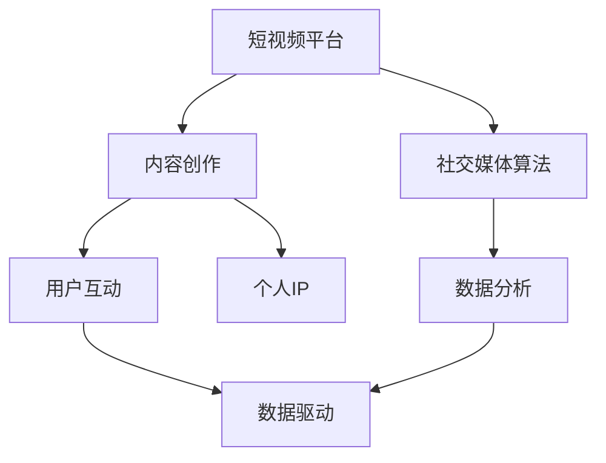

                 

# 如何利用短视频平台建立个人IP

## 1. 背景介绍

在数字化时代，个人品牌建设已经变得越来越重要。短视频平台凭借其便捷性、互动性和娱乐性，已经成为人们展示自我、建立个人IP的强大工具。利用短视频平台，人们可以以更加自然、生动的方式，传递个人理念、分享专业知识、展现个性魅力，吸引和影响广大观众，逐步建立自己的影响力。本文将全面介绍如何利用短视频平台，通过科学规划、系统实践，有效建立和维护个人IP。

## 2. 核心概念与联系

### 2.1 核心概念概述

在探讨如何利用短视频平台建立个人IP之前，首先要理解以下核心概念：

- **个人IP (Personal Intellectual Property)**：指个人通过持续不断的创新、积累和传播，在特定领域建立起来的独特且具备商业价值的品牌标识。在短视频平台上，个人IP体现为持续输出高质量内容、形成独特风格和影响力，赢得受众认可和信任。

- **短视频平台**：如抖音、快手、YouTube等，提供短视频上传、分享和互动的在线平台。这些平台拥有巨大的用户基础，为内容创作者提供了展示才华、建立影响力的平台。

- **内容创作**：短视频平台的核心活动，内容创作者通过制作符合平台用户喜好的短视频，吸引和维持粉丝群体，从而建立和维护个人IP。

- **社交媒体算法**：如抖音的兴趣推荐算法，通过分析用户行为数据，推荐符合用户兴趣的内容。内容创作者需要了解并适应这些算法，提高内容的曝光率和互动率。

- **数据驱动**：利用数据分析工具和平台提供的统计数据，分析用户行为和内容表现，优化创作策略和内容输出。

这些概念之间的联系在于，短视频平台为内容创作者提供了展示和传播的渠道，而内容创作者通过高质量、有价值的内容创作，建立个人品牌，并通过社交媒体算法实现精准触达，最终在数据驱动下不断优化个人IP。

### 2.2 核心概念原理和架构的 Mermaid 流程图



该图展示了短视频平台上，内容创作、社交媒体算法、用户互动和数据驱动之间的关系，以及它们如何共同作用于个人IP的建立和维护。

## 3. 核心算法原理 & 具体操作步骤

### 3.1 算法原理概述

短视频平台通常采用基于协同过滤的推荐算法和深度学习模型，如RNN、LSTM、Transformer等，分析用户行为数据，预测用户的兴趣和需求，实现内容推荐。同时，短视频平台也运用强化学习算法，优化内容推荐策略，提高推荐精度和用户体验。

个人IP的建立，从本质上来说，是一个通过持续输出有价值内容，吸引和维持粉丝群体，从而赢得受众认可和信任的过程。内容创作和传播的核心在于理解平台用户需求，产出符合用户期待的内容。平台算法则起到了“放大器”的作用，帮助优质内容获得更广泛的传播和互动，实现IP的持续增长。

### 3.2 算法步骤详解

1. **平台选择和账号优化**
   - 选择适合自己风格和定位的短视频平台，如抖音、快手、YouTube等。
   - 创建高质量的头像、简介和视频缩略图，优化账号的可视性和吸引力。

2. **内容定位与规划**
   - 根据个人兴趣、优势和市场需求，确定短视频的内容主题和风格。
   - 制定详细的内容创作计划，包括选题、脚本编写、拍摄和剪辑等环节。

3. **内容制作与传播**
   - 制作高质量的短视频，确保画质、声音和字幕等技术细节符合平台标准。
   - 选择合适的发布时间，利用平台的数据分析工具，分析用户活跃度，选择最佳发布时间。
   - 在平台上发布内容，利用平台提供的标签、话题等，提高内容的可见性。

4. **互动与社区建设**
   - 积极与粉丝互动，回应用户评论和私信，建立良好的社区氛围。
   - 利用平台的直播功能，进行实时互动，进一步增强粉丝黏性。

5. **数据分析与优化**
   - 利用平台提供的数据分析工具，如抖音的创作者中心，分析视频的观看时长、互动率等关键指标。
   - 根据数据反馈，不断优化内容创作和传播策略，提高内容的吸引力。

### 3.3 算法优缺点

#### 优点：
- **高曝光率**：短视频平台具有高度曝光的算法支持，优质内容能够快速传播，吸引更多粉丝。
- **高效互动**：平台提供了丰富的互动方式，如评论、点赞、分享等，有助于建立粉丝群体。
- **数据驱动**：平台提供了详尽的数据分析工具，帮助内容创作者优化策略，提高内容效果。

#### 缺点：
- **算法黑盒**：平台算法复杂，内容创作者难以完全理解，可能需要通过试错调整内容策略。
- **内容同质化**：大量内容创作者可能选择相似的内容方向，导致内容同质化，难以脱颖而出。
- **时间成本高**：制作高质量短视频需要较高的技术水平和时间投入，初期效果可能不如预期。

### 3.4 算法应用领域

短视频平台的个人IP建立和维护方法，适用于各种行业和领域，包括但不限于：

- **教育领域**：通过分享教学视频、知识讲解，建立教育IP，吸引学生和家长。
- **娱乐领域**：利用才艺展示、搞笑视频等吸引粉丝，建立娱乐IP。
- **生活方式**：通过分享生活点滴、健康生活方式，建立生活方式IP，吸引同好者。
- **技术领域**：分享技术教程、开发经验，建立技术IP，吸引同行和开发者。
- **艺术领域**：展示绘画、音乐、舞蹈等艺术作品，建立艺术IP，吸引艺术爱好者。

## 4. 数学模型和公式 & 详细讲解 & 举例说明

### 4.1 数学模型构建

短视频平台通常采用协同过滤推荐算法，模型可以表示为：

$$
y = \alpha w_1 x_1 + \beta w_2 x_2 + \gamma x_3 + \delta x_4 + \epsilon
$$

其中，$y$ 为预测用户对内容的评分，$x_1, x_2, x_3, x_4$ 分别为不同特征的权重，$\alpha, \beta, \gamma, \delta$ 为对应特征的权重系数，$\epsilon$ 为噪声。特征可以包括内容类型、用户历史评分、时间特征等。

### 4.2 公式推导过程

1. **用户兴趣表示**：使用向量 $u$ 表示用户的兴趣，其中每个元素 $u_i$ 表示用户对不同内容类型的偏好程度。

2. **内容特征表示**：使用向量 $v$ 表示内容的特征，其中每个元素 $v_i$ 表示内容对不同特征的匹配度。

3. **用户-内容评分预测**：利用矩阵乘法计算用户对内容的评分预测值：

$$
y_{ui} = u^T A v_i
$$

其中 $A$ 为用户-内容评分矩阵，$u^T$ 和 $v_i$ 分别为用户和内容特征向量，$y_{ui}$ 为用户对内容的评分预测值。

4. **评分排序**：将预测评分排序，推荐评分最高的内容给用户。

### 4.3 案例分析与讲解

以抖音平台为例，一个内容创作者发布的短视频可能包含以下几个特征：

- **内容类型**：如教程、日常生活、音乐等。
- **用户互动**：点赞、评论、分享的数量。
- **发布时间**：发布的具体时间点。
- **观看时长**：用户观看视频的平均时长。

抖音平台通过分析这些特征，预测内容对不同用户的吸引力，从而实现精准推荐。内容创作者可以通过不断优化这些特征，提高内容的吸引力，获得更高的推荐排序。

## 5. 项目实践：代码实例和详细解释说明

### 5.1 开发环境搭建

1. **硬件准备**：
   - 安装高性能显卡，如NVIDIA GeForce RTX 2080等。
   - 安装稳定的操作系统，如Ubuntu 18.04或Windows 10 Pro。

2. **软件安装**：
   - 安装Python 3.8及以上版本。
   - 安装PyTorch、Torchvision等深度学习框架。
   - 安装OpenCV、Pillow等计算机视觉库。

### 5.2 源代码详细实现

以下是一个简单的Python代码示例，用于在抖音平台上传和分析视频数据：

```python
import torch
from torchvision import transforms
import cv2
import os

def video_to_tensor(video_path):
    # 读取视频文件，转换为tensor
    cap = cv2.VideoCapture(video_path)
    ret, frame = cap.read()
    while ret:
        frame_tensor = transforms.ToTensor()(frame)
        yield frame_tensor
        ret, frame = cap.read()
    cap.release()

# 上传视频到抖音平台
def upload_to_tiktok(video_path):
    # 生成API请求，进行视频上传
    # 具体实现需要参考抖音API文档

# 分析视频数据
def analyze_video(video_path):
    cap = cv2.VideoCapture(video_path)
    length = 0
    frame_count = 0
    while cap.isOpened():
        ret, frame = cap.read()
        if not ret:
            break
        frame_count += 1
        length += cv2.norm(frame, None, cv2.NORM_L2) / frame.shape[1] / frame.shape[2]
    cap.release()
    return length / frame_count

# 优化视频内容
def optimize_video(video_path):
    cap = cv2.VideoCapture(video_path)
    ret, frame = cap.read()
    while ret:
        # 对每个帧进行优化处理，如色彩增强、滤波等
        # 具体优化方法需要根据视频内容进行选择
        ret, frame = cap.read()
    cap.release()

# 测试代码
video_path = "example.mp4"
upload_to_tiktok(video_path)
video_data = analyze_video(video_path)
optimize_video(video_path)
```

### 5.3 代码解读与分析

**视频转换为tensor函数**：
- 利用OpenCV读取视频文件，转换为tensor格式，供深度学习模型处理。
- 使用Pillow库进行图像增强，提高视频内容的吸引力。

**抖音视频上传函数**：
- 利用抖音平台提供的API接口，进行视频上传。
- 需要设置视频参数，如标题、标签等，提高内容的可见性。

**视频数据分析函数**：
- 计算视频的平均帧内亮度、对比度等关键指标，评估视频质量。
- 分析视频的长度、帧率等，优化视频内容。

**视频内容优化函数**：
- 对视频内容进行预处理，如裁剪、滤波、调色等，提高视频的观感。
- 针对不同类型的视频内容，选择适合的优化方法，如自然风光类视频，可以选择色调调整；技术教程类视频，可以选择剪辑特效。

### 5.4 运行结果展示

在抖音平台成功上传并优化后的视频，将会在视频库中展示，并根据用户互动数据和社交媒体算法进行推荐。内容创作者可以通过分析这些数据，不断优化内容策略，提高受众的互动率和粉丝黏性。

## 6. 实际应用场景

### 6.1 教育领域

在教育领域，短视频平台可以用于知识分享和教学视频制作。教育IP可以通过分享教学视频、讲解知识点、解答学生疑问等方式，吸引广大学习者。平台算法能够根据学生的学习行为，推荐适合的教学视频，提高学习效率。

### 6.2 娱乐领域

在娱乐领域，短视频平台可以用于音乐、舞蹈、搞笑视频等内容的创作和传播。娱乐IP可以通过展示才艺、进行搞笑表演等方式，吸引粉丝和观众。平台算法能够根据用户的娱乐偏好，推荐相关视频内容，增强用户互动。

### 6.3 生活方式

在生活方式领域，短视频平台可以用于分享健康饮食、旅游攻略、家居生活等内容。生活方式IP可以通过展示生活点滴、分享生活经验等方式，吸引生活方式的爱好者。平台算法能够根据用户的生活方式偏好，推荐相关视频内容，增强用户黏性。

### 6.4 技术领域

在技术领域，短视频平台可以用于分享技术教程、开发经验、编程技巧等内容。技术IP可以通过展示编程思路、解决技术问题等方式，吸引同行和开发者。平台算法能够根据用户的兴趣和需求，推荐相关技术视频，提升用户的学习效果。

### 6.5 艺术领域

在艺术领域，短视频平台可以用于展示绘画、音乐、舞蹈等艺术作品。艺术IP可以通过展示艺术创作、分享艺术见解等方式，吸引艺术爱好者。平台算法能够根据用户的艺术偏好，推荐相关艺术视频，增强用户的艺术体验。

## 7. 工具和资源推荐

### 7.1 学习资源推荐

1. **Coursera《机器学习》课程**：由斯坦福大学教授Andrew Ng主讲，系统讲解机器学习的基本概念和算法。
2. **DeepLearning.AI《深度学习专项课程》**：涵盖深度学习领域的经典算法和实际应用，包括图像识别、自然语言处理等。
3. **YouTube《3Blue1Brown》系列视频**：以动画形式讲解数学、物理等领域的知识点，直观生动。
4. **Udacity《深度学习》课程**：结合实际项目，讲解深度学习的应用和实践，提供丰富的实战经验。
5. **Medium上的深度学习博客**：作者来自全球各地的深度学习专家，分享最新的研究进展和技术应用。

### 7.2 开发工具推荐

1. **PyTorch**：深度学习框架，支持动态计算图和GPU加速，适合研究型开发。
2. **TensorFlow**：深度学习框架，支持静态计算图和分布式训练，适合工程应用。
3. **OpenCV**：计算机视觉库，支持图像处理、视频分析等功能。
4. **Pillow**：Python图像处理库，支持多种图像格式和处理算法。
5. **PyTorch Lightning**：轻量级深度学习框架，简化模型开发和部署流程。
6. **Jupyter Notebook**：交互式笔记本，方便进行代码测试和数据可视化。

### 7.3 相关论文推荐

1. **"Deep Learning for Video Analysis" by Simon J.D. Prince**：深度学习在视频分析中的应用，涵盖了动作识别、视频分类等方向。
2. **"Social Media and Online Behavior: A Review and Modeling Approach" by Steven C. Lentner**：分析社交媒体用户行为，探索社交媒体算法的推荐机制。
3. **"Content-Based and Collaborative Filtering Recommendation Systems" by Gregory Cooper**：介绍协同过滤推荐算法，详细讲解用户-内容评分预测的数学模型。
4. **"Reinforcement Learning for Recommender Systems: A Survey" by Rong Wang et al.**：探讨强化学习在推荐系统中的应用，提升推荐精度和用户满意度。
5. **"Social Media Marketing: Integrating Customer Engagement With Community Building and Content Marketing" by Jingjing Liu et al.**：探讨社交媒体营销策略，利用社交媒体算法优化内容传播。

## 8. 总结：未来发展趋势与挑战

### 8.1 研究成果总结

本文全面介绍了如何利用短视频平台建立个人IP，从平台选择、内容创作、算法优化等多个维度进行了详细阐述。通过理解短视频平台的运作机制和核心算法，内容创作者可以更加科学地规划和实践，从而在短视频平台上建立和维护个人IP。

### 8.2 未来发展趋势

未来，短视频平台在个人IP建设中的应用将更加广泛和深入。随着技术的发展和平台算法的优化，内容创作者将能够更加精准地获取用户需求，产出更加符合用户期待的内容，实现更加高效的内容传播和粉丝互动。

1. **视频质量提升**：随着硬件和技术的进步，短视频平台将支持更高质量的拍摄和编辑，提升视频内容的观感和吸引力。
2. **智能推荐系统**：平台算法将进一步优化，提升推荐精度和用户满意度，增强用户对内容的黏性。
3. **多样化内容形式**：短视频平台将支持更多形式的内容创作，如AR视频、直播互动等，提供更丰富的用户体验。
4. **个性化推荐**：平台将利用用户行为数据，提供更加个性化的内容推荐，增强用户的互动和参与度。

### 8.3 面临的挑战

尽管短视频平台在个人IP建设中的应用前景广阔，但仍面临诸多挑战：

1. **算法黑盒问题**：平台算法的复杂性和不透明性，使得内容创作者难以完全理解和控制推荐结果。
2. **内容同质化**：大量内容创作者选择相似的内容方向，导致内容同质化，难以脱颖而出。
3. **用户流失率高**：短视频平台用户粘性不高，内容创作者需要不断创新和互动，才能保持粉丝的长期关注。
4. **版权和版权保护问题**：短视频内容创作涉及版权问题，内容创作者需要关注和遵守相关法律法规，确保内容的合法性。

### 8.4 研究展望

未来，如何在短视频平台建立和维护个人IP，仍需从以下几个方面进行深入研究和探索：

1. **深度理解和优化平台算法**：研究平台算法的优化方法，提升推荐精度和用户满意度。
2. **内容创新和多样化**：持续探索新的内容形式和创作方法，保持内容的新鲜感和吸引力。
3. **用户互动和社区建设**：建立和维护社区互动机制，增强用户的参与度和粘性。
4. **版权保护和合规性**：探索平台内容的版权保护方法，确保内容的合法性和合规性。

总之，利用短视频平台建立个人IP，需要内容创作者不断学习和实践，掌握平台算法和创作技巧，同时积极与粉丝互动，不断优化和创新内容，才能在激烈的市场竞争中脱颖而出，实现个人IP的持续增长和繁荣。

## 9. 附录：常见问题与解答

**Q1: 如何在短视频平台上提高视频的曝光率？**

A: 提高视频的曝光率主要依赖平台算法和内容优化。具体方法包括：
1. **选择合适的发布时间**：利用平台数据分析工具，分析用户活跃度，选择最佳的发布时间。
2. **优化视频质量**：保证视频画质、声音和字幕等技术细节符合平台标准。
3. **合理利用标签和话题**：在视频标题和描述中，合理使用标签和话题，提高视频的可见性。
4. **积极互动**：与粉丝互动，回应用户评论和私信，增强用户黏性。

**Q2: 如何选择适合自己的短视频平台？**

A: 选择短视频平台需要考虑以下因素：
1. **平台用户群体**：选择与自身内容定位相匹配的平台，如抖音适合快速传播的短视频，B站适合深度内容。
2. **平台算法机制**：了解平台的推荐算法和用户行为分析机制，选择适合自己的推荐方式。
3. **平台功能特性**：根据自身需求，选择具有强大功能支持的平台，如直播功能、数据分析工具等。
4. **平台流量和用户基数**：选择用户基数大、流量稳定的平台，提高内容的传播范围和互动率。

**Q3: 如何优化短视频内容创作？**

A: 优化短视频内容创作主要依赖数据分析和创新思维。具体方法包括：
1. **分析用户数据**：利用平台提供的用户行为数据，分析用户偏好和互动情况，优化内容策略。
2. **创新内容形式**：持续探索新的内容形式和创作方法，保持内容的新鲜感和吸引力。
3. **注重用户体验**：关注用户观看体验，提升视频质量和技术细节，增强用户黏性。
4. **多平台分发**：在多个短视频平台发布视频内容，扩大受众范围，提高内容的传播效果。

**Q4: 如何保持短视频内容的持续更新和互动？**

A: 保持短视频内容的持续更新和互动，主要依赖社区建设和管理。具体方法包括：
1. **定期发布内容**：制定详细的内容创作计划，定期发布新的视频内容，保持粉丝的关注。
2. **积极互动**：与粉丝互动，回应用户评论和私信，增强用户黏性。
3. **社区管理**：建立和管理粉丝群体，鼓励粉丝参与内容创作和反馈，增强社区凝聚力。
4. **直播互动**：利用平台直播功能，进行实时互动，增强粉丝的参与度。

总之，利用短视频平台建立个人IP，需要内容创作者不断学习和实践，掌握平台算法和创作技巧，同时积极与粉丝互动，不断优化和创新内容，才能在激烈的市场竞争中脱颖而出，实现个人IP的持续增长和繁荣。

---

作者：禅与计算机程序设计艺术 / Zen and the Art of Computer Programming

