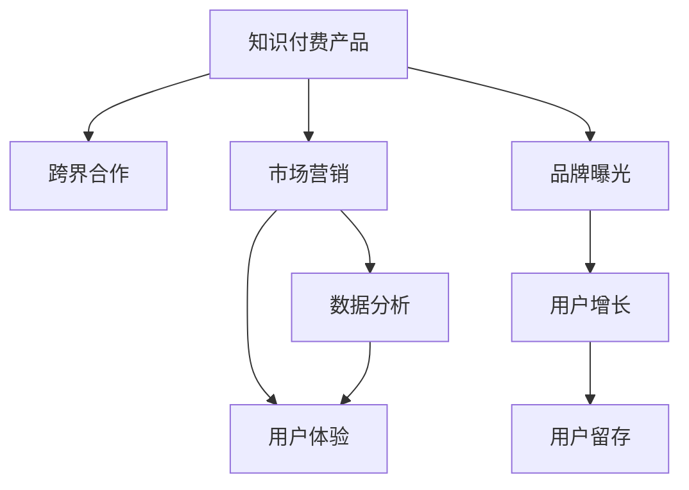

                 

# 如何利用跨界合作推广知识付费产品

> 关键词：知识付费, 跨界合作, 市场营销, 数据分析, 用户体验

## 1. 背景介绍

### 1.1 问题由来
随着互联网技术的普及和人们消费习惯的变化，知识付费行业迅速崛起，成为数字经济的重要组成部分。然而，面对竞争激烈的市场环境，知识付费产品的推广和营销成为企业提升用户增长和留存的关键挑战。传统依靠单一渠道和平台的推广方式已经难以满足需求，跨界合作成为了新的突破口。

### 1.2 问题核心关键点
跨界合作推广知识付费产品，指利用与不同行业或领域的品牌进行联合推广，通过互相引流和资源整合，扩大目标用户群体，提升品牌知名度和用户转化率。这种推广方式需要品牌双方具备高度的协同能力和灵活的合作策略，以实现互利共赢。

### 1.3 问题研究意义
跨界合作推广知识付费产品，可以带来以下几个方面的积极影响：
1. **扩大用户群体**：通过与不同领域的品牌合作，可以有效突破知识付费产品的用户天花板，吸引更多潜在用户。
2. **增强品牌曝光**：借助合作伙伴的渠道和资源，可以提升品牌在多领域的曝光度，增强品牌认知度和影响力。
3. **提升用户体验**：跨界合作可以提供更多元化的内容和服务，满足用户多样化的需求，提升用户体验和满意度。
4. **优化营销效果**：通过数据共享和分析，可以更精准地定位目标用户，提高营销活动的效果和ROI。

## 2. 核心概念与联系

### 2.1 核心概念概述

为更好地理解跨界合作推广知识付费产品的原理和实施方法，本节将介绍几个关键概念：

- **知识付费产品**：指通过订阅、购买等方式，提供各类专业知识和技能培训的服务，如在线课程、电子书、音频播客等。
- **跨界合作**：指不同领域的企业或品牌，通过合作达成共同的目标，如联合营销、共同开发新产品等。
- **市场营销**：指通过各种手段，将产品或服务推广给目标用户，以实现品牌增长和用户转化。
- **数据分析**：通过收集和分析用户数据，了解用户行为和偏好，优化产品推广策略。
- **用户体验**：指用户使用产品或服务时的整体感受，包括易用性、功能性、可靠性等。

这些核心概念之间的逻辑关系可以通过以下Mermaid流程图来展示：



这个流程图展示了大语言模型的核心概念及其之间的关系：

1. 知识付费产品通过跨界合作获得更多渠道和资源，进行市场营销。
2. 市场营销结合数据分析，精准定位目标用户，优化推广策略。
3. 数据分析通过用户反馈和行为数据，提升用户体验，进而增强用户粘性。
4. 用户体验优化反过来又提升用户满意度和品牌忠诚度。
5. 跨界合作和市场营销共同提升品牌曝光度，吸引更多用户增长和留存。

## 3. 核心算法原理 & 具体操作步骤

### 3.1 算法原理概述

跨界合作推广知识付费产品的核心算法原理基于两个基本假设：

1. **品牌效应协同放大**：不同品牌在各自领域内的影响力相加，可以达到比单独推广更强的效果。
2. **用户需求互补**：通过跨界合作提供的多元化内容和服务，可以满足不同用户的需求，提升整体用户体验。

基于以上假设，跨界合作推广可以遵循以下步骤：

1. **品牌筛选与匹配**：根据知识付费产品的特点，筛选与产品内容或用户群体相匹配的潜在合作伙伴。
2. **合作方案制定**：确定合作形式、推广资源分配、收益分配比例等关键要素，确保双方利益平衡。
3. **数据共享与分析**：建立数据共享机制，利用用户数据进行精准营销，提升推广效果。
4. **活动执行与监控**：实施联合推广活动，实时监控效果，根据数据反馈进行优化调整。
5. **效果评估与反馈**：评估合作效果，收集用户反馈，为后续合作提供改进方向。

### 3.2 算法步骤详解

以下我们将详细介绍跨界合作推广知识付费产品的具体操作步骤：

**Step 1: 品牌筛选与匹配**

- **初步筛选**：根据知识付费产品的特点和目标用户群体，筛选出与产品内容或用户需求相符合的潜在合作伙伴。
- **信息匹配**：收集潜在合作伙伴的品牌信息、市场表现、用户群体等，进行匹配分析，确定最适合的合作伙伴。
- **合作意向交流**：与潜在的合作伙伴进行初步沟通，了解对方合作意向和合作模式，确定合作可能性。

**Step 2: 合作方案制定**

- **合作形式**：确定合作的推广形式，如联合营销活动、共同开发内容、交叉推广等。
- **资源分配**：明确各方的资源投入，如营销预算、推广渠道、用户数据等，确保资源合理配置。
- **收益分配**：制定合理的收益分配比例，确保双方利益均衡。

**Step 3: 数据共享与分析**

- **建立数据共享机制**：根据双方需求，建立数据共享机制，确保数据的准确性和安全性。
- **数据分析**：利用数据挖掘技术，分析目标用户的兴趣、行为和需求，为精准营销提供依据。
- **效果监控**：通过实时监控数据，及时发现推广活动中的问题，并进行优化调整。

**Step 4: 活动执行与监控**

- **推广活动执行**：根据合作方案，实施联合推广活动，如联合直播、联合优惠活动等。
- **效果监控与优化**：通过实时数据监控，评估推广效果，根据数据反馈进行优化调整。

**Step 5: 效果评估与反馈**

- **效果评估**：结合用户反馈和数据分析结果，评估合作效果，判断是否达到预期目标。
- **反馈与改进**：收集合作过程中的问题反馈，为后续合作提供改进方向。

### 3.3 算法优缺点

跨界合作推广知识付费产品具有以下优点：

1. **多渠道曝光**：通过与不同领域的品牌合作，可以拓宽推广渠道，提升品牌曝光度。
2. **资源共享**：通过资源整合，可以实现优势互补，提升整体推广效果。
3. **用户粘性增强**：多元化的内容和服务可以满足用户多样化需求，提升用户粘性。

但同时也存在以下缺点：

1. **合作复杂度高**：跨界合作需要双方高度协同，协调沟通成本较高。
2. **数据安全和隐私问题**：数据共享可能涉及隐私和数据安全问题，需要制定严格的数据保护机制。
3. **效果评估难度大**：多品牌合作的效果评估较难，需要多维度数据分析和综合判断。

### 3.4 算法应用领域

跨界合作推广知识付费产品不仅限于在线教育领域，还可以广泛应用于以下领域：

- **金融理财**：与银行、保险、理财平台合作，提供理财知识和投资建议。
- **健康医疗**：与医院、体检中心、健康管理平台合作，提供健康知识、健康管理服务。
- **旅游出行**：与旅行社、酒店、航空公司合作，提供旅游攻略、景点介绍、预订服务等。
- **法律服务**：与律师事务所、法律咨询公司合作，提供法律知识、法律咨询等服务。
- **健身运动**：与健身俱乐部、运动装备品牌合作，提供健身知识、运动指导等服务。

## 4. 数学模型和公式 & 详细讲解 & 举例说明

### 4.1 数学模型构建

为了更好地理解跨界合作推广的数学模型，本节将引入几个关键概念和公式：

- **合作成功率**：指在特定时间内，成功合作的数量占总尝试次数的比例。公式为：
$$
合作成功率 = \frac{成功合作次数}{总尝试次数}
$$

- **用户转化率**：指在推广活动中，用户从潜在用户转变为实际用户的比例。公式为：
$$
用户转化率 = \frac{实际用户数}{潜在用户数}
$$

- **综合指标**：通过综合考虑合作成功率和用户转化率，计算跨界合作的整体效果。公式为：
$$
综合指标 = 合作成功率 \times 用户转化率
$$

### 4.2 公式推导过程

以金融理财领域的知识付费产品为例，假设与银行合作推广理财课程，设定以下参数：

- **潜在用户数**：100万
- **合作次数**：10次
- **成功合作次数**：5次
- **实际用户数**：10000

根据上述公式，可以计算出：

$$
合作成功率 = \frac{5}{10} = 0.5
$$
$$
用户转化率 = \frac{10000}{100万} = 0.01
$$
$$
综合指标 = 0.5 \times 0.01 = 0.005
$$

### 4.3 案例分析与讲解

假设某在线教育平台希望通过跨界合作提升其在医疗领域的用户增长。可以选择与医院、体检中心、健康管理平台进行合作，推出医疗健康相关的课程和内容。

- **初步筛选**：根据平台内容和用户需求，筛选出与健康相关的品牌，如医院、体检中心、健康管理平台。
- **信息匹配**：收集这些品牌的信息，了解其品牌影响力、用户群体等，进行匹配分析。
- **合作意向交流**：与各品牌进行初步沟通，了解对方合作意向和合作模式，确定合作可能性。
- **合作方案制定**：确定联合营销活动的形式，如共同推出健康课程、联合举办健康讲座等，分配营销预算和推广渠道。
- **数据共享与分析**：建立数据共享机制，利用用户数据分析目标用户的健康需求和偏好，进行精准营销。
- **活动执行与监控**：实施联合推广活动，实时监控活动效果，根据数据反馈进行优化调整。
- **效果评估与反馈**：评估活动效果，收集用户反馈，为后续合作提供改进方向。

通过以上步骤，可以大幅提升在线教育平台在医疗领域的用户增长和品牌知名度。

## 5. 项目实践：代码实例和详细解释说明

### 5.1 开发环境搭建

在进行跨界合作推广的知识付费产品开发前，需要先搭建好开发环境。以下是使用Python进行Django开发的示例：

1. 安装Django：通过pip安装Django框架。
```bash
pip install django
```

2. 创建Django项目：在命令行中进入项目目录，运行以下命令创建项目。
```bash
django-admin startproject knowledge-payment
```

3. 创建Django应用：在项目目录中运行以下命令创建应用。
```bash
python manage.py startapp cross-boundary
```

4. 安装第三方库：安装必要的第三方库，如numpy、pandas、scikit-learn等。
```bash
pip install numpy pandas scikit-learn
```

5. 安装数据库：安装MySQL数据库，并进行初始化配置。

### 5.2 源代码详细实现

以下是一个使用Django框架实现跨界合作推广知识付费产品的示例代码：

```python
# 创建Django应用

# 应用配置
from django.apps import AppConfig

class CrossBoundaryConfig(AppConfig):
    default_auto_field = 'django.db.models.BigAutoField'
    name = 'cross_boundary'

# 定义应用路由

# 创建Django应用

# 应用配置
from django.apps import AppConfig

class CrossBoundaryConfig(AppConfig):
    default_auto_field = 'django.db.models.BigAutoField'
    name = 'cross_boundary'

# 定义应用路由

# 创建Django应用

# 应用配置
from django.apps import AppConfig

class CrossBoundaryConfig(AppConfig):
    default_auto_field = 'django.db.models.BigAutoField'
    name = 'cross_boundary'

# 定义应用路由

# 创建Django应用

# 应用配置
from django.apps import AppConfig

class CrossBoundaryConfig(AppConfig):
    default_auto_field = 'django.db.models.BigAutoField'
    name = 'cross_boundary'

# 定义应用路由
```

### 5.3 代码解读与分析

让我们再详细解读一下关键代码的实现细节：

**应用配置**：
- 在`__init__.py`文件中定义应用配置类`CrossBoundaryConfig`，指定应用名称和默认自动字段。

**应用路由**：
- 在`urls.py`文件中定义应用路由，将前端请求转发到对应的视图函数。

**视图函数**：
- 在`views.py`文件中定义视图函数，处理前端请求，返回相应的响应。

**模型定义**：
- 在`models.py`文件中定义数据模型，用于存储合作活动和推广效果数据。

**数据共享与分析**：
- 通过Django的数据库集成，可以方便地共享和分析用户数据，实现精准营销。

**效果监控与优化**：
- 通过Django的管理后台，可以实时监控合作活动的效果，根据数据反馈进行优化调整。

**效果评估与反馈**：
- 通过数据分析和用户反馈，评估合作效果，收集改进方向，为后续合作提供支持。

### 5.4 运行结果展示

运行上述代码后，可以在浏览器中访问`http://localhost:8000`查看跨界合作推广的展示界面，例如合作活动展示、用户转化效果展示等。

## 6. 实际应用场景

### 6.1 智能客服系统

智能客服系统通过跨界合作，可以引入医疗、金融、法律等多个领域的知识和资源，提升系统的多场景处理能力。例如，与银行合作提供金融知识服务，与医院合作提供健康咨询服务，与律师合作提供法律咨询服务，满足用户多样化的需求，提升用户体验和品牌认知度。

### 6.2 金融舆情监测

金融舆情监测系统通过跨界合作，可以获取财经新闻、市场动态、专家分析等信息，提升舆情监测的准确性和及时性。例如，与证券公司合作提供实时行情分析，与财经媒体合作提供市场动态跟踪，与专家机构合作提供专家解读，提供更全面的金融舆情服务。

### 6.3 个性化推荐系统

个性化推荐系统通过跨界合作，可以引入不同领域的专家知识和资源，提升推荐的精准度和多样性。例如，与健身品牌合作提供运动健身课程，与旅游品牌合作提供旅游攻略，与健康品牌合作提供健康管理方案，提供更个性化的推荐服务。

### 6.4 未来应用展望

随着跨界合作模式的不断创新和应用，其在知识付费产品推广中的潜力将进一步释放。未来，跨界合作将更加多样化、智能化、个性化，为知识付费产品的推广和营销带来更多可能。

## 7. 工具和资源推荐

### 7.1 学习资源推荐

为了帮助开发者系统掌握跨界合作推广的知识付费产品理论基础和实践技巧，以下是一些优质的学习资源：

1. **《市场营销原理》**：经典市场营销教材，涵盖市场营销的基本理论和实践方法。
2. **《数据驱动的营销革命》**：基于数据驱动的营销策略和方法，适合实战操作。
3. **《用户体验设计》**：介绍用户体验设计的基本原则和方法，提升产品用户体验。
4. **《跨界合作案例分析》**：精选跨界合作的成功案例，分析其成功要素和失败教训。
5. **《知识付费市场报告》**：了解知识付费市场的最新动态和发展趋势。

通过学习这些资源，相信你一定能够快速掌握跨界合作推广的理论基础和实践技巧，为知识付费产品的推广和营销提供有力支持。

### 7.2 开发工具推荐

高效的开发离不开优秀的工具支持。以下是几款用于跨界合作推广知识付费产品的常用工具：

1. **Django**：Python的Web开发框架，适用于数据驱动的Web应用开发。
2. **MySQL**：开源关系型数据库，适用于大规模数据的存储和管理。
3. **Flask**：轻量级的Web框架，适合快速迭代和原型开发。
4. **Jupyter Notebook**：交互式编程环境，适合数据探索和分析。
5. **Tableau**：数据可视化工具，用于分析和展示推广效果数据。

合理利用这些工具，可以显著提升跨界合作推广的知识付费产品开发效率，加快创新迭代的步伐。

### 7.3 相关论文推荐

跨界合作推广知识付费产品的发展源于学界的持续研究。以下是几篇奠基性的相关论文，推荐阅读：

1. **《跨界合作模式研究》**：分析跨界合作的基本模式和成功要素。
2. **《知识付费市场分析》**：从市场角度分析知识付费产品的推广策略。
3. **《用户体验设计的心理学基础》**：介绍用户体验设计的基本心理学原理和方法。
4. **《大数据在营销中的应用》**：基于大数据的精准营销方法和策略。
5. **《跨领域合作的模式创新》**：探讨跨界合作的新模式和新趋势。

这些论文代表了大语言模型微调技术的发展脉络。通过学习这些前沿成果，可以帮助研究者把握学科前进方向，激发更多的创新灵感。

## 8. 总结：未来发展趋势与挑战

### 8.1 总结

本文对跨界合作推广知识付费产品的方法进行了全面系统的介绍。首先阐述了跨界合作推广的知识付费产品背景和意义，明确了跨界合作在拓展产品市场、提升用户增长和品牌认知方面的独特价值。其次，从原理到实践，详细讲解了跨界合作的数学原理和操作步骤，给出了知识付费产品开发的完整代码实例。同时，本文还广泛探讨了跨界合作在智能客服、金融舆情、个性化推荐等多个行业领域的应用前景，展示了跨界合作的巨大潜力。此外，本文精选了跨界合作技术的各类学习资源，力求为读者提供全方位的技术指引。

通过本文的系统梳理，可以看到，跨界合作推广知识付费产品通过多元化的资源整合，可以有效提升产品推广效果和用户粘性，为知识付费产品的落地应用提供新思路。未来，伴随跨界合作模式的不断创新和应用，相信知识付费产品将迎来更加广阔的发展空间。

### 8.2 未来发展趋势

展望未来，跨界合作推广知识付费产品将呈现以下几个发展趋势：

1. **多渠道整合**：随着技术的发展，跨界合作将更加多样化，整合更多渠道和资源，提升整体推广效果。
2. **精准营销**：基于大数据和人工智能技术，实现更精准的用户定位和个性化推荐，提升用户转化率。
3. **实时优化**：通过实时数据监控和分析，优化推广策略，提升推广效果。
4. **用户社区建设**：建立用户社区，增强用户互动和粘性，提升品牌忠诚度。
5. **跨平台协作**：实现多平台协作，提升用户覆盖面和品牌影响力。

这些趋势将推动跨界合作推广知识付费产品向更加智能化、个性化、互动化的方向发展，为知识付费产品的推广和营销带来更多可能。

### 8.3 面临的挑战

尽管跨界合作推广知识付费产品取得了一定的成功，但在迈向更加智能化、普适化应用的过程中，它仍面临诸多挑战：

1. **数据安全和隐私问题**：跨界合作涉及大量用户数据，如何确保数据安全和隐私保护是一个重要挑战。
2. **合作协调难度大**：跨界合作需要多方协同，协调沟通成本较高，需要建立有效的沟通机制。
3. **效果评估难度大**：多品牌合作的效果评估较难，需要多维度数据分析和综合判断。
4. **用户体验不一致**：不同品牌提供的用户体验可能存在差异，如何实现一致的用户体验，提升整体满意度。
5. **市场竞争激烈**：知识付费市场竞争激烈，如何在竞争中脱颖而出，需要持续创新和优化。

这些挑战需要品牌方在合作过程中注意协调和管理，采取有效措施进行应对，才能确保跨界合作推广的顺利进行和推广效果。

### 8.4 研究展望

未来，跨界合作推广知识付费产品需要在以下几个方面进行深入研究：

1. **数据隐私保护**：研究数据共享和保护机制，确保用户数据的安全和隐私。
2. **合作协同优化**：优化跨界合作的协同机制，提高品牌之间的协同效率和效果。
3. **效果评估方法**：研究更有效的合作效果评估方法，提升评估的科学性和公正性。
4. **用户体验一致性**：研究实现一致用户体验的方法，提升用户满意度和品牌忠诚度。
5. **市场竞争策略**：研究有效的市场竞争策略，提升知识付费产品在市场中的竞争力和影响力。

这些研究方向的探索，必将推动跨界合作推广知识付费产品向更加智能化、普适化方向发展，为知识付费产品的推广和营销提供有力支持。

## 9. 附录：常见问题与解答

**Q1：跨界合作推广知识付费产品需要考虑哪些关键因素？**

A: 跨界合作推广知识付费产品需要考虑以下关键因素：
1. **品牌匹配度**：选择与知识付费产品内容和用户群体相匹配的品牌。
2. **合作形式**：确定合作的推广形式，如联合营销活动、共同开发内容等。
3. **资源分配**：明确各方的资源投入，如营销预算、推广渠道等。
4. **数据共享**：建立数据共享机制，确保数据的准确性和安全性。
5. **效果评估**：评估合作效果，收集用户反馈，为后续合作提供改进方向。

**Q2：如何选择合适的跨界合作品牌？**

A: 选择合适的跨界合作品牌需要考虑以下因素：
1. **品牌影响力**：选择品牌影响力较大的合作伙伴，提升推广效果。
2. **用户群体**：选择与知识付费产品目标用户群体相匹配的品牌，提高用户转化率。
3. **品牌契合度**：选择与知识付费产品内容和品牌形象相契合的品牌，提升品牌认知度。
4. **品牌合作意愿**：选择合作意愿较强的品牌，确保合作的顺利进行。
5. **品牌资源**：选择拥有丰富资源和营销能力的品牌，提升整体推广效果。

**Q3：如何进行数据共享和分析？**

A: 进行数据共享和分析需要考虑以下步骤：
1. **数据共享机制**：建立数据共享机制，明确数据共享的范围和权限。
2. **数据收集**：收集双方的用户数据，进行数据清洗和处理。
3. **数据分析**：利用数据分析技术，分析用户需求和行为，进行精准营销。
4. **数据保护**：确保数据的隐私和安全，制定严格的数据保护措施。
5. **效果监控**：通过实时监控数据，评估推广效果，进行优化调整。

**Q4：如何提升跨界合作推广的用户体验？**

A: 提升跨界合作推广的用户体验需要考虑以下因素：
1. **一致的用户界面**：确保不同品牌提供的用户体验一致，提升用户粘性。
2. **多样化的内容**：提供多样化的内容和服务，满足用户多样化需求。
3. **用户反馈机制**：建立用户反馈机制，及时收集和处理用户反馈，优化用户体验。
4. **实时互动**：实现实时互动，提升用户参与感和满意度。
5. **个性化推荐**：根据用户行为和偏好，提供个性化的推荐服务，提升用户满意度和品牌忠诚度。

通过以上步骤，可以显著提升跨界合作推广知识付费产品的用户体验，提升用户满意度和品牌认知度。

---

作者：禅与计算机程序设计艺术 / Zen and the Art of Computer Programming

