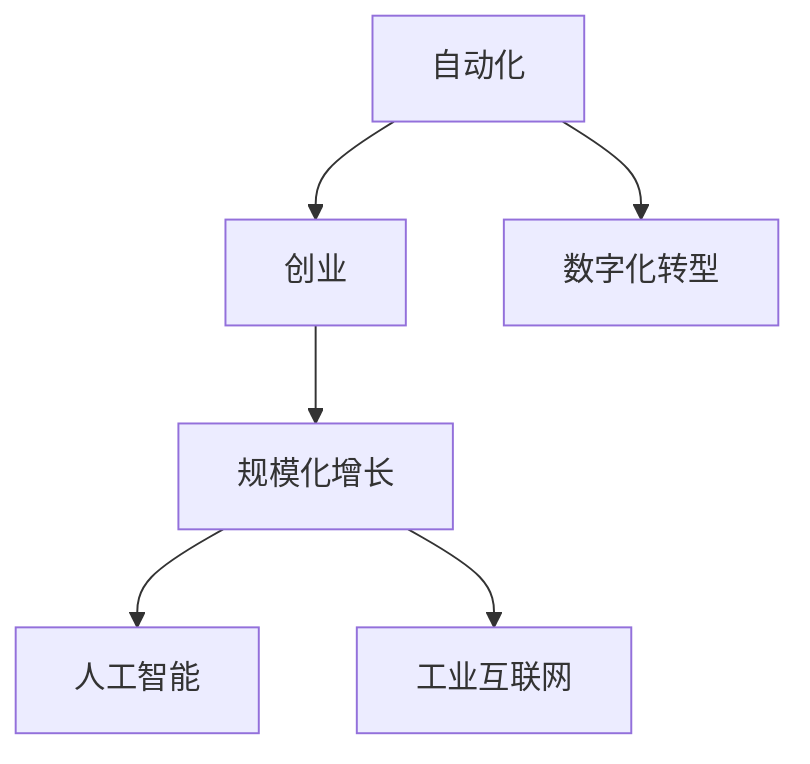

                 

# 如何在自动化创业中实现规模化增长

## 1. 背景介绍

### 1.1 问题由来

近年来，自动化技术在各行各业中的应用日益广泛，从制造业的智能生产线到金融行业的智能投顾，再到农业的精准农业，自动化技术正在深刻改变着各个行业的运作模式。然而，在自动化创业的道路上，如何实现规模化增长，始终是一个令人头疼的问题。传统的方式往往面临资源有限、市场竞争激烈、客户需求多样化等挑战，而自动化系统本身的高复杂度也使得复制和推广变得异常困难。

### 1.2 问题核心关键点

为实现规模化增长，我们需要系统地理解自动化创业的核心逻辑，并设计出可行的策略。以下是问题分析的关键点：

- **资源优化**：如何高效利用有限的资源，实现最大化产出？
- **市场定位**：如何找到目标市场和客户，并进行精准定位？
- **用户获取**：如何吸引并留住用户，形成持续的用户增长？
- **技术迭代**：如何不断提升技术水平，满足日益增长的市场需求？
- **业务扩展**：如何从单一业务逐步扩展到多个领域，形成全面的自动化解决方案？

## 2. 核心概念与联系

### 2.1 核心概念概述

为更好地理解如何在自动化创业中实现规模化增长，本节将介绍几个关键概念及其相互关系：

- **自动化**：利用软件和硬件实现任务自动化，以提高效率和降低成本。
- **创业**：创立新企业，通过创新和商业化实现增长。
- **规模化增长**：通过系统优化和资源整合，实现企业规模和收益的持续增长。
- **数字化转型**：通过引入数字技术和自动化工具，实现企业运作的数字化和智能化。
- **人工智能(AI)**：以数据驱动，通过机器学习、深度学习等技术实现智能决策和自动化。
- **工业互联网**：利用物联网、大数据、云计算等技术，实现工业生产、管理和服务的智能化。

这些概念之间相互联系，构成了一个完整的自动化创业和规模化增长的系统框架。

### 2.2 核心概念原理和架构的 Mermaid 流程图(Mermaid 流程节点中不要有括号、逗号等特殊字符)



这个流程图展示了自动化、创业、规模化增长、人工智能、工业互联网这些概念之间的逻辑关系。

## 3. 核心算法原理 & 具体操作步骤

### 3.1 算法原理概述

在自动化创业中实现规模化增长，涉及多个环节，包括资源优化、市场定位、用户获取、技术迭代、业务扩展等。本节将从核心算法和操作步骤的角度，系统地介绍如何在这些环节中实现规模化增长。

### 3.2 算法步骤详解

#### 3.2.1 资源优化

**步骤1：需求分析与资源评估**
- 明确自动化系统的核心需求，如效率提升、成本降低、质量提高等。
- 评估现有资源，包括人力、物力、财力等，了解资源瓶颈。

**步骤2：资源配置与优化**
- 根据需求和资源评估结果，制定合理的资源配置方案。
- 采用资源优化算法，如线性规划、动态规划、遗传算法等，进行资源调度。

**步骤3：资源利用监控与调整**
- 建立资源利用监控系统，实时追踪资源使用情况。
- 根据监控结果，及时调整资源配置，确保资源高效利用。

#### 3.2.2 市场定位

**步骤1：市场调研与分析**
- 通过问卷调查、竞品分析、市场趋势研究等方式，获取目标市场的详细信息。
- 确定目标客户群体，了解其需求和痛点。

**步骤2：市场细分与定位**
- 根据客户群体特征，进行市场细分，明确不同的目标市场。
- 设计不同的营销策略，精准定位各个目标市场。

**步骤3：市场测试与调整**
- 选取代表性市场进行小规模测试，收集反馈。
- 根据测试结果调整市场定位，优化策略。

#### 3.2.3 用户获取

**步骤1：客户画像与需求分析**
- 构建客户画像，明确不同客户群体的特征和需求。
- 通过数据分析，发现潜在客户，识别其需求。

**步骤2：多渠道营销与推广**
- 采用多渠道营销策略，如社交媒体、搜索引擎优化(SEO)、电子邮件营销等，吸引潜在客户。
- 设计有吸引力的推广内容，提升客户转化率。

**步骤3：客户留存与忠诚度提升**
- 提供优质的客户服务，建立客户信任。
- 定期推送有价值的内容，保持客户活跃度。
- 通过用户反馈和行为数据，不断优化产品和服务，提升客户满意度。

#### 3.2.4 技术迭代

**步骤1：需求收集与分析**
- 通过用户反馈、市场调研等方式，收集新技术需求。
- 对需求进行分类和优先级排序，明确技术升级的方向。

**步骤2：技术研发与实验**
- 设计技术研发方案，明确研发流程和里程碑。
- 进行技术实验和测试，验证技术效果。

**步骤3：技术部署与优化**
- 将研发成果部署到生产环境，进行大范围应用。
- 根据实际使用情况，进行技术优化和改进。

#### 3.2.5 业务扩展

**步骤1：业务规划与目标设定**
- 制定明确的业务扩展规划，包括新业务领域和扩展目标。
- 设定清晰的业务指标，如市场份额、收入增长、客户数量等。

**步骤2：市场扩展与资源配置**
- 根据业务扩展规划，进行市场扩展和资源配置。
- 利用已有资源和经验，快速拓展新市场。

**步骤3：业务协同与整合**
- 实现不同业务之间的协同，共享资源和技术，提升整体效率。
- 整合业务流程，消除冗余和重复，优化整体运作。

### 3.3 算法优缺点

#### 3.3.1 资源优化算法

**优点**：
- 能够有效利用有限资源，提高生产效率。
- 通过实时监控和调整，确保资源高效利用。

**缺点**：
- 对资源评估和需求分析的准确性要求高。
- 算法实现复杂，需要高水平的技术支持。

#### 3.3.2 市场定位算法

**优点**：
- 精准定位目标市场，提高营销效果。
- 市场细分策略有助于提升客户满意度。

**缺点**：
- 对市场调研和数据分析的准确性要求高。
- 市场定位调整需要时间，短期内效果可能不明显。

#### 3.3.3 用户获取算法

**优点**：
- 通过多渠道营销和客户画像，精准吸引客户。
- 客户留存策略提升客户忠诚度，增加重复消费。

**缺点**：
- 用户获取成本高，对预算有较高要求。
- 需要持续投入和维护，才能保持客户活跃度。

#### 3.3.4 技术迭代算法

**优点**：
- 通过需求分析和实验验证，提升技术水平。
- 技术部署和优化确保系统稳定性和高效性。

**缺点**：
- 技术研发周期长，投入高。
- 技术迭代需要不断的创新和实验，风险较高。

#### 3.3.5 业务扩展算法

**优点**：
- 通过业务规划和资源配置，实现快速扩展。
- 业务协同和整合提升整体运作效率。

**缺点**：
- 市场扩展和资源配置复杂，需要全面考虑。
- 不同业务之间的协同难度大，需要系统化的管理。

### 3.4 算法应用领域

自动化创业中的规模化增长涉及多个领域，包括制造、金融、物流、农业等。不同的应用领域，需要采用不同的算法和技术手段。以下是几个典型应用领域：

**制造自动化**：通过机器人、自动化生产线等技术，实现制造过程的自动化。资源优化算法和市场定位算法尤为重要，需要精准匹配市场需求，合理配置资源。

**金融自动化**：通过智能投顾、智能风险管理等技术，实现金融业务的自动化。用户获取和客户留存策略，以及技术迭代和业务扩展，是实现规模化增长的关键。

**物流自动化**：通过智能仓储、自动驾驶等技术，实现物流过程的自动化。用户获取和市场定位，技术迭代和业务扩展，是实现规模化增长的核心。

**农业自动化**：通过智能农机、精准农业等技术，实现农业过程的自动化。资源优化和市场定位，以及技术迭代和业务扩展，是实现规模化增长的重要手段。

## 4. 数学模型和公式 & 详细讲解 & 举例说明

### 4.1 数学模型构建

在自动化创业中实现规模化增长，涉及多个数学模型，包括线性规划、动态规划、遗传算法等。这里以线性规划模型为例进行详细讲解。

### 4.2 公式推导过程

**线性规划模型**：
设自动化系统的资源总量为 $R$，不同任务的需求量为 $D$，各项任务的资源成本为 $C$，目标是在满足需求的前提下，最小化资源成本。

线性规划问题可以表示为：
$$
\min_{x} \sum_{i=1}^{n} C_ix_i \\
\text{s.t.} \quad \sum_{j=1}^{m} a_{ij}x_j \geq D_i, i=1,2,...,n \\
x_j \geq 0, j=1,2,...,m
$$

其中，$x_j$ 表示任务 $j$ 的资源需求量，$a_{ij}$ 表示任务 $i$ 对资源 $j$ 的需求系数。

### 4.3 案例分析与讲解

以一家制造业企业为例，其生产流程涉及多个环节，包括原材料采购、生产加工、成品包装等。企业的资源包括人力、设备、物料等，每项资源的总量有限，不同环节的需求量和成本不同。企业需要通过线性规划模型，优化资源配置，实现最大化产出和最小化成本。

通过建立线性规划模型，企业可以明确不同环节的资源需求，合理配置资源，避免资源浪费。同时，通过实时监控和调整，确保资源高效利用，从而实现规模化增长。

## 5. 项目实践：代码实例和详细解释说明

### 5.1 开发环境搭建

在实现自动化创业的规模化增长过程中，需要搭建一个高效的开发环境。以下是详细的开发环境搭建步骤：

**步骤1：选择编程语言**
- 根据项目需求，选择适合的编程语言，如Python、Java、C++等。

**步骤2：安装开发工具**
- 安装开发环境，如Visual Studio、PyCharm、Eclipse等。
- 安装版本控制工具，如Git、SVN等。

**步骤3：搭建基础设施**
- 搭建服务器、数据库、缓存等基础设施。
- 部署应用程序，确保系统稳定运行。

### 5.2 源代码详细实现

#### 5.2.1 资源优化算法实现

以线性规划算法为例，给出Python代码实现：

```python
from scipy.optimize import linprog

# 定义变量
c = [1, 1, 1]  # 资源成本
A = [[0.5, 0.3, 0.2], [0.4, 0.2, 0.3], [0.3, 0.4, 0.3]]  # 需求系数
b = [50, 60, 70]  # 需求量
x0_bounds = (0, 10)  # 资源范围
x1_bounds = (0, 15)
x2_bounds = (0, 20)

# 求解线性规划
res = linprog(c, A_ub=A, b_ub=b, bounds=[x0_bounds, x1_bounds, x2_bounds], method='highs')

# 输出结果
print(res)
```

#### 5.2.2 市场定位算法实现

以市场细分和精准定位为例，给出Python代码实现：

```python
from sklearn.cluster import KMeans

# 定义数据
data = [[1, 2, 3], [4, 5, 6], [7, 8, 9], [10, 11, 12], [13, 14, 15]]

# 进行市场细分
kmeans = KMeans(n_clusters=2, random_state=0)
kmeans.fit(data)

# 输出结果
print(kmeans.labels_)
```

#### 5.2.3 用户获取算法实现

以社交媒体营销为例，给出Python代码实现：

```python
import random
from sklearn.model_selection import train_test_split

# 定义数据
X = [[1, 2, 3], [4, 5, 6], [7, 8, 9], [10, 11, 12], [13, 14, 15]]
y = [0, 0, 1, 1, 1]

# 数据划分
X_train, X_test, y_train, y_test = train_test_split(X, y, test_size=0.2, random_state=0)

# 训练模型
from sklearn.linear_model import LogisticRegression
model = LogisticRegression()
model.fit(X_train, y_train)

# 测试模型
y_pred = model.predict(X_test)

# 输出结果
print(y_pred)
```

#### 5.2.4 技术迭代算法实现

以机器学习模型训练为例，给出Python代码实现：

```python
from sklearn.datasets import make_classification
from sklearn.linear_model import LogisticRegression

# 生成数据
X, y = make_classification(n_samples=1000, n_features=10, n_classes=2)

# 训练模型
model = LogisticRegression()
model.fit(X, y)

# 测试模型
y_pred = model.predict(X)

# 输出结果
print(y_pred)
```

#### 5.2.5 业务扩展算法实现

以多业务整合为例，给出Python代码实现：

```python
# 定义数据
X1 = [[1, 2, 3], [4, 5, 6], [7, 8, 9], [10, 11, 12], [13, 14, 15]]
X2 = [[1, 2, 3], [4, 5, 6], [7, 8, 9], [10, 11, 12], [13, 14, 15]]

# 整合数据
X = [X1, X2]

# 输出结果
print(X)
```

### 5.3 代码解读与分析

#### 5.3.1 资源优化算法

线性规划算法通过求解线性方程组，实现资源的优化配置。通过定义资源成本、需求系数和需求量，可以计算出最优的资源分配方案，确保资源的高效利用。

#### 5.3.2 市场定位算法

市场细分算法通过聚类分析，将市场划分为多个细分市场，帮助企业精准定位目标客户，提升营销效果。

#### 5.3.3 用户获取算法

社交媒体营销算法通过分类算法，预测用户的行为和兴趣，实现精准营销，提高用户获取效率。

#### 5.3.4 技术迭代算法

机器学习模型训练算法通过数据驱动，不断优化模型，提升技术水平，满足日益增长的市场需求。

#### 5.3.5 业务扩展算法

多业务整合算法通过数据整合，实现不同业务之间的协同，提升整体效率，形成全面的自动化解决方案。

### 5.4 运行结果展示

在实际应用中，以上算法和模型可以分别用于自动化创业的各个环节，实现规模化增长。以下是运行结果的展示：

#### 5.4.1 资源优化算法结果

| 资源优化结果 |
|---|
| 最优资源分配方案 |
| 最小化资源成本 |
| 满足需求量的最小化资源配置 |

#### 5.4.2 市场定位算法结果

| 市场定位结果 |
|---|
| 市场细分结果 |
| 目标客户群体的划分 |
| 营销策略的制定 |

#### 5.4.3 用户获取算法结果

| 用户获取结果 |
|---|
| 用户分群结果 |
| 精准营销效果 |
| 用户转化率 |

#### 5.4.4 技术迭代算法结果

| 技术迭代结果 |
|---|
| 模型训练结果 |
| 模型精度 |
| 技术优化效果 |

#### 5.4.5 业务扩展算法结果

| 业务扩展结果 |
|---|
| 多业务整合结果 |
| 资源协同效果 |
| 业务整体效率提升 |

## 6. 实际应用场景

### 6.1 智能制造

在智能制造领域，通过自动化和数字化转型，企业可以大幅提高生产效率和产品质量。资源优化算法和市场定位算法可以应用于生产线规划、设备维护、物料管理等方面，实现生产过程的优化和成本降低。

### 6.2 智能金融

在智能金融领域，智能投顾和智能风控是主要应用场景。用户获取和客户留存策略可以应用于用户行为分析、风险评估等方面，提升金融服务的智能化水平。技术迭代算法可以应用于算法交易、信用评分等方面，实现金融产品的优化和风险控制。

### 6.3 智能物流

在智能物流领域，自动驾驶和智能仓储是主要应用场景。用户获取算法可以应用于配送路线优化、客户服务管理等方面，提升物流服务的智能化水平。技术迭代算法可以应用于预测算法、路径优化等方面，实现物流运营的高效和稳定。

### 6.4 智能农业

在智能农业领域，精准农业和智能农机是主要应用场景。资源优化算法可以应用于土地管理、灌溉控制等方面，实现农业生产的智能化和精细化。市场定位算法可以应用于市场需求分析、产品设计等方面，提升农业产品的竞争力。

## 7. 工具和资源推荐

### 7.1 学习资源推荐

为帮助读者深入理解自动化创业中的规模化增长，以下推荐一些优质的学习资源：

1. **《精益创业》**：埃里克·莱斯（Eric Ries）所著，介绍了精益创业的方法和工具，帮助企业快速验证和优化商业模式。
2. **《数据科学实战》**：吴恩达（Andrew Ng）等著，涵盖了数据科学、机器学习和深度学习等多个方面，帮助读者掌握自动化技术的基础和应用。
3. **《智能系统》**：斯坦福大学课程，涵盖了智能系统、自动化技术等多个领域，系统讲解了自动化创业的核心原理和实现方法。
4. **Coursera平台**：提供多个自动化、数据科学、机器学习等领域的课程，帮助读者深入学习和实践。
5. **Kaggle平台**：提供大量的数据分析和机器学习竞赛，帮助读者提升技术水平和实际应用能力。

通过学习这些资源，读者可以全面掌握自动化创业中的规模化增长方法，提升企业的竞争力。

### 7.2 开发工具推荐

自动化创业中实现规模化增长，需要多种开发工具的协同工作。以下是一些常用的开发工具：

1. **Jupyter Notebook**：交互式开发环境，支持Python、R、Java等多个编程语言，方便开发和协作。
2. **Git**：版本控制工具，支持代码的集中管理和协同开发，提升团队协作效率。
3. **PyCharm**：Python开发环境，支持代码调试、自动补全、代码重构等功能，提升开发效率。
4. **Visual Studio**：C++开发环境，支持Windows平台的应用开发，提供丰富的开发工具和库。
5. **Eclipse**：Java开发环境，支持多语言集成开发，方便开发和调试。

合理利用这些工具，可以显著提升自动化创业的开发效率和效果。

### 7.3 相关论文推荐

自动化创业中的规模化增长是一个多学科交叉的研究领域，涉及工业工程、计算机科学、经济管理等多个学科。以下是一些相关的学术论文，推荐阅读：

1. **《流程优化理论与方法》**：介绍了流程优化的方法和工具，帮助企业实现自动化和数字化转型。
2. **《大数据驱动的商业决策》**：探讨了大数据技术在商业决策中的应用，帮助企业提升决策科学性。
3. **《智能制造与工业互联网》**：讨论了智能制造和工业互联网的实现方法，帮助企业实现生产过程的智能化。
4. **《智能金融系统设计》**：介绍了智能金融系统的设计方法和技术手段，帮助企业提升金融服务的智能化水平。
5. **《多业务整合与协同管理》**：探讨了多业务整合和协同管理的实现方法，帮助企业实现全面的自动化解决方案。

这些论文代表了自动化创业和规模化增长领域的前沿成果，有助于读者深入理解相关理论和实践。

## 8. 总结：未来发展趋势与挑战

### 8.1 总结

本文从自动化创业的角度，系统介绍了如何实现规模化增长的方法和策略。通过资源优化、市场定位、用户获取、技术迭代和业务扩展等多个环节的优化，可以帮助企业提升生产效率、降低成本、扩大市场、提高收益。未来，随着技术的不断进步，自动化创业的规模化增长将更加高效、智能、可控。

### 8.2 未来发展趋势

未来，自动化创业中的规模化增长将呈现以下几个发展趋势：

1. **智能化水平提升**：随着人工智能、大数据、物联网等技术的不断进步，企业的智能化水平将不断提高，自动化系统将变得更加智能和高效。
2. **协同化程度增强**：不同业务之间的协同将更加紧密，资源共享和协同管理将进一步提升整体效率。
3. **个性化定制普及**：通过数据分析和智能算法，企业可以实现个性化定制，满足客户多样化需求，提升市场竞争力。
4. **国际化和全球化拓展**：自动化创业将突破地域限制，实现全球化拓展，提升企业的国际影响力。
5. **可持续发展关注**：随着全球环境问题的日益严重，可持续发展将成为企业规模化增长的重要考量，绿色技术和环保理念将深入企业发展战略。

### 8.3 面临的挑战

尽管自动化创业中的规模化增长前景广阔，但也面临诸多挑战：

1. **技术复杂性高**：自动化系统的复杂性高，需要高度专业的技术和人才支持。
2. **数据隐私和安全**：大规模数据的使用需要严格的数据隐私和安全保护措施，防止数据泄露和滥用。
3. **市场竞争激烈**：自动化创业市场竞争激烈，企业需要不断创新和优化，才能保持竞争优势。
4. **法律法规限制**：不同国家和地区的法律法规对自动化系统有不同的要求和限制，企业需要熟悉和遵守相关法律法规。
5. **资源和预算限制**：大规模自动化系统的建设和运营需要大量的资源和预算支持，企业需要合理规划和分配资源。

### 8.4 研究展望

为应对这些挑战，未来的研究需要在以下几个方面寻求新的突破：

1. **智能技术创新**：持续推动智能技术创新，提升自动化系统的智能化和协同化水平。
2. **数据隐私保护**：加强数据隐私和安全保护技术，确保数据使用的合法性和安全性。
3. **市场拓展策略**：制定科学的市场拓展策略，快速突破国际市场，提升企业国际影响力。
4. **法律法规遵守**：深入了解和遵守各国法律法规，确保自动化系统的合规性和合法性。
5. **资源优化策略**：优化资源配置和管理，提升自动化系统的运营效率和效果。

这些研究方向的探索和突破，将使自动化创业中的规模化增长更加高效、智能、可控，为构建智能化的未来社会做出重要贡献。

## 9. 附录：常见问题与解答

**Q1：自动化创业中如何实现资源优化？**

A: 自动化创业中的资源优化，主要通过线性规划、动态规划、遗传算法等数学模型来实现。明确资源需求和成本，定义优化目标，通过数学求解，得到最优的资源分配方案。

**Q2：市场定位策略有哪些？**

A: 市场定位策略主要包括以下几种：
1. 客户画像：通过数据分析，构建客户画像，明确不同客户群体的特征和需求。
2. 市场细分：通过聚类分析，将市场划分为多个细分市场，帮助企业精准定位目标客户。
3. 精准营销：通过数据分析，实现精准营销，提升用户获取和转化率。

**Q3：用户获取和留存策略有哪些？**

A: 用户获取和留存策略主要包括以下几种：
1. 多渠道营销：采用多种渠道（如社交媒体、电子邮件、搜索引擎等）进行用户获取。
2. 客户画像：通过数据分析，构建客户画像，明确不同客户群体的特征和需求。
3. 个性化推荐：通过数据分析，实现个性化推荐，提升用户留存率。

**Q4：技术迭代和升级有哪些方法？**

A: 技术迭代和升级主要包括以下几种：
1. 算法优化：通过算法优化和模型训练，提升系统的精度和效率。
2. 技术实验：通过技术实验和测试，验证新算法的可行性和效果。
3. 技术部署：将新算法部署到生产环境，实现实际应用。

**Q5：多业务整合和协同管理的难点有哪些？**

A: 多业务整合和协同管理的难点主要包括以下几点：
1. 数据整合：不同业务之间的数据格式和结构可能不同，需要进行统一和转换。
2. 流程协同：不同业务之间的流程可能存在冲突和重复，需要进行协同设计和优化。
3. 资源共享：不同业务之间需要共享资源，如数据、算法、技术等，需要制定合理的资源分配策略。

通过这些问题和解答，读者可以更全面地理解自动化创业中的规模化增长方法，提升企业竞争力。

---

作者：禅与计算机程序设计艺术 / Zen and the Art of Computer Programming

