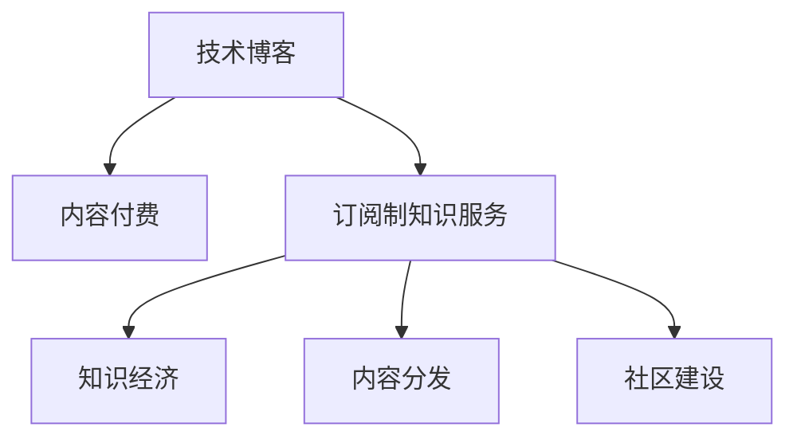

                 

# 如何将技术博客转化为订阅制知识服务

> 关键词：技术博客,订阅制知识服务,内容付费,知识经济,内容分发

## 1. 背景介绍

### 1.1 问题由来
随着互联网和信息技术的发展，技术博客作为一种知识传播方式，已不再是一个新鲜事物。技术博客不仅可以展示个人的技术水平和专业深度，还可以通过文章传播新的技术观点、分享技术经验，成为技术人员和学者交流互动的平台。然而，传统的技术博客往往通过免费的方式分发内容，无法很好地获取收益，使得内容创作者缺乏持续创作的动力。为了改变这种局面，越来越多内容创作者和平台开始探索如何从技术博客转型为订阅制知识服务，从而实现内容变现，并推动知识经济的发展。

### 1.2 问题核心关键点
将技术博客转化为订阅制知识服务的关键在于：
1. 如何设计合理的付费机制，保证内容价值与付费之间的平衡。
2. 如何构建用户信任，提升用户订阅意愿。
3. 如何高效分发内容，提高用户获取知识的效率。
4. 如何持续提供优质内容，确保平台的长期发展。
5. 如何通过用户反馈优化服务，提升用户满意度。

这些核心关键点共同构成了将技术博客转化为订阅制知识服务的系统性问题。只有在解决这些问题的过程中不断探索和创新，才能实现技术博客向知识服务的成功转型。

## 2. 核心概念与联系

### 2.1 核心概念概述

为更好地理解将技术博客转化为订阅制知识服务，本节将介绍几个密切相关的核心概念：

- 技术博客（Technical Blog）：以技术为主题的博客，通常由技术人员、技术爱好者或研究者创建，分享技术经验、观点、案例等。
- 订阅制知识服务（Subscription-Based Knowledge Service）：通过付费订阅模式提供知识内容的平台，用户按需支付订阅费，享受高质量、持续更新的知识服务。
- 内容付费（Content Subscription）：基于内容价值的付费机制，用户根据内容质量、深度、实用性等因素进行付费，保障内容创作者的经济收益。
- 知识经济（Knowledge Economy）：通过知识和信息传递创造价值，并以此作为经济活动的基础的经济形态。
- 内容分发（Content Distribution）：将内容分发到用户手中，确保用户能够高效、便捷地获取知识。
- 社区建设（Community Building）：通过社区互动和用户反馈，不断优化平台内容和用户体验，提升用户黏性。

这些核心概念之间的逻辑关系可以通过以下Mermaid流程图来展示：



这个流程图展示了这个转换过程的关键概念及其之间的关系：

1. 技术博客通过内容付费，转化为订阅制知识服务，获取经济收益。
2. 订阅制知识服务构建知识经济，提高内容创作者的经济回报。
3. 内容付费确保知识高效分发，提升用户获取知识的效率。
4. 社区建设增强用户黏性，持续优化平台服务。

这些概念共同构成了将技术博客转化为订阅制知识服务的整体框架，有助于理解其系统性和综合性。

## 3. 核心算法原理 & 具体操作步骤
### 3.1 算法原理概述

将技术博客转化为订阅制知识服务，本质上是一个基于内容付费的商业模式优化过程。其核心思想是：通过构建合理的付费机制和平台生态，实现内容创作者与用户之间的共赢，从而推动知识经济的发展。

形式化地，假设内容创作者为 $M_{\theta}$，平台为 $P_{\pi}$，用户为 $U$，其中 $\theta$ 为创作者提供的知识内容，$\pi$ 为平台提供的优质服务，则整个过程的优化目标为最大化平台和创作者的收益，即：

$$
\max_{M_{\theta}, P_{\pi}} (M_{\theta} + P_{\pi}) \times U
$$

其中 $U$ 为用户的订阅数量，通过设定合理的付费机制和内容分发策略，最大化平台的订阅数量，从而实现内容创作者和平台的共赢。

### 3.2 算法步骤详解

基于内容付费的商业模式优化过程一般包括以下几个关键步骤：

**Step 1: 设计付费机制**
- 选择合适的付费模式，如按月订阅、按次付费、按内容付费等。
- 确定付费金额，可以参考同领域或同质量内容的市场定价，综合考虑内容价值和用户需求。
- 提供免费试用期，吸引新用户尝试订阅。

**Step 2: 优化内容分发**
- 使用推荐系统对优质内容进行推广，提高用户获取知识的效率。
- 设计简洁明了的订阅界面，让用户轻松选择和购买内容。
- 提供多种内容形式，如文章、视频、课程等，满足用户多样化需求。

**Step 3: 构建平台生态**
- 引入知名内容创作者，提高平台吸引力。
- 提供丰富的互动功能，如评论、点赞、分享等，增强社区氛围。
- 通过用户反馈不断优化内容和平台功能，提升用户体验。

**Step 4: 实施技术支撑**
- 使用数据挖掘技术分析用户行为，优化内容推荐算法。
- 使用机器学习技术对内容进行聚类、分类，提升内容质量。
- 使用区块链技术保障用户数据和交易的安全性。

**Step 5: 评估和优化**
- 定期评估平台的订阅量和用户满意度，优化付费机制和内容分发策略。
- 不断引入新内容和功能，保持平台活力。
- 对用户反馈进行及时响应，解决问题，提升服务质量。

### 3.3 算法优缺点

将技术博客转化为订阅制知识服务的商业模型具有以下优点：
1. 实现知识变现：通过内容付费，内容创作者能够获得稳定的经济回报，激励其持续创作优质内容。
2. 提升用户体验：用户按需订阅，避免了垃圾信息的干扰，提高了获取知识的效率。
3. 构建平台生态：通过平台互动和社区建设，增强用户黏性，形成良性循环。

同时，该模型也存在一定的局限性：
1. 依赖用户信任：用户对付费机制和平台生态的信任是订阅制知识服务成功的关键。
2. 竞争激烈：平台之间往往存在激烈竞争，吸引用户订阅成为首要任务。
3. 内容多样性：平台需要提供多样化、高质量的内容，满足用户不同需求。
4. 技术门槛：平台建设和运营需要一定的技术支持和资金投入。

尽管存在这些局限性，但就目前而言，内容付费的商业模式在知识服务领域表现出色，成为推动知识经济的重要手段。未来相关研究应进一步优化付费机制和平台生态，提升用户体验和满意度。

### 3.4 算法应用领域

将技术博客转化为订阅制知识服务的方法已在多个领域得到广泛应用，例如：

- 技术培训：提供针对特定技术领域的培训课程和视频，帮助用户掌握新技能。
- 在线教育：提供系统化的知识体系和互动学习体验，帮助用户系统学习。
- 技术咨询：提供专家解答和方案建议，帮助用户解决技术问题。
- 软件开发：提供代码库、教程和工具，帮助开发者提高编程技能。
- 科技资讯：提供最新的科技新闻和深度分析，帮助用户了解科技动态。

除了上述这些经典应用外，订阅制知识服务还被创新性地应用到更多场景中，如智能推荐、个性化学习、社区问答等，为用户提供了更灵活、高效的知识获取方式。

## 4. 数学模型和公式 & 详细讲解 & 举例说明

### 4.1 数学模型构建

本节将使用数学语言对将技术博客转化为订阅制知识服务的过程进行更加严格的刻画。

记内容创作者为 $M_{\theta}$，平台为 $P_{\pi}$，用户为 $U$，则整个商业模式优化过程的数学模型可以表示为：

$$
\max_{M_{\theta}, P_{\pi}} (M_{\theta} + P_{\pi}) \times U
$$

其中 $U$ 为用户的订阅数量，可通过以下目标函数进行优化：

$$
\max_{M_{\theta}, P_{\pi}} \sum_{i=1}^N U_i \log (\frac{U_i}{U})
$$

即最大化订阅数量 $U$ 的对数似然函数。

### 4.2 公式推导过程

在订阅制知识服务中，内容价值与付费之间存在一个平衡点。假设内容创作者的收益函数为 $R_{M_{\theta}}$，平台的收益函数为 $R_{P_{\pi}}$，则用户订阅的期望收益为：

$$
E(R_{U}) = E(R_{M_{\theta}}) + E(R_{P_{\pi}})
$$

其中 $E(R_{U})$ 为用户订阅的期望收益。

通过最大化订阅数量 $U$，平台和创作者均能获得稳定的经济回报，从而实现共赢。

### 4.3 案例分析与讲解

以Coursera为例，分析其如何将技术博客转化为订阅制知识服务：

Coursera 是一个提供高质量在线课程的平台，其商业模式的成功转型主要体现在以下几个方面：

1. **优质课程：** Coursera 引入全球顶尖大学的课程，确保内容的权威性和实用性。
2. **平台社区：** 提供丰富的互动功能，如讨论区、论坛等，增强用户黏性。
3. **订阅机制：** 提供免费试用期，吸引新用户，并设定合理的付费标准。
4. **技术支撑：** 使用推荐系统对课程进行推广，优化内容分发策略。

Coursera 通过这些措施，成功地将技术博客转化为订阅制知识服务，实现了知识变现和用户满意的均衡。

## 5. 项目实践：代码实例和详细解释说明
### 5.1 开发环境搭建

在进行订阅制知识服务的开发前，我们需要准备好开发环境。以下是使用Python进行Flask开发的环境配置流程：

1. 安装Anaconda：从官网下载并安装Anaconda，用于创建独立的Python环境。

2. 创建并激活虚拟环境：
```bash
conda create -n pytorch-env python=3.8 
conda activate pytorch-env
```

3. 安装Flask：从官网下载并安装Flask，作为搭建订阅制知识服务的基础。
```bash
pip install flask
```

4. 安装Flask-WTF：用于表单验证，确保用户输入数据的安全。
```bash
pip install flask-wtf
```

5. 安装Flask-Login：用于用户认证，确保只有订阅用户才能访问付费内容。
```bash
pip install flask-login
```

完成上述步骤后，即可在`pytorch-env`环境中开始订阅制知识服务的开发。

### 5.2 源代码详细实现

下面以在线教育平台为例，给出使用Flask实现订阅制知识服务的PyTorch代码实现。

首先，定义用户认证模块：

```python
from flask_login import UserMixin, login_user, login_required, logout_user, current_user

class User(UserMixin):
    def __init__(self, id):
        self.id = id
```

然后，定义订阅服务模块：

```python
from flask import Flask, render_template, request, redirect, url_for
from flask_login import current_user

app = Flask(__name__)

@app.route('/subscribe', methods=['GET', 'POST'])
@login_required
def subscribe():
    if request.method == 'POST':
        # 处理订阅请求
        # 从数据库中获取用户的订阅状态
        if current_user.is_subscribed:
            return redirect(url_for('logout'))
        else:
            # 更新订阅状态
            current_user.is_subscribed = True
            # 记录订阅信息到数据库
            return redirect(url_for('profile'))
    else:
        # 渲染订阅页面
        return render_template('subscribe.html')
```

最后，定义用户个人资料模块：

```python
@app.route('/profile', methods=['GET', 'POST'])
@login_required
def profile():
    # 渲染用户个人资料页面
    return render_template('profile.html')
```

完成上述步骤后，即可在`pytorch-env`环境中开始订阅制知识服务的开发。

### 5.3 代码解读与分析

让我们再详细解读一下关键代码的实现细节：

**User类**：
- `__init__`方法：初始化用户ID。
- 后续的`login_user`、`logout_user`等方法，用于用户的登录和登出操作。

**subscribe函数**：
- 在用户登录后，可访问订阅页面，点击订阅按钮提交请求。
- 服务器端接收到请求后，检查用户是否已经订阅，若未订阅则更新订阅状态并记录到数据库，返回登录页面。若已订阅则重定向到登出页面。
- 在用户未登录时，无法访问订阅页面，避免未授权访问。

**profile函数**：
- 用户登录后，可访问个人资料页面，查看自己的订阅状态和订阅信息。

通过Flask的简单实现，我们可以看到订阅制知识服务的基本框架：用户认证、订阅处理、用户资料展示。开发者可以将更多精力放在功能扩展和用户体验优化上，如内容推荐、支付集成、用户互动等。

当然，工业级的系统实现还需考虑更多因素，如订阅管理、内容发布、数据分析等。但核心的订阅流程基本与此类似。

## 6. 实际应用场景
### 6.1 在线教育平台

在线教育平台是订阅制知识服务的典型应用场景之一。传统教育往往受时间、地点和资源的限制，而在线教育平台通过订阅机制，使得用户可以随时随地获取高质量的教育资源，提高学习效率。

在技术实现上，可以设计多种付费模式，如月度、季度、年度订阅，并提供不同层次的课程选择。同时，使用推荐系统对课程进行个性化推荐，提高用户获取知识的效率。平台还可以通过用户反馈和评价，不断优化课程内容和教学质量，提升用户满意度。

### 6.2 技术培训课程

技术培训课程是订阅制知识服务的另一大应用场景。开发者、技术爱好者、IT公司等都可以通过订阅制平台，获取系统化、专业化的技术培训课程，掌握新技能，提升个人能力。

在技术实现上，可以邀请知名技术专家和公司工程师，设计和开发课程内容。同时，提供互动式学习工具，如编程练习、代码提交、社区讨论等，增强学习效果。平台还可以通过用户订阅行为，个性化推荐课程和相关内容，提升用户的学习体验。

### 6.3 知识付费服务

知识付费服务是订阅制知识服务的广义应用，涵盖了技术博客、在线课程、技术咨询等多个领域。通过订阅制平台，用户可以按需获取知识内容，支持内容创作者的经济回报，推动知识经济的发展。

在技术实现上，可以设计多种订阅模式，如按月、按年订阅，或按内容付费。同时，提供丰富的内容形式，如文章、视频、音频等，满足用户多样化需求。平台还可以通过用户反馈和评价，不断优化内容和平台功能，提升用户满意度和平台吸引力。

### 6.4 未来应用展望

随着订阅制知识服务的不断发展，其在更多领域得到应用，为传统行业带来变革性影响：

在智慧医疗领域，通过在线教育平台，医生和护士可以获取最新的医学知识和技能培训，提升医疗服务质量。

在智能教育领域，学生和教师可以通过订阅制平台，获取系统化、个性化的学习资源，提高教学质量。

在智慧城市治理中，政府和城市管理者可以通过在线培训课程，提高公共管理和服务能力。

此外，在企业培训、金融培训、法律培训等众多领域，订阅制知识服务也将不断涌现，为各行各业提供专业、便捷的知识获取渠道。相信随着订阅制知识服务的持续演进，将在更多领域大放异彩，为经济社会发展注入新的动力。

## 7. 工具和资源推荐
### 7.1 学习资源推荐

为了帮助开发者系统掌握订阅制知识服务的理论基础和实践技巧，这里推荐一些优质的学习资源：

1. 《订阅制知识服务的理论与实践》系列博文：由订阅制服务专家撰写，深入浅出地介绍了订阅制服务的核心原理、用户行为分析、内容分发策略等前沿话题。

2. Coursera官方文档：Coursera平台的官方文档，提供了丰富的课程设计和用户管理样例，是上手实践的必备资料。

3. 《知识付费的经济学》书籍：深度探讨了知识付费的经济机制和用户行为，提供理论基础和实际案例。

4. Udemy和Udacity等在线教育平台：提供丰富的课程和用户管理经验，可借鉴其成功的商业模式和技术实现。

5. Google Analytics等用户行为分析工具：通过数据分析，优化推荐系统，提升用户获取知识的效率。

通过对这些资源的学习实践，相信你一定能够快速掌握订阅制知识服务的精髓，并用于解决实际的商业问题。

### 7.2 开发工具推荐

高效的开发离不开优秀的工具支持。以下是几款用于订阅制知识服务开发的常用工具：

1. Flask：基于Python的开源Web框架，灵活易用，适合快速迭代研究。平台后端搭建的首选。

2. Django：同样是基于Python的开源Web框架，提供完整的数据库集成和用户认证功能，适合大型平台开发。

3. GraphQL：用于构建复杂查询接口，提高数据获取的灵活性和效率。

4. Stripe：提供支付集成服务，支持多种支付方式，保障用户支付安全。

5. Redis：高性能的内存数据库，用于缓存订阅信息和管理用户状态。

6. ElasticSearch：分布式搜索引擎，用于管理课程内容和标签，支持快速搜索和推荐。

合理利用这些工具，可以显著提升订阅制知识服务的开发效率，加快创新迭代的步伐。

### 7.3 相关论文推荐

订阅制知识服务的发展源于学界的持续研究。以下是几篇奠基性的相关论文，推荐阅读：

1. "The Economics of Online Platforms" by Jonathan J. Potters et al.：探讨了在线平台商业模式的经济理论，为订阅制服务提供了理论基础。

2. "User Subscription Dynamics in Online Content Platforms" by Joon Hee Park et al.：分析了用户订阅行为的数据模型，为平台优化订阅机制提供了数据支持。

3. "Content Personalization on Online Learning Platforms" by Zheng Xiao et al.：介绍了推荐系统在在线学习平台中的应用，提高了用户获取知识的效率。

4. "Monetization Strategies for Content Providers" by Steve Whitt et al.：探讨了内容创作者的收益模型，为订阅制服务的商业模式提供了理论指导。

5. "User-Centric Online Learning Platforms" by Ben J. Dawson et al.：介绍了用户中心化的在线学习平台设计，为用户体验优化提供了实际案例。

这些论文代表了大规模知识服务的发展脉络。通过学习这些前沿成果，可以帮助研究者把握学科前进方向，激发更多的创新灵感。

## 8. 总结：未来发展趋势与挑战

### 8.1 总结

本文对将技术博客转化为订阅制知识服务进行了全面系统的介绍。首先阐述了订阅制知识服务的背景和意义，明确了订阅制服务在推动知识经济中的重要作用。其次，从原理到实践，详细讲解了订阅制知识服务的数学模型和关键步骤，给出了订阅制知识服务的完整代码实例。同时，本文还广泛探讨了订阅制知识服务在多个行业领域的应用前景，展示了订阅制服务的广阔前景。最后，本文精选了订阅制知识服务的各类学习资源，力求为读者提供全方位的技术指引。

通过本文的系统梳理，可以看到，订阅制知识服务正成为知识经济的重要组成部分，极大地拓展了内容创作的变现渠道，推动了知识经济的发展。未来，伴随订阅制知识服务的持续演进，将带来更多行业领域的数字化转型升级，推动经济社会向着更加智能、高效的方向发展。

### 8.2 未来发展趋势

展望未来，订阅制知识服务将呈现以下几个发展趋势：

1. 内容多样化：订阅制平台将提供更多形式的内容，如文章、视频、音频等，满足用户多样化需求。
2. 个性化推荐：推荐系统将成为订阅制平台的核心竞争力，通过精准推荐提高用户获取知识的效率。
3. 社区化互动：平台将构建更加活跃的社区，通过用户互动提升用户体验和黏性。
4. 移动化普及：随着移动互联网的发展，订阅制知识服务将更多地向移动端拓展，提供随时随地学习的机会。
5. 国际化扩展：订阅制平台将走向国际化，引入全球优质内容，扩大用户群体。

以上趋势凸显了订阅制知识服务的广阔前景。这些方向的探索发展，必将进一步提升用户获取知识的效率，推动知识经济的繁荣。

### 8.3 面临的挑战

尽管订阅制知识服务已经取得了显著成就，但在迈向更加智能化、普适化应用的过程中，它仍面临诸多挑战：

1. 竞争激烈：订阅制平台之间的竞争将愈加激烈，如何吸引和留住用户成为首要任务。
2. 内容质量：平台需要持续提供高质量的内容，避免垃圾信息的干扰。
3. 技术门槛：平台建设和运营需要一定的技术支持和资金投入。
4. 用户信任：平台需要构建用户信任，提升用户订阅意愿。

尽管存在这些挑战，但通过不断创新和优化，订阅制知识服务必将在知识经济中占据重要地位，推动经济社会的数字化转型升级。

### 8.4 研究展望

面对订阅制知识服务所面临的挑战，未来的研究需要在以下几个方面寻求新的突破：

1. 探索新的内容付费模式：设计更加灵活、合理的付费机制，提高用户订阅意愿。
2. 提升内容推荐算法：引入更多算法和技术，提升推荐系统的精准度和个性化程度。
3. 优化用户互动体验：通过社区建设、用户反馈等手段，提升用户满意度和黏性。
4. 引入新的技术和工具：利用大数据、AI等技术，提升平台的智能化水平和运营效率。

这些研究方向将推动订阅制知识服务向更高层次发展，为知识经济的发展提供强大动力。

## 9. 附录：常见问题与解答

**Q1：订阅制知识服务是否适用于所有领域？**

A: 订阅制知识服务在大多数领域都能取得不错的效果，特别是对于知识密集型的领域。但对于一些需要实时性、互动性很强的领域，如在线医疗、在线咨询等，订阅制服务可能不够灵活。此时可以考虑引入实时互动功能和专家在线咨询，增强用户体验。

**Q2：如何设计合理的订阅模式？**

A: 订阅模式的设计需要考虑用户需求和内容价值。一般建议设计多种订阅模式，如按月、按年订阅，或按内容付费，满足不同用户的需求。同时，提供免费试用期，吸引新用户尝试订阅，并设定合理的付费标准，保障内容创作者的经济回报。

**Q3：如何优化内容推荐算法？**

A: 内容推荐算法的设计需要结合用户行为数据分析、内容属性标注等技术。一般建议使用协同过滤、基于内容的推荐等算法，提升推荐系统的精准度和个性化程度。同时，引入实时推荐技术，根据用户行为动态调整推荐内容，提高用户获取知识的效率。

**Q4：如何构建用户信任？**

A: 用户信任的构建需要从平台和内容创作者两方面着手。平台应提供高质量的内容和服务，保障用户的订阅权益。内容创作者应注重内容质量，避免发布低质量、误导性的信息，赢得用户信任。

**Q5：如何优化用户体验？**

A: 用户体验的优化需要从界面设计、功能实现、服务质量等多个方面入手。平台应提供简洁明了的操作界面，设计易用的功能，提供高质量的服务。同时，引入用户反馈机制，及时解决问题，提升用户满意度。

通过这些问题的解答，可以看到，订阅制知识服务需要从多个维度进行优化，才能真正实现用户的价值最大化和平台的持续发展。相信随着技术的不断进步，订阅制知识服务必将在推动知识经济的发展中扮演越来越重要的角色。

---

作者：禅与计算机程序设计艺术 / Zen and the Art of Computer Programming

