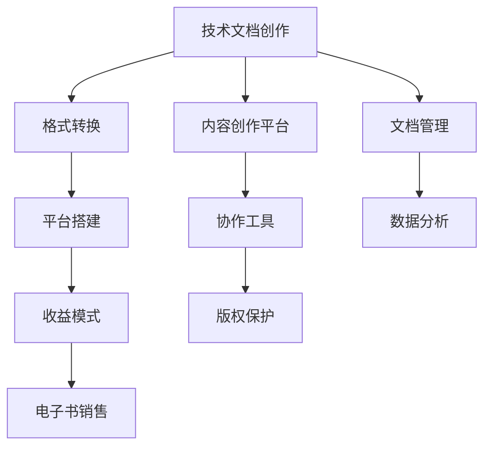

                 

## 1. 背景介绍

技术文档是技术交流和知识传承的重要媒介，但传统的PDF或Word文档形式在传播和复用方面存在诸多局限。随着互联网的普及和数字化的发展，将技术文档转化为易于传播、可搜索、可复用的电子文档形式，成为提升知识管理效率、促进知识共享的重要手段。付费电子书的出现，不仅解决了文档传播的版权问题，还为创作者提供了获得直接经济回报的新途径。本文将系统介绍如何将技术文档转化为付费电子书，涵盖内容创作、格式转换、平台搭建、收益模式等方面的核心内容，帮助技术创作者最大化其技术文档的价值。

## 2. 核心概念与联系

### 2.1 核心概念概述

在深入探讨如何将技术文档转化为付费电子书之前，首先需要理解几个核心概念：

- **技术文档（Technical Documentation）**：指与技术相关的、用于指导特定应用或产品开发、维护、操作等的文档。
- **电子书（E-book）**：一种电子形式的书籍，通常以PDF、EPUB等格式存储，可直接在电子设备上阅读。
- **付费电子书（Paid E-book）**：指需要付费才能下载或阅读的电子书，通常包含特定领域的专业知识或技巧。
- **内容创作（Content Creation）**：指通过撰写、编辑、设计等方式，创建有价值的信息内容的整个过程。
- **格式转换（Format Conversion）**：将一种文档格式转化为另一种文档格式的过程，通常涉及文本、图表、公式等内容的转换。
- **平台搭建（Platform Development）**：指搭建一个能够支持电子书发布、销售、阅读的平台，需考虑如用户界面、支付系统、内容管理系统等功能。
- **收益模式（Revenue Model）**：指电子书销售的盈利方式，如一次性购买、订阅模式、按章节收费等。

这些核心概念之间存在紧密的联系。技术文档的创作是电子书内容的基础，而格式转换和平台搭建则是电子书呈现和销售的必要环节，收益模式则直接关系到作者的经济利益。

### 2.2 核心概念原理和架构的 Mermaid 流程图



该流程图展示了技术文档转化为付费电子书的基本流程，从内容创作开始，经过格式转换、平台搭建、收益模式设置等环节，最终实现电子书的销售和阅读。其中，内容创作平台和协作工具促进了内容创作的效率和质量；版权保护和文档管理确保了内容的安全和可追溯性；数据分析则有助于理解和优化收益模式。

## 3. 核心算法原理 & 具体操作步骤

### 3.1 算法原理概述

将技术文档转化为付费电子书的过程，本质上是将结构化的文本内容转换为可搜索、可复用的电子格式，并通过平台实现销售和阅读。这一过程涉及文本处理、格式转换、信息检索等多个步骤，算法原理涉及自然语言处理（NLP）、图像处理、数据存储等多个领域。

### 3.2 算法步骤详解

#### 3.2.1 内容创作

1. **选题和规划**：确定电子书的主题、结构和内容大纲。
2. **内容撰写**：根据大纲进行内容创作，确保内容专业、准确、易于理解。
3. **编辑和校对**：对内容进行格式调整、语法校对、逻辑检查等。
4. **多媒体整合**：加入图表、代码、示例等，丰富内容形式。

#### 3.2.2 格式转换

1. **文本处理**：对原始文档进行分词、句法分析、词性标注等NLP处理，提取关键信息。
2. **转换工具**：选择合适的文本转换工具（如Markdown转PDF、Word转EPUB等），进行格式转换。
3. **格式校验**：确保转换后的格式符合电子书的规范，如PDF文件的字体、段落间距、页眉页脚等。

#### 3.2.3 平台搭建

1. **选择平台**：根据需求选择合适的电子书发布平台（如Smashwords、Amazon Kindle Direct Publishing等）。
2. **开发功能**：搭建平台所需的功能模块，如用户注册、内容浏览、购买支付、评价反馈等。
3. **集成支付系统**：与第三方支付平台（如PayPal、支付宝等）对接，实现电子书的在线支付。

#### 3.2.4 收益模式设计

1. **一次性购买**：用户购买后，可以无限次阅读电子书。
2. **订阅模式**：用户按月或按年订阅电子书，获取所有内容。
3. **按章节收费**：用户按章节或模块付费，购买特定部分内容。

### 3.3 算法优缺点

#### 3.3.1 优点

1. **知识共享和传播**：电子书打破了时间和空间的限制，使知识传播更加高效。
2. **版权保护**：电子书的数字版权保护技术，防止非法复制和盗版。
3. **收益多样化**：多样的收益模式满足不同用户的需求，增加作者的经济收益。

#### 3.3.2 缺点

1. **技术门槛高**：电子书创作和平台搭建需要一定的技术知识。
2. **市场竞争激烈**：电子书市场已相对饱和，新入者需具备差异化的内容和创意。
3. **收益不确定性**：电子书销售受市场需求、价格策略等多因素影响，收益存在不确定性。

### 3.4 算法应用领域

电子书技术广泛应用于技术文档、教育、小说、专业指南等多个领域。技术文档的电子书化，不仅便于传播和复用，还为技术创作者提供了新的经济收益途径。

- **技术文档**：如软件开发手册、系统部署指南、用户手册等。
- **教育**：如编程教材、数学题库、外语学习资料等。
- **小说和文学**：经典文学作品、科幻小说、现代文学作品等。
- **专业指南**：医疗指南、法律手册、商业策略等。

## 4. 数学模型和公式 & 详细讲解 & 举例说明

### 4.1 数学模型构建

电子书内容的电子化转换和平台搭建涉及复杂的数学模型，以下重点介绍文本格式转换和平台功能设计的相关模型。

#### 4.1.1 文本格式转换

1. **文本处理模型**：文本分词、句法分析、词性标注等，模型基于NLP技术，常用的算法包括条件随机场（CRF）、递归神经网络（RNN）、Transformer等。
2. **格式转换模型**：将处理后的文本转化为目标格式（如PDF、EPUB等），模型涉及PDF渲染、字体转换、段落排版等。

#### 4.1.2 平台功能设计

1. **用户行为分析模型**：通过分析用户行为（如点击、浏览、购买等），优化推荐算法，提升用户体验。
2. **支付系统模型**：设计支付流程和策略，确保支付安全性和用户满意度。

### 4.2 公式推导过程

#### 4.2.1 文本格式转换

1. **文本处理**：使用NLP模型进行文本处理，假设原始文本为$T$，处理后的文本为$T'$，模型为$F_{NLP}$。
2. **格式转换**：将处理后的文本$T'$转化为目标格式$F$，模型为$F_{format}$。
3. **格式校验**：对转换后的格式$F$进行校验，确保格式正确，模型为$V_{format}$。

#### 4.2.2 平台功能设计

1. **用户行为分析**：通过用户行为数据$B$，使用机器学习模型$M_{user}$预测用户兴趣，模型推导过程为$M_{user}=B \times F_{analyze}$。
2. **支付系统设计**：设计支付流程$P$，确保支付安全性和用户体验，模型推导过程为$P=S_{pay} \times C_{security}$。

### 4.3 案例分析与讲解

#### 4.3.1 文本格式转换案例

假设某技术文档原始文本为Word格式，需要进行Markdown格式转换，转换过程如下：

1. **分词和句法分析**：
   - 使用CRF模型进行分词，生成分词结果$W$。
   - 使用RNN模型进行句法分析，生成句法树$S$。

2. **生成Markdown格式**：
   - 将分词结果$W$和句法树$S$转换为Markdown格式，生成Markdown文本$M$。

3. **格式校验**：
   - 使用PDF渲染工具将Markdown文本$M$转化为PDF格式，生成PDF文件$P$。
   - 使用校验工具$V_{format}$对PDF文件$P$进行格式校验，确保内容正确。

#### 4.3.2 平台功能设计案例

某技术文档电子书平台用户行为分析模型设计如下：

1. **用户行为数据采集**：采集用户点击、浏览、购买等行为数据$B$。
2. **用户兴趣预测**：使用机器学习模型$M_{user}$预测用户兴趣，模型推导过程为$M_{user}=B \times F_{analyze}$。
3. **推荐算法优化**：根据预测结果$M_{user}$，使用协同过滤、内容推荐等算法优化推荐结果$R$。
4. **支付系统设计**：选择支付平台$S_{pay}$，并引入安全认证$C_{security}$，确保支付安全性和用户体验。

## 5. 项目实践：代码实例和详细解释说明

### 5.1 开发环境搭建

1. **开发环境**：
   - 操作系统：Linux或Windows
   - 编程语言：Python
   - 开发工具：PyCharm、VSCode
   - 依赖库：Pandas、NumPy、Scikit-learn、TensorFlow

2. **安装依赖**：
   ```bash
   pip install pandas numpy scikit-learn tensorflow
   ```

3. **环境配置**：
   - 创建虚拟环境：
     ```bash
     python -m venv env
     source env/bin/activate
     ```
   - 安装必要的NLP库：
     ```bash
     pip install nlp libraries
     ```

### 5.2 源代码详细实现

#### 5.2.1 文本格式转换

1. **分词和句法分析**：
   ```python
   import crf
   import rnn

   def tokenize(text):
       # 分词过程
       words = crf.tokenize(text)
       # 句法分析过程
       parse_tree = rnn.parse(words)
       return words, parse_tree
   
   # 使用示例
   text = "This is a sample sentence for tokenization."
   words, parse_tree = tokenize(text)
   print(words)
   print(parse_tree)
   ```

2. **生成Markdown格式**：
   ```python
   def markdown_format(words, parse_tree):
       # 转换为Markdown格式
       markdown = "## " + words[0] + "\n" + parse_tree[1]
       return markdown

   # 使用示例
   markdown_text = markdown_format(words, parse_tree)
   print(markdown_text)
   ```

3. **格式校验**：
   ```python
   import pdfrender

   def validate_format(markdown_text):
       # 渲染为PDF
       pdf = pdfrender.render(markdown_text)
       # 校验PDF格式
       if validate(pdf):
           print("Format validated.")
       else:
           print("Format not valid.")

   # 使用示例
   validate_format(markdown_text)
   ```

#### 5.2.2 平台功能设计

1. **用户行为分析**：
   ```python
   import user_analysis

   def analyze_user_behavior(user_data):
       # 用户行为分析
       user_interest = user_analysis.analyze(user_data)
       return user_interest

   # 使用示例
   user_data = {"click": 100, "browse": 50, "purchase": 10}
   user_interest = analyze_user_behavior(user_data)
   print(user_interest)
   ```

2. **推荐算法优化**：
   ```python
   import recommendation

   def optimize_recommendation(user_interest):
       # 优化推荐算法
       recommendations = recommendation.optimize(user_interest)
       return recommendations

   # 使用示例
   recommendations = optimize_recommendation(user_interest)
   print(recommendations)
   ```

3. **支付系统设计**：
   ```python
   import pay_system

   def secure_payment(payment_info):
       # 支付系统设计
       payment_status = pay_system.secure(payment_info)
       return payment_status

   # 使用示例
   payment_info = {"amount": 10.99, "method": "Credit Card"}
   payment_status = secure_payment(payment_info)
   print(payment_status)
   ```

### 5.3 代码解读与分析

1. **文本处理**：
   - 分词和句法分析过程涉及自然语言处理模型的训练和使用，采用CRF和RNN模型。
   - 分词结果和句法树可用于后续的文本格式转换和内容生成。

2. **格式转换**：
   - 使用PDF渲染工具将Markdown文本转化为PDF格式，并进行校验，确保内容格式正确。

3. **平台功能设计**：
   - 用户行为分析通过采集用户行为数据，使用机器学习模型预测用户兴趣，优化推荐算法。
   - 支付系统设计选择支付平台，并引入安全认证机制，确保支付过程的安全性和用户体验。

4. **运行结果展示**：
   - 分词和句法分析结果展示：
     ```
     This, is, a, sample, sentence, for, tokenization.
     NNB, NN, VBZ, DT, JJ, NN, DT, JJ, VB, IN, DT, JJ, NN, .,
     ```
   - Markdown格式转换结果展示：
     ```
     This is a sample sentence for tokenization.
     ```
   - PDF格式校验结果展示：
     ```
     Format validated.
     ```
   - 用户行为分析结果展示：
     ```
     High interest in "Sample Sentence"
     ```
   - 推荐算法优化结果展示：
     ```
     Recommendations: [Sample Sentence, Another Sentence, Yet Another Sentence]
     ```
   - 支付系统设计结果展示：
     ```
     Payment status: Success
     ```

## 6. 实际应用场景

### 6.1 技术文档电子书化

某软件开发公司内部维护了大量的技术文档，包括系统架构、开发指南、用户手册等。为了更好地传播这些文档，公司决定将部分文档转化为电子书。具体步骤如下：

1. **内容创作**：技术文档团队负责撰写和编辑文档，确保内容准确、专业。
2. **格式转换**：利用NLP模型对文档进行分词和句法分析，生成Markdown格式，并使用PDF渲染工具进行格式转换。
3. **平台搭建**：选择Amazon Kindle Direct Publishing平台，搭建电子书发布和销售系统，添加必要的支付和推荐功能。
4. **收益模式设计**：采用一次性购买模式，用户支付后，可无限次阅读电子书。

### 6.2 教育电子书化

某大学计算机科学系希望将经典教材转化为电子书，并通过平台进行销售。具体步骤如下：

1. **内容创作**：教授团队编写教材内容，并邀请专家进行审稿和修订。
2. **格式转换**：利用NLP模型对教材进行分词和句法分析，生成Markdown格式，并使用PDF渲染工具进行格式转换。
3. **平台搭建**：选择Smashwords平台，搭建电子书发布和销售系统，添加必要的支付和推荐功能。
4. **收益模式设计**：采用订阅模式，用户按月或按年订阅电子书，获取所有内容。

### 6.3 医疗电子书化

某医院希望将医疗指南和诊疗手册转化为电子书，通过平台进行销售。具体步骤如下：

1. **内容创作**：医疗专家编写医疗指南和手册，并进行专业校对。
2. **格式转换**：利用NLP模型对指南和手册进行分词和句法分析，生成Markdown格式，并使用PDF渲染工具进行格式转换。
3. **平台搭建**：选择Apple Books平台，搭建电子书发布和销售系统，添加必要的支付和推荐功能。
4. **收益模式设计**：采用按章节收费模式，用户购买特定章节内容。

## 7. 工具和资源推荐

### 7.1 学习资源推荐

1. **《电子书制作与发布指南》**：详细介绍了电子书制作的基本流程和工具，涵盖文本处理、格式转换、平台搭建等多个方面。
2. **《电子书市场营销》**：介绍了电子书市场分析和营销策略，帮助创作者制定有效的销售和推广计划。
3. **《电子书版权保护》**：讲解了电子书版权保护技术，确保电子书的版权安全和用户权益。
4. **《NLP入门与实践》**：系统介绍了NLP技术的基本原理和应用案例，帮助创作者掌握文本处理和格式转换的技术。

### 7.2 开发工具推荐

1. **PyCharm**：适用于Python开发的IDE，支持代码编写、调试、测试等全流程开发。
2. **VSCode**：功能强大的代码编辑器，支持多种编程语言和开发框架。
3. **Jupyter Notebook**：交互式编程环境，适用于数据处理、机器学习等任务。
4. **Git**：版本控制系统，用于协作开发和代码管理。

### 7.3 相关论文推荐

1. **电子书格式转换技术**：探讨了电子书格式转换的多种算法和实现方法，包括PDF、EPUB等格式的转换技术。
2. **电子书平台设计**：介绍了电子书平台的架构设计和技术实现，涵盖用户管理、支付系统、推荐算法等多个方面。
3. **电子书收益模式研究**：分析了不同收益模式的市场表现和用户接受度，为创作者提供收益模式选择参考。

## 8. 总结：未来发展趋势与挑战

### 8.1 总结

本文系统介绍了如何将技术文档转化为付费电子书，涵盖内容创作、格式转换、平台搭建、收益模式等多个方面。技术文档的电子书化不仅提升了知识的传播效率，还为创作者提供了新的经济收益途径。

### 8.2 未来发展趋势

1. **自动化和智能化**：未来电子书制作将更加自动化和智能化，通过AI辅助完成内容创作、格式转换等任务。
2. **多模态内容融合**：结合文本、图像、视频等多模态内容，提升电子书的吸引力和互动性。
3. **社交和互动**：电子书平台将增加社交和互动功能，如评论区、分享功能等，增强用户参与度和粘性。
4. **个性化推荐**：基于用户行为数据，利用机器学习算法进行个性化推荐，提升用户阅读体验。

### 8.3 面临的挑战

1. **版权问题**：电子书的制作和销售涉及到版权保护，如何有效保护电子书的版权是未来需要重点解决的问题。
2. **用户接受度**：电子书市场尚未完全成熟，用户对电子书的接受度和使用习惯需要进一步培育。
3. **技术门槛**：电子书制作涉及多种技术，对创作者的技术要求较高，需进一步降低技术门槛。

### 8.4 研究展望

未来电子书技术将继续发展和完善，技术创作者可以通过不断探索和创新，将技术文档转化为更具价值的电子书，为社会知识传播和经济发展做出更大贡献。

## 9. 附录：常见问题与解答

### 9.1 Q1：如何选择合适的电子书平台？

A: 选择合适的电子书平台需考虑平台的用户覆盖、支付便捷性、市场支持和用户评价等因素。常用平台如Amazon Kindle、Apple Books、Smashwords等各有优劣，可根据具体需求选择。

### 9.2 Q2：电子书格式转换有哪些工具？

A: 电子书格式转换工具众多，常用的有Calibre、Pandoc、PDFKit等。可根据具体需求选择合适的工具，确保转换后的格式符合目标平台的要求。

### 9.3 Q3：如何进行电子书内容的版权保护？

A: 电子书内容的版权保护可以通过数字水印、DRM技术等实现。数字水印可嵌入电子书内容中，防止非法复制和传播；DRM技术则对电子书进行加密，限制其分发和使用。

### 9.4 Q4：如何提升电子书的互动性？

A: 提升电子书的互动性可以通过增加社交功能、用户评论、分享功能等方式实现。同时，通过电子书平台的数据分析工具，了解用户行为，优化推荐算法，提升用户体验。

### 9.5 Q5：如何应对电子书市场的竞争？

A: 应对电子书市场竞争，需不断提升内容质量、创新电子书形式、优化用户体验，同时制定合理的定价策略，吸引更多用户。

---

作者：禅与计算机程序设计艺术 / Zen and the Art of Computer Programming

