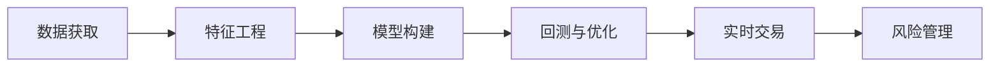

                 

# 如何将编程技能应用于量化交易

## 1. 背景介绍

量化交易(Qualitative Analysis)是一种基于数据驱动和算法交易的金融投资方式。它通过构建复杂的数学模型和算法策略，对金融市场的各类信号进行定量分析，以预测市场走势，并自动生成交易决策。量化交易由于其高效、精确、一致的特性，在华尔街和全球金融市场得到了广泛应用。

然而，量化交易的复杂性和深度，使得传统金融分析师难以胜任。大量数学、统计、计算机科学等领域的编程技能，成为量化交易的关键能力。本文将详细介绍如何运用编程技能，构建、优化、部署量化交易模型，提升金融投资的精准度和收益。

## 2. 核心概念与联系

### 2.1 核心概念概述

量化交易中涉及的关键概念包括：

- 数据获取与处理：获取并清洗金融市场的历史和实时数据，如股票价格、交易量、财务报表等。
- 特征工程：构建和选择影响资产价格的关键特征，如移动平均线、相对强弱指数(RSI)、MACD等。
- 模型构建：基于历史数据，构建数学模型和算法策略，如均值回归、随机游走、趋势跟踪等。
- 回测与优化：使用历史数据对模型进行回测，评估策略的预期收益和风险，并通过算法优化提升模型表现。
- 实时交易：将经过优化和测试的模型策略应用于实时市场，生成具体的交易信号和决策。
- 风险管理：实时监控交易过程，确保风险在可控范围内，并采用风险对冲策略降低风险。

这些概念之间的联系可以通过以下Mermaid流程图来展示：



## 3. 核心算法原理 & 具体操作步骤

### 3.1 算法原理概述

量化交易的核心算法原理基于时间序列分析、统计学习、机器学习等技术，以历史数据为基础，构建并优化数学模型和算法策略，实现对市场的预测和交易决策。以下是几个主要算法原理的简要概述：

- **时间序列分析**：利用时间序列模型（如ARIMA、GARCH等）对金融市场的历史价格和交易量等数据进行分析，预测未来的市场趋势。
- **统计学习**：基于历史数据，构建统计模型（如线性回归、Logistic回归等），识别影响资产价格的关键因素，并用于模型构建。
- **机器学习**：使用机器学习算法（如决策树、随机森林、神经网络等），处理复杂的数据关系，构建更加精准的预测模型。
- **强化学习**：通过与环境的交互，学习最优的交易策略，以最大化长期收益。

### 3.2 算法步骤详解

量化交易模型构建主要包含以下几个步骤：

**Step 1: 数据获取与预处理**
- 通过API接口或第三方数据服务获取金融市场的历史和实时数据。
- 对数据进行清洗、去重、填充缺失值等预处理操作。

**Step 2: 特征工程**
- 根据领域知识，选择影响资产价格的关键特征，如日交易量、月均交易量、移动平均线、RSI等。
- 使用数据处理技术，构建新的特征，如技术指标、波动率、成交量等。
- 特征选择：通过统计分析、机器学习等方法，选择最优的特征子集，以提升模型性能。

**Step 3: 模型构建**
- 基于历史数据，构建预测模型，如ARIMA、GARCH、随机森林、神经网络等。
- 选择适合的损失函数和优化算法，如均方误差、交叉熵、梯度下降等。
- 进行模型参数调优，如网格搜索、随机搜索等，以获取最优的模型参数组合。

**Step 4: 回测与优化**
- 使用历史数据对模型进行回测，评估模型的预期收益和风险。
- 根据回测结果，优化模型参数，提升模型性能。
- 使用算法优化技术，如正则化、早停等，防止过拟合。

**Step 5: 实时交易**
- 将优化后的模型应用于实时市场，生成具体的交易信号和决策。
- 实时监控交易过程，确保风险在可控范围内。
- 采用风险对冲策略，降低交易风险。

### 3.3 算法优缺点

量化交易算法具有以下优点：

1. 高效精确：量化交易算法可以高效处理大量数据，并精确计算各种复杂指标，提升投资决策的准确性。
2. 一致性：量化交易模型不受主观情绪影响，具有高度一致性和稳定性。
3. 客观性：量化交易基于数据和算法，减少了人为干预和主观偏差。

然而，量化交易算法也存在一些缺点：

1. 过度拟合：复杂的量化模型容易过拟合，导致在实盘中表现不佳。
2. 交易高频：高频交易策略可能带来较高的交易成本和滑点损失。
3. 模型失效：市场环境变化时，原有模型可能失效，需要频繁调整。
4. 算法复杂：复杂的量化模型需要较高的数学和编程能力，且开发周期较长。

### 3.4 算法应用领域

量化交易模型已经在股票、期货、外汇、加密货币等多个金融市场领域得到了广泛应用，具体包括：

1. 股票交易：基于技术指标、基本面分析等，构建股票选股策略。
2. 期货交易：使用统计模型、时间序列模型，预测期货价格走势。
3. 外汇交易：构建基于技术指标的外汇交易策略。
4. 加密货币交易：利用机器学习算法，识别加密货币价格波动的规律。

## 4. 数学模型和公式 & 详细讲解

### 4.1 数学模型构建

量化交易模型主要基于时间序列分析和统计学习理论。以下是几个常用的数学模型及其构建方法：

- **ARIMA模型**：自回归移动平均模型，用于时间序列分析。其数学表达式为：
  $$
  y_t = \alpha + \sum_{i=1}^p \phi_i y_{t-i} + \sum_{j=1}^q \theta_j \epsilon_{t-j} + \epsilon_t
  $$
  其中 $y_t$ 为时间序列数据，$\alpha$ 为截距项，$\phi_i$ 为自回归系数，$\theta_j$ 为移动平均系数，$\epsilon_t$ 为随机误差项。

- **GARCH模型**：广义自回归条件异方差模型，用于预测股票价格波动率。其数学表达式为：
  $$
  \sigma_t^2 = \omega + \alpha \epsilon_{t-1}^2 + \beta \sigma_{t-1}^2
  $$
  其中 $\sigma_t^2$ 为波动率，$\omega$ 为常数项，$\alpha$ 和 $\beta$ 为模型参数，$\epsilon_{t-1}$ 为前期残差。

- **随机森林模型**：基于决策树的集成算法，用于分类和回归任务。其数学表达式为：
  $$
  y = \sum_{i=1}^n w_i \hat{y}_i
  $$
  其中 $y$ 为预测结果，$w_i$ 为样本权重，$\hat{y}_i$ 为单个决策树预测结果。

### 4.2 公式推导过程

以下是几个常用量化交易模型的公式推导过程：

- **ARIMA模型**：时间序列自回归模型，其推导过程如下：
  $$
  y_t = \alpha + \sum_{i=1}^p \phi_i y_{t-i} + \epsilon_t
  $$
  其中 $\epsilon_t$ 服从均值为0，方差为$\sigma^2$ 的正态分布，即 $\epsilon_t \sim N(0,\sigma^2)$。

- **GARCH模型**：广义自回归条件异方差模型，其推导过程如下：
  $$
  \sigma_t^2 = \omega + \alpha \epsilon_{t-1}^2 + \beta \sigma_{t-1}^2
  $$
  其中 $\epsilon_t$ 服从均值为0，方差为$\sigma_t^2$ 的正态分布，即 $\epsilon_t \sim N(0,\sigma_t^2)$。

- **随机森林模型**：随机森林模型的推导过程如下：
  $$
  y = \sum_{i=1}^n w_i \hat{y}_i
  $$
  其中 $w_i$ 为样本权重，$\hat{y}_i$ 为单个决策树预测结果，通过加权平均得到最终的预测结果。

### 4.3 案例分析与讲解

以ARIMA模型为例，以下是该模型在股票价格预测中的应用案例：

假设某股票的历史价格数据为 $y = \{y_1, y_2, \dots, y_n\}$，使用ARIMA模型预测第 $n+1$ 天的股票价格 $y_{n+1}$。首先，需要进行数据预处理，包括差分、平稳性检验等。然后，构建ARIMA模型，使用最小二乘法估计模型参数。最后，将模型应用于新数据，进行预测。

## 5. 项目实践：代码实例和详细解释说明

### 5.1 开发环境搭建

在进行量化交易模型开发前，我们需要准备好开发环境。以下是使用Python进行PyTorch开发的环境配置流程：

1. 安装Anaconda：从官网下载并安装Anaconda，用于创建独立的Python环境。

2. 创建并激活虚拟环境：
```bash
conda create -n quant-env python=3.8 
conda activate quant-env
```

3. 安装PyTorch：根据CUDA版本，从官网获取对应的安装命令。例如：
```bash
conda install pytorch torchvision torchaudio cudatoolkit=11.1 -c pytorch -c conda-forge
```

4. 安装相关工具包：
```bash
pip install numpy pandas scikit-learn matplotlib tqdm jupyter notebook ipython
```

完成上述步骤后，即可在`quant-env`环境中开始量化交易模型的开发。

### 5.2 源代码详细实现

以下是一个基于PyTorch的ARIMA模型实现示例：

```python
import torch
import torch.nn as nn
import torch.optim as optim
from sklearn.metrics import mean_squared_error

class ARIMA(nn.Module):
    def __init__(self, p, d, q):
        super(ARIMA, self).__init__()
        self.p, self.d, self.q = p, d, q
        self.lstm = nn.LSTM(input_size=1, hidden_size=64, num_layers=2)
        self.fc = nn.Linear(in_features=64, out_features=1)

    def forward(self, x):
        x = nn.functional.flatten(x, 1)
        x, _ = self.lstm(x)
        x = self.fc(x)
        return x

def train_model(model, train_data, valid_data, epochs, batch_size, lr):
    model.train()
    criterion = nn.MSELoss()
    optimizer = optim.Adam(model.parameters(), lr=lr)
    train_loss = []
    valid_loss = []
    for epoch in range(epochs):
        train_loss.append(0)
        valid_loss.append(0)
        for batch_idx, (data, target) in enumerate(train_data):
            data = data.view(-1, 1)
            target = target.view(-1)
            optimizer.zero_grad()
            output = model(data)
            loss = criterion(output, target)
            loss.backward()
            optimizer.step()
            train_loss[epoch] += loss.item()
        for batch_idx, (data, target) in enumerate(valid_data):
            data = data.view(-1, 1)
            target = target.view(-1)
            output = model(data)
            loss = criterion(output, target)
            valid_loss[epoch] += loss.item()
    print(f'Train loss: {train_loss}, Valid loss: {valid_loss}')

def test_model(model, test_data):
    model.eval()
    criterion = nn.MSELoss()
    mse = []
    for batch_idx, (data, target) in enumerate(test_data):
        data = data.view(-1, 1)
        target = target.view(-1)
        output = model(data)
        mse.append(mean_squared_error(target, output))
    print(f'Mean Squared Error: {mse}')
```

### 5.3 代码解读与分析

让我们再详细解读一下关键代码的实现细节：

**ARIMA模型定义**：
- `__init__`方法：初始化ARIMA模型的超参数，包括p、d、q。
- `forward`方法：定义模型的前向传播过程，通过LSTM层进行时间序列预测。

**训练函数**：
- 定义训练数据、验证数据、学习率等参数。
- 使用MSE作为损失函数，Adam优化器进行模型训练。
- 记录每个epoch的训练和验证损失，输出训练结果。

**测试函数**：
- 使用测试数据对模型进行测试，计算MAE（Mean Absolute Error）作为模型性能的评价指标。
- 输出测试结果。

## 6. 实际应用场景

### 6.1 高频交易

高频交易策略通常涉及大量的高频数据，如每分钟的股票价格、成交量等。基于量化交易模型，可以实时处理和分析这些高频数据，生成高频交易策略。

以股票分钟线数据为例，可以使用ARIMA模型或随机森林模型，对历史分钟线价格进行预测，并根据预测结果生成买卖信号。实时监控交易过程，确保交易策略在低延迟下进行。

### 6.2 套利交易

量化交易还可以应用于套利策略，通过识别不同市场之间的价格差异，进行无风险套利。基于量化交易模型，可以构建多市场套利策略，实时监控市场价格变化，自动生成买卖信号，降低套利风险。

例如，可以使用GARCH模型，对不同市场的历史价格数据进行波动率预测，识别市场价格差异，实时生成套利策略。

### 6.3 算法交易

量化交易模型还可以应用于算法交易，通过构建复杂的算法策略，优化交易决策，提高投资回报率。

例如，可以使用深度学习模型，如LSTM、RNN等，对历史交易数据进行学习，构建多因子模型，优化交易策略。实时监控交易过程，确保交易策略在低延迟下进行。

## 7. 工具和资源推荐

### 7.1 学习资源推荐

为了帮助开发者系统掌握量化交易的理论基础和实践技巧，这里推荐一些优质的学习资源：

1. 《量化交易：基于统计学习与算法的方法》书籍：系统介绍量化交易的基本原理和常见算法，适合入门学习。
2. 量化交易课程：由QuantInsti、Coursera等平台提供的量化交易在线课程，涵盖从基础到高级的各类知识。
3. Kaggle量化交易竞赛：参与Kaggle等量化交易竞赛，实战演练，提升技能。

### 7.2 开发工具推荐

高效的开发离不开优秀的工具支持。以下是几款用于量化交易开发的常用工具：

1. Python：开源编程语言，灵活高效，适合开发量化交易模型。
2. PyTorch：基于Python的开源深度学习框架，适合构建复杂模型。
3. TensorFlow：由Google主导开发的开源深度学习框架，生产部署方便。
4. Weights & Biases：模型训练的实验跟踪工具，记录和可视化模型训练过程。
5. TensorBoard：TensorFlow配套的可视化工具，实时监测模型训练状态。

### 7.3 相关论文推荐

量化交易技术的发展源于学界的持续研究。以下是几篇奠基性的相关论文，推荐阅读：

1. Granger Causality and Error-Correction Models，Box and Jenkins：介绍时间序列分析和ARIMA模型。
2. The GARCH(1,1) Model：GARCH模型的经典论文，介绍广义自回归条件异方差模型。
3. Random Forest: Properties, Behaviour and Recommendations，Breiman：介绍随机森林模型及其应用。
4. High-Frequency Trading: A Computational Perspective，Glasserman和Warren：介绍高频交易策略和算法。
5. Algorithmic Trading: Strategies and Technologies，Amihud和Moore：介绍算法交易策略和技术。

通过对这些资源的学习实践，相信你一定能够快速掌握量化交易的精髓，并用于解决实际的投资问题。

## 8. 总结：未来发展趋势与挑战

### 8.1 总结

本文对量化交易中编程技能的应用进行了全面系统的介绍。首先阐述了量化交易的基本原理和核心概念，明确了编程技能在构建、优化、部署量化交易模型中的关键作用。其次，从算法原理到实际操作，详细讲解了量化交易模型的构建过程，给出了完整的代码实例。同时，本文还探讨了量化交易在多个金融市场领域的应用，展示了量化交易的广阔前景。最后，本文推荐了一些学习资源和开发工具，为读者提供了全方位的技术指引。

通过本文的系统梳理，可以看到，量化交易在金融市场中的应用，不仅能提升投资回报率，还能带来高度的自动化和一致性。编程技能在其中扮演了至关重要的角色，开发者通过不断实践和优化，可以实现更精准、高效、可靠的投资决策。未来，随着技术不断进步，量化交易必将拓展到更多领域，带来更多的创新和突破。

### 8.2 未来发展趋势

展望未来，量化交易将呈现以下几个发展趋势：

1. 技术融合：未来的量化交易将融合更多领域的先进技术，如机器学习、深度学习、强化学习等，提升模型的复杂度和性能。
2. 数据处理：随着数据量的增长和数据源的多样化，量化交易模型将更加注重数据预处理和特征工程，提升数据利用效率。
3. 算法优化：高频交易和实时交易等对算法的实时性和效率提出了更高的要求，量化交易模型将更加注重算法的优化和加速。
4. 风险管理：量化交易模型将更加注重风险管理和对冲策略，降低交易风险。
5. 智能决策：未来量化交易将更加注重模型的智能决策，通过机器学习、深度学习等技术，提升模型的预测能力和自动化水平。

以上趋势凸显了量化交易技术的广阔前景。这些方向的探索发展，必将进一步提升量化交易的精准度和收益，为金融投资带来更多的创新和突破。

### 8.3 面临的挑战

尽管量化交易技术已经取得了瞩目成就，但在迈向更加智能化、普适化应用的过程中，它仍面临着诸多挑战：

1. 数据质量：高质量金融数据获取困难，数据噪声和缺失问题普遍存在，数据处理难度大。
2. 模型复杂性：量化交易模型越来越复杂，模型训练和优化难度大，难以调试和维护。
3. 风险管理：量化交易模型面临高频交易和实时交易的风险，难以有效控制。
4. 算法鲁棒性：量化交易模型面临市场环境变化的风险，难以保持稳定。
5. 监管合规：量化交易模型面临监管合规要求，难以满足不同市场的合规需求。

### 8.4 研究展望

面对量化交易面临的挑战，未来的研究需要在以下几个方面寻求新的突破：

1. 数据质量提升：通过数据清洗、数据增强等技术，提高金融数据的质量。
2. 模型简化：开发更加简单、高效的模型架构，降低模型复杂度。
3. 风险管理优化：引入更多风险管理策略，如动态对冲、风险预警等。
4. 算法鲁棒性提升：通过增强学习、对抗训练等技术，提升算法的鲁棒性。
5. 合规性设计：引入合规性设计，确保模型符合监管要求。

这些研究方向的探索，必将引领量化交易技术迈向更高的台阶，为金融投资带来更多的创新和突破。唯有勇于创新、敢于突破，才能不断拓展量化交易的边界，让量化交易技术更好地服务金融市场。

## 9. 附录：常见问题与解答

**Q1：量化交易是否适用于所有投资者？**

A: 量化交易模型在市场变化频繁、波动较大的情况下表现较好，但当市场基本面变化较大时，模型可能失效。量化交易不适用于对基本面分析有高度依赖的投资者，建议同时使用基本面分析和量化交易相结合的方式。

**Q2：量化交易是否会带来高频交易成本？**

A: 高频交易策略通常涉及大量高频数据，带来高频交易成本和滑点损失。建议结合实时监控和交易决策，确保高频交易策略在低延迟下进行，以降低交易成本。

**Q3：量化交易模型如何优化参数？**

A: 量化交易模型通常使用网格搜索、随机搜索等方法进行参数优化。通过历史数据回测和性能评估，选择最优的模型参数组合。同时，可以使用正则化、早停等技术，防止过拟合。

**Q4：量化交易模型如何处理异常数据？**

A: 量化交易模型通常使用异常值检测和处理技术，如数据清洗、异常值剔除、插值等。确保模型在异常数据下仍能稳定运行。

**Q5：量化交易模型如何应对市场变化？**

A: 量化交易模型通常使用动态对冲、风险预警等策略，确保在市场变化时仍能稳定运行。建议定期更新模型参数，结合市场变化进行模型优化。

---

作者：禅与计算机程序设计艺术 / Zen and the Art of Computer Programming

