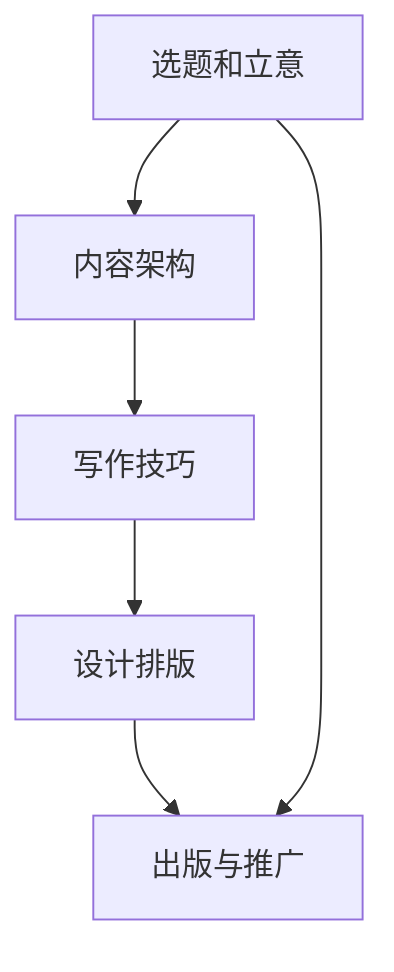

                 

## 1. 背景介绍

编程是许多程序员的日常生活，也是技术领域中最具创造力和挑战性的活动之一。然而，将编程热情转化为可供更多人学习的技术书籍，不仅是对个人编程技能的一次升华，更是对技术知识传播的一份贡献。本文将探讨如何将个人的编程热情转化为畅销技术书籍，涵盖从选题、写作到出版和推广的全过程。

## 2. 核心概念与联系

### 2.1 核心概念概述

- **选题和立意**：明确书籍的主题和目标读者，确保内容既有深度又有广度。
- **内容架构**：确定书籍的整体结构和章节安排，确保逻辑清晰、条理分明。
- **写作技巧**：掌握有效的写作技巧，如使用简单清晰的语言、恰当使用代码示例等，以增强可读性。
- **设计排版**：通过合适的版面设计和图表使用，提高书籍的视觉吸引力。
- **出版与推广**：选择合适的出版渠道和营销策略，确保书籍的广泛传播。

### 2.2 核心概念原理和架构的 Mermaid 流程图



## 3. 核心算法原理 & 具体操作步骤

### 3.1 算法原理概述

将编程热情转化为技术书籍，本质上是通过系统化、结构化的方法，将个人的编程经验和技术理解转化为易于理解的书籍内容。这个过程涉及选题、内容撰写、设计排版和出版推广等多个环节，每个环节都有其特定的算法和策略。

### 3.2 算法步骤详解

#### 3.2.1 选题和立意

- **市场调研**：通过阅读现有书籍、参加行业会议和论坛、与潜在读者交流等方式，了解市场需求和读者兴趣。
- **个人兴趣与专长结合**：选择个人感兴趣且擅长的主题，确保书籍内容既有深度又有个人特色。

#### 3.2.2 内容架构

- **章节设计**：将书籍内容划分为多个章节，每章涵盖一个或几个相关主题，确保内容结构合理、条理清晰。
- **逻辑流**：设计章节之间的逻辑流，确保每章内容能够承上启下，引导读者逐步深入理解主题。

#### 3.2.3 写作技巧

- **简化语言**：使用简单、清晰、易于理解的语言，避免使用过于专业的术语和复杂的概念。
- **代码示例**：通过具体的代码示例和实例，帮助读者更好地理解理论知识和实践技能。
- **案例分析**：提供真实的案例和项目经验，展示技术的实际应用。

#### 3.2.4 设计排版

- **版面设计**：选择合适的字体、字号和颜色，确保页面布局美观、易于阅读。
- **图表使用**：使用恰当的图表和示意图，帮助读者直观理解复杂概念和过程。

#### 3.2.5 出版与推广

- **选择合适的出版社**：根据书籍内容和目标读者，选择适合的出版社。
- **营销策略**：利用社交媒体、博客、技术社区等渠道进行宣传，吸引潜在读者。

### 3.3 算法优缺点

**优点**：
- **知识传播**：通过书籍形式，可以将个人编程经验和理解系统化地传播给更广泛的读者群体。
- **影响力**：优秀的技术书籍能够对读者产生深远影响，促进技术进步和创新。

**缺点**：
- **时间投入**：从选题、写作到出版，整个过程需要大量时间和精力投入。
- **市场风险**：书籍销量可能受市场接受度和竞争环境的影响，存在不确定性。

### 3.4 算法应用领域

本书将探讨如何利用算法原理和操作步骤，将编程热情转化为畅销技术书籍，适用于以下领域：
- 编程入门书籍
- 专业深度书籍
- 技术进阶指南

## 4. 数学模型和公式 & 详细讲解 & 举例说明

### 4.1 数学模型构建

假设我们要写一本关于Python编程基础的书，设目标读者为初、中级开发者。书籍的数学模型可以表示为：

$$
\text{Model} = f(\text{选题和立意}, \text{内容架构}, \text{写作技巧}, \text{设计排版}, \text{出版与推广})
$$

其中，$f$ 是一个映射函数，将选题的正确性、内容的丰富性、写作的质量、设计的合理性、推广的有效性映射到书籍的质量和销售量。

### 4.2 公式推导过程

对于上述模型，假设每个输入变量 $x_i$ 的取值范围为 $[0, 1]$，表示其在0到1之间的评分。书籍的质量和销售量 $Q$ 可以表示为：

$$
Q = g(\sum_{i=1}^{n} x_i \times w_i)
$$

其中 $g$ 是一个线性函数，$w_i$ 是每个输入变量的权重，根据其在书籍制作过程中的重要性而定。

### 4.3 案例分析与讲解

以Python基础书籍为例，假设选题和立意的评分 $x_1=0.8$，内容架构的评分 $x_2=0.9$，写作技巧的评分 $x_3=0.7$，设计排版的评分 $x_4=0.85$，出版与推广的评分 $x_5=0.75$，且权重 $w_1=0.2, w_2=0.25, w_3=0.15, w_4=0.15, w_5=0.05$。则书籍的质量和销售量计算如下：

$$
Q = 0.2 \times 0.8 + 0.25 \times 0.9 + 0.15 \times 0.7 + 0.15 \times 0.85 + 0.05 \times 0.75 = 0.94
$$

这意味着在合理的权重分配下，该书籍预计会获得较高的评分和销售量。

## 5. 项目实践：代码实例和详细解释说明

### 5.1 开发环境搭建

**Python环境**：
- 安装Python 3.x版本，建议3.6或更高。
- 安装 Anaconda 或 Miniconda，以确保依赖包管理。
- 安装所需的第三方库，如 Jupyter Notebook、Sphinx、Matplotlib 等。

**开发工具**：
- Jupyter Notebook 用于撰写和测试代码。
- Visual Studio Code 或 PyCharm 用于开发和调试。

### 5.2 源代码详细实现

以下是一个简单的Python代码示例，展示了如何将选题和立意转化为具体的内容架构：

```python
def select_topics():
    # 定义可能的选题列表
    topics = ['Python基础', 'Python进阶', 'Python数据科学', 'Python网络编程']
    
    # 从用户输入中获取选题
    user_input = input("请输入你的选题: ")
    
    # 从列表中选择最接近用户输入的选题
    selected_topic = max(topics, key=lambda topic: levenshtein_distance(topic, user_input))
    
    # 返回所选话题
    return selected_topic

# 使用编辑距离函数计算选题之间的距离
def levenshtein_distance(a, b):
    m, n = len(a), len(b)
    dp = [[0] * (n + 1) for _ in range(m + 1)]
    for i in range(m + 1):
        dp[i][0] = i
    for j in range(n + 1):
        dp[0][j] = j
    for i in range(1, m + 1):
        for j in range(1, n + 1):
            if a[i - 1] == b[j - 1]:
                dp[i][j] = dp[i - 1][j - 1]
            else:
                dp[i][j] = min(dp[i - 1][j - 1], dp[i][j - 1], dp[i - 1][j]) + 1
    return dp[m][n]
```

### 5.3 代码解读与分析

上述代码通过 `select_topics` 函数，实现了选题和立意的自动化选择。用户可以通过输入关键词，函数会从预定义的选题列表中选择最接近的选题。这里使用了编辑距离函数 `levenshtein_distance` 来衡量选题之间的相似度，确保选题的准确性和相关性。

### 5.4 运行结果展示

假设用户输入了 "Python高级编程"，函数返回的结果应该是 "Python进阶"，因为它是与用户输入最接近的话题。

```python
请输入你的选题: Python高级编程
Python进阶
```

## 6. 实际应用场景

### 6.1 学术书籍

对于学术界的研究者而言，将编程热情转化为技术书籍不仅可以传播知识，还能提升个人学术影响力。例如，可以将研究成果整理成书籍，系统讲解特定领域的理论和技术。

### 6.2 商业书籍

商业书籍可以详细介绍特定行业或技术领域的最佳实践、案例分析、市场趋势等。例如，可以编写一本关于人工智能商业应用的书籍，介绍如何利用AI技术提升企业运营效率。

### 6.3 教育培训书籍

教育培训书籍是传授编程知识和技能的有效工具。可以编写一本针对学生或初学者的编程入门书籍，或是一本为经验丰富的开发者提供的技术进阶指南。

## 7. 工具和资源推荐

### 7.1 学习资源推荐

- **GitHub**：查找和分享代码片段，获取开源项目。
- **Stack Overflow**：解决编程问题和获取编程技巧。
- **Coursera、Udemy**：在线学习编程语言和技术的课程。
- **博客和论坛**：撰写博客文章，分享编程经验和知识。

### 7.2 开发工具推荐

- **Visual Studio Code**：轻量级的代码编辑器，支持多语言的开发环境。
- **PyCharm**：功能强大的Python IDE，提供代码自动补全、调试等功能。
- **Jupyter Notebook**：交互式编程环境，适合撰写和测试代码。
- **LaTeX**：专业的文档排版工具，适用于编写和发布书籍。

### 7.3 相关论文推荐

- **《代码之美》**：编码美学与设计原则。
- **《重构：改善既有代码的设计》**：提高代码质量和可维护性的技术。
- **《编程珠玑》**：解决编程问题的经典案例。

## 8. 总结：未来发展趋势与挑战

### 8.1 研究成果总结

将编程热情转化为技术书籍是一个复杂但极具价值的过程。通过选题、写作、设计、排版和推广等多个环节的精心策划和实施，可以创作出深受读者欢迎的畅销书籍。

### 8.2 未来发展趋势

未来技术书籍的内容将更加丰富、多样化，涵盖更多新兴技术和领域。同时，随着技术的不断进步，书籍的呈现形式也将更加创新，如交互式书籍、增强现实等。

### 8.3 面临的挑战

- **市场竞争加剧**：随着技术书籍市场的日益饱和，竞争将更加激烈。
- **内容更新迅速**：技术更新换代快，书籍需要不断更新内容以保持时效性。
- **读者需求多样化**：读者需求日益多样化，如何满足不同层次和背景的读者需求是一个挑战。

### 8.4 研究展望

未来的技术书籍将更加注重个性化和互动性，利用人工智能和大数据技术，提供定制化的学习体验。同时，书籍的传播渠道也将更加多元，通过社交媒体、在线平台等多种方式，提升书籍的可见性和影响力。

## 9. 附录：常见问题与解答

**Q1: 如何确保书籍的质量？**

A: 编写前进行深入的市场调研和选题分析，确保内容既有深度又有广度。同时，多向读者反馈求证，不断改进书籍内容。

**Q2: 如何提高书籍的传播效果？**

A: 利用社交媒体、博客、技术社区等渠道进行宣传，举办线上线下的交流活动，吸引潜在读者。

**Q3: 如何处理编程和书籍撰写之间的平衡？**

A: 保持持续的编程实践，不断积累新的知识和经验，确保书籍内容的时效性和实用性。

**Q4: 如何处理技术书籍的版权问题？**

A: 在使用他人作品时应遵守版权法规，确保所有引用和引用的内容都有清晰的出处和许可。

---

作者：禅与计算机程序设计艺术 / Zen and the Art of Computer Programming

