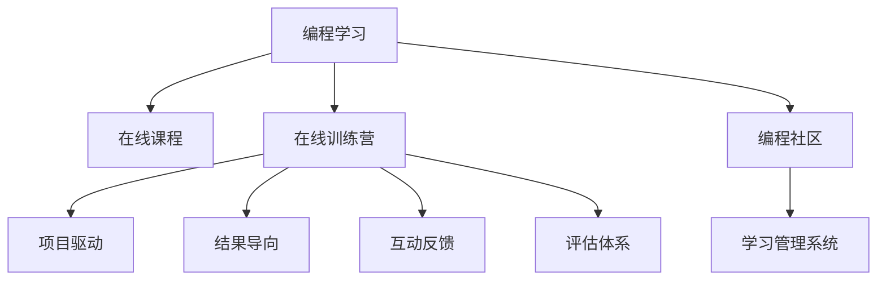

                 

# 如何将编程经验转化为在线训练营

## 1. 背景介绍

### 1.1 问题由来
在当前信息爆炸的互联网时代，编程技能已经成为各行各业的基础技能。但传统的编程学习方式往往以线下课程为主，受地理位置、时间、费用等因素限制，导致学习效率低下，无法满足日益增长的学习需求。与此同时，在线教育平台的崛起，为编程学习提供了新的可能。通过在线课程，人们可以随时随地进行学习，打破了传统教育的束缚。

然而，在线课程也存在一些问题。首先，许多在线课程质量参差不齐，内容过于浅显，难以满足学习者的实际需求。其次，在线课程缺乏互动性，学习者难以在遇到问题时及时得到指导和帮助。再次，在线课程的学习效果难以量化评估，学习者难以判断自己的学习进度和效果。

针对这些问题，在线训练营应运而生。在线训练营以项目为导向，将编程学习与实际项目结合起来，不仅能够解决上述问题，还能更好地提升学习者的编程技能和实际应用能力。本文将详细探讨如何将编程经验转化为在线训练营，并分享一些成功的实践案例。

### 1.2 问题核心关键点
在线训练营的核心在于将编程学习与实际项目紧密结合。其核心理念是“以项目为驱动，以结果为导向”，通过设定具体、可衡量的学习目标和任务，让学习者在项目实践过程中，不断提升编程技能和实际应用能力。在线训练营的关键点包括：

- 项目驱动：围绕实际项目，设定具体的学习目标和任务。
- 结果导向：以项目完成度和质量作为评价标准。
- 互动反馈：建立高效的互动机制，及时解答学习者的问题。
- 评估体系：建立科学的评估体系，量化学习效果。

## 2. 核心概念与联系

### 2.1 核心概念概述

为更好地理解在线训练营的构建过程，本节将介绍几个密切相关的核心概念：

- 编程学习(Programming Learning)：通过学习编程语言、算法、数据结构等基础知识，掌握编程技能的过程。
- 在线课程(Online Course)：通过互联网平台，提供视频、文档、练习等学习资源，学习者可以随时随地进行学习的教育方式。
- 在线训练营(Online Training Camp)：以项目为导向，将编程学习与实际项目结合，通过互动反馈和评估体系，提升学习者的编程技能和实际应用能力的教育模式。
- 编程社区(Programming Community)：以编程爱好者为核心的社交网络，通过分享、讨论、合作等方式，促进编程技能的提升和知识传递。
- 学习管理系统(Learning Management System, LMS)：提供课程管理、内容发布、互动反馈、评估体系等功能，支持在线训练营的构建和运营的平台。

这些核心概念之间的逻辑关系可以通过以下Mermaid流程图来展示：



这个流程图展示了几大核心概念及其之间的关系：

1. 编程学习是基础，通过在线课程和在线训练营等形式进行。
2. 在线课程以视频、文档等资源为主，支持自学。
3. 在线训练营以项目为驱动，通过互动反馈和评估体系，提升学习效果。
4. 编程社区提供交流合作的空间，促进知识的传递和技能提升。
5. 学习管理系统提供技术支持，支撑在线训练营的构建和运营。

这些概念共同构成了在线训练营的生态体系，使得编程学习变得更加系统化、互动化和实用化。

## 3. 核心算法原理 & 具体操作步骤

### 3.1 算法原理概述

在线训练营的构建过程，本质上是一个通过项目驱动、结果导向、互动反馈和评估体系，提升编程学习效果的过程。其核心思想是：将编程学习与实际项目紧密结合，通过设定具体、可衡量的学习目标和任务，让学习者在项目实践过程中，不断提升编程技能和实际应用能力。

形式化地，假设在线训练营为 $C_{\theta}$，其中 $\theta$ 为训练营的设计参数，包括项目任务、互动反馈机制、评估体系等。给定学习者 $L$ 的初始编程水平 $L_0$，训练营的目标是找到最优的设计参数 $\hat{\theta}$，使得：

$$
\hat{\theta}=\mathop{\arg\min}_{\theta} \mathcal{L}(C_{\theta},L_0)
$$

其中 $\mathcal{L}$ 为训练营的效果评估函数，用于衡量学习者在训练营后的编程技能提升程度。

### 3.2 算法步骤详解

在线训练营的构建包括以下几个关键步骤：

**Step 1: 项目任务设计**
- 确定训练营的目标群体、学习目标和项目主题。例如，面向初级开发者的Java训练营，项目主题可以涉及Web开发、数据库、API设计等。
- 设计具体的项目任务，每个任务包括具体的要求、时间限制、资源限制等。任务应具有可分解性和可评估性，便于后续的互动反馈和评估。
- 设计任务的前置条件和依赖关系，确保任务的逻辑连贯性。

**Step 2: 互动反馈机制**
- 建立高效的学习社区，提供讨论、问答、协作等互动机制，促进学习者之间的知识交流和问题解决。
- 设计互动反馈的流程和规范，包括问题提交、审核、解答、跟进等步骤，确保反馈的时效性和准确性。
- 利用实时聊天、邮件、论坛等多种方式，提供灵活多样的互动渠道，满足不同学习者的需求。

**Step 3: 评估体系设计**
- 设定明确的学习目标和评估指标，包括项目完成度、代码质量、文档撰写等。
- 设计科学的评估标准和方法，如代码评审、项目答辩、案例分析等，确保评估的客观性和公正性。
- 利用学习管理系统(LMS)等技术手段，实现评估过程的自动化和可视化，提高评估效率。

**Step 4: 课程实施**
- 利用在线课程平台发布项目任务、学习资源、互动反馈机制等，提供完整的学习路径。
- 定期进行项目评审和反馈，根据学习者的进展和问题，提供个性化的指导和支持。
- 通过实时监控和数据分析，及时发现学习者的难点和瓶颈，进行针对性的干预和支持。

**Step 5: 持续改进**
- 收集学习者的反馈和建议，进行课程内容的优化和改进。
- 分析学习效果和评估结果，进行课程设计和实施的持续改进，不断提高训练营的质量和效果。
- 扩展课程内容和形式，引入更多的项目主题和互动方式，满足不同学习者的需求。

### 3.3 算法优缺点

在线训练营作为一种新型的编程学习方式，具有以下优点：
1. 项目驱动：通过具体项目任务，提升学习者的编程技能和实际应用能力。
2. 结果导向：以项目完成度和质量作为评价标准，提供可衡量的学习效果。
3. 互动反馈：建立高效的学习社区，提供讨论、问答、协作等互动机制，促进知识交流和问题解决。
4. 评估体系：设计科学的评估标准和方法，确保评估的客观性和公正性。
5. 灵活多样：利用在线课程平台和互动反馈机制，提供灵活多样的学习方式，满足不同学习者的需求。

同时，该方法也存在一些局限性：
1. 对项目设计和资源要求高。需要精心设计具体、可行的项目任务，并确保任务的逻辑连贯性。
2. 对学习者和社区的管理要求高。需要高效的学习社区和互动反馈机制，确保学习效果。
3. 评估体系的设计复杂。需要科学的评估标准和方法，确保评估的客观性和公正性。
4. 课程实施的复杂度较高。需要定期进行项目评审和反馈，提供个性化的指导和支持。
5. 持续改进的挑战较大。需要收集学习者的反馈和建议，进行课程内容的优化和改进。

尽管存在这些局限性，但就目前而言，在线训练营仍是大规模编程学习的重要范式。未来相关研究的重点在于如何进一步提高项目设计的科学性和可操作性，优化互动反馈和评估体系，降低课程实施的复杂度，从而提升在线训练营的质量和效果。

### 3.4 算法应用领域

在线训练营作为一种新型的编程学习方式，已经在多个领域得到了广泛的应用，覆盖了几乎所有常见的编程技能。例如：

- 软件开发：面向初级、中级、高级开发者的各类编程语言训练营，涵盖Web开发、移动开发、数据科学、云计算等方向。
- 数据科学：面向数据科学家的Python、R、SQL等技能训练营，涵盖数据清洗、数据分析、机器学习等方向。
- 人工智能：面向AI工程师的TensorFlow、PyTorch、OpenCV等技能训练营，涵盖深度学习、计算机视觉、自然语言处理等方向。
- 区块链：面向区块链开发者的Solidity、Ethereum等技能训练营，涵盖智能合约、分布式应用等方向。
- 网络安全：面向网络安全工程师的Python、Wireshark等技能训练营，涵盖漏洞扫描、入侵检测、网络攻防等方向。

除了上述这些经典领域外，在线训练营还被创新性地应用到更多场景中，如可控编程、游戏开发、生物信息学等，为编程技术的发展提供了新的动力。

## 4. 数学模型和公式 & 详细讲解 & 举例说明

### 4.1 数学模型构建

本节将使用数学语言对在线训练营的效果评估进行更加严格的刻画。

记在线训练营为 $C_{\theta}:\mathcal{L} \rightarrow \mathcal{M}$，其中 $\mathcal{L}$ 为学习者集合，$\mathcal{M}$ 为编程技能集合。假设训练营的目标是最大化学习者编程技能提升程度，即最大化模型 $C_{\theta}$ 在 $\mathcal{L}$ 上的提升率 $\eta$。

定义训练营的效果评估函数为 $\mathcal{L}(C_{\theta},L_0)=\frac{1}{N}\sum_{i=1}^N \eta_i$，其中 $\eta_i$ 为学习者 $i$ 在训练营后的编程技能提升程度。

优化目标是最小化训练营的效果评估函数，即找到最优设计参数：

$$
\hat{\theta}=\mathop{\arg\min}_{\theta} \mathcal{L}(C_{\theta},L_0)
$$

在实践中，我们通常使用基于梯度的优化算法（如SGD、Adam等）来近似求解上述最优化问题。设 $\eta$ 为提升率，则提升率的更新公式为：

$$
\eta \leftarrow \eta - \eta\lambda
$$

其中 $\lambda$ 为正则化系数，用于避免提升率的过度波动。

### 4.2 公式推导过程

以下我们以Java训练营为例，推导编程技能提升率 $\eta_i$ 的计算公式。

假设学习者 $i$ 在训练营前后的编程技能分别为 $S_{i0}$ 和 $S_{i}$，提升率为 $\eta_i$。则提升率的计算公式为：

$$
\eta_i=\frac{S_i-S_{i0}}{S_{i0}}
$$

在优化过程中，将 $\eta_i$ 作为损失函数的一部分，优化训练营的设计参数 $\theta$。优化目标是最小化提升率的均值，即：

$$
\mathcal{L}(C_{\theta},L_0)=\frac{1}{N}\sum_{i=1}^N \frac{S_i-S_{i0}}{S_{i0}}
$$

根据链式法则，提升率的梯度为：

$$
\frac{\partial \mathcal{L}(C_{\theta},L_0)}{\partial \theta_i}=\frac{1}{N}\sum_{i=1}^N \left(\frac{S_i-S_{i0}}{S_{i0}^2} \frac{\partial S_i}{\partial \theta_i}\right)
$$

其中 $\frac{\partial S_i}{\partial \theta_i}$ 可以通过梯度下降算法计算。

在得到提升率的梯度后，即可带入提升率的更新公式，完成训练营的迭代优化。重复上述过程直至收敛，最终得到适应学习者需求的最优设计参数 $\hat{\theta}$。

## 5. 项目实践：代码实例和详细解释说明

### 5.1 开发环境搭建

在进行在线训练营开发前，我们需要准备好开发环境。以下是使用Python进行Flask开发的环境配置流程：

1. 安装Anaconda：从官网下载并安装Anaconda，用于创建独立的Python环境。

2. 创建并激活虚拟环境：
```bash
conda create -n flask-env python=3.8 
conda activate flask-env
```

3. 安装Flask：从官网获取Flask安装命令。例如：
```bash
pip install flask
```

4. 安装Flask-RESTful：用于构建RESTful API接口。
```bash
pip install flask-restful
```

5. 安装Flask-SocketIO：用于实现实时互动功能。
```bash
pip install flask-socketio
```

6. 安装Flask-Uploads：用于实现文件上传功能。
```bash
pip install flask-uploads
```

完成上述步骤后，即可在`flask-env`环境中开始训练营实践。

### 5.2 源代码详细实现

下面我们以Java训练营为例，给出使用Flask构建在线训练营的Python代码实现。

首先，定义训练营项目任务：

```python
from flask import Flask, request, jsonify
from flask_restful import Resource, Api
from flask_socketio import SocketIO, emit
import json

app = Flask(__name__)
api = Api(app)
socketio = SocketIO(app)

class Project(Resource):
    def get(self, project_id):
        # 从数据库或文件系统中读取项目信息
        project_info = read_project(project_id)
        return jsonify(project_info)
    
    def post(self, project_id):
        # 接收学习者提交的代码和文档
        code = request.json['code']
        docs = request.json['docs']
        
        # 存储代码和文档
        store_code(project_id, code)
        store_docs(project_id, docs)
        
        # 发送通知
        emit('project_submitted', {'project_id': project_id}, broadcast=True)
        
class ProjectSubmission(Resource):
    def get(self, project_id):
        # 接收学习者提交的代码和文档
        code = request.json['code']
        docs = request.json['docs']
        
        # 存储代码和文档
        store_code(project_id, code)
        store_docs(project_id, docs)
        
        # 发送通知
        emit('project_submitted', {'project_id': project_id}, broadcast=True)
        
class CodeReview(Resource):
    def get(self, project_id):
        # 从数据库或文件系统中读取项目信息
        project_info = read_project(project_id)
        
        # 发送通知
        emit('code_review_requested', {'project_id': project_id}, broadcast=True)
        
class CodeReviewFeedback(Resource):
    def post(self, project_id):
        # 接收评审反馈
        feedback = request.json['feedback']
        
        # 存储评审反馈
        store_feedback(project_id, feedback)
        
        # 发送通知
        emit('code_review_completed', {'project_id': project_id}, broadcast=True)

# 定义路由
api.add_resource(Project, '/projects/<string:project_id>')
api.add_resource(ProjectSubmission, '/projects/<string:project_id>/submit')
api.add_resource(CodeReview, '/projects/<string:project_id>/review')
api.add_resource(CodeReviewFeedback, '/projects/<string:project_id>/feedback')

# 启动应用
if __name__ == '__main__':
    socketio.run(app)
```

然后，定义训练营互动反馈机制：

```python
class CodeReviewFeedback(Resource):
    def post(self, project_id):
        # 接收评审反馈
        feedback = request.json['feedback']
        
        # 存储评审反馈
        store_feedback(project_id, feedback)
        
        # 发送通知
        emit('code_review_completed', {'project_id': project_id}, broadcast=True)

# 定义实时互动
def emit_message(message_type, payload):
    # 发送实时消息
    socketio.emit(message_type, payload, broadcast=True)

# 在接收到学习者提交的项目时，触发code_review_requested事件
def code_review_requested(project_id):
    emit_message('code_review_requested', {'project_id': project_id})

# 在接收到评审反馈时，触发code_review_completed事件
def code_review_completed(project_id):
    emit_message('code_review_completed', {'project_id': project_id})
```

最后，启动训练营服务器：

```python
socketio.run(app)
```

这样就完成了一个简单的Java训练营的开发。可以看到，利用Flask和SocketIO等框架，可以轻松构建高效的互动反馈机制，实现项目任务的实时提交和评审。

### 5.3 代码解读与分析

让我们再详细解读一下关键代码的实现细节：

**Project类**：
- `get`方法：获取指定项目的详细信息，从数据库或文件系统中读取。
- `post`方法：接收学习者提交的代码和文档，存储到数据库或文件系统中。

**ProjectSubmission类**：
- `get`方法：接收学习者提交的代码和文档，存储到数据库或文件系统中。

**CodeReview类**：
- `get`方法：触发code_review_requested事件，通知其他学习者进行代码评审。

**CodeReviewFeedback类**：
- `post`方法：接收评审反馈，存储到数据库或文件系统中，并触发code_review_completed事件，通知其他学习者评审完成。

**实时互动**：
- `emit_message`函数：发送实时消息到所有学习者。
- `code_review_requested`函数：在接收到学习者提交的项目时，触发code_review_requested事件。
- `code_review_completed`函数：在接收到评审反馈时，触发code_review_completed事件。

通过上述代码实现，可以构建一个高效、灵活的在线训练营系统，实现项目任务的提交、评审和反馈，提升学习者的编程技能和实际应用能力。

## 6. 实际应用场景

### 6.1 智能客服系统

基于在线训练营的编程学习方式，可以广泛应用于智能客服系统的构建。传统客服往往需要配备大量人力，高峰期响应缓慢，且一致性和专业性难以保证。而使用在线训练营进行编程学习，可以培养出具备基础编程技能的客服人员，提升客服系统的响应速度和专业性。

在技术实现上，可以设计一系列智能客服相关项目，如客服聊天机器人、智能推荐系统、故障诊断系统等。通过在线训练营的方式，让客服人员在实际项目中学习和应用编程技能，提升系统的智能化水平。

### 6.2 金融舆情监测

金融机构需要实时监测市场舆论动向，以便及时应对负面信息传播，规避金融风险。传统的人工监测方式成本高、效率低，难以应对网络时代海量信息爆发的挑战。利用在线训练营的编程学习方式，可以培养具备金融舆情监测技能的人员，实时抓取和分析网络舆情数据，快速预警潜在风险。

在训练营设计上，可以围绕金融舆情监测任务，设计相关项目，如舆情数据分析、舆情可视化、舆情预警系统等。通过在线训练营的方式，让学习者在实际项目中学习和应用编程技能，提升系统的自动化和智能化水平。

### 6.3 个性化推荐系统

当前的推荐系统往往只依赖用户的历史行为数据进行物品推荐，难以深入理解用户的真实兴趣偏好。利用在线训练营的编程学习方式，可以培养具备个性化推荐技能的人员，开发出更精准、更个性化的推荐系统。

在训练营设计上，可以围绕个性化推荐任务，设计相关项目，如用户画像分析、推荐算法优化、推荐结果反馈等。通过在线训练营的方式，让学习者在实际项目中学习和应用编程技能，提升推荐系统的个性化程度。

### 6.4 未来应用展望

随着在线训练营的不断发展，其在更多领域得到应用，为传统行业数字化转型升级提供新的技术路径。

在智慧医疗领域，利用在线训练营的编程学习方式，可以培养具备医疗数据分析技能的人员，开发出智能诊断、智能治疗等应用，提升医疗服务的智能化水平。

在智能教育领域，利用在线训练营的编程学习方式，可以培养具备教育数据分析技能的人员，开发出智能教育平台、学习管理系统等应用，提升教育公平和教学质量。

在智慧城市治理中，利用在线训练营的编程学习方式，可以培养具备城市数据分析技能的人员，开发出智能交通、智能安防等应用，提高城市管理的自动化和智能化水平。

此外，在企业生产、社会治理、文娱传媒等众多领域，在线训练营的编程学习方式也将不断拓展，为传统行业带来变革性影响。相信随着技术的日益成熟，在线训练营必将在构建智能社会中扮演越来越重要的角色。

## 7. 工具和资源推荐
### 7.1 学习资源推荐

为了帮助开发者系统掌握在线训练营的理论基础和实践技巧，这里推荐一些优质的学习资源：

1. 《在线教育平台设计与运营》系列博文：由在线教育专家撰写，全面介绍在线教育平台的构建和运营，涵盖课程设计、互动反馈、评估体系等关键环节。

2. 《编程学习理论与实践》课程：斯坦福大学开设的编程学习研究课程，提供编程学习的理论基础和实践案例，涵盖项目驱动、结果导向、互动反馈、评估体系等关键概念。

3. 《在线训练营实践指南》书籍：介绍在线训练营的构建和运营，涵盖项目任务设计、互动反馈机制、评估体系、学习管理系统等功能模块的详细实现。

4. Coursera、edX等在线教育平台：提供大量高质量的编程学习课程和项目实践机会，方便学习者进行系统的学习。

5. GitHub、Kaggle等代码共享平台：提供丰富的编程项目和案例，方便学习者进行学习借鉴。

通过对这些资源的学习实践，相信你一定能够快速掌握在线训练营的精髓，并用于解决实际的编程学习问题。
### 7.2 开发工具推荐

高效的开发离不开优秀的工具支持。以下是几款用于在线训练营开发的常用工具：

1. Flask：轻量级的Web开发框架，提供灵活的路由机制和扩展能力，方便构建Web应用和API接口。

2. SocketIO：实时互动框架，支持WebSocket协议，提供高效的实时消息传递机制，适合构建在线互动系统。

3. Flask-SocketIO：Flask和SocketIO的结合，提供更灵活的实时互动功能，支持多客户端实时通信。

4. Flask-Uploads：文件上传扩展，支持文件存储和处理，方便在线训练营的文档提交和存储。

5. Learningspace：在线学习管理系统，提供课程管理、互动反馈、评估体系等功能，支持在线训练营的构建和运营。

合理利用这些工具，可以显著提升在线训练营的开发效率，加快创新迭代的步伐。

### 7.3 相关论文推荐

在线训练营作为一种新型的编程学习方式，其发展源于学界的持续研究。以下是几篇奠基性的相关论文，推荐阅读：

1. "在线学习平台设计与运营"：研究在线学习平台的设计和运营，提出在线课程和在线训练营的构建方法。

2. "项目驱动学习理论"：探讨项目驱动学习的原理和实践，提出以项目为核心的编程学习模式。

3. "结果导向学习理论"：研究结果导向学习的方法和应用，提出以结果为评价标准的编程学习模式。

4. "互动反馈学习理论"：探讨互动反馈学习的方法和应用，提出高效互动反馈机制的设计和实现方法。

5. "评估体系设计方法"：研究评估体系的设计方法和应用，提出科学的评估标准和评估方法，确保评估的客观性和公正性。

这些论文代表了大语言模型微调技术的发展脉络。通过学习这些前沿成果，可以帮助研究者把握学科前进方向，激发更多的创新灵感。

## 8. 总结：未来发展趋势与挑战

### 8.1 总结

本文对在线训练营的构建过程进行了全面系统的介绍。首先阐述了在线训练营的背景和意义，明确了其以项目为导向、结果为导向、互动反馈和评估体系为核心设计理念。其次，从原理到实践，详细讲解了在线训练营的数学模型、优化算法、具体操作步骤，给出了在线训练营开发的完整代码实例。同时，本文还探讨了在线训练营在智能客服、金融舆情监测、个性化推荐等实际场景中的应用，展示了在线训练营的广泛应用前景。此外，本文还精选了在线训练营的相关学习资源、开发工具和论文推荐，力求为开发者提供全方位的技术指引。

通过本文的系统梳理，可以看到，在线训练营作为一种新型的编程学习方式，正在成为编程学习的重要范式，极大地提升了编程学习的系统化和互动化水平，为编程技术的产业化落地提供了新的思路。未来，随着技术的不断进步和应用的不断拓展，在线训练营必将在更多领域发挥更大作用。

### 8.2 未来发展趋势

展望未来，在线训练营作为一种新型的编程学习方式，将呈现以下几个发展趋势：

1. 项目任务设计的科学化：在线训练营的项目任务设计将更加科学化和系统化，考虑学习者的实际需求和职业发展方向，设计具有前瞻性和实用性的项目任务。

2. 互动反馈机制的多样化：在线训练营的互动反馈机制将更加多样化，引入更多的互动形式和互动工具，提升学习者的互动体验和知识交流效果。

3. 评估体系的客观化：在线训练营的评估体系将更加客观化和标准化，建立科学的评估标准和方法，确保评估的公正性和客观性。

4. 学习管理系统的功能化：在线训练营的学习管理系统将更加功能化和智能化，支持课程管理、互动反馈、评估体系、数据分析等功能模块，提高训练营的运营效率和效果。

5. 学习资源的多样化：在线训练营的学习资源将更加多样化，涵盖视频、文档、练习、案例等多种形式，方便学习者进行系统的学习。

以上趋势凸显了在线训练营的发展方向，使得在线训练营在编程学习中的应用更加广泛和深入。

### 8.3 面临的挑战

尽管在线训练营作为一种新型的编程学习方式，已经取得了显著成效，但在迈向更加智能化、普适化应用的过程中，仍面临诸多挑战：

1. 项目任务设计的复杂性：在线训练营的项目任务设计需要考虑多方面的因素，包括学习者的实际需求、职业发展方向、技术栈选择等，设计科学和可行的项目任务难度较大。

2. 互动反馈机制的效率：在线训练营的互动反馈机制需要高效地处理学习者的互动请求，确保互动的时效性和准确性，这对技术实现和管理要求较高。

3. 评估体系的公正性：在线训练营的评估体系需要科学和公正，避免评估结果的主观性和偏差，这对评估标准的设定和管理要求较高。

4. 学习管理系统的操作性：在线训练营的学习管理系统需要具备良好的操作性和用户体验，方便学习者进行系统的学习和管理，这对技术实现和管理要求较高。

5. 学习资源的丰富性：在线训练营的学习资源需要丰富和多样，涵盖视频、文档、练习、案例等多种形式，这对资源的准备和管理要求较高。

尽管存在这些挑战，但通过不断探索和优化，在线训练营必将在未来的编程学习中发挥更大的作用，成为编程学习的重要工具和方法。

### 8.4 研究展望

面对在线训练营所面临的种种挑战，未来的研究需要在以下几个方面寻求新的突破：

1. 科学的项目任务设计：设计科学和可行的项目任务，考虑学习者的实际需求和职业发展方向，设计具有前瞻性和实用性的项目任务。

2. 高效的互动反馈机制：引入更多互动形式和互动工具，提升学习者的互动体验和知识交流效果，优化互动反馈机制的设计和管理。

3. 公正的评估体系：建立科学的评估标准和方法，确保评估的公正性和客观性，优化评估体系的设定和管理。

4. 智能化学习管理系统：支持课程管理、互动反馈、评估体系、数据分析等功能模块，提高训练营的运营效率和效果。

5. 多样化的学习资源：丰富和多样化的学习资源，涵盖视频、文档、练习、案例等多种形式，方便学习者进行系统的学习。

这些研究方向的探索，必将引领在线训练营技术迈向更高的台阶，为编程学习的普及和提升提供新的路径和方法。面向未来，在线训练营还需要与其他人工智能技术进行更深入的融合，如知识表示、因果推理、强化学习等，多路径协同发力，共同推动编程学习的发展和进步。

## 9. 附录：常见问题与解答

**Q1：在线训练营和传统在线课程的区别是什么？**

A: 在线训练营和传统在线课程的主要区别在于其教学方式和评估方式。在线课程主要以视频、文档等资源为主，支持自学。而在线训练营以项目为导向，通过具体的项目任务和互动反馈机制，提升学习者的编程技能和实际应用能力。在线训练营通过设定具体、可衡量的学习目标和任务，让学习者在项目实践过程中，不断提升编程技能和实际应用能力。

**Q2：如何设计在线训练营的项目任务？**

A: 设计在线训练营的项目任务需要考虑多方面的因素，包括学习者的实际需求、职业发展方向、技术栈选择等。具体的步骤如下：
1. 确定训练营的目标群体、学习目标和项目主题。
2. 设计具体的项目任务，每个任务包括具体的要求、时间限制、资源限制等。任务应具有可分解性和可评估性，便于后续的互动反馈和评估。
3. 设计任务的前置条件和依赖关系，确保任务的逻辑连贯性。
4. 定期进行项目评审和反馈，根据学习者的进展和问题，提供个性化的指导和支持。

**Q3：如何构建在线训练营的互动反馈机制？**

A: 构建在线训练营的互动反馈机制需要设计高效的互动形式和工具，提升学习者的互动体验和知识交流效果。具体的步骤如下：
1. 建立高效的学习社区，提供讨论、问答、协作等互动机制，促进学习者之间的知识交流和问题解决。
2. 设计互动反馈的流程和规范，包括问题提交、审核、解答、跟进等步骤，确保反馈的时效性和准确性。
3. 利用实时聊天、邮件、论坛等多种方式，提供灵活多样的互动渠道，满足不同学习者的需求。

**Q4：如何评估在线训练营的学习效果？**

A: 评估在线训练营的学习效果需要设计科学的评估标准和方法，确保评估的公正性和客观性。具体的步骤如下：
1. 设定明确的学习目标和评估指标，包括项目完成度、代码质量、文档撰写等。
2. 设计科学的评估标准和方法，如代码评审、项目答辩、案例分析等，确保评估的客观性和公正性。
3. 利用学习管理系统(LMS)等技术手段，实现评估过程的自动化和可视化，提高评估效率。

**Q5：在线训练营和传统编程培训的差异？**

A: 在线训练营和传统编程培训的主要差异在于其教学方式和评估方式。传统编程培训通常以课堂讲授和课后练习为主，教师在课堂上讲解编程知识，学生在课后进行编程练习。而在线训练营以项目为导向，通过具体的项目任务和互动反馈机制，提升学习者的编程技能和实际应用能力。在线训练营通过设定具体、可衡量的学习目标和任务，让学习者在项目实践过程中，不断提升编程技能和实际应用能力。

通过本文的系统梳理，可以看到，在线训练营作为一种新型的编程学习方式，正在成为编程学习的重要范式，极大地提升了编程学习的系统化和互动化水平，为编程技术的产业化落地提供了新的思路。未来，随着技术的不断进步和应用的不断拓展，在线训练营必将在更多领域发挥更大作用，成为编程学习的重要工具和方法。

