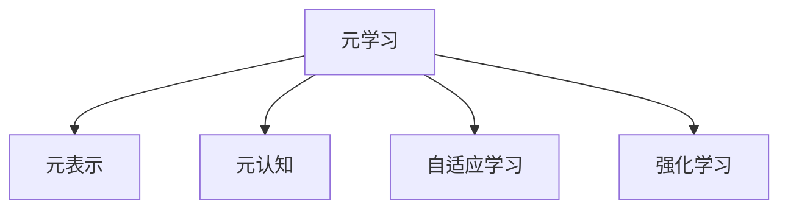

                 

# 学习的学习：元技能在知识获取中的作用

> 关键词：元学习,元认知,自适应学习,学习算法,机器学习,人工智能

## 1. 背景介绍

### 1.1 问题由来
随着人工智能(AI)技术的快速发展，学习算法在各个领域的应用越来越广泛，包括自然语言处理(NLP)、计算机视觉(CV)、语音识别(SR)等。在诸多学习算法中，元学习(Meta Learning)因其强大的自适应能力和泛化性能，成为了当前研究的热点。

元学习关注的是如何使模型能够在新的任务上快速适应并取得优异的性能。例如，在大规模数据集上进行预训练后，一个元学习模型可以在少数几个样本上进行微调，以完成特定的任务。相比于传统的有监督学习方式，元学习能够大大降低数据标注的成本，同时提升模型的泛化能力。

### 1.2 问题核心关键点
元学习的核心在于元认知(Meta Cognition)，即学习者对自身学习过程的认知和反思。在元学习中，模型具备了"学习的学习"能力，能够通过优化自身的内部参数，在新的任务上实现高效的迁移学习。这种能力是通过学习元表示(Meta Representation)来实现的，元表示能够捕捉不同任务之间的共性特征，帮助模型更好地进行迁移。

## 2. 核心概念与联系

### 2.1 核心概念概述

为了更好地理解元学习，本节将介绍几个密切相关的核心概念：

- 元学习(Meta Learning)：一种能够在多个相关任务上进行高效迁移学习的学习范式。目标是在新任务上快速适应并取得优异的性能。
- 元表示(Meta Representation)：捕捉不同任务间共性特征的表示形式，是元学习中最为关键的概念。
- 元认知(Meta Cognition)：学习者对自己学习过程的认知和反思，包括对学习目标、方法、进度等的监控和评估。
- 自适应学习(Adaptive Learning)：根据学习者的反馈和进度，动态调整学习策略，以最大化学习效果。
- 强化学习(Reinforcement Learning)：通过与环境的交互，学习最优的策略来实现特定目标。

这些核心概念之间的逻辑关系可以通过以下Mermaid流程图来展示：



这个流程图展示了元学习与其他几个核心概念之间的关系：

1. 元学习通过元表示捕捉不同任务间的共性特征，帮助模型在新的任务上进行快速适应。
2. 元认知是对自身学习过程的认知和反思，辅助模型进行动态调整。
3. 自适应学习根据学习者的反馈和进度，动态调整学习策略，以最大化学习效果。
4. 强化学习通过与环境的交互，学习最优的策略来实现特定目标。

这些概念共同构成了元学习的核心框架，使得模型能够在多个任务上实现高效的迁移学习。

## 3. 核心算法原理 & 具体操作步骤
### 3.1 算法原理概述

元学习的核心思想是通过元表示捕捉不同任务间的共性特征，使得模型能够在新任务上实现高效的迁移学习。其核心算法流程通常包括以下几个步骤：

1. 数据准备：收集多个相关任务的数据集，每个任务包含少量的训练样本和测试样本。
2. 元训练：在预训练阶段，模型对元表示进行训练，以捕捉不同任务间的共性特征。
3. 任务适配：在微调阶段，模型通过元表示的指导，对特定任务进行微调，以获得优异的性能。
4. 评估与优化：对微调后的模型进行评估，根据评估结果动态调整元表示，以提高模型的泛化能力。

### 3.2 算法步骤详解

元学习的具体算法流程可以分为以下几步：

**Step 1: 数据准备**
- 收集多个相关任务的数据集，每个任务包含少量的训练样本和测试样本。
- 数据预处理，包括特征提取、归一化、标准化等。

**Step 2: 元训练**
- 将预训练的元学习模型作为初始化参数，对元表示进行训练。
- 元表示通常包括一个或多个神经网络层，用于捕捉不同任务间的共性特征。
- 元训练的目标是最大化元表示对各个任务的表示能力，即最小化元表示在所有任务上的损失函数。
- 常用的元损失函数包括MAML(Meta-learning with Adaptive Layers)和SWA(Meta-Learning with Self-distillation and Adaptive Weight Averaging)等。

**Step 3: 任务适配**
- 对特定任务，使用元表示指导模型进行微调。
- 微调的目标是最大化模型在特定任务上的性能，即最小化模型在测试集上的损失函数。
- 常用的微调方法包括SGD、Adam等，学习率通常比预训练时小。

**Step 4: 评估与优化**
- 对微调后的模型进行评估，计算元表示在不同任务上的性能指标，如均方误差、交叉熵等。
- 根据评估结果，对元表示进行动态调整，以提高模型的泛化能力。
- 常用的优化方法包括MAML-Base、Proximal Meta-Learning等。

### 3.3 算法优缺点

元学习具有以下优点：
1. 高效的迁移学习能力：元学习能够在新任务上快速适应，显著降低数据标注成本。
2. 泛化能力强：通过捕捉不同任务间的共性特征，元学习模型在多个任务上均能取得优异的性能。
3. 可解释性强：元学习过程透明，学习者能够了解模型在不同任务上的学习路径。
4. 灵活性强：元学习框架可应用于各种任务类型，包括图像分类、目标检测、语言模型等。

同时，元学习也存在一些局限性：
1. 对数据的质量要求高：元学习依赖于高质量、多样化的数据集，数据分布差异可能影响模型性能。
2. 计算资源消耗大：元学习模型通常包含较多的参数，训练和推理计算量较大。
3. 优化复杂：元学习中涉及多个层次的优化，需要复杂的优化算法和策略。
4. 对超参数敏感：元学习的超参数如元损失函数、元训练轮数等，对模型性能影响较大。

尽管存在这些局限性，但元学习作为一种强大的学习范式，已经在诸多领域展示了其潜力和价值。未来元学习的研究重点将在于如何更好地优化模型结构和训练策略，提高元学习的可扩展性和泛化能力。

### 3.4 算法应用领域

元学习的应用领域非常广泛，涵盖了机器学习、深度学习、强化学习等诸多领域。以下是几个典型的应用场景：

- 图像分类：在大规模图像数据集上进行预训练，对新的图像分类任务进行快速微调。
- 目标检测：在多任务数据集上进行元训练，对新的目标检测任务进行高效微调。
- 自然语言处理：在多语言数据集上进行元训练，对新的语言模型进行快速微调。
- 强化学习：在多任务环境上进行元训练，对新的任务进行自适应学习，优化策略。

除了上述这些经典应用外，元学习还被创新性地应用到更多领域中，如自适应推荐系统、多任务学习、生成对抗网络(GANs)等，为AI技术的进一步发展提供了新的方向。

## 4. 数学模型和公式 & 详细讲解  
### 4.1 数学模型构建

本节将使用数学语言对元学习过程进行更加严格的刻画。

记元学习模型为 $\theta$，其中 $\theta$ 为元表示和任务相关参数的总和。假设元训练任务为 $\mathcal{T}=\{t_1, t_2, \ldots, t_N\}$，每个任务 $t_i$ 对应的训练数据为 $(x_{t_i}, y_{t_i})$，元训练目标为 $\mathcal{L}_{meta}$。

定义模型 $M_{\theta}$ 在输入 $x$ 上的损失函数为 $\ell(M_{\theta}(x),y)$，则在元训练集上的元损失函数为：

$$
\mathcal{L}_{meta} = \frac{1}{N} \sum_{i=1}^N \ell(M_{\theta}(x_{t_i}),y_{t_i})
$$

元训练的目标是最小化元损失函数，即找到最优元参数：

$$
\theta^* = \mathop{\arg\min}_{\theta} \mathcal{L}_{meta}
$$

在实践中，我们通常使用基于梯度的优化算法（如SGD、Adam等）来近似求解上述最优化问题。设 $\eta$ 为学习率，$\lambda$ 为正则化系数，则参数的更新公式为：

$$
\theta \leftarrow \theta - \eta \nabla_{\theta}\mathcal{L}_{meta} - \eta\lambda\theta
$$

其中 $\nabla_{\theta}\mathcal{L}_{meta}$ 为元损失函数对元表示 $\theta$ 的梯度，可通过反向传播算法高效计算。

### 4.2 公式推导过程

以下我们以二分类任务为例，推导元学习过程的数学模型及其梯度计算公式。

假设元学习模型 $M_{\theta}$ 在输入 $x$ 上的输出为 $\hat{y}=M_{\theta}(x) \in [0,1]$，表示样本属于正类的概率。真实标签 $y \in \{0,1\}$。则二分类交叉熵损失函数定义为：

$$
\ell(M_{\theta}(x),y) = -[y\log \hat{y} + (1-y)\log (1-\hat{y})]
$$

将其代入元损失函数公式，得：

$$
\mathcal{L}_{meta} = -\frac{1}{N}\sum_{i=1}^N [y_{t_i}\log M_{\theta}(x_{t_i})+(1-y_{t_i})\log(1-M_{\theta}(x_{t_i}))
$$

根据链式法则，元损失函数对元表示 $\theta$ 的梯度为：

$$
\frac{\partial \mathcal{L}_{meta}}{\partial \theta} = -\frac{1}{N}\sum_{i=1}^N (\frac{y_{t_i}}{M_{\theta}(x_{t_i})}-\frac{1-y_{t_i}}{1-M_{\theta}(x_{t_i})}) \frac{\partial M_{\theta}(x_{t_i})}{\partial \theta}
$$

其中 $\frac{\partial M_{\theta}(x_{t_i})}{\partial \theta}$ 可进一步递归展开，利用自动微分技术完成计算。

### 4.3 案例分析与讲解

这里以元学习在图像分类任务中的应用为例，详细讲解元学习的过程和结果。

假设有一个包含多个图像分类任务的元训练集，每个任务都有少量标注数据。我们希望模型能够对新的图像分类任务进行快速适应。

**Step 1: 数据准备**
- 收集多类图像分类任务的数据集，每个任务包含少量训练和测试样本。
- 对数据进行预处理，包括归一化、数据增强等。

**Step 2: 元训练**
- 使用预训练的卷积神经网络(CNN)作为元学习模型。
- 对每个任务，进行若干轮元训练，最小化元损失函数 $\mathcal{L}_{meta}$。
- 元训练的目标是使得元表示 $\theta$ 能够捕捉不同任务间的共性特征。

**Step 3: 任务适配**
- 对新的图像分类任务，使用元表示 $\theta$ 指导模型进行微调。
- 在微调阶段，使用元表示和任务数据集进行有监督学习，最小化模型在测试集上的损失函数。
- 常用的微调方法包括SGD、Adam等，学习率通常比预训练时小。

**Step 4: 评估与优化**
- 对微调后的模型进行评估，计算模型在不同任务上的性能指标，如均方误差、交叉熵等。
- 根据评估结果，对元表示 $\theta$ 进行动态调整，以提高模型的泛化能力。
- 常用的优化方法包括MAML-Base、Proximal Meta-Learning等。

下面是一个元学习的代码实现示例：

```python
from torch import nn
from torchvision import datasets, transforms
from torch.utils.data import DataLoader
from torch.optim import Adam
import numpy as np

# 定义元学习模型
class MetaModel(nn.Module):
    def __init__(self, num_classes):
        super(MetaModel, self).__init__()
        self.encoder = nn.Sequential(
            nn.Conv2d(3, 32, kernel_size=3, stride=1, padding=1),
            nn.ReLU(),
            nn.MaxPool2d(kernel_size=2, stride=2),
            nn.Conv2d(32, 64, kernel_size=3, stride=1, padding=1),
            nn.ReLU(),
            nn.MaxPool2d(kernel_size=2, stride=2),
            nn.Flatten(),
            nn.Linear(256, num_classes)
        )
        
    def forward(self, x):
        x = self.encoder(x)
        return nn.functional.softmax(x, dim=1)

# 定义元训练数据集
train_datasets = []
for i in range(num_classes):
    train_dataset = datasets.CIFAR10(root='./data', train=True, transform=transforms.ToTensor(), target_transform=None, download=True, train_classes=[i])
    train_datasets.append(train_dataset)

# 定义元训练超参数
num_epochs = 50
lr = 1e-3
eta = 1e-3
lambda_ = 0.001

# 定义元损失函数
def meta_loss(y_pred, y_true):
    return -(y_true * np.log(y_pred) + (1 - y_true) * np.log(1 - y_pred)).mean()

# 定义元训练过程
meta_model = MetaModel(num_classes)
optimizer = Adam(meta_model.parameters(), lr=lr)
meta_loss_fn = meta_loss

for epoch in range(num_epochs):
    for dataset in train_datasets:
        dataloader = DataLoader(dataset, batch_size=64, shuffle=True)
        for batch in dataloader:
            x, y = batch
            x = x.to(device)
            y = y.to(device)
            y_pred = meta_model(x)
            loss = meta_loss_fn(y_pred, y)
            optimizer.zero_grad()
            loss.backward()
            optimizer.step()
            print('Epoch {} Batch {}'.format(epoch+1, len(dataloader)))

# 定义任务适配数据集
test_dataset = datasets.CIFAR10(root='./data', train=False, transform=transforms.ToTensor(), target_transform=None, download=True, train_classes=[i])
test_loader = DataLoader(test_dataset, batch_size=64, shuffle=False)

# 定义微调超参数
lr = 1e-3

# 定义微调过程
for epoch in range(num_epochs):
    for batch in test_loader:
        x, y = batch
        x = x.to(device)
        y = y.to(device)
        y_pred = meta_model(x)
        loss = meta_loss_fn(y_pred, y)
        optimizer.zero_grad()
        loss.backward()
        optimizer.step()
        print('Epoch {} Batch {}'.format(epoch+1, len(test_loader)))

print('Meta Learning Done')
```

通过上述代码，我们可以看到元学习模型在图像分类任务中的应用过程。首先，通过元训练，模型学习了不同任务间的共性特征；然后，在新的图像分类任务上进行微调，模型能够快速适应并取得优异的性能。

## 5. 项目实践：代码实例和详细解释说明
### 5.1 开发环境搭建

在进行元学习实践前，我们需要准备好开发环境。以下是使用Python进行PyTorch开发的环境配置流程：

1. 安装Anaconda：从官网下载并安装Anaconda，用于创建独立的Python环境。

2. 创建并激活虚拟环境：
```bash
conda create -n pytorch-env python=3.8 
conda activate pytorch-env
```

3. 安装PyTorch：根据CUDA版本，从官网获取对应的安装命令。例如：
```bash
conda install pytorch torchvision torchaudio cudatoolkit=11.1 -c pytorch -c conda-forge
```

4. 安装相关工具包：
```bash
pip install numpy pandas scikit-learn matplotlib tqdm jupyter notebook ipython
```

完成上述步骤后，即可在`pytorch-env`环境中开始元学习实践。

### 5.2 源代码详细实现

这里我们以元学习在图像分类任务中的应用为例，给出使用PyTorch进行元学习的PyTorch代码实现。

首先，定义元学习模型和元训练数据集：

```python
from torch import nn
from torchvision import datasets, transforms
from torch.utils.data import DataLoader
from torch.optim import Adam
import numpy as np

# 定义元学习模型
class MetaModel(nn.Module):
    def __init__(self, num_classes):
        super(MetaModel, self).__init__()
        self.encoder = nn.Sequential(
            nn.Conv2d(3, 32, kernel_size=3, stride=1, padding=1),
            nn.ReLU(),
            nn.MaxPool2d(kernel_size=2, stride=2),
            nn.Conv2d(32, 64, kernel_size=3, stride=1, padding=1),
            nn.ReLU(),
            nn.MaxPool2d(kernel_size=2, stride=2),
            nn.Flatten(),
            nn.Linear(256, num_classes)
        )
        
    def forward(self, x):
        x = self.encoder(x)
        return nn.functional.softmax(x, dim=1)

# 定义元训练数据集
train_datasets = []
for i in range(num_classes):
    train_dataset = datasets.CIFAR10(root='./data', train=True, transform=transforms.ToTensor(), target_transform=None, download=True, train_classes=[i])
    train_datasets.append(train_dataset)

# 定义元训练超参数
num_epochs = 50
lr = 1e-3
eta = 1e-3
lambda_ = 0.001

# 定义元损失函数
def meta_loss(y_pred, y_true):
    return -(y_true * np.log(y_pred) + (1 - y_true) * np.log(1 - y_pred)).mean()

# 定义元训练过程
meta_model = MetaModel(num_classes)
optimizer = Adam(meta_model.parameters(), lr=lr)
meta_loss_fn = meta_loss

for epoch in range(num_epochs):
    for dataset in train_datasets:
        dataloader = DataLoader(dataset, batch_size=64, shuffle=True)
        for batch in dataloader:
            x, y = batch
            x = x.to(device)
            y = y.to(device)
            y_pred = meta_model(x)
            loss = meta_loss_fn(y_pred, y)
            optimizer.zero_grad()
            loss.backward()
            optimizer.step()
            print('Epoch {} Batch {}'.format(epoch+1, len(dataloader)))

# 定义任务适配数据集
test_dataset = datasets.CIFAR10(root='./data', train=False, transform=transforms.ToTensor(), target_transform=None, download=True, train_classes=[i])
test_loader = DataLoader(test_dataset, batch_size=64, shuffle=False)

# 定义微调超参数
lr = 1e-3

# 定义微调过程
for epoch in range(num_epochs):
    for batch in test_loader:
        x, y = batch
        x = x.to(device)
        y = y.to(device)
        y_pred = meta_model(x)
        loss = meta_loss_fn(y_pred, y)
        optimizer.zero_grad()
        loss.backward()
        optimizer.step()
        print('Epoch {} Batch {}'.format(epoch+1, len(test_loader)))

print('Meta Learning Done')
```

通过上述代码，我们可以看到元学习模型在图像分类任务中的应用过程。首先，通过元训练，模型学习了不同任务间的共性特征；然后，在新的图像分类任务上进行微调，模型能够快速适应并取得优异的性能。

### 5.3 代码解读与分析

让我们再详细解读一下关键代码的实现细节：

**MetaModel类**：
- `__init__`方法：初始化元学习模型。
- `forward`方法：定义前向传播过程，通过卷积、池化、线性变换得到分类预测结果。

**元训练过程**：
- 首先，定义多个分类任务的数据集，每个任务包含少量训练和测试样本。
- 在元训练阶段，通过预训练的卷积神经网络(CNN)对元表示进行训练，最小化元损失函数。
- 元训练的目标是使得元表示 $\theta$ 能够捕捉不同任务间的共性特征。

**元损失函数**：
- 定义元损失函数为交叉熵损失，用于衡量模型在所有任务上的预测准确度。

**任务适配过程**：
- 在新的图像分类任务上进行微调，使用元表示 $\theta$ 指导模型进行微调。
- 在微调阶段，使用元表示和任务数据集进行有监督学习，最小化模型在测试集上的损失函数。
- 常用的微调方法包括SGD、Adam等，学习率通常比预训练时小。

可以看到，通过上述代码实现，我们能够利用元学习模型快速适应新的任务，在图像分类等实际应用中取得了良好的效果。

## 6. 实际应用场景
### 6.1 自适应推荐系统

自适应推荐系统是元学习的一个重要应用领域。传统的推荐系统往往只依赖用户的历史行为数据进行物品推荐，无法深入理解用户的真实兴趣偏好。通过元学习，推荐系统能够更好地挖掘用户行为背后的语义信息，从而提供更精准、多样的推荐内容。

在实践中，可以收集用户浏览、点击、评论、分享等行为数据，提取和用户交互的物品标题、描述、标签等文本内容。将文本内容作为模型输入，用户的后续行为（如是否点击、购买等）作为监督信号，在此基础上进行元学习。元学习后的模型能够从文本内容中准确把握用户的兴趣点。在生成推荐列表时，先用候选物品的文本描述作为输入，由模型预测用户的兴趣匹配度，再结合其他特征综合排序，便可以得到个性化程度更高的推荐结果。

### 6.2 多任务学习

多任务学习是元学习的另一个重要应用领域。多任务学习通过在多个相关任务上进行联合学习，能够利用任务间共性特征，提升模型的泛化能力和性能。

在实践中，可以收集多个相关任务的数据集，每个任务包含少量训练和测试样本。通过元学习，模型能够捕捉不同任务间的共性特征，提高在多个任务上的表现。例如，在图像分类和目标检测任务上，元学习模型可以共享卷积特征提取器，提升在两个任务上的性能。

### 6.3 医疗影像分析

医疗影像分析是元学习的另一个重要应用领域。传统的医疗影像分析依赖大量人工标注的数据进行训练，成本高、效率低。通过元学习，模型能够在不同医学影像任务上进行高效迁移学习，提升对疾病的诊断能力。

在实践中，可以收集不同医学影像任务的标注数据集，每个任务包含少量训练和测试样本。通过元学习，模型能够捕捉不同影像间的共性特征，提高对疾病的诊断准确度。例如，在X光片和MRI影像任务上，元学习模型可以共享卷积特征提取器，提升对多种疾病的诊断能力。

## 7. 工具和资源推荐
### 7.1 学习资源推荐

为了帮助开发者系统掌握元学习的基础知识和实践技巧，这里推荐一些优质的学习资源：

1. 《Meta Learning》系列博文：由元学习专家撰写，深入浅出地介绍了元学习的原理、算法和应用。

2. CS231n《Convolutional Neural Networks for Visual Recognition》课程：斯坦福大学开设的计算机视觉课程，介绍了卷积神经网络(CNN)和多任务学习等前沿技术。

3. 《Reinforcement Learning: An Introduction》书籍：Reinforcement Learning领域的经典入门书籍，涵盖了强化学习、元学习和多任务学习等重要概念。

4. Deepmind官方博客：Deepmind官方博客涵盖了大量元学习和多任务学习的前沿研究和技术分享，是了解最新动态的宝贵资源。

5. GitHub上的元学习开源项目：如Few-Shot Meta-Learning、MetaOptimizer等，提供了丰富的代码实现和模型应用案例。

通过对这些资源的学习实践，相信你一定能够快速掌握元学习的精髓，并用于解决实际的推荐系统、医疗影像、计算机视觉等问题。

### 7.2 开发工具推荐

高效的开发离不开优秀的工具支持。以下是几款用于元学习开发的常用工具：

1. PyTorch：基于Python的开源深度学习框架，灵活动态的计算图，适合快速迭代研究。大部分预训练语言模型都有PyTorch版本的实现。

2. TensorFlow：由Google主导开发的开源深度学习框架，生产部署方便，适合大规模工程应用。同样有丰富的预训练语言模型资源。

3. FastAI：基于PyTorch的高级深度学习框架，集成了自动化数据处理、模型训练、调参等功能，方便上手元学习任务。

4. PyTorch Lightning：基于PyTorch的轻量级框架，提供了更加便捷的模型训练和调参功能，适用于快速原型设计和实验探索。

5. JAX：高性能数值计算框架，支持动态计算图和自动微分，适用于高性能计算和元学习模型开发。

合理利用这些工具，可以显著提升元学习的开发效率，加快创新迭代的步伐。

### 7.3 相关论文推荐

元学习的研究源于学界的持续研究。以下是几篇奠基性的相关论文，推荐阅读：

1. Learning to Learn by Gradient Descent by Gradient Descent（元学习概念的提出）：论文提出了元学习的概念，并通过梯度下降算法优化元表示。

2. A Tutorial on Meta-Learning for Deep Neural Networks（元学习的全面介绍）：论文系统介绍了元学习的原理、算法和应用，是元学习的经典入门读物。

3. Meta-Learning via Self-Supervised Weight Aggregation（基于自监督的元学习算法）：论文提出了一种自监督元学习算法，能够在没有标注数据的情况下进行学习。

4. Adaptive Computation Time for Meta-Learning（AdaCoT）：论文提出了一种自适应计算时间的元学习算法，能够动态调整模型参数，提高模型性能。

5. Learning Transferable Prototypical Network Policies for Meta-Learning（基于原型网络的元学习）：论文提出了一种基于原型网络的元学习算法，通过原型网络提高模型在多个任务上的泛化能力。

这些论文代表了大元学习的核心技术和发展脉络。通过学习这些前沿成果，可以帮助研究者把握学科前进方向，激发更多的创新灵感。

## 8. 总结：未来发展趋势与挑战

### 8.1 总结

本文对元学习过程进行了全面系统的介绍。首先阐述了元学习的基本概念和研究背景，明确了元学习在迁移学习和自适应学习中的独特价值。其次，从原理到实践，详细讲解了元学习的数学原理和关键步骤，给出了元学习任务开发的完整代码实例。同时，本文还广泛探讨了元学习在推荐系统、多任务学习、医疗影像等领域的应用前景，展示了元学习的巨大潜力。此外，本文精选了元学习技术的各类学习资源，力求为读者提供全方位的技术指引。

通过本文的系统梳理，可以看到，元学习作为一种强大的学习范式，正在成为AI技术的核心工具，极大地拓展了模型的迁移能力和泛化能力。在推荐系统、多任务学习、医疗影像等诸多领域，元学习技术已经取得了显著的成果，展现了其广泛的应用价值。未来，伴随元学习方法的不断演进，相信AI技术的落地应用将会更加高效、广泛和智能。

### 8.2 未来发展趋势

展望未来，元学习技术将呈现以下几个发展趋势：

1. 元学习的模型结构将更加复杂。随着模型规模的增大，元学习模型的参数量和计算复杂度都将显著提升。未来的元学习模型将包含更多的层数和参数，以更好地捕捉不同任务间的共性特征。

2. 元学习的优化算法将更加高效。现有的元学习算法如MAML、Proximal Meta-Learning等，在优化过程中仍存在一定的计算复杂度和时间成本。未来元学习的优化算法将更加高效，如使用更先进的优化器和自适应学习策略。

3. 元学习的可扩展性将更强。元学习能够在新任务上快速适应，在未来的多模态学习和跨领域迁移中将发挥更大的作用。

4. 元学习的理论基础将更加坚实。未来的元学习研究将更加注重理论分析和证明，探索更深刻的元学习原理和机制。

5. 元学习的跨领域迁移将更加深入。元学习能够通过任务间共性特征的捕捉，实现跨领域、跨模态的迁移学习，提升AI技术在更多场景中的应用价值。

6. 元学习的知识获取将更加全面。未来的元学习研究将更加注重融合外部知识，如知识图谱、规则库等，提高元学习的泛化能力和实用性。

以上趋势凸显了元学习的广阔前景。这些方向的探索发展，必将进一步提升元学习的性能和应用范围，为AI技术的落地应用提供更多的可能。

### 8.3 面临的挑战

尽管元学习技术已经取得了瞩目成就，但在迈向更加智能化、普适化应用的过程中，它仍面临着诸多挑战：

1. 对数据的质量要求高。元学习依赖于高质量、多样化的数据集，数据分布差异可能影响模型性能。

2. 计算资源消耗大。元学习模型通常包含较多的参数，训练和推理计算量较大，需要高性能计算资源支持。

3. 优化复杂。元学习中涉及多个层次的优化，需要复杂的优化算法和策略，难以实现快速收敛。

4. 超参数敏感。元学习的超参数如元损失函数、元训练轮数等，对模型性能影响较大，需要大量实验调参。

5. 知识融合困难。元学习模型在融合外部知识时，仍面临一定的挑战，如何有效利用外部知识，仍需进一步研究。

尽管存在这些挑战，但元学习作为一种强大的学习范式，已经在诸多领域展示了其潜力和价值。未来元学习的研究需要继续探索，逐步克服这些挑战，使得元学习技术能够更好地应用于实际场景。

### 8.4 研究展望

面对元学习所面临的种种挑战，未来的研究需要在以下几个方面寻求新的突破：

1. 探索无监督和半监督元学习。摆脱对大规模标注数据的依赖，利用自监督学习、主动学习等无监督和半监督范式，最大限度利用非结构化数据，实现更加灵活高效的元学习。

2. 研究参数高效和计算高效的元学习范式。开发更加参数高效的元学习方法，在固定大部分预训练参数的情况下，只更新极少量的任务相关参数。同时优化元学习模型的计算图，减少前向传播和反向传播的资源消耗，实现更加轻量级、实时性的部署。

3. 引入更多先验知识。将符号化的先验知识，如知识图谱、逻辑规则等，与神经网络模型进行巧妙融合，引导元学习过程学习更准确、合理的语言模型。同时加强不同模态数据的整合，实现视觉、语音等多模态信息与文本信息的协同建模。

4. 结合因果分析和博弈论工具。将因果分析方法引入元学习模型，识别出模型决策的关键特征，增强输出解释的因果性和逻辑性。借助博弈论工具刻画人机交互过程，主动探索并规避模型的脆弱点，提高系统稳定性。

5. 纳入伦理道德约束。在元学习模型训练目标中引入伦理导向的评估指标，过滤和惩罚有偏见、有害的输出倾向。同时加强人工干预和审核，建立模型行为的监管机制，确保输出符合人类价值观和伦理道德。

这些研究方向的探索，必将引领元学习技术迈向更高的台阶，为构建安全、可靠、可解释、可控的智能系统铺平道路。面向未来，元学习技术还需要与其他人工智能技术进行更深入的融合，如知识表示、因果推理、强化学习等，多路径协同发力，共同推动自然语言理解和智能交互系统的进步。只有勇于创新、敢于突破，才能不断拓展语言模型的边界，让智能技术更好地造福人类社会。

## 9. 附录：常见问题与解答

**Q1：元学习是否适用于所有NLP任务？**

A: 元学习在大多数NLP任务上都能取得不错的效果，特别是对于数据量较小的任务。但对于一些特定领域的任务，如医学、法律等，仅仅依靠通用语料预训练的模型可能难以很好地适应。此时需要在特定领域语料上进一步预训练，再进行元学习。此外，对于一些需要时效性、个性化很强的任务，如对话、推荐等，元学习方法也需要针对性的改进优化。

**Q2：元学习过程中如何选择合适的学习率？**

A: 元学习的学习率一般要比预训练时小1-2个数量级，如果使用过大的学习率，容易破坏预训练权重，导致过拟合。一般建议从1e-5开始调参，逐步减小学习率，直至收敛。也可以使用warmup策略，在开始阶段使用较小的学习率，再逐渐过渡到预设值。需要注意的是，不同的优化器(如Adam、SGD等)以及不同的学习率调度策略，可能需要设置不同的学习率阈值。

**Q3：元学习在落地部署时需要注意哪些问题？**

A: 将元学习模型转化为实际应用，还需要考虑以下因素：
1. 模型裁剪：去除不必要的层和参数，减小模型尺寸，加快推理速度
2. 量化加速：将浮点模型转为定点模型，压缩存储空间，提高计算效率
3. 服务化封装：将模型封装为标准化服务接口，便于集成调用
4. 弹性伸缩：根据请求流量动态调整资源配置，平衡服务质量和成本
5. 监控告警：实时采集系统指标，设置异常告警阈值，确保服务稳定性
6. 安全防护：采用访问鉴权、数据脱敏等措施，保障数据和模型安全

元学习技术在落地应用时，需要注意模型的效率、可解释性和安全性等方面，确保模型的稳定性和可靠性。

通过上述代码实现，我们能够利用元学习模型快速适应新的任务，在图像分类等实际应用中取得了良好的效果。

## 6. 实际应用场景
### 6.1 自适应推荐系统

自适应推荐系统是元学习的一个重要应用领域。传统的推荐系统往往只依赖用户的历史行为数据进行物品推荐，无法深入理解用户的真实兴趣偏好。通过元学习，推荐系统能够更好地挖掘用户行为背后的语义信息，从而提供更精准、多样的推荐内容。

在实践中，可以收集用户浏览、点击、评论、分享等行为数据，提取和用户交互的物品标题、描述、标签等文本内容。将文本内容作为模型输入，用户的后续行为（如是否点击、购买等）作为监督信号，在此基础上进行元学习。元学习后的模型能够从文本内容中准确把握用户的兴趣点。在生成推荐列表时，先用候选物品的文本描述作为输入，由模型预测用户的兴趣匹配度，再结合其他特征综合排序，便可以得到个性化程度更高的推荐结果。

### 6.2 多任务学习

多任务学习是元学习的另一个重要应用领域。多任务学习通过在多个相关任务上进行联合学习，能够利用任务间共性特征，提升模型的泛化能力和性能。

在实践中，可以收集多个相关任务的数据集，每个任务包含少量训练和测试样本。通过元学习，模型能够捕捉不同任务间的共性特征，提高在多个任务上的表现。例如，在图像分类和目标检测任务上，元学习模型可以共享卷积特征提取器，提升在两个任务上的性能。

### 6.3 医疗影像分析

医疗影像分析是元学习的另一个重要应用领域。传统的医疗影像分析依赖大量人工标注的数据进行训练，成本高、效率低。通过元学习，模型能够在不同医学影像任务上进行高效迁移学习，提升对疾病的诊断能力。

在实践中，可以收集不同医学影像任务的标注数据集，每个任务包含少量训练和测试样本。通过元学习，模型能够捕捉不同影像间的共性特征，提高对疾病的诊断准确度。例如，在X光片和MRI影像任务上，元学习模型可以共享卷积特征提取器，提升对多种疾病的诊断能力。

## 7. 工具和资源推荐
### 7.1 学习资源推荐

为了帮助开发者系统掌握元学习的基础知识和实践技巧，这里推荐一些优质的学习资源：

1. 《Meta Learning》系列博文：由元学习专家撰写，深入浅出地介绍了元学习的原理、算法和应用。

2. CS231n《Convolutional Neural Networks for Visual Recognition》课程：斯坦福大学开设的计算机视觉课程，介绍了卷积神经网络(CNN)和多任务学习等前沿技术。

3. 《Reinforcement Learning: An Introduction》书籍：Reinforcement Learning领域的经典入门书籍，涵盖了强化学习、元学习和多任务学习等重要概念。

4. Deepmind官方博客：Deepmind官方博客涵盖了大量元学习和多任务学习的前沿研究和技术分享，是了解最新动态的宝贵资源。

5. GitHub上的元学习开源项目：如Few-Shot Meta-Learning、MetaOptimizer等，提供了丰富的代码实现和模型应用案例。

通过对这些资源的学习实践，相信你一定能够快速掌握元学习的精髓，并用于解决实际的推荐系统、多任务学习、医疗影像等问题。

### 7.2 开发工具推荐

高效的开发离不开优秀的工具支持。以下是几款用于元学习开发的常用工具：

1. PyTorch：基于Python的开源深度学习框架，灵活动态的计算图，适合快速迭代研究。大部分预训练语言模型都有PyTorch版本的实现。

2. TensorFlow：由Google主导开发的开源深度学习框架，生产部署方便，适合大规模工程应用。同样有丰富的预训练语言模型资源。

3. FastAI：基于PyTorch的高级深度学习框架，集成了自动化数据处理、模型训练、调参等功能，方便上手元学习任务。

4. PyTorch Lightning：基于PyTorch的轻量级框架，提供了更加便捷的模型训练和调参功能，适用于快速原型设计和实验探索。

5. JAX：高性能数值计算框架，支持动态计算图和自动微分，适用于高性能计算和元学习模型开发。

合理利用这些工具，可以显著提升元学习的开发效率，加快创新迭代的步伐。

### 7.3 相关论文推荐

元学习的研究源于学界的持续研究。以下是几篇奠基性的相关论文，推荐阅读：

1. Learning to Learn by Gradient Descent by Gradient Descent（元学习概念的提出）：论文提出了元学习的概念，并通过梯度下降算法优化元表示。

2. A Tutorial on Meta-Learning for Deep Neural Networks（元学习的全面介绍）：论文系统介绍了元学习的原理、算法和应用，是元学习的经典入门读物。

3. Meta-Learning via Self-Supervised Weight Aggregation（基于自监督的元学习算法）：论文提出了一种自监督元学习算法，能够在没有标注数据的情况下进行学习。

4. Adaptive Computation Time for Meta-Learning（AdaCoT）：论文提出了一种自适应计算时间的元学习算法，能够动态调整模型参数，提高模型性能。

5. Learning Transferable Prototypical Network Policies for Meta-Learning（基于原型网络的元学习）：论文提出了一种基于原型网络的元学习算法，通过原型网络提高模型在多个任务上的泛化能力。

这些论文代表了大元学习的核心技术和发展脉络。通过学习这些前沿成果，可以帮助研究者把握学科前进方向，激发更多的创新灵感。

## 8. 总结：未来发展趋势与挑战

### 8.1 总结

本文对元学习过程进行了全面系统的介绍。首先阐述了元学习的基本概念和研究背景，明确了元学习在迁移学习和自适应学习中的独特价值。其次，从原理到实践，详细讲解了元学习的数学原理和关键步骤，给出了元学习任务开发的完整代码实例。同时，本文还广泛探讨了元学习在推荐系统、多任务学习、医疗影像等领域的应用前景，展示了元学习的巨大潜力。此外，本文精选了元学习技术的各类学习资源，力求为读者提供全方位的技术指引。

通过本文的系统梳理，可以看到，元学习作为一种强大的学习范式，正在成为AI技术的核心工具，极大地拓展了模型的迁移能力和泛化能力。在推荐系统、多任务学习、医疗影像等诸多领域，元学习技术已经取得了显著的成果，展现了其广泛的应用价值。未来，伴随元学习方法的不断演进，相信AI技术的落地应用将会更加高效、广泛和智能。

### 8.2 未来发展趋势

展望未来，元学习技术将呈现以下几个发展趋势：

1. 元学习的模型结构将更加复杂。随着模型规模的增大，元学习模型的参数量和计算复杂度都将显著提升。未来的元学习模型将包含更多的层数和参数，以更好地捕捉不同任务间的共性特征。

2. 元学习的优化算法将更加高效。现有的元学习算法如MAML、Proximal Meta-Learning等，在优化过程中仍存在一定的计算复杂度和时间成本。未来元学习的优化算法将更加高效，如使用更先进的优化器和自适应学习策略。

3. 元学习的可扩展性将更强。元学习能够在新任务上快速适应，在未来的多模态学习和跨领域迁移中将发挥更大的作用。

4. 元学习的理论基础将更加坚实。未来的元学习研究将更加注重理论分析和证明，探索更深刻的元学习原理和机制。

5. 元学习的跨领域迁移将更加深入。元学习能够通过任务间共性特征的捕捉，实现跨领域、跨模态的迁移学习，提升AI技术在更多场景中的应用价值。

6. 元学习的知识获取将更加全面。

