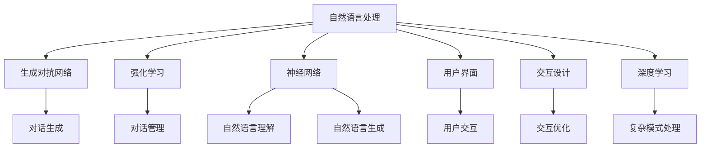

                 

# 对话式AI：构建更自然、更智能的交互界面

> 关键词：对话式AI,自然语言处理(NLP),生成对抗网络(GAN),强化学习(Reinforcement Learning),神经网络,用户界面(UI),交互设计,深度学习

## 1. 背景介绍

### 1.1 问题由来
随着人工智能技术的不断进步，人类与计算机之间的交互方式正在发生深刻变革。传统的基于文本或图像的界面已经无法满足日益复杂多变的人机交互需求。对话式AI技术的兴起，为构建更加自然、智能的交互界面提供了新的可能。

对话式AI（Conversational AI）是一种通过模拟人类对话的方式，使计算机能够理解和回应自然语言输入的技术。它不仅能够处理文本信息，还可以通过语音识别和语音合成技术实现更加全面的语音交互。对话式AI技术的应用，已经从客服、助手等简单的应用扩展到医疗、教育、金融等多个行业，其应用前景广阔。

### 1.2 问题核心关键点
对话式AI的核心在于如何构建智能化的对话系统。其关键点包括：
- 自然语言理解（Natural Language Understanding, NLU）：使机器能够理解人类语言的意图和上下文。
- 自然语言生成（Natural Language Generation, NLG）：使机器能够生成自然流畅的语言回复。
- 对话管理（Dialogue Management）：使对话系统能够动态调整对话流程，保持对话连贯性和上下文一致性。
- 用户建模（User Modeling）：通过学习用户的历史行为和偏好，实现个性化交互。
- 多模态交互（Multimodal Interaction）：结合文本、语音、图像等多种模态，实现更加全面和丰富的交互体验。

这些关键点共同构成了对话式AI系统的核心功能模块，通过算法和技术的不断迭代优化，可以实现更加自然、智能的交互体验。

## 2. 核心概念与联系

### 2.1 核心概念概述

为更好地理解对话式AI技术，本节将介绍几个密切相关的核心概念：

- 自然语言处理（NLP）：指通过计算机对人类语言进行处理和分析的技术，包括语音识别、文本理解、文本生成、情感分析等。NLP是对话式AI的重要基础。
- 生成对抗网络（GAN）：一种深度学习技术，通过两个神经网络的竞争训练，生成逼真的人机对话内容。GAN在对话生成任务中应用广泛。
- 强化学习（RL）：一种通过与环境互动，通过奖励机制学习最优策略的机器学习方法。在对话管理中，强化学习可以优化对话流程，提升用户体验。
- 神经网络（Neural Network）：指由大量人工神经元连接构成的计算模型，能够处理复杂模式识别和分类任务。神经网络在对话式AI中的自然语言理解、生成和对话管理中都有广泛应用。
- 用户界面（UI）：指用户与计算机交互的界面，包括文本、语音、图像等多种形式。UI设计直接影响对话体验和用户满意度。
- 交互设计（Interaction Design）：指设计用户与系统交互的方式，旨在提升交互效率和用户满意度。对话式AI的交互设计需要充分考虑自然语言处理和生成技术的应用。
- 深度学习（Deep Learning）：一种基于多层神经网络的机器学习方法，能够处理复杂模式识别和分类任务。深度学习在对话式AI中发挥了重要作用。

这些核心概念之间的逻辑关系可以通过以下Mermaid流程图来展示：



这个流程图展示了大语言模型的核心概念及其之间的关系：

1. 自然语言处理是大语言模型的基础，通过语音识别、文本理解和生成等技术实现对话理解与生成。
2. 生成对抗网络用于生成自然流畅的对话内容，提升对话质量。
3. 强化学习用于优化对话管理，提升用户体验。
4. 神经网络用于处理自然语言理解和生成任务，实现智能对话。
5. 用户界面和交互设计决定用户与系统的交互方式，提升交互体验。
6. 深度学习用于处理复杂模式识别和分类任务，提升对话系统的智能性。

这些概念共同构成了对话式AI系统的核心功能模块，通过算法和技术的不断迭代优化，可以实现更加自然、智能的交互体验。

## 3. 核心算法原理 & 具体操作步骤

### 3.1 算法原理概述

对话式AI技术的核心在于构建智能化的对话系统。其核心思想是：通过自然语言处理和生成技术，使计算机能够理解人类语言的意图和上下文，并生成自然流畅的语言回复。

形式化地，假设对话系统 $D_{\theta}$ 包含自然语言理解模块 $U$、自然语言生成模块 $G$ 和对话管理模块 $M$，其中 $\theta$ 为模型的参数。假设对话历史 $H_{i-1}$ 和用户输入 $X_i$，对话系统的输出为 $Y_i$。对话系统的目标是最小化损失函数 $\mathcal{L}$，使得对话系统的输出 $Y_i$ 与真实标签 $Y_i^*$ 尽可能接近，即：

$$
\theta^* = \mathop{\arg\min}_{\theta} \mathcal{L}(D_{\theta},H_{i-1},X_i,Y_i^*)
$$

其中 $\mathcal{L}$ 为损失函数，通常包括交叉熵损失、KL散度损失等。

通过梯度下降等优化算法，对话系统不断更新模型参数 $\theta$，最小化损失函数 $\mathcal{L}$，使得对话系统的输出逼近真实标签 $Y_i^*$。由于 $\theta$ 已经通过自然语言处理和生成模块学习到一定的语言表示，因此即便在小规模对话数据上也能较快收敛到理想的模型参数 $\hat{\theta}$。

### 3.2 算法步骤详解

对话式AI系统的构建一般包括以下几个关键步骤：

**Step 1: 准备对话数据集**
- 收集对话数据集，包括对话历史和用户输入。可以手动标注对话意图和标签，或者利用现有对话数据集。

**Step 2: 选择和初始化模型**
- 选择适合的对话模型，如基于RNN、Transformer、GAN等架构的模型。
- 初始化模型参数，通常使用预训练模型或随机初始化。

**Step 3: 训练和优化**
- 将对话历史和用户输入输入模型，通过前向传播计算输出。
- 计算损失函数，反向传播更新模型参数。
- 重复上述步骤，直至模型收敛。

**Step 4: 对话管理**
- 设计对话管理模块，实现对话流程的动态调整。
- 引入强化学习算法，如Q-learning、Policy Gradient等，优化对话管理策略。

**Step 5: 部署和评估**
- 将训练好的模型部署到生产环境，实时接收用户输入并生成响应。
- 在实际应用中不断收集用户反馈，评估对话系统性能，持续优化模型。

### 3.3 算法优缺点

对话式AI技术具有以下优点：
1. 自然流畅：通过自然语言处理和生成技术，对话系统能够生成自然流畅的回复，提升用户体验。
2. 高效便捷：用户可以通过自然语言与系统进行交互，无需学习复杂的操作界面，使用更高效。
3. 个性定制：通过用户建模和对话管理模块，对话系统能够根据用户的历史行为和偏好，实现个性化交互。
4. 可扩展性强：对话系统可以根据具体应用场景进行扩展和定制，适用于多种行业和领域。

同时，对话式AI技术也存在一些局限性：
1. 理解能力有限：对话系统在处理复杂、多义的文本时，可能无法完全理解用户的意图和上下文。
2. 生成质量有待提升：生成的回复可能不够自然流畅，存在语法错误或逻辑不一致等问题。
3. 对话管理复杂：对话管理模块需要动态调整对话流程，设计和优化难度较大。
4. 计算资源需求高：对话系统需要处理大规模的自然语言数据，计算资源需求较高。
5. 安全性风险：对话系统可能被恶意用户利用，导致信息泄露或滥用等问题。

尽管存在这些局限性，但对话式AI技术的普及和应用，已经成为当前人工智能领域的热点方向。未来，随着技术的不断进步，对话式AI的性能和可靠性将进一步提升，为用户提供更优质的交互体验。

### 3.4 算法应用领域

对话式AI技术已经广泛应用于多个领域，以下是几个典型的应用场景：

- **客服系统**：通过自然语言理解和生成技术，对话系统可以处理用户咨询，自动生成回复，提升客服效率和用户满意度。
- **虚拟助手**：通过用户建模和对话管理模块，对话系统可以了解用户需求，提供个性化的服务和建议。
- **医疗咨询**：通过自然语言理解技术，对话系统可以处理患者咨询，生成诊断和建议。
- **金融顾问**：通过自然语言生成技术，对话系统可以为用户提供个性化的金融建议和投资方案。
- **教育辅助**：通过自然语言理解和生成技术，对话系统可以为学生提供个性化的学习建议和辅导。

这些应用场景展示了对话式AI技术的广泛适用性和巨大潜力。随着技术的不断进步，对话式AI技术将在更多领域发挥重要作用，推动社会进步和经济发展。

## 4. 数学模型和公式 & 详细讲解

### 4.1 数学模型构建

本节将使用数学语言对对话式AI技术进行更加严格的刻画。

假设对话系统 $D_{\theta}$ 包含自然语言理解模块 $U$、自然语言生成模块 $G$ 和对话管理模块 $M$，其中 $\theta$ 为模型的参数。对话系统的目标是最小化损失函数 $\mathcal{L}$，使得对话系统的输出 $Y_i$ 与真实标签 $Y_i^*$ 尽可能接近，即：

$$
\theta^* = \mathop{\arg\min}_{\theta} \mathcal{L}(D_{\theta},H_{i-1},X_i,Y_i^*)
$$

其中 $\mathcal{L}$ 为损失函数，通常包括交叉熵损失、KL散度损失等。假设 $U$、$G$ 和 $M$ 的参数分别为 $\theta_U$、$\theta_G$ 和 $\theta_M$，则对话系统的参数更新公式为：

$$
\theta \leftarrow \theta - \eta \nabla_{\theta}\mathcal{L}(D_{\theta},H_{i-1},X_i,Y_i^*)
$$

其中 $\eta$ 为学习率，$\nabla_{\theta}\mathcal{L}(D_{\theta},H_{i-1},X_i,Y_i^*)$ 为损失函数对模型参数的梯度，可通过反向传播算法高效计算。

### 4.2 公式推导过程

以下我们以文本-文本对话为例，推导交叉熵损失函数及其梯度的计算公式。

假设对话历史 $H_{i-1} = (x_1, x_2, ..., x_{i-1})$，用户输入 $x_i$，对话系统的输出为 $y_i$。假设 $y_i$ 与真实标签 $y_i^*$ 的交叉熵损失函数为：

$$
\ell(D_{\theta},x_i,y_i^*) = -y_i^* \log P_{\theta}(y_i|x_i) - (1-y_i^*)\log(1-P_{\theta}(y_i|x_i))
$$

其中 $P_{\theta}(y_i|x_i)$ 为对话系统生成回复 $y_i$ 的概率，即 $P_{\theta}(y_i|x_i) = \frac{\exp (E_{\theta}(\vec{x}_i; y_i))}{\sum_j \exp (E_{\theta}(\vec{x}_i; y_j))}$。

将上述损失函数代入经验风险公式，得：

$$
\mathcal{L}(\theta) = -\frac{1}{N}\sum_{i=1}^N [y_i^* \log P_{\theta}(y_i|x_i)+(1-y_i^*)\log(1-P_{\theta}(y_i|x_i))]
$$

根据链式法则，损失函数对模型参数 $\theta$ 的梯度为：

$$
\frac{\partial \mathcal{L}(\theta)}{\partial \theta} = -\frac{1}{N}\sum_{i=1}^N [(y_i^* - P_{\theta}(y_i|x_i))\nabla_{\theta}P_{\theta}(y_i|x_i)]
$$

其中 $\nabla_{\theta}P_{\theta}(y_i|x_i)$ 可通过自动微分技术完成计算。

在得到损失函数的梯度后，即可带入模型参数更新公式，完成模型的迭代优化。重复上述过程直至收敛，最终得到适应特定对话场景的模型参数 $\theta^*$。

## 5. 项目实践：代码实例和详细解释说明

### 5.1 开发环境搭建

在进行对话式AI项目实践前，我们需要准备好开发环境。以下是使用Python进行TensorFlow开发的环境配置流程：

1. 安装Anaconda：从官网下载并安装Anaconda，用于创建独立的Python环境。

2. 创建并激活虚拟环境：
```bash
conda create -n dialog-env python=3.8 
conda activate dialog-env
```

3. 安装TensorFlow：根据CUDA版本，从官网获取对应的安装命令。例如：
```bash
conda install tensorflow==2.8
```

4. 安装对话式AI相关库：
```bash
pip install nltk spacy transformers
```

5. 安装各类工具包：
```bash
pip install numpy pandas scikit-learn matplotlib tqdm jupyter notebook ipython
```

完成上述步骤后，即可在`dialog-env`环境中开始对话式AI实践。

### 5.2 源代码详细实现

下面我以文本-文本对话系统为例，给出使用TensorFlow对对话模型进行训练和推理的代码实现。

首先，定义对话模型的输入和输出：

```python
import tensorflow as tf
from tensorflow.keras.layers import Input, Dense, Embedding, LSTM, TimeDistributed

# 定义输入和输出
input_tensor = Input(shape=(max_seq_length,), dtype='int32')
output_tensor = Dense(vocab_size, activation='softmax')(TimeDistributed(Dense(256, activation='relu'))(LSTM(128)(input_tensor)))

# 定义模型
model = tf.keras.Model(inputs=input_tensor, outputs=output_tensor)

# 编译模型
model.compile(optimizer='adam', loss='categorical_crossentropy', metrics=['accuracy'])
```

然后，定义训练和推理函数：

```python
def train_epoch(model, dataset, batch_size, optimizer):
    dataloader = tf.data.Dataset.from_tensor_slices(dataset)
    dataloader = dataloader.batch(batch_size, drop_remainder=True)
    model.train()
    epoch_loss = 0
    for batch in tqdm(dataloader, desc='Training'):
        input_ids = batch['input_ids']
        target_ids = batch['target_ids']
        model.zero_grad()
        outputs = model(input_ids)
        loss = outputs.loss
        epoch_loss += loss.numpy()
        loss.backward()
        optimizer.apply_gradients(zip(model.trainable_variables, model.optimizer gradients))
    return epoch_loss / len(dataloader)

def evaluate(model, dataset, batch_size):
    dataloader = tf.data.Dataset.from_tensor_slices(dataset)
    dataloader = dataloader.batch(batch_size, drop_remainder=True)
    model.eval()
    preds, labels = [], []
    with tf.GradientTape() as tape:
        for batch in tqdm(dataloader, desc='Evaluating'):
            input_ids = batch['input_ids']
            target_ids = batch['target_ids']
            outputs = model(input_ids)
            batch_preds = outputs.numpy()
            batch_labels = target_ids.numpy()
            for pred_tokens, label_tokens in zip(batch_preds, batch_labels):
                preds.append(pred_tokens[:len(label_tokens)])
                labels.append(label_tokens)
                
    print(classification_report(labels, preds))
```

最后，启动训练流程并在测试集上评估：

```python
epochs = 5
batch_size = 16

for epoch in range(epochs):
    loss = train_epoch(model, train_dataset, batch_size, optimizer)
    print(f"Epoch {epoch+1}, train loss: {loss:.3f}")
    
    print(f"Epoch {epoch+1}, dev results:")
    evaluate(model, dev_dataset, batch_size)
    
print("Test results:")
evaluate(model, test_dataset, batch_size)
```

以上就是使用TensorFlow对对话模型进行训练和评估的完整代码实现。可以看到，TensorFlow的强大封装使得对话模型的训练和推理变得简洁高效。

### 5.3 代码解读与分析

让我们再详细解读一下关键代码的实现细节：

**train_epoch函数**：
- 定义训练集数据集，使用TensorFlow的Dataset API创建。
- 对数据集进行批次化处理，以适应模型的输入格式。
- 在每个批次上，计算损失并反向传播更新模型参数。
- 使用Adam优化器更新模型权重。

**evaluate函数**：
- 定义测试集数据集，同样使用TensorFlow的Dataset API创建。
- 对数据集进行批次化处理，以适应模型的输入格式。
- 在每个批次上，计算预测结果并评估模型性能。
- 使用classification_report函数输出分类指标。

**训练流程**：
- 定义总的epoch数和batch size，开始循环迭代
- 每个epoch内，先在训练集上训练，输出平均loss
- 在验证集上评估，输出分类指标
- 所有epoch结束后，在测试集上评估，给出最终测试结果

可以看到，TensorFlow配合TensorFlow的强大封装，使得对话模型的训练和评估代码实现变得简洁高效。开发者可以将更多精力放在数据处理、模型改进等高层逻辑上，而不必过多关注底层的实现细节。

当然，工业级的系统实现还需考虑更多因素，如模型的保存和部署、超参数的自动搜索、更灵活的任务适配层等。但核心的对话模型训练和评估范式基本与此类似。

## 6. 实际应用场景

### 6.1 客服系统

对话式AI在客服系统中的应用已经较为成熟。传统的客服系统往往需要配备大量人力，高峰期响应缓慢，且一致性和专业性难以保证。对话式AI技术可以构建7x24小时不间断服务的智能客服系统，快速响应客户咨询，用自然流畅的语言解答各类常见问题。

在技术实现上，可以收集企业内部的历史客服对话记录，将问题和最佳答复构建成监督数据，在此基础上对预训练对话模型进行微调。微调后的对话模型能够自动理解用户意图，匹配最合适的答案模板进行回复。对于客户提出的新问题，还可以接入检索系统实时搜索相关内容，动态组织生成回答。如此构建的智能客服系统，能大幅提升客户咨询体验和问题解决效率。

### 6.2 医疗咨询

对话式AI在医疗咨询中的应用也逐渐兴起。传统医疗咨询需要医生具有丰富的临床经验，且往往需要耗费大量时间进行问诊和记录。对话式AI技术可以构建基于自然语言处理的智能问诊系统，通过对话理解用户症状和病史，生成初步诊断和治疗建议。在后续的诊疗过程中，医生可以参考系统的初步诊断结果，制定更全面的诊疗方案。

在技术实现上，可以收集医学领域的问答数据和诊疗方案，对对话模型进行微调。微调后的对话模型能够理解医学词汇和表达，生成准确的诊疗建议。同时，对话模型还可以结合知识图谱和规则库，提供更加全面和可靠的诊疗信息。

### 6.3 金融顾问

对话式AI在金融顾问中的应用也越来越多。金融顾问需要能够解答用户关于投资、理财、保险等问题的咨询，并提供个性化的建议。对话式AI技术可以构建智能金融顾问系统，通过对话理解用户需求，生成个性化的投资建议和理财方案。

在技术实现上，可以收集金融领域的问答数据和投资方案，对对话模型进行微调。微调后的对话模型能够理解金融术语和表达，生成准确的投资建议。同时，对话模型还可以结合金融市场数据和专家知识，提供更加全面和可靠的投资信息。

### 6.4 教育辅助

对话式AI在教育辅助中的应用也逐渐显现。传统的教育方式往往依赖于教师的课堂讲解和作业批改，效率较低。对话式AI技术可以构建智能教育助手系统，通过对话理解学生的问题和需求，生成个性化的学习建议和辅导内容。

在技术实现上，可以收集教育领域的问答数据和辅导方案，对对话模型进行微调。微调后的对话模型能够理解学生的学习问题和表达，生成合适的辅导建议。同时，对话模型还可以结合学习记录和知识图谱，提供更加全面和高效的学习支持。

### 6.5 金融舆情监测

对话式AI在金融舆情监测中的应用也在探索中。金融机构需要实时监测市场舆论动向，以便及时应对负面信息传播，规避金融风险。对话式AI技术可以构建智能舆情监测系统，通过对话理解社交媒体和新闻报道的内容，生成实时的舆情分析和风险预警。

在技术实现上，可以收集金融领域的舆情数据和分析结果，对对话模型进行微调。微调后的对话模型能够理解舆情词汇和表达，生成实时的舆情分析和风险预警。同时，对话模型还可以结合舆情历史数据和市场信息，提供更加全面和及时的风险预警。

### 6.6 未来应用展望

随着对话式AI技术的不断发展，未来将在更多领域得到应用，为传统行业带来变革性影响。

在智慧医疗领域，基于对话式AI的医疗问诊、病历分析、药物研发等应用将提升医疗服务的智能化水平，辅助医生诊疗，加速新药开发进程。

在智能教育领域，对话式AI的智能教育助手可以为学生提供个性化的学习建议和辅导，提升教学质量和学习效率。

在智能金融领域，对话式AI的智能金融顾问可以为用户提供个性化的投资建议和理财方案，提升金融服务体验。

在智慧城市治理中，对话式AI的智能客服和对话助手可以提升城市管理的自动化和智能化水平，构建更安全、高效的未来城市。

此外，在企业生产、社会治理、文娱传媒等众多领域，对话式AI的应用也将不断涌现，为各行各业带来新的发展机遇。相信随着技术的日益成熟，对话式AI技术必将在构建人机协同的智能时代中扮演越来越重要的角色。

## 7. 工具和资源推荐
### 7.1 学习资源推荐

为了帮助开发者系统掌握对话式AI的理论基础和实践技巧，这里推荐一些优质的学习资源：

1. 《Dialogue Systems: From Theory to Practice》书籍：详细介绍了对话式AI的理论基础和实际应用，包括自然语言处理、生成对抗网络、强化学习等核心技术。

2. 斯坦福大学CS224D课程：斯坦福大学开设的对话系统课程，有Lecture视频和配套作业，带你入门对话式AI的基本概念和经典模型。

3. 对话式AI研究论文：阅读最新的对话式AI研究论文，了解最新的技术和应用进展。推荐阅读《Conversational AI: A Survey》《Attention is All You Need》等经典论文。

4. HuggingFace官方文档：HuggingFace的对话式AI模型库，提供了海量预训练模型和完整的微调样例代码，是上手实践的必备资料。

5. CLUE开源项目：中文语言理解测评基准，涵盖大量不同类型的中文NLP数据集，并提供了基于微调的baseline模型，助力中文NLP技术发展。

通过对这些资源的学习实践，相信你一定能够快速掌握对话式AI的精髓，并用于解决实际的NLP问题。
###  7.2 开发工具推荐

高效的开发离不开优秀的工具支持。以下是几款用于对话式AI开发的常用工具：

1. TensorFlow：基于Python的开源深度学习框架，灵活动态的计算图，适合快速迭代研究。大部分对话系统都有TensorFlow版本的实现。

2. PyTorch：基于Python的开源深度学习框架，动态计算图，适合深度学习研究。TensorFlow也支持PyTorch模型。

3. HuggingFace Transformers库：NLP工具库，集成了众多SOTA对话模型，支持PyTorch和TensorFlow，是进行对话系统开发的利器。

4. spaCy：自然语言处理工具库，提供词向量、实体识别、句法分析等核心功能，是对话系统中的重要组件。

5. NLTK：自然语言处理工具库，提供文本预处理、词性标注、情感分析等功能，是对话系统中的重要组件。

6. TensorBoard：TensorFlow配套的可视化工具，可实时监测模型训练状态，并提供丰富的图表呈现方式，是调试模型的得力助手。

7. Weights & Biases：模型训练的实验跟踪工具，可以记录和可视化模型训练过程中的各项指标，方便对比和调优。

合理利用这些工具，可以显著提升对话式AI的开发效率，加快创新迭代的步伐。

### 7.3 相关论文推荐

对话式AI的发展源于学界的持续研究。以下是几篇奠基性的相关论文，推荐阅读：

1. Attention is All You Need（即Transformer原论文）：提出了Transformer结构，开启了对话式AI的预训练大模型时代。

2. TensorFlow对话系统：介绍如何使用TensorFlow构建对话系统，包括自然语言理解和生成模块的设计。

3. 对话生成对抗网络（GANs）：提出使用生成对抗网络进行对话生成的算法，提升对话系统的生成质量。

4. 对话管理强化学习：研究使用强化学习算法进行对话管理，优化对话流程，提升用户体验。

5. 多模态对话系统：提出结合文本、语音、图像等多模态信息的对话系统设计，提供更加全面和丰富的交互体验。

这些论文代表了大语言模型微调技术的发展脉络。通过学习这些前沿成果，可以帮助研究者把握学科前进方向，激发更多的创新灵感。

## 8. 总结：未来发展趋势与挑战

### 8.1 总结

本文对对话式AI技术进行了全面系统的介绍。首先阐述了对话式AI技术的背景和意义，明确了对话系统构建的核心思想和关键点。其次，从原理到实践，详细讲解了对话系统的数学原理和关键步骤，给出了对话系统开发的完整代码实例。同时，本文还广泛探讨了对话系统在客服、医疗、金融、教育等多个行业领域的应用前景，展示了对话式AI技术的巨大潜力。

通过本文的系统梳理，可以看到，对话式AI技术正在成为人工智能领域的重要范式，极大地拓展了人机交互的边界，推动了人工智能技术的产业化进程。未来，伴随对话式AI技术的不断发展，将为各行各业带来新的发展机遇，构建更加智能、便捷、高效的人机交互系统。

### 8.2 未来发展趋势

展望未来，对话式AI技术将呈现以下几个发展趋势：

1. 自然语言理解能力提升：通过深度学习、多模态信息融合等技术，提升对话系统对复杂语义的理解能力，实现更精准的自然语言处理。

2. 对话生成质量提升：通过生成对抗网络、神经网络等技术，提升对话系统的生成质量，生成更自然流畅的回复。

3. 多模态交互增强：结合文本、语音、图像等多种模态，提供更加全面和丰富的交互体验。

4. 用户个性化定制：通过用户建模和对话管理模块，实现个性化的对话流程和推荐内容，提升用户体验。

5. 跨领域对话模型：开发跨领域对话模型，能够灵活适应不同领域的应用场景，提升模型的通用性和应用范围。

6. 持续学习机制：引入持续学习机制，使对话系统能够不断学习新知识，避免灾难性遗忘，保持性能稳定。

这些趋势凸显了对话式AI技术的广阔前景。这些方向的探索发展，必将进一步提升对话系统的性能和用户体验，推动人工智能技术在各行业的深度应用。

### 8.3 面临的挑战

尽管对话式AI技术已经取得了瞩目成就，但在迈向更加智能化、普适化应用的过程中，它仍面临着诸多挑战：

1. 自然语言理解能力不足：对话系统在处理复杂、多义的文本时，可能无法完全理解用户的意图和上下文。

2. 生成质量有待提升：生成的回复可能不够自然流畅，存在语法错误或逻辑不一致等问题。

3. 对话管理复杂：对话管理模块需要动态调整对话流程，设计和优化难度较大。

4. 计算资源需求高：对话系统需要处理大规模的自然语言数据，计算资源需求较高。

5. 安全性风险：对话系统可能被恶意用户利用，导致信息泄露或滥用等问题。

6. 可解释性不足：对话系统的决策过程往往缺乏可解释性，难以对其推理逻辑进行分析和调试。

尽管存在这些局限性，但对话式AI技术的普及和应用，已经成为当前人工智能领域的热点方向。未来，随着技术的不断进步，对话式AI的性能和可靠性将进一步提升，为用户提供更优质的交互体验。

### 8.4 研究展望

面对对话式AI面临的挑战，未来的研究需要在以下几个方面寻求新的突破：

1. 探索无监督和半监督对话生成方法。摆脱对大规模标注数据的依赖，利用自监督学习、主动学习等无监督和半监督范式，最大限度利用非结构化数据，实现更加灵活高效的对话生成。

2. 研究参数高效和计算高效的对话管理方法。开发更加参数高效的对话管理方法，在固定大部分对话模型参数的情况下，只更新极少量的任务相关参数。同时优化对话模型的计算图，减少前向传播和反向传播的资源消耗，实现更加轻量级、实时性的部署。

3. 融合因果和对比学习范式。通过引入因果推断和对比学习思想，增强对话模型建立稳定因果关系的能力，学习更加普适、鲁棒的语言表征，从而提升模型泛化性和抗干扰能力。

4. 引入更多先验知识。将符号化的先验知识，如知识图谱、逻辑规则等，与神经网络模型进行巧妙融合，引导对话过程学习更准确、合理的语言模型。

5. 结合因果分析和博弈论工具。将因果分析方法引入对话模型，识别出模型决策的关键特征，增强输出解释的因果性和逻辑性。借助博弈论工具刻画人机交互过程，主动探索并规避模型的脆弱点，提高系统稳定性。

6. 纳入伦理道德约束。在模型训练目标中引入伦理导向的评估指标，过滤和惩罚有偏见、有害的输出倾向。同时加强人工干预和审核，建立模型行为的监管机制，确保输出符合人类价值观和伦理道德。

这些研究方向的探索，必将引领对话式AI技术迈向更高的台阶，为构建安全、可靠、可解释、可控的智能系统铺平道路。面向未来，对话式AI技术还需要与其他人工智能技术进行更深入的融合，如知识表示、因果推理、强化学习等，多路径协同发力，共同推动自然语言理解和智能交互系统的进步。只有勇于创新、敢于突破，才能不断拓展对话系统的边界，让智能技术更好地造福人类社会。

## 9. 附录：常见问题与解答

**Q1：对话式AI是否适用于所有NLP任务？**

A: 对话式AI技术适用于大部分NLP任务，特别是那些需要自然语言处理和生成功能的任务。但对于一些特定领域的任务，如医学、法律等，仅仅依靠通用语料预训练的模型可能难以很好地适应。此时需要在特定领域语料上进一步预训练，再进行对话模型微调。

**Q2：对话式AI的训练成本如何？**

A: 对话式AI的训练成本主要取决于模型的复杂度和数据量。对于小规模数据集，可以使用预训练模型进行微调，大幅降低训练成本。对于大规模数据集，需要使用更复杂的模型和更多的计算资源进行训练。但整体而言，对话式AI技术的训练成本相较于传统的NLP系统更为经济。

**Q3：对话式AI在实际应用中如何保证安全性？**

A: 对话式AI在实际应用中，可以通过数据脱敏、隐私保护等技术措施，确保用户数据的安全性。同时，对话系统可以加入访问鉴权、内容过滤等机制，防止恶意攻击和信息泄露。此外，定期对对话模型进行审核和更新，也是保证系统安全性的重要手段。

**Q4：对话式AI的未来发展方向是什么？**

A: 对话式AI的未来发展方向主要集中在以下几个方面：
1. 自然语言理解能力的提升，使对话系统能够更好地理解用户的意图和上下文。
2. 生成质量提升，使对话系统的回复更加自然流畅，减少语法错误和逻辑不一致。
3. 多模态交互增强，结合文本、语音、图像等多种模态，提供更加全面和丰富的交互体验。
4. 用户个性化定制，通过用户建模和对话管理模块，实现个性化的对话流程和推荐内容。
5. 跨领域对话模型，开发跨领域对话模型，能够灵活适应不同领域的应用场景，提升模型的通用性和应用范围。
6. 持续学习机制，引入持续学习机制，使对话系统能够不断学习新知识，避免灾难性遗忘，保持性能稳定。

这些发展方向将进一步推动对话式AI技术的成熟和应用，为各行各业带来新的发展机遇。

---

作者：禅与计算机程序设计艺术 / Zen and the Art of Computer Programming

