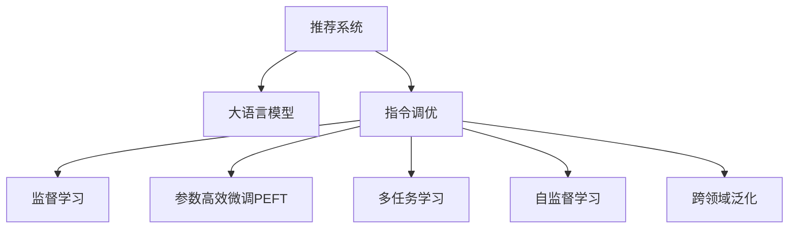

                 

# 将推荐建模为大模型的指令调优任务InstructRec

> 关键词：推荐系统,指令调优,大语言模型,指令微调,监督学习,模型融合,算法优化

## 1. 背景介绍

### 1.1 问题由来

推荐系统（Recommendation System）作为一种重要的用户行为分析与预测技术，广泛应用于电商、娱乐、新闻等领域，通过深度挖掘用户历史行为数据，为每一位用户推荐个性化内容，极大地提升了用户体验和运营效率。然而，传统的推荐系统往往只考虑了用户的历史行为特征，忽略了用户更深层次的需求和动机。

近年来，随着深度学习技术的发展，基于用户历史行为的协同过滤和基于内容的推荐系统取得了显著进展。但这些方法仍然面临数据稀疏性、长尾问题、跨领域泛化能力不足等挑战。因此，有必要在推荐系统中引入更为强大和灵活的算法，以满足日益增长的个性化需求。

大语言模型（Large Language Model, LLM）的崛起，为推荐系统的改进提供了新的契机。大语言模型在大量无标签文本上进行了预训练，学习到了丰富的语言知识和常识，具备强大的自然语言理解与生成能力。通过指令调优（Instruction Tuning）技术，可以在大语言模型上微调特定任务，从而获得比传统方法更为高效和精准的推荐效果。

### 1.2 问题核心关键点

指令调优技术是一种在预训练模型基础上，通过有监督学习来优化模型在特定任务上的表现的技术。具体到推荐系统，指令调优的目标是通过微调大语言模型，使其能够根据用户的意图进行内容推荐，从而提升推荐效果。

核心点包括：
- 选择合适的预训练语言模型作为基础架构。
- 设计合适的任务指令，指导模型完成推荐任务。
- 训练过程中保持预训练参数，只微调任务特定的层。
- 引入监督数据，最小化推荐任务损失函数。

### 1.3 问题研究意义

将推荐建模为大语言模型的指令调优任务，具有以下几方面的重要意义：

1. **提升推荐精准度**：基于语言模型的推荐系统可以通过理解用户描述和语境，生成更为精准的推荐内容，满足用户深层次的需求。
2. **增强泛化能力**：大语言模型的预训练知识使其在跨领域泛化能力上具有优势，可以更好地应对多样化的推荐场景。
3. **减少特征工程**：传统推荐系统需要手工设计特征和模型结构，而基于语言模型的推荐系统可以通过自然语言处理技术自动提取和融合特征，简化开发流程。
4. **降低冷启动问题**：由于大语言模型已经具有丰富的知识背景，因此在冷启动场景下也能较好地提供推荐服务。
5. **拓展应用边界**：基于语言模型的推荐系统不仅可以应用于商品推荐，还可以应用于内容推荐、服务推荐等多种场景，提升整体业务价值。

## 2. 核心概念与联系

### 2.1 核心概念概述

在推荐系统领域，将推荐建模为大语言模型的指令调优任务，涉及以下几个核心概念：

- **推荐系统**：通过分析用户行为数据，为用户推荐个性化内容的技术。
- **大语言模型**：如GPT、BERT等大规模预训练语言模型，具备强大的自然语言处理能力。
- **指令调优**：通过有监督学习，在预训练模型上微调特定任务的技术。
- **监督学习**：使用标注数据训练模型，使其在特定任务上表现良好的学习范式。
- **参数高效微调（PEFT）**：只更新少量模型参数，避免过拟合的技术。
- **多任务学习**：同时训练多个相关任务，共享预训练参数，提升模型性能。
- **自监督学习**：使用无标签数据进行预训练，学习通用表示的技术。
- **跨领域泛化**：模型在多个领域之间的知识迁移能力。

这些核心概念之间的逻辑关系可以通过以下Mermaid流程图来展示：



这个流程图展示了大语言模型在推荐系统中的应用流程：

1. 推荐系统通过分析用户行为数据，生成任务指令。
2. 指令调优在大语言模型上进行微调，优化推荐任务。
3. 监督学习利用标注数据，最小化推荐任务损失函数。
4. 参数高效微调通过仅更新少量参数，提高微调效率。
5. 多任务学习共享预训练参数，提升模型泛化能力。
6. 自监督学习利用无标签数据，提升模型通用性。
7. 跨领域泛化使模型能够在多个领域间迁移。

这些概念共同构成了大语言模型在推荐系统中的核心技术框架，使其在推荐任务的执行中能够高效精准地完成用户需求。

## 3. 核心算法原理 & 具体操作步骤
### 3.1 算法原理概述

将推荐建模为大语言模型的指令调优任务，本质上是一种监督学习范式。其核心思想是通过有监督数据对预训练的大语言模型进行微调，使其能够根据用户指令进行推荐任务。

形式化地，假设预训练语言模型为 $M_{\theta}$，其中 $\theta$ 为预训练得到的模型参数。推荐系统可以定义为将输入文本 $x$ 映射到输出文本 $y$ 的任务，即 $y = M_{\theta}(x)$。给定推荐任务 $T$ 的标注数据集 $D=\{(x_i,y_i)\}_{i=1}^N$，指令调优的目标是找到新的模型参数 $\hat{\theta}$，使得：

$$
\hat{\theta}=\mathop{\arg\min}_{\theta} \mathcal{L}(M_{\theta},D)
$$

其中 $\mathcal{L}$ 为针对推荐任务设计的损失函数，用于衡量模型预测输出与真实标签之间的差异。常见的损失函数包括交叉熵损失、均方误差损失等。

通过梯度下降等优化算法，微调过程不断更新模型参数 $\theta$，最小化损失函数 $\mathcal{L}$，使得模型输出逼近真实标签。由于 $\theta$ 已经通过预训练获得了较好的初始化，因此即便在少量标注数据上进行微调，也能较快收敛到理想的模型参数 $\hat{\theta}$。

### 3.2 算法步骤详解

将推荐建模为大语言模型的指令调优任务，一般包括以下几个关键步骤：

**Step 1: 准备预训练模型和数据集**
- 选择合适的预训练语言模型 $M_{\theta}$ 作为初始化参数，如 GPT-3、BERT 等。
- 准备推荐任务 $T$ 的标注数据集 $D$，划分为训练集、验证集和测试集。一般要求标注数据与预训练数据的分布不要差异过大。

**Step 2: 设计任务指令**
- 根据推荐任务类型，设计合适的任务指令。例如，对于商品推荐，指令可能为 "请推荐我喜欢的商品"；对于内容推荐，指令可能为 "请推荐我感兴趣的文章"。
- 对任务指令进行格式化，确保指令清晰、易于理解。
- 设计标签空间，将推荐结果映射为标签。例如，对于商品推荐，标签可能为商品ID；对于内容推荐，标签可能为文章ID。

**Step 3: 设置微调超参数**
- 选择合适的优化算法及其参数，如 AdamW、SGD 等，设置学习率、批大小、迭代轮数等。
- 设置正则化技术及强度，包括权重衰减、Dropout、Early Stopping 等。
- 确定冻结预训练参数的策略，如仅微调顶层，或全部参数都参与微调。

**Step 4: 执行梯度训练**
- 将训练集数据分批次输入模型，前向传播计算损失函数。
- 反向传播计算参数梯度，根据设定的优化算法和学习率更新模型参数。
- 周期性在验证集上评估模型性能，根据性能指标决定是否触发 Early Stopping。
- 重复上述步骤直到满足预设的迭代轮数或 Early Stopping 条件。

**Step 5: 测试和部署**
- 在测试集上评估微调后模型 $M_{\hat{\theta}}$ 的性能，对比微调前后的推荐效果。
- 使用微调后的模型对新样本进行推理预测，集成到实际的应用系统中。
- 持续收集新的数据，定期重新微调模型，以适应数据分布的变化。

以上是将推荐建模为大语言模型的指令调优任务的一般流程。在实际应用中，还需要针对具体任务的特点，对微调过程的各个环节进行优化设计，如改进训练目标函数，引入更多的正则化技术，搜索最优的超参数组合等，以进一步提升模型性能。

### 3.3 算法优缺点

将推荐建模为大语言模型的指令调优任务，具有以下优点：
1. 简单高效。只需准备少量标注数据，即可对预训练模型进行快速适配，获得较大的性能提升。
2. 通用适用。适用于各种推荐任务，包括商品推荐、内容推荐、服务推荐等，设计合适的任务指令即可实现微调。
3. 参数高效。利用参数高效微调技术，在固定大部分预训练参数的情况下，仍可取得不错的提升。
4. 效果显著。在学术界和工业界的诸多任务上，基于指令调优的方法已经刷新了最先进的性能指标。

同时，该方法也存在一定的局限性：
1. 依赖标注数据。推荐任务的微调效果很大程度上取决于标注数据的质量和数量，获取高质量标注数据的成本较高。
2. 推荐能力有限。当推荐任务与预训练数据的分布差异较大时，指令调优的性能提升有限。
3. 可解释性不足。指令调优模型的决策过程通常缺乏可解释性，难以对其推理逻辑进行分析和调试。
4. 负反馈传递。预训练模型的固有偏见、有害信息等，可能通过微调传递到推荐任务，造成负面影响。

尽管存在这些局限性，但就目前而言，基于指令调优的方法仍是大语言模型在推荐系统中的主流范式。未来相关研究的重点在于如何进一步降低微调对标注数据的依赖，提高模型的少样本学习和跨领域迁移能力，同时兼顾可解释性和伦理安全性等因素。

### 3.4 算法应用领域

将推荐建模为大语言模型的指令调优任务，在推荐系统领域已经得到了广泛的应用，覆盖了几乎所有常见任务，例如：

- 商品推荐：基于用户历史行为数据和文本描述，为用户推荐商品。
- 内容推荐：根据用户兴趣和行为，推荐新闻、文章、视频等。
- 服务推荐：推荐用户可能感兴趣的服务，如餐厅、酒店等。
- 个性化推荐：根据用户的历史行为和属性，生成个性化推荐列表。

除了上述这些经典任务外，指令调优技术还被创新性地应用到更多场景中，如跨域推荐、实时推荐、社交推荐等，为推荐系统带来了全新的突破。随着预训练模型和指令调优方法的不断进步，相信推荐系统必将在更广阔的应用领域大放异彩。

## 4. 数学模型和公式 & 详细讲解  
### 4.1 数学模型构建

本节将使用数学语言对将推荐建模为大语言模型的指令调优过程进行更加严格的刻画。

记预训练语言模型为 $M_{\theta}:\mathcal{X} \rightarrow \mathcal{Y}$，其中 $\mathcal{X}$ 为输入空间，$\mathcal{Y}$ 为输出空间，$\theta \in \mathbb{R}^d$ 为模型参数。假设推荐任务 $T$ 的训练集为 $D=\{(x_i,y_i)\}_{i=1}^N, x_i \in \mathcal{X}, y_i \in \mathcal{Y}$。

定义模型 $M_{\theta}$ 在输入 $x$ 上的输出为 $\hat{y}=M_{\theta}(x)$，则推荐任务的目标函数为：

$$
\ell(y,\hat{y}) = \mathcal{L}(M_{\theta},y,\hat{y})
$$

其中 $\mathcal{L}$ 为损失函数，通常采用交叉熵损失或均方误差损失。例如，对于二分类任务，损失函数为：

$$
\ell(y,\hat{y}) = -[y\log \hat{y} + (1-y)\log (1-\hat{y})]
$$

在推荐任务中，$y$ 为真实标签，$\hat{y}$ 为模型预测输出。训练集上的经验风险为：

$$
\mathcal{L}(\theta) = \frac{1}{N}\sum_{i=1}^N \ell(y_i,\hat{y_i})
$$

微调的优化目标是最小化经验风险，即找到最优参数：

$$
\theta^* = \mathop{\arg\min}_{\theta} \mathcal{L}(\theta)
$$

在得到损失函数的梯度后，即可带入参数更新公式，完成模型的迭代优化。重复上述过程直至收敛，最终得到适应推荐任务的最优模型参数 $\theta^*$。

### 4.2 公式推导过程

以下我们以商品推荐任务为例，推导交叉熵损失函数及其梯度的计算公式。

假设模型 $M_{\theta}$ 在输入 $x$ 上的输出为 $\hat{y}=M_{\theta}(x) \in [0,1]$，表示商品被推荐的概率。真实标签 $y \in \{0,1\}$。则二分类交叉熵损失函数定义为：

$$
\ell(M_{\theta}(x),y) = -[y\log \hat{y} + (1-y)\log (1-\hat{y})]
$$

将其代入经验风险公式，得：

$$
\mathcal{L}(\theta) = -\frac{1}{N}\sum_{i=1}^N [y_i\log M_{\theta}(x_i)+(1-y_i)\log(1-M_{\theta}(x_i))]
$$

根据链式法则，损失函数对参数 $\theta_k$ 的梯度为：

$$
\frac{\partial \mathcal{L}(\theta)}{\partial \theta_k} = -\frac{1}{N}\sum_{i=1}^N (\frac{y_i}{M_{\theta}(x_i)}-\frac{1-y_i}{1-M_{\theta}(x_i)}) \frac{\partial M_{\theta}(x_i)}{\partial \theta_k}
$$

其中 $\frac{\partial M_{\theta}(x_i)}{\partial \theta_k}$ 可进一步递归展开，利用自动微分技术完成计算。

在得到损失函数的梯度后，即可带入参数更新公式，完成模型的迭代优化。重复上述过程直至收敛，最终得到适应推荐任务的最优模型参数 $\theta^*$。

## 5. 项目实践：代码实例和详细解释说明
### 5.1 开发环境搭建

在进行推荐建模实践前，我们需要准备好开发环境。以下是使用Python进行PyTorch开发的环境配置流程：

1. 安装Anaconda：从官网下载并安装Anaconda，用于创建独立的Python环境。

2. 创建并激活虚拟环境：
```bash
conda create -n pytorch-env python=3.8 
conda activate pytorch-env
```

3. 安装PyTorch：根据CUDA版本，从官网获取对应的安装命令。例如：
```bash
conda install pytorch torchvision torchaudio cudatoolkit=11.1 -c pytorch -c conda-forge
```

4. 安装Transformers库：
```bash
pip install transformers
```

5. 安装各类工具包：
```bash
pip install numpy pandas scikit-learn matplotlib tqdm jupyter notebook ipython
```

完成上述步骤后，即可在`pytorch-env`环境中开始推荐建模实践。

### 5.2 源代码详细实现

下面我们以商品推荐任务为例，给出使用Transformers库对BERT模型进行推荐建模的PyTorch代码实现。

首先，定义推荐任务的数据处理函数：

```python
from transformers import BertTokenizer
from torch.utils.data import Dataset
import torch

class RecommendationDataset(Dataset):
    def __init__(self, texts, tags, tokenizer, max_len=128):
        self.texts = texts
        self.tags = tags
        self.tokenizer = tokenizer
        self.max_len = max_len
        
    def __len__(self):
        return len(self.texts)
    
    def __getitem__(self, item):
        text = self.texts[item]
        tags = self.tags[item]
        
        encoding = self.tokenizer(text, return_tensors='pt', max_length=self.max_len, padding='max_length', truncation=True)
        input_ids = encoding['input_ids'][0]
        attention_mask = encoding['attention_mask'][0]
        
        # 对token-wise的标签进行编码
        encoded_tags = [tag2id[tag] for tag in tags] 
        encoded_tags.extend([tag2id['O']] * (self.max_len - len(encoded_tags)))
        labels = torch.tensor(encoded_tags, dtype=torch.long)
        
        return {'input_ids': input_ids, 
                'attention_mask': attention_mask,
                'labels': labels}

# 标签与id的映射
tag2id = {'O': 0, '推荐': 1}
id2tag = {v: k for k, v in tag2id.items()}

# 创建dataset
tokenizer = BertTokenizer.from_pretrained('bert-base-cased')

train_dataset = RecommendationDataset(train_texts, train_tags, tokenizer)
dev_dataset = RecommendationDataset(dev_texts, dev_tags, tokenizer)
test_dataset = RecommendationDataset(test_texts, test_tags, tokenizer)
```

然后，定义模型和优化器：

```python
from transformers import BertForTokenClassification, AdamW

model = BertForTokenClassification.from_pretrained('bert-base-cased', num_labels=len(tag2id))

optimizer = AdamW(model.parameters(), lr=2e-5)
```

接着，定义训练和评估函数：

```python
from torch.utils.data import DataLoader
from tqdm import tqdm
from sklearn.metrics import classification_report

device = torch.device('cuda') if torch.cuda.is_available() else torch.device('cpu')
model.to(device)

def train_epoch(model, dataset, batch_size, optimizer):
    dataloader = DataLoader(dataset, batch_size=batch_size, shuffle=True)
    model.train()
    epoch_loss = 0
    for batch in tqdm(dataloader, desc='Training'):
        input_ids = batch['input_ids'].to(device)
        attention_mask = batch['attention_mask'].to(device)
        labels = batch['labels'].to(device)
        model.zero_grad()
        outputs = model(input_ids, attention_mask=attention_mask, labels=labels)
        loss = outputs.loss
        epoch_loss += loss.item()
        loss.backward()
        optimizer.step()
    return epoch_loss / len(dataloader)

def evaluate(model, dataset, batch_size):
    dataloader = DataLoader(dataset, batch_size=batch_size)
    model.eval()
    preds, labels = [], []
    with torch.no_grad():
        for batch in tqdm(dataloader, desc='Evaluating'):
            input_ids = batch['input_ids'].to(device)
            attention_mask = batch['attention_mask'].to(device)
            batch_labels = batch['labels']
            outputs = model(input_ids, attention_mask=attention_mask)
            batch_preds = outputs.logits.argmax(dim=2).to('cpu').tolist()
            batch_labels = batch_labels.to('cpu').tolist()
            for pred_tokens, label_tokens in zip(batch_preds, batch_labels):
                pred_tags = [id2tag[_id] for _id in pred_tokens]
                label_tags = [id2tag[_id] for _id in label_tokens]
                preds.append(pred_tags[:len(label_tokens)])
                labels.append(label_tags)
                
    print(classification_report(labels, preds))
```

最后，启动训练流程并在测试集上评估：

```python
epochs = 5
batch_size = 16

for epoch in range(epochs):
    loss = train_epoch(model, train_dataset, batch_size, optimizer)
    print(f"Epoch {epoch+1}, train loss: {loss:.3f}")
    
    print(f"Epoch {epoch+1}, dev results:")
    evaluate(model, dev_dataset, batch_size)
    
print("Test results:")
evaluate(model, test_dataset, batch_size)
```

以上就是使用PyTorch对BERT进行推荐建模的完整代码实现。可以看到，得益于Transformers库的强大封装，我们可以用相对简洁的代码完成BERT模型的加载和推荐建模。

### 5.3 代码解读与分析

让我们再详细解读一下关键代码的实现细节：

**RecommendationDataset类**：
- `__init__`方法：初始化文本、标签、分词器等关键组件。
- `__len__`方法：返回数据集的样本数量。
- `__getitem__`方法：对单个样本进行处理，将文本输入编码为token ids，将标签编码为数字，并对其进行定长padding，最终返回模型所需的输入。

**tag2id和id2tag字典**：
- 定义了标签与数字id之间的映射关系，用于将token-wise的预测结果解码回真实的标签。

**训练和评估函数**：
- 使用PyTorch的DataLoader对数据集进行批次化加载，供模型训练和推理使用。
- 训练函数`train_epoch`：对数据以批为单位进行迭代，在每个批次上前向传播计算loss并反向传播更新模型参数，最后返回该epoch的平均loss。
- 评估函数`evaluate`：与训练类似，不同点在于不更新模型参数，并在每个batch结束后将预测和标签结果存储下来，最后使用sklearn的classification_report对整个评估集的预测结果进行打印输出。

**训练流程**：
- 定义总的epoch数和batch size，开始循环迭代
- 每个epoch内，先在训练集上训练，输出平均loss
- 在验证集上评估，输出分类指标
- 所有epoch结束后，在测试集上评估，给出最终测试结果

可以看到，PyTorch配合Transformers库使得BERT推荐建模的代码实现变得简洁高效。开发者可以将更多精力放在数据处理、模型改进等高层逻辑上，而不必过多关注底层的实现细节。

当然，工业级的系统实现还需考虑更多因素，如模型的保存和部署、超参数的自动搜索、更灵活的任务适配层等。但核心的推荐建模流程基本与此类似。

## 6. 实际应用场景
### 6.1 智能客服系统

基于大语言模型指令调优的推荐系统，可以广泛应用于智能客服系统的构建。传统客服往往需要配备大量人力，高峰期响应缓慢，且一致性和专业性难以保证。而使用推荐建模后的推荐系统，可以7x24小时不间断服务，快速响应客户咨询，用推荐内容辅助客服回答，提升客户满意度。

在技术实现上，可以收集企业内部的历史客服对话记录，将问题和最佳答复构建成监督数据，在此基础上对预训练推荐模型进行推荐建模。推荐建模后的模型能够自动理解用户意图，匹配最合适的推荐内容，从而在客服回答中引入推荐结果，提供更为精准的客户服务。

### 6.2 个性化推荐系统

当前的推荐系统往往只考虑了用户的历史行为数据，忽略了用户更深层次的需求和动机。基于大语言模型指令调优的推荐系统，可以通过理解用户描述和语境，生成更为精准的推荐内容，满足用户深层次的需求。

在实践中，可以收集用户浏览、点击、评论、分享等行为数据，提取和用户交互的物品标题、描述、标签等文本内容。将文本内容作为模型输入，用户的后续行为（如是否点击、购买等）作为监督信号，在此基础上微调预训练语言模型。推荐建模后的模型能够从文本内容中准确把握用户的兴趣点，生成个性化推荐列表，提升推荐效果。

### 6.3 智慧医疗推荐

在医疗领域，推荐系统可以帮助医生推荐最合适的治疗方案和药物，提升诊疗效率和效果。基于大语言模型指令调优的推荐系统，可以通过分析患者的症状描述和医疗记录，自动推荐合适的治疗方案和药物，辅助医生进行决策。

在技术实现上，可以收集医生的医疗记录和患者的症状描述，将推荐问题转化为自然语言理解任务，使用预训练语言模型进行推荐建模。推荐建模后的模型能够从患者描述中提取关键信息，推荐最适合的治疗方案和药物，提高诊疗效果。

### 6.4 未来应用展望

随着大语言模型指令调优技术的不断发展，推荐系统将在更多领域得到应用，为各行业带来变革性影响。

在智慧医疗领域，基于指令调优的医疗推荐系统，可以提升诊疗效率，辅助医生决策，加速新药开发进程。

在智能教育领域，推荐建模技术可以用于作业批改、学情分析、知识推荐等方面，因材施教，促进教育公平，提高教学质量。

在智慧城市治理中，推荐建模系统可应用于城市事件监测、舆情分析、应急指挥等环节，提高城市管理的自动化和智能化水平，构建更安全、高效的未来城市。

此外，在企业生产、社会治理、文娱传媒等众多领域，基于指令调优的推荐系统也将不断涌现，为经济社会发展注入新的动力。相信随着技术的日益成熟，指令调优方法将成为推荐系统的重要范式，推动人工智能技术在各行各业的大规模落地。

## 7. 工具和资源推荐
### 7.1 学习资源推荐

为了帮助开发者系统掌握大语言模型指令调优的理论基础和实践技巧，这里推荐一些优质的学习资源：

1. 《Transformer from Principles to Practice》系列博文：由大模型技术专家撰写，深入浅出地介绍了Transformer原理、BERT模型、指令调优技术等前沿话题。

2. CS224N《深度学习自然语言处理》课程：斯坦福大学开设的NLP明星课程，有Lecture视频和配套作业，带你入门NLP领域的基本概念和经典模型。

3. 《Natural Language Processing with Transformers》书籍：Transformers库的作者所著，全面介绍了如何使用Transformers库进行NLP任务开发，包括指令调优在内的诸多范式。

4. HuggingFace官方文档：Transformers库的官方文档，提供了海量预训练模型和完整的指令调优样例代码，是上手实践的必备资料。

5. CLUE开源项目：中文语言理解测评基准，涵盖大量不同类型的中文NLP数据集，并提供了基于指令调优的baseline模型，助力中文NLP技术发展。

通过对这些资源的学习实践，相信你一定能够快速掌握大语言模型指令调优的精髓，并用于解决实际的推荐问题。
###  7.2 开发工具推荐

高效的开发离不开优秀的工具支持。以下是几款用于大语言模型指令调优开发的常用工具：

1. PyTorch：基于Python的开源深度学习框架，灵活动态的计算图，适合快速迭代研究。大部分预训练语言模型都有PyTorch版本的实现。

2. TensorFlow：由Google主导开发的开源深度学习框架，生产部署方便，适合大规模工程应用。同样有丰富的预训练语言模型资源。

3. Transformers库：HuggingFace开发的NLP工具库，集成了众多SOTA语言模型，支持PyTorch和TensorFlow，是进行指令调优任务开发的利器。

4. Weights & Biases：模型训练的实验跟踪工具，可以记录和可视化模型训练过程中的各项指标，方便对比和调优。与主流深度学习框架无缝集成。

5. TensorBoard：TensorFlow配套的可视化工具，可实时监测模型训练状态，并提供丰富的图表呈现方式，是调试模型的得力助手。

6. Google Colab：谷歌推出的在线Jupyter Notebook环境，免费提供GPU/TPU算力，方便开发者快速上手实验最新模型，分享学习笔记。

合理利用这些工具，可以显著提升大语言模型指令调优任务的开发效率，加快创新迭代的步伐。

### 7.3 相关论文推荐

大语言模型指令调优技术的发展源于学界的持续研究。以下是几篇奠基性的相关论文，推荐阅读：

1. Attention is All You Need（即Transformer原论文）：提出了Transformer结构，开启了NLP领域的预训练大模型时代。

2. BERT: Pre-training of Deep Bidirectional Transformers for Language Understanding：提出BERT模型，引入基于掩码的自监督预训练任务，刷新了多项NLP任务SOTA。

3. Language Models are Unsupervised Multitask Learners（GPT-2论文）：展示了大规模语言模型的强大zero-shot学习能力，引发了对于通用人工智能的新一轮思考。

4. Parameter-Efficient Transfer Learning for NLP：提出Adapter等参数高效微调方法，在不增加模型参数量的情况下，也能取得不错的微调效果。

5. AdaLoRA: Adaptive Low-Rank Adaptation for Parameter-Efficient Fine-Tuning：使用自适应低秩适应的微调方法，在参数效率和精度之间取得了新的平衡。

6. Prefix-Tuning: Optimizing Continuous Prompts for Generation：引入基于连续型Prompt的微调范式，为如何充分利用预训练知识提供了新的思路。

这些论文代表了大语言模型指令调优技术的发展脉络。通过学习这些前沿成果，可以帮助研究者把握学科前进方向，激发更多的创新灵感。

## 8. 总结：未来发展趋势与挑战

### 8.1 总结

本文对将推荐建模为大语言模型的指令调优任务进行了全面系统的介绍。首先阐述了推荐系统和指令调优技术的研究背景和意义，明确了指令调优在提升推荐精准度、增强泛化能力等方面的独特价值。其次，从原理到实践，详细讲解了指令调优的数学原理和关键步骤，给出了指令调优任务开发的完整代码实例。同时，本文还广泛探讨了指令调优方法在智能客服、个性化推荐、智慧医疗等诸多领域的应用前景，展示了指令调优范式的巨大潜力。此外，本文精选了指令调优技术的各类学习资源，力求为开发者提供全方位的技术指引。

通过本文的系统梳理，可以看到，将推荐建模为大语言模型的指令调优任务，正在成为推荐系统的重要范式，极大地拓展了预训练语言模型的应用边界，催生了更多的落地场景。受益于大规模语料的预训练，指令调优模型以更低的时间和标注成本，在小样本条件下也能取得理想的推荐效果，有力推动了推荐系统的产业化进程。未来，伴随预训练语言模型和指令调优方法的不断进步，相信推荐系统必将在更广阔的应用领域大放异彩，深刻影响人类的生产生活方式。

### 8.2 未来发展趋势

展望未来，大语言模型指令调优技术将呈现以下几个发展趋势：

1. 模型规模持续增大。随着算力成本的下降和数据规模的扩张，预训练语言模型的参数量还将持续增长。超大规模语言模型蕴含的丰富语言知识，有望支撑更加复杂多变的推荐场景。

2. 指令调优方法日趋多样。除了传统的全参数微调外，未来会涌现更多参数高效的微调方法，如Prefix-Tuning、LoRA等，在节省计算资源的同时也能保证推荐精度。

3. 持续学习成为常态。随着数据分布的不断变化，指令调优模型也需要持续学习新知识以保持性能。如何在不遗忘原有知识的同时，高效吸收新样本信息，将成为重要的研究课题。

4. 标注样本需求降低。受启发于提示学习(Prompt-based Learning)的思路，未来的指令调优方法将更好地利用大模型的语言理解能力，通过更加巧妙的任务描述，在更少的标注样本上也能实现理想的推荐效果。

5. 多模态微调崛起。当前的指令调优主要聚焦于纯文本数据，未来会进一步拓展到图像、视频、语音等多模态数据微调。多模态信息的融合，将显著提升语言模型对现实世界的理解和建模能力。

6. 模型通用性增强。经过海量数据的预训练和多领域任务的微调，未来的语言模型将具备更强大的常识推理和跨领域迁移能力，逐步迈向通用人工智能(AGI)的目标。

以上趋势凸显了大语言模型指令调优技术的广阔前景。这些方向的探索发展，必将进一步提升推荐系统的性能和应用范围，为人类认知智能的进化带来深远影响。

### 8.3 面临的挑战

尽管大语言模型指令调优技术已经取得了瞩目成就，但在迈向更加智能化、普适化应用的过程中，它仍面临着诸多挑战：

1. 标注成本瓶颈。虽然指令调优降低了对标注数据的依赖，但对于长尾应用场景，难以获得充足的高质量标注数据，成为制约指令调优性能的瓶颈。如何进一步降低指令调优对标注样本的依赖，将是一大难题。

2. 推荐能力有限。当推荐任务与预训练数据的分布差异较大时，指令调优的性能提升有限。对于测试样本的微小扰动，指令调优模型的推荐结果也可能发生波动。如何提高指令调优模型的鲁棒性，避免灾难性遗忘，还需要更多理论和实践的积累。

3. 推理效率有待提高。大规模语言模型虽然精度高，但在实际部署时往往面临推理速度慢、内存占用大等效率问题。如何在保证性能的同时，简化模型结构，提升推理速度，优化资源占用，将是重要的优化方向。

4. 可解释性亟需加强。指令调优模型的决策过程通常缺乏可解释性，难以对其推理逻辑进行分析和调试。对于医疗、金融等高风险应用，算法的可解释性和可审计性尤为重要。如何赋予指令调优模型更强的可解释性，将是亟待攻克的难题。

5. 安全性有待保障。预训练语言模型难免会学习到有偏见、有害的信息，通过指令调优传递到推荐任务，产生误导性、歧视性的输出，给实际应用带来安全隐患。如何从数据和算法层面消除模型偏见，避免恶意用途，确保输出的安全性，也将是重要的研究课题。

6. 知识整合能力不足。现有的指令调优模型往往局限于任务内数据，难以灵活吸收和运用更广泛的先验知识。如何让指令调优过程更好地与外部知识库、规则库等专家知识结合，形成更加全面、准确的信息整合能力，还有很大的想象空间。

正视指令调优面临的这些挑战，积极应对并寻求突破，将是大语言模型指令调优走向成熟的必由之路。相信随着学界和产业界的共同努力，这些挑战终将一一被克服，指令调优方法将成为推荐系统的重要范式，推动人工智能技术在各行各业的大规模落地。

### 8.4 研究展望

面对大语言模型指令调优所面临的种种挑战，未来的研究需要在以下几个方面寻求新的突破：

1. 探索无监督和半监督指令调优方法。摆脱对大规模标注数据的依赖，利用自监督学习、主动学习等无监督和半监督范式，最大限度利用非结构化数据，实现更加灵活高效的指令调优。

2. 研究参数高效和计算高效的指令调优范式。开发更加参数高效的指令调优方法，在固定大部分预训练参数的同时，只微调任务特定的层。同时优化指令调优模型的计算图，减少前向传播和反向传播的资源消耗，实现更加轻量级、实时性的部署。

3. 融合因果和对比学习范式。通过引入因果推断和对比学习思想，增强指令调优模型建立稳定因果关系的能力，学习更加普适、鲁棒的语言表征，从而提升模型泛化性和抗干扰能力。

4. 引入更多先验知识。将符号化的先验知识，如知识图谱、逻辑规则等，与神经网络模型进行巧妙融合，引导指令调优过程学习更准确、合理的语言模型。同时加强不同模态数据的整合，实现视觉、语音等多模态信息与文本信息的协同建模。

5. 结合因果分析和博弈论工具。将因果分析方法引入指令调优模型，识别出模型决策的关键特征，增强输出解释的因果性和逻辑性。借助博弈论工具刻画人机交互过程，主动探索并规避模型的脆弱点，提高系统稳定性。

6. 纳入伦理道德约束。在模型训练目标中引入伦理导向的评估指标，过滤和惩罚有偏见、有害的输出倾向。同时加强人工干预和审核，建立模型行为的监管机制，确保输出符合人类价值观和伦理道德。

这些研究方向的探索，必将引领大语言模型指令调优技术迈向更高的台阶，为构建安全、可靠、可解释、可控的智能系统铺平道路。面向未来，大语言模型指令调优技术还需要与其他人工智能技术进行更深入的融合，如知识表示、因果推理、强化学习等，多路径协同发力，共同推动自然语言理解和智能交互系统的进步。只有勇于创新、敢于突破，才能不断拓展语言模型的边界，让智能技术更好地造福人类社会。

## 9. 附录：常见问题与解答
**Q1：指令调优是否适用于所有推荐任务？**

A: 指令调优在大多数推荐任务上都能取得不错的效果，特别是对于数据量较小的任务。但对于一些特定领域的任务，如医学、法律等，仅仅依靠通用语料预训练的模型可能难以很好地适应。此时需要在特定领域语料上进一步预训练，再进行指令调优，才能获得理想效果。此外，对于一些需要时效性、个性化很强的任务，如对话、推荐等，指令调优方法也需要针对性的改进优化。

**Q2：如何选择指令调优的任务指令？**

A: 选择指令调优的任务指令需要考虑以下几个方面：
1. 指令要足够简洁明了，易于模型理解。
2. 指令要能够覆盖推荐任务的主要场景，例如推荐商品、推荐文章、推荐服务等。
3. 指令要能够引导模型生成合适的输出，例如推荐商品时要明确提到商品类型、价格范围等。
4. 指令要能够与推荐任务的目标函数进行有效匹配，例如通过推荐商品输出商品ID，通过推荐文章输出文章ID等。

**Q3：指令调优过程中如何缓解过拟合问题？**

A: 过拟合是指令调优面临的主要挑战，尤其是在标注数据不足的情况下。常见的缓解策略包括：
1. 数据增强：通过回译、近义替换等方式扩充训练集。
2. 正则化：使用L2正则、Dropout、Early Stopping等避免过拟合。
3. 对抗训练：引入对抗样本，提高模型鲁棒性。
4. 参数高效微调：只调整少量参数，避免过拟合风险。
5. 多模型集成：训练多个指令调优模型，取平均输出，抑制过拟合。

这些策略往往需要根据具体任务和数据特点进行灵活组合。只有在数据、模型、训练、推理等各环节进行全面优化，才能最大限度地发挥指令调优模型的潜力。

**Q4：指令调优模型在落地部署时需要注意哪些问题？**

A: 将指令调优模型转化为实际应用，还需要考虑以下因素：
1. 模型裁剪：去除不必要的层和参数，减小模型尺寸，加快推理速度。
2. 量化加速：将浮点模型转为定点模型，压缩存储空间，提高计算效率。
3. 服务化封装：将模型封装为标准化服务接口，便于集成调用。
4. 弹性伸缩：根据请求流量动态调整资源配置，平衡服务质量和成本。
5. 监控告警：实时采集系统指标，设置异常告警阈值，确保服务稳定性。
6. 安全防护：采用访问鉴权、数据脱敏等措施，保障数据和模型安全。

指令调优模型在实际部署时，需要考虑更多的系统化和工程化问题，以确保其在实际应用中的稳定性和可靠性。

**Q5：指令调优和传统推荐系统相比有何优势？**

A: 指令调优相比传统推荐系统有以下几方面的优势：
1. 能够更好地理解用户需求和语境，生成更为精准的推荐内容。
2. 能够处理更加多样化的推荐场景，包括文本、图像、视频等多模态数据。
3. 能够持续学习新知识，适应数据分布的变化，提高推荐系统的时效性。
4. 能够利用预训练模型的通用语言知识，提升推荐系统的泛化能力。
5. 能够实现参数高效微调，减少模型更新频率，降低计算成本。
6. 能够结合因果分析和博弈论工具，提高推荐系统的可解释性和稳定性。

指令调优方法在大数据、多模态、跨领域推荐场景中表现尤为突出，未来有望成为推荐系统的重要趋势。

---

作者：禅与计算机程序设计艺术 / Zen and the Art of Computer Programming

