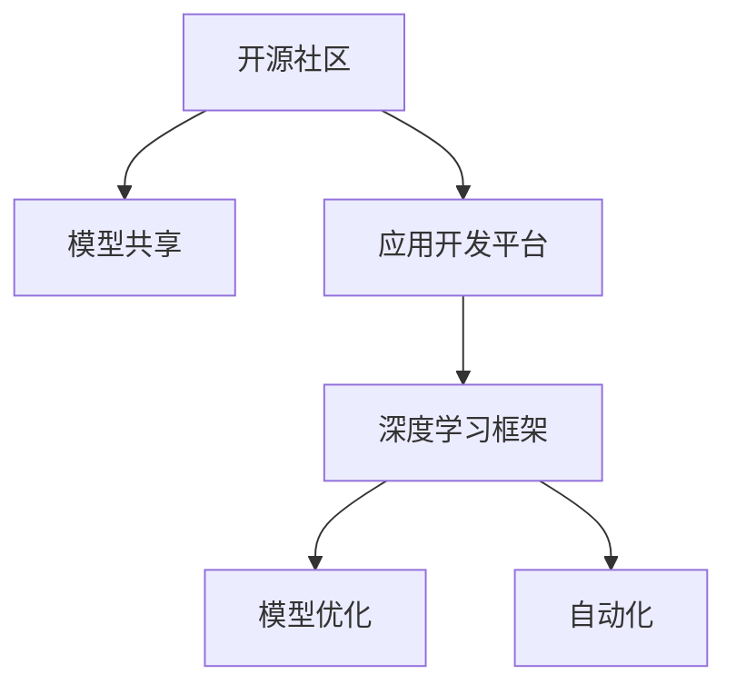

                 

# 小语言模型的开源生态:模型共享和应用开发平台

> 关键词：开源社区,模型共享,应用开发平台,深度学习框架,自动化,模型优化

## 1. 背景介绍

### 1.1 问题由来
随着人工智能技术的快速发展，深度学习模型已经在图像识别、自然语言处理、语音识别等众多领域取得了突破性进展。其中，语言模型作为重要的基础组件，被广泛应用于语音识别、文本生成、机器翻译等众多任务中。然而，传统的深度学习模型通常是黑盒式的，难以被外部理解和利用。这限制了深度学习技术在行业应用中的推广和落地。

为了解决这一问题，学术界和工业界共同推动了开源生态的建设，使得深度学习模型更容易被开发者共享和复用。模型共享和应用开发平台的建设，使得深度学习技术更加透明、可控，也为行业应用提供了强大的技术支持。

### 1.2 问题核心关键点
模型共享和应用开发平台的核心在于实现深度学习模型的开放化和便捷化。具体来说，包括：

- 开源社区：提供深度学习模型的开源实现，促进技术交流和合作。
- 模型共享：构建统一的标准和接口，实现深度学习模型在云端和本地环境间的自由迁移。
- 应用开发平台：提供简单易用的开发工具和API接口，帮助开发者快速构建和部署应用。
- 模型优化：提供模型压缩、量化等技术，减小模型体积，加速推理速度。
- 自动化：提供自动调参、超参数优化等自动化工具，提升开发效率。

这些关键点的实现，为深度学习模型的广泛应用奠定了坚实的基础。

### 1.3 问题研究意义
研究模型共享和应用开发平台，对于拓展深度学习技术的应用范围，提升开发效率，加速行业应用落地，具有重要意义：

1. 降低应用开发成本。模型共享平台提供了丰富的模型资源，大大降低了从头开发模型和应用的成本。
2. 提升模型性能。应用开发平台提供了自动化调参和超参数优化等工具，能显著提升模型的性能表现。
3. 加速技术迭代。模型共享和应用开发平台使得深度学习技术能够快速迭代和传播，缩短行业应用开发周期。
4. 促进技术标准化。通过构建统一的标准和接口，促进深度学习技术在行业应用中的标准化和规范化。
5. 赋能产业升级。深度学习技术在各行业的落地应用，为传统行业数字化转型提供了新的动力。

## 2. 核心概念与联系

### 2.1 核心概念概述

为更好地理解模型共享和应用开发平台，本节将介绍几个密切相关的核心概念：

- 开源社区(Open Source Community)：由开发者和研究者共同构建和维护的、开放的、协作的软件项目平台，如GitHub。
- 模型共享(Model Sharing)：指将深度学习模型和其相关的代码、文档、数据等资源，以开放的方式分享给其他开发者和研究者。
- 应用开发平台(Development Platform)：提供易用的API接口和开发工具，支持开发者快速构建和部署应用。
- 深度学习框架(Deep Learning Framework)：如TensorFlow、PyTorch等，提供高效易用的深度学习计算图和模型构建接口。
- 模型优化(Model Optimization)：如模型压缩、量化等，减小模型体积，加速推理速度。
- 自动化(Automation)：如自动调参、超参数优化等，提升模型开发和优化效率。

这些核心概念之间的逻辑关系可以通过以下Mermaid流程图来展示：



这个流程图展示了一系列关键概念及其之间的关系：

1. 开源社区通过构建和维护深度学习模型，为模型共享和应用开发提供基础资源。
2. 模型共享将模型资源开放化，促进技术交流和合作。
3. 应用开发平台通过提供易用的开发工具和API接口，支持模型应用构建。
4. 深度学习框架提供高效易用的模型构建接口，是模型共享和应用开发的基础技术。
5. 模型优化减小模型体积，加速推理速度，提升模型应用效率。
6. 自动化工具提升模型开发和优化效率，提升整体开发速度。

这些概念共同构成了深度学习模型的开源生态，为其在各行各业的应用提供了强大支撑。

## 3. 核心算法原理 & 具体操作步骤
### 3.1 算法原理概述

模型共享和应用开发平台的建设，本质上是一个软件开发和优化过程。其核心思想是：通过构建开放化的模型资源库和易用的应用开发工具，使得深度学习模型能够更加便捷地被开发者共享和使用。

形式化地，假设有一个开源社区A，包含了若干深度学习模型 $M=\{M_1,M_2,...,M_n\}$，每个模型 $M_i$ 包含权重 $w_i$ 和结构信息 $S_i$。给定一个应用场景 $S$，通过应用开发平台C，可以构建一个应用 $A_S$。模型共享和应用开发平台的优化目标是最小化应用 $A_S$ 在特定场景 $S$ 下的损失函数，即：

$$
\min_{S} \mathcal{L}(A_S, S)
$$

其中 $\mathcal{L}$ 为应用 $A_S$ 在场景 $S$ 下的损失函数，用于衡量模型输出与真实标签之间的差异。

通过优化目标函数 $\mathcal{L}$，我们可以找到最优的应用 $A_S$，使得其适应特定场景 $S$ 下的性能最佳。同时，在模型优化和应用构建过程中，可以应用模型压缩、量化等技术，减小模型体积，加速推理速度。

### 3.2 算法步骤详解

基于模型共享和应用开发平台的优化方法，一般包括以下几个关键步骤：

**Step 1: 准备开源社区资源**
- 选择一个或多个开源社区，如GitHub、Gitee等，收集和筛选深度学习模型资源。
- 构建模型仓库，提供代码、权重、文档等资源的下载接口。

**Step 2: 设计应用开发接口**
- 根据应用场景，设计易用的API接口，支持模型加载、推理、优化等操作。
- 提供模型可视化工具，帮助开发者理解模型结构和输出。

**Step 3: 引入模型优化技术**
- 应用模型压缩、量化等技术，减小模型体积，加速推理速度。
- 应用自动调参和超参数优化等自动化工具，提升模型性能。

**Step 4: 执行模型应用构建**
- 将选择的模型加载到应用开发平台，通过API接口进行推理操作。
- 根据应用场景和性能需求，配置模型优化策略。

**Step 5: 测试和部署**
- 在目标场景上评估模型性能，记录应用指标。
- 将模型应用部署到实际环境中，持续收集新数据，进行模型迭代和优化。

以上是模型共享和应用开发平台的一般流程。在实际应用中，还需要针对具体场景的特点，对模型选择、优化策略、接口设计等环节进行优化设计，以进一步提升模型性能。

### 3.3 算法优缺点

模型共享和应用开发平台具有以下优点：
1. 开放透明。开源社区和模型共享平台提供了丰富的模型资源和开源代码，方便开发者使用和改进。
2. 易用高效。应用开发平台提供了易用的API接口和自动化工具，支持模型快速构建和优化。
3. 降低成本。开源社区和模型共享平台减少了从头开发模型和应用的成本投入。
4. 提高性能。应用开发平台支持模型优化和自动化调参，提升了模型性能表现。

同时，该方法也存在一定的局限性：
1. 依赖开源社区资源。模型共享平台的效果很大程度上取决于开源社区资源的质量和多样性。
2. 数据隐私风险。模型共享可能涉及敏感数据，存在隐私泄露的风险。
3. 模型泛化能力。开源社区的模型可能并非完全适用于所有场景，泛化能力有限。
4. 复杂度增加。应用开发平台需要引入更多技术细节，增加了开发复杂度。

尽管存在这些局限性，但就目前而言，模型共享和应用开发平台仍是大规模应用深度学习模型的重要手段。未来相关研究的重点在于如何进一步提升平台资源的质量和多样性，降低数据隐私风险，提高模型泛化能力，同时兼顾易用性和性能提升。

### 3.4 算法应用领域

模型共享和应用开发平台已经在众多领域得到了广泛的应用，例如：

- 图像识别：如物体检测、图像分类等。通过模型共享平台，可以快速获取高质量的预训练模型，进行微调和部署。
- 自然语言处理：如机器翻译、文本生成、情感分析等。通过模型共享平台，可以获取多语言模型的预训练权重，构建应用系统。
- 语音识别：如语音转文本、语音合成等。通过模型共享平台，可以获取高质量的语音模型，进行本地部署。
- 智能推荐：如个性化推荐系统、广告推荐等。通过模型共享平台，可以快速获取推荐模型的预训练权重，构建推荐应用。
- 智能医疗：如医学影像诊断、智能问诊等。通过模型共享平台，可以快速获取医疗模型的预训练权重，辅助医生诊断。
- 金融分析：如信用评估、欺诈检测等。通过模型共享平台，可以获取金融模型的预训练权重，进行风险控制和决策支持。

除了上述这些经典应用外，模型共享和应用开发平台还被创新性地应用到更多场景中，如自动驾驶、智能家居、智慧城市等，为各行各业带来了新的技术突破。随着开源社区和平台技术的持续演进，相信深度学习模型将在更广阔的应用领域大放异彩。

## 4. 数学模型和公式 & 详细讲解  
### 4.1 数学模型构建

本节将使用数学语言对模型共享和应用开发平台进行更加严格的刻画。

记深度学习模型为 $M_i:\mathcal{X} \rightarrow \mathcal{Y}$，其中 $\mathcal{X}$ 为输入空间，$\mathcal{Y}$ 为输出空间，$w_i$ 为模型权重。假设模型 $M_i$ 在输入 $x$ 上的输出为 $y_i=M_i(x)$。在模型共享平台中，通过应用开发平台C，可以构建一个应用 $A_S$，用于特定场景 $S$。

应用 $A_S$ 在场景 $S$ 下的损失函数定义为：

$$
\mathcal{L}(A_S, S) = \frac{1}{N}\sum_{i=1}^N \ell(y_i, A_S(x_i))
$$

其中 $y_i$ 为场景 $S$ 下输入 $x_i$ 的真实标签，$\ell$ 为损失函数，通常使用交叉熵损失或均方误差损失。

在模型共享平台中，应用 $A_S$ 的构建通常包含以下几个步骤：

1. 选择预训练模型 $M_i$。
2. 应用自动调参和超参数优化工具，调整模型 $M_i$ 的参数，使其适应场景 $S$。
3. 应用模型压缩、量化等技术，减小模型体积。
4. 应用API接口，将优化后的模型 $M_i$ 加载到应用 $A_S$ 中。

通过最小化损失函数 $\mathcal{L}(A_S, S)$，优化目标函数 $\mathcal{L}(A_S, S)$，可以构建最优的应用 $A_S$。

### 4.2 公式推导过程

以下我们以二分类任务为例，推导最小化损失函数的优化过程。

假设模型 $M_i$ 在输入 $x$ 上的输出为 $y_i=M_i(x)$，真实标签为 $y \in \{0,1\}$。则应用 $A_S$ 在场景 $S$ 下的损失函数定义为：

$$
\mathcal{L}(A_S, S) = -\frac{1}{N}\sum_{i=1}^N [y_i\log A_S(x_i)+(1-y_i)\log(1-A_S(x_i))]
$$

通过梯度下降等优化算法，最小化损失函数 $\mathcal{L}(A_S, S)$，得到应用 $A_S$ 的优化目标函数 $\mathcal{L}(A_S, S)$。在应用开发平台C的支持下，可以通过API接口进行模型的加载、优化和部署，从而构建出适应场景 $S$ 的深度学习应用 $A_S$。

### 4.3 案例分析与讲解

**案例：二分类任务应用开发**

假设我们需要构建一个场景为信用卡欺诈检测的二分类任务应用 $A_S$。在模型共享平台中，选择一个预训练模型 $M_i$，通过API接口将模型加载到应用 $A_S$ 中。应用开发平台C提供自动调参和超参数优化工具，帮助调整模型参数，使其适应欺诈检测任务。同时，应用开发平台支持模型压缩和量化技术，减小模型体积，加速推理速度。最终，通过API接口进行模型部署，构建出适应信用卡欺诈检测场景的应用 $A_S$。

**案例：自然语言处理应用开发**

假设我们需要构建一个场景为文本情感分析的应用 $A_S$。在模型共享平台中，选择一个预训练模型 $M_i$，通过API接口将模型加载到应用 $A_S$ 中。应用开发平台C提供自动调参和超参数优化工具，帮助调整模型参数，使其适应情感分析任务。同时，应用开发平台支持模型压缩和量化技术，减小模型体积，加速推理速度。最终，通过API接口进行模型部署，构建出适应文本情感分析场景的应用 $A_S$。

以上案例展示了模型共享和应用开发平台在实际应用中的通用性和灵活性。通过构建应用 $A_S$，我们可以快速获取深度学习模型的应用能力，并将其部署到实际应用场景中，提升工作效率和应用效果。

## 5. 项目实践：代码实例和详细解释说明
### 5.1 开发环境搭建

在进行应用开发实践前，我们需要准备好开发环境。以下是使用Python进行PyTorch开发的环境配置流程：

1. 安装Anaconda：从官网下载并安装Anaconda，用于创建独立的Python环境。

2. 创建并激活虚拟环境：
```bash
conda create -n pytorch-env python=3.8 
conda activate pytorch-env
```

3. 安装PyTorch：根据CUDA版本，从官网获取对应的安装命令。例如：
```bash
conda install pytorch torchvision torchaudio cudatoolkit=11.1 -c pytorch -c conda-forge
```

4. 安装各类工具包：
```bash
pip install numpy pandas scikit-learn matplotlib tqdm jupyter notebook ipython
```

完成上述步骤后，即可在`pytorch-env`环境中开始应用开发实践。

### 5.2 源代码详细实现

下面我们以信用卡欺诈检测任务为例，给出使用Transformers库对BERT模型进行微调的PyTorch代码实现。

首先，定义任务的数据处理函数：

```python
from transformers import BertTokenizer
from torch.utils.data import Dataset
import torch

class FraudDetectionDataset(Dataset):
    def __init__(self, texts, labels, tokenizer, max_len=128):
        self.texts = texts
        self.labels = labels
        self.tokenizer = tokenizer
        self.max_len = max_len
        
    def __len__(self):
        return len(self.texts)
    
    def __getitem__(self, item):
        text = self.texts[item]
        label = self.labels[item]
        
        encoding = self.tokenizer(text, return_tensors='pt', max_length=self.max_len, padding='max_length', truncation=True)
        input_ids = encoding['input_ids'][0]
        attention_mask = encoding['attention_mask'][0]
        
        # 对token-wise的标签进行编码
        encoded_label = label2id[label] 
        encoded_label.extend([label2id['0']] * (self.max_len - 1))
        labels = torch.tensor(encoded_label, dtype=torch.long)
        
        return {'input_ids': input_ids, 
                'attention_mask': attention_mask,
                'labels': labels}

# 标签与id的映射
label2id = {'Fraud': 1, 'Not Fraud': 0}
id2label = {v: k for k, v in label2id.items()}

# 创建dataset
tokenizer = BertTokenizer.from_pretrained('bert-base-cased')

train_dataset = FraudDetectionDataset(train_texts, train_labels, tokenizer)
dev_dataset = FraudDetectionDataset(dev_texts, dev_labels, tokenizer)
test_dataset = FraudDetectionDataset(test_texts, test_labels, tokenizer)
```

然后，定义模型和优化器：

```python
from transformers import BertForTokenClassification, AdamW

model = BertForTokenClassification.from_pretrained('bert-base-cased', num_labels=len(label2id))

optimizer = AdamW(model.parameters(), lr=2e-5)
```

接着，定义训练和评估函数：

```python
from torch.utils.data import DataLoader
from tqdm import tqdm
from sklearn.metrics import accuracy_score

device = torch.device('cuda') if torch.cuda.is_available() else torch.device('cpu')
model.to(device)

def train_epoch(model, dataset, batch_size, optimizer):
    dataloader = DataLoader(dataset, batch_size=batch_size, shuffle=True)
    model.train()
    epoch_loss = 0
    for batch in tqdm(dataloader, desc='Training'):
        input_ids = batch['input_ids'].to(device)
        attention_mask = batch['attention_mask'].to(device)
        labels = batch['labels'].to(device)
        model.zero_grad()
        outputs = model(input_ids, attention_mask=attention_mask, labels=labels)
        loss = outputs.loss
        epoch_loss += loss.item()
        loss.backward()
        optimizer.step()
    return epoch_loss / len(dataloader)

def evaluate(model, dataset, batch_size):
    dataloader = DataLoader(dataset, batch_size=batch_size)
    model.eval()
    preds, labels = [], []
    with torch.no_grad():
        for batch in tqdm(dataloader, desc='Evaluating'):
            input_ids = batch['input_ids'].to(device)
            attention_mask = batch['attention_mask'].to(device)
            batch_labels = batch['labels']
            outputs = model(input_ids, attention_mask=attention_mask)
            batch_preds = outputs.logits.argmax(dim=2).to('cpu').tolist()
            batch_labels = batch_labels.to('cpu').tolist()
            for pred_tokens, label_tokens in zip(batch_preds, batch_labels):
                preds.append(pred_tokens[:len(label_tokens)])
                labels.append(label_tokens)
                
    print('Accuracy:', accuracy_score(labels, preds))
```

最后，启动训练流程并在测试集上评估：

```python
epochs = 5
batch_size = 16

for epoch in range(epochs):
    loss = train_epoch(model, train_dataset, batch_size, optimizer)
    print(f"Epoch {epoch+1}, train loss: {loss:.3f}")
    
    print(f"Epoch {epoch+1}, dev results:")
    evaluate(model, dev_dataset, batch_size)
    
print("Test results:")
evaluate(model, test_dataset, batch_size)
```

以上就是使用PyTorch对BERT进行信用卡欺诈检测任务微调的完整代码实现。可以看到，得益于Transformers库的强大封装，我们可以用相对简洁的代码完成BERT模型的加载和微调。

### 5.3 代码解读与分析

让我们再详细解读一下关键代码的实现细节：

**FraudDetectionDataset类**：
- `__init__`方法：初始化文本、标签、分词器等关键组件。
- `__len__`方法：返回数据集的样本数量。
- `__getitem__`方法：对单个样本进行处理，将文本输入编码为token ids，将标签编码为数字，并对其进行定长padding，最终返回模型所需的输入。

**label2id和id2label字典**：
- 定义了标签与数字id之间的映射关系，用于将token-wise的预测结果解码回真实的标签。

**训练和评估函数**：
- 使用PyTorch的DataLoader对数据集进行批次化加载，供模型训练和推理使用。
- 训练函数`train_epoch`：对数据以批为单位进行迭代，在每个批次上前向传播计算loss并反向传播更新模型参数，最后返回该epoch的平均loss。
- 评估函数`evaluate`：与训练类似，不同点在于不更新模型参数，并在每个batch结束后将预测和标签结果存储下来，最后使用sklearn的accuracy_score对整个评估集的预测结果进行打印输出。

**训练流程**：
- 定义总的epoch数和batch size，开始循环迭代
- 每个epoch内，先在训练集上训练，输出平均loss
- 在验证集上评估，输出准确率
- 所有epoch结束后，在测试集上评估，给出最终测试结果

可以看到，PyTorch配合Transformers库使得BERT微调的代码实现变得简洁高效。开发者可以将更多精力放在数据处理、模型改进等高层逻辑上，而不必过多关注底层的实现细节。

当然，工业级的系统实现还需考虑更多因素，如模型的保存和部署、超参数的自动搜索、更灵活的任务适配层等。但核心的应用开发过程基本与此类似。

## 6. 实际应用场景
### 6.1 智能客服系统

基于模型共享和应用开发平台，智能客服系统可以快速构建和部署。传统客服系统依赖大量人力，响应速度慢，难以提供24小时服务。而使用模型共享平台，可以快速获取预训练模型和API接口，构建智能客服应用。

在具体实现中，可以收集企业内部的历史客服对话记录，构建监督数据，训练BERT等模型。在模型共享平台上，加载模型，调用API接口，实时响应客户咨询。对于客户提出的新问题，可以接入检索系统实时搜索相关内容，动态组织生成回答。如此构建的智能客服系统，能大幅提升客户咨询体验和问题解决效率。

### 6.2 金融舆情监测

金融机构需要实时监测市场舆论动向，以便及时应对负面信息传播，规避金融风险。传统的人工监测方式成本高、效率低，难以应对网络时代海量信息爆发的挑战。基于模型共享平台，金融舆情监测可以更加高效地实现。

具体而言，可以收集金融领域相关的新闻、报道、评论等文本数据，并对其进行主题标注和情感标注。在模型共享平台上，加载预训练模型，通过API接口进行文本分类和情感分析。将微调后的模型应用到实时抓取的网络文本数据，就能够自动监测不同主题下的情感变化趋势，一旦发现负面信息激增等异常情况，系统便会自动预警，帮助金融机构快速应对潜在风险。

### 6.3 个性化推荐系统

当前的推荐系统往往只依赖用户的历史行为数据进行物品推荐，无法深入理解用户的真实兴趣偏好。基于模型共享平台，个性化推荐系统可以更好地挖掘用户行为背后的语义信息，从而提供更精准、多样的推荐内容。

在具体实现中，可以收集用户浏览、点击、评论、分享等行为数据，提取和用户交互的物品标题、描述、标签等文本内容。将文本内容作为模型输入，用户的后续行为（如是否点击、购买等）作为监督信号，在模型共享平台上微调预训练语言模型。微调后的模型能够从文本内容中准确把握用户的兴趣点。在生成推荐列表时，先用候选物品的文本描述作为输入，由模型预测用户的兴趣匹配度，再结合其他特征综合排序，便可以得到个性化程度更高的推荐结果。

### 6.4 未来应用展望

随着模型共享和应用开发平台的不断发展，其在更多领域的应用前景可期。

在智慧医疗领域，基于模型共享平台的医疗问答、病历分析、药物研发等应用将提升医疗服务的智能化水平，辅助医生诊疗，加速新药开发进程。

在智能教育领域，模型共享平台可应用于作业批改、学情分析、知识推荐等方面，因材施教，促进教育公平，提高教学质量。

在智慧城市治理中，模型共享平台可以应用于城市事件监测、舆情分析、应急指挥等环节，提高城市管理的自动化和智能化水平，构建更安全、高效的未来城市。

此外，在企业生产、社会治理、文娱传媒等众多领域，模型共享平台的应用也将不断涌现，为各行各业数字化转型提供新的技术路径。相信随着技术的日益成熟，模型共享和应用开发平台必将在构建人机协同的智能时代中扮演越来越重要的角色。

## 7. 工具和资源推荐
### 7.1 学习资源推荐

为了帮助开发者系统掌握模型共享和应用开发理论基础和实践技巧，这里推荐一些优质的学习资源：

1. 《深度学习实战》系列博文：由深度学习专家撰写，深入浅出地介绍了深度学习模型的构建、优化和部署。

2. TensorFlow官方文档：TensorFlow官方文档提供了丰富的API接口和示例代码，是学习深度学习模型的重要参考资料。

3. PyTorch官方文档：PyTorch官方文档详细介绍了PyTorch框架的使用方法，提供了丰富的模型库和API接口。

4. GitHub深度学习项目：GitHub上的深度学习项目提供了大量的模型资源和代码示例，方便开发者学习借鉴。

5. Kaggle竞赛平台：Kaggle竞赛平台提供了丰富的数据集和模型竞赛机会，是提升深度学习技能的好去处。

通过对这些资源的学习实践，相信你一定能够快速掌握模型共享和应用开发的关键技能，并用于解决实际的NLP问题。
###  7.2 开发工具推荐

高效的开发离不开优秀的工具支持。以下是几款用于模型共享和应用开发开发的常用工具：

1. PyTorch：基于Python的开源深度学习框架，灵活动态的计算图，适合快速迭代研究。大部分预训练语言模型都有PyTorch版本的实现。

2. TensorFlow：由Google主导开发的开源深度学习框架，生产部署方便，适合大规模工程应用。同样有丰富的预训练语言模型资源。

3. Transformers库：HuggingFace开发的NLP工具库，集成了众多SOTA语言模型，支持PyTorch和TensorFlow，是进行模型共享任务开发的利器。

4. Weights & Biases：模型训练的实验跟踪工具，可以记录和可视化模型训练过程中的各项指标，方便对比和调优。与主流深度学习框架无缝集成。

5. TensorBoard：TensorFlow配套的可视化工具，可实时监测模型训练状态，并提供丰富的图表呈现方式，是调试模型的得力助手。

6. Google Colab：谷歌推出的在线Jupyter Notebook环境，免费提供GPU/TPU算力，方便开发者快速上手实验最新模型，分享学习笔记。

合理利用这些工具，可以显著提升模型共享和应用开发的开发效率，加快创新迭代的步伐。

### 7.3 相关论文推荐

模型共享和应用开发平台的发展源于学界的持续研究。以下是几篇奠基性的相关论文，推荐阅读：

1. TensorFlow: A System for Large-Scale Machine Learning：介绍TensorFlow的架构和优化技术，为模型共享平台提供了重要的技术支持。

2. PyTorch: An Easy-to-Use Deep Learning Framework with Flexibility and Speed：介绍PyTorch的架构和易用性，展示了其作为模型共享平台的重要性。

3. Taming Transformers for High-Risk Applications：探讨Transformer在医疗、金融等高风险领域的应用，强调了模型共享平台的必要性。

4. Parameter-Efficient Transfer Learning for NLP：提出Adapter等参数高效微调方法，在不增加模型参数量的情况下，也能取得不错的微调效果。

5. GPT-3: Language Models are Few-Shot Learners：展示了大规模语言模型的强大zero-shot学习能力，为模型共享平台提供了新的思路。

这些论文代表了大规模应用深度学习模型的方向和思路。通过学习这些前沿成果，可以帮助研究者把握学科前进方向，激发更多的创新灵感。

## 8. 总结：未来发展趋势与挑战
### 8.1 总结

本文对模型共享和应用开发平台进行了全面系统的介绍。首先阐述了模型共享和应用开发平台的背景和意义，明确了其在提升深度学习模型应用范围和开发效率方面的独特价值。其次，从原理到实践，详细讲解了平台构建和模型应用的数学原理和关键步骤，给出了模型共享和应用开发任务开发的完整代码实例。同时，本文还广泛探讨了平台在智能客服、金融舆情、个性化推荐等多个行业领域的应用前景，展示了平台范式的巨大潜力。此外，本文精选了平台资源和工具，力求为开发者提供全方位的技术指引。

通过本文的系统梳理，可以看到，模型共享和应用开发平台正在成为深度学习模型应用的重要范式，极大地拓展了深度学习模型的应用边界，催生了更多的落地场景。得益于开源社区和模型共享平台的支持，深度学习模型能够更加便捷地被开发者共享和使用，显著降低了应用开发成本，提升了开发效率和模型性能。未来，伴随模型共享和应用开发平台的持续演进，相信深度学习模型将在更广阔的应用领域大放异彩，深刻影响人类的生产生活方式。

### 8.2 未来发展趋势

展望未来，模型共享和应用开发平台将呈现以下几个发展趋势：

1. 开源社区的扩大。随着技术的不断成熟，开源社区将吸引更多的开发者和研究者加入，形成更加活跃和多样化的生态。
2. 模型资源的丰富。模型共享平台将提供更多种类的预训练模型和API接口，支持更广泛的模型应用场景。
3. 模型的便捷性提升。应用开发平台将提供更加易用和自动化的开发工具，提升模型的便捷性和使用效率。
4. 模型的多样性增强。模型共享平台将支持更多种类的模型，如视觉、语音、多模态等，为更广泛的领域提供技术支持。
5. 模型的性能提升。应用开发平台将引入更多的优化技术，提升模型的推理速度和内存效率。
6. 模型的可解释性增强。平台将提供更多的可视化工具和解释方法，增强模型的可解释性和可审计性。

以上趋势凸显了模型共享和应用开发平台的广阔前景。这些方向的探索发展，必将进一步提升深度学习模型的应用效果和智能化水平，为构建安全、可靠、可解释、可控的智能系统铺平道路。

### 8.3 面临的挑战

尽管模型共享和应用开发平台已经取得了瞩目成就，但在迈向更加智能化、普适化应用的过程中，仍面临诸多挑战：

1. 开源社区的维护。开源社区的活跃度直接影响到模型资源和API接口的更新速度，需要更多的开发者和研究者的参与和支持。
2. 模型资源的质量。开源社区提供的模型资源和API接口质量不一，需要严格筛选和审核。
3. 模型泛化能力。开源社区的模型可能并非完全适用于所有场景，泛化能力有限。
4. 数据隐私风险。模型共享可能涉及敏感数据，存在隐私泄露的风险。
5. 模型的复杂度。模型共享平台需要引入更多技术细节，增加了开发复杂度。
6. 模型的可解释性。模型共享平台中的深度学习模型通常属于黑盒模型，难以解释其内部工作机制和决策逻辑。

尽管存在这些挑战，但就目前而言，模型共享和应用开发平台仍是大规模应用深度学习模型的重要手段。未来相关研究的重点在于如何进一步提升平台资源的质量和多样性，降低数据隐私风险，提高模型泛化能力，同时兼顾易用性和性能提升。

### 8.4 研究展望

面对模型共享和应用开发平台所面临的种种挑战，未来的研究需要在以下几个方面寻求新的突破：

1. 探索无监督和半监督共享方法。摆脱对大规模标注数据的依赖，利用自监督学习、主动学习等无监督和半监督范式，最大限度利用非结构化数据，实现更加灵活高效的模型共享。
2. 研究参数高效和计算高效的共享范式。开发更加参数高效的模型共享方法，在固定大部分预训练参数的同时，只更新极少量的任务相关参数。同时优化共享模型的计算图，减少前向传播和反向传播的资源消耗，实现更加轻量级、实时性的部署。
3. 引入更多先验知识。将符号化的先验知识，如知识图谱、逻辑规则等，与神经网络模型进行巧妙融合，引导共享过程学习更准确、合理的语言模型。同时加强不同模态数据的整合，实现视觉、语音等多模态信息与文本信息的协同建模。
4. 结合因果分析和博弈论工具。将因果分析方法引入模型共享过程，识别出模型决策的关键特征，增强输出的因果性和逻辑性。借助博弈论工具刻画人机交互过程，主动探索并规避模型的脆弱点，提高系统稳定性。
5. 纳入伦理道德约束。在模型共享和应用开发过程中引入伦理导向的评估指标，过滤和惩罚有偏见、有害的输出倾向。同时加强人工干预和审核，建立模型行为的监管机制，确保输出的安全性。

这些研究方向的探索，必将引领模型共享和应用开发平台技术迈向更高的台阶，为构建安全、可靠、可解释、可控的智能系统铺平道路。面向未来，模型共享和应用开发平台还需要与其他人工智能技术进行更深入的融合，如知识表示、因果推理、强化学习等，多路径协同发力，共同推动自然语言理解和智能交互系统的进步。只有勇于创新、敢于突破，才能不断拓展模型共享和应用开发的边界，让深度学习技术更好地造福人类社会。

## 9. 附录：常见问题与解答

**Q1：模型共享和应用开发平台是否适用于所有深度学习任务？**

A: 模型共享和应用开发平台适用于绝大多数深度学习任务，特别是对于数据量较小的任务。但对于一些特定领域的任务，如医学、法律等，仅仅依靠通用语料预训练的模型可能难以很好地适应。此时需要在特定领域语料上进一步预训练，再进行模型共享和应用开发。此外，对于一些需要时效性、个性化很强的任务，如对话、推荐等，共享平台也需要针对性的改进优化。

**Q2：如何选择最佳的模型共享平台？**

A: 选择模型共享平台需要考虑多个因素，包括平台的用户界面、支持的模型类型、API接口的易用性、社区活跃度等。一般来说，大型的开源社区如GitHub、HuggingFace等，提供丰富的模型资源和API接口，适合构建复杂的应用系统。而一些专注于特定领域的应用开发平台，如TensorFlow Hub、OpenAI's Hub等，也提供了丰富的预训练模型和API接口，适合特定场景的模型应用。

**Q3：模型共享和应用开发平台是否会导致模型版权问题？**

A: 模型共享和应用开发平台通常基于开源社区和开放API接口，可以自由获取和使用模型资源。但为了保护原创作者的权益，平台通常会要求用户遵守特定的版权协议，明确模型的来源和使用方式。此外，平台也会定期更新模型资源，确保用户获取最新的预训练模型和API接口。

**Q4：模型共享和应用开发平台是否会导致数据隐私泄露？**

A: 模型共享和应用开发平台通常采用严格的数据隐私保护措施，如数据加密、访问控制等，确保用户数据的安全性。但需要注意，在模型训练和推理过程中，可能会涉及敏感数据，因此用户需要遵守相关的数据隐私法规和平台规定，确保数据使用的合规性和安全性。

**Q5：模型共享和应用开发平台是否需要频繁更新？**

A: 模型共享和应用开发平台需要定期更新，以适应新的技术发展和模型性能需求。用户需要关注平台的官方文档和更新日志，及时下载和升级最新的预训练模型和API接口。同时，用户也需要根据自己的应用场景，调整和优化模型的参数和超参数，以达到最佳性能表现。

通过本文的系统梳理，可以看到，模型共享和应用开发平台正在成为深度学习模型应用的重要范式，极大地拓展了深度学习模型的应用边界，催生了更多的落地场景。得益于开源社区和平台技术的支持，深度学习模型能够更加便捷地被开发者共享和使用，显著降低了应用开发成本，提升了开发效率和模型性能。未来，伴随模型共享和应用开发平台的持续演进，相信深度学习模型将在更广阔的应用领域大放异彩，深刻影响人类的生产生活方式。

---

作者：禅与计算机程序设计艺术 / Zen and the Art of Computer Programming

