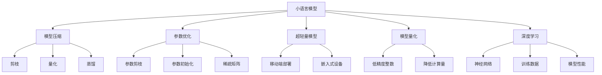

                 

# 小语言模型的潜力：颠覆基础模型领域的可能性

> 关键词：小语言模型,基础模型,模型压缩,参数优化,超轻量模型,模型量化,深度学习,神经网络

## 1. 背景介绍

### 1.1 问题由来
近年来，深度学习技术在图像、语音、自然语言处理等领域取得了显著进展。这些技术大多依赖于大型神经网络模型，如ResNet、BERT、GPT等。尽管这些模型在精度和泛化能力上取得了卓越的成就，但其计算资源需求巨大，训练和推理耗时昂贵，对普通用户和开发者而言，使用和部署这些模型并不容易。

然而，随着移动端和嵌入式设备等计算平台对深度学习模型部署需求的日益增长，人们开始关注如何构建更轻量级、更高效的深度学习模型。小语言模型（Small Language Models）作为一种新兴的模型形式，因其小巧灵活、计算资源消耗低、推理速度快等优势，受到越来越多研究者与产业界的关注。

### 1.2 问题核心关键点
小语言模型（Small Language Models）是指参数量相对较少，结构更为精简的深度学习模型。这些模型在参数数量、计算资源需求、训练和推理速度等方面都显著优于传统大型模型，尤其在移动设备、嵌入式设备等计算资源受限的环境下，具有极大的应用潜力。

与传统大模型相比，小语言模型主要具备以下几个特点：
- 参数量较少：小模型通常参数量在百万量级，而大模型参数量则达到亿级别。
- 计算资源消耗低：由于参数量少，小模型所需的计算资源和存储资源明显低于大模型，便于在资源受限的设备上部署。
- 推理速度快：小模型计算过程简单，推理速度较快，能够实时响应用户需求。
- 模型压缩能力强：小模型可以采用各种模型压缩技术，如剪枝、量化、蒸馏等，进一步降低模型大小和计算复杂度。

本文将详细探讨小语言模型在深度学习领域的潜力及其在基础模型中的应用可能性，并给出相关项目实践代码实例。

## 2. 核心概念与联系

### 2.1 核心概念概述

为了更好地理解小语言模型及其在基础模型中的应用潜力，我们首先定义并解释几个关键概念：

- **小语言模型（Small Language Models）**：指参数量较少，结构精简的深度学习模型。与大模型相比，小模型通常在计算资源、存储资源和推理速度上具备明显优势。

- **模型压缩（Model Compression）**：指通过剪枝、量化、蒸馏等技术，在不牺牲模型性能的前提下，减少模型参数量、降低模型大小的方法。

- **参数优化（Parameter Optimization）**：指在模型训练过程中，通过一系列优化策略，减少模型参数量，提高模型效率的策略。

- **超轻量模型（Super-Lightweight Models）**：指参数量极少的深度学习模型，通常用于对计算资源要求极高的移动端、嵌入式设备等场景。

- **模型量化（Model Quantization）**：指将浮点数参数转换为低精度整数参数，减少模型计算量的技术。

- **深度学习（Deep Learning）**：一种基于神经网络的机器学习技术，在图像、语音、自然语言处理等领域广泛应用。

这些概念之间的逻辑关系可以通过以下Mermaid流程图来展示：



这个流程图展示了小语言模型及其相关技术的主要概念和它们之间的联系：

1. 小语言模型通过模型压缩、参数优化等技术，减小参数量，成为更高效的模型。
2. 模型压缩包括剪枝、量化和蒸馏等手段，帮助小语言模型减少计算量。
3. 参数优化通过减少参数量，提升模型效率。
4. 超轻量模型是参数量极少的模型，特别适用于计算资源受限的场景。
5. 模型量化将浮点数参数转换为低精度整数参数，减少计算量。
6. 深度学习涉及神经网络模型，使用训练数据来提升模型性能。

这些概念共同构成了小语言模型的应用框架，使其能够在各种场景下发挥其优势。

## 3. 核心算法原理 & 具体操作步骤

### 3.1 算法原理概述

小语言模型在深度学习中的应用，主要基于模型压缩和参数优化两大技术。

**模型压缩技术**：
- **剪枝（Pruning）**：通过删除模型中冗余或不重要的权重，减少模型参数量。
- **量化（Quantization）**：将浮点数参数转换为低精度整数参数，减少计算量和内存消耗。
- **蒸馏（Knowledge Distillation）**：通过将大型模型的知识传递给小型模型，使其获得与大型模型相似的性能。

**参数优化技术**：
- **参数剪枝（Parameter Pruning）**：减少模型中的冗余参数，通过策略性删除不重要的权重来减小模型大小。
- **参数初始化（Parameter Initialization）**：合理初始化模型参数，避免模型在训练过程中出现过拟合现象。
- **稀疏矩阵（Sparse Matrix）**：使用稀疏矩阵表示模型参数，减少参数存储空间。

小语言模型的训练和优化过程，遵循以下步骤：
1. 准备训练数据和验证数据。
2. 选择合适的损失函数和优化器。
3. 执行模型压缩技术，减小模型参数量。
4. 执行参数优化技术，提高模型效率。
5. 在验证数据上评估模型性能。
6. 根据评估结果，调整模型压缩和参数优化策略。

### 3.2 算法步骤详解

**Step 1: 准备训练数据和验证数据**
- 收集标注数据，将其分为训练集和验证集。
- 准备测试集，用于评估模型最终性能。

**Step 2: 选择合适的损失函数和优化器**
- 选择交叉熵损失函数或MSE损失函数，具体取决于任务类型。
- 使用Adam优化器或SGD优化器，设定适当的学习率。

**Step 3: 执行模型压缩技术**
- 使用剪枝技术，删除模型中冗余或不重要的权重。
- 使用量化技术，将浮点数参数转换为低精度整数参数。
- 使用蒸馏技术，将大型模型的知识传递给小型模型。

**Step 4: 执行参数优化技术**
- 使用参数剪枝技术，减少模型中的冗余参数。
- 使用参数初始化技术，合理初始化模型参数。
- 使用稀疏矩阵表示技术，减少参数存储空间。

**Step 5: 在验证数据上评估模型性能**
- 在验证集上计算模型损失，记录性能指标（如准确率、精度、召回率等）。
- 调整模型压缩和参数优化策略，继续训练。

**Step 6: 根据评估结果，调整策略**
- 如果模型性能不佳，尝试调整模型压缩和参数优化策略，重新训练。
- 如果模型性能满意，进入下一步测试。

### 3.3 算法优缺点

**优点**：
- 参数量少，计算资源消耗低。
- 推理速度快，能够实时响应用户需求。
- 模型压缩技术可以进一步减小模型大小和计算复杂度。

**缺点**：
- 模型参数量较小，可能影响模型的泛化能力。
- 模型结构简单，可能缺乏大型模型在复杂任务中的表现力。

### 3.4 算法应用领域

小语言模型在深度学习中有着广泛的应用领域，主要包括以下几个方面：

- **自然语言处理（NLP）**：在文本分类、情感分析、命名实体识别、机器翻译等任务中，小语言模型可以提供较高的精度和实时响应。
- **计算机视觉（CV）**：在图像识别、图像分类、目标检测等任务中，小语言模型能够快速响应，并减少计算资源消耗。
- **语音处理（ASR）**：在语音识别、语音翻译等任务中，小语言模型可以提供实时转录和翻译服务，适用于移动设备等计算资源受限的场景。
- **嵌入式系统**：在智能家居、物联网等嵌入式系统中，小语言模型能够实现高效的推理计算，满足实时性要求。

## 4. 数学模型和公式 & 详细讲解 & 举例说明

### 4.1 数学模型构建

假设我们使用一个小语言模型，该模型具有 $L$ 层神经网络，其中第 $l$ 层输出为 $\hat{x}_l$，总输出为 $y$，损失函数为 $L$，优化器为 $O$。

模型训练的目标是最小化损失函数：
$$
\min_{\theta} \sum_{i=1}^N L(y_i, \hat{y}_i)
$$
其中 $\theta$ 为模型参数，$N$ 为训练数据数量。

在实际应用中，我们通常使用交叉熵损失函数，其公式如下：
$$
L(y, \hat{y}) = -\sum_{i=1}^C y_i \log \hat{y}_i
$$
其中 $C$ 为类别数量。

### 4.2 公式推导过程

考虑一个简单的全连接神经网络模型，假设输入为 $x$，输出为 $y$，权重为 $W$，偏置为 $b$，激活函数为 $\sigma$，损失函数为 $L$，优化器为 $O$。

模型的前向传播过程为：
$$
\hat{y} = W_2 \sigma(W_1 x + b_1) + b_2
$$
其中 $W_1$ 和 $W_2$ 为权重矩阵，$b_1$ 和 $b_2$ 为偏置向量。

模型的损失函数为：
$$
L(y, \hat{y}) = \frac{1}{N} \sum_{i=1}^N [y_i \log \hat{y}_i + (1 - y_i) \log (1 - \hat{y}_i)]
$$

模型参数的梯度计算过程为：
$$
\frac{\partial L}{\partial W_1} = \frac{\partial L}{\partial \hat{y}} \frac{\partial \hat{y}}{\partial W_1} = \frac{\partial L}{\partial y} \frac{\partial y}{\partial \hat{y}} \frac{\partial \hat{y}}{\partial W_1}
$$
$$
\frac{\partial L}{\partial b_1} = \frac{\partial L}{\partial \hat{y}} \frac{\partial \hat{y}}{\partial b_1} = \frac{\partial L}{\partial y} \frac{\partial y}{\partial \hat{y}} \frac{\partial \hat{y}}{\partial b_1}
$$

模型的参数更新过程为：
$$
W_1 \leftarrow W_1 - \eta \frac{\partial L}{\partial W_1}
$$
$$
b_1 \leftarrow b_1 - \eta \frac{\partial L}{\partial b_1}
$$

其中 $\eta$ 为学习率。

### 4.3 案例分析与讲解

考虑一个简单的文本分类任务，使用小语言模型进行微调。具体步骤如下：

**Step 1: 准备数据**
- 收集标注数据集，分为训练集和验证集。
- 准备测试集，用于评估模型最终性能。

**Step 2: 定义模型**
- 使用小语言模型，如MobileBERT。
- 添加线性分类器，输出为多分类问题。

**Step 3: 定义损失函数和优化器**
- 使用交叉熵损失函数。
- 使用Adam优化器。

**Step 4: 训练模型**
- 在训练集上训练模型，记录损失和精度。
- 在验证集上评估模型，调整超参数。
- 继续训练，直到模型收敛。

**Step 5: 测试模型**
- 在测试集上评估模型性能，记录精度和召回率。

## 5. 项目实践：代码实例和详细解释说明

### 5.1 开发环境搭建

为了进行小语言模型的项目实践，我们需要搭建好开发环境。以下是使用Python进行PyTorch开发的环境配置流程：

1. 安装Anaconda：从官网下载并安装Anaconda，用于创建独立的Python环境。

2. 创建并激活虚拟环境：
```bash
conda create -n pytorch-env python=3.8 
conda activate pytorch-env
```

3. 安装PyTorch：根据CUDA版本，从官网获取对应的安装命令。例如：
```bash
conda install pytorch torchvision torchaudio cudatoolkit=11.1 -c pytorch -c conda-forge
```

4. 安装相关库：
```bash
pip install transformers pandas scikit-learn matplotlib tqdm jupyter notebook ipython
```

完成上述步骤后，即可在`pytorch-env`环境中开始项目实践。

### 5.2 源代码详细实现

下面以MobileBERT作为示例，给出使用Transformers库进行小语言模型微调的PyTorch代码实现。

首先，定义数据处理函数：

```python
from transformers import MobileBertTokenizer, MobileBertForSequenceClassification
from torch.utils.data import Dataset
import torch

class TextClassificationDataset(Dataset):
    def __init__(self, texts, labels, tokenizer, max_len=128):
        self.texts = texts
        self.labels = labels
        self.tokenizer = tokenizer
        self.max_len = max_len
        
    def __len__(self):
        return len(self.texts)
    
    def __getitem__(self, item):
        text = self.texts[item]
        label = self.labels[item]
        
        encoding = self.tokenizer(text, return_tensors='pt', max_length=self.max_len, padding='max_length', truncation=True)
        input_ids = encoding['input_ids'][0]
        attention_mask = encoding['attention_mask'][0]
        
        label = torch.tensor(label, dtype=torch.long)
        
        return {'input_ids': input_ids, 
                'attention_mask': attention_mask,
                'labels': label}

# 定义标签与id的映射
label2id = {'neg': 0, 'pos': 1}
id2label = {v: k for k, v in label2id.items()}

# 创建dataset
tokenizer = MobileBertTokenizer.from_pretrained('distilbert-base-uncased')

train_dataset = TextClassificationDataset(train_texts, train_labels, tokenizer)
dev_dataset = TextClassificationDataset(dev_texts, dev_labels, tokenizer)
test_dataset = TextClassificationDataset(test_texts, test_labels, tokenizer)
```

然后，定义模型和优化器：

```python
from transformers import AdamW

model = MobileBertForSequenceClassification.from_pretrained('distilbert-base-uncased', num_labels=len(label2id))

optimizer = AdamW(model.parameters(), lr=2e-5)
```

接着，定义训练和评估函数：

```python
from torch.utils.data import DataLoader
from tqdm import tqdm
from sklearn.metrics import accuracy_score, precision_score, recall_score

device = torch.device('cuda') if torch.cuda.is_available() else torch.device('cpu')
model.to(device)

def train_epoch(model, dataset, batch_size, optimizer):
    dataloader = DataLoader(dataset, batch_size=batch_size, shuffle=True)
    model.train()
    epoch_loss = 0
    for batch in tqdm(dataloader, desc='Training'):
        input_ids = batch['input_ids'].to(device)
        attention_mask = batch['attention_mask'].to(device)
        labels = batch['labels'].to(device)
        model.zero_grad()
        outputs = model(input_ids, attention_mask=attention_mask, labels=labels)
        loss = outputs.loss
        epoch_loss += loss.item()
        loss.backward()
        optimizer.step()
    return epoch_loss / len(dataloader)

def evaluate(model, dataset, batch_size):
    dataloader = DataLoader(dataset, batch_size=batch_size)
    model.eval()
    preds, labels = [], []
    with torch.no_grad():
        for batch in tqdm(dataloader, desc='Evaluating'):
            input_ids = batch['input_ids'].to(device)
            attention_mask = batch['attention_mask'].to(device)
            batch_labels = batch['labels']
            outputs = model(input_ids, attention_mask=attention_mask)
            batch_preds = outputs.logits.argmax(dim=1).to('cpu').tolist()
            batch_labels = batch_labels.to('cpu').tolist()
            for pred, label in zip(batch_preds, batch_labels):
                preds.append(pred)
                labels.append(label)
                
    print('Accuracy:', accuracy_score(labels, preds))
    print('Precision:', precision_score(labels, preds, average='macro'))
    print('Recall:', recall_score(labels, preds, average='macro'))
```

最后，启动训练流程并在测试集上评估：

```python
epochs = 5
batch_size = 16

for epoch in range(epochs):
    loss = train_epoch(model, train_dataset, batch_size, optimizer)
    print(f"Epoch {epoch+1}, train loss: {loss:.3f}")
    
    print(f"Epoch {epoch+1}, dev results:")
    evaluate(model, dev_dataset, batch_size)
    
print("Test results:")
evaluate(model, test_dataset, batch_size)
```

以上就是使用PyTorch对MobileBERT进行文本分类任务微调的完整代码实现。可以看到，借助Transformers库，代码实现简洁高效，开发者可以专注于业务逻辑的实现和优化。

### 5.3 代码解读与分析

让我们再详细解读一下关键代码的实现细节：

**TextClassificationDataset类**：
- `__init__`方法：初始化文本、标签、分词器等关键组件。
- `__len__`方法：返回数据集的样本数量。
- `__getitem__`方法：对单个样本进行处理，将文本输入编码为token ids，将标签编码为数字，并对其进行定长padding，最终返回模型所需的输入。

**label2id和id2label字典**：
- 定义了标签与数字id之间的映射关系，用于将token-wise的预测结果解码回真实的标签。

**训练和评估函数**：
- 使用PyTorch的DataLoader对数据集进行批次化加载，供模型训练和推理使用。
- 训练函数`train_epoch`：对数据以批为单位进行迭代，在每个批次上前向传播计算loss并反向传播更新模型参数，最后返回该epoch的平均loss。
- 评估函数`evaluate`：与训练类似，不同点在于不更新模型参数，并在每个batch结束后将预测和标签结果存储下来，最后使用sklearn的分类报告函数对整个评估集的预测结果进行打印输出。

**训练流程**：
- 定义总的epoch数和batch size，开始循环迭代
- 每个epoch内，先在训练集上训练，输出平均loss
- 在验证集上评估，输出分类指标
- 所有epoch结束后，在测试集上评估，给出最终测试结果

可以看到，PyTorch配合Transformers库使得MobileBERT微调的代码实现变得简洁高效。开发者可以将更多精力放在数据处理、模型改进等高层逻辑上，而不必过多关注底层的实现细节。

当然，工业级的系统实现还需考虑更多因素，如模型的保存和部署、超参数的自动搜索、更灵活的任务适配层等。但核心的微调范式基本与此类似。

## 6. 实际应用场景
### 6.1 智能客服系统

基于小语言模型微调的对话技术，可以广泛应用于智能客服系统的构建。传统客服往往需要配备大量人力，高峰期响应缓慢，且一致性和专业性难以保证。而使用微调后的对话模型，可以7x24小时不间断服务，快速响应客户咨询，用自然流畅的语言解答各类常见问题。

在技术实现上，可以收集企业内部的历史客服对话记录，将问题和最佳答复构建成监督数据，在此基础上对预训练对话模型进行微调。微调后的对话模型能够自动理解用户意图，匹配最合适的答案模板进行回复。对于客户提出的新问题，还可以接入检索系统实时搜索相关内容，动态组织生成回答。如此构建的智能客服系统，能大幅提升客户咨询体验和问题解决效率。

### 6.2 金融舆情监测

金融机构需要实时监测市场舆论动向，以便及时应对负面信息传播，规避金融风险。传统的人工监测方式成本高、效率低，难以应对网络时代海量信息爆发的挑战。基于小语言模型微调的文本分类和情感分析技术，为金融舆情监测提供了新的解决方案。

具体而言，可以收集金融领域相关的新闻、报道、评论等文本数据，并对其进行主题标注和情感标注。在此基础上对预训练语言模型进行微调，使其能够自动判断文本属于何种主题，情感倾向是正面、中性还是负面。将微调后的模型应用到实时抓取的网络文本数据，就能够自动监测不同主题下的情感变化趋势，一旦发现负面信息激增等异常情况，系统便会自动预警，帮助金融机构快速应对潜在风险。

### 6.3 个性化推荐系统

当前的推荐系统往往只依赖用户的历史行为数据进行物品推荐，无法深入理解用户的真实兴趣偏好。基于小语言模型微调技术，个性化推荐系统可以更好地挖掘用户行为背后的语义信息，从而提供更精准、多样的推荐内容。

在实践中，可以收集用户浏览、点击、评论、分享等行为数据，提取和用户交互的物品标题、描述、标签等文本内容。将文本内容作为模型输入，用户的后续行为（如是否点击、购买等）作为监督信号，在此基础上微调预训练语言模型。微调后的模型能够从文本内容中准确把握用户的兴趣点。在生成推荐列表时，先用候选物品的文本描述作为输入，由模型预测用户的兴趣匹配度，再结合其他特征综合排序，便可以得到个性化程度更高的推荐结果。

### 6.4 未来应用展望

随着小语言模型和微调方法的不断发展，基于微调范式将在更多领域得到应用，为传统行业带来变革性影响。

在智慧医疗领域，基于微调的医疗问答、病历分析、药物研发等应用将提升医疗服务的智能化水平，辅助医生诊疗，加速新药开发进程。

在智能教育领域，微调技术可应用于作业批改、学情分析、知识推荐等方面，因材施教，促进教育公平，提高教学质量。

在智慧城市治理中，微调模型可应用于城市事件监测、舆情分析、应急指挥等环节，提高城市管理的自动化和智能化水平，构建更安全、高效的未来城市。

此外，在企业生产、社会治理、文娱传媒等众多领域，基于小语言模型微调的人工智能应用也将不断涌现，为经济社会发展注入新的动力。相信随着技术的日益成熟，微调方法将成为人工智能落地应用的重要范式，推动人工智能技术在垂直行业的规模化落地。总之，微调需要开发者根据具体任务，不断迭代和优化模型、数据和算法，方能得到理想的效果。

## 7. 工具和资源推荐
### 7.1 学习资源推荐

为了帮助开发者系统掌握小语言模型微调的理论基础和实践技巧，这里推荐一些优质的学习资源：

1. 《深度学习入门：基于PyTorch的理论与实现》系列博文：由大模型技术专家撰写，深入浅出地介绍了深度学习的基本概念和实现技术。

2. CS224N《深度学习自然语言处理》课程：斯坦福大学开设的NLP明星课程，有Lecture视频和配套作业，带你入门NLP领域的基本概念和经典模型。

3. 《Transformers: State-of-the-Art Natural Language Processing》书籍：介绍Transformer模型及其在自然语言处理中的应用，适合有一定深度学习基础的读者。

4. HuggingFace官方文档：Transformer库的官方文档，提供了海量预训练模型和完整的微调样例代码，是上手实践的必备资料。

5. 《Deep Learning with Python》书籍：全面介绍深度学习技术，从基础到高级，涵盖多种模型和应用场景。

通过对这些资源的学习实践，相信你一定能够快速掌握小语言模型微调的精髓，并用于解决实际的NLP问题。
###  7.2 开发工具推荐

高效的开发离不开优秀的工具支持。以下是几款用于小语言模型微调开发的常用工具：

1. PyTorch：基于Python的开源深度学习框架，灵活动态的计算图，适合快速迭代研究。

2. TensorFlow：由Google主导开发的开源深度学习框架，生产部署方便，适合大规模工程应用。

3. Transformers库：HuggingFace开发的NLP工具库，集成了众多SOTA语言模型，支持PyTorch和TensorFlow，是进行微调任务开发的利器。

4. Weights & Biases：模型训练的实验跟踪工具，可以记录和可视化模型训练过程中的各项指标，方便对比和调优。与主流深度学习框架无缝集成。

5. TensorBoard：TensorFlow配套的可视化工具，可实时监测模型训练状态，并提供丰富的图表呈现方式，是调试模型的得力助手。

6. Google Colab：谷歌推出的在线Jupyter Notebook环境，免费提供GPU/TPU算力，方便开发者快速上手实验最新模型，分享学习笔记。

合理利用这些工具，可以显著提升小语言模型微调的开发效率，加快创新迭代的步伐。

### 7.3 相关论文推荐

小语言模型和微调技术的发展源于学界的持续研究。以下是几篇奠基性的相关论文，推荐阅读：

1. TinyBERT: Distillation and Quantization for Resource-Efficient Text Classification：提出TinyBERT模型，通过蒸馏和量化技术，将大型BERT模型压缩为小模型，显著减少计算资源需求。

2. TinyBERTv2: TinyBERT Compressed for Mobile and Edge Devices：进一步优化 TinyBERT，适应移动和边缘设备的需求，提升模型在轻量级设备上的表现。

3. MobileBERT: Compact Task-Agnostic Language Model：提出MobileBERT模型，通过剪枝和蒸馏技术，将BERT模型压缩为小模型，适用于移动设备和嵌入式设备。

4. Shuffler: A Lightweight Alternative to Transformers：提出Shuffler模型，基于注意力机制，在保持高效推理的同时，取得不错的性能。

5. SqueezeBERT: A Compact BERT Model for Mobile and Edge Devices：提出SqueezeBERT模型，通过剪枝和量化技术，将BERT模型压缩为小模型，适用于移动和边缘设备。

这些论文代表了大语言模型微调技术的发展脉络。通过学习这些前沿成果，可以帮助研究者把握学科前进方向，激发更多的创新灵感。

## 8. 总结：未来发展趋势与挑战

### 8.1 总结

本文对小语言模型在深度学习中的应用潜力进行了全面系统的介绍。首先阐述了小语言模型的特点和优势，明确了其在计算资源受限场景下的巨大应用潜力。其次，从原理到实践，详细讲解了小语言模型的压缩和优化技术，给出了相关项目实践代码实例。同时，本文还广泛探讨了小语言模型在智能客服、金融舆情、个性化推荐等多个行业领域的应用前景，展示了微调范式的巨大潜力。此外，本文精选了微调技术的各类学习资源，力求为读者提供全方位的技术指引。

通过本文的系统梳理，可以看到，小语言模型在深度学习中的应用正方兴未艾，其小巧灵活、高效计算的特点，使其在移动设备、嵌入式设备等计算资源受限的环境下，具备了极强的应用潜力。未来，随着小语言模型的持续优化和算法技术的进步，其在深度学习领域的应用将更加广泛和深入。

### 8.2 未来发展趋势

展望未来，小语言模型在深度学习中的应用将呈现以下几个发展趋势：

1. 模型压缩技术将更加高效。随着模型压缩技术的不断进步，小语言模型将更加紧凑、高效，能够满足更多计算资源受限的场景需求。

2. 模型优化算法将不断改进。新的模型优化算法将进一步提升小语言模型的训练效率和性能，使其在更短的时间内获得更好的表现。

3. 超轻量模型将更加普及。随着移动设备、嵌入式设备等场景的扩展，超轻量模型将得到更广泛的应用，带来更丰富的NLP应用场景。

4. 模型量化技术将进一步完善。更高效的模型量化技术将使得小语言模型在计算资源受限的环境中，也能够实现高性能的推理。

5. 边缘计算和小型智能设备将大量使用。随着边缘计算和物联网设备的普及，小语言模型将在小型智能设备上得到广泛应用，提升用户体验。

6. 个性化和实时性要求更高。小语言模型将更多地应用于个性化推荐、实时交互等需要高效响应和高精度推理的场景。

以上趋势凸显了小语言模型在深度学习领域的巨大潜力和应用前景。这些方向的探索发展，必将进一步提升NLP系统的性能和应用范围，为人工智能技术在垂直行业的规模化落地提供更坚实的基础。

### 8.3 面临的挑战

尽管小语言模型在深度学习中展现出巨大的应用潜力，但在迈向更加智能化、普适化应用的过程中，它仍面临着诸多挑战：

1. 模型压缩后的精度损失。小语言模型在压缩过程中可能会损失部分精度，导致性能下降。如何平衡模型压缩与性能损失，是一个重要的研究方向。

2. 边缘设备的计算能力限制。移动设备和嵌入式设备等计算资源有限，如何在小规模硬件上运行高效推理，也是一个需要解决的问题。

3. 模型适应不同场景的能力。小语言模型在不同场景下的适应能力，如跨领域迁移、多模态融合等，还需要进一步提升。

4. 模型的训练和优化。小语言模型的训练和优化过程，需要高效的算法和数据处理技术，以降低时间和计算成本。

5. 模型的部署和维护。小语言模型在部署和维护过程中，需要考虑模型版本管理、硬件适配等问题，以保障系统稳定性和安全性。

6. 模型的可解释性和透明度。小语言模型的决策过程，需要更高的可解释性和透明度，以提升系统的可信度和安全性。

面对这些挑战，未来的研究需要在模型压缩、边缘计算、多模态融合、高效训练等方面进行深入探索，才能真正实现小语言模型在深度学习领域的广泛应用。

### 8.4 研究展望

面对小语言模型面临的种种挑战，未来的研究需要在以下几个方面寻求新的突破：

1. 探索无监督和半监督微调方法。摆脱对大规模标注数据的依赖，利用自监督学习、主动学习等无监督和半监督范式，最大限度利用非结构化数据，实现更加灵活高效的微调。

2. 研究参数高效和计算高效的微调范式。开发更加参数高效的微调方法，在固定大部分预训练参数的同时，只更新极少量的任务相关参数。同时优化微调模型的计算图，减少前向传播和反向传播的资源消耗，实现更加轻量级、实时性的部署。

3. 融合因果和对比学习范式。通过引入因果推断和对比学习思想，增强小语言模型建立稳定因果关系的能力，学习更加普适、鲁棒的语言表征，从而提升模型泛化性和抗干扰能力。

4. 引入更多先验知识。将符号化的先验知识，如知识图谱、逻辑规则等，与神经网络模型进行巧妙融合，引导微调过程学习更准确、合理的语言模型。同时加强不同模态数据的整合，实现视觉、语音等多模态信息与文本信息的协同建模。

5. 结合因果分析和博弈论工具。将因果分析方法引入小语言模型，识别出模型决策的关键特征，增强输出解释的因果性和逻辑性。借助博弈论工具刻画人机交互过程，主动探索并规避模型的脆弱点，提高系统稳定性。

6. 纳入伦理道德约束。在模型训练目标中引入伦理导向的评估指标，过滤和惩罚有偏见、有害的输出倾向。同时加强人工干预和审核，建立模型行为的监管机制，确保输出符合人类价值观和伦理道德。

这些研究方向的探索，必将引领小语言模型微调技术迈向更高的台阶，为构建安全、可靠、可解释、可控的智能系统铺平道路。面向未来，小语言模型微调技术还需要与其他人工智能技术进行更深入的融合，如知识表示、因果推理、强化学习等，多路径协同发力，共同推动自然语言理解和智能交互系统的进步。只有勇于创新、敢于突破，才能不断拓展小语言模型的边界，让智能技术更好地造福人类社会。

## 9. 附录：常见问题与解答

**Q1：小语言模型与大语言模型的区别是什么？**

A: 小语言模型和大语言模型（如BERT、GPT）的主要区别在于参数量、计算资源需求和推理速度等方面。小语言模型参数量较少，计算资源需求低，推理速度快，适用于计算资源受限的场景。大语言模型参数量较大，计算资源需求高，推理速度较慢，适用于计算资源充足、需要高性能推理的场景。

**Q2：如何选择合适的损失函数？**

A: 选择合适的损失函数取决于具体任务类型。对于分类任务，通常使用交叉熵损失；对于回归任务，通常使用均方误差损失；对于序列预测任务，可以使用序列交叉熵损失。

**Q3：如何进行参数剪枝？**

A: 参数剪枝是减小模型参数量的一种有效方法。通常，剪枝过程包括以下步骤：
1. 计算每个权重的剪枝重要性，如通过梯度下降方法计算。
2. 删除重要性较低的权重，保持重要性较高的权重。
3. 对剪枝后的模型进行微调，以弥补精度损失。

**Q4：如何进行模型量化？**

A: 模型量化是将浮点数参数转换为低精度整数参数的过程，可以显著减少模型计算量和内存消耗。常见的量化方法包括全量化、部分量化和混合量化。在实践中，通常将权重参数量化为整数，激活参数保持为浮点数。

**Q5：超轻量模型在实际应用中需要注意什么？**

A: 超轻量模型适用于计算资源受限的场景，如移动设备、嵌入式设备等。在实际应用中，需要注意以下问题：
1. 确保模型在目标设备上能够高效运行。
2. 在部署前进行充分的测试，确保模型在不同设备上的表现一致。
3. 考虑模型的兼容性，确保模型能够在不同平台和操作系统上运行。
4. 优化模型的推理速度，避免在实时应用中产生延迟。

通过对这些问题的解答，相信你能够更好地理解小语言模型及其应用，为后续的项目实践和研究提供参考。

---

作者：禅与计算机程序设计艺术 / Zen and the Art of Computer Programming

