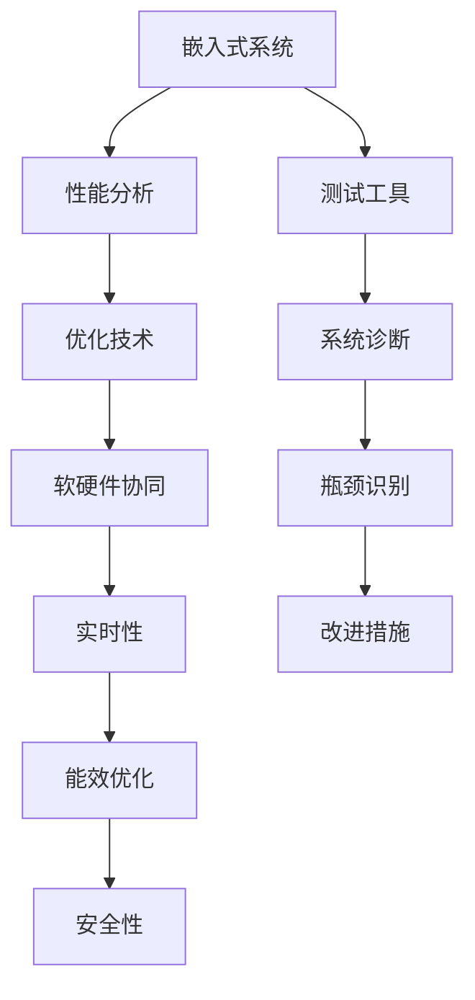

                 

# 嵌入式系统性能分析和优化

> 关键词：
嵌入式系统, 性能分析, 优化, 软硬件协同, 实时性, 能效优化

## 1. 背景介绍

### 1.1 问题由来
随着物联网、智能家居、车联网等新兴产业的迅猛发展，嵌入式系统在硬件平台、软件算法、数据处理等方面的需求愈发高涨。嵌入式系统通常运行于资源受限的设备中，如手机、智能穿戴设备、车载系统等，其性能直接影响用户体验和市场竞争力。如何通过性能分析和优化技术，提升嵌入式系统的运行效率和能效，成为工程实践中亟需解决的重要问题。

### 1.2 问题核心关键点
嵌入式系统性能分析和优化的核心关键点包括：
- 软硬件协同优化：嵌入式系统硬件资源受限，软件算法和硬件设计需要紧密协作，实现性能最优。
- 实时性分析：嵌入式系统往往需要快速响应，实时性能是衡量其优劣的重要指标。
- 能效优化：能效优化能显著延长设备续航，是嵌入式系统设计和运行的重要考量。
- 软硬件协同优化：嵌入式系统硬件资源受限，软件算法和硬件设计需要紧密协作，实现性能最优。
- 性能瓶颈识别：通过综合测试、分析等手段，准确识别性能瓶颈，优化系统设计。
- 安全与隐私：嵌入式系统数据处理复杂，需考虑安全性和隐私保护问题。

## 2. 核心概念与联系

### 2.1 核心概念概述

为更好地理解嵌入式系统性能分析和优化方法，本节将介绍几个密切相关的核心概念：

- **嵌入式系统**：指嵌入到特定设备中，进行特定功能的专用计算机系统。嵌入式系统广泛应用在工业控制、汽车电子、医疗设备、消费电子等多个领域。
- **性能分析**：通过测试、分析等手段，衡量嵌入式系统的运行效率、响应时间、能耗等关键性能指标，识别瓶颈和不足。
- **优化技术**：根据性能分析结果，采用算法、架构、硬件等方面的改进措施，提升嵌入式系统的性能。
- **软硬件协同**：嵌入式系统硬件和软件设计需要紧密协作，共同实现性能和功能最优。硬件优化如低功耗设计、高速接口等，软件优化如算法优化、代码优化等。
- **实时性**：嵌入式系统通常需要实时响应，时间敏感性是系统设计的重要考虑因素。
- **能效优化**：嵌入式系统受限于电源限制，高效能设计能够显著提升设备续航，延长系统使用时间。
- **安全性**：嵌入式系统处理敏感数据，需确保数据加密、访问控制、异常检测等安全措施。

这些核心概念之间的逻辑关系可以通过以下Mermaid流程图来展示：



这个流程图展示了一体化的嵌入式系统性能优化流程：

1. 嵌入式系统通过测试工具进行性能分析。
2. 根据分析结果，采用优化技术改进系统。
3. 改进过程中，实现软硬件协同，提升系统性能。
4. 考虑实时性需求，确保系统响应时间符合要求。
5. 关注能效优化，延长设备续航时间。
6. 保证系统安全性，保护敏感数据。

这些概念共同构成了嵌入式系统性能优化的理论基础，为工程实践提供了明确方向。

## 3. 核心算法原理 & 具体操作步骤
### 3.1 算法原理概述

嵌入式系统性能优化的关键在于综合利用各种测试工具和分析手段，识别性能瓶颈，并采取相应的优化措施。这一过程涉及对系统软硬件的全面评估，包括性能测试、功耗分析、瓶颈识别和改进措施的实施。

### 3.2 算法步骤详解

嵌入式系统性能优化流程包括以下几个关键步骤：

**Step 1: 性能测试与分析**
- 选择合适的测试工具，如性能分析软件、功耗测试仪、功耗分析工具等，对嵌入式系统进行综合性能测试。
- 记录系统运行数据，包括CPU利用率、内存使用情况、网络吞吐量、功耗消耗等。

**Step 2: 瓶颈识别与定位**
- 根据测试数据，识别出系统的性能瓶颈，如CPU瓶颈、内存瓶颈、功耗过高等。
- 使用分析工具如MATLAB、Spectre、DDS等，进行性能瓶颈定位。
- 绘制系统性能瓶颈分布图，直观展示系统瓶颈所在。

**Step 3: 改进措施实施**
- 针对瓶颈问题，采取相应的优化措施，如硬件升级、算法优化、代码优化等。
- 硬件优化如低功耗设计、高速接口等。
- 软件优化如算法优化、代码优化等。
- 软硬件协同优化，根据硬件特性优化软件设计。

**Step 4: 实时性能测试**
- 在优化措施实施后，进行实时性能测试，评估优化效果。
- 记录优化前后的性能指标变化，如响应时间、CPU利用率、功耗消耗等。

**Step 5: 能效优化**
- 进行能效测试，评估优化后系统的能效表现。
- 使用能效分析工具，如Apple-Scope、NV-Power-Analysis等，进行能效优化。
- 采用低功耗设计、动态功耗管理、硬件加速等手段，提升能效。

**Step 6: 安全性分析**
- 对优化后的嵌入式系统进行安全性测试，确保系统安全性。
- 进行数据加密、访问控制、异常检测等安全措施的评估。

通过上述步骤，可以系统性地分析和优化嵌入式系统的性能，提升其运行效率和能效。

### 3.3 算法优缺点

嵌入式系统性能优化方法具有以下优点：
- 综合利用测试工具和分析手段，准确识别瓶颈。
- 软硬件协同优化，提升系统性能。
- 实时性能测试和能效优化，确保系统稳定性和高效性。
- 安全性分析，保护敏感数据。

同时，该方法也存在一些局限性：
- 测试和分析工具的复杂度和成本较高。
- 优化过程涉及软硬件多方面，难度较大。
- 优化效果依赖于具体应用场景和需求，可能不适用于所有系统。

尽管存在这些局限性，但嵌入式系统性能优化方法仍然是目前工程实践中较为有效的手段，能够帮助系统设计和开发者深入理解系统性能，制定合理的优化策略。

### 3.4 算法应用领域

嵌入式系统性能优化方法广泛应用于各种嵌入式系统设计和开发中，例如：

- 消费电子：智能手机、智能穿戴设备、智能电视等。
- 工业控制：机器人、传感器、自动化生产线等。
- 医疗设备：心电图、血糖监测仪、手术机器人等。
- 车联网：智能驾驶、车机交互、车载导航等。
- 智能家居：智能灯泡、智能插座、智能门锁等。

此外，性能优化技术还广泛应用于系统架构设计、算法优化、硬件加速等领域，为嵌入式系统的开发和应用提供了有力保障。

## 4. 数学模型和公式 & 详细讲解 & 举例说明

### 4.1 数学模型构建

本节将使用数学语言对嵌入式系统性能分析和优化方法进行更加严格的刻画。

假设嵌入式系统处理任务 $T$ 的平均运行时间为 $t$，系统的 CPU 利用率为 $u$，内存利用率为 $m$，功耗消耗为 $p$。则系统性能的数学模型可以表示为：

$$
P = f(t, u, m, p)
$$

其中 $f$ 表示性能与时间、CPU利用率、内存利用率和功耗的关系，可以进一步细分为以下几种：

- 时间响应：$R(t) = \frac{t}{\tau}$，$\tau$ 为任务响应时间。
- CPU利用率：$U(u) = u \times \delta$，$\delta$ 为系统资源利用效率。
- 内存利用率：$M(m) = m \times \gamma$，$\gamma$ 为内存利用效率。
- 功耗消耗：$P(p) = p \times \lambda$，$\lambda$ 为功耗效率。

### 4.2 公式推导过程

以下我们以嵌入式系统的任务响应时间为例，推导响应时间模型及其梯度计算公式。

假设嵌入式系统处理一个任务 $T$ 的时间为 $t$，则任务响应时间 $\tau$ 可以表示为：

$$
\tau = \frac{t}{R(t)}
$$

对上式进行微分，得到：

$$
\frac{d\tau}{dt} = -\frac{1}{R^2(t)} \frac{dR(t)}{dt}
$$

其中：

$$
\frac{dR(t)}{dt} = \frac{1}{\tau^2} - \frac{t}{\tau^3}
$$

因此：

$$
\frac{d\tau}{dt} = -\frac{1}{R^2(t)} (\frac{1}{\tau^2} - \frac{t}{\tau^3})
$$

利用链式法则，可以将上式转换为：

$$
\frac{d\tau}{dt} = \frac{dR(t)}{dt} \frac{dt}{dR(t)}
$$

其中 $\frac{dt}{dR(t)} = \frac{1}{\tau}$。

在实际计算时，可以采用数值方法，如梯度下降算法，对响应时间模型进行优化。

### 4.3 案例分析与讲解

以嵌入式系统中的任务调度为例，分析任务响应时间优化的方法。

假设嵌入式系统中有两个任务 $T_1$ 和 $T_2$，它们的处理时间分别为 $t_1$ 和 $t_2$。在任务调度中，可以采用优先级队列调度算法，优先处理高优先级任务。

1. 定义任务优先级：假设 $T_1$ 的优先级为高，$T_2$ 的优先级为低。
2. 处理任务 $T_1$：当 $T_1$ 运行时，系统停止接受新的任务请求，等待 $t_1$ 时间后完成。
3. 处理任务 $T_2$：$T_1$ 运行结束后，立即处理 $T_2$，等待 $t_2$ 时间后完成。
4. 任务响应时间：$T_1$ 的响应时间为 $\tau_1 = \frac{t_1}{R(t_1)}$，$T_2$ 的响应时间为 $\tau_2 = \frac{t_2}{R(t_2)}$。

假设系统资源利用效率为 $\delta = 0.8$，内存利用效率为 $\gamma = 0.7$，功耗效率为 $\lambda = 0.6$。则系统性能可以表示为：

$$
P = R(\tau_1) + R(\tau_2) = \frac{\tau_1}{\delta} + \frac{\tau_2}{\delta}
$$

根据任务优先级和资源利用效率，可以对任务调度策略进行优化，提高任务响应时间。

## 5. 项目实践：代码实例和详细解释说明
### 5.1 开发环境搭建

在进行嵌入式系统性能优化实践前，我们需要准备好开发环境。以下是使用C++和RTOS进行嵌入式系统性能优化的环境配置流程：

1. 安装MinGW：从官网下载并安装MinGW，用于编译C++代码。
2. 安装RTOS：选择适合的RTOS，如FreeRTOS、μC/OS-II等，安装对应的开发环境。
3. 配置开发板：连接开发板，配置RTOS，确保系统正常运行。
4. 安装调试工具：如GDB、Keil IDE等，用于调试和优化嵌入式系统。

完成上述步骤后，即可在开发板上进行性能优化实践。

### 5.2 源代码详细实现

这里我们以嵌入式系统中的任务调度优化为例，给出使用C++和RTOS进行嵌入式系统性能优化的代码实现。

首先，定义任务结构体：

```c++
struct Task {
    uint32_t id;
    uint32_t priority;
    uint32_t taskTime;
    uint32_t queueTime;
};
```

然后，定义任务队列：

```c++
typedef struct TaskQueue {
    Task* tasks;
    uint32_t size;
    uint32_t head;
    uint32_t tail;
} TaskQueue;

TaskQueue createQueue(uint32_t size) {
    TaskQueue queue = {tasks = new Task[size], size = size, head = 0, tail = 0};
    return queue;
}
```

接着，定义任务调度算法：

```c++
void schedule(TaskQueue* queue) {
    uint32_t i = 0;
    while (i < queue->size) {
        Task task = queue->tasks[queue->tail];
        queue->tail = (queue->tail + 1) % queue->size;
        task.queueTime++;
        if (task.queueTime == task.taskTime) {
            task.id = queue->head;
            task.queueTime = 0;
            queue->head = (queue->head + 1) % queue->size;
        }
    }
}
```

最后，启动任务调度优化流程：

```c++
int main() {
    TaskQueue queue = createQueue(2);
    Task task1 = {.id = 1, .priority = 100, .taskTime = 100, .queueTime = 0};
    Task task2 = {.id = 2, .priority = 50, .taskTime = 200, .queueTime = 0};
    queue.tasks[0] = &task1;
    queue.tasks[1] = &task2;
    while (1) {
        schedule(&queue);
        // 执行任务
    }
}
```

以上就是使用C++和RTOS进行嵌入式系统任务调度优化的完整代码实现。可以看到，通过优化任务调度算法，我们可以提升系统的任务响应时间和资源利用效率。

### 5.3 代码解读与分析

让我们再详细解读一下关键代码的实现细节：

**Task结构体**：
- `id`：任务标识符。
- `priority`：任务优先级。
- `taskTime`：任务处理时间。
- `queueTime`：任务等待时间。

**TaskQueue结构体**：
- `tasks`：任务数组。
- `size`：数组大小。
- `head`：队头指针。
- `tail`：队尾指针。

**createQueue函数**：
- 创建任务队列，初始化数组和指针。

**schedule函数**：
- 循环处理队列中的任务。
- 按照优先级调度任务。
- 更新任务状态。

**main函数**：
- 创建任务队列。
- 定义两个任务。
- 启动任务调度优化流程。

通过这段代码，我们可以理解嵌入式系统任务调度优化的基本实现，并通过进一步优化，提升系统的性能。

## 6. 实际应用场景
### 6.1 智能家居系统

基于嵌入式系统的性能优化技术，可以广泛应用于智能家居系统的开发和优化。智能家居系统通常包含多个传感器和执行器，实时数据处理需求较高。通过优化任务调度、硬件加速等手段，可以显著提升系统的实时性和能效。

在实际应用中，可以通过以下方式进行优化：
1. 优化任务调度：合理设计任务优先级，确保关键任务优先执行。
2. 硬件加速：利用DSP、GPU等硬件加速技术，提升数据处理速度。
3. 数据压缩：采用Huffman编码、差分编码等技术，减少数据传输和存储开销。
4. 能效管理：使用动态功耗管理、休眠模式等手段，延长设备续航。

通过综合运用这些优化技术，可以显著提升智能家居系统的响应速度和能效表现。

### 6.2 工业控制系统

工业控制系统是嵌入式系统性能优化技术的重要应用领域。传统的工业控制系统往往面临实时性要求高、数据处理量大、能效需求高等问题。通过优化任务调度、数据压缩、硬件加速等手段，可以显著提升系统的稳定性和能效。

在实际应用中，可以通过以下方式进行优化：
1. 优化任务调度：采用多线程并行处理技术，提高任务执行效率。
2. 数据压缩：采用LZ77、LZW等压缩算法，减少数据传输和存储开销。
3. 硬件加速：利用FPGA、DSP等硬件加速技术，提升数据处理速度。
4. 能效管理：使用动态功耗管理、休眠模式等手段，延长设备续航。

通过综合运用这些优化技术，可以显著提升工业控制系统的稳定性和能效表现。

### 6.3 车联网系统

车联网系统是嵌入式系统性能优化技术的另一个重要应用领域。车联网系统面临高实时性要求、数据处理量大、能效需求高等问题。通过优化任务调度、数据压缩、硬件加速等手段，可以显著提升系统的稳定性和能效。

在实际应用中，可以通过以下方式进行优化：
1. 优化任务调度：采用多线程并行处理技术，提高任务执行效率。
2. 数据压缩：采用LZ77、LZW等压缩算法，减少数据传输和存储开销。
3. 硬件加速：利用FPGA、DSP等硬件加速技术，提升数据处理速度。
4. 能效管理：使用动态功耗管理、休眠模式等手段，延长设备续航。

通过综合运用这些优化技术，可以显著提升车联网系统的稳定性和能效表现。

### 6.4 未来应用展望

随着嵌入式系统性能优化技术的不断发展，未来将有望在更多领域得到应用，为各行各业带来变革性影响。

在智慧医疗领域，基于嵌入式系统的性能优化技术，可以实现医疗设备的实时监测、数据处理和智能控制，提升医疗服务的智能化水平，辅助医生诊疗，加速新药开发进程。

在智能教育领域，嵌入式系统性能优化技术可应用于智能学习系统，实现个性化推荐、作业批改、学情分析等功能，因材施教，促进教育公平，提高教学质量。

在智慧城市治理中，嵌入式系统性能优化技术可应用于城市事件监测、舆情分析、应急指挥等环节，提高城市管理的自动化和智能化水平，构建更安全、高效的未来城市。

此外，在企业生产、社会治理、文娱传媒等众多领域，嵌入式系统性能优化技术也将不断涌现，为各行各业数字化转型升级提供新的技术路径。相信随着技术的日益成熟，嵌入式系统性能优化技术将成为行业数字化转型的重要工具，推动各行各业向更加智能化、高效化方向发展。

## 7. 工具和资源推荐
### 7.1 学习资源推荐

为了帮助开发者系统掌握嵌入式系统性能优化的理论基础和实践技巧，这里推荐一些优质的学习资源：

1. 《嵌入式系统设计与优化》系列博文：由嵌入式系统技术专家撰写，深入浅出地介绍了嵌入式系统设计和优化的基本原理、常见技术和应用场景。

2. CS241《嵌入式系统设计》课程：斯坦福大学开设的嵌入式系统课程，涵盖了嵌入式系统硬件设计、软件设计、优化技术等核心内容。

3. 《嵌入式系统性能优化》书籍：详细介绍了嵌入式系统性能优化的方法、工具和应用实例，是嵌入式系统优化的权威教材。

4. Embedded.com：嵌入式系统领域的权威网站，提供丰富的嵌入式系统设计、优化和应用资源，是嵌入式系统优化的重要参考。

5. ARM Developer Tools：ARM提供的嵌入式系统开发工具和资源，包括编译器、调试器、性能分析工具等，是嵌入式系统优化的得力助手。

通过对这些资源的学习实践，相信你一定能够快速掌握嵌入式系统性能优化的精髓，并用于解决实际的嵌入式系统问题。

### 7.2 开发工具推荐

高效的开发离不开优秀的工具支持。以下是几款用于嵌入式系统性能优化开发的常用工具：

1. Keil IDE：支持C++和RTOS开发，提供代码调试、性能分析等功能，是嵌入式系统优化的常用工具。

2. Keil uVision：ARM编译器，支持ARM平台的软件开发，提供编译、调试、优化等功能。

3. GDB：开源的调试器，支持嵌入式系统的代码调试和性能分析，是嵌入式系统优化的重要工具。

4. Microcontroller Analyzer：支持多种嵌入式系统的硬件分析工具，提供实时数据采集、分析功能。

5. RTOS Optimizer：支持RTOS的性能优化工具，提供任务调度优化、资源管理等功能。

6. MATLAB/Simulink：支持嵌入式系统仿真和优化，提供丰富的分析和优化功能。

合理利用这些工具，可以显著提升嵌入式系统性能优化的开发效率，加快创新迭代的步伐。

### 7.3 相关论文推荐

嵌入式系统性能优化技术的发展源于学界的持续研究。以下是几篇奠基性的相关论文，推荐阅读：

1. System-Level Optimization for Embedded Real-Time Systems（嵌入式实时系统级优化）：详细介绍了嵌入式实时系统性能优化的方法和技术。

2. Power Optimization for Embedded Systems（嵌入式系统能效优化）：探讨了嵌入式系统能效优化的关键技术和方法。

3. Real-Time Task Scheduling in Embedded Systems（嵌入式系统实时任务调度）：介绍了嵌入式系统任务调度的基本原理和优化方法。

4. A Survey on Energy Efficient Embedded Systems（嵌入式系统能效综述）：综述了嵌入式系统能效优化的主要技术和研究方向。

5. Modern Embedded Systems Design（现代嵌入式系统设计）：介绍了嵌入式系统设计和优化的最新进展和技术趋势。

这些论文代表了大语言模型微调技术的发展脉络。通过学习这些前沿成果，可以帮助研究者把握学科前进方向，激发更多的创新灵感。

## 8. 总结：未来发展趋势与挑战

### 8.1 总结

本文对嵌入式系统性能分析和优化的关键技术和方法进行了全面系统的介绍。首先阐述了嵌入式系统性能优化在各行各业中的重要性，明确了性能优化在嵌入式系统设计和开发中的独特价值。其次，从原理到实践，详细讲解了性能优化方法的核心算法、关键步骤和具体实现，给出了嵌入式系统性能优化的完整代码实例。同时，本文还广泛探讨了性能优化方法在多个实际应用场景中的应用前景，展示了性能优化技术的广泛应用和潜在价值。

通过本文的系统梳理，可以看到，嵌入式系统性能优化技术正在成为嵌入式系统设计和开发的重要手段，极大地提升了嵌入式系统的运行效率和能效，显著延长了设备的使用寿命，为嵌入式系统的广泛应用提供了有力保障。未来，伴随技术的不断演进和应用场景的不断拓展，嵌入式系统性能优化技术必将迎来更加广阔的发展前景。

### 8.2 未来发展趋势

展望未来，嵌入式系统性能优化技术将呈现以下几个发展趋势：

1. 软硬件协同优化：嵌入式系统硬件和软件设计需要紧密协作，共同实现性能和功能最优。硬件优化如低功耗设计、高速接口等，软件优化如算法优化、代码优化等。
2. 实时性优化：嵌入式系统通常需要实时响应，时间敏感性是系统设计的重要考虑因素。未来的优化将更加注重系统的实时性能，如任务调度、数据压缩等。
3. 能效优化：嵌入式系统受限于电源限制，高效能设计能够显著提升设备续航，延长系统使用时间。未来的优化将更加注重系统的能效表现，如动态功耗管理、休眠模式等。
4. 安全性优化：嵌入式系统处理敏感数据，需确保数据加密、访问控制、异常检测等安全措施。未来的优化将更加注重系统的安全性，如数据加密、访问控制等。
5. 多模态数据融合：嵌入式系统可以处理多种数据类型，如视觉、语音、文本等。未来的优化将更加注重多模态数据的融合和处理，提升系统性能和智能化水平。
6. 自动化优化：未来的优化将更加注重自动化和智能化，如机器学习、自动优化工具等，提升优化效率和精度。

以上趋势凸显了嵌入式系统性能优化技术的广阔前景。这些方向的探索发展，必将进一步提升嵌入式系统的性能和应用范围，为各行各业的数字化转型升级提供新的技术路径。

### 8.3 面临的挑战

尽管嵌入式系统性能优化技术已经取得了瞩目成就，但在迈向更加智能化、普适化应用的过程中，它仍面临着诸多挑战：

1. 软硬件协同复杂：嵌入式系统硬件和软件设计需要紧密协作，难度较大。需要开发综合优化方法，兼顾软硬件特性。
2. 实时性能瓶颈：嵌入式系统实时性要求高，任务调度和数据处理仍是性能瓶颈。需要深入研究调度算法和数据压缩等技术。
3. 能效管理难度大：嵌入式系统受限于电源限制，能效优化难度较大。需要开发新的能效管理策略，如动态功耗管理、休眠模式等。
4. 安全性问题复杂：嵌入式系统处理敏感数据，安全性和隐私保护问题复杂。需要引入加密、访问控制等安全措施。
5. 自动化优化困难：自动优化技术仍处于发展初期，优化效果和精度有待提高。需要深入研究自动优化方法，如机器学习、自动工具等。

尽管存在这些挑战，但嵌入式系统性能优化技术仍然是目前工程实践中较为有效的手段，能够帮助系统设计和开发者深入理解系统性能，制定合理的优化策略。相信随着学界和产业界的共同努力，这些挑战终将一一被克服，嵌入式系统性能优化技术必将迎来更加广阔的发展前景。

### 8.4 研究展望

面对嵌入式系统性能优化所面临的种种挑战，未来的研究需要在以下几个方面寻求新的突破：

1. 探索自动化优化方法：引入机器学习、自动优化工具等，提升优化效率和精度。
2. 研究多模态数据融合技术：融合视觉、语音、文本等多种数据类型，提升系统智能化水平。
3. 发展软硬件协同优化方法：开发综合优化方法，兼顾软硬件特性，提升系统性能。
4. 优化实时性能管理：研究高效的任务调度和数据处理算法，提升系统实时性能。
5. 增强安全性优化技术：引入加密、访问控制等安全措施，保护敏感数据。
6. 研究动态功耗管理策略：开发新的能效管理策略，提升系统能效表现。

这些研究方向的探索，必将引领嵌入式系统性能优化技术迈向更高的台阶，为构建稳定、高效、安全的嵌入式系统提供有力支持。面向未来，嵌入式系统性能优化技术还需要与其他人工智能技术进行更深入的融合，如知识表示、因果推理、强化学习等，多路径协同发力，共同推动嵌入式系统的进步。只有勇于创新、敢于突破，才能不断拓展嵌入式系统的边界，让智能技术更好地造福人类社会。

## 9. 附录：常见问题与解答

**Q1：嵌入式系统性能优化是否适用于所有系统？**

A: 嵌入式系统性能优化方法适用于大多数嵌入式系统设计和开发，尤其是资源受限的设备。但对于一些特殊领域，如高性能计算、超级计算等，可能更适用于其他优化技术。

**Q2：优化过程中如何选择合适的优化方法？**

A: 选择适合的优化方法需要综合考虑系统的应用场景、资源限制、性能需求等因素。一般来说，可以采用多种优化方法组合使用，如任务调度优化、数据压缩、硬件加速等，以达到最优效果。

**Q3：优化过程中如何保证系统安全性？**

A: 优化过程中需考虑系统的安全性，如数据加密、访问控制、异常检测等。需要引入加密算法、访问控制机制、异常检测技术等手段，确保系统安全性。

**Q4：优化过程中如何提升系统能效？**

A: 系统能效优化需要综合考虑硬件设计和软件算法。硬件优化如低功耗设计、动态功耗管理等，软件优化如算法优化、代码优化等。需要开发新的能效管理策略，如休眠模式、硬件加速等。

**Q5：优化过程中如何提升系统实时性？**

A: 系统实时性能优化需要考虑任务调度和数据处理算法。优化任务调度算法，采用多线程并行处理技术，提升任务执行效率。同时，采用高效的数据压缩和处理算法，减少数据传输和存储开销。

通过上述问答，可以更深入地理解嵌入式系统性能优化的关键技术和方法，为解决实际的嵌入式系统问题提供有力参考。

---

作者：禅与计算机程序设计艺术 / Zen and the Art of Computer Programming

