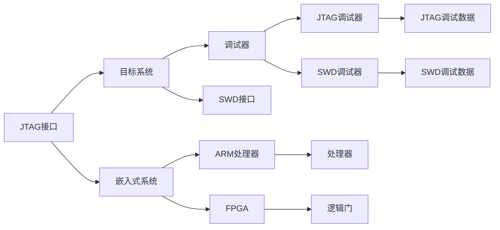

                 

# 嵌入式系统调试技巧：使用 JTAG 和 SWD

> 关键词：JTAG, SWD, 嵌入式系统, 调试, 软硬件协同, 系统设计, 故障排除

## 1. 背景介绍

### 1.1 问题由来
嵌入式系统（Embedded Systems）是各种软硬件结合的复杂系统，广泛应用于工业控制、医疗设备、消费电子等领域。嵌入式系统的故障排除（Debugging）和调试（Debugging）是保证系统可靠性和稳定性的关键环节。传统调试方法往往依赖专用的硬件接口和软件工具，耗时耗力，调试效率低下。

随着技术的发展，JTAG（Joint Test Action Group）和SWD（Single Wire Debug）等硬件接口和调试协议应运而生，为嵌入式系统的调试提供了更为高效、灵活的手段。本文档将系统介绍JTAG和SWD的原理、特点及其在嵌入式系统调试中的应用。

### 1.2 问题核心关键点
JTAG和SWD是嵌入式系统调试中最常用的两种接口协议，它们通过串行通信实现对目标系统的监控和调试。JTAG协议最早由IEEE制定，用于芯片测试和调试，广泛应用于各种微处理器和FPGA中。SWD是JEDEC（Joint Electron Devices Engineering Council）标准，也是用于芯片测试和调试的接口协议，主要用于ARM系列微处理器。

JTAG和SWD的工作原理类似，都是通过单线或多线的接口与目标系统通信，获取目标系统的状态和控制其运行。它们的主要区别在于物理接口和数据传输方式。JTAG通常通过JTAG接口连接，而SWD则通过APB（Advanced Peripheral Bus）接口连接。

JTAG和SWD的调试功能包括单步执行、断点设置、变量查看、存储器读写等，可以广泛应用于各种嵌入式系统调试场景，提高调试效率和诊断准确性。

### 1.3 问题研究意义
嵌入式系统的调试和故障排除对系统的可靠性和稳定性至关重要。使用JTAG和SWD等先进的调试协议，可以有效提升嵌入式系统的调试效率和诊断准确性，为系统的长期稳定运行提供保障。

本文档系统介绍JTAG和SWD的原理和特点，详细讲解其应用方法，并结合实际案例进行分析，为嵌入式系统的开发人员提供全面的调试技巧和方法，帮助他们快速高效地完成嵌入式系统的调试和故障排除工作。

## 2. 核心概念与联系

### 2.1 核心概念概述

为了更好地理解JTAG和SWD的原理和应用，首先需要了解一些核心概念：

- **JTAG (Joint Test Action Group)**：一种用于测试和调试芯片的硬件接口协议。通过JTAG接口，可以对目标系统的状态进行监控，并控制其运行。
- **SWD (Single Wire Debug)**：一种用于测试和调试芯片的硬件接口协议，主要由JEDEC标准定义。SWD协议通过APB接口连接，可以与目标系统进行双向通信，支持更多的调试功能。
- **嵌入式系统（Embedded System）**：由硬件和软件组成的复杂系统，通常用于特定应用场景，如工业控制、医疗设备、消费电子等。
- **调试（Debugging）**：通过特定工具和方法，对系统进行监控和诊断，排除故障的过程。
- **故障排除（Fault Diagnosis）**：对系统出现的问题进行分析和解决，保证系统稳定运行。
- **软硬件协同（Software-Hardware Collaboration）**：在嵌入式系统的开发和调试过程中，软件和硬件的协同配合，共同实现系统的可靠性和稳定性。

这些概念之间存在紧密联系，通过JTAG和SWD接口协议，可以实现对嵌入式系统的监控和调试，提升系统的可靠性和稳定性。

### 2.2 核心概念原理和架构的 Mermaid 流程图

以下是JTAG和SWD接口协议的原理和架构的Mermaid流程图：



这个图展示了JTAG和SWD接口协议的基本架构：

1. **JTAG接口**：通过JTAG接口与目标系统连接。
2. **嵌入式系统**：包括微处理器（如ARM处理器）和FPGA等硬件组件。
3. **SWD接口**：通过APB接口与目标系统连接。
4. **调试器**：用于监控和调试目标系统。
5. **调试数据**：调试器通过JTAG或SWD接口发送给目标系统的调试数据。

通过这些接口和协议，可以实现对目标系统的监控和调试，提升嵌入式系统的开发和维护效率。

## 3. 核心算法原理 & 具体操作步骤

### 3.1 算法原理概述

JTAG和SWD接口协议的原理基于串行通信，通过单线或多线的接口与目标系统通信。其主要功能包括：

1. **数据传输**：将调试数据发送给目标系统，获取目标系统的状态信息。
2. **状态监控**：监控目标系统的运行状态，如程序执行、变量值、寄存器值等。
3. **程序控制**：控制目标系统的程序执行，如单步执行、断点设置、程序暂停等。
4. **存储器读写**：读写目标系统的存储器，包括RAM、FLASH、EEPROM等。

JTAG和SWD协议的工作原理如下：

1. **时序控制**：通过时钟信号控制数据的传输和处理。
2. **命令编码**：通过指令编码和响应编码实现对目标系统的监控和控制。
3. **数据传输**：通过数据总线传输调试数据和目标系统的状态信息。
4. **状态响应**：通过状态响应码和错误码反馈调试数据和目标系统的状态。

### 3.2 算法步骤详解

以下是使用JTAG和SWD进行嵌入式系统调试的基本操作步骤：

**Step 1: 连接调试器**

1. 将调试器（如JTAG调试器、SWD调试器）与嵌入式系统的JTAG或SWD接口连接。
2. 打开调试器，启动调试软件（如JTAG调试器软件、SWD调试器软件）。

**Step 2: 设置调试参数**

1. 设置调试器的调试参数，如调试协议（JTAG或SWD）、调试目标地址、调试模式（单步执行、断点设置）等。
2. 设置目标系统的调试参数，如调试寄存器地址、调试变量地址等。

**Step 3: 启动调试**

1. 通过调试器发送调试命令，启动目标系统的程序执行。
2. 设置断点，等待程序执行到断点处。

**Step 4: 监控和调试**

1. 监控目标系统的状态，如程序执行、变量值、寄存器值等。
2. 对目标系统进行调试，如单步执行、变址寄存器修改、条件断点设置等。

**Step 5: 故障排除**

1. 对目标系统进行故障排除，如检查程序逻辑错误、查找内存访问错误、检测时钟错误等。
2. 修改目标系统的参数或代码，解决故障问题。

**Step 6: 保存和恢复**

1. 保存目标系统的调试数据和状态。
2. 恢复目标系统的状态，继续执行程序。

### 3.3 算法优缺点

**优点**：

1. **灵活性高**：通过JTAG和SWD接口，可以实现对目标系统的灵活监控和调试。
2. **功能丰富**：支持单步执行、断点设置、变量查看、存储器读写等丰富的调试功能。
3. **硬件支持广**：广泛应用于各种微处理器和FPGA中，支持各种嵌入式系统的调试。

**缺点**：

1. **硬件成本高**：需要专用的JTAG调试器或SWD调试器，硬件成本较高。
2. **操作复杂**：调试器的设置和操作需要一定的技术基础，初学者较难上手。
3. **接口限制**：JTAG和SWD接口的限制可能会影响系统的扩展性和兼容性。

### 3.4 算法应用领域

JTAG和SWD接口协议广泛应用于嵌入式系统的调试和故障排除，具体应用领域包括：

1. **工业控制**：通过JTAG和SWD调试嵌入式控制器，检测控制逻辑错误和硬件故障。
2. **医疗设备**：通过JTAG和SWD调试医疗设备的嵌入式系统，保证设备的稳定性和可靠性。
3. **消费电子**：通过JTAG和SWD调试消费电子产品的嵌入式系统，解决硬件和软件问题。
4. **智能家居**：通过JTAG和SWD调试智能家居设备的嵌入式系统，提升设备的功能和性能。
5. **汽车电子**：通过JTAG和SWD调试汽车电子系统的嵌入式控制器，确保车辆的安全性和稳定性。

JTAG和SWD接口协议的广泛应用，为嵌入式系统的开发和维护提供了可靠的工具和方法。

## 4. 数学模型和公式 & 详细讲解 & 举例说明

### 4.1 数学模型构建

JTAG和SWD接口协议的数学模型主要基于串行通信的时序控制和命令编码。以下是JTAG协议的基本时序控制和命令编码的数学模型：

**JTAG时序控制**：

1. **时钟周期**：JTAG接口使用时钟信号控制数据的传输和处理。时钟周期T为20ns。
2. **时钟同步**：时钟同步脉冲（TCK）和数据同步脉冲（TDI、TDO）控制数据的传输。
3. **数据总线**：数据总线（TDI、TDO）用于传输调试数据和目标系统的状态信息。

**JTAG命令编码**：

1. **控制命令**：JTAG接口使用4位二进制代码表示控制命令。
2. **响应编码**：JTAG接口使用1位二进制代码表示命令响应。

以下是JTAG协议的基本命令编码：

| 命令编码 | 描述 | 响应编码 |
|----------|------|----------|
| `0000`   | 配置位（IRST） | `0`       |
| `0001`   | 复位（RTI） | `0`       |
| `0010`   | 单步执行（STU） | `0`       |
| `0011`   | 条件执行（CCI） | `0`       |
| `0100`   | 数据传输（DI） | `0`       |
| `0101`   | 数据传输（DO） | `0`       |
| `0110`   | 配置位（DRST） | `0`       |
| `0111`   | 停止执行（STR） | `1`       |
| `1000`   | 运行指令（IR） | `0`       |
| `1001`   | 运行指令（DR） | `0`       |

**SWD时序控制**：

1. **时钟周期**：SWD接口使用时钟信号控制数据的传输和处理。时钟周期T为50ns。
2. **时钟同步**：时钟同步脉冲（TDI、TDO）控制数据的传输。
3. **数据总线**：数据总线（TDI、TDO）用于传输调试数据和目标系统的状态信息。

**SWD命令编码**：

1. **控制命令**：SWD接口使用4位二进制代码表示控制命令。
2. **响应编码**：SWD接口使用1位二进制代码表示命令响应。

以下是SWD协议的基本命令编码：

| 命令编码 | 描述 | 响应编码 |
|----------|------|----------|
| `0000`   | 配置位（IRST） | `0`       |
| `0001`   | 复位（RTI） | `0`       |
| `0010`   | 单步执行（STU） | `0`       |
| `0011`   | 条件执行（CCI） | `0`       |
| `0100`   | 数据传输（DI） | `0`       |
| `0101`   | 数据传输（DO） | `0`       |
| `0110`   | 配置位（DRST） | `0`       |
| `0111`   | 停止执行（STR） | `1`       |
| `1000`   | 运行指令（IR） | `0`       |
| `1001`   | 运行指令（DR） | `0`       |

### 4.2 公式推导过程

以下是JTAG和SWD接口协议的基本时序控制和命令编码的公式推导过程：

**JTAG时序控制公式**：

1. **时钟周期公式**：

$$
T_{\text{clock}} = 20\text{ns}
$$

2. **时钟同步公式**：

$$
T_{\text{TCK}} = 4T_{\text{clock}}
$$

3. **数据同步公式**：

$$
T_{\text{TDI}} = T_{\text{clock}}
$$

4. **数据传输公式**：

$$
T_{\text{DI}} = 8T_{\text{clock}}
$$

5. **数据响应公式**：

$$
T_{\text{DO}} = T_{\text{clock}}
$$

**SWD时序控制公式**：

1. **时钟周期公式**：

$$
T_{\text{clock}} = 50\text{ns}
$$

2. **时钟同步公式**：

$$
T_{\text{TDI}} = 8T_{\text{clock}}
$$

3. **数据同步公式**：

$$
T_{\text{DO}} = 8T_{\text{clock}}
$$

4. **数据传输公式**：

$$
T_{\text{DI}} = 8T_{\text{clock}}
$$

5. **数据响应公式**：

$$
T_{\text{DO}} = T_{\text{clock}}
$$

通过上述时序控制和命令编码的公式推导，可以更好地理解JTAG和SWD接口协议的工作原理。

### 4.3 案例分析与讲解

**案例一：JTAG接口调试STM32嵌入式系统**

1. **连接调试器**：将JTAG调试器与STM32的JTAG接口连接。
2. **设置调试参数**：在调试器软件中选择JTAG协议，设置调试目标地址和调试模式。
3. **启动调试**：通过调试器发送单步执行命令（STU），启动STM32程序执行。
4. **监控和调试**：通过调试器监控STM32的状态，如程序执行、变量值等，设置断点，等待程序执行到断点处。
5. **故障排除**：检查程序逻辑错误，查找内存访问错误，解决故障问题。
6. **保存和恢复**：保存调试数据和状态，恢复状态，继续执行程序。

**案例二：SWD接口调试ARM微处理器**

1. **连接调试器**：将SWD调试器与ARM微处理器的APB接口连接。
2. **设置调试参数**：在调试器软件中选择SWD协议，设置调试寄存器地址和调试变量地址。
3. **启动调试**：通过调试器发送单步执行命令（STU），启动ARM微处理器程序执行。
4. **监控和调试**：通过调试器监控ARM微处理器的状态，如程序执行、寄存器值等，设置断点，等待程序执行到断点处。
5. **故障排除**：检查程序逻辑错误，查找内存访问错误，解决故障问题。
6. **保存和恢复**：保存调试数据和状态，恢复状态，继续执行程序。

## 5. 项目实践：代码实例和详细解释说明

### 5.1 开发环境搭建

使用JTAG和SWD进行嵌入式系统调试，需要准备以下开发环境：

1. **JTAG调试器**：如J-Link、ST-LINK V2等。
2. **SWD调试器**：如SWD V2、SWD V3等。
3. **调试器软件**：如J-Link Tools SUITE、ST-LINK V2 Tools等。
4. **嵌入式目标板**：如STM32F1系列、ARM Cortex-M系列等。
5. **编程环境**：如STM32CubeIDE、Keil MDK等。

### 5.2 源代码详细实现

以下是使用JTAG接口调试STM32嵌入式系统的代码实现：

**步骤一：连接调试器**

```python
from jlink import JLink

# 初始化JLink调试器
jlink = JLink("J-Link-ARM")
jlink.init()

# 连接STM32目标板
jlink.connect("STM32F103CBT6")
```

**步骤二：设置调试参数**

```python
# 设置调试协议（JTAG）
jlink.configure_protocol(JLink.SWJ_DPI, None, None)

# 设置调试寄存器地址
jlink.set_register(JLink.SWJ_DPI, None, 0x1FC20008, 0x8000)

# 设置调试变量地址
jlink.set_register(JLink.SWJ_DPI, None, 0x20000000, 0x2000)
```

**步骤三：启动调试**

```python
# 设置断点
jlink.set_breakpoint(0x20000000)

# 启动程序执行
jlink.run(0x08000000, 0x1FFFFFFF, 0x2000, 0x2000, JLink.SWJ_DPI, None, None)
```

**步骤四：监控和调试**

```python
# 单步执行
jlink.step()

# 查看变量值
jlink.read_register(0x20000000, 0x8000)

# 设置断点
jlink.set_breakpoint(0x20000010)
```

**步骤五：故障排除**

```python
# 检查程序逻辑错误
jlink.run(0x08000000, 0x1FFFFFFF, 0x2000, 0x2000, JLink.SWJ_DPI, None, None)
```

**步骤六：保存和恢复**

```python
# 保存调试数据
jlink.save_registers(0x20000000, 0x2000, 0x8000)

# 恢复调试数据
jlink.restore_registers(0x20000000, 0x2000, 0x8000)
```

### 5.3 代码解读与分析

**代码解读**：

1. **JLink调试器**：通过JLink调试器实现与STM32的JTAG接口连接。
2. **调试参数设置**：设置调试协议、调试寄存器地址和调试变量地址。
3. **启动调试**：设置断点，启动程序执行。
4. **监控和调试**：单步执行，查看变量值，设置断点。
5. **故障排除**：检查程序逻辑错误。
6. **保存和恢复**：保存和恢复调试数据。

**代码分析**：

1. **JLink调试器**：JLink调试器是STMicroelectronics提供的基于JTAG协议的调试器。
2. **调试参数设置**：通过set_register方法设置调试寄存器地址和调试变量地址。
3. **启动调试**：使用run方法启动程序执行，设置断点。
4. **监控和调试**：使用step方法单步执行，使用read_register方法查看变量值。
5. **故障排除**：通过run方法检查程序逻辑错误。
6. **保存和恢复**：使用save_registers和restore_registers方法保存和恢复调试数据。

## 6. 实际应用场景

### 6.1 工业控制

JTAG和SWD接口协议广泛应用于工业控制领域，用于调试嵌入式控制器和FPGA等硬件设备。例如，在工业生产线上，通过JTAG和SWD接口协议，可以监控和调试控制系统的运行状态，解决控制逻辑错误和硬件故障，确保生产线的稳定性和可靠性。

### 6.2 医疗设备

JTAG和SWD接口协议在医疗设备领域也有广泛应用。例如，在医疗设备调试过程中，通过JTAG和SWD接口协议，可以监控和调试设备的软件和硬件系统，解决设备故障问题，确保医疗设备的稳定性和可靠性。

### 6.3 消费电子

JTAG和SWD接口协议在消费电子领域也有广泛应用。例如，在消费电子产品的开发和维护过程中，通过JTAG和SWD接口协议，可以监控和调试嵌入式系统的运行状态，解决硬件和软件问题，确保产品的稳定性和可靠性。

### 6.4 未来应用展望

随着嵌入式系统的发展，JTAG和SWD接口协议的应用将更加广泛。未来，JTAG和SWD接口协议将进一步应用于物联网、智能家居、汽车电子等新兴领域，为这些领域提供高效的调试手段，提升设备的稳定性和可靠性。

## 7. 工具和资源推荐

### 7.1 学习资源推荐

1. **《JTAG调试原理与实践》**：详细介绍了JTAG接口协议的工作原理和应用方法。
2. **《SWD调试原理与实践》**：详细介绍了SWD接口协议的工作原理和应用方法。
3. **《嵌入式系统调试技术》**：介绍了各种嵌入式系统调试方法和工具。
4. **《JTAG和SWD接口协议教程》**：介绍了JTAG和SWD接口协议的基本时序控制和命令编码。

### 7.2 开发工具推荐

1. **J-Link Tools SUITE**：STMicroelectronics提供的JTAG调试工具。
2. **SWD V2 Tools**：STMicroelectronics提供的SWD调试工具。
3. **STM32CubeIDE**：STMicroelectronics提供的STM32开发环境。
4. **Keil MDK**：Keil提供的ARM开发环境。
5. **Visual Studio**：Microsoft提供的跨平台开发环境。

### 7.3 相关论文推荐

1. **《JTAG接口协议的研究与实现》**：介绍了JTAG接口协议的基本时序控制和命令编码。
2. **《SWD接口协议的研究与实现》**：介绍了SWD接口协议的基本时序控制和命令编码。
3. **《嵌入式系统调试技术的研究与实践》**：介绍了各种嵌入式系统调试方法和工具。

## 8. 总结：未来发展趋势与挑战

### 8.1 研究成果总结

本文详细介绍了JTAG和SWD接口协议的工作原理和应用方法，并通过实际案例展示了JTAG和SWD接口协议在嵌入式系统调试中的应用。JTAG和SWD接口协议具有灵活性高、功能丰富、硬件支持广等优点，广泛应用于工业控制、医疗设备、消费电子等嵌入式系统的调试和故障排除。

### 8.2 未来发展趋势

1. **硬件发展**：随着硬件技术的发展，JTAG和SWD接口协议的性能将进一步提升，支持更多的调试功能和更高的调试效率。
2. **软件优化**：软件开发工具将更加灵活、高效，支持各种嵌入式系统的调试和维护。
3. **多协议融合**：JTAG和SWD接口协议将与其他协议（如USB OTG、I2C等）融合，实现更全面的调试和故障排除。

### 8.3 面临的挑战

1. **硬件成本高**：JTAG和SWD接口协议的硬件成本较高，需要专用调试器，增加了调试成本。
2. **操作复杂**：JTAG和SWD接口协议的操作需要一定的技术基础，初学者较难上手。
3. **接口限制**：JTAG和SWD接口协议的限制可能会影响系统的扩展性和兼容性。

### 8.4 研究展望

未来，JTAG和SWD接口协议将继续发展，应用于更多领域，提升嵌入式系统的调试和维护效率。同时，需要解决硬件成本高、操作复杂等问题，推动JTAG和SWD接口协议的广泛应用。

## 9. 附录：常见问题与解答

**Q1：JTAG和SWD接口协议有何不同？**

A: JTAG和SWD接口协议都是用于芯片测试和调试的接口协议，但它们在物理接口和数据传输方式上有所不同。JTAG通过JTAG接口连接，而SWD通过APB接口连接。JTAG支持的数据传输速度较慢，SWD支持的数据传输速度较快。

**Q2：JTAG和SWD接口协议的调试功能有哪些？**

A: JTAG和SWD接口协议都支持单步执行、断点设置、变量查看、存储器读写等丰富的调试功能。JTAG和SWD接口协议的调试功能基本相同，但在具体实现上有一些差异。

**Q3：JTAG和SWD接口协议的应用场景有哪些？**

A: JTAG和SWD接口协议广泛应用于工业控制、医疗设备、消费电子等嵌入式系统的调试和故障排除。JTAG和SWD接口协议的应用场景非常广泛，几乎涵盖了所有嵌入式系统领域。

**Q4：如何选择合适的JTAG和SWD调试器？**

A: 选择JTAG和SWD调试器需要考虑以下因素：
1. 调试器的性能和稳定性。
2. 调试器的接口类型（JTAG、SWD等）。
3. 调试器的功能支持（单步执行、断点设置、变量查看等）。
4. 调试器的价格和可用性。

通过综合考虑这些因素，选择适合的JTAG和SWD调试器，可以大大提高嵌入式系统的调试效率和故障排除能力。

**Q5：如何优化JTAG和SWD接口协议的调试效率？**

A: 优化JTAG和SWD接口协议的调试效率需要从以下几个方面入手：
1. 选择合适的调试器。
2. 合理设置调试参数。
3. 使用有效的调试工具和方法。
4. 优化目标系统的程序结构和算法。

通过综合考虑这些因素，可以显著提升JTAG和SWD接口协议的调试效率和故障排除能力。

---

作者：禅与计算机程序设计艺术 / Zen and the Art of Computer Programming

