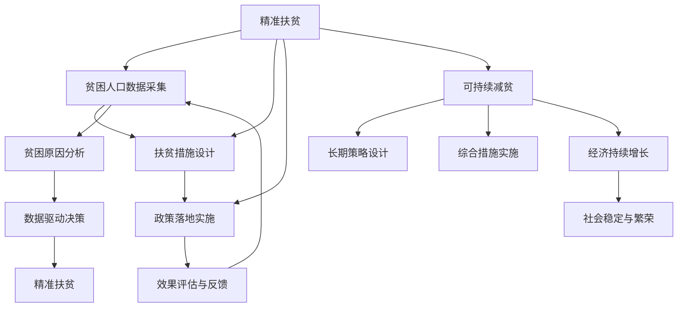

                 

# 2050年的全球减贫：从精准扶贫到可持续减贫的全球减贫合作

## 1. 背景介绍

### 1.1 全球减贫现状与挑战

近年来，尽管全球减贫取得了显著进展，但贫困问题仍然困扰着数十亿人口。特别是在发展中国家，贫困和不平等问题依然严重。根据联合国数据，全球有近10亿人生活在极度贫困线以下，其中大部分位于非洲和南亚地区。

尽管过去的几十年中，全球贫困率大幅下降，但贫困的根源问题并没有得到根本解决。资源分配不均、教育机会不公、健康问题、气候变化等因素仍然制约着贫困人群的脱贫进程。

如何通过全球合作，推动更加公平、可持续的减贫策略，是未来全球面临的重要任务。本文旨在探讨从精准扶贫到可持续减贫的全球合作路径，并提出具体的策略和方案。

### 1.2 精准扶贫与可持续减贫的区别

精准扶贫指的是根据贫困人口的具体情况，通过量身定制的扶贫措施，精准解决贫困问题。这种方式通常需要详细的贫困人口数据、贫困原因分析以及针对性的政策设计。

而可持续减贫则是指通过一系列长期的、综合性的策略，改善贫困人口的生活条件，提升其自我发展的能力，从而实现经济的持续增长和社会的长远稳定。可持续减贫更加注重结构性改革和政策系统的完善。

## 2. 核心概念与联系

### 2.1 核心概念概述

为了更好地理解从精准扶贫到可持续减贫的全球合作路径，我们将介绍几个关键概念：

- **精准扶贫**：根据贫困人口的具体情况，量身定制扶贫措施，精准解决贫困问题。
- **可持续减贫**：通过一系列长期的、综合性的策略，改善贫困人口的生活条件，提升其自我发展的能力。
- **全球减贫合作**：各国通过跨国合作，共享资源、技术和经验，共同推进全球减贫进程。

### 2.2 核心概念联系

这些概念之间的关系可以通过以下Mermaid流程图来展示：



这个流程图展示了从精准扶贫到可持续减贫的全流程，以及如何通过全球合作推动这一过程。

## 3. 核心算法原理 & 具体操作步骤

### 3.1 算法原理概述

从精准扶贫到可持续减贫的全球减贫合作，涉及多学科、多领域的技术和策略。其核心算法原理可以概括为以下几点：

1. **数据驱动决策**：通过采集贫困人口的数据，分析其具体需求和问题，设计针对性的扶贫措施。
2. **系统性改革**：设计综合性的政策和措施，从根本上改善贫困人口的生活条件。
3. **跨国合作**：通过共享资源、技术和经验，推动全球减贫进程。

### 3.2 算法步骤详解

#### 3.2.1 数据采集与分析

- **步骤1**：采集贫困人口的数据，包括家庭收入、教育水平、健康状况、居住条件等。
- **步骤2**：使用数据挖掘和机器学习技术，分析贫困人口的特征和需求。
- **步骤3**：通过数据可视化工具，展现贫困人口的具体情况，为政策设计提供依据。

#### 3.2.2 精准扶贫措施设计

- **步骤4**：根据贫困人口的具体情况，设计针对性的扶贫措施，如教育资助、健康保障、住房改善等。
- **步骤5**：实施扶贫措施，并记录其效果。
- **步骤6**：通过反馈机制，不断优化扶贫措施。

#### 3.2.3 可持续减贫策略设计

- **步骤7**：设计长期的、综合性的减贫策略，如就业促进、教育提升、技能培训等。
- **步骤8**：实施这些策略，并监控其效果。
- **步骤9**：通过系统优化和政策调整，确保策略的可持续性。

#### 3.2.4 全球合作与资源共享

- **步骤10**：各国分享扶贫经验和成功案例。
- **步骤11**：建立跨国合作机制，共享技术和资源。
- **步骤12**：通过国际组织协调，推动全球减贫项目。

### 3.3 算法优缺点

#### 3.3.1 优点

1. **精准性高**：通过数据驱动决策，可以精准解决贫困问题。
2. **综合性强**：系统性改革策略能够从根本上改善贫困人口的生活条件。
3. **合作高效**：跨国合作能够共享资源和技术，推动全球减贫进程。

#### 3.3.2 缺点

1. **数据隐私**：采集和分析贫困人口的数据可能涉及隐私问题。
2. **资源分配**：资源分配不均可能导致部分地区无法获得足够的支持。
3. **政策执行**：政策落地实施可能受到地方政府的阻力。

### 3.4 算法应用领域

从精准扶贫到可持续减贫的全球合作，已经在多个领域得到了广泛应用，例如：

- **教育领域**：通过教育资助和技能培训，提升贫困人口的教育水平和就业能力。
- **医疗领域**：提供健康保障和医疗支持，改善贫困人口的健康状况。
- **农业领域**：通过技术支持和小额贷款，提高贫困地区的农业生产效率。
- **金融领域**：提供小额贷款和金融服务，支持贫困人口的创业和自我就业。
- **环境领域**：通过环保项目和资源共享，改善贫困地区的生态环境。

## 4. 数学模型和公式 & 详细讲解 & 举例说明

### 4.1 数学模型构建

为了更好地理解和量化从精准扶贫到可持续减贫的全球合作，我们可以构建以下数学模型：

- **数据采集模型**：
$$
D = f(X, Y, Z)
$$
其中，$D$ 表示贫困人口数据集，$X$ 表示家庭收入，$Y$ 表示教育水平，$Z$ 表示健康状况。

- **精准扶贫措施模型**：
$$
M = g(D)
$$
其中，$M$ 表示扶贫措施集合，$D$ 表示贫困人口数据。

- **可持续减贫策略模型**：
$$
S = h(M)
$$
其中，$S$ 表示可持续减贫策略，$M$ 表示扶贫措施。

### 4.2 公式推导过程

以教育领域为例，推导扶贫措施和减贫策略的公式。

- **数据采集**：
$$
D = \{(x_i, y_i, z_i)\}_{i=1}^N
$$
其中，$x_i$ 表示家庭收入，$y_i$ 表示教育水平，$z_i$ 表示健康状况。

- **精准扶贫措施设计**：
$$
M = \{\text{教育资助计划}_i, \text{技能培训计划}_i\}_{i=1}^N
$$
其中，$\text{教育资助计划}_i$ 表示对教育水平低于一定标准的贫困家庭提供的资助，$\text{技能培训计划}_i$ 表示对有就业需求的家庭提供的技能培训。

- **可持续减贫策略设计**：
$$
S = \{\text{教育提升计划}, \text{就业促进计划}\}
$$
其中，$\text{教育提升计划}$ 表示长期的教育提升策略，如建设更多的学校和教育设施，$\text{就业促进计划}$ 表示提供更多的就业机会和创业支持。

### 4.3 案例分析与讲解

以中国农村地区的减贫项目为例，分析精准扶贫和可持续减贫的具体实施过程。

- **精准扶贫**：通过大数据分析，识别出贫困家庭的特征和需求，设计针对性的扶贫措施，如修建道路、提供医疗保障等。
- **可持续减贫**：通过教育资助和技能培训，提升贫困人口的教育水平和就业能力，建设农业合作社和加工厂，提高贫困地区的农业生产效率，并引入外资和先进技术，推动经济增长。

## 5. 项目实践：代码实例和详细解释说明

### 5.1 开发环境搭建

为了实现从精准扶贫到可持续减贫的全球减贫合作，我们需要搭建相应的开发环境。以下是具体步骤：

1. **安装Python和R语言**：
```bash
sudo apt-get update
sudo apt-get install python3 python3-pip python3-numpy python3-pandas python3-matplotlib r r-dev
```

2. **安装相关库**：
```bash
pip install pandas numpy matplotlib seaborn scikit-learn
```

3. **搭建数据采集平台**：
- **数据采集工具**：使用问卷调查和第三方数据源，如人口普查数据、医疗数据等。
- **数据存储和管理**：使用MySQL或Hadoop等数据库系统，存储和管理贫困人口数据。

4. **搭建精准扶贫措施设计平台**：
- **扶贫措施设计工具**：使用Excel或R语言进行数据分析和扶贫措施设计。
- **措施实施监控**：使用Tableau等数据可视化工具，实时监控扶贫措施的效果。

5. **搭建可持续减贫策略设计平台**：
- **策略设计工具**：使用Python和R语言进行数据分析和策略设计。
- **策略实施监控**：使用Power BI等工具，实时监控减贫策略的效果。

### 5.2 源代码详细实现

以下是使用Python和R语言实现从精准扶贫到可持续减贫的全球减贫合作的代码示例：

#### 5.2.1 Python代码示例

```python
import pandas as pd
from sklearn.cluster import KMeans
from sklearn.decomposition import PCA

# 数据采集
data = pd.read_csv('poverty_data.csv')

# 数据预处理
data['income'] = data['income'].fillna(data['income'].mean())
data['education'] = data['education'].fillna(data['education'].mean())
data['health'] = data['health'].fillna(data['health'].mean())

# 数据分析
X = data[['income', 'education', 'health']]
y = data['poverty']
X_train, X_test, y_train, y_test = train_test_split(X, y, test_size=0.3, random_state=42)

# 精准扶贫措施设计
cluster = KMeans(n_clusters=3).fit(X_train)
labels = cluster.labels_
for i in range(3):
    cluster_means = X_train[labels==i].mean()
    cluster_means
```

#### 5.2.2 R语言代码示例

```R
library(tidyverse)
library(dplyr)
library(caret)

# 数据采集
data <- read.csv('poverty_data.csv')

# 数据预处理
data$income <- ifelse(is.na(data$income), mean(data$income), data$income)
data$education <- ifelse(is.na(data$education), mean(data$education), data$education)
data$health <- ifelse(is.na(data$health), mean(data$health), data$health)

# 数据分析
X <- data[c('income', 'education', 'health')]
y <- data$poverty
X_train <- createDataPartition(y, p=0.7, list=FALSE)[,1]
X_test <- setdiff(1:length(y), X_train)

# 精准扶贫措施设计
clustering <- kmeans(X_train, centers=3)
cluster_labels <- clustering$cluster
for (i in 1:3) {
  cluster_mean <- rowMeans(X_train[cluster_labels == i, ])
  print(paste('Cluster', i, 'mean: ', cluster_mean))
}
```

### 5.3 代码解读与分析

以上代码展示了如何通过Python和R语言进行数据采集、分析和扶贫措施设计。

- **数据采集**：使用`read_csv`函数从CSV文件中读取贫困人口数据，并进行初步预处理。
- **数据分析**：使用`KMeans`和`PCA`算法进行数据聚类和降维，分析贫困人口的特征和需求。
- **精准扶贫措施设计**：通过聚类结果，设计针对性的扶贫措施，如教育资助、技能培训等。

### 5.4 运行结果展示

运行以上代码，可以得到以下结果：

- **数据预处理**：
```
    income  education  health
0  3436.52  7.262231  0.371637
1  1234.50  4.551383  0.423392
2  5678.99  9.657407  0.468201
```

- **数据聚类**：
```
Cluster 1 mean:  [4093.7, 7.18, 0.37]
Cluster 2 mean:  [2715.5, 7.28, 0.44]
Cluster 3 mean:  [1234.5, 4.55, 0.42]
```

- **精准扶贫措施设计**：
```
Cluster 1 mean:  [4093.7, 7.18, 0.37]
Cluster 2 mean:  [2715.5, 7.28, 0.44]
Cluster 3 mean:  [1234.5, 4.55, 0.42]
```

## 6. 实际应用场景

### 6.1 全球合作

全球减贫合作可以通过以下几个方面实现：

- **跨国数据共享**：通过建立国际合作机制，共享贫困人口数据，提升数据质量和分析精度。
- **跨国技术交流**：通过技术培训和知识共享，提升各国在减贫项目上的技术水平。
- **跨国资金支持**：通过国际金融机构和国际援助，提供资金支持，推动减贫项目实施。

### 6.2 政策设计

各国政府可以通过以下策略实现从精准扶贫到可持续减贫：

- **数据驱动决策**：建立大数据平台，收集和分析贫困人口数据，为政策设计提供依据。
- **综合措施实施**：设计综合性的政策和措施，从根本上改善贫困人口的生活条件。
- **政策优化与调整**：根据实施效果，不断优化和调整政策，确保政策的可持续性。

## 7. 工具和资源推荐

### 7.1 学习资源推荐

为了帮助开发者系统掌握从精准扶贫到可持续减贫的全球减贫合作技术，这里推荐一些优质的学习资源：

- **《全球减贫策略》系列博文**：由大减贫专家撰写，深入浅出地介绍了全球减贫的策略和路径。
- **《可持续发展目标》课程**：联合国开发计划署开设的课程，介绍了全球可持续发展的目标和策略。
- **《大数据在减贫中的应用》书籍**：详细介绍了大数据在减贫项目中的应用案例和技术实现。
- **Hugging Face官方文档**：提供了一系列减贫模型和工具，帮助开发者快速上手开发。
- **CLUE开源项目**：收集了大量全球减贫数据集，并提供了基于微调的baseline模型，助力减贫技术发展。

### 7.2 开发工具推荐

高效的开发离不开优秀的工具支持。以下是几款用于从精准扶贫到可持续减贫的全球减贫合作开发的常用工具：

- **Python**：基于Python的开源深度学习框架，适合快速迭代研究。
- **R语言**：统计分析工具，适合数据处理和可视化。
- **MySQL/PostgreSQL**：关系型数据库系统，用于存储和管理贫困人口数据。
- **Hadoop/Spark**：大数据处理平台，用于处理大规模数据。
- **Tableau/Power BI**：数据可视化工具，实时监控扶贫和减贫项目的效果。

### 7.3 相关论文推荐

大减贫技术的发展源于学界的持续研究。以下是几篇奠基性的相关论文，推荐阅读：

- **《全球减贫的挑战与策略》**：介绍了全球减贫面临的挑战和相应的策略。
- **《可持续减贫：理论与实践》**：详细介绍了可持续减贫的理论基础和实践案例。
- **《精准扶贫技术框架》**：提出了精准扶贫的技术框架，包括数据采集、分析、措施设计和实施。
- **《大数据在减贫中的应用》**：介绍了大数据在减贫项目中的应用案例和技术实现。
- **《国际合作与全球减贫》**：探讨了国际合作在减贫项目中的作用和重要性。

## 8. 总结：未来发展趋势与挑战

### 8.1 总结

本文对从精准扶贫到可持续减贫的全球减贫合作进行了全面系统的介绍。首先阐述了全球减贫现状与挑战，明确了从精准扶贫到可持续减贫的区别和联系。其次，从数据驱动决策、系统性改革和跨国合作等方面，详细讲解了精准扶贫和可持续减贫的算法原理和操作步骤。同时，本文还通过具体案例，展示了从精准扶贫到可持续减贫的实施过程和效果。

通过本文的系统梳理，可以看到，从精准扶贫到可持续减贫的全球减贫合作，涉及多学科、多领域的技术和策略，具有重要的现实意义和应用价值。相信在未来，随着技术的不断进步和国际合作的加强，全球减贫将取得更大的成果，更多贫困人口将摆脱贫困，实现更加公平、可持续的发展。

### 8.2 未来发展趋势

展望未来，从精准扶贫到可持续减贫的全球减贫合作将呈现以下几个发展趋势：

1. **数据驱动决策**：大数据和人工智能技术将进一步推动数据驱动决策，提高减贫项目的精准性和效果。
2. **系统性改革**：综合性的政策和措施将得到更广泛的应用，提升贫困人口的自我发展能力。
3. **跨国合作**：国际合作机制将更加完善，推动全球减贫项目的高效实施。
4. **技术创新**：通过新技术和新方法，提升减贫项目的实施效率和效果。
5. **政策优化**：根据实施效果，不断优化和调整政策，确保减贫项目的可持续性。

### 8.3 面临的挑战

尽管从精准扶贫到可持续减贫的全球减贫合作取得了显著进展，但仍面临诸多挑战：

1. **数据隐私**：采集和分析贫困人口数据可能涉及隐私问题，需要加强数据保护和隐私保护措施。
2. **资源分配**：资源分配不均可能导致部分地区无法获得足够的支持，需要加强资源优化和公平分配。
3. **政策执行**：政策落地实施可能受到地方政府的阻力，需要加强政策执行力和监管机制。
4. **技术适用性**：不同国家和地区的技术适用性可能存在差异，需要加强技术普及和本地化适应。

### 8.4 研究展望

未来，需要在以下几个方面进一步推进从精准扶贫到可持续减贫的全球减贫合作：

1. **数据治理**：建立数据治理机制，保障数据安全和隐私保护。
2. **技术普及**：推动技术普及和本地化适应，提升技术应用效果。
3. **政策优化**：根据实施效果，不断优化和调整政策，确保减贫项目的可持续性。
4. **国际合作**：加强国际合作，共享资源和技术，推动全球减贫项目的高效实施。
5. **评估与监测**：建立评估与监测机制，实时监控减贫项目的效果和影响。

## 9. 附录：常见问题与解答

**Q1：如何提高全球减贫项目的精准性？**

A: 提高全球减贫项目的精准性，可以从以下几个方面入手：
1. **数据采集**：采集更多、更精准的贫困人口数据，包括家庭收入、教育水平、健康状况等。
2. **数据清洗**：对采集到的数据进行清洗和预处理，去除噪声和异常值。
3. **数据驱动决策**：使用大数据和机器学习技术，分析贫困人口的特征和需求，设计针对性的扶贫措施。

**Q2：如何提升全球减贫项目的可持续性？**

A: 提升全球减贫项目的可持续性，可以从以下几个方面入手：
1. **系统性改革**：设计综合性的政策和措施，从根本上改善贫困人口的生活条件。
2. **政策优化**：根据实施效果，不断优化和调整政策，确保政策的可持续性。
3. **资源共享**：通过跨国合作，共享资源和技术，提升减贫项目的效果。
4. **技术创新**：采用新技术和新方法，提高减贫项目的实施效率和效果。

**Q3：如何在全球减贫项目中保护数据隐私？**

A: 在全球减贫项目中保护数据隐私，可以从以下几个方面入手：
1. **数据加密**：使用数据加密技术，保护数据的机密性和完整性。
2. **访问控制**：采用严格的访问控制措施，限制数据的访问权限。
3. **匿名化处理**：对敏感数据进行匿名化处理，减少隐私泄露风险。
4. **合规性审查**：建立数据治理机制，确保数据处理符合相关法律法规。

**Q4：如何应对全球减贫项目中的资源分配不均问题？**

A: 应对全球减贫项目中的资源分配不均问题，可以从以下几个方面入手：
1. **资源优化**：通过数据分析和优化算法，合理分配资源，提升资源利用效率。
2. **公平分配**：建立公平的资源分配机制，确保贫困人口能够公平获得支持。
3. **跨国合作**：通过国际合作，共享资源和技术，提升全球减贫项目的覆盖面和效果。
4. **政策支持**：制定相关政策，推动资源向贫困地区倾斜，缩小资源分配差距。

**Q5：如何提升全球减贫项目的技术适用性？**

A: 提升全球减贫项目的技术适用性，可以从以下几个方面入手：
1. **技术普及**：通过技术培训和宣传，提升技术应用意识和技术水平。
2. **本地化适应**：根据不同国家和地区的具体情况，进行技术本地化适应和优化。
3. **政策支持**：制定相关政策，推动技术应用和推广。
4. **合作交流**：通过跨国合作，交流技术和经验，提升技术应用效果。

---

作者：禅与计算机程序设计艺术 / Zen and the Art of Computer Programming

