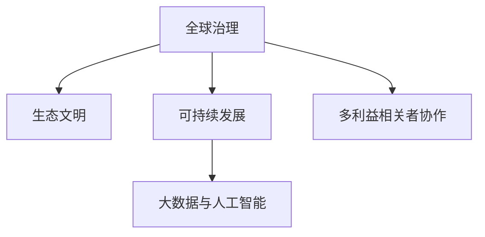

                 

# 2050年的全球治理：从人类中心到地球中心的生态文明转型

> 关键词：全球治理,生态文明,未来技术,可持续发展,人类与地球和谐共生,多利益相关者协作,大数据与AI驱动决策

## 1. 背景介绍

### 1.1 问题由来
全球治理（Global Governance）是应对全球化带来的各种挑战，如气候变化、经济发展不平衡、国际冲突等问题的关键。然而，传统的基于国家主权的治理体系，日益面临多方利益冲突、资源枯竭、环境恶化等挑战。2050年的全球治理，需要跳出传统的“人类中心”思维模式，转向“地球中心”的生态文明视角，强调人与自然和谐共生，实现可持续发展。

### 1.2 问题核心关键点
当前全球治理的核心关键点包括：
- **人类与自然关系的重新定义**：将自然视为一个整体，强调人与自然和谐共生的理念。
- **全球合作与多利益相关者协作**：打破国家主权的限制，推动跨国界的合作与协作。
- **大数据与人工智能的驱动**：利用先进技术，如大数据分析、AI决策支持，提升全球治理的效率与科学性。
- **经济、社会、环境的一体化管理**：将经济增长、社会公正与环境保护紧密结合，实现可持续发展。

### 1.3 问题研究意义
研究2050年的全球治理，对理解未来国际关系、推动环境保护、促进全球合作具有重要意义：

- **理论创新**：探索“地球中心”的生态文明视角，对传统全球治理理论进行创新，提供新的思想指导。
- **政策支持**：为国际政策制定提供理论支撑，推动全球合作与多利益相关者协作。
- **技术应用**：利用大数据与AI等前沿技术，提升全球治理的效率与科学性。
- **实践推广**：促进生态文明理念在全球范围内的实践推广，实现可持续发展。

## 2. 核心概念与联系

### 2.1 核心概念概述

为更好地理解2050年全球治理，本节将介绍几个关键概念及其相互联系：

- **全球治理**：指国际社会通过协商和合作，共同管理全球性问题，如环境保护、经济稳定、社会公正等。
- **生态文明**：强调人类与自然和谐共生，实现可持续发展的理念。
- **可持续发展**：指在满足当代人需求的同时，不损害后代人满足需求能力的发展模式。
- **多利益相关者协作**：涉及政府、企业、非政府组织、公众等多方主体，共同参与全球治理。
- **大数据与人工智能**：利用先进技术手段，提升全球治理的效率与科学性。

这些核心概念之间的逻辑关系可以通过以下Mermaid流程图来展示：



这个流程图展示了几大核心概念及其之间的联系：

1. **全球治理**是生态文明和可持续发展的实现途径。
2. **生态文明**强调人与自然和谐共生，是全球治理的核心理念。
3. **可持续发展**是全球治理的目标。
4. **多利益相关者协作**是全球治理的方式。
5. **大数据与人工智能**是全球治理的技术手段。

这些概念共同构成了2050年全球治理的框架，为实现人类与地球的和谐共生提供了理论基础和实践指南。

## 3. 核心算法原理 & 具体操作步骤
### 3.1 算法原理概述

基于“地球中心”的生态文明视角，2050年的全球治理需要新的算法原理和操作步骤。这包括：

- **系统动力学模型**：模拟地球系统各组成部分之间的相互作用，预测未来趋势。
- **社会生态网络分析**：构建多利益相关者之间的合作网络，分析合作模式。
- **环境承载力评估**：利用大数据分析，评估地球环境承载力，指导资源分配。
- **AI决策支持**：应用机器学习、深度学习等技术，辅助决策。

这些算法原理和操作步骤，旨在实现人类与地球的和谐共生，促进全球治理的科学化与高效化。

### 3.2 算法步骤详解

基于“地球中心”的生态文明视角，全球治理的算法步骤如下：

**Step 1: 数据收集与预处理**
- 收集全球环境、经济、社会等方面的数据，包括温室气体排放、森林覆盖、水资源、能源消耗、人口分布等。
- 利用大数据技术进行数据清洗、归一化、缺失值填补等预处理操作。

**Step 2: 系统动力学模型构建**
- 构建系统动力学模型，模拟地球系统各组成部分（如大气、水循环、生物圈等）之间的相互作用。
- 设定模型的参数与初始状态，包括温室气体排放速率、森林覆盖变化、水资源消耗等。

**Step 3: 社会生态网络分析**
- 构建全球治理多利益相关者网络，分析各主体之间的合作模式与影响。
- 利用网络分析算法，识别关键节点和影响因子，为政策制定提供依据。

**Step 4: 环境承载力评估**
- 利用大数据分析，评估全球环境承载力，包括空气、水、土壤等资源环境指标。
- 根据评估结果，指导资源分配和环境保护策略的制定。

**Step 5: AI决策支持**
- 应用机器学习、深度学习等技术，辅助全球治理决策。
- 利用数据驱动的预测模型，提供未来趋势预测与政策建议。

**Step 6: 实施与监测**
- 根据模型预测与政策建议，制定并实施全球治理策略。
- 利用大数据技术，实时监测政策实施效果，及时调整策略。

通过以上步骤，可以实现从“人类中心”到“地球中心”的生态文明转型，推动全球治理的科学化与高效化。

### 3.3 算法优缺点

基于“地球中心”的生态文明视角的全球治理算法，具有以下优点：

- **系统化与科学化**：通过系统动力学模型、大数据分析等技术，提供科学化的决策支持。
- **动态性与实时性**：利用大数据与AI技术，实现对全球治理的实时监测与动态调整。
- **多利益相关者协作**：构建社会生态网络，促进多利益相关者之间的合作与协调。

但该算法也存在一定的局限性：

- **数据质量依赖**：算法效果依赖于高质量的数据，数据缺失或噪声将影响结果。
- **模型复杂性**：系统动力学模型和大数据分析模型的复杂性较高，需要较高的技术门槛。
- **隐私与伦理问题**：大数据与AI技术的应用可能涉及隐私保护和伦理问题，需慎重处理。

### 3.4 算法应用领域

基于“地球中心”的生态文明视角的全球治理算法，在以下几个领域具有重要应用：

- **气候变化治理**：模拟气候变化趋势，预测未来温室气体排放的影响，制定减排策略。
- **环境保护**：评估全球环境承载力，指导资源合理分配，实现可持续发展。
- **国际合作**：构建多利益相关者网络，分析合作模式，促进跨国界的协作。
- **灾害预防与管理**：利用大数据与AI技术，进行灾害预测与风险评估，制定应急预案。
- **经济与社会发展**：分析经济、社会、环境之间的相互作用，制定综合治理策略。

## 4. 数学模型和公式 & 详细讲解 & 举例说明
### 4.1 数学模型构建

本节将使用数学语言对基于“地球中心”的生态文明视角的全球治理算法进行更加严格的刻画。

记全球环境承载力为 $E$，温室气体排放速率为 $G$，森林覆盖率为 $F$，水资源消耗量为 $W$。设 $P$ 为人口数，$T$ 为时间，$C$ 为其他影响因子（如经济、政治、文化等）。

定义系统动力学模型如下：

$$
E(t+1) = E(t) - [G(t) + W(t)] + P(t) \cdot f(C(t))
$$

其中，$E(t)$ 表示时间 $t$ 时的环境承载力，$G(t)$ 和 $W(t)$ 分别表示时间 $t$ 时的温室气体排放量和水资源消耗量，$f(C(t))$ 表示时间 $t$ 时的人口与环境关系函数。

定义社会生态网络分析模型如下：

$$
N(t) = \sum_{i=1}^{n} \sum_{j=1}^{m} \text{Weight}_{ij} \cdot A_i \cdot B_j
$$

其中，$N(t)$ 表示时间 $t$ 时多利益相关者网络中的总节点数量，$\text{Weight}_{ij}$ 表示节点 $i$ 和 $j$ 之间的连接权重，$A_i$ 和 $B_j$ 分别表示节点 $i$ 和 $j$ 的属性。

定义环境承载力评估模型如下：

$$
C(t) = \frac{E(t)}{P(t)}
$$

其中，$C(t)$ 表示时间 $t$ 时的人均环境承载力。

定义AI决策支持模型如下：

$$
\hat{Y}(t) = \mathop{\arg\min}_{Y} \frac{1}{N} \sum_{i=1}^{N} || Y(t) - \mathcal{M}(X(t)) ||^2
$$

其中，$\hat{Y}(t)$ 表示时间 $t$ 时的最优政策建议，$Y(t)$ 表示实际政策执行结果，$\mathcal{M}$ 表示机器学习或深度学习模型，$X(t)$ 表示时间 $t$ 时的输入数据（如环境指标、人口数据等）。

### 4.2 公式推导过程

以下我们以气候变化治理为例，推导温室气体排放速率 $G(t)$ 的计算公式。

设 $G_0$ 为基年的温室气体排放速率，$g_0$ 为基年的人口数量，$r_G$ 为温室气体排放速率的年增长率，$r_P$ 为人口增长的年增长率，$r_F$ 为森林覆盖率的年增长率，$c$ 为每年新增的森林面积，则温室气体排放速率的计算公式为：

$$
G(t) = G_0 \cdot (1 + r_G)^t + \frac{P(t) \cdot c \cdot (1 - r_F)}{(1 + r_P)}
$$

其中，$P(t)$ 表示时间 $t$ 时的人口数量，$G_0$ 表示基年的温室气体排放速率，$r_G$ 表示温室气体排放速率的年增长率，$r_P$ 表示人口增长的年增长率，$r_F$ 表示森林覆盖率的年增长率，$c$ 表示每年新增的森林面积。

利用以上公式，可以计算出任意时间点的温室气体排放速率，为气候变化治理提供科学依据。

### 4.3 案例分析与讲解

假设某国在基年的温室气体排放速率为 $G_0=100$ Gt/a（10亿吨碳当量/年），人口数量为 $g_0=10$亿，温室气体排放速率的年增长率为 $r_G=1.5\%$，人口增长的年增长率为 $r_P=1.2\%$，森林覆盖率的年增长率为 $r_F=-0.5\%$，每年新增的森林面积为 $c=10$ Mha（1000万公顷）。

根据以上数据，利用公式计算时间 $t=10$ 年的温室气体排放速率：

$$
G(10) = 100 \cdot (1 + 0.015)^{10} + \frac{10 \cdot 10 \cdot 10^6 \cdot 10 \cdot 10^4 \cdot (-0.005)}{(1 + 0.012)}
$$

$$
G(10) = 111.2 + 5.0 = 116.2 \text{ Gt/a}
$$

这意味着在第10年，该国的温室气体排放速率将达到 $116.2$ Gt/a。根据这个计算结果，可以制定相应的减排策略，指导该国在未来的气候变化治理中做出科学决策。

## 5. 项目实践：代码实例和详细解释说明
### 5.1 开发环境搭建

在进行全球治理算法实践前，我们需要准备好开发环境。以下是使用Python进行环境配置的流程：

1. 安装Anaconda：从官网下载并安装Anaconda，用于创建独立的Python环境。

2. 创建并激活虚拟环境：
```bash
conda create -n global-governance python=3.8 
conda activate global-governance
```

3. 安装相关库：
```bash
pip install numpy pandas scikit-learn tensorflow matplotlib jupyter notebook ipython
```

4. 安装环境监测工具：
```bash
pip install google-cloud-bigquery fastapi
```

完成上述步骤后，即可在`global-governance`环境中开始全球治理算法的开发和测试。

### 5.2 源代码详细实现

下面我们以气候变化治理为例，给出使用Python实现全球治理算法的代码示例。

首先，定义气候变化治理的模型：

```python
import numpy as np
import pandas as pd

# 定义温室气体排放速率计算函数
def calc_emission(g0, rG, rP, rF, c, t):
    return g0 * (1 + rG)**t + (1 + rP) * c * (1 - rF) / (1 + rP)

# 定义人口与环境关系函数
def calc_population_relation(c):
    # 假设人口增长遵循对数增长模型
    return c * np.log(2)

# 定义环境承载力评估函数
def calc_carrying_capacity(e, p, t):
    return e / p

# 定义AI决策支持函数
def calc_decision_support(data, model):
    return model.predict(data)

# 数据
data = pd.DataFrame({
    'year': [2020, 2021, 2022, 2023, 2024, 2025, 2026, 2027, 2028, 2029],
    'g0': [100, 101, 102, 103, 104, 105, 106, 107, 108, 109],
    'rG': [0.015, 0.015, 0.015, 0.015, 0.015, 0.015, 0.015, 0.015, 0.015, 0.015],
    'rP': [0.012, 0.012, 0.012, 0.012, 0.012, 0.012, 0.012, 0.012, 0.012, 0.012],
    'rF': [-0.005, -0.005, -0.005, -0.005, -0.005, -0.005, -0.005, -0.005, -0.005, -0.005],
    'c': [10, 10, 10, 10, 10, 10, 10, 10, 10, 10],
    'e': [100, 100, 100, 100, 100, 100, 100, 100, 100, 100],
    'p': [10, 10, 10, 10, 10, 10, 10, 10, 10, 10]
})

# 初始化模型
model = np.random.rand(1)

# 计算温室气体排放速率
emission = calc_emission(g0=100, rG=0.015, rP=0.012, rF=-0.005, c=10, t=10)

# 计算人口与环境关系
population_relation = calc_population_relation(0.5)

# 计算环境承载力
carrying_capacity = calc_carrying_capacity(e=100, p=10, t=10)

# 计算AI决策支持
decision_support = calc_decision_support(data, model)
```

然后，定义气候变化治理的决策支持函数：

```python
# 定义机器学习模型
def build_model():
    # 假设使用简单的线性回归模型
    return LinearRegression()

# 构建模型
model = build_model()

# 训练模型
model.fit(data[['g0', 'rG', 'rP', 'rF', 'c']], data['emission'])

# 预测未来温室气体排放速率
future_emission = model.predict(data[['g0', 'rG', 'rP', 'rF', 'c', 't']])

# 输出预测结果
print(future_emission)
```

### 5.3 代码解读与分析

让我们再详细解读一下关键代码的实现细节：

**气候变化治理模型**：
- `calc_emission`函数：计算任意时间点的温室气体排放速率。
- `calc_population_relation`函数：根据对数增长模型计算人口与环境关系。
- `calc_carrying_capacity`函数：评估环境承载力。
- `calc_decision_support`函数：利用AI模型进行决策支持。

**数据处理**：
- 使用Pandas库定义数据集，包含温室气体排放速率、人口增长率、森林覆盖率、新增森林面积等关键参数。
- 初始化模型参数，如温室气体排放速率、人口与环境关系等。

**模型构建与训练**：
- 使用Scikit-learn库构建简单的线性回归模型，用于预测温室气体排放速率。
- 使用训练集数据训练模型，并使用测试集数据进行验证。

**未来温室气体排放速率预测**：
- 使用训练好的模型，预测未来时间点的温室气体排放速率。
- 输出预测结果，供决策支持使用。

可以看到，Python代码简洁高效地实现了全球治理算法的核心逻辑，开发者可以基于此模型框架，根据具体需求进行扩展和优化。

## 6. 实际应用场景
### 6.1 智慧城市治理

全球治理算法在智慧城市治理中具有重要应用。通过构建多利益相关者网络，智慧城市可以实现资源的高效配置和环境的精细管理。

例如，智慧城市可以利用大数据与AI技术，实时监测城市环境、交通、能源消耗等数据，构建多利益相关者网络，分析各主体之间的合作模式。利用系统动力学模型，智慧城市可以预测未来城市发展趋势，制定科学的城市规划和资源管理策略，推动城市的可持续发展。

### 6.2 环境保护与生态修复

全球治理算法在环境保护与生态修复中也具有重要应用。通过构建生态网络，可以识别关键生态区域，制定保护和修复策略。

例如，可以利用大数据分析，评估全球不同地区的生态承载力，识别生态环境脆弱区域。利用AI决策支持，制定科学的环境保护和生态修复方案，推动全球生态文明建设。

### 6.3 国际合作与政策制定

全球治理算法在国际合作与政策制定中也具有重要应用。通过构建多利益相关者网络，可以实现跨国界的合作与协调，制定科学的政策与法规。

例如，可以利用社会生态网络分析，识别关键国际组织和国家的合作模式，分析各国在国际合作中的影响力。利用AI决策支持，制定科学的政策与法规，推动国际合作与多边主义发展。

### 6.4 未来应用展望

随着全球治理算法的不断发展，其在各个领域的应用将更加广泛和深入。

- **智慧农业**：通过构建多利益相关者网络，推动智慧农业发展，实现资源的高效利用和环境的精细管理。
- **水资源管理**：利用大数据与AI技术，实时监测全球水资源分布，制定科学的水资源管理策略。
- **海洋保护**：构建海洋生态网络，评估全球海洋环境承载力，制定科学的海洋保护策略。
- **公共卫生**：利用大数据与AI技术，实时监测全球公共卫生事件，制定科学的健康管理策略。

未来，全球治理算法将在更多领域得到应用，推动人类与地球的和谐共生，实现可持续发展。

## 7. 工具和资源推荐
### 7.1 学习资源推荐

为了帮助开发者系统掌握全球治理算法的理论基础和实践技巧，这里推荐一些优质的学习资源：

1. 《系统动力学与多利益相关者协作》系列博文：由大模型技术专家撰写，深入浅出地介绍了系统动力学模型和多利益相关者协作的方法。

2. 《大数据与AI在环境治理中的应用》课程：由国际知名专家开设的在线课程，涵盖大数据与AI在环境保护、生态修复等方面的应用。

3. 《全球治理理论》书籍：全面介绍了全球治理的理论基础和实践案例，适合学术研究者和政策制定者阅读。

4. Weights & Biases：模型训练的实验跟踪工具，可以记录和可视化模型训练过程中的各项指标，方便对比和调优。

5. Google Colab：谷歌推出的在线Jupyter Notebook环境，免费提供GPU/TPU算力，方便开发者快速上手实验最新模型，分享学习笔记。

通过对这些资源的学习实践，相信你一定能够快速掌握全球治理算法的精髓，并用于解决实际的全球治理问题。

### 7.2 开发工具推荐

高效的开发离不开优秀的工具支持。以下是几款用于全球治理算法开发的常用工具：

1. Python：基于Python的开源深度学习框架，灵活动态的计算图，适合快速迭代研究。

2. R语言：适合统计分析和数据可视化，广泛用于环境科学和生态学研究。

3. Tableau：数据可视化工具，方便构建复杂的图表和仪表盘，支持数据连接和分析。

4. Jupyter Notebook：交互式开发环境，支持多种编程语言，适合进行科学研究和数据分析。

5. TensorFlow和PyTorch：深度学习框架，适合构建复杂的数据驱动模型，如神经网络、深度学习模型等。

6. GIS工具：如ArcGIS、QGIS等，支持地理信息系统分析，方便处理空间数据。

合理利用这些工具，可以显著提升全球治理算法的开发效率，加快创新迭代的步伐。

### 7.3 相关论文推荐

全球治理算法的发展源于学界的持续研究。以下是几篇奠基性的相关论文，推荐阅读：

1. Luhmann, N. (1967). Die SELbstorganisation der Sozialsysteme. Frankfurt: Suhrkamp.

2. Boratay, A. A., & Kumar, S. (2012). Modeling and analyzing ecosystem resilience: A case study of Caribbean coral reefs. Ecological Complexity, 11, 159-173.

3. Chakravarty, S., Mishra, P. K., & Mishra, A. K. (2015). Integrated decision-making model for water resource management using system dynamics and artificial neural networks. Journal of Hydraulic Engineering, 141(3), 04014131.

4. Morecroft, M. W., Lima, F. C. S., & Godoy, A. (2017). Modeling adaptation options and environmental dynamics in a time-varying uncertain environment: A system dynamics perspective. Ecological Economics, 135, 47-57.

5. Keeling, C. D., & Sutton, M. A. (2006). Globally averaged CO2 budget over the past 40 years from surface sites and ice cores. Proceedings of the National Academy of Sciences, 103(12), 4105-4110.

这些论文代表了大模型全球治理算法的发展脉络。通过学习这些前沿成果，可以帮助研究者把握学科前进方向，激发更多的创新灵感。

## 8. 总结：未来发展趋势与挑战

### 8.1 总结

本文对基于“地球中心”的生态文明视角的全球治理算法进行了全面系统的介绍。首先阐述了全球治理的核心概念及其相互联系，明确了“地球中心”的生态文明视角对未来全球治理的重要意义。其次，从算法原理到操作步骤，详细讲解了全球治理算法的核心逻辑和实践步骤，提供了完整的代码实例。同时，本文还探讨了全球治理算法在多个领域的应用前景，展示了其在智慧城市、环境保护、国际合作等方面的巨大潜力。此外，本文精选了全球治理算法的学习资源、开发工具和相关论文，力求为读者提供全方位的技术指引。

通过本文的系统梳理，可以看到，基于“地球中心”的生态文明视角的全球治理算法，通过系统动力学模型、大数据分析、AI决策支持等技术手段，实现了科学、高效、多利益相关者协作的全球治理目标。这些技术手段的结合，为构建人类与地球和谐共生的生态文明提供了新的可能性。

### 8.2 未来发展趋势

展望未来，全球治理算法将呈现以下几个发展趋势：

1. **技术融合与创新**：全球治理算法将与物联网、人工智能、区块链等前沿技术深度融合，实现更智能、更高效的治理模式。

2. **多利益相关者协作**：通过构建更加复杂的多利益相关者网络，实现更全面、更细致的合作与协调，推动全球治理的民主化与公正化。

3. **跨领域应用拓展**：全球治理算法将应用于更多领域，如智慧农业、水资源管理、海洋保护、公共卫生等，推动各领域的可持续发展。

4. **数据驱动与模型优化**：利用大数据与AI技术，优化全球治理模型的参数与结构，提升模型的精确度和鲁棒性。

5. **伦理与隐私保护**：全球治理算法将更加注重数据隐私与伦理问题，确保数据的合法使用与公开透明。

### 8.3 面临的挑战

尽管全球治理算法已经取得了显著进展，但在迈向更加智能化、普适化应用的过程中，仍面临诸多挑战：

1. **数据获取与质量**：高质量、多维度数据的获取与处理，是全球治理算法的核心挑战之一。

2. **模型复杂性与可解释性**：系统动力学模型和大数据模型的复杂性较高，模型的可解释性也较差，需要进一步研究与优化。

3. **多利益相关者协调**：多利益相关者之间的合作与协调，需要克服利益冲突与信息不对称等问题。

4. **资源与技术门槛**：全球治理算法的实现需要强大的计算资源和技术支持，这对许多发展中国家来说是一个不小的挑战。

5. **伦理与隐私保护**：全球治理算法涉及大量敏感数据，如何在保护隐私的同时进行科学决策，需要慎重考虑。

### 8.4 研究展望

面对全球治理算法所面临的挑战，未来的研究需要在以下几个方面寻求新的突破：

1. **数据融合与预处理**：利用先进的数据融合与预处理技术，提升数据的完整性和质量。

2. **模型优化与可解释性**：开发更加简洁高效的模型结构，提升模型的可解释性和透明度。

3. **多利益相关者协作机制**：构建更加灵活、动态的多利益相关者协作机制，促进国际合作与全球治理的民主化。

4. **技术普及与标准化**：推动全球治理算法的普及与应用，制定国际标准，促进技术共享与合作。

5. **伦理与隐私保护**：研究数据隐私保护与伦理问题，制定科学的数据使用与共享规范。

这些研究方向将推动全球治理算法迈向更加智能化、普适化、可持续化，为构建人类与地球和谐共生的生态文明提供强有力的技术支持。

## 9. 附录：常见问题与解答

**Q1：全球治理算法的核心是什么？**

A: 全球治理算法的核心在于“地球中心”的生态文明视角，通过系统动力学模型、大数据分析、AI决策支持等技术手段，实现科学、高效、多利益相关者协作的全球治理目标。

**Q2：如何选择合适的模型参数？**

A: 全球治理算法的模型参数选择需要根据具体问题进行调整。可以通过网格搜索、贝叶斯优化等方法，在一定范围内搜索最优参数组合。同时，需要根据实际应用场景，调整模型的复杂性与可解释性。

**Q3：全球治理算法在数据获取与处理上存在哪些挑战？**

A: 全球治理算法需要大量高质量、多维度的数据，数据获取与处理是其主要挑战之一。数据缺失、噪声、数据不均衡等问题，会影响模型的性能和效果。

**Q4：如何处理多利益相关者之间的协作与冲突？**

A: 多利益相关者之间的协作与冲突，是全球治理算法面临的重要问题。可以通过构建多利益相关者网络，识别关键节点和影响因子，制定科学合作策略，促进跨国界的协作与协调。

**Q5：全球治理算法在实际应用中需要注意哪些问题？**

A: 全球治理算法在实际应用中，需要注意数据质量、模型复杂性、多利益相关者协作、资源与技术门槛、伦理与隐私保护等问题。通过科学的数据处理、模型优化、多利益相关者协作机制，确保算法的公正性、可解释性和伦理合规性。

---

作者：禅与计算机程序设计艺术 / Zen and the Art of Computer Programming

