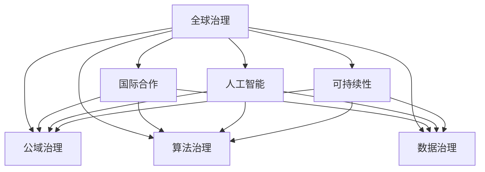

                 

# 2050年的全球治理：从国家主权到全球公域的治理模式创新

> 关键词：全球治理, 公域治理, 国际合作, 算法治理, 数据治理, 人工智能, 可持续性

## 1. 背景介绍

### 1.1 问题由来

随着全球化的深入发展，国家间的互联互通日益增强，跨国问题和全球挑战变得更加突出。气候变化、资源短缺、公共卫生危机等全球性问题，无法再由单一国家或地区单独应对。这就迫切需要新的全球治理模式，以实现多方协同、共同应对的治理目标。

当前，国家主权的框架下，国际组织、非政府组织等多边机制在全球治理中发挥着重要作用，但也存在协调困难、决策效率低等问题。随着人工智能、大数据等技术的快速发展，为解决这些难题提供了新的工具和方法。

### 1.2 问题核心关键点

全球治理的核心在于如何平衡国家主权与全球利益，以及如何高效、公正地制定和执行全球性政策。现代治理体系面临的挑战包括：

- 信息不对称问题：国家之间、不同区域之间的信息传递存在延迟和失真，影响决策效率和效果。
- 多方利益冲突：不同国家、地区、组织在资源分配、环境保护等方面存在利益冲突，导致决策过程复杂。
- 数据治理问题：数据获取、处理、共享等环节存在诸多挑战，影响决策科学性和公正性。
- 技术不平等问题：技术发展不均衡导致部分国家或地区在全球治理中处于劣势地位，影响治理的公平性和可及性。

## 2. 核心概念与联系

### 2.1 核心概念概述

为了更好地理解全球治理的创新模式，本节将介绍几个密切相关的核心概念：

- **全球治理**：指在超越国家主权框架下，通过多边机制和合作，解决全球性问题，维护国际秩序和共同利益的治理模式。

- **公域治理**：指在公共领域，如公共卫生、环境保护等，通过算法和数据驱动的治理机制，实现高效、公正的治理目标。

- **国际合作**：指国家、地区、组织之间基于共同目标的合作，通过信息共享、资源协同等方式，解决全球性问题。

- **算法治理**：指利用算法和数据科学的方法，对政策制定和执行进行优化和辅助，提升治理效率和公正性。

- **数据治理**：指在数据收集、处理、共享等环节，通过标准化和规范化的管理，确保数据的质量和隐私，促进数据的高效利用。

- **人工智能**：指模拟人类智能过程的技术，包括机器学习、自然语言处理、计算机视觉等，为全球治理提供了新的工具和方法。

- **可持续性**：指在考虑长远利益和环境影响的前提下，实现经济、社会、环境的综合发展，是全球治理的重要目标。

这些核心概念之间的逻辑关系可以通过以下Mermaid流程图来展示：



这个流程图展示了几大核心概念之间的联系和相互作用：

1. 全球治理是整体框架，通过公域治理、国际合作、算法治理、数据治理、人工智能、可持续性等具体手段，实现治理目标。
2. 公域治理是全球治理的重要组成部分，通过算法和数据驱动，实现高效、公正的治理。
3. 国际合作是全球治理的重要机制，通过信息共享、资源协同等方式，促进多方协同。
4. 算法治理和数据治理是公域治理的技术支撑，通过优化算法和规范数据，提升治理效率和公正性。
5. 人工智能是现代治理的工具，通过自然语言处理、计算机视觉等技术，提升治理的智能化水平。
6. 可持续性是全球治理的重要目标，通过经济、社会、环境综合发展，实现长远利益。

这些概念共同构成了未来全球治理的框架，为实现全球公域治理提供了新的思路和方法。

## 3. 核心算法原理 & 具体操作步骤

### 3.1 算法原理概述

基于算法和数据驱动的全球治理模式，其核心原理是通过收集、处理、分析全球数据，构建算法模型，辅助决策制定和执行。主要包括以下几个关键步骤：

1. **数据收集与预处理**：从不同国家、地区、组织收集相关数据，包括政策文档、环境监测数据、社会经济数据等。
2. **数据标准化**：通过统一的数据格式和标准，确保数据的质量和可比性。
3. **算法建模**：构建基于机器学习、深度学习的算法模型，对数据进行分析，提取有价值的信息。
4. **决策辅助**：将算法模型输出的结果，作为决策制定的辅助信息，提升决策的科学性和公正性。
5. **执行监控**：对政策执行过程进行监控，确保政策落实到位。

### 3.2 算法步骤详解

以环境保护为例，具体算法步骤详解如下：

**Step 1: 数据收集与预处理**

- **数据来源**：气候变化监测数据、环境污染监测数据、生态系统数据等。
- **数据格式**：不同来源的数据格式可能不同，需要进行格式转换和标准化。

**Step 2: 数据标准化**

- **统一格式**：将不同格式的数据转换为统一的标准格式，如CSV、JSON等。
- **数据清洗**：处理缺失值、异常值等，确保数据质量。

**Step 3: 算法建模**

- **选择合适的算法**：根据数据特点和问题需求，选择合适的算法模型，如回归模型、分类模型、聚类模型等。
- **模型训练**：使用历史数据训练模型，优化模型参数。
- **模型验证**：在验证集上评估模型性能，调整模型参数。

**Step 4: 决策辅助**

- **模型输出**：将新数据输入训练好的模型，获取模型预测结果。
- **决策制定**：根据模型预测结果，结合专家意见和多方利益，制定决策方案。

**Step 5: 执行监控**

- **数据监控**：持续收集政策执行过程中的数据，评估政策效果。
- **效果评估**：分析政策效果，调整政策方案，确保政策目标达成。

### 3.3 算法优缺点

基于算法驱动的全球治理模式，具有以下优点：

1. **高效性**：通过算法自动化处理数据，提高决策速度和执行效率。
2. **公正性**：算法模型可以避免人为偏见，提供客观、公正的决策依据。
3. **透明性**：算法决策过程透明，可追溯，便于监管和审计。
4. **可扩展性**：算法模型可以适应不同问题需求，灵活应用。

同时，该方法也存在以下局限：

1. **数据质量问题**：数据质量不高可能导致模型效果不佳。
2. **模型偏见**：算法模型可能继承训练数据中的偏见，影响决策公正性。
3. **技术门槛高**：算法建模需要一定的技术背景，对使用者要求较高。
4. **解释性不足**：复杂的算法模型可能难以解释，影响信任度。

### 3.4 算法应用领域

基于算法驱动的全球治理模式，已经在多个领域得到应用，例如：

- **环境保护**：通过算法模型分析环境数据，制定环境保护政策，监测政策执行效果。
- **公共卫生**：利用算法模型分析疫情数据，制定防疫措施，监测疫情发展。
- **经济治理**：构建经济预测模型，分析经济数据，制定宏观调控政策。
- **社会治理**：通过算法模型分析社会数据，优化资源配置，提升社会治理效率。

此外，基于算法驱动的全球治理模式还将在更多领域得到应用，为全球治理提供新的技术支撑。

## 4. 数学模型和公式 & 详细讲解 & 举例说明

### 4.1 数学模型构建

以环境保护为例，构建数学模型如下：

假设目标变量为 $y$，代表某地区的空气质量指数（AQI），输入变量为 $x_1, x_2, ..., x_n$，代表历史气象数据、工业排放数据、城市规模等。构建回归模型如下：

$$
y = \beta_0 + \beta_1 x_1 + \beta_2 x_2 + ... + \beta_n x_n + \epsilon
$$

其中 $\beta_0, \beta_1, ..., \beta_n$ 为回归系数，$\epsilon$ 为误差项。

### 4.2 公式推导过程

对于上述回归模型，求解 $\beta_0, \beta_1, ..., \beta_n$ 的最小二乘估计，采用普通最小二乘法（OLS）求解，公式如下：

$$
\hat{\beta} = (X^TX)^{-1}X^Ty
$$

其中 $X$ 为数据矩阵，$y$ 为目标向量，$\hat{\beta}$ 为回归系数估计值。

### 4.3 案例分析与讲解

以美国纽约市空气质量监测数据为例，构建回归模型：

- **数据集**：收集纽约市历史气象数据、工业排放数据、城市规模等。
- **模型选择**：选择线性回归模型。
- **模型训练**：使用历史数据训练模型，优化回归系数。
- **模型验证**：在验证集上评估模型性能，调整模型参数。
- **决策辅助**：根据模型预测结果，制定环保政策，监测政策执行效果。

## 5. 项目实践：代码实例和详细解释说明

### 5.1 开发环境搭建

在进行项目实践前，我们需要准备好开发环境。以下是使用Python进行Scikit-learn开发的环境配置流程：

1. 安装Anaconda：从官网下载并安装Anaconda，用于创建独立的Python环境。

2. 创建并激活虚拟环境：
```bash
conda create -n sklearn-env python=3.8 
conda activate sklearn-env
```

3. 安装Scikit-learn：
```bash
pip install scikit-learn
```

4. 安装各类工具包：
```bash
pip install numpy pandas matplotlib scikit-learn 
```

完成上述步骤后，即可在`sklearn-env`环境中开始项目实践。

### 5.2 源代码详细实现

这里我们以线性回归模型为例，给出使用Scikit-learn进行环境保护任务建模的Python代码实现。

```python
import pandas as pd
from sklearn.linear_model import LinearRegression
from sklearn.model_selection import train_test_split
from sklearn.metrics import mean_squared_error, r2_score

# 加载数据集
data = pd.read_csv('air_quality_data.csv')

# 数据预处理
X = data[['temperature', 'humidity', 'wind_speed', 'air_pollutants', 'population']]
y = data['aqi']

# 划分训练集和测试集
X_train, X_test, y_train, y_test = train_test_split(X, y, test_size=0.2, random_state=42)

# 构建线性回归模型
model = LinearRegression()

# 模型训练
model.fit(X_train, y_train)

# 模型验证
y_pred = model.predict(X_test)
mse = mean_squared_error(y_test, y_pred)
r2 = r2_score(y_test, y_pred)
print(f'Mean Squared Error: {mse:.2f}')
print(f'R-squared: {r2:.2f}')

# 决策辅助
new_data = pd.DataFrame({'temperature': 25, 'humidity': 60, 'wind_speed': 10, 'air_pollutants': 50, 'population': 1000000})
new_X = new_data
new_y_pred = model.predict(new_X)
print(f'Predicted AQI: {new_y_pred[0]}')
```

### 5.3 代码解读与分析

让我们再详细解读一下关键代码的实现细节：

**数据加载与预处理**：
- `pd.read_csv`：使用Pandas加载CSV格式的数据集。
- `train_test_split`：将数据集划分为训练集和测试集，比例为80:20。

**模型构建与训练**：
- `LinearRegression`：创建线性回归模型对象。
- `fit`：在训练集上训练模型，优化回归系数。

**模型验证与评估**：
- `mean_squared_error`：计算模型预测值与真实值之间的均方误差。
- `r2_score`：计算模型预测值的决定系数（R-squared），衡量模型的拟合程度。

**决策辅助**：
- `predict`：对新的数据进行预测。
- `new_data`：创建新的数据样本。
- `new_X`：将新数据转换为模型输入格式。
- `new_y_pred`：使用训练好的模型对新数据进行预测。

## 6. 实际应用场景

### 6.1 智能环保监测

基于算法驱动的全球治理模式，可以应用于智能环保监测系统。传统环保监测系统需要大量人力物力，且监测效果受人为因素影响较大。利用算法驱动的智能监测系统，可以实时监测环境数据，自动生成环境报告，提升监测效率和准确性。

在技术实现上，可以通过传感器收集环境数据，利用算法模型分析数据，实时监测空气质量、水质等环境指标。对于异常数据，系统自动报警并采取措施，如启动空气净化器、紧急排水等。此外，还可以将监测数据上传至云端，供公众查询和分析，提升环境治理的透明度和参与度。

### 6.2 全球疫情监控

在全球疫情暴发期间，算法驱动的全球治理模式在疫情监控中发挥了重要作用。通过收集和分析全球疫情数据，构建疫情预测模型，可以有效预测疫情发展趋势，制定防控措施。

在技术实现上，可以收集全球各国的疫情数据，包括确诊人数、治愈人数、死亡人数等。利用算法模型对数据进行分析和预测，及时发现疫情热点地区，采取隔离、封锁等措施。同时，可以将预测结果共享给全球各国，共同应对疫情挑战。

### 6.3 经济预测与分析

在全球经济一体化的大背景下，算法驱动的全球治理模式可以用于经济预测与分析，帮助各国制定经济政策，应对经济波动。

在技术实现上，可以收集全球各国的经济数据，包括GDP、通货膨胀率、失业率等。利用算法模型对数据进行分析和预测，评估各国经济状况，制定宏观调控政策。同时，可以将预测结果共享给各国政府和国际组织，协助全球经济治理。

### 6.4 未来应用展望

随着算法驱动的全球治理模式的不断发展，未来的应用场景将更加广泛，为全球治理带来新的变革：

1. **多模态数据融合**：未来算法将融合视觉、听觉、文本等多模态数据，提升治理的全面性和准确性。
2. **分布式协同治理**：利用区块链等技术，实现跨国家和跨组织的分布式协同治理，提升治理的透明性和公平性。
3. **可持续性治理**：算法驱动的治理模式将更加注重可持续发展，通过优化资源配置，实现环境、经济、社会的协同发展。
4. **智能政策制定**：算法模型将更加智能化，通过大数据分析，辅助政策制定和执行，提升治理的科学性和公正性。
5. **人工智能伦理**：随着人工智能技术的发展，算法驱动的全球治理模式将面临更多伦理问题，如何确保算法公正、透明、可解释，将成为重要的研究方向。

## 7. 工具和资源推荐

### 7.1 学习资源推荐

为了帮助开发者系统掌握基于算法驱动的全球治理的理论基础和实践技巧，这里推荐一些优质的学习资源：

1. **《机器学习实战》系列博文**：由机器学习领域专家撰写，深入浅出地介绍了机器学习算法和应用，包括数据预处理、模型选择、算法评估等。
2. **Coursera《机器学习》课程**：由斯坦福大学开设的机器学习课程，涵盖机器学习的基本概念和经典模型。
3. **《Python机器学习》书籍**：适合Python初学者，系统介绍了机器学习算法的实现方法和应用场景。
4. **Kaggle竞赛平台**：全球知名的数据科学竞赛平台，提供了丰富的数据集和算法竞赛，助力算法驱动的全球治理研究。
5. **Google AI 研究博客**：分享Google AI团队的研究成果和技术进展，提供前沿的算法驱动治理技术参考。

通过对这些资源的学习实践，相信你一定能够快速掌握基于算法驱动的全球治理的精髓，并用于解决实际的全球治理问题。

### 7.2 开发工具推荐

高效的开发离不开优秀的工具支持。以下是几款用于算法驱动全球治理开发的常用工具：

1. **Jupyter Notebook**：开源的交互式编程环境，支持Python、R等语言，方便进行数据处理和算法验证。
2. **TensorFlow**：由Google开发的深度学习框架，支持分布式计算和模型优化，适用于大规模数据处理。
3. **PyTorch**：Facebook开发的深度学习框架，灵活的动态计算图，适合快速迭代研究。
4. **Scikit-learn**：Python机器学习库，提供丰富的算法模型和工具，方便进行数据处理和模型训练。
5. **Keras**：基于TensorFlow和Theano的高级神经网络API，易于上手，适合快速开发原型。

合理利用这些工具，可以显著提升算法驱动全球治理任务的开发效率，加快创新迭代的步伐。

### 7.3 相关论文推荐

算法驱动的全球治理技术的发展源于学界的持续研究。以下是几篇奠基性的相关论文，推荐阅读：

1. **《机器学习基础》**：周志华所著，全面介绍了机器学习的基本原理和算法，是机器学习领域的经典教材。
2. **《深度学习》**：Ian Goodfellow、Yoshua Bengio、Aaron Courville合著，介绍了深度学习的基本概念和应用，是深度学习领域的经典教材。
3. **《机器学习实战》**：Peter Harrington撰写，提供了丰富的实际案例和代码实现，适合入门学习和实践。
4. **《人工智能伦理》**：Andrew Ng撰写，探讨了人工智能技术的伦理问题和社会影响，为算法驱动的全球治理提供伦理指导。

这些论文代表了大数据和算法驱动全球治理的发展脉络。通过学习这些前沿成果，可以帮助研究者把握学科前进方向，激发更多的创新灵感。

## 8. 总结：未来发展趋势与挑战

### 8.1 总结

本文对基于算法驱动的全球治理模式进行了全面系统的介绍。首先阐述了算法驱动全球治理的背景和意义，明确了算法在提升治理效率和公正性方面的独特价值。其次，从原理到实践，详细讲解了算法驱动的全球治理的数学原理和操作步骤，给出了算法驱动全球治理任务的完整代码实例。同时，本文还广泛探讨了算法驱动的全球治理在环境保护、疫情监控、经济预测等实际应用场景中的前景，展示了算法驱动全球治理范式的巨大潜力。最后，本文精选了算法驱动全球治理的学习资源，力求为读者提供全方位的技术指引。

通过本文的系统梳理，可以看到，基于算法驱动的全球治理模式正在成为全球治理的重要范式，极大地提升了全球治理的效率和公正性。算法驱动的全球治理模式将与国际合作、公域治理、可持续发展等原则相结合，共同推动全球治理的进步。

### 8.2 未来发展趋势

展望未来，算法驱动的全球治理模式将呈现以下几个发展趋势：

1. **多模态融合**：算法将融合视觉、听觉、文本等多模态数据，提升治理的全面性和准确性。
2. **分布式协同**：利用区块链等技术，实现跨国家和跨组织的分布式协同治理，提升治理的透明性和公平性。
3. **可持续性发展**：算法驱动的治理模式将更加注重可持续发展，通过优化资源配置，实现环境、经济、社会的协同发展。
4. **智能化决策**：算法模型将更加智能化，通过大数据分析，辅助政策制定和执行，提升治理的科学性和公正性。
5. **伦理与隐私**：随着算法技术的广泛应用，算法驱动的全球治理模式将面临更多伦理和隐私问题，如何确保算法公正、透明、可解释，将成为重要的研究方向。

以上趋势凸显了算法驱动全球治理技术的广阔前景。这些方向的探索发展，必将进一步提升全球治理的效率和公正性，为构建安全、可靠、可解释、可控的全球治理系统铺平道路。

### 8.3 面临的挑战

尽管算法驱动的全球治理技术已经取得了显著进展，但在迈向更加智能化、普适化应用的过程中，它仍面临诸多挑战：

1. **数据质量问题**：数据质量不高可能导致模型效果不佳，影响治理决策的科学性和公正性。
2. **模型偏见问题**：算法模型可能继承训练数据中的偏见，影响决策公正性。
3. **技术门槛高**：算法建模需要一定的技术背景，对使用者要求较高，限制了算法驱动治理的普及。
4. **隐私保护问题**：算法处理大量敏感数据，如何保护数据隐私和安全，将成为重要课题。
5. **伦理与公平**：算法驱动的治理模式需要考虑伦理问题，避免算法滥用，确保公平公正。

这些挑战需要通过技术创新、政策引导、多方合作等方式共同应对，才能实现算法驱动全球治理的可持续发展和广泛应用。

### 8.4 研究展望

面向未来，算法驱动的全球治理技术需要在以下几个方面寻求新的突破：

1. **数据治理框架**：构建标准化的数据治理框架，确保数据质量和隐私保护。
2. **多模态融合技术**：研究多模态数据融合方法，提升治理的全面性和准确性。
3. **分布式协同治理**：研究分布式协同治理机制，提升治理的透明性和公平性。
4. **人工智能伦理**：研究人工智能伦理问题，确保算法公正、透明、可解释。
5. **可持续性治理**：研究可持续发展治理方法，提升治理的可持续性。

这些研究方向的探索，必将引领算法驱动全球治理技术的进一步发展和完善，为构建安全、可靠、可解释、可控的全球治理系统提供技术支撑。只有勇于创新、敢于突破，才能不断拓展算法驱动全球治理的边界，让全球治理技术更好地服务于全人类社会。

## 9. 附录：常见问题与解答

**Q1: 算法驱动的全球治理如何确保公平性和透明性？**

A: 算法驱动的全球治理通过标准化数据和算法模型，确保治理过程的公平性和透明性。具体措施包括：

1. 数据标准化：采用统一的数据格式和标准，确保数据质量一致。
2. 模型公开：公开算法模型和代码，允许多方审计和验证。
3. 决策透明：记录决策过程和依据，提供可追溯的决策日志。
4. 多方参与：鼓励多方参与，形成多方协同的治理机制。

这些措施共同确保了算法驱动全球治理的公平性和透明性，提升了治理的可信度和可接受度。

**Q2: 算法驱动的全球治理如何应对数据质量问题？**

A: 数据质量问题是算法驱动全球治理的重要挑战。为了应对这一问题，可以采取以下措施：

1. 数据预处理：通过数据清洗、异常值处理、特征选择等方法，提高数据质量。
2. 数据增强：通过数据生成和增强技术，扩充数据集，提升数据多样性。
3. 模型验证：通过交叉验证、模型评估等方法，评估模型效果，筛选出高质量模型。
4. 数据融合：通过多源数据融合技术，综合不同数据来源的信息，提高数据质量。

通过这些措施，可以有效提升算法驱动全球治理的数据质量，确保治理决策的科学性和公正性。

**Q3: 算法驱动的全球治理如何应对模型偏见问题？**

A: 模型偏见是算法驱动全球治理面临的重要问题。为了应对这一问题，可以采取以下措施：

1. 数据平衡：确保训练数据集的多样性和平衡性，避免数据偏差。
2. 偏见检测：使用偏差检测技术，识别和纠正模型中的偏见。
3. 算法公平性评估：评估模型在公平性方面的表现，确保模型公正性。
4. 多模型集成：通过集成多个模型，降低单一模型偏见的风险。

通过这些措施，可以有效减少算法模型中的偏见，确保治理决策的公正性和公平性。

**Q4: 算法驱动的全球治理如何应对技术门槛问题？**

A: 技术门槛是算法驱动全球治理普及的重要障碍。为了应对这一问题，可以采取以下措施：

1. 简化算法模型：采用简化模型和算法，降低技术难度。
2. 培训和教育：提供算法的培训和教育资源，提升用户的技术水平。
3. 开源社区：建立开源社区，提供算法的开源代码和文档，促进算法共享和协作。
4. 自动化工具：开发自动化工具，简化算法应用流程，降低技术门槛。

通过这些措施，可以有效降低算法驱动全球治理的技术门槛，促进算法在各领域的广泛应用。

**Q5: 算法驱动的全球治理如何应对隐私保护问题？**

A: 隐私保护是算法驱动全球治理的重要挑战。为了应对这一问题，可以采取以下措施：

1. 数据匿名化：对敏感数据进行匿名化处理，保护个人隐私。
2. 数据加密：采用数据加密技术，保护数据传输和存储安全。
3. 数据访问控制：实施数据访问控制策略，限制数据访问权限。
4. 隐私保护算法：使用隐私保护算法，如差分隐私、联邦学习等，保护数据隐私。

通过这些措施，可以有效保护算法驱动全球治理中的隐私安全，确保数据使用合法合规。

**Q6: 算法驱动的全球治理如何应对伦理与公平问题？**

A: 伦理与公平是算法驱动全球治理的重要课题。为了应对这一问题，可以采取以下措施：

1. 伦理框架：建立全球伦理框架，规范算法应用行为。
2. 伦理评估：评估算法在伦理方面的表现，确保算法公正性。
3. 伦理监督：实施伦理监督机制，确保算法应用合规。
4. 伦理教育：加强伦理教育，提升用户和开发者对伦理问题的认识。

通过这些措施，可以有效应对算法驱动全球治理中的伦理与公平问题，确保治理行为的合法合规。

---

作者：禅与计算机程序设计艺术 / Zen and the Art of Computer Programming

