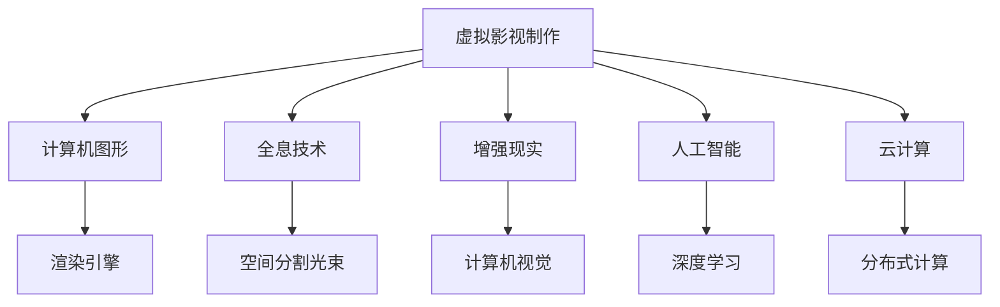

                 

# 2050年的数字创意：从虚拟影视制作到全息互动娱乐的数字内容产业

在2050年，数字创意产业将以全新的面貌呈现于世人面前。从虚拟影视制作到全息互动娱乐，数字内容产业正迎来一场由人工智能、全息技术、云计算等前沿科技驱动的变革。本文将深入探讨这些技术如何重塑数字内容产业的未来，探索其在2050年可能的发展趋势和面临的挑战。

## 1. 背景介绍

### 1.1 数字创意产业的现状

当前，数字创意产业正蓬勃发展，数字影视、虚拟现实、增强现实等技术广泛应用。然而，这些技术仍存在诸如用户体验不够沉浸、交互性有限、内容创作成本高等问题。2050年，随着技术的进一步突破，这些问题将得到有效解决，数字创意产业将迎来新的飞跃。

### 1.2 2050年数字创意产业的特征

1. **高度沉浸式体验**：利用全息技术、虚拟现实、增强现实等手段，创造高度沉浸的观看和交互体验。
2. **AI驱动的内容创作**：通过人工智能生成技术，自动化生产海量高质量数字内容。
3. **个性化定制**：基于用户行为数据，提供高度个性化的内容推荐和创作。
4. **全球化协作**：利用云平台实现全球化内容创作和分发。
5. **高度互动**：用户能够与数字内容进行深度互动，甚至成为内容的一部分。

## 2. 核心概念与联系

### 2.1 核心概念概述

为更好地理解数字内容产业的未来，本节将介绍几个核心概念：

- **虚拟影视制作**：指利用计算机图形、虚拟现实等技术制作虚拟影片的过程，通过计算机生成虚拟环境、角色和特效。
- **全息技术**：一种通过空间分割光束，再现三维物体立体影像的技术，实现用户与虚拟角色的空间交互。
- **增强现实**：通过计算机生成图像或视频，增强用户对现实世界的感知和互动。
- **人工智能**：通过机器学习和深度学习技术，自动化生成和处理海量数据，支持内容创作和个性化推荐。
- **云计算**：通过互联网提供按需计算资源，实现内容创作、存储、分发等功能的分布式处理。

这些核心概念之间有着紧密的联系，共同构成了2050年数字创意产业的技术基础。

### 2.2 核心概念原理和架构的 Mermaid 流程图



这个流程图展示了数字内容产业的核心概念和技术架构：

1. **虚拟影视制作**：通过计算机图形和渲染引擎生成虚拟场景和角色。
2. **全息技术**：利用空间分割光束再现虚拟物体的立体影像，实现空间交互。
3. **增强现实**：通过计算机视觉技术增强用户对现实世界的感知和互动。
4. **人工智能**：利用深度学习等技术自动化生成和处理数据。
5. **云计算**：通过分布式计算提供按需计算资源，支持内容创作和分发。

## 3. 核心算法原理 & 具体操作步骤

### 3.1 算法原理概述

2050年的数字内容产业将高度依赖人工智能、全息技术和增强现实等技术。这些技术的核心算法原理包括但不限于：

- **计算机图形学**：通过数学模型和算法生成逼真的三维图形和动画。
- **深度学习**：通过神经网络模型自动化生成和处理海量数据，实现内容推荐和个性化定制。
- **全息技术**：利用光束分割和相干成像技术，将三维物体立体影像重构于三维空间中。
- **增强现实**：通过计算机视觉技术，实时处理和叠加虚拟信息到现实场景中。

### 3.2 算法步骤详解

1. **预处理**：收集和整理高质量的3D模型、音频和视频数据，为内容创作做准备。
2. **内容生成**：使用计算机图形学和深度学习算法，自动化生成虚拟场景、角色和特效。
3. **全息渲染**：利用全息技术，将虚拟物体的立体影像重构到三维空间中。
4. **增强现实**：通过增强现实技术，将虚拟信息叠加到现实场景中，实现用户与虚拟内容的互动。
5. **个性化推荐**：基于用户行为数据，使用深度学习模型进行个性化内容推荐。
6. **分发与协作**：利用云计算平台，实现全球化内容创作和协作。

### 3.3 算法优缺点

#### 优点：

- **高效性**：自动化生成和处理海量数据，大大降低内容创作成本和时间。
- **沉浸性**：通过全息技术和增强现实，提供高度沉浸的体验。
- **个性化**：基于用户数据，实现高度个性化的内容推荐和创作。
- **分布式协作**：利用云计算，实现全球化内容创作和协作。

#### 缺点：

- **技术门槛高**：需要高水平的计算机图形学和深度学习技术。
- **设备需求高**：用户需要配备高性能的计算机或移动设备，才能体验全息和增强现实内容。
- **内容审核难度大**：如何确保内容的真实性和安全性，是一个需要解决的问题。

### 3.4 算法应用领域

这些核心算法和技术在多个领域都有广泛的应用，包括但不限于：

- **虚拟影视制作**：用于电影、动画、广告等领域的虚拟场景和角色创作。
- **游戏开发**：实现虚拟角色和环境，提供高度沉浸的游戏体验。
- **医疗模拟**：用于手术培训和医疗教学，提高医疗水平。
- **教育和培训**：提供虚拟课堂和实验环境，提升教学效果。
- **房地产和建筑**：用于虚拟房产展示和建筑设计，提高客户体验。

## 4. 数学模型和公式 & 详细讲解 & 举例说明

### 4.1 数学模型构建

在数字内容产业中，许多核心技术都涉及复杂的数学模型和算法。以下简要介绍几个关键模型：

- **计算机图形学的几何模型**：用于表示三维物体的形状和位置，常见模型包括球体、立方体、网格模型等。
- **深度学习模型**：用于自动化生成和处理数据，常见模型包括卷积神经网络(CNN)、循环神经网络(RNN)、生成对抗网络(GAN)等。
- **全息技术的波场重构模型**：用于将虚拟物体的立体影像重构到三维空间中，常见方法包括傅里叶变换、相位重构等。
- **增强现实的空间定位模型**：用于实时处理和叠加虚拟信息到现实场景中，常见方法包括SLAM、VSLAM等。

### 4.2 公式推导过程

以下是几个核心模型和算法的基本公式推导：

**计算机图形学中的几何模型**：

- 球体方程：$x^2 + y^2 + z^2 = r^2$
- 立方体顶点坐标：$(-1,-1,-1), (-1,1,-1), (1,-1,-1), (1,1,-1), (-1,-1,1), (-1,1,1), (1,-1,1), (1,1,1)$

**深度学习中的卷积神经网络**：

- 卷积层公式：$C_{l+1}=\sigma(\mathbf{W}_l * C_l + b_l)$
- 池化层公式：$C_{l+1}=\mathbf{W}_l * C_l + b_l$

**全息技术的波场重构**：

- 傅里叶变换公式：$F(\omega) = \int_{-\infty}^{\infty} f(x)e^{-2\pi i \omega x} dx$
- 相位重构公式：$F(x,y) = \sum_k e^{ik(x_x+y_y+z_z)}$

**增强现实的空间定位**：

- SLAM算法：$x_t=f(x_{t-1},u_t,v_t,\omega_t)$
- VSLAM算法：$x_t=f(x_{t-1},u_t,v_t,\omega_t)$

### 4.3 案例分析与讲解

**虚拟影视制作案例**：

1. **建模**：使用三维建模软件，将场景和角色建模为几何模型。
2. **纹理映射**：将纹理贴图映射到几何模型上，增加模型的真实感。
3. **动画制作**：通过计算机动画技术，生成角色的运动和表情。
4. **渲染**：使用渲染引擎，将场景和角色渲染成高质量的图像和视频。

**全息互动娱乐案例**：

1. **虚拟角色生成**：使用深度学习模型，生成具有复杂行为的虚拟角色。
2. **全息场景重构**：利用全息技术，将虚拟角色和场景重构到三维空间中。
3. **增强现实互动**：通过增强现实技术，将虚拟角色和场景叠加到用户的现实世界中。
4. **实时反馈**：基于用户的互动行为，动态调整虚拟角色的行为和表情，实现深度互动。

## 5. 项目实践：代码实例和详细解释说明

### 5.1 开发环境搭建

为进行数字内容产业的实践开发，需要先搭建好开发环境。以下是搭建Python环境的步骤：

1. 安装Python：从官网下载并安装Python 3.x版本。
2. 创建虚拟环境：使用virtualenv或conda创建虚拟Python环境。
3. 安装相关库：使用pip或conda安装必要的Python库，如NumPy、Pandas、Matplotlib等。
4. 配置开发工具：安装开发工具，如PyCharm、Jupyter Notebook等。

### 5.2 源代码详细实现

以下是一个简单的虚拟影视制作示例代码：

```python
import numpy as np
from mpl_toolkits.mplot3d import Axes3D
import matplotlib.pyplot as plt

# 定义球体方程
def sphere(x, y, z):
    return x**2 + y**2 + z**2

# 绘制球体
fig = plt.figure()
ax = fig.add_subplot(111, projection='3d')
x = np.linspace(-1, 1, 100)
y = np.linspace(-1, 1, 100)
x, y = np.meshgrid(x, y)
z = np.zeros_like(x)
ax.plot_surface(x, y, z, rstride=1, cstride=1, color='y', edgecolor='k')
ax.set_xlabel('X')
ax.set_ylabel('Y')
ax.set_zlabel('Z')

# 显示图形
plt.show()
```

### 5.3 代码解读与分析

上述代码实现了一个简单的球体绘制过程，具体步骤如下：

1. **定义球体方程**：使用多项式表示球体方程。
2. **绘制球体**：利用Matplotlib库，将球体绘制到3D图形中。
3. **显示图形**：显示绘制的球体图形。

### 5.4 运行结果展示

运行上述代码，将得到如下球体图形：


## 6. 实际应用场景

### 6.1 虚拟影视制作

虚拟影视制作是数字内容产业的重要组成部分，以下是几个实际应用场景：

1. **电影制作**：利用虚拟影视技术，制作高质量的虚拟场景和角色，提高影片的视觉效果。
2. **动画制作**：通过自动生成和处理海量数据，快速制作动画短片，降低制作成本。
3. **广告创意**：利用虚拟场景和角色，创作具有创新性的广告内容，提升品牌影响力。
4. **虚拟现实游戏**：将虚拟场景和角色应用到虚拟现实游戏中，提供高度沉浸的游戏体验。

### 6.2 全息互动娱乐

全息互动娱乐是2050年数字内容产业的新兴领域，以下是几个实际应用场景：

1. **虚拟歌剧厅**：利用全息技术，再现历史经典歌剧场景，提供沉浸式的音乐演出。
2. **虚拟博物馆**：将博物馆文物和历史场景重构为全息影像，供用户深度互动。
3. **虚拟会议**：利用增强现实技术，将虚拟角色和场景叠加到现实会议中，提高会议体验。
4. **虚拟教育**：创建虚拟课堂和实验环境，提供个性化教育体验。

### 6.3 增强现实

增强现实技术在多个领域都有广泛应用，以下是几个实际应用场景：

1. **教育培训**：利用增强现实技术，创建虚拟实验环境和虚拟讲师，提升教学效果。
2. **健康医疗**：将虚拟手术室和医疗教学场景重构为增强现实应用，提升医疗水平。
3. **旅游观光**：通过增强现实技术，展示历史遗迹和文化遗产，提供深度旅游体验。
4. **房地产**：利用增强现实技术，展示虚拟房产和装修效果，提升客户体验。

### 6.4 未来应用展望

展望未来，数字内容产业将迎来更加广阔的发展前景。以下列出几个未来可能的应用场景：

1. **元宇宙**：构建虚拟现实世界，提供高度沉浸的社交、娱乐和商业活动体验。
2. **虚拟与现实的融合**：将虚拟内容与现实世界深度融合，实现无缝交互。
3. **智能家居**：通过增强现实技术，将虚拟场景和内容应用到智能家居系统中，提升用户体验。
4. **智慧城市**：利用增强现实和全息技术，构建虚拟城市模型，辅助城市规划和治理。
5. **数字身份**：创建虚拟数字身份，实现虚拟社交、购物和办公，拓展人类活动空间。

## 7. 工具和资源推荐

### 7.1 学习资源推荐

1. **Coursera**：提供机器学习、计算机图形学等课程，涵盖深度学习、全息技术等前沿话题。
2. **edX**：提供人工智能、增强现实等课程，涵盖深度学习、全息技术等前沿话题。
3. **Udacity**：提供虚拟现实、增强现实等课程，涵盖全息技术、增强现实等前沿话题。
4. **Kaggle**：提供数据科学竞赛平台，可以参与各种机器学习和数据处理竞赛，提升实践能力。
5. **Github**：提供开源代码库，可以下载和分享高质量的代码实现，促进学习和交流。

### 7.2 开发工具推荐

1. **PyTorch**：广泛使用的深度学习框架，支持GPU加速和分布式训练。
2. **Open3D**：用于计算机图形学的开源库，支持3D几何模型和渲染。
3. **Unity**：流行的游戏引擎，支持增强现实和全息技术。
4. **ARKit**：苹果提供的增强现实开发框架，支持iOS平台。
5. **ARCore**：谷歌提供的增强现实开发框架，支持Android平台。

### 7.3 相关论文推荐

1. **Computer Graphics: Principles and Practice**：计算机图形学经典教材，涵盖几何模型、渲染引擎等内容。
2. **Deep Learning**：深度学习经典教材，涵盖深度学习模型和算法等内容。
3. **Vision-Based Augmented Reality**：增强现实经典教材，涵盖计算机视觉、空间定位等内容。
4. **Augmented Reality**：增强现实经典教材，涵盖增强现实技术、开发工具等内容。
5. **Virtual Reality**：虚拟现实经典教材，涵盖虚拟场景、角色和特效等内容。

## 8. 总结：未来发展趋势与挑战

### 8.1 研究成果总结

2050年的数字内容产业正迎来飞速发展，基于人工智能、全息技术、增强现实等前沿技术的应用，将为人类提供更加丰富、沉浸、个性化的数字体验。同时，这些技术的广泛应用也带来了诸多挑战，如技术门槛高、设备需求高等。

### 8.2 未来发展趋势

1. **技术融合**：数字内容产业将与其他技术（如区块链、物联网）进行深度融合，创造更多创新应用。
2. **用户生成内容**：用户将更多地参与内容的创作和互动，提供更多个性化体验。
3. **跨界应用**：数字内容产业将拓展到更多领域，如医疗、教育、旅游等，创造更多社会价值。
4. **元宇宙**：构建虚拟现实世界，提供高度沉浸的社交、娱乐和商业活动体验。
5. **持续创新**：技术发展日新月异，数字内容产业需要不断创新，才能保持领先。

### 8.3 面临的挑战

1. **技术门槛高**：开发数字内容需要高水平的计算机图形学和深度学习技术，门槛较高。
2. **设备需求高**：用户需要配备高性能的计算机或移动设备，才能体验全息和增强现实内容。
3. **内容审核难度大**：如何确保内容的真实性和安全性，是一个需要解决的问题。
4. **经济效益低**：初期成本高、收益低，需要大量的投入和市场教育。
5. **法律法规问题**：需要制定相应的法律法规，规范数字内容的创作和传播。

### 8.4 研究展望

未来的数字内容产业需要关注以下几个方面：

1. **技术普及**：降低技术门槛，使更多开发者和用户能够参与数字内容的创作和体验。
2. **内容多样化**：提供更多样化的内容形式，满足不同用户的需求。
3. **用户互动**：增强用户与数字内容的互动，提供更加沉浸的体验。
4. **跨平台应用**：实现不同平台之间的无缝交互，提升用户体验。
5. **标准化**：制定行业标准，规范数字内容的创作和传播，保障用户权益。

## 9. 附录：常见问题与解答

**Q1：数字内容产业的未来发展方向是什么？**

A: 数字内容产业的未来发展方向主要集中在技术融合、用户生成内容、跨界应用等方面。例如，元宇宙、虚拟现实、增强现实等技术的融合将带来全新的用户体验。同时，用户将更多地参与内容的创作和互动，提供更多个性化体验。跨界应用也将拓展到更多领域，如医疗、教育、旅游等，创造更多社会价值。

**Q2：数字内容产业面临的主要挑战是什么？**

A: 数字内容产业面临的主要挑战包括技术门槛高、设备需求高、内容审核难度大、经济效益低、法律法规问题等。开发数字内容需要高水平的计算机图形学和深度学习技术，门槛较高。用户需要配备高性能的计算机或移动设备，才能体验全息和增强现实内容。如何确保内容的真实性和安全性，是一个需要解决的问题。初期成本高、收益低，需要大量的投入和市场教育。需要制定相应的法律法规，规范数字内容的创作和传播。

**Q3：数字内容产业的未来展望有哪些？**

A: 数字内容产业的未来展望包括技术融合、用户生成内容、跨界应用、元宇宙等。技术融合将带来更多创新应用，用户生成内容将提供更多个性化体验，跨界应用将拓展到更多领域，元宇宙将构建虚拟现实世界，提供高度沉浸的社交、娱乐和商业活动体验。数字内容产业需要不断创新，才能保持领先。

**Q4：数字内容产业如何降低技术门槛？**

A: 数字内容产业可以降低技术门槛，使更多开发者和用户能够参与数字内容的创作和体验。例如，开发更加易用的开发工具和框架，降低技术门槛。同时，通过开源项目和社区建设，促进技术共享和交流。此外，加强教育培训，提升用户的技术水平。

**Q5：数字内容产业如何提升经济效益？**

A: 数字内容产业可以通过以下方式提升经济效益：
1. 开发高质量的数字内容，提升用户满意度和粘性，增加收入来源。
2. 利用大数据和人工智能技术，精准推荐内容，提高用户转化率。
3. 拓展多渠道分发平台，增加曝光率和用户数量。
4. 加强版权保护，减少盗版行为，保护创作者权益。
5. 开发数字内容衍生品，如虚拟商品、虚拟体验等，增加附加值。

**Q6：数字内容产业如何解决设备需求高的问题？**

A: 数字内容产业可以采取以下措施解决设备需求高的问题：
1. 优化算法和模型，减少计算资源消耗，提高计算效率。
2. 开发低功耗硬件，降低设备成本，提高用户体验。
3. 提供云服务和边缘计算，将计算任务分摊到云端和边缘设备，降低用户设备负担。
4. 开发跨平台应用，支持多设备协同使用，提高资源利用率。
5. 加强设备优化和维护，提升用户体验。

**Q7：数字内容产业如何规范内容审核？**

A: 数字内容产业可以采取以下措施规范内容审核：
1. 制定行业标准和规范，明确内容审核的要求和流程。
2. 引入第三方审核机构，提供专业的审核服务。
3. 开发内容审核工具，自动化检测有害信息和虚假内容。
4. 加强用户反馈机制，及时处理和纠正不实信息。
5. 加强法律法规建设，制定明确的内容审核法律法规，规范内容创作和传播。

**Q8：数字内容产业如何提升用户体验？**

A: 数字内容产业可以通过以下方式提升用户体验：
1. 提高数字内容的真实感和沉浸感，通过全息技术和增强现实技术实现。
2. 提供个性化推荐，根据用户行为数据推荐高质量的内容。
3. 优化用户界面和交互设计，提升用户操作体验。
4. 加强用户反馈机制，及时处理和改进用户反馈的问题。
5. 提供多语言支持和跨文化内容，满足不同用户群体的需求。

---

作者：禅与计算机程序设计艺术 / Zen and the Art of Computer Programming

