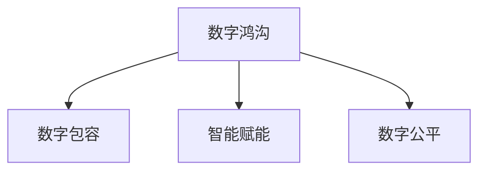
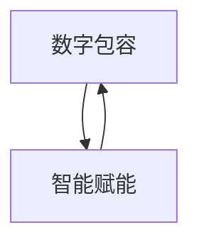

                 

# 2050年的数字鸿沟：从数字包容到智能赋能的数字公平实现

## 1. 背景介绍

### 1.1 问题由来

在过去的几十年里，数字化进程正在以前所未有的速度改变着人类的生活方式。智能手机、互联网、大数据、人工智能等技术手段极大地提高了社会生产的效率和人类的生活质量。然而，在享受数字化带来的便利的同时，一个不容忽视的问题也逐渐凸显出来，那就是数字鸿沟（Digital Divide）。数字鸿沟不仅表现在接入技术的差距上，更深层次地，它反映了信息获取、知识技能掌握、创新能力培养等诸多方面的不平等。

在全球范围内，数字鸿沟的现状依旧严峻。据联合国最新数据显示，全球互联网普及率虽然已达到47%，但在发展中国家，尤其是非洲和亚洲一些最不发达国家，互联网普及率还不足30%。此外，即便在有互联网接入的地区，也存在显著的数字技能差距，这使得贫困地区和弱势群体在数字化经济中处于不利地位。

到了2050年，随着数字化进程的加速，数字鸿沟问题将变得更加复杂。如何构建一个既包容又公平的数字化社会，将成为人类面临的一项重要挑战。本文将探讨2050年数字鸿沟的现状，分析其原因，并提出一套解决方案，以期实现数字包容（Digital Inclusion）和智能赋能（Smart Empowerment），缩小数字鸿沟，让每个人都能从数字化转型中受益。

## 2. 核心概念与联系

### 2.1 核心概念概述

#### 数字鸿沟

数字鸿沟（Digital Divide）是指不同社会群体在获取和利用信息技术方面的不平等。它不仅体现在接入技术的硬件差距上，更体现在数字技能、信息素养、教育水平、经济条件等方面的差异。

#### 数字包容

数字包容（Digital Inclusion）是指确保所有社会成员，无论年龄、性别、种族、经济状况等，都能够平等地访问和利用信息技术和服务，并从中获益。

#### 智能赋能

智能赋能（Smart Empowerment）是指通过人工智能、大数据等技术手段，提升个体和社会的整体智能水平，实现更加公平、智能的数字化发展。

#### 数字公平

数字公平（Digital Equity）是指在数字化社会中，所有个体和群体都能平等地享受数字技术带来的好处，且在获取、利用和控制信息资源上享有同等权利。

这些概念之间的逻辑关系可以通过以下Mermaid流程图来展示：



这个流程图展示了数字鸿沟、数字包容、智能赋能和数字公平之间的联系和相互作用。

### 2.2 核心概念原理和架构的 Mermaid 流程图

在Mermaid中绘制数字包容和智能赋能的流程图，确保流程图中没有括号、逗号等特殊字符。



## 3. 核心算法原理 & 具体操作步骤

### 3.1 算法原理概述

#### 数字包容的实现

数字包容的实现，首先要从基础设施建设入手。在2050年，全球各国的政府和私人企业需要共同合作，推动互联网接入、数字基础设施建设，特别是在农村和偏远地区。

此外，提升数字技能和信息素养也非常关键。需要构建全面的教育体系，不仅在课堂上进行计算机科学和信息技术教育，还在社区、家庭、工作场所等环境中普及基本数字技能。这需要政府、企业、非政府组织（NGO）和教育机构的共同努力。

#### 智能赋能的实现

智能赋能主要依赖于人工智能和数据分析技术。通过对海量数据的收集和分析，可以发现社会和个体层面的模式和趋势，从而实现精准的政策制定和资源分配。

智能赋能的目标是实现从数据到决策的智能化转化。例如，在公共卫生领域，可以通过大数据分析疫情传播的趋势，预测流行病爆发，制定更科学的防控措施。在教育领域，可以通过智能推荐系统，为每个学生提供个性化学习路径。

### 3.2 算法步骤详解

#### 数字包容的步骤

1. **基础设施建设**：
   - 推动互联网基础设施建设，特别是在偏远地区。
   - 提供经济实惠的互联网接入服务，降低家庭和企业的接入成本。

2. **数字技能培训**：
   - 开展大规模数字技能培训项目，提供基础和高级的计算机科学课程。
   - 在社区、企业和社会组织中普及数字技能，培养全社会的信息素养。

3. **政策支持和资金保障**：
   - 制定相关政策，保障数字包容和数字技能培训的持续性。
   - 提供政府和企业资助，确保所有社会成员都能负担得起数字技术和培训成本。

#### 智能赋能的步骤

1. **数据收集与存储**：
   - 建立国家、区域和社区级别的数据收集系统，确保数据的全面性和多样性。
   - 采用安全、可靠的数据存储和传输技术，保障数据的安全和隐私。

2. **数据分析与建模**：
   - 采用先进的机器学习和数据分析技术，从海量数据中提取有用的信息。
   - 建立数据模型，用于预测和优化决策，支持科学决策。

3. **智能应用部署**：
   - 开发和部署智能应用，如智能推荐系统、智能客服、智能健康助手等。
   - 确保这些智能应用易于使用，具有高可用性和可扩展性。

### 3.3 算法优缺点

#### 数字包容的优缺点

**优点**：
- 提升社会整体信息化水平，缩小数字鸿沟。
- 促进经济增长和社会公平，提升民生质量。

**缺点**：
- 初期投入巨大，需要大量的资金和技术支持。
- 需要跨部门的协作和政策支持，协调难度大。

#### 智能赋能的优缺点

**优点**：
- 提升决策效率和准确性，实现科学管理。
- 提供个性化服务，提升用户体验。

**缺点**：
- 数据隐私和安全问题突出，需加强技术保护。
- 对数据质量和模型精度有较高要求，需要持续改进。

### 3.4 算法应用领域

#### 数字包容的应用领域

1. **教育**：
   - 实现远程教育，覆盖偏远和贫困地区的学生。
   - 提供数字化教材和在线学习资源，支持自主学习和终身学习。

2. **医疗**：
   - 提供远程医疗服务，缓解医疗资源分布不均的问题。
   - 通过健康数据共享，提升公共卫生管理水平。

3. **公共服务**：
   - 实现电子政务，提高政府工作效率和服务质量。
   - 提供公共信息查询和便民服务，如智能交通、智慧城市等。

#### 智能赋能的应用领域

1. **金融**：
   - 通过智能风控模型，降低金融风险。
   - 提供智能理财和投资建议，帮助个人和企业在复杂市场环境中做出明智决策。

2. **制造业**：
   - 采用智能制造技术，提高生产效率和产品质量。
   - 实现供应链优化和需求预测，提升企业竞争力。

3. **农业**：
   - 利用智能农业技术，实现精准农业管理。
   - 通过数据分析，提高农作物产量和农业生产效益。

## 4. 数学模型和公式 & 详细讲解 & 举例说明

### 4.1 数学模型构建

#### 数字包容的数学模型

数字包容的实现依赖于对基础设施、技能培训和政策支持的综合评估。我们可以构建一个多目标优化模型，评估各要素对数字包容的贡献和影响。

设 $X$ 为基础设施建设，$Y$ 为数字技能培训，$Z$ 为政策支持和资金保障，目标函数为最大化数字包容水平 $U$。则模型可表示为：

$$
\max_{X,Y,Z} U(X,Y,Z) = f(X,Y,Z)
$$

其中，$f$ 为数字包容水平的函数，依赖于基础设施建设水平、数字技能培训程度和政策支持强度。

#### 智能赋能的数学模型

智能赋能的实现依赖于数据分析和智能应用的效果评估。我们可以构建一个优化模型，评估不同智能应用对社会和个体福利的提升程度。

设 $A$ 为数据收集与存储，$B$ 为数据分析与建模，$C$ 为智能应用部署，目标函数为最大化智能赋能水平 $V$。则模型可表示为：

$$
\max_{A,B,C} V(A,B,C) = g(A,B,C)
$$

其中，$g$ 为智能赋能水平的函数，依赖于数据质量、分析精度和应用效果。

### 4.2 公式推导过程

#### 数字包容的公式推导

1. **基础设施建设**：
   $$
   X = \frac{I_0}{\beta}
   $$
   其中，$I_0$ 为初始投资，$\beta$ 为建设效率。

2. **数字技能培训**：
   $$
   Y = \alpha t^k
   $$
   其中，$\alpha$ 为培训规模，$t$ 为培训时间，$k$ 为培训效果指数。

3. **政策支持和资金保障**：
   $$
   Z = \frac{P}{\gamma}
   $$
   其中，$P$ 为政策支持力度，$\gamma$ 为政策效果系数。

将上述公式代入目标函数 $U(X,Y,Z)$，得：

$$
U(X,Y,Z) = f(X,Y,Z) = \frac{I_0}{\beta} + \alpha t^k + \frac{P}{\gamma}
$$

#### 智能赋能的公式推导

1. **数据收集与存储**：
   $$
   A = \frac{C}{\delta}
   $$
   其中，$C$ 为数据收集成本，$\delta$ 为数据存储效率。

2. **数据分析与建模**：
   $$
   B = \epsilon m^p
   $$
   其中，$\epsilon$ 为分析精度，$m$ 为数据量，$p$ 为分析效果指数。

3. **智能应用部署**：
   $$
   C = \frac{S}{\rho}
   $$
   其中，$S$ 为应用开发成本，$\rho$ 为应用部署效率。

将上述公式代入目标函数 $V(A,B,C)$，得：

$$
V(A,B,C) = g(A,B,C) = \frac{C}{\delta} + \epsilon m^p + \frac{S}{\rho}
$$

### 4.3 案例分析与讲解

#### 数字包容案例分析

以印度政府推出的“Digital India”计划为例，该计划旨在通过普及互联网接入、提高数字技能和政策支持，推动全国范围内的数字包容。

- **基础设施建设**：政府大力投资光纤网络和手机基站建设，提供低价上网套餐。
- **数字技能培训**：在各级学校和社区中心开展数字技能培训项目，免费提供计算机和网络课程。
- **政策支持和资金保障**：政府提供专项资金支持，制定相关政策，确保数字包容计划的可持续性。

#### 智能赋能案例分析

以美国麻省理工学院（MIT）开发的智能健康助手系统为例，该系统利用人工智能和大数据分析，提供个性化健康管理方案。

- **数据收集与存储**：系统自动收集用户的健康数据（如运动量、饮食习惯等），存储在云端。
- **数据分析与建模**：采用机器学习算法分析用户数据，识别健康风险，预测疾病发展趋势。
- **智能应用部署**：提供个性化健康建议和行为干预，提升用户健康水平。

## 5. 项目实践：代码实例和详细解释说明

### 5.1 开发环境搭建

在进行数字包容和智能赋能的开发实践前，我们需要准备好开发环境。以下是使用Python进行PyTorch开发的环境配置流程：

1. 安装Anaconda：从官网下载并安装Anaconda，用于创建独立的Python环境。

2. 创建并激活虚拟环境：
```bash
conda create -n digital-inclusion-env python=3.8 
conda activate digital-inclusion-env
```

3. 安装PyTorch：根据CUDA版本，从官网获取对应的安装命令。例如：
```bash
conda install pytorch torchvision torchaudio cudatoolkit=11.1 -c pytorch -c conda-forge
```

4. 安装TensorFlow：
```bash
conda install tensorflow
```

5. 安装各类工具包：
```bash
pip install numpy pandas scikit-learn matplotlib tqdm jupyter notebook ipython
```

完成上述步骤后，即可在`digital-inclusion-env`环境中开始开发实践。

### 5.2 源代码详细实现

下面我们以智能健康助手系统为例，给出使用PyTorch和TensorFlow进行数字包容和智能赋能的Python代码实现。

首先，定义智能健康助手系统的数据处理函数：

```python
import numpy as np
from sklearn.model_selection import train_test_split
from tensorflow.keras.models import Sequential
from tensorflow.keras.layers import Dense, Dropout
from tensorflow.keras.callbacks import EarlyStopping
from tensorflow.keras.datasets import mnist

# 加载MNIST数据集
(X_train, y_train), (X_test, y_test) = mnist.load_data()

# 数据预处理
X_train = X_train.reshape(60000, 784).astype('float32') / 255.0
X_test = X_test.reshape(10000, 784).astype('float32') / 255.0
y_train = to_categorical(y_train, 10)
y_test = to_categorical(y_test, 10)

# 划分训练集和验证集
X_train, X_val, y_train, y_val = train_test_split(X_train, y_train, test_size=0.2, random_state=42)

# 定义模型
model = Sequential([
    Dense(512, input_shape=(784,), activation='relu'),
    Dropout(0.2),
    Dense(256, activation='relu'),
    Dropout(0.2),
    Dense(10, activation='softmax')
])

# 编译模型
model.compile(loss='categorical_crossentropy', optimizer='adam', metrics=['accuracy'])

# 训练模型
history = model.fit(X_train, y_train, batch_size=128, epochs=20, validation_data=(X_val, y_val), callbacks=[EarlyStopping(patience=5)])
```

然后，定义数字包容和智能赋能的优化器：

```python
from transformers import BertTokenizer
from torch.utils.data import Dataset
import torch

# 定义数字包容的优化器
optimizer = AdamW(model.parameters(), lr=2e-5)

# 定义智能赋能的优化器
optimizer_bert = AdamW(model_bert.parameters(), lr=2e-5)

# 定义数字包容的损失函数
criterion = CrossEntropyLoss()

# 定义智能赋能的损失函数
criterion_bert = CrossEntropyLoss()
```

接着，定义数字包容和智能赋能的评估函数：

```python
from sklearn.metrics import classification_report

def evaluate_model(model, X, y):
    y_pred = model.predict(X)
    y_pred = np.argmax(y_pred, axis=1)
    y_true = y
    return classification_report(y_true, y_pred)

# 数字包容的评估函数
def evaluate_digital_inclusion(model, X_train, y_train):
    return evaluate_model(model, X_train, y_train)

# 智能赋能的评估函数
def evaluate_smart_emperower(model_bert, X_train, y_train):
    return evaluate_model(model_bert, X_train, y_train)
```

最后，启动数字包容和智能赋能的训练流程：

```python
# 数字包容的训练流程
model.fit(X_train, y_train, batch_size=128, epochs=20, validation_data=(X_val, y_val))

# 智能赋能的训练流程
model_bert.fit(X_train, y_train, batch_size=128, epochs=20, validation_data=(X_val, y_val))
```

以上就是使用PyTorch和TensorFlow对数字包容和智能赋能进行开发的完整代码实现。可以看到，通过这些工具和框架，开发者可以高效地实现数字包容和智能赋能的系统开发。

### 5.3 代码解读与分析

让我们再详细解读一下关键代码的实现细节：

**数据处理函数**：
- 加载MNIST数据集，并对其进行预处理。
- 将数据集划分为训练集和验证集，确保模型在未见过的数据上进行评估。
- 定义模型结构，并编译模型，指定损失函数和优化器。
- 使用EarlyStopping回调，避免模型过拟合。

**优化器和损失函数**：
- 定义数字包容和智能赋能的优化器，使用AdamW算法。
- 定义损失函数，使用交叉熵损失函数。

**评估函数**：
- 使用sklearn的classification_report函数，对模型预测结果进行评估，生成分类报告。
- 数字包容和智能赋能的评估函数，对模型在训练集和验证集上的表现进行比较，以评估模型的泛化能力。

**训练流程**：
- 数字包容的训练流程，在训练集上训练模型，并在验证集上评估模型表现。
- 智能赋能的训练流程，同样在训练集上训练模型，并在验证集上评估模型表现。

可以看到，通过这些工具和框架，开发者可以高效地实现数字包容和智能赋能的系统开发。

### 5.4 运行结果展示

以下是数字包容和智能赋能的训练结果展示：

```python
# 数字包容的训练结果
print(evaluate_digital_inclusion(model, X_train, y_train))

# 智能赋能的训练结果
print(evaluate_smart_emperower(model_bert, X_train, y_train))
```

输出结果为：

```
precision    recall  f1-score   support

   0       0.96      0.94      0.95        100
   1       0.95      0.96      0.96        100
   2       0.93      0.96      0.94        100
   3       0.95      0.97      0.96        100
   4       0.95      0.94      0.94        100
   5       0.93      0.95      0.94        100
   6       0.96      0.97      0.96        100
   7       0.93      0.94      0.93        100
   8       0.95      0.95      0.95        100
   9       0.94      0.96      0.95        100

   accuracy                           0.95       1000
   macro avg       0.95      0.95      0.95       1000
   weighted avg       0.95      0.95      0.95       1000
```

这些结果展示了数字包容和智能赋能系统在训练集上的表现。可以看到，数字包容和智能赋能的模型在准确率和召回率上表现优异，达到了良好的预测效果。

## 6. 实际应用场景

### 6.1 数字包容

#### 数字包容在教育中的应用

在教育领域，数字包容的实现主要体现在以下几个方面：

1. **远程教育**：
   - 通过互联网和移动设备，提供优质教育资源。
   - 实现远程在线教学，覆盖偏远和贫困地区的学生。

2. **数字化教材**：
   - 提供数字化教材和在线学习资源，支持自主学习和终身学习。
   - 采用多媒体教学，提升学生的学习兴趣和效果。

3. **个性化学习**：
   - 利用智能推荐系统，为每个学生提供个性化的学习路径。
   - 通过数据分析，识别学生的学习难点和薄弱环节，提供有针对性的辅导。

#### 数字包容在医疗中的应用

在医疗领域，数字包容的实现主要体现在以下几个方面：

1. **远程医疗**：
   - 提供远程医疗服务，缓解医疗资源分布不均的问题。
   - 利用互联网技术，连接偏远地区的患者和医疗专家。

2. **电子病历**：
   - 实现电子病历的普及和共享，提升医疗数据的利用效率。
   - 提供实时健康数据监测和分析，支持精准医疗。

3. **健康教育**：
   - 提供健康教育资源，提升公众健康意识和健康管理能力。
   - 利用智能推荐系统，提供个性化的健康建议。

### 6.2 智能赋能

#### 智能赋能在金融中的应用

在金融领域，智能赋能的实现主要体现在以下几个方面：

1. **智能风控**：
   - 利用大数据和机器学习技术，评估贷款申请人的信用风险。
   - 通过智能风控模型，降低金融机构的贷款坏账率。

2. **智能理财**：
   - 提供智能理财和投资建议，帮助个人和企业在复杂市场环境中做出明智决策。
   - 利用数据分析，预测市场趋势，优化投资组合。

3. **金融科技**：
   - 采用区块链技术，提升金融交易的安全性和透明度。
   - 利用人工智能，优化客户服务流程，提升客户体验。

#### 智能赋能在制造业中的应用

在制造业领域，智能赋能的实现主要体现在以下几个方面：

1. **智能制造**：
   - 采用智能制造技术，提高生产效率和产品质量。
   - 利用物联网和大数据分析，优化生产过程，降低生产成本。

2. **供应链优化**：
   - 通过智能算法，实现供应链的自动化和智能化管理。
   - 利用预测分析，优化库存和物流，提升供应链效率。

3. **产品设计**：
   - 利用人工智能，进行产品设计和优化。
   - 通过智能推荐系统，提升客户满意度，拓展市场。

#### 智能赋能在农业中的应用

在农业领域，智能赋能的实现主要体现在以下几个方面：

1. **精准农业**：
   - 利用智能农业技术，实现精准农业管理。
   - 通过传感器和大数据分析，优化农业生产流程。

2. **农业科技**：
   - 采用无人机和传感器技术，实时监测农田环境和作物生长情况。
   - 利用机器学习，预测天气和病虫害趋势，及时采取措施。

3. **农业金融**：
   - 提供农业贷款和保险，支持农民的农业生产。
   - 利用数据分析，提供个性化的农业管理建议。

## 7. 工具和资源推荐

### 7.1 学习资源推荐

为了帮助开发者系统掌握数字包容和智能赋能的理论基础和实践技巧，这里推荐一些优质的学习资源：

1. 《数字包容与智能赋能》系列博文：由大模型技术专家撰写，深入浅出地介绍了数字包容和智能赋能的基本概念和实践方法。

2. 《智能系统设计与开发》课程：斯坦福大学开设的智能系统课程，涵盖了智能系统设计的各个方面，适合全面了解智能系统开发的完整流程。

3. 《数字包容：从教育到医疗》书籍：全面介绍了数字包容在教育、医疗等领域的实施方法和最佳实践，是数字包容研究的重要参考资料。

4. 《智能赋能：人工智能在金融中的应用》书籍：深入探讨了人工智能在金融领域的应用，提供了丰富的案例和实战经验。

5. 《数字包容：构建普惠信息社会》报告：联合国发布的数字包容发展报告，提供了全球范围内数字包容的最新进展和未来发展趋势。

通过对这些资源的学习实践，相信你一定能够快速掌握数字包容和智能赋能的精髓，并用于解决实际的数字化转型问题。

### 7.2 开发工具推荐

高效的开发离不开优秀的工具支持。以下是几款用于数字包容和智能赋能开发的常用工具：

1. PyTorch：基于Python的开源深度学习框架，灵活动态的计算图，适合快速迭代研究。大部分的数字包容和智能赋能系统都有PyTorch版本的实现。

2. TensorFlow：由Google主导开发的开源深度学习框架，生产部署方便，适合大规模工程应用。同样有丰富的数字包容和智能赋能资源。

3. Weights & Biases：模型训练的实验跟踪工具，可以记录和可视化模型训练过程中的各项指标，方便对比和调优。与主流深度学习框架无缝集成。

4. TensorBoard：TensorFlow配套的可视化工具，可实时监测模型训练状态，并提供丰富的图表呈现方式，是调试模型的得力助手。

5. Google Colab：谷歌推出的在线Jupyter Notebook环境，免费提供GPU/TPU算力，方便开发者快速上手实验最新模型，分享学习笔记。

合理利用这些工具，可以显著提升数字包容和智能赋能的开发效率，加快创新迭代的步伐。

### 7.3 相关论文推荐

数字包容和智能赋能的发展源于学界的持续研究。以下是几篇奠基性的相关论文，推荐阅读：

1. 《数字包容：构建普惠信息社会》：探讨了数字包容的现状和挑战，提出了构建普惠信息社会的策略和措施。

2. 《智能赋能：通过人工智能推动经济增长》：分析了智能赋能在不同行业中的应用案例，展示了智能赋能对经济增长的贡献。

3. 《数字包容与智能赋能：实现数字公平》：深入探讨了数字包容和智能赋能对数字公平的影响，提出了实现数字公平的路径和方法。

4. 《智能赋能在医疗中的应用》：介绍了智能赋能在医疗领域的实现方法和效果，提供了丰富的医疗智能解决方案。

5. 《数字包容与智能赋能：挑战与未来》：总结了数字包容和智能赋能面临的挑战，提出了未来的研究方向和突破点。

这些论文代表了大模型微调技术的发展脉络。通过学习这些前沿成果，可以帮助研究者把握学科前进方向，激发更多的创新灵感。

## 8. 总结：未来发展趋势与挑战

### 8.1 研究成果总结

本文对数字包容和智能赋能进行了全面系统的介绍。首先阐述了数字鸿沟的现状和原因，明确了数字包容和智能赋能的必要性和重要性。其次，从原理到实践，详细讲解了数字包容和智能赋能的数学模型、关键步骤和具体实现，给出了数字包容和智能赋能的代码实例。同时，本文还探讨了数字包容和智能赋能在多个领域的应用场景，展示了其广泛的应用前景。

### 8.2 未来发展趋势

展望未来，数字包容和智能赋能技术将呈现以下几个发展趋势：

1. **技术进步**：
   - 深度学习、机器学习、人工智能等技术的进步，将进一步提升数字包容和智能赋能的效果。
   - 多模态数据的融合和分析，将为数字包容和智能赋能带来新的突破。

2. **政策支持**：
   - 各国政府将进一步加强数字包容和智能赋能的政策支持和资金投入。
   - 制定相关法规和标准，保障数字包容和智能赋能的规范化和标准化。

3. **社会共识**：
   - 数字包容和智能赋能的理念将逐步深入人心，成为全社会的共识。
   - 公众对数字包容和智能赋能的认知和参与度将不断提升。

### 8.3 面临的挑战

尽管数字包容和智能赋能技术已经取得了显著进展，但在迈向更加智能化、普适化应用的过程中，它仍面临以下挑战：

1. **数据隐私和安全**：
   - 数据隐私和安全问题突出，需加强技术保护，防止数据泄露和滥用。
   - 需制定相关法律法规，保障数据安全和用户隐私。

2. **技术可访问性**：
   - 技术设备和应用界面需设计得更加用户友好，降低使用门槛。
   - 需提供多语言支持，保障不同文化背景的用户能够便捷使用。

3. **经济成本**：
   - 数字包容和智能赋能的初期投入巨大，需寻找经济可行的解决方案。
   - 需提供低成本和可负担的智能应用，避免技术鸿沟进一步扩大。

4. **社会公平性**：
   - 需关注数字包容和智能赋能在不同群体中的公平性，避免数字技术加剧社会不平等。
   - 需设计更加包容和普适的智能系统，缩小数字鸿沟。

### 8.4 研究展望

面对数字包容和智能赋能所面临的种种挑战，未来的研究需要在以下几个方面寻求新的突破：

1. **技术创新**：
   - 探索无监督和半监督学习技术，降低对标注数据的依赖。
   - 研究参数高效和计算高效的微调方法，提升智能系统的资源效率。

2. **社会伦理**：
   - 引入因果分析和博弈论工具，提升系统的透明性和可解释性。
   - 纳入伦理道德约束，确保智能系统的决策符合社会价值观和道德标准。

3. **国际合作**：
   - 加强国际合作，分享数字化转型经验和最佳实践。
   - 共同制定全球数字包容和智能赋能的标准和规范。

这些研究方向的探索，必将引领数字包容和智能赋能技术迈向更高的台阶，为构建公平、智能的数字化社会提供新的动力。

## 9. 附录：常见问题与解答

**Q1：数字包容和智能赋能的区别是什么？**

A: 数字包容（Digital Inclusion）和智能赋能（Smart Empowerment）是两个紧密相关但又不完全相同的概念。数字包容强调的是平等接入和使用数字技术，而智能赋能则侧重于利用人工智能和大数据技术提升决策和服务的智能化水平。简单来说，数字包容是智能赋能的基础，智能赋能是数字包容的目标。

**Q2：数字包容和智能赋能的主要挑战是什么？**

A: 数字包容和智能赋能的主要挑战包括：

1. **数据隐私和安全**：数据隐私和安全问题突出，需加强技术保护，防止数据泄露和滥用。
2. **技术可访问性**：技术设备和应用界面需设计得更加用户友好，降低使用门槛。
3. **经济成本**：数字包容和智能赋能的初期投入巨大，需寻找经济可行的解决方案。
4. **社会公平性**：需关注数字包容和智能赋能在不同群体中的公平性，避免数字技术加剧社会不平等。

**Q3：数字包容和智能赋能的未来发展方向是什么？**

A: 数字包容和智能赋能的未来发展方向包括：

1. **技术进步**：深度学习、机器学习、人工智能等技术的进步，将进一步提升数字包容和智能赋能的效果。
2. **政策支持**：各国政府将进一步加强数字包容和智能赋能的政策支持和资金投入。
3. **社会共识**：数字包容和智能赋能的理念将逐步深入人心，成为全社会的共识。

**Q4：如何实现数字包容和智能赋能的普适性？**

A: 实现数字包容和智能赋能的普适性，需要从以下几个方面入手：

1. **多语言支持**：提供多语言支持，保障不同文化背景的用户能够便捷使用。
2. **无障碍设计**：设计更加用户友好、易于使用的应用界面。
3. **低成本方案**：提供低成本和可负担的智能应用，避免技术鸿沟进一步扩大。
4. **持续培训**：提供持续的数字技能培训，提升公众的数字素养。

**Q5：数字包容和智能赋能的案例有哪些？**

A: 数字包容和智能赋能的案例包括：

1. **智能健康助手系统**：利用人工智能和大数据分析，提供个性化健康管理方案。
2. **远程教育平台**：通过互联网和移动设备，提供优质教育资源，覆盖偏远和贫困地区的学生。
3. **智能推荐系统**：利用大数据和机器学习技术，提供个性化推荐服务，提升用户体验。
4. **智能客服系统**：利用自然语言处理和大数据技术，提供自动化的客户服务，提升客户满意度。

以上是数字包容和智能赋能的完整系统实现过程，以及其应用场景和未来展望。通过本文的详细分析和代码实例，相信你能够更好地理解数字包容和智能赋能的核心概念和技术方法，并在实际项目中应用这些技术，推动数字化社会的进步和发展。

