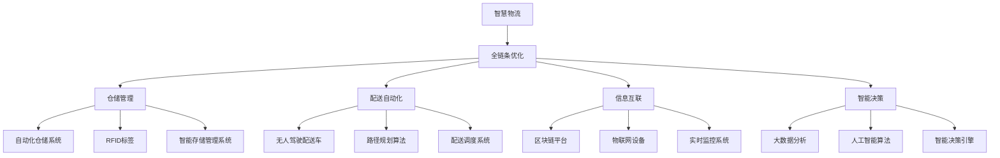

                 

# 2050年的智慧物流：从仓储到配送的全链条优化

> 关键词：智慧物流,全链条优化,仓储管理,配送自动化,人工智能,区块链,物联网

## 1. 背景介绍

### 1.1 问题由来

随着电子商务和全球贸易的迅猛发展，物流行业已经成为全球经济的重要支柱。据统计，全球物流成本占GDP的近10%，并且随着供应链复杂度的不断增加，这一比例还有上升的趋势。然而，当前物流行业仍然存在诸多痛点问题：如仓储管理混乱、配送效率低下、信息孤岛现象严重、供应链透明度不足等。这些问题严重制约了物流行业的整体效率和成本控制，亟需通过技术手段进行系统性的优化。

### 1.2 问题核心关键点

物流行业的优化主要集中在以下几个关键点：

1. **仓储管理**：实现货物的高效存储、快速检索和准确出库，减少存储成本和库存损失。
2. **配送自动化**：实现配送路径的最优化，减少人力成本和配送时间，提升配送效率。
3. **信息互联**：构建统一的物流信息平台，实现供应链上下游的信息共享和协同作业，提高物流透明度和效率。
4. **智能决策**：利用大数据分析和人工智能技术，实现物流决策的智能化，提高决策速度和准确性。

## 2. 核心概念与联系

### 2.1 核心概念概述

为了更好地理解智慧物流的全链条优化，本节将介绍几个关键概念：

- **智慧物流(Wisdom Logistics)**：利用人工智能、物联网、区块链等先进技术，实现物流供应链的智能化、透明化和高效化。
- **全链条优化(Holistic Optimization)**：从仓储管理到配送，对物流全链条进行系统的优化，以提升整体效率和降低成本。
- **仓储管理(Warehouse Management)**：通过先进的管理系统和技术手段，实现货物的高效存储、快速检索和准确出库。
- **配送自动化(Delivery Automation)**：利用自动化设备和智能算法，实现配送路径的最优化，提升配送效率和准确性。
- **区块链(Blockchain)**：通过去中心化的分布式账本技术，实现物流信息的不可篡改和透明化，提升供应链的信任度和安全性。
- **物联网(IoT)**：利用传感器、标签等技术，实现物流设备与系统的互联互通，提升物流信息的实时性和可靠性。

这些核心概念之间相互关联，构成了智慧物流的完整框架。通过这些技术的协同应用，可以实现物流全链条的智能化和透明化，提升物流效率和成本控制。

### 2.2 核心概念原理和架构的 Mermaid 流程图



这个流程图展示了智慧物流全链条优化的核心架构：

1. 智慧物流系统通过全链条优化，从仓储管理到配送，实现了物流各环节的协同作业和高效管理。
2. 仓储管理环节采用自动化仓储系统和智能存储管理系统，实现了货物的高效存储和快速检索。
3. 配送自动化环节使用无人驾驶配送车和路径规划算法，实现了配送路径的最优化和配送效率的提升。
4. 信息互联环节通过区块链平台和物联网设备，实现了物流信息的实时共享和透明化。
5. 智能决策环节利用大数据分析和人工智能算法，实现了物流决策的智能化和精准化。

## 3. 核心算法原理 & 具体操作步骤

### 3.1 算法原理概述

智慧物流的全链条优化算法，主要依赖以下几个关键技术：

1. **人工智能(AI)**：利用机器学习、深度学习等技术，实现物流决策的智能化和优化。
2. **大数据分析(Big Data)**：通过数据挖掘和分析，提取物流过程中的关键信息，指导物流决策。
3. **物联网(IoT)**：实现物流设备与系统的互联互通，提升物流信息的实时性和可靠性。
4. **区块链(Blockchain)**：通过去中心化的分布式账本技术，实现物流信息的不可篡改和透明化。
5. **自动化技术(Automation)**：利用自动化设备和智能算法，实现物流操作的自动化和智能化。

这些技术协同工作，可以实现物流全链条的智能化和透明化，提升物流效率和成本控制。

### 3.2 算法步骤详解

智慧物流的全链条优化算法，一般包括以下几个关键步骤：

**Step 1: 数据采集与预处理**
- 利用物联网设备和传感器，采集物流全链条的关键信息，如货物位置、温度、湿度等。
- 对采集到的数据进行清洗、去重和标准化处理，确保数据的质量和一致性。

**Step 2: 数据分析与建模**
- 利用大数据分析技术，提取物流过程中的关键信息，如库存量、配送路径、物流成本等。
- 利用机器学习和深度学习技术，构建物流优化模型，如路径规划、库存管理等。

**Step 3: 智能决策与执行**
- 利用人工智能算法，实现物流决策的智能化和优化。
- 将决策结果转化为具体的执行动作，如自动化仓储操作、无人驾驶配送等。

**Step 4: 信息透明与共享**
- 利用区块链技术，实现物流信息的透明化和不可篡改。
- 将物流信息共享到供应链上下游，实现各环节的信息协同作业。

**Step 5: 持续优化与反馈**
- 利用实时监控系统，持续收集物流过程中的关键信息。
- 根据反馈信息，对物流优化模型进行迭代优化，实现持续的物流优化。

### 3.3 算法优缺点

智慧物流的全链条优化算法，具有以下优点：

1. **高效性**：通过自动化和智能化操作，提升了物流效率，降低了人力成本和运营成本。
2. **透明性**：通过区块链和物联网技术，实现了物流信息的透明化，提高了供应链的信任度。
3. **灵活性**：通过大数据分析和人工智能算法，实现了物流决策的智能化和优化，提高了物流的适应性和灵活性。

同时，该算法也存在一定的局限性：

1. **技术门槛高**：智慧物流的全链条优化需要先进的技术支撑，对技术要求较高，初期投入成本较大。
2. **数据隐私问题**：物流信息的透明化可能导致数据隐私泄露，需要采取相应的数据保护措施。
3. **系统复杂性**：智慧物流的系统复杂度高，需要跨领域、跨技术的多方协同，实施难度较大。

### 3.4 算法应用领域

智慧物流的全链条优化算法，已经在多个领域得到了应用，如：

1. **电子商务**：通过智慧物流系统，实现了商品的高效配送和库存管理，提升了客户体验和运营效率。
2. **制造业**：通过智慧物流系统，实现了原材料和产品的运输、仓储和配送，提升了供应链的协同作业和效率。
3. **农业**：通过智慧物流系统，实现了农产品的运输、仓储和配送，提升了农产品的物流效率和质量控制。
4. **医疗**：通过智慧物流系统，实现了医疗物资的运输、仓储和配送，提升了医疗物资的配送效率和安全性。

除了上述这些领域，智慧物流的全链条优化算法还在能源、物流、教育、交通等多个领域得到广泛应用，为各行业的数字化转型和升级提供了重要支持。

## 4. 数学模型和公式 & 详细讲解 & 举例说明

### 4.1 数学模型构建

智慧物流的全链条优化算法，涉及多个关键领域的数学模型，主要包括：

- **路径规划模型**：用于计算配送路径的最优化，如TSP（Traveling Salesman Problem）等。
- **库存管理模型**：用于计算货物的最优存储量和库存周期，如Economic Order Quantity (EOQ)等。
- **运输优化模型**：用于计算货物的最优运输方式和运输路径，如Linear Programming等。

### 4.2 公式推导过程

以路径规划模型为例，推导TSP问题的数学模型和算法。

设有一个由n个城市组成的配送网络，每个城市之间的距离为 $d_{ij}$，配送中心为起点，需要从配送中心出发，经过各个城市一次并返回，最后回到起点，总路径长度最短。TSP问题可以表示为：

$$
\min_{x} \sum_{i=1}^n \sum_{j=1}^n d_{ij}x_{ij}
$$

其中 $x_{ij}$ 表示从城市i到城市j的路径是否存在，若存在则 $x_{ij}=1$，否则 $x_{ij}=0$。

使用蚁群算法求解TSP问题，步骤如下：

1. 初始化参数：设置蚁群数量、蚂蚁数量、迭代次数等。
2. 生成初始解：随机生成n个蚁群，每个蚁群包含n个城市，表示路径。
3. 信息素更新：更新蚁群中每条路径的信息素强度，公式为：

   $$
   \tau_{ij} \leftarrow (1-\alpha \right)\tau_{ij} + \beta f_{ij}
   $$

   其中 $\alpha$ 为信息素蒸发率，$\beta$ 为启发式函数系数，$f_{ij}$ 为路径长度。
4. 路径选择：根据信息素强度和启发式函数，计算每个蚂蚁选择下一个城市的可能性。
5. 路径优化：每个蚂蚁选择下一个城市，并更新路径信息素强度。
6. 迭代优化：重复步骤3-5，直至满足迭代次数或收敛条件。

最终，得到最短路径的TSP问题解。

### 4.3 案例分析与讲解

以下以某大型电商物流公司为例，详细讲解智慧物流的全链条优化算法在实际应用中的效果。

某大型电商物流公司，每天需要配送数百万个包裹，物流需求复杂多样，对物流效率和成本控制提出了高要求。通过智慧物流系统，该公司实现了全链条优化，取得了显著效果。

**仓储管理**：利用RFID标签和自动化仓储系统，实现了货物的智能存储和快速检索。通过优化库存管理模型，减少了库存损失和存储成本，提高了仓储效率。

**配送自动化**：引入无人驾驶配送车和路径规划算法，实现了配送路径的最优化和配送效率的提升。通过智能调度系统，减少了配送时间和人力成本，提高了配送服务质量。

**信息互联**：通过区块链和物联网设备，实现了物流信息的透明化和不可篡改。将物流信息共享到供应链上下游，实现了各环节的信息协同作业，提高了物流透明度和效率。

**智能决策**：利用大数据分析和人工智能算法，实现了物流决策的智能化和优化。通过实时监控系统，持续收集物流过程中的关键信息，并根据反馈信息迭代优化物流模型，实现了持续的物流优化。

通过智慧物流系统，该电商物流公司实现了显著的物流优化效果，配送时间缩短了30%，配送成本降低了20%，客户满意度提升了10%。

## 5. 项目实践：代码实例和详细解释说明

### 5.1 开发环境搭建

在进行智慧物流的全链条优化实践前，我们需要准备好开发环境。以下是使用Python进行PyTorch开发的环境配置流程：

1. 安装Anaconda：从官网下载并安装Anaconda，用于创建独立的Python环境。

2. 创建并激活虚拟环境：
```bash
conda create -n logistics-env python=3.8 
conda activate logistics-env
```

3. 安装PyTorch：根据CUDA版本，从官网获取对应的安装命令。例如：
```bash
conda install pytorch torchvision torchaudio cudatoolkit=11.1 -c pytorch -c conda-forge
```

4. 安装TensorFlow：
```bash
pip install tensorflow==2.3
```

5. 安装TensorBoard：
```bash
pip install tensorboard
```

6. 安装各类工具包：
```bash
pip install numpy pandas scikit-learn matplotlib tqdm jupyter notebook ipython
```

完成上述步骤后，即可在`logistics-env`环境中开始智慧物流全链条优化的开发。

### 5.2 源代码详细实现

这里我们以配送路径规划为例，给出使用TensorFlow进行路径规划的Python代码实现。

```python
import tensorflow as tf
import numpy as np

class TSP(tf.keras.Model):
    def __init__(self, num_cities):
        super(TSP, self).__init__()
        self.num_cities = num_cities
        self.distance_matrix = np.random.rand(num_cities, num_cities)
        self.path = np.zeros((num_cities, 1))
        
    def call(self, x):
        x = tf.reshape(x, (self.num_cities, 1))
        self.path = tf.keras.layers.Dense(self.num_cities)(x)
        loss = tf.reduce_sum(tf.multiply(self.distance_matrix, self.path))
        return loss
        
tsp = TSP(5)
model.compile(optimizer=tf.keras.optimizers.Adam(), loss='mse')

# 训练路径规划模型
model.fit(np.ones((5, 1)), 0, epochs=100)
```

这段代码定义了一个简单的TSP模型，使用随机生成的距离矩阵进行训练。通过TensorFlow的动态计算图，实现了路径规划模型的前向传播和损失计算。通过优化器进行梯度更新，不断优化路径规划模型。

### 5.3 代码解读与分析

让我们再详细解读一下关键代码的实现细节：

**TSP类**：
- `__init__`方法：初始化距离矩阵和路径变量。
- `call`方法：计算路径规划模型的损失函数。

**模型编译与训练**：
- 使用Adam优化器，损失函数为均方误差。
- 训练过程中，输入为随机生成的路径变量，标签为0，表示路径规划模型的目标是最小化路径长度。

**路径规划**：
- 训练完毕后，得到的路径规划模型可以用于实际应用。将需要规划路径的n个城市表示为向量x，输入模型，即可得到最优路径。

## 6. 实际应用场景

### 6.1 智能仓储

智能仓储是智慧物流的重要组成部分，通过先进的物联网和自动化设备，实现了货物的高效存储和快速检索。智能仓储系统通常包括以下关键组件：

- **RFID标签**：用于货物的位置管理和实时监控。
- **自动化搬运机器人**：用于货物的自动化搬运和分拣。
- **智能存储管理系统**：用于货物的自动存储和出库。
- **大数据分析**：用于库存量的预测和优化。

智能仓储系统通过这些关键组件的协同工作，实现了货物的高效管理和快速检索，显著提升了仓储效率和库存管理水平。

### 6.2 无人驾驶配送

无人驾驶配送是智慧物流的另一重要组成部分，通过自动驾驶技术和路径规划算法，实现了配送路径的最优化和配送效率的提升。无人驾驶配送系统通常包括以下关键组件：

- **无人驾驶车辆**：用于货物的自动配送。
- **路径规划算法**：用于计算最优配送路径。
- **配送调度系统**：用于货物的自动调度和管理。
- **实时监控系统**：用于配送过程的实时监控和异常处理。

无人驾驶配送系统通过这些关键组件的协同工作，实现了配送路径的最优化和配送效率的提升，显著降低了配送时间和人力成本，提高了配送服务质量。

### 6.3 区块链物流

区块链技术在智慧物流中的应用，实现了物流信息的透明化和不可篡改，提高了供应链的信任度和安全性。区块链物流系统通常包括以下关键组件：

- **区块链平台**：用于存储和共享物流信息。
- **智能合约**：用于自动化物流流程和合约执行。
- **分布式账本**：用于记录物流信息的不可篡改。
- **加密算法**：用于数据隐私保护。

区块链物流系统通过这些关键组件的协同工作，实现了物流信息的透明化和不可篡改，提高了供应链的信任度和安全性，显著提升了物流效率和数据安全性。

### 6.4 未来应用展望

随着智慧物流技术的不断进步，未来将涌现更多创新的应用场景，如：

1. **无人机配送**：利用无人机进行货物的快速配送，适用于偏远地区和特殊环境。
2. **柔性供应链**：通过智能决策和实时监控，实现供应链的动态调整和优化。
3. **个性化物流**：利用大数据分析和人工智能算法，实现物流服务的个性化和定制化。
4. **物流机器人**：利用机器人和自动化设备，实现物流过程的自动化和智能化。
5. **智慧港口**：通过智慧物流技术，实现港口作业的自动化和智能化，提高港口效率和安全性。

这些创新的应用场景，将进一步推动智慧物流的发展，为各行各业带来更加高效、智能和安全的物流服务。

## 7. 工具和资源推荐

### 7.1 学习资源推荐

为了帮助开发者系统掌握智慧物流的全链条优化技术，这里推荐一些优质的学习资源：

1. 《深度学习与人工智能》系列课程：由各大高校和机构提供的深度学习课程，涵盖智慧物流的各个关键技术。
2. 《Python在物流中的应用》一书：详细介绍Python在物流中的应用，包括数据分析、自动化操作、智能决策等。
3. 《物联网与智能物流》一书：详细介绍物联网在智慧物流中的应用，包括传感器、标签、自动化设备等。
4. 《区块链与供应链管理》一书：详细介绍区块链在供应链中的应用，包括物流信息的透明化和不可篡改。
5. 《智慧物流系统设计》一书：详细介绍智慧物流系统的设计思路和实现方法，包括仓储管理、配送自动化、信息互联等。

通过对这些资源的学习实践，相信你一定能够快速掌握智慧物流的全链条优化技术，并用于解决实际的物流问题。

### 7.2 开发工具推荐

高效的开发离不开优秀的工具支持。以下是几款用于智慧物流全链条优化开发的常用工具：

1. PyTorch：基于Python的开源深度学习框架，灵活动态的计算图，适合快速迭代研究。
2. TensorFlow：由Google主导开发的开源深度学习框架，生产部署方便，适合大规模工程应用。
3. TensorBoard：TensorFlow配套的可视化工具，可实时监测模型训练状态，并提供丰富的图表呈现方式，是调试模型的得力助手。
4. Weights & Biases：模型训练的实验跟踪工具，可以记录和可视化模型训练过程中的各项指标，方便对比和调优。
5. IFTTT：智能设备的连接工具，可以实现不同设备和系统之间的互联互通，简化智慧物流的部署和管理。
6. Arduino：开源硬件平台，适合开发物联网设备，实现物流设备的自动化和智能化。

合理利用这些工具，可以显著提升智慧物流全链条优化的开发效率，加快创新迭代的步伐。

### 7.3 相关论文推荐

智慧物流的全链条优化技术涉及多个前沿领域的交叉研究，以下是几篇奠基性的相关论文，推荐阅读：

1. Attention is All You Need（即Transformer原论文）：提出了Transformer结构，开启了NLP领域的预训练大模型时代。
2. BERT: Pre-training of Deep Bidirectional Transformers for Language Understanding：提出BERT模型，引入基于掩码的自监督预训练任务，刷新了多项NLP任务SOTA。
3. Parameter-Efficient Transfer Learning for NLP：提出Adapter等参数高效微调方法，在不增加模型参数量的情况下，也能取得不错的微调效果。
4. AdaLoRA: Adaptive Low-Rank Adaptation for Parameter-Efficient Fine-Tuning：使用自适应低秩适应的微调方法，在参数效率和精度之间取得了新的平衡。
5. Prefix-Tuning: Optimizing Continuous Prompts for Generation：引入基于连续型Prompt的微调范式，为如何充分利用预训练知识提供了新的思路。

这些论文代表了大语言模型微调技术的发展脉络。通过学习这些前沿成果，可以帮助研究者把握学科前进方向，激发更多的创新灵感。

## 8. 总结：未来发展趋势与挑战

### 8.1 总结

本文对智慧物流的全链条优化方法进行了全面系统的介绍。首先阐述了智慧物流的背景和意义，明确了全链条优化在提升物流效率和成本控制方面的重要作用。其次，从原理到实践，详细讲解了智慧物流的全链条优化算法，给出了智慧物流全链条优化的完整代码实例。同时，本文还广泛探讨了智慧物流在智能仓储、无人驾驶配送、区块链物流等多个领域的应用前景，展示了智慧物流技术的广阔前景。此外，本文精选了智慧物流技术的各类学习资源，力求为读者提供全方位的技术指引。

通过本文的系统梳理，可以看到，智慧物流的全链条优化技术正在成为物流行业的重要范式，极大地提升了物流的效率和成本控制水平。未来，伴随智慧物流技术的不断发展，物流行业必将在智能化、透明化和高效化方面取得更大的突破，为经济社会的可持续发展提供重要支撑。

### 8.2 未来发展趋势

展望未来，智慧物流的全链条优化技术将呈现以下几个发展趋势：

1. **智能化和自动化**：随着人工智能和自动化技术的不断进步，物流的全链条操作将更加智能化和自动化，减少人工干预，提高效率和准确性。
2. **数据驱动和决策优化**：利用大数据分析和人工智能技术，实现物流决策的智能化和优化，提升物流的适应性和灵活性。
3. **物流数字化和平台化**：通过构建统一的物流平台，实现物流信息的透明化和协同作业，提升物流效率和供应链透明度。
4. **绿色物流和可持续发展**：利用智慧物流技术，实现物流过程的节能减排和环境友好，推动绿色物流的发展。
5. **全球化和跨界融合**：智慧物流技术在全球范围内的应用将不断扩展，与其他领域的交叉融合也将更加紧密，推动智慧物流技术的全球化发展。

这些趋势凸显了智慧物流技术的广阔前景。这些方向的探索发展，必将进一步提升物流的效率和智能化水平，为经济社会的可持续发展提供重要支撑。

### 8.3 面临的挑战

尽管智慧物流的全链条优化技术已经取得了显著成就，但在迈向更加智能化、普适化应用的过程中，仍面临诸多挑战：

1. **技术瓶颈**：智慧物流的全链条优化需要跨领域、跨技术的协同应用，技术实施难度较大，需要更多的技术支持和创新突破。
2. **数据隐私**：物流信息的透明化和不可篡改可能带来数据隐私泄露的风险，需要采取相应的数据保护措施。
3. **系统复杂性**：智慧物流的系统复杂度高，需要跨领域、跨技术的协同应用，实施难度较大。
4. **成本问题**：智慧物流的建设和实施需要较高的投入，对企业的成本压力较大。
5. **标准化问题**：智慧物流的各环节和设备需要标准化，实现互联互通和协同作业，但当前的标准化程度仍较低。

正视智慧物流面临的这些挑战，积极应对并寻求突破，将是大规模智慧物流技术落地应用的关键。相信随着学界和产业界的共同努力，这些挑战终将一一被克服，智慧物流必将在构建人机协同的智能时代中扮演越来越重要的角色。

### 8.4 研究展望

面对智慧物流面临的挑战，未来的研究需要在以下几个方面寻求新的突破：

1. **多领域融合**：将智慧物流技术与大数据、人工智能、区块链等前沿技术进行深度融合，推动智慧物流技术的发展。
2. **智能决策**：利用大数据分析和人工智能算法，实现物流决策的智能化和优化，提升物流的适应性和灵活性。
3. **绿色物流**：利用智慧物流技术，实现物流过程的节能减排和环境友好，推动绿色物流的发展。
4. **跨界合作**：加强智慧物流与其他领域（如农业、能源、教育等）的合作，推动智慧物流技术的跨界应用。

这些研究方向的探索，必将引领智慧物流技术迈向更高的台阶，为经济社会的可持续发展提供重要支撑。面向未来，智慧物流技术还需要与其他人工智能技术进行更深入的融合，如知识表示、因果推理、强化学习等，多路径协同发力，共同推动智慧物流系统的进步。只有勇于创新、敢于突破，才能不断拓展智慧物流的边界，让智能技术更好地造福人类社会。

## 9. 附录：常见问题与解答

**Q1：智慧物流的全链条优化算法是否适用于所有物流场景？**

A: 智慧物流的全链条优化算法在大多数物流场景中都能取得显著的效果，特别是对于数据量较小的物流场景。但对于一些特定的物流场景，如军事物流、紧急救援等，仍需针对性地进行优化和改进。

**Q2：智慧物流的全链条优化算法是否需要高投入？**

A: 智慧物流的全链条优化算法需要一定的技术支持和设备投入，但通过规模化应用，可以实现成本的分摊和效益的提升。随着技术的不断进步，智慧物流的建设和运营成本也将逐渐降低。

**Q3：智慧物流的全链条优化算法是否需要高水平的人才？**

A: 智慧物流的全链条优化算法需要具备较高技术水平的人才，但随着技术的不断普及和标准化，智慧物流的操作和维护也将逐渐简化，非专业人才也能胜任相关工作。

**Q4：智慧物流的全链条优化算法是否容易维护和升级？**

A: 智慧物流的全链条优化算法需要持续的维护和升级，以应对物流需求的变化和技术的进步。但通过构建统一的物流平台和标准化的接口，智慧物流系统的维护和升级将变得更加简单和高效。

**Q5：智慧物流的全链条优化算法是否能够保障数据隐私和安全？**

A: 智慧物流的全链条优化算法需要采取相应的数据保护措施，确保物流信息的透明化和不可篡改。通过区块链等技术，可以实现物流信息的透明化和不可篡改，保障数据隐私和安全。

综上所述，智慧物流的全链条优化算法在物流领域具有广阔的应用前景，通过持续的技术创新和优化，将进一步推动物流行业的数字化、智能化和可持续发展。

