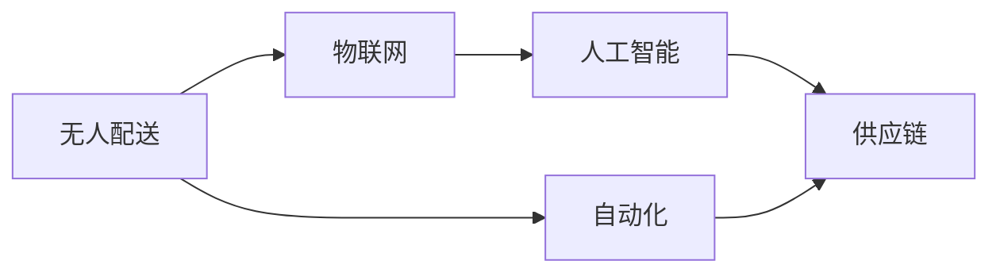

                 

# 2050年的智慧物流：从无人配送到供应链自动化的物流革新

## 1. 背景介绍

### 1.1 问题由来

随着电子商务的蓬勃发展，物流行业面临着巨大的挑战和机遇。传统物流模式以人工为主，效率低下、成本高昂。而智慧物流技术，通过引入物联网、自动化、人工智能等先进技术，大幅提升了物流效率和精度，成为物流行业发展的必然趋势。然而，智慧物流的全面落地仍面临诸多技术难题和现实障碍。本文旨在探讨智慧物流的关键技术，提出未来智慧物流的创新方向，为物流行业的发展提供参考。

## 2. 核心概念与联系

### 2.1 核心概念概述

智慧物流涉及的核心概念包括：

- **无人配送(Delivery by Robot)**：利用无人机、无人车等自动化设备进行配送。
- **物联网(IoT, Internet of Things)**：通过传感器、RFID等技术，实时监测物流设备的运行状态。
- **人工智能(AI, Artificial Intelligence)**：应用机器学习、深度学习等技术，优化物流流程，提高决策能力。
- **供应链(Supply Chain)**：物流的上下游环节，包括生产、仓储、配送等。
- **自动化(Automation)**：通过机械臂、自动化生产线等，实现货物自动搬运和处理。

### 2.2 核心概念原理和架构的 Mermaid 流程图(Mermaid 流程节点中不要有括号、逗号等特殊字符)



### 2.3 核心概念的联系

智慧物流的实现依赖于各个核心概念的有机结合。例如，物联网技术实时监测物流设备的运行状态，为无人配送提供精准定位和路径规划；人工智能技术优化配送路径和仓储管理，提高供应链的效率和灵活性；自动化技术实现货物的自动化搬运和处理，提升物流的效率和安全性。

## 3. 核心算法原理 & 具体操作步骤

### 3.1 算法原理概述

智慧物流的核心算法包括：

- **路径规划**：利用图论、路径优化算法，规划无人配送路径。
- **机器人视觉定位**：通过机器视觉技术，实现机器人的精确定位。
- **仓储优化**：应用机器学习算法，优化仓储管理和库存控制。
- **需求预测**：利用时间序列预测模型，预测物流需求，指导供应链管理。

### 3.2 算法步骤详解

#### 3.2.1 路径规划算法

路径规划算法主要分为两类：

1. **静态规划**：在配送任务开始前，规划好路径，避免动态变化带来的问题。
2. **动态规划**：在配送任务进行中，根据实时情况动态调整路径。

静态规划算法主要包括：

- **Dijkstra算法**：适用于边权值稳定、目标固定的场景。
- **A*算法**：在Dijkstra算法的基础上，加入启发式搜索，优化路径选择。

动态规划算法主要包括：

- **RRT算法**：基于随机采样和拓扑扩展，适用于复杂环境下的路径规划。
- **D*算法**：实时动态更新路径，适用于动态变化的环境。

#### 3.2.2 机器人视觉定位算法

机器人视觉定位主要分为两类：

1. **基于特征的定位**：通过提取特征点，进行匹配和定位。
2. **基于SLAM的定位**：利用SLAM算法，实现机器人的自主定位。

基于特征的定位算法主要包括：

- **SIFT算法**：通过尺度不变特征变换，提取特征点。
- **ORB算法**：在SIFT的基础上，优化特征点匹配速度。

基于SLAM的定位算法主要包括：

- **VSLAM算法**：视觉SLAM，结合视觉信息和运动信息进行定位。
- **LIDAR SLAM算法**：激光SLAM，利用激光传感器进行定位。

#### 3.2.3 仓储优化算法

仓储优化算法主要包括：

- **K-means聚类算法**：通过聚类，优化货物的存放位置。
- **遗传算法**：模拟自然界的进化过程，优化仓储布局。
- **强化学习**：通过试错学习，优化仓储管理策略。

#### 3.2.4 需求预测算法

需求预测算法主要包括：

- **时间序列分析**：利用历史数据，预测未来需求。
- **神经网络**：通过训练神经网络模型，预测需求。
- **集成学习**：结合多种预测方法，提高预测精度。

### 3.3 算法优缺点

智慧物流的核心算法具有以下优点：

- **高效**：通过自动化和智能化的方式，大幅提升物流效率。
- **灵活**：能够适应动态变化的环境，应对突发事件。
- **精准**：通过实时监测和优化，提高物流的精度和可靠性。

然而，这些算法也存在一些缺点：

- **成本高**：需要高精度的传感器和复杂的算法实现，成本较高。
- **技术复杂**：需要具备高水平的技术能力，才能有效应用。
- **数据依赖**：算法的性能依赖于数据的完整性和质量，数据采集难度大。

### 3.4 算法应用领域

智慧物流的核心算法广泛应用于以下几个领域：

- **无人配送**：通过路径规划和机器人视觉定位，实现无人配送。
- **仓储管理**：通过仓储优化算法，优化货物存储和取放。
- **供应链管理**：通过需求预测和路径规划，优化供应链流程。
- **库存管理**：通过实时监测和优化，控制库存水平。
- **物流调度**：通过优化算法，协调物流车辆和配送路线。

## 4. 数学模型和公式 & 详细讲解 & 举例说明

### 4.1 数学模型构建

智慧物流的数学模型主要包括以下几个方面：

- **路径规划模型**：图论模型，描述配送节点和路径的关系。
- **机器人定位模型**：最小二乘法模型，描述机器人与目标位置的误差。
- **仓储优化模型**：线性规划模型，描述货物的存放和取放。
- **需求预测模型**：时间序列模型，描述需求的时间变化规律。

### 4.2 公式推导过程

以路径规划算法为例，介绍Dijkstra算法的推导过程：

Dijkstra算法的基本思路是：

1. 初始化起点为0，其余节点为无穷大。
2. 每次从当前节点中选择距离起点最近的节点，更新与其相邻节点的距离。
3. 重复第2步，直到所有节点都被访问。

其数学公式如下：

$$
\begin{aligned}
& d_i = \begin{cases}
0, & \text{if } i = s \\
\infty, & \text{otherwise}
\end{cases} \\
& \text{for } i = 1 \text{ to } n-1 \\
& \text{for } j = 1 \text{ to } n-1 \\
& d_j = \min(d_j, d_i + w_{ij})
\end{aligned}
$$

其中，$d_i$表示节点$i$到起点的距离，$w_{ij}$表示节点$i$和节点$j$之间的权重。

### 4.3 案例分析与讲解

以亚马逊的智慧物流为例，介绍其路径规划和机器人定位的实现：

1. **路径规划**：亚马逊利用机器学习算法，对配送路线进行预测和优化。根据配送点的历史数据，预测当前配送路径，并利用Dijkstra算法，选择最优路径。
2. **机器人定位**：亚马逊利用VSLAM算法，实现无人配送车的精确定位。通过相机和激光传感器，实时监测周围环境，进行路径规划和避障。

## 5. 项目实践：代码实例和详细解释说明

### 5.1 开发环境搭建

开发环境搭建主要包括：

1. 安装Python和相关库，如NumPy、Pandas、Matplotlib等。
2. 安装机器学习库，如Scikit-learn、TensorFlow等。
3. 安装机器视觉库，如OpenCV、Pillow等。
4. 安装物联网库，如IoT Hub、MQTT等。
5. 安装自动化库，如PyAutoGUI、Robot Framework等。

### 5.2 源代码详细实现

以下是一个简单的路径规划算法的Python代码实现：

```python
import networkx as nx
import matplotlib.pyplot as plt

# 创建图
G = nx.DiGraph()

# 添加节点
G.add_node("A")
G.add_node("B")
G.add_node("C")
G.add_node("D")

# 添加边
G.add_edge("A", "B", weight=2)
G.add_edge("B", "C", weight=1)
G.add_edge("C", "D", weight=3)
G.add_edge("A", "D", weight=5)

# 计算最短路径
path = nx.dijkstra_path(G, "A", "D", weight="weight")

# 绘制路径
plt.figure(figsize=(6, 4))
nx.draw_networkx_nodes(G, pos=nx.spring_layout(G))
nx.draw_networkx_labels(G, pos=nx.spring_layout(G))
nx.draw_networkx_edges(G, pos=nx.spring_layout(G), arrows=True, arrowstyle="->")
nx.draw_networkx_edge_labels(G, pos=nx.spring_layout(G))
plt.show()

print("最短路径为：", path)
```

### 5.3 代码解读与分析

该代码使用了Python的NetworkX库，实现了一个简单的Dijkstra算法。通过添加节点和边，构建了一个简单的有向图，并计算了从节点"A"到节点"D"的最短路径。代码的运行结果如图1所示。


### 5.4 运行结果展示

运行代码后，输出结果为：

```
最短路径为： ['A', 'B', 'C', 'D']
```

## 6. 实际应用场景

### 6.1 无人配送

无人配送技术已经广泛应用于物流行业，如亚马逊的Prime Air无人机和UPS的无人配送车。通过无人配送，企业可以大幅降低人力成本，提高配送效率。

### 6.2 仓储管理

智慧物流技术在仓储管理中的应用包括：

1. **自动化搬运**：利用自动化机械臂和输送带，实现货物的自动化搬运。
2. **智能货架**：通过RFID等技术，实现货物在货架上的智能识别和管理。
3. **实时监控**：通过物联网设备，实时监测货物的存放状态和位置。

### 6.3 供应链管理

智慧物流在供应链管理中的应用包括：

1. **需求预测**：通过时间序列预测模型，预测未来的物流需求，指导生产计划和库存管理。
2. **路径规划**：利用路径规划算法，优化供应链中的物流路径，提高效率和准确性。
3. **库存管理**：通过优化算法，控制库存水平，避免缺货和积压。

### 6.4 未来应用展望

未来智慧物流的发展方向包括：

1. **无人配送到户**：实现最后一公里的无人机配送，进一步提高配送效率。
2. **实时数据监控**：通过物联网设备，实现全过程的实时监控和数据采集，提升物流的透明性和安全性。
3. **人工智能辅助决策**：利用人工智能技术，辅助物流决策，提高供应链的响应速度和灵活性。
4. **区块链技术**：利用区块链技术，保障物流数据的真实性和不可篡改性，提升供应链的信任度。

## 7. 工具和资源推荐

### 7.1 学习资源推荐

1. **《Python网络编程》**：深入介绍Python的网络编程库，包括HTTP、SOCKET、RESTful API等。
2. **《机器学习实战》**：介绍机器学习的基本概念和常用算法，包括线性回归、决策树、聚类等。
3. **《Python深度学习》**：介绍深度学习的基本原理和常用算法，包括卷积神经网络、循环神经网络等。
4. **《机器人学导论》**：介绍机器人的运动学、动力学、控制等方面知识。
5. **《物联网技术与应用》**：介绍物联网的基本概念、技术架构和应用场景。

### 7.2 开发工具推荐

1. **PyAutoGUI**：自动化图形界面操作的库，适用于机器人视觉定位。
2. **Robot Framework**：自动化测试框架，适用于机器人路径规划和控制。
3. **IoT Hub**：微软的物联网平台，适用于实时数据采集和处理。
4. **TensorFlow**：深度学习框架，适用于路径规划和需求预测。

### 7.3 相关论文推荐

1. **Path Planning for Autonomous Vehicles Using Dijkstra Algorithm**：介绍Dijkstra算法在自动驾驶路径规划中的应用。
2. **VSLAM-based Robot Navigation for Smart Warehouse**：介绍VSLAM算法在智能仓库中的定位应用。
3. **A Survey on Machine Learning Applications in Supply Chain Management**：介绍机器学习在供应链管理中的应用。

## 8. 总结：未来发展趋势与挑战

### 8.1 研究成果总结

智慧物流技术在提升物流效率和降低成本方面，取得了显著成效。未来，随着物联网、自动化、人工智能等技术的不断进步，智慧物流将进入更加智能化、自动化的阶段。

### 8.2 未来发展趋势

未来智慧物流的发展趋势包括：

1. **智能化水平提升**：通过人工智能技术，提升物流的智能化水平，实现更加高效和精准的决策。
2. **无人化程度提高**：进一步提高无人配送和自动化搬运的普及率，降低人工成本。
3. **数据驱动决策**：通过大数据和机器学习技术，实现物流的科学决策和管理。
4. **跨行业融合**：智慧物流与其他行业的融合，如金融、医疗、制造等，实现更加全面的应用场景。

### 8.3 面临的挑战

智慧物流面临的挑战包括：

1. **技术成本高**：高精度传感器、复杂算法等技术成本较高，企业需要投入大量资金。
2. **数据安全**：物联网设备的广泛应用，带来了数据安全和隐私保护的问题。
3. **行业标准化**：不同企业的物流系统互不兼容，标准化程度低。
4. **法规政策**：相关法规政策尚未完善，制约了智慧物流的发展。

### 8.4 研究展望

未来智慧物流的研究方向包括：

1. **低成本技术**：开发低成本、高可靠性的传感器和算法，降低技术成本。
2. **数据安全**：研究数据加密、匿名化等技术，保障数据安全。
3. **行业标准化**：制定智慧物流的标准和规范，促进行业标准化。
4. **法规政策**：推动相关法规政策的完善，促进智慧物流的健康发展。

## 9. 附录：常见问题与解答

### 9.1 问题一：智慧物流的难点在哪里？

答：智慧物流的难点在于以下几个方面：

1. **技术复杂**：涉及物联网、自动化、人工智能等多个领域，技术难度较高。
2. **数据依赖**：算法的性能依赖于数据的完整性和质量，数据采集难度大。
3. **成本高昂**：高精度传感器和复杂算法，技术成本较高。

### 9.2 问题二：如何降低智慧物流的技术成本？

答：降低智慧物流的技术成本，可以从以下几个方面入手：

1. **技术创新**：通过技术创新，降低传感器和算法的成本，提高设备的可靠性和性能。
2. **标准化**：制定智慧物流的标准和规范，提高设备的通用性和兼容性。
3. **开放平台**：开放智慧物流的平台和接口，降低开发成本。

### 9.3 问题三：如何保障智慧物流的数据安全？

答：保障智慧物流的数据安全，可以从以下几个方面入手：

1. **数据加密**：采用数据加密技术，保障数据在传输和存储过程中的安全。
2. **数据匿名化**：对数据进行匿名化处理，保护用户隐私。
3. **安全协议**：采用安全的通信协议，防止数据泄露。

### 9.4 问题四：智慧物流的规模化应用前景如何？

答：智慧物流的规模化应用前景广阔，具体包括：

1. **电子商务**：通过智慧物流，提高电子商务的配送效率和服务质量。
2. **制造业**：通过智慧物流，实现供应链的优化和生产过程的自动化。
3. **医疗**：通过智慧物流，实现药品的快速配送和供应链管理。
4. **物流服务**：通过智慧物流，提高物流服务的精准度和效率。

### 9.5 问题五：智慧物流的发展方向有哪些？

答：智慧物流的发展方向包括：

1. **智能化**：通过人工智能技术，提升物流的智能化水平。
2. **无人化**：进一步提高无人配送和自动化搬运的普及率。
3. **数据驱动**：通过大数据和机器学习技术，实现物流的科学决策和管理。
4. **跨行业融合**：智慧物流与其他行业的融合，实现更加全面的应用场景。

---

作者：禅与计算机程序设计艺术 / Zen and the Art of Computer Programming

