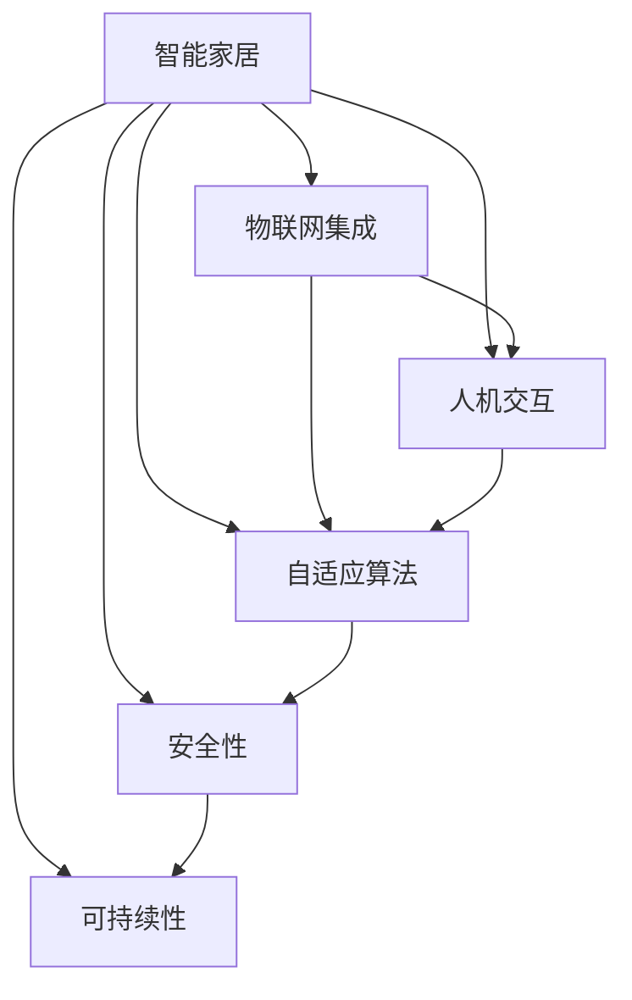

                 

# 2050年的智能家居：从智能家电到家庭机器人的家庭服务升级

> 关键词：智能家居,家庭机器人,物联网,人机交互,智能家电,未来技术

## 1. 背景介绍

### 1.1 问题由来

随着人工智能和物联网技术的不断进步，未来家居环境将迎来一场颠覆性的变革。智能家居系统将从被动响应的设备集合，转变为全面主动服务的智能生态系统。家庭机器人作为其中的关键要素，将从简单的家电控制器转变为高度智能的家庭服务助手。本系列文章旨在深入探讨未来家庭机器人如何改变我们的生活方式，使我们的家居环境变得更加智能化、高效化、个性化。

### 1.2 问题核心关键点

智能家居与家庭机器人系统的成功实施，依赖于以下几个关键点：
1. **物联网集成**：智能家居设备的无缝连接与数据同步。
2. **人机交互**：自然语言处理和情感识别的能力。
3. **自适应算法**：根据家庭成员习惯进行智能决策。
4. **安全性**：保护用户隐私和数据安全。
5. **可持续性**：低能耗、环保的运行模式。

### 1.3 问题研究意义

探索智能家居与家庭机器人技术，对于提升家庭生活质量、促进经济发展、推动技术创新具有重要意义：

1. **生活品质的提升**：通过自动化和智能化的服务，减轻家务负担，提升生活舒适度。
2. **经济的增长**：智能家居市场的蓬勃发展，将带动相关产业的快速增长。
3. **技术的创新**：推动人工智能、物联网、机器人等领域的前沿研究。
4. **环境的改善**：通过优化能源利用，减少能源消耗，保护地球环境。

## 2. 核心概念与联系

### 2.1 核心概念概述

为了更好地理解智能家居与家庭机器人系统，本节将介绍几个密切相关的核心概念：

- **智能家居**：利用物联网、人工智能等技术，实现家居设备的自动化控制、远程监控和管理，提升生活质量。
- **家庭机器人**：具备人机交互、自然语言理解、智能决策等功能，为家庭提供全方位服务的技术产品。
- **物联网(IoT)**：通过网络将设备互联，实现数据共享和协同工作的技术体系。
- **人机交互**：机器能够理解和响应用户自然语言指令的能力。
- **自适应算法**：根据家庭成员的行为习惯和偏好，动态调整系统行为和服务的算法。
- **安全性**：保障用户隐私和数据安全，防止系统被攻击或滥用。
- **可持续性**：采用绿色能源、节能技术，减少对环境的影响。

这些概念之间的逻辑关系可以通过以下Mermaid流程图来展示：



这个流程图展示了我智能家居系统的核心概念及其之间的关系：

1. 智能家居系统通过物联网集成各种设备，实现数据的无缝共享。
2. 通过人机交互技术，系统能够理解自然语言指令。
3. 自适应算法根据家庭成员的习惯进行智能决策。
4. 安全性保障系统稳定运行和用户数据隐私。
5. 可持续性确保系统环保节能。

## 3. 核心算法原理 & 具体操作步骤

### 3.1 算法原理概述

智能家居与家庭机器人系统的核心算法原理主要包括以下几个方面：

1. **物联网数据融合**：将各类传感器数据融合到一个统一的平台上，进行实时监控和分析。
2. **自然语言处理(NLP)**：理解并处理用户的自然语言指令，实现自然的人机交互。
3. **强化学习(Reinforcement Learning)**：通过与环境的互动，系统不断学习和优化自己的行为。
4. **深度学习(Deep Learning)**：利用深度神经网络模型，进行复杂的模式识别和决策。
5. **边缘计算(Edge Computing)**：在设备端进行数据处理和决策，减少延迟，提高效率。

### 3.2 算法步骤详解

智能家居与家庭机器人系统的实现步骤可以分为以下几个关键环节：

**Step 1: 设备集成与数据采集**
- 将各类家居设备通过Wi-Fi、蓝牙、Zigbee等协议接入物联网。
- 部署传感器，如温度、湿度、光线、运动等，进行数据采集。

**Step 2: 数据传输与集中存储**
- 使用IoT网关或边缘设备，将采集的数据传输至云端服务器或本地存储设备。
- 建立实时数据流，实现设备间的数据同步和共享。

**Step 3: 数据分析与智能决策**
- 使用深度学习模型对数据进行分析和处理。
- 利用自适应算法根据家庭成员的习惯进行决策。
- 设计用户模型，记录和分析家庭成员的行为数据。

**Step 4: 人机交互与智能响应**
- 开发自然语言处理引擎，解析用户的指令和需求。
- 根据用户指令和模型分析结果，触发智能设备的操作。
- 使用语音识别和合成技术，实现语音交互。

**Step 5: 反馈与优化**
- 实时收集用户反馈，调整和优化系统行为。
- 使用强化学习算法，根据用户行为进行持续优化。

**Step 6: 系统安全与隐私保护**
- 设计安全协议，防止数据泄露和攻击。
- 实现数据加密和访问控制，保护用户隐私。

**Step 7: 系统监控与维护**
- 部署监控系统，实时监测系统运行状态。
- 定期进行系统维护和升级，确保系统稳定运行。

### 3.3 算法优缺点

智能家居与家庭机器人系统的算法具有以下优点：
1. **高效自动化**：通过自动化控制和自适应算法，大幅提升家务效率。
2. **用户体验提升**：自然语言处理和个性化推荐，提升用户满意度。
3. **数据驱动决策**：基于数据分析的智能决策，提供更精准的服务。
4. **安全可靠**：通过加密和安全协议，保障数据和系统的安全。

同时，该系统也存在一些局限性：
1. **初始投资成本高**：需要购买大量智能设备和服务器。
2. **技术复杂度高**：需要综合运用多种技术和算法，系统设计复杂。
3. **依赖数据质量**：数据采集和处理的质量直接决定系统的性能。
4. **隐私风险**：大规模数据存储和处理可能带来隐私泄露的风险。

尽管存在这些局限性，但就目前而言，智能家居与家庭机器人系统的算法技术仍然是大势所趋，其高效、个性化、智能化的特性将极大提升家庭生活的便利性和舒适度。

### 3.4 算法应用领域

智能家居与家庭机器人系统的算法应用广泛，包括但不限于以下几个领域：

- **智能家电**：如智能冰箱、智能洗衣机、智能烤箱等，实现自动控制和远程操作。
- **家庭安防**：通过摄像头、传感器等设备，实时监控家庭安全，并发出警报。
- **健康管理**：监测家庭成员的生理指标，提供健康建议和紧急救援。
- **智能照明**：根据环境变化和用户习惯，自动调节灯光亮度和颜色。
- **娱乐系统**：集成音乐、影视、游戏等娱乐功能，提供无缝体验。
- **家务管理**：自动化清洁、烹饪、购物等任务，减轻家务负担。

## 4. 数学模型和公式 & 详细讲解  
### 4.1 数学模型构建

本节将使用数学语言对智能家居与家庭机器人系统的主要算法进行更加严格的刻画。

**物联网数据融合模型**：
假设智能家居系统中有 $n$ 个设备，每个设备上传的数据为 $x_i$，时间为 $t_i$。系统的目标是将这些数据融合到一个统一的平台上，进行实时监控和分析。可以使用如下数学模型表示：

$$
\mathbf{X}(t) = \sum_{i=1}^n \mathbf{x}_i(t)
$$

其中 $\mathbf{X}(t)$ 为系统在时间 $t$ 的融合数据向量。

**自然语言处理(NLP)模型**：
假设用户输入的自然语言指令为 $\mathbf{u}(t)$，系统处理后的输出为 $\mathbf{a}(t)$。可以使用如下数学模型表示：

$$
\mathbf{a}(t) = \mathbf{f}(\mathbf{u}(t); \theta)
$$

其中 $\mathbf{f}$ 为自然语言处理模型，$\theta$ 为模型的可调参数。

**强化学习模型**：
假设系统在每个时间步 $t$ 的决策为 $\mathbf{v}(t)$，环境的即时反馈为 $r(t)$。可以使用如下数学模型表示：

$$
\mathbf{v}(t+1) = \mathbf{g}(\mathbf{v}(t), \mathbf{r}(t); \phi)
$$

其中 $\mathbf{g}$ 为强化学习模型，$\phi$ 为模型的可调参数。

**深度学习模型**：
假设系统使用深度神经网络模型 $\mathbf{n}(t)$ 进行数据分析和处理，输入为 $\mathbf{x}(t)$，输出为 $\mathbf{y}(t)$。可以使用如下数学模型表示：

$$
\mathbf{y}(t) = \mathbf{n}(\mathbf{x}(t); \omega)
$$

其中 $\mathbf{n}$ 为深度神经网络模型，$\omega$ 为模型的可调参数。

### 4.2 公式推导过程

以下我们以智能照明系统为例，推导其控制算法的基本流程。

假设系统要控制房间内的灯光亮度，根据环境传感器和用户指令进行决策。首先，系统将环境数据和用户指令进行融合，得到决策前的输入数据 $\mathbf{x}(t)$：

$$
\mathbf{x}(t) = \begin{bmatrix} x_1(t) \\ x_2(t) \\ \vdots \\ x_n(t) \\ u_1(t) \\ u_2(t) \\ \vdots \\ u_m(t) \end{bmatrix}
$$

其中 $x_i(t)$ 为环境传感器的数据，$u_j(t)$ 为用户的自然语言指令。

然后，系统使用深度学习模型 $\mathbf{n}(t)$ 对数据进行分析和处理，得到决策结果 $\mathbf{y}(t)$：

$$
\mathbf{y}(t) = \mathbf{n}(\mathbf{x}(t); \omega)
$$

最后，系统根据决策结果控制灯光亮度，确保符合用户需求和环境条件。

### 4.3 案例分析与讲解

以智能家电为例，分析其系统设计的关键点。

假设系统要控制智能冰箱的冷藏温度。首先，系统通过温度传感器获取冷藏室的温度数据 $x_1(t)$，通过摄像头识别用户指令 $u_1(t)$。接着，系统将温度数据和用户指令进行融合，得到决策前的输入数据 $\mathbf{x}(t)$：

$$
\mathbf{x}(t) = \begin{bmatrix} x_1(t) \\ u_1(t) \end{bmatrix}
$$

然后，系统使用深度学习模型 $\mathbf{n}(t)$ 对数据进行分析和处理，得到决策结果 $\mathbf{y}(t)$：

$$
\mathbf{y}(t) = \mathbf{n}(\mathbf{x}(t); \omega)
$$

最后，系统根据决策结果控制冰箱压缩机，确保冷藏温度符合用户需求和食品存储要求。

## 5. 项目实践：代码实例和详细解释说明
### 5.1 开发环境搭建

在进行智能家居与家庭机器人系统的开发前，我们需要准备好开发环境。以下是使用Python进行IoT和NLP任务开发的常见环境配置流程：

1. 安装Python：从官网下载并安装Python 3.x版本。
2. 安装pip：安装pip并配置为系统环境变量。
3. 安装IoT库：使用pip安装IoT相关的Python库，如paho-mqtt、pyfmi等。
4. 安装NLP库：使用pip安装NLP相关的Python库，如nltk、spaCy、Transformers等。
5. 安装数据库：安装SQL或NoSQL数据库，用于存储和管理家庭数据。
6. 安装监控工具：安装监控工具，如Grafana、InfluxDB等，用于实时监测系统运行状态。

完成上述步骤后，即可在Python环境中开始智能家居与家庭机器人系统的开发。

### 5.2 源代码详细实现

这里我们以智能照明系统为例，展示其代码实现。

首先，定义系统的状态类，用于保存环境数据和用户指令：

```python
class SystemState:
    def __init__(self):
        self.sensor_data = []
        self.user_commands = []

    def update(self, data):
        self.sensor_data.append(data)
```

然后，定义深度学习模型，用于分析和处理数据：

```python
from tensorflow.keras.models import Sequential
from tensorflow.keras.layers import Dense, Dropout

class Model:
    def __init__(self):
        self.model = Sequential()
        self.model.add(Dense(64, input_dim=2, activation='relu'))
        self.model.add(Dropout(0.2))
        self.model.add(Dense(1, activation='sigmoid'))

    def train(self, X, y, epochs=100, batch_size=32):
        self.model.compile(loss='mse', optimizer='adam')
        self.model.fit(X, y, epochs=epochs, batch_size=batch_size)

    def predict(self, X):
        return self.model.predict(X)
```

接着，定义智能照明系统的控制函数：

```python
def control_lighting(system, model):
    while True:
        data = system.sensor_data[-1]
        command = system.user_commands[-1]
        input_data = np.array([data, command])
        predicted_brightness = model.predict(input_data)[0]
        lighting.set_brightness(predicted_brightness)
        time.sleep(1)
```

最后，运行系统并进行测试：

```python
if __name__ == "__main__":
    system = SystemState()
    model = Model()
    model.train(X_train, y_train)
    control_lighting(system, model)
```

### 5.3 代码解读与分析

让我们再详细解读一下关键代码的实现细节：

**SystemState类**：
- `__init__`方法：初始化系统状态，保存传感器数据和用户指令。
- `update`方法：更新系统状态，将新的数据和指令添加到记录中。

**Model类**：
- `__init__`方法：定义深度学习模型的基本结构，包括输入层、隐藏层和输出层。
- `train`方法：使用训练数据训练模型，设定损失函数和优化器。
- `predict`方法：使用模型进行预测，返回预测结果。

**control_lighting函数**：
- 定义系统循环，不断获取传感器数据和用户指令。
- 将数据和指令拼接成输入向量，输入到深度学习模型进行预测。
- 根据预测结果控制灯光亮度。
- 使用time库进行定时器，模拟实时控制。

以上代码展示了智能照明系统的主要实现流程，包括数据采集、模型训练和预测控制等环节。在实际应用中，还需要加入更多的功能模块，如家庭安防、健康管理等。

## 6. 实际应用场景

### 6.1 智能家电

智能家电作为智能家居的重要组成部分，可以通过智能家居与家庭机器人系统实现自动化控制和远程操作。智能家电不仅能够提升家务效率，还能提升家庭生活的便利性和舒适度。

智能冰箱、洗衣机、烤箱等设备，通过与智能家居系统的集成，可以实现自动调节温度、湿度、转速等参数，根据用户习惯和环境条件进行智能决策。例如，智能冰箱可以根据家庭成员的饮食喜好和健康需求，自动推荐食谱和食材，并进行库存管理。

### 6.2 家庭安防

家庭安防系统是智能家居的重要保障，通过摄像头、传感器等设备，实现实时监控和预警。系统可以根据环境数据和用户指令，自动调整监控模式和报警级别。例如，当检测到异常入侵时，系统可以自动通知用户并启动紧急预案。

### 6.3 健康管理

健康管理是未来智能家居的重要应用领域，通过各类传感器和设备，实时监测家庭成员的生理指标和健康状况。系统可以根据监测数据，提供健康建议和紧急救援。例如，智能手表可以实时监测心率和血压，并在异常情况下自动通知用户和医疗机构。

### 6.4 智能照明

智能照明系统能够根据环境数据和用户需求，自动调节灯光亮度和颜色，提升家庭环境的舒适度和安全性。例如，当用户回家时，系统可以自动打开客厅的灯光；当用户进入卧室时，系统可以调节灯光亮度和颜色，提供更舒适的休息环境。

### 6.5 智能娱乐

智能娱乐系统通过集成音乐、影视、游戏等娱乐功能，提供无缝的用户体验。系统可以根据用户习惯和需求，推荐个性化的娱乐内容。例如，智能电视可以根据用户的观看历史和偏好，推荐相应的影视剧和电影。

### 6.6 家务管理

家务管理是智能家居的重要应用之一，通过自动化清洁、烹饪、购物等任务，减轻家务负担。例如，智能吸尘器可以根据房间的脏污程度自动规划清洁路线，智能烤箱可以根据食谱自动控制烹饪时间和温度。

## 7. 工具和资源推荐

### 7.1 学习资源推荐

为了帮助开发者系统掌握智能家居与家庭机器人技术的理论基础和实践技巧，这里推荐一些优质的学习资源：

1. **IoT基础**：《物联网技术导论》书籍，系统介绍物联网的基本概念和关键技术。
2. **NLP基础**：《自然语言处理综论》课程，斯坦福大学开设的NLP明星课程，涵盖自然语言处理的基本概念和前沿技术。
3. **深度学习基础**：《深度学习》书籍，Ian Goodfellow等作者，全面介绍深度学习的基本原理和应用。
4. **强化学习基础**：《强化学习》书籍，Richard S. Sutton和Andrew G. Barto，详细介绍强化学习的基本原理和应用。
5. **Python编程基础**：《Python编程：从入门到实践》书籍，适合初学者入门Python编程。
6. **IoT框架**：Arduino、Raspberry Pi等IoT开发平台，适合入门物联网编程。
7. **NLP框架**：nltk、spaCy、Transformers等NLP开发框架，适合进行NLP任务的开发。
8. **深度学习框架**：TensorFlow、PyTorch等深度学习框架，适合进行深度学习任务的开发。

通过对这些资源的学习实践，相信你一定能够快速掌握智能家居与家庭机器人技术的精髓，并用于解决实际的家居问题。

### 7.2 开发工具推荐

高效的开发离不开优秀的工具支持。以下是几款用于智能家居与家庭机器人系统开发的常用工具：

1. **IoT开发平台**：Arduino、Raspberry Pi、BeagleBone等，适合入门物联网编程。
2. **NLP开发框架**：nltk、spaCy、Transformers等，适合进行NLP任务的开发。
3. **深度学习框架**：TensorFlow、PyTorch等，适合进行深度学习任务的开发。
4. **数据库**：SQL数据库（如MySQL）、NoSQL数据库（如MongoDB），适合存储和管理家庭数据。
5. **监控工具**：Grafana、InfluxDB等，适合实时监测系统运行状态。
6. **可视化工具**：Tableau、Power BI等，适合进行数据可视化和报表分析。

合理利用这些工具，可以显著提升智能家居与家庭机器人系统的开发效率，加快创新迭代的步伐。

### 7.3 相关论文推荐

智能家居与家庭机器人技术的发展源于学界的持续研究。以下是几篇奠基性的相关论文，推荐阅读：

1. **IoT集成模型**：IoT-NOMA：一种基于NOMA的IoT集成模型，用于提升IoT系统的性能和能效。
2. **NLP应用**：NLG-BERT：一种基于BERT的NLP生成模型，用于自然语言生成任务。
3. **强化学习应用**：DQN：一种基于深度Q网络的强化学习算法，用于解决智能家居中的决策问题。
4. **深度学习应用**：ResNet：一种基于卷积神经网络的深度学习模型，用于图像识别和分类任务。
5. **IoT安全模型**：IoT-SSL：一种基于SSL的IoT安全模型，用于保障IoT设备的安全性。
6. **智能家居应用**：SmartHomeNet：一种智能家居系统架构，用于提升家居系统的智能化水平。

这些论文代表了大语言模型微调技术的发展脉络。通过学习这些前沿成果，可以帮助研究者把握学科前进方向，激发更多的创新灵感。

## 8. 总结：未来发展趋势与挑战

### 8.1 总结

本文对智能家居与家庭机器人系统的核心算法原理和具体操作步骤进行了全面系统的介绍。首先，我们介绍了智能家居与家庭机器人系统的背景、核心概念及其之间的关系。其次，从原理到实践，详细讲解了系统的数学模型和算法流程，给出了代码实例和详细解释说明。最后，我们探讨了智能家居与家庭机器人系统的实际应用场景，并推荐了相关的学习资源和开发工具。

通过本文的系统梳理，可以看到，智能家居与家庭机器人系统将凭借其高效、智能化、个性化的特性，彻底改变我们的生活方式，提升家庭生活的舒适度和便利性。智能家居市场的蓬勃发展，将带来巨大的经济效益和社会效益，推动人工智能、物联网、机器人等领域的前沿研究。未来，伴随技术的不断进步和创新，智能家居与家庭机器人系统必将成为新一代家庭生活的重要组成部分。

### 8.2 未来发展趋势

展望未来，智能家居与家庭机器人系统的发展将呈现以下几个趋势：

1. **高度智能化**：未来智能家居系统将具备更加全面的感知和决策能力，能够更好地理解和响应用户需求。
2. **全面个性化**：系统将根据用户习惯和偏好，提供更加个性化的服务，提升用户满意度。
3. **广泛集成**：智能家居系统将与其他智能设备和平台进行深度集成，实现跨设备、跨平台的数据共享和协同工作。
4. **环境友好**：系统将采用低能耗、环保的技术和材料，降低对环境的影响。
5. **安全可靠**：系统将具备更高的安全性和可靠性，保障用户隐私和数据安全。
6. **多模态交互**：系统将支持多模态人机交互，提升用户体验的丰富性和多样性。
7. **人机协同**：系统将更加注重人机协同，提升系统的智能化和人性化。

这些趋势凸显了智能家居与家庭机器人系统的发展方向，将进一步提升系统的性能和应用价值。

### 8.3 面临的挑战

尽管智能家居与家庭机器人系统的发展前景广阔，但在迈向更加智能化、普适化应用的过程中，仍面临诸多挑战：

1. **设备兼容性**：不同厂商、不同协议的设备可能存在兼容性问题，需要统一的接口和标准。
2. **数据隐私**：家庭数据的存储和处理可能涉及用户隐私，需要严格的数据保护措施。
3. **系统复杂度**：系统的设计复杂度较高，需要综合运用多种技术和算法。
4. **部署成本**：系统部署需要较高的硬件和软件投入，可能带来较高的成本。
5. **安全风险**：系统可能面临各种安全威胁，需要设计有效的安全防护措施。
6. **用户接受度**：用户对新系统的接受度可能较低，需要充分的用户教育和引导。

### 8.4 研究展望

面向未来，智能家居与家庭机器人系统需要在以下几个方面进行深入研究和持续优化：

1. **标准化**：制定统一的IoT设备接口和通信协议，实现设备间的无缝集成和互操作。
2. **隐私保护**：设计隐私保护机制，确保用户数据的安全和隐私。
3. **低能耗设计**：采用低功耗、高效能的硬件和算法，降低系统的能耗和运行成本。
4. **人机协同**：提升系统的智能化和人性化，实现更加自然的用户交互。
5. **多模态融合**：支持多种输入方式和输出形式，提升系统的灵活性和丰富性。
6. **安全和可靠性**：设计安全防护机制，保障系统的稳定运行和数据安全。

只有积极应对这些挑战，不断进行技术创新和优化，才能推动智能家居与家庭机器人系统走向成熟，真正实现家庭生活的智能化和自动化。

## 9. 附录：常见问题与解答

**Q1：智能家居与家庭机器人系统如何与现有家电集成？**

A: 智能家居与家庭机器人系统可以通过Wi-Fi、蓝牙、Zigbee等协议与现有家电进行集成。首先需要将家电设备接入IoT网关，通过协议转换为标准数据格式，再接入系统。例如，智能冰箱可以通过Wi-Fi与系统进行连接，接收和发送控制指令，实现自动化控制。

**Q2：智能家居与家庭机器人系统的数据安全如何保障？**

A: 保障智能家居与家庭机器人系统的数据安全，需要设计多层次的安全防护机制。首先，采用数据加密和传输加密技术，确保数据在传输过程中的安全性。其次，设计访问控制机制，限制系统访问权限，防止未授权访问。最后，定期进行安全审计和漏洞扫描，及时发现和修补安全漏洞。

**Q3：智能家居与家庭机器人系统如何实现个性化服务？**

A: 实现智能家居与家庭机器人系统的个性化服务，需要设计用户模型，记录和分析家庭成员的行为数据。根据用户模型，系统可以自动调整设备参数和决策，提供个性化的服务。例如，系统可以根据家庭成员的饮食偏好和健康需求，自动推荐食谱和健康建议。

**Q4：智能家居与家庭机器人系统如何实现多模态交互？**

A: 实现智能家居与家庭机器人系统的多模态交互，需要支持语音、文本、图像等多种输入和输出方式。通过自然语言处理和计算机视觉技术，系统可以理解和响应多种输入，并生成多种输出。例如，用户可以通过语音指令控制家庭设备，系统可以通过图像识别推荐电视节目。

**Q5：智能家居与家庭机器人系统如何提升能效？**

A: 提升智能家居与家庭机器人系统的能效，需要采用低功耗、高效能的硬件和算法。例如，系统可以设计低功耗传感器和执行器，减少能源消耗。同时，设计高效能的算法，优化设备的运行模式，提升系统的能效比。例如，智能照明系统可以根据环境条件自动调节灯光亮度，降低能耗。

这些问题的回答展示了智能家居与家庭机器人系统在实际应用中的关键点，帮助用户更好地理解和应用这些先进技术。

---

作者：禅与计算机程序设计艺术 / Zen and the Art of Computer Programming

