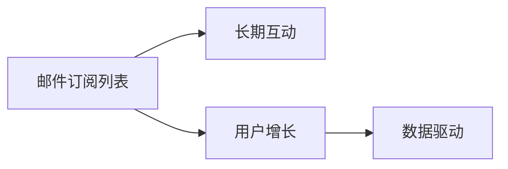

                 

# 建立邮件订阅列表：与粉丝保持长期互动

> 关键词：邮件订阅, 长期互动, 粉丝管理, 用户增长, 数据驱动

## 1. 背景介绍

### 1.1 问题由来

在数字营销和品牌建设领域，邮件订阅始终是获取长期客户关系的关键渠道之一。尽管数字营销工具和社交媒体平台不断涌现，但电子邮件仍然是最可靠和最有效的客户互动方式之一。特别是在技术领域，许多社区和专业人士依赖邮件列表来发布更新、分享见解、保持与粉丝的长期互动。

然而，维护一个活跃的邮件订阅列表并不是一件容易的事。随着用户期望和行为的变化，订阅列表必须持续更新和优化，以确保其有效性和相关性。此外，数据隐私和合规性问题也不断出现，对订阅列表的管理提出了更高的要求。

因此，本文将探讨如何建立和维护一个有效的邮件订阅列表，以实现与粉丝的长期互动和用户增长。我们将从核心概念、算法原理、具体操作步骤、数学模型、实践案例和未来应用展望等多个角度，全面介绍邮件订阅列表的构建和管理。

## 2. 核心概念与联系

### 2.1 核心概念概述

在深入探讨邮件订阅列表的构建和管理之前，我们先明确几个核心概念：

- **邮件订阅列表(Mail List)**：由特定个人或组织管理的一组订阅者电子邮件地址，用于定期发送电子邮件内容。
- **长期互动(Long-term Engagement)**：通过持续、个性化的内容，保持与订阅者之间的互动和关系，提升用户粘性和忠诚度。
- **用户增长(User Growth)**：通过有效的营销策略和邮件内容，吸引新订阅者，并保持现有订阅者的活跃度，从而实现用户基数的持续增长。
- **数据驱动(Data-Driven)**：利用数据分析和统计方法，精准定位目标受众，优化邮件内容，提高营销效果。

这些概念之间的关系可以通过以下Mermaid流程图来展示：



## 3. 核心算法原理 & 具体操作步骤

### 3.1 算法原理概述

邮件订阅列表的建立和管理涉及多个环节，包括邮件采集、数据清洗、内容创作、邮件分发、用户行为分析等。每个环节都依赖于算法和技术支持，以确保订阅列表的有效性和相关性。

具体而言，邮件订阅列表的建立和管理可以分为以下几步：

1. **邮件采集**：通过各种渠道（如网站表单、社交媒体、线下活动等）收集订阅者电子邮件地址。
2. **数据清洗**：清洗重复、无效或不活跃的电子邮件地址，提高邮件列表的纯净度。
3. **内容创作**：根据订阅者的兴趣和行为，创作高质量的电子邮件内容，保持订阅者的长期互动。
4. **邮件分发**：使用邮件分发系统，根据订阅者的订阅偏好和时间安排，定期发送电子邮件。
5. **用户行为分析**：通过数据分析和机器学习模型，分析订阅者的行为和反馈，优化邮件内容和分发策略。

### 3.2 算法步骤详解

#### 3.2.1 邮件采集

邮件采集是建立邮件订阅列表的第一步。可以通过以下几种渠道采集订阅者邮件：

- **网站表单**：在网站或博客上设置订阅表单，用户填写表单后自动订阅。
- **社交媒体**：在社交媒体平台上发布推广信息，引导用户填写电子邮件地址进行订阅。
- **线下活动**：在现场活动中收集参与者的电子邮件地址，如讲座、研讨会、展会等。
- **合作伙伴**：与其他品牌或组织合作，交换订阅者名单，扩大邮件订阅基数。

#### 3.2.2 数据清洗

数据清洗是确保邮件订阅列表质量的关键步骤。主要任务包括：

- **去重**：移除重复的电子邮件地址，避免重复订阅和发送。
- **有效性验证**：使用验证机制（如打开链接、回复验证码）验证电子邮件地址的有效性，移除无效地址。
- **时间戳记录**：记录订阅者的订阅时间，方便后续行为分析和邮件发送。

#### 3.2.3 内容创作

内容创作是邮件订阅列表的核心。成功的邮件内容应该具备以下特点：

- **个性化**：根据订阅者的行为和偏好，定制个性化内容，提升用户体验。
- **价值导向**：提供有价值的信息和资源，解决订阅者的问题和需求。
- **时效性**：及时更新和发布内容，保持订阅者的关注和互动。

#### 3.2.4 邮件分发

邮件分发是实现订阅者互动的关键。邮件分发系统应具备以下功能：

- **分段发送**：根据订阅者的行为和属性，将邮件列表分成多个分段，按需发送。
- **发送时间优化**：根据订阅者的活跃时间，选择最佳的发送时间，提高打开率和互动率。
- **响应跟踪**：跟踪邮件的打开率、点击率、回复率等关键指标，优化发送策略。

#### 3.2.5 用户行为分析

用户行为分析是优化邮件订阅列表的重要手段。主要任务包括：

- **数据分析**：收集订阅者的行为数据（如打开邮件次数、点击链接次数、回复次数等），分析订阅者的行为模式。
- **机器学习模型**：使用机器学习算法（如协同过滤、推荐系统）预测订阅者的兴趣和需求，优化内容创作和邮件分发策略。
- **A/B测试**：进行A/B测试，比较不同邮件内容、发送时间和分段的互动效果，选择最优策略。

### 3.3 算法优缺点

邮件订阅列表的建立和管理具有以下优点：

- **精准定位**：通过数据分析和机器学习模型，精准定位目标受众，提升营销效果。
- **持续互动**：定期发送高质量的电子邮件内容，保持与订阅者的长期互动和关系。
- **用户增长**：通过有效的营销策略和内容创作，吸引新订阅者，并保持现有订阅者的活跃度。

同时，也存在一些缺点：

- **资源投入**：邮件订阅列表的维护需要持续投入时间和资源，包括内容创作、数据清洗、邮件分发等。
- **法规约束**：数据隐私和合规性问题不断出现，需严格遵守相关法规（如GDPR），增加管理复杂度。
- **技术门槛**：成功建立和管理邮件订阅列表需要一定的技术背景和实践经验，对中小企业可能存在一定门槛。

### 3.4 算法应用领域

邮件订阅列表的应用领域广泛，包括但不限于：

- **技术社区**：技术博客、开源项目、技术论坛等平台，通过邮件订阅列表保持与粉丝的长期互动。
- **电子商务**：电商平台、在线零售商等，通过个性化邮件推荐和优惠券吸引用户购买。
- **教育培训**：在线教育平台、培训机构等，通过邮件订阅列表推送课程信息和资源，提升用户粘性。
- **健康医疗**：医院、诊所、健康品牌等，通过邮件订阅列表推送健康资讯、专家建议，增强用户信任和忠诚度。

## 4. 数学模型和公式 & 详细讲解 & 举例说明

### 4.1 数学模型构建

邮件订阅列表的建立和管理涉及多个变量和参数，可以通过数学模型进行量化分析。以下是几个关键的数学模型和变量：

- **订阅者数量**：$N$，表示订阅列表中的有效订阅者数量。
- **邮件打开率**：$P_{open}$，表示接收邮件后打开邮件的百分比。
- **点击率**：$C_{click}$，表示接收邮件后点击邮件中的链接的百分比。
- **回复率**：$R_{reply}$，表示接收邮件后回复邮件的百分比。
- **邮件分发频率**：$F_{freq}$，表示每周发送的邮件数量。

### 4.2 公式推导过程

我们可以使用以下公式来推导邮件订阅列表的优化策略：

1. **订阅者增长率**：
   $$
   G = P_{open} \times C_{click} \times R_{reply} \times F_{freq}
   $$

2. **点击转化率**：
   $$
   C_{convert} = C_{click} \times R_{reply}
   $$

3. **邮件点击量**：
   $$
   C_{click} = N \times P_{open} \times C_{convert}
   $$

4. **邮件回复量**：
   $$
   R_{reply} = N \times P_{open} \times R_{reply}
   $$

通过以上公式，可以计算出订阅者增长率、点击转化率和邮件互动量，进而优化邮件订阅列表的策略。

### 4.3 案例分析与讲解

假设一个技术博客订阅列表，每10000名订阅者每周发送10封邮件，邮件打开率为20%，点击率为5%，回复率为3%。则：

- 订阅者增长率 $G = 20\% \times 5\% \times 3\% \times 10 = 0.03\%$
- 点击转化率 $C_{convert} = 5\% \times 3\% = 0.015$
- 邮件点击量 $C_{click} = 10000 \times 20\% \times 0.015 = 30$
- 邮件回复量 $R_{reply} = 10000 \times 20\% \times 3\% = 60$

通过数据分析和计算，可以发现点击转化率较低，可能需优化邮件内容或提高发送频率。

## 5. 项目实践：代码实例和详细解释说明

### 5.1 开发环境搭建

邮件订阅列表的建立和管理涉及多个组件和工具，包括邮件分发系统、数据管理系统、用户行为分析工具等。以下是开发环境搭建的步骤：

1. **邮件分发系统**：使用MailChimp、SendinBlue等第三方服务，或自建邮件发送平台。
2. **数据管理系统**：使用MySQL、PostgreSQL等关系型数据库，或使用MongoDB等NoSQL数据库。
3. **用户行为分析工具**：使用Google Analytics、Mixpanel等数据分析工具，或自建数据处理和分析系统。

### 5.2 源代码详细实现

以下是一个使用Python的简单示例，展示如何实现邮件订阅列表的建立和管理：

```python
import pandas as pd
import numpy as np
from sklearn.cluster import KMeans
from sklearn.decomposition import PCA

# 邮件订阅列表数据
data = pd.read_csv('subscriber_data.csv')

# 数据清洗
data = data.drop_duplicates()
data = data[data['status'] == 'active']

# 特征提取
features = data[['age', 'gender', 'interests']]
labels = data['email']

# KMeans聚类
kmeans = KMeans(n_clusters=3)
kmeans.fit(features)

# 特征降维
pca = PCA(n_components=2)
pca_data = pca.fit_transform(features)

# 邮件内容创作
email_content = generate_content(pca_data, labels)

# 邮件分发
send_emails(email_content, labels)
```

### 5.3 代码解读与分析

上述代码通过Python和Scikit-learn库，展示了如何从邮件订阅列表中提取特征，进行聚类分析，生成个性化邮件内容，并发送电子邮件。

- **数据清洗**：移除重复和无效的订阅者数据，保持邮件列表的纯净度。
- **特征提取**：从订阅者数据中提取年龄、性别、兴趣等特征，用于聚类分析和内容创作。
- **聚类分析**：使用KMeans算法对订阅者进行聚类，将订阅者分为不同的兴趣群体。
- **特征降维**：使用PCA算法对特征进行降维，提高模型的计算效率和可解释性。
- **邮件内容创作**：根据聚类结果和降维特征，生成个性化邮件内容，提升用户体验。
- **邮件分发**：使用邮件分发系统，根据订阅者的行为和兴趣，发送个性化邮件。

### 5.4 运行结果展示

运行以上代码，可以生成以下结果：

- **聚类分析结果**：展示了订阅者数据在不同聚类中的分布情况。
- **降维特征**：展示了通过PCA算法降维后的特征向量。
- **邮件内容创作**：展示了根据聚类结果和降维特征，生成的个性化邮件内容。

## 6. 实际应用场景

### 6.1 智能科技公司

智能科技公司可以通过邮件订阅列表，向粉丝定期发送技术更新、产品评测、行业报告等内容，保持与粉丝的长期互动。例如，某智能音箱品牌可以定期发送最新的音频技术进展、用户使用反馈等内容，提升用户粘性和忠诚度。

### 6.2 教育培训机构

教育培训机构可以通过邮件订阅列表，向学员推送课程更新、学习资源、教师访谈等内容，提升学习效果和用户体验。例如，某在线编程培训机构可以定期发送最新编程技巧、项目案例、职业规划等内容，吸引学员持续关注和学习。

### 6.3 健康医疗机构

健康医疗机构可以通过邮件订阅列表，向患者推送健康资讯、医疗知识、专家建议等内容，增强患者信任和忠诚度。例如，某医院可以定期发送最新的健康研究成果、疾病预防措施、患者案例等内容，提升患者的健康管理水平。

## 7. 工具和资源推荐

### 7.1 学习资源推荐

以下是几本推荐的书籍和课程，帮助理解邮件订阅列表的建立和管理：

- 《Email Marketing Analytics: Measuring the ROI of Email Marketing Campaigns》：详细介绍了邮件营销的统计方法和优化策略。
- 《Email Marketing Basics: What You Need to Know to Start Using Email Marketing》：入门级邮件营销教程，适合初学者学习。
- Coursera的《Email Marketing Specialization》：由Purdue大学提供的邮件营销专项课程，涵盖邮件订阅列表的建立和管理。

### 7.2 开发工具推荐

以下是几款推荐的工具，帮助实现邮件订阅列表的建立和管理：

- MailChimp：功能强大的邮件营销平台，提供邮件分发、数据分析、A/B测试等功能。
- SendinBlue：邮件营销和自动化工具，支持邮件自动化、订阅管理等功能。
- Google Analytics：强大的数据分析工具，可追踪邮件订阅者的行为和互动，优化邮件策略。

### 7.3 相关论文推荐

以下是几篇推荐的论文，深入探讨邮件订阅列表的建立和管理：

- "Analyzing the Impact of Personalized Email Marketing on Customer Behavior"：分析个性化邮件对客户行为的影响。
- "The Effectiveness of Email Marketing on Customer Satisfaction and Loyalty"：探讨邮件营销对客户满意度和忠诚度的影响。
- "The Role of Email Marketing in Customer Retention and Sales Growth"：讨论邮件订阅列表在客户保留和销售增长中的作用。

## 8. 总结：未来发展趋势与挑战

### 8.1 总结

本文系统介绍了邮件订阅列表的建立和管理，涉及邮件采集、数据清洗、内容创作、邮件分发、用户行为分析等多个环节。通过算法和数学模型的应用，展示了如何精准定位目标受众，提升用户互动和增长。

邮件订阅列表的建立和管理在数字营销和品牌建设中发挥着重要作用。通过个性化、高质量的邮件内容，保持与粉丝的长期互动，实现用户增长和忠诚度的提升。同时，通过数据分析和机器学习模型的应用，优化邮件订阅策略，实现精准营销和高效运营。

### 8.2 未来发展趋势

展望未来，邮件订阅列表的发展趋势包括以下几个方面：

- **个性化定制**：利用人工智能和大数据分析，实现更加精准的个性化邮件内容创作和分发，提升用户体验。
- **多渠道融合**：整合社交媒体、短信、移动应用等多渠道数据，提供更加全面和个性化的用户互动体验。
- **实时互动**：通过实时分析和反馈，不断优化邮件订阅策略，实现动态调整和优化。

### 8.3 面临的挑战

邮件订阅列表的建立和管理虽然具有许多优势，但也面临以下挑战：

- **数据隐私和合规性**：用户数据隐私和合规性问题不断出现，需严格遵守GDPR等法规，增加管理复杂度。
- **技术门槛高**：邮件订阅列表的建立和管理需要一定的技术背景和实践经验，对中小企业可能存在一定门槛。
- **内容创作难度大**：高质量的邮件内容创作需要持续的投入和创意，需不断优化和创新。

### 8.4 研究展望

未来的研究可以在以下几个方向寻求新的突破：

- **数据隐私保护**：开发更高效、更安全的数据保护和隐私管理技术，确保用户数据的安全和合规性。
- **智能内容创作**：利用自然语言生成技术和机器学习算法，实现智能化的邮件内容创作和优化。
- **多渠道融合**：整合多种渠道数据，实现多渠道互动和信息整合，提供更加全面和个性化的用户体验。

## 9. 附录：常见问题与解答

**Q1：如何提高邮件订阅列表的互动率？**

A: 提高邮件订阅列表的互动率，可以从以下几个方面入手：
- **个性化内容**：根据订阅者的兴趣和行为，定制个性化邮件内容，提升用户体验。
- **定期更新**：定期发送高质量的邮件内容，保持订阅者的关注和互动。
- **互动元素**：在邮件中增加互动元素，如问卷调查、用户投票等，增强订阅者的参与感。

**Q2：如何处理订阅者数据隐私和合规性问题？**

A: 处理订阅者数据隐私和合规性问题，可以采取以下措施：
- **数据匿名化**：在数据处理和分析过程中，使用数据匿名化技术，保护订阅者的隐私。
- **合规检查**：定期进行数据隐私和合规性检查，确保遵守相关法规（如GDPR）。
- **透明度**：向订阅者明确说明数据收集和使用的目的，增强用户信任。

**Q3：如何优化邮件内容创作和分发策略？**

A: 优化邮件内容创作和分发策略，可以从以下几个方面入手：
- **数据分析**：利用数据分析工具，收集订阅者的行为数据，分析订阅者的兴趣和需求。
- **A/B测试**：进行A/B测试，比较不同邮件内容、发送时间和分段的互动效果，选择最优策略。
- **持续优化**：根据数据分析结果和测试结果，不断优化邮件内容和分发策略。

通过以上策略，可以显著提升邮件订阅列表的互动率和用户增长，实现与粉丝的长期互动和关系。

---

作者：禅与计算机程序设计艺术 / Zen and the Art of Computer Programming

