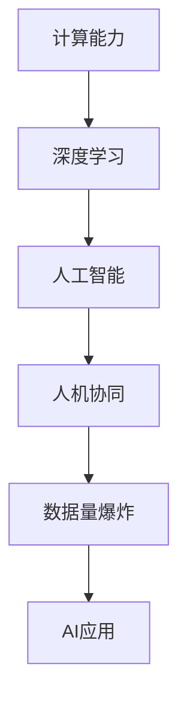

                 

# 开启无限可能：人类计算的新征程

> 关键词：人工智能,计算能力,超大规模数据,深度学习,人类智能,计算的未来

## 1. 背景介绍

### 1.1 问题由来

随着信息技术的不断进步，计算能力已经从个人计算机扩展到超级计算机、量子计算机以及分布式计算等诸多领域。现代计算能力已经远远超出了人类所能想象。面对这巨大的计算能力，人类该如何更好地利用它，实现自身与技术共生的新未来，成为一个重要的问题。

如今，计算已经不仅仅局限于科学研究和工程技术领域，它正在深刻地改变着我们的生产、生活乃至思想方式。人工智能(AI)的崛起，便是计算能力迅猛发展的产物。它不仅大大增强了人类的计算能力，还开启了人类对智能、意识等深层问题的探索。

### 1.2 问题核心关键点

问题的关键在于如何更好地利用这巨大的计算能力，实现人类与技术的深度融合。关键点包括：
- 计算能力的提高
- 数据量的急剧增加
- 深度学习模型的发展
- 人机协同智能的进步
- 社会影响与伦理问题

这些关键点将引领我们走向一个全新的计算时代，让人类计算迈入前所未有的新征程。

### 1.3 问题研究意义

探索人类计算的未来发展趋势，对于推动科技革新、提升社会生产力、改善人类生活质量具有重要意义：

1. **科学发现与创新**：计算能力的增强，加速了科学研究的进程，促进了新理论、新发现的涌现。
2. **产业升级**：提升了各行各业的效率和智能化水平，助力经济社会快速发展。
3. **教育与学习**：通过智能化的教学工具，提供个性化、因材施教的教育环境，提高教育质量。
4. **社会治理**：改进政府决策、公共服务、智慧城市建设等方面，提升社会治理能力。
5. **伦理与安全**：如何确保技术的安全性、公正性、透明性，避免引发伦理风险，是未来计算发展的重要课题。

## 2. 核心概念与联系

### 2.1 核心概念概述

为了更好地理解人类计算的未来发展，我们先来概述一下几个关键概念：

- **计算能力**：指计算机执行指令、处理数据的能力。随着量子计算、分布式计算等技术的发展，计算能力正飞速提升。
- **深度学习**：一种基于神经网络的机器学习算法，通过大数据和大量计算来训练模型，可以自动进行特征提取和模式识别。
- **人工智能**：通过计算机模拟人脑，实现各种认知智能功能。AI的应用范围包括语言理解、图像识别、推荐系统等。
- **人机协同**：指将人类与机器智能结合，发挥各自优势，共同解决问题。
- **数据量爆炸**：指随着互联网、物联网等的发展，数据量呈指数级增长，这对计算能力提出了更高要求。

这些核心概念相互交织，共同构建起人类计算的未来蓝图。

### 2.2 核心概念原理和架构的 Mermaid 流程图(Mermaid 流程节点中不要有括号、逗号等特殊字符)



通过这个流程图，我们可以看到计算能力的发展促进了深度学习模型的进步，进而推动了人工智能技术的飞跃，最终形成了人机协同的智能环境。数据量爆炸则是这一系列进步的基础和推动力。

## 3. 核心算法原理 & 具体操作步骤

### 3.1 算法原理概述

人类计算的未来发展，离不开算法原理和操作步骤的支撑。基于深度学习的大规模计算模型，尤其是神经网络，已经成为当前计算的核心。下面我们重点介绍以下几个关键点：

- **神经网络结构**：通过多层神经元之间的连接，实现数据的复杂表示和处理。深度网络通过多个隐藏层，可以从数据中提取高层次的抽象特征。
- **反向传播算法**：基于链式法则，计算模型参数的梯度，用于更新模型的权重，使得模型能够逐步逼近目标函数。
- **损失函数设计**：通过设计合适的损失函数，指导模型学习数据的特征，从而优化模型的输出。
- **优化器选择**：选择合适的优化算法，如Adam、SGD等，以控制模型的学习速度和收敛性。

### 3.2 算法步骤详解

1. **数据预处理**：收集并清洗大量数据，进行归一化、标准化等处理，确保数据的质量和一致性。
2. **模型训练**：使用反向传播算法，更新模型参数，使模型学习数据的特征，从而逼近目标函数。
3. **模型评估**：在验证集或测试集上评估模型的性能，如准确率、召回率等，以评估模型的泛化能力。
4. **模型优化**：根据评估结果，调整模型结构、优化算法、数据预处理等，以提升模型的性能。
5. **模型部署**：将训练好的模型部署到实际应用中，进行实时计算或批处理计算。

### 3.3 算法优缺点

深度学习模型的优势在于其强大的表示能力和适应性，但同时也面临以下挑战：
- **计算资源需求高**：深度模型通常需要大规模的计算资源，对硬件要求较高。
- **训练时间长**：大规模模型的训练需要较长时间，对实时性要求较高的应用场景不适用。
- **可解释性差**：深度模型的决策过程复杂，难以解释其内部机制。
- **模型泛化能力有限**：过度拟合训练数据，可能导致模型在实际应用中表现不佳。

### 3.4 算法应用领域

基于深度学习模型的计算技术，已经在诸多领域得到了广泛应用，包括：

- **图像识别**：如人脸识别、物体检测等，通过卷积神经网络进行特征提取和分类。
- **自然语言处理**：如机器翻译、情感分析、文本生成等，通过循环神经网络、Transformer等进行模型训练。
- **推荐系统**：通过协同过滤、内容推荐等技术，为用户推荐个性化的产品或内容。
- **金融风控**：使用深度学习模型对交易数据进行分析，评估风险和预测市场趋势。
- **医疗诊断**：通过医学影像分析、基因组学分析等技术，辅助医生进行疾病诊断和治疗决策。

## 4. 数学模型和公式 & 详细讲解 & 举例说明

### 4.1 数学模型构建

神经网络的数学模型可以表示为：

$$y = \sigma(Wx + b)$$

其中，$x$ 为输入向量，$y$ 为输出向量，$W$ 为权重矩阵，$b$ 为偏置项，$\sigma$ 为激活函数。

### 4.2 公式推导过程

以一个简单的二分类问题为例，模型的目标函数为交叉熵损失：

$$\mathcal{L} = -\frac{1}{N}\sum_{i=1}^N(y_i\log\hat{y_i} + (1-y_i)\log(1-\hat{y_i}))$$

其中，$y_i$ 为真实标签，$\hat{y_i}$ 为模型预测值。

使用梯度下降算法进行优化时，梯度为：

$$\nabla_{\theta}\mathcal{L} = -\frac{1}{N}\sum_{i=1}^N(y_i - \hat{y_i})(1-\hat{y_i})$$

其中，$\nabla_{\theta}\mathcal{L}$ 表示损失函数对模型参数 $\theta$ 的梯度。

### 4.3 案例分析与讲解

例如，在图像识别任务中，我们可以使用卷积神经网络（CNN）进行特征提取。CNN通过卷积层、池化层、全连接层等结构，学习图像的局部特征和全局特征，从而实现分类。

## 5. 项目实践：代码实例和详细解释说明

### 5.1 开发环境搭建

在进行深度学习项目时，我们通常使用Python和PyTorch进行开发。以下是环境搭建的步骤：

1. 安装Anaconda：通过官网下载并安装Anaconda，用于创建独立的Python环境。
2. 创建并激活虚拟环境：
```bash
conda create -n pytorch-env python=3.8 
conda activate pytorch-env
```

3. 安装PyTorch：根据CUDA版本，获取对应的安装命令。例如：
```bash
conda install pytorch torchvision torchaudio cudatoolkit=11.1 -c pytorch -c conda-forge
```

4. 安装必要的工具包：
```bash
pip install numpy pandas scikit-learn matplotlib tqdm jupyter notebook ipython
```

### 5.2 源代码详细实现

以下是一个简单的PyTorch代码示例，用于训练一个基本的图像分类器：

```python
import torch
import torch.nn as nn
import torch.optim as optim
from torchvision import datasets, transforms

# 定义模型
class Net(nn.Module):
    def __init__(self):
        super(Net, self).__init__()
        self.conv1 = nn.Conv2d(1, 10, kernel_size=5)
        self.conv2 = nn.Conv2d(10, 20, kernel_size=5)
        self.fc1 = nn.Linear(320, 50)
        self.fc2 = nn.Linear(50, 10)

    def forward(self, x):
        x = F.relu(self.conv1(x))
        x = F.max_pool2d(x, 2)
        x = F.relu(self.conv2(x))
        x = F.max_pool2d(x, 2)
        x = x.view(-1, 320)
        x = F.relu(self.fc1(x))
        x = self.fc2(x)
        return F.log_softmax(x, dim=1)

# 定义损失函数和优化器
net = Net()
criterion = nn.CrossEntropyLoss()
optimizer = optim.SGD(net.parameters(), lr=0.01, momentum=0.5)

# 训练模型
for epoch in range(10):
    running_loss = 0.0
    for i, data in enumerate(trainloader, 0):
        inputs, labels = data
        optimizer.zero_grad()
        outputs = net(inputs)
        loss = criterion(outputs, labels)
        loss.backward()
        optimizer.step()
        running_loss += loss.item()
    print(f'Epoch {epoch+1}, loss: {running_loss/len(trainloader)}')
```

### 5.3 代码解读与分析

在代码中，我们首先定义了一个简单的卷积神经网络，包含两个卷积层和两个全连接层。然后定义了交叉熵损失函数和随机梯度下降优化器。在训练过程中，我们通过迭代训练集，更新模型参数，并记录损失函数的变化。

## 6. 实际应用场景

### 6.1 医疗影像分析

在医疗影像分析中，深度学习模型可以用于疾病诊断、影像分割等任务。例如，通过卷积神经网络，可以从医学影像中自动检测出肿瘤、结节等病变部位。

### 6.2 自动驾驶

自动驾驶技术中的计算机视觉和深度学习模型，可以实现车辆检测、路径规划等功能。通过摄像头和传感器采集数据，训练深度模型对车辆、行人、交通信号灯等进行识别和分类。

### 6.3 自然语言处理

在自然语言处理中，深度学习模型可以用于机器翻译、情感分析、文本生成等任务。例如，使用Transformer模型，可以实现高效的机器翻译，将多种语言的文本互相翻译。

### 6.4 未来应用展望

未来，深度学习在计算中的应用将更加广泛和深入，可能涉及以下几个方向：

1. **量子计算**：结合量子计算的强大计算能力，解决传统深度学习难以处理的复杂问题。
2. **分布式计算**：通过分布式网络计算，加速大规模深度学习模型的训练和推理。
3. **自适应计算**：结合自适应学习算法，使计算过程更加智能化，适应动态变化的环境。
4. **跨模态计算**：结合视觉、语音、文本等多种数据，进行多模态的深度学习计算。
5. **智能网络计算**：利用智能网络计算，提高计算效率和资源利用率，实现更高效的计算。

## 7. 工具和资源推荐

### 7.1 学习资源推荐

为了更好地掌握深度学习技术，以下是一些优质的学习资源：

1. 《深度学习》（Ian Goodfellow等著）：深入浅出地介绍了深度学习的基本原理和应用。
2. 斯坦福大学CS231n课程：涉及计算机视觉方面的深度学习算法和应用。
3. 自然语言处理与深度学习课程（Coursera）：介绍自然语言处理领域的深度学习算法和应用。
4. DeepLearning.ai深度学习专项课程：涵盖深度学习的全流程，包括模型构建、训练、部署等环节。
5. PyTorch官方文档：详细介绍了PyTorch的用法和深度学习模型的构建。

### 7.2 开发工具推荐

高效的开发离不开优秀的工具支持。以下是几款用于深度学习开发的常用工具：

1. PyTorch：基于Python的开源深度学习框架，灵活动态的计算图，适合快速迭代研究。
2. TensorFlow：由Google主导开发的开源深度学习框架，生产部署方便，适合大规模工程应用。
3. Keras：简单易用的深度学习框架，适合快速构建和训练模型。
4. Jupyter Notebook：交互式的编程环境，支持代码块编辑、结果展示，适合数据处理和模型训练。
5. TensorBoard：TensorFlow配套的可视化工具，可实时监测模型训练状态，并提供丰富的图表呈现方式。

### 7.3 相关论文推荐

深度学习的发展离不开学界的持续研究。以下是几篇奠基性的相关论文，推荐阅读：

1. AlexNet：ImageNet大规模视觉识别挑战赛的获奖模型，标志着深度学习在计算机视觉领域的崛起。
2. ResNet：通过残差连接解决深度网络退化问题，使得网络可以更深更宽。
3. Transformer：提出自注意力机制，解决了RNN在处理长序列时的性能问题，推动了自然语言处理的发展。
4. Generative Adversarial Networks（GANs）：提出生成对抗网络，实现了图像生成和图像修复等应用。
5. AlphaGo：基于深度学习和强化学习，实现了计算机围棋的突破，展示了深度学习在决策领域的潜力。

## 8. 总结：未来发展趋势与挑战

### 8.1 总结

本文对基于深度学习的人类计算的未来发展进行了全面系统的介绍。首先阐述了计算能力的发展、深度学习模型的进步及其应用，明确了计算能力对未来社会的重要影响。其次，从原理到实践，详细讲解了深度学习模型的训练、评估和优化过程，给出了实际应用中的代码示例。同时，本文还探讨了深度学习在医疗、自动驾驶、自然语言处理等多个领域的广泛应用，展示了计算技术在现实世界的巨大潜力。最后，本文推荐了一些学习资源、开发工具和相关论文，帮助读者进一步提升深度学习技术水平。

通过本文的系统梳理，可以看到，基于深度学习的人类计算技术已经进入一个新的发展阶段，即将迎来更加智能、高效、灵活的未来。未来，随着计算能力的进一步提升和深度学习模型的不断改进，计算技术将在更多领域得到应用，推动人类社会进入智能新时代。

### 8.2 未来发展趋势

展望未来，人类计算技术将呈现以下几个发展趋势：

1. **计算能力持续提升**：量子计算、分布式计算等技术的发展，将进一步提升计算能力，解决更复杂的计算问题。
2. **深度学习模型优化**：模型结构优化、计算效率提升、模型压缩等技术的发展，使得深度学习模型更加高效。
3. **跨领域融合**：深度学习与其他领域的融合，如生物医学、智能制造等，带来新的应用场景和创新机会。
4. **人机协同增强**：结合人类智慧和机器智能，实现更高级的智能应用。
5. **数据与隐私保护**：随着数据量的爆炸式增长，数据安全与隐私保护将成为计算技术的重要方向。

这些趋势将共同推动人类计算技术的发展，使计算能力更好地服务于社会。

### 8.3 面临的挑战

尽管深度学习技术在诸多领域已经取得了显著成果，但在迈向更加智能化、普适化应用的过程中，它仍面临诸多挑战：

1. **计算资源限制**：大模型和高性能计算资源的需求对硬件提出了更高要求。
2. **模型泛化能力不足**：深度模型面临过拟合和泛化能力有限的问题。
3. **可解释性不足**：深度学习模型的决策过程复杂，难以解释其内部机制。
4. **数据隐私问题**：数据收集和处理过程中，隐私保护和数据安全成为重要问题。
5. **伦理与安全问题**：深度学习模型可能引入偏见和有害信息，引发伦理与安全风险。

克服这些挑战，需要学界和产业界的共同努力，从算法、数据、技术等多个层面进行改进和优化。

### 8.4 研究展望

为了应对未来计算技术的发展，需要关注以下几个研究方向：

1. **自适应学习算法**：结合自适应学习算法，使计算过程更加智能化，适应动态变化的环境。
2. **跨模态计算**：结合视觉、语音、文本等多种数据，进行多模态的深度学习计算。
3. **量子计算与深度学习结合**：利用量子计算的强大计算能力，解决传统深度学习难以处理的复杂问题。
4. **人机协同智能**：结合人类智慧和机器智能，实现更高级的智能应用。
5. **伦理与安全**：在深度学习模型中引入伦理导向的评估指标，确保技术的安全性、公正性、透明性。

通过这些研究方向的研究和突破，将进一步推动人类计算技术的发展，实现更加智能、高效、灵活的未来。

## 9. 附录：常见问题与解答

**Q1: 深度学习模型的训练过程有哪些步骤？**

A: 深度学习模型的训练过程包括：数据预处理、模型定义、损失函数和优化器选择、模型训练、模型评估和优化等步骤。

**Q2: 深度学习模型的优缺点是什么？**

A: 深度学习模型的优势在于其强大的表示能力和适应性，但同时也面临计算资源需求高、训练时间长、可解释性差等缺点。

**Q3: 如何提高深度学习模型的泛化能力？**

A: 通过数据增强、正则化、dropout等技术，可以有效提高模型的泛化能力。

**Q4: 深度学习在实际应用中有哪些挑战？**

A: 深度学习在实际应用中面临计算资源限制、模型泛化能力不足、可解释性不足、数据隐私问题、伦理与安全问题等挑战。

**Q5: 未来深度学习技术的发展方向是什么？**

A: 未来深度学习技术的发展方向包括计算能力持续提升、深度学习模型优化、跨领域融合、人机协同增强、数据与隐私保护等。

---

作者：禅与计算机程序设计艺术 / Zen and the Art of Computer Programming

