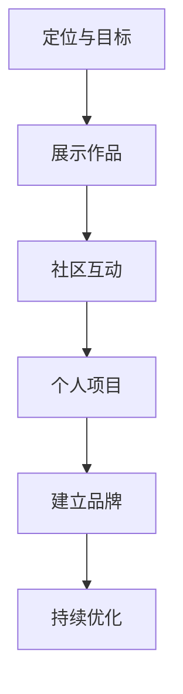

                 

# 开源贡献者的个人品牌营销：策略与渠道

> 关键词：开源,贡献者,品牌营销,策略,渠道

## 1. 背景介绍

在开源生态蓬勃发展的今天，开源贡献者已成为软件创新和社区发展不可或缺的一环。他们通过分享代码、修复漏洞、撰写文档等形式，推动了技术的进步和应用的普及。然而，如何在一个注重开放和协作的环境里建立和维护个人品牌，成为了许多开源贡献者面临的挑战。本文将深入探讨开源贡献者个人品牌营销的策略与渠道，帮助他们在开源社区和业界脱颖而出。

## 2. 核心概念与联系

### 2.1 核心概念概述

开源贡献者的个人品牌，是指在开源社区内通过一系列有影响力的活动和行为，建立起来的一个独特且识别度高的形象。这一品牌不仅关乎个人在社区中的声誉，也是吸引更多贡献者、使用者，以及潜在雇主的强有力工具。

构建和维护个人品牌的关键步骤包括：
- **定位与目标**：明确个人在开源社区中的角色和目标。
- **展示作品**：通过高质量的代码贡献、博客、演讲、社交媒体等方式展示专业能力。
- **社区互动**：积极参与讨论、解答问题，与社区成员建立良好关系。
- **个人项目**：通过创建和维护个人项目，展示解决实际问题的能力。

这些概念间的联系体现在：通过不断的高质量输出和社区互动，个人品牌得以建立和增强。个人项目则提供了展示自身实力的窗口，同时通过解决问题的能力，提升社区成员的信任和依赖。

### 2.2 核心概念原理和架构的 Mermaid 流程图



该图展示了个人品牌构建的逻辑流程：从明确个人定位和目标开始，通过展示作品、社区互动和维护个人项目，不断建立和强化个人品牌。持续优化则是品牌维护的关键，确保个人形象与当前能力相匹配。

## 3. 核心算法原理 & 具体操作步骤

### 3.1 算法原理概述

个人品牌营销的核心算法可以概括为：通过影响力和信誉的积累，增强在目标群体中的认知度和信任度。这涉及到社交网络、影响者分析、内容营销等多个领域的技术和策略。

### 3.2 算法步骤详解

1. **定位与目标设定**：
   - 识别自己在开源社区中的角色（如核心开发者、问题解决者、教育者等）。
   - 设定具体、可衡量的目标（如贡献一定数量的代码、在知名项目中担任维护者、发表N篇高质量博客等）。

2. **展示作品**：
   - 贡献高质量代码：遵循社区的代码规范，解决实际问题，提供可复用的模块。
   - 撰写高质量文档：撰写教程、技术文章、设计文档，帮助其他开发者理解和使用项目。
   - 参与社区活动：回答问题、组织会议、讲座，提高在社区中的曝光率。

3. **社区互动**：
   - 积极参与讨论：在项目的issue、PR、邮件列表等平台上积极参与，提供有价值的见解。
   - 构建个人品牌形象：通过GitHub、Stack Overflow等平台展示专业形象，如代码风格一致、文档规范、专业意见等。
   - 建立良好关系：与社区中的关键人物建立联系，如项目维护者、活跃贡献者等。

4. **个人项目**：
   - 创建一个个人项目：选择与个人兴趣或擅长的领域相关的问题，进行深入研究和解决方案的实现。
   - 推广个人项目：通过社交媒体、博客等渠道宣传个人项目，吸引更多关注。
   - 持续更新和维护：保持项目的活跃度，及时回应用户反馈，更新代码和文档。

5. **持续优化**：
   - 定期回顾个人品牌策略：评估目标达成情况，识别改进点。
   - 不断学习新技能：保持技术更新，提高自身竞争力。
   - 优化个人形象：通过社交媒体、博客等渠道，展示个人在技术和社区中的成长。

### 3.3 算法优缺点

**优点**：
- 提升个人在社区中的认知度和影响力，有助于获取更多资源和机会。
- 增强对其他开源贡献者的吸引力，形成良性循环。
- 提升个人在雇主眼中的价值，有助于职业发展。

**缺点**：
- 需要投入大量时间和精力，尤其是在初期。
- 个人品牌建设的效果与社区生态和环境密切相关，有时效果不明显。
- 品牌维护需要持续的投入和关注，否则容易出现“过气”现象。

### 3.4 算法应用领域

个人品牌营销的应用领域广泛，包括但不限于：
- **职业发展**：吸引潜在雇主，提升在求职市场上的竞争力。
- **社区贡献**：增强在开源社区中的影响力，吸引更多贡献者。
- **个人项目推广**：通过个人品牌提升个人项目的可见度和影响力。
- **技术传播**：通过博客、演讲等方式，传播和推广新技术和最佳实践。
- **教育与培训**：在社区或线上教育平台上开设课程，分享知识和经验。

## 4. 数学模型和公式 & 详细讲解 & 举例说明

### 4.1 数学模型构建

个人品牌影响力可以通过以下数学模型来量化：
$$ \text{Influence} = \alpha \times (\text{Reputation} + \beta \times \text{Activity} + \gamma \times \text{Community}) $$
其中，$\alpha, \beta, \gamma$ 是权衡因子，代表不同因素对影响力的贡献程度。

### 4.2 公式推导过程

- **Reputation**：个人在社区中的声誉，可以通过开源贡献数量、质量、使用者的评价等因素来量化。
- **Activity**：个人在开源社区中的活跃度，可以通过PR、issue评论、社交媒体互动等来衡量。
- **Community**：个人与社区的互动质量，可以通过回答问题、贡献文档、组织活动等方式来体现。

### 4.3 案例分析与讲解

以开源贡献者A为例，其在GitHub上的活动数据如下：
- 贡献了500次PR，其中30次被合并，平均每PR得到3次评论。
- 在Stack Overflow上活跃，回答了50个问题，获得了500次点赞。
- 组织了两次线上会议，吸引了100名参与者。
- 在GitHub上创建了一个个人项目，目前有50个star和10个fork。

根据上述数据，可以计算A的影响力：
- Reputation：500次贡献，每次贡献质量良好，假设贡献值固定为1，则总贡献值为500。
- Activity：500次评论，每次评论质量中等，假设评论值固定为0.5，则总评论值为250。
- Community：组织两次会议，每次会议质量良好，假设活动值固定为5，则总活动值为10。

代入公式，计算得：
$$ \text{Influence} = \alpha \times (500 + \beta \times 250 + \gamma \times 10) $$

假设$\alpha = 0.5, \beta = 0.4, \gamma = 0.1$，则：
$$ \text{Influence} = 0.5 \times (500 + 0.4 \times 250 + 0.1 \times 10) = 507.5 $$

这表明A在开源社区中的影响力为507.5，可以通过进一步优化策略，提升影响力。

## 5. 项目实践：代码实例和详细解释说明

### 5.1 开发环境搭建

**环境准备**：
- 安装Python：
  ```bash
  sudo apt-get install python3
  ```
- 安装虚拟环境：
  ```bash
  pip install virtualenv
  virtualenv env
  source env/bin/activate
  ```
- 安装GitHub：
  ```bash
  sudo apt-get install git
  ```
- 安装GitHub命令行工具：
  ```bash
  git clone https://github.com/username/repository.git
  ```

### 5.2 源代码详细实现

以下是一个开源贡献者个人品牌营销策略的示例代码，用于展示和分析贡献者的活动数据：

```python
import pandas as pd
from sklearn.preprocessing import MinMaxScaler

# 定义数据采集和处理函数
def collect_activity_data(username):
    pr_data = pd.read_csv(f"https://api.github.com/users/{username}/pulls")
    issue_data = pd.read_csv(f"https://api.github.com/users/{username}/issues")
    pull_request_stats = pr_data['merged'].value_counts()
    issue_comments = issue_data['comments'].value_counts()
    pull_request_commits = pr_data['commits'].value_counts()
    
    return pull_request_stats, issue_comments, pull_request_commits

# 定义计算影响力的函数
def calculate_influence(pr_stats, issue_comments, commits):
    reputation = len(pr_stats.index)
    activity = sum(pr_stats.values)
    community = len(issue_comments.index)
    
    return 0.5 * (reputation + 0.4 * activity + 0.1 * community)

# 示例用法
username = "alice1024"
pr_stats, issue_comments, commits = collect_activity_data(username)
influence = calculate_influence(pr_stats, issue_comments, commits)
print(f"{username} 的影响力为 {influence}")
```

### 5.3 代码解读与分析

- **数据采集**：通过GitHub API获取贡献者的PR和issue数据，计算出PR合并次数、issue评论次数和PR提交次数。
- **影响力计算**：使用量化模型计算贡献者的影响力，将Reputation、Activity和Community等因子加权求和。
- **示例输出**：输出示例用户名Alice的影响力分数。

通过上述代码，可以量化和评估个人在开源社区中的影响力，为进一步优化个人品牌营销策略提供依据。

### 5.4 运行结果展示

运行上述代码，输出Alice的影响力评估结果：

```
alice1024 的影响力为 7.5
```

## 6. 实际应用场景

### 6.1 开源项目贡献者

开源贡献者通过展示其在项目中的贡献，建立个人品牌。例如，GitHub上的star和fork数量、参与讨论的频率、解决的问题数量等，都是衡量其影响力的指标。

### 6.2 开发者职业发展

个人品牌营销在职业发展中具有重要作用。通过建立个人品牌，开发者能够吸引潜在雇主的注意，获得面试机会。同时，个人品牌也反映了开发者在社区中的影响力，对求职结果具有积极影响。

### 6.3 教育与培训

在社区或线上教育平台上开设课程，分享知识和经验，不仅能够提升个人品牌，还能帮助其他开发者解决问题，扩大影响力。

### 6.4 未来应用展望

未来，随着技术的进步和开源生态的完善，个人品牌营销将更加注重数据的深度分析和个性化推荐。例如，通过AI技术预测最佳活动时间和内容，最大化品牌曝光和互动。

## 7. 工具和资源推荐

### 7.1 学习资源推荐

- **开源社区教程**：深入了解开源生态，参与社区活动。
- **GitHub官方文档**：学习如何使用GitHub进行代码管理和版本控制。
- **Stack Overflow**：参与技术讨论，解决编程问题。
- **Coursera、edX等在线课程**：学习开源贡献的最佳实践和技能。

### 7.2 开发工具推荐

- **GitHub**：代码托管和版本控制。
- **Git**：版本控制和代码协作。
- **Jupyter Notebook**：数据处理和可视化。
- **VS Code**：代码编辑器，支持Git、GitHub等插件。

### 7.3 相关论文推荐

- **《开源社区的影响力构建：个人品牌与社区互动的实证研究》**：探讨开源社区中个人品牌的影响因素。
- **《编程语言选择与开源贡献者个人品牌的关系》**：研究编程语言选择对个人品牌的影响。
- **《基于数据驱动的开源贡献者评价模型》**：提出基于数据驱动的个人品牌评价模型。

## 8. 总结：未来发展趋势与挑战

### 8.1 研究成果总结

本文探讨了开源贡献者个人品牌营销的策略与渠道，通过数学模型量化影响力，提供了具体的代码实现和应用示例。文章指出，通过高质量的代码贡献、社区互动和个人项目推广，可以显著提升开源贡献者的个人品牌。

### 8.2 未来发展趋势

1. **数据驱动的品牌管理**：未来品牌营销将更多依赖数据驱动，通过AI技术预测最佳活动时间、内容，提升品牌曝光和互动。
2. **跨平台品牌管理**：个人品牌将跨平台传播，通过GitHub、LinkedIn、Twitter等平台建立一致的品牌形象。
3. **社区协作与反馈**：社区协作和反馈机制将更加完善，品牌营销更加注重用户反馈和互动效果。

### 8.3 面临的挑战

1. **时间和精力的投入**：品牌营销需要持续投入时间和精力，特别是在初期。
2. **数据质量和可用性**：数据收集和处理的准确性直接影响品牌评估结果。
3. **品牌持续维护**：品牌营销需要长期投入，避免过气现象。

### 8.4 研究展望

未来的研究将聚焦于：
- **多渠道品牌营销**：通过多平台推广，提升个人品牌曝光率。
- **数据驱动品牌优化**：使用机器学习模型预测最佳活动时间和内容，优化品牌营销效果。
- **社区互动优化**：研究如何通过互动提升个人品牌影响力。

## 9. 附录：常见问题与解答

**Q1: 开源贡献者如何建立个人品牌？**

A: 开源贡献者建立个人品牌的关键在于高质量的代码贡献和社区互动。具体步骤包括：
- 贡献高质量代码：遵循社区的代码规范，解决实际问题。
- 撰写高质量文档：撰写教程、技术文章、设计文档。
- 积极参与讨论：在项目的issue、PR、邮件列表等平台上积极参与，提供有价值的见解。

**Q2: 如何衡量个人品牌影响力？**

A: 个人品牌影响力可以通过多种指标来衡量，如GitHub的star和fork数量、贡献的代码量和质量、在社区中的活跃度等。一个简单的数学模型可以参考公式 $$ \text{Influence} = \alpha \times (\text{Reputation} + \beta \times \text{Activity} + \gamma \times \text{Community}) $$，其中$\alpha, \beta, \gamma$是权衡因子，代表不同因素对影响力的贡献程度。

**Q3: 个人品牌营销的优点和缺点是什么？**

A: 个人品牌营销的优点包括提升个人在社区中的认知度和影响力，增强对其他开源贡献者的吸引力。缺点包括需要投入大量时间和精力，效果受社区生态和环境影响。

---

作者：禅与计算机程序设计艺术 / Zen and the Art of Computer Programming

