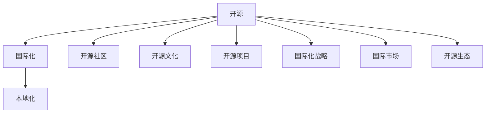

                 

# 开源项目的国际化：扩大市场和收入来源

> 关键词：开源, 国际化, 市场, 收入, 开源社区, 开源文化, 开源项目, 国际化战略, 国际市场, 开源生态

## 1. 背景介绍

### 1.1 问题由来
近年来，随着开源运动的蓬勃发展，越来越多的软件项目开始转向开源模式，以此来推动技术创新和社区发展。开源项目通过透明的代码和社区贡献，吸引了全球各地开发者和用户的关注，逐渐成为推动软件开发的重要力量。然而，尽管开源项目在技术层面取得了巨大成就，但在全球化市场的拓展上，仍存在诸多挑战。如何实现开源项目的国际化，扩大市场和收入来源，成为当前开源社区和开发者共同面临的重要课题。

### 1.2 问题核心关键点
在开源项目的国际化过程中，核心的关键点包括：

1. **市场拓展策略**：如何识别并开拓新的国际市场，理解不同地区用户需求，制定相应的推广策略。
2. **本地化适配**：如何将开源项目适配到不同的文化和语言环境中，以提高用户的使用体验和满意度。
3. **商业化探索**：如何在开源基础上探索商业化的路径，创造新的收入来源，同时保持社区的健康发展。
4. **国际合作**：如何与其他开源社区和国际组织建立合作关系，共同推动开源技术的全球传播和应用。
5. **文化差异管理**：如何管理并尊重不同国家和地区的文化差异，以建立和谐的国际社区关系。

这些关键点共同构成了开源项目国际化的核心要素，需要在策略制定和执行过程中予以充分考虑。

### 1.3 问题研究意义
实现开源项目的国际化，对于推动技术全球化应用、提升开发者社区活跃度、创造更多商业价值具有重要意义：

1. **提升技术影响力**：开源项目的国际化可以帮助其技术在全球范围内传播，吸引更多开发者和用户，提升技术影响力。
2. **增强社区凝聚力**：通过国际化的合作和交流，增强开源项目的社区凝聚力，吸引全球优秀人才参与贡献。
3. **创造商业机会**：国际化过程可以带来新的商业机会，如技术服务、培训、咨询等，拓宽开源项目的收入渠道。
4. **促进国际合作**：国际化有助于促进与其他国家和地区的技术交流和合作，推动全球技术进步。
5. **提升社会价值**：开源项目国际化可以帮助解决全球不同地区的问题，提升其社会价值和影响力。

因此，探索和实现开源项目的国际化，不仅是技术发展的需要，也是社会进步的重要推动力。

## 2. 核心概念与联系

### 2.1 核心概念概述

为更好地理解开源项目的国际化过程，本节将介绍几个密切相关的核心概念：

- **开源(Open Source)**：指在满足一定条件（如开源许可证）下，公开源代码并允许自由使用的软件开发模式。
- **国际化(Internationalization)**：指将软件产品或服务适配到不同语言和文化环境中，以便在全球范围内使用。
- **本地化(Localization)**：指将国际化后的软件产品或服务进一步适配到特定地区，以满足该地区的语言、文化和习惯等需求。
- **开源社区(Open Source Community)**：指围绕开源项目建立的技术社区，包括开发者、用户、贡献者等。
- **开源文化(Open Source Culture)**：指开源社区中遵循的共享、协作、透明度等价值观和行为规范。
- **开源项目(Open Source Project)**：指由社区开发者共同维护、贡献的开源软件或服务。
- **国际化战略(Internationalization Strategy)**：指企业或组织为实现国际化目标所制定的长远规划和策略。
- **国际市场(International Market)**：指目标国家或地区，在推广开源项目时需要考虑的市场环境和用户需求。
- **开源生态(Open Source Ecosystem)**：指由开源项目、社区、组织、用户等多方组成的开放生态系统，旨在推动开源技术的普及和应用。

这些核心概念之间的逻辑关系可以通过以下Mermaid流程图来展示：



这个流程图展示了大语言模型的核心概念及其之间的关系：

1. 开源项目通过全球化的推广和合作，进入国际市场。
2. 国际化战略指导项目在不同市场中的推广策略。
3. 本地化适配使得开源项目更好地满足各地用户需求。
4. 开源社区和开源文化是项目成功的重要保障。
5. 国际市场和开源生态是项目的扩展方向和生态体系。

这些概念共同构成了开源项目国际化的基础框架，使其能够在全球范围内推广和使用。

## 3. 核心算法原理 & 具体操作步骤
### 3.1 算法原理概述

开源项目的国际化过程，本质上是一个综合性的市场营销和本地化适配过程。其核心思想是：通过制定全球化的市场策略，将开源项目适配到不同的文化和语言环境中，以满足全球用户需求，并探索新的商业化路径。

形式化地，假设目标国际市场为 $M$，开源项目为 $P$，国际化过程的目标是找到一个映射函数 $f: M \rightarrow P$，使得 $f(M)$ 能够最大化地覆盖全球用户需求，同时探索新的商业化途径，创造收入。

### 3.2 算法步骤详解

开源项目的国际化一般包括以下几个关键步骤：

**Step 1: 全球市场分析**
- 收集目标国际市场的相关数据，包括人口、经济、文化、技术水平等。
- 通过调研和用户反馈，识别目标市场的潜在用户群体和需求。
- 分析竞争对手的市场策略和优势，制定差异化的竞争策略。

**Step 2: 国际化策略制定**
- 根据全球市场分析结果，制定国际化的长期和短期策略。
- 确定国际化推广的关键里程碑和时间表。
- 选择适合的开源项目和社区作为国际化推广对象。

**Step 3: 本地化适配**
- 将开源项目适配到不同的文化和语言环境中，包括界面本地化、内容翻译、文化适配等。
- 引入本地化的测试和评估机制，确保适配后的项目质量。
- 建立本地化的社区和支持团队，提高用户满意度。

**Step 4: 商业化探索**
- 探索并实现新的商业化途径，如技术服务、培训、咨询、开源服务等。
- 通过建立国际合作伙伴关系，拓展新的商业市场。
- 开发新的商业模式和收入模型，支持项目的可持续发展。

**Step 5: 持续优化**
- 根据用户反馈和市场变化，持续优化国际化策略和本地化适配。
- 定期评估项目在目标市场的表现，调整推广策略。
- 引入新的技术和工具，提升国际化项目的效率和效果。

### 3.3 算法优缺点

开源项目的国际化方法具有以下优点：
1. 灵活性高。能够根据不同市场的特点进行灵活适配，满足多样化需求。
2. 社区驱动。通过社区的全球化推广，能够快速扩展项目的国际影响力。
3. 成本低廉。开源项目的管理和维护成本相对较低，适合推广到全球市场。
4. 技术透明。开源项目的透明性使得用户对其信任度高，有助于吸引更多的贡献者和用户。

同时，该方法也存在一定的局限性：
1. 文化和语言差异大。不同国家和地区的文化和语言差异大，本地化适配复杂。
2. 市场风险高。国际市场的不确定性高，推广策略和本地化适配需承担较大风险。
3. 资源需求高。国际化推广需要大量的资源投入，包括人力、资金等。
4. 法规和政策限制多。不同国家对开源项目的法律法规和政策限制各异，需仔细遵守。

尽管存在这些局限性，但就目前而言，开源项目的国际化方法仍然是一种高效、广泛应用的市场推广方式。未来相关研究的重点在于如何进一步降低国际化过程中的风险和成本，提高本地化适配的效率和质量，同时兼顾社区发展和商业化探索。

### 3.4 算法应用领域

开源项目的国际化方法已经在多个领域得到了广泛应用，例如：

- **云计算平台**：如AWS、Azure、Google Cloud等，通过全球化的部署和本地化适配，满足不同地区的业务需求。
- **软件工具**：如GitHub、Visual Studio Code等，通过国际化的推广和本地化适配，吸引全球开发者和用户。
- **技术标准**：如Linux、Wi-Fi等，通过国际化的推广和标准制定，推动全球技术标准化进程。
- **开源社区**：如Apache、Apache Spark、Apache Hadoop等，通过国际化的合作和交流，增强全球社区的凝聚力。

除了上述这些经典领域外，开源项目的国际化还被创新性地应用到更多场景中，如医疗、教育、能源等，为各行各业带来了新的技术变革和应用场景。

## 4. 数学模型和公式 & 详细讲解  
### 4.1 数学模型构建

本节将使用数学语言对开源项目的国际化过程进行更加严格的刻画。

假设目标国际市场为 $M$，开源项目为 $P$，国际化过程的目标是找到一个映射函数 $f: M \rightarrow P$，使得 $f(M)$ 能够最大化地覆盖全球用户需求，同时探索新的商业化途径，创造收入。

定义国际化过程中的用户需求为 $D_M$，用户体验为 $U_M$，商业化收益为 $R_M$。则国际化过程的目标函数为：

$$
\max_{f} \sum_{m \in M} D_m \cdot U_m \cdot R_m
$$

在实践中，我们通常使用最大化效用函数来近似求解上述最优化问题。设效用函数为 $U=f(D_m)$，则目标函数变为：

$$
\max_{f} \sum_{m \in M} U(f(D_m))
$$

优化目标函数的同时，需要最小化国际化过程中的成本 $C$，包括市场调研、本地化适配、推广策略等。因此，目标函数进一步扩展为：

$$
\max_{f} \sum_{m \in M} U(f(D_m)) - C(f)
$$

### 4.2 公式推导过程

以下我们以开源云计算平台为例，推导国际化过程的效用函数及其梯度计算公式。

假设开源云计算平台在目标市场 $m$ 的用户需求为 $D_m$，用户体验为 $U_m$，商业化收益为 $R_m$。则平台在市场 $m$ 上的总效用 $U$ 为：

$$
U = \sum_{m \in M} D_m \cdot U_m \cdot R_m
$$

将其代入目标函数，得：

$$
\max_{f} \sum_{m \in M} D_m \cdot U_m \cdot R_m - C(f)
$$

根据链式法则，目标函数对函数 $f$ 的梯度为：

$$
\frac{\partial}{\partial f} \left( \sum_{m \in M} D_m \cdot U_m \cdot R_m - C(f) \right)
$$

其中 $D_m$、$U_m$、$R_m$ 分别对 $f$ 的导数为：

$$
\frac{\partial D_m}{\partial f} = \frac{\partial D_m}{\partial D_m} \cdot \frac{\partial D_m}{\partial f}
$$

$$
\frac{\partial U_m}{\partial f} = \frac{\partial U_m}{\partial U_m} \cdot \frac{\partial U_m}{\partial f}
$$

$$
\frac{\partial R_m}{\partial f} = \frac{\partial R_m}{\partial R_m} \cdot \frac{\partial R_m}{\partial f}
$$

在得到目标函数的梯度后，即可带入优化算法（如梯度下降等），完成项目的国际化推广。重复上述过程直至收敛，最终得到最优的国际化策略 $f^*$。

## 5. 项目实践：代码实例和详细解释说明
### 5.1 开发环境搭建

在进行国际化项目实践前，我们需要准备好开发环境。以下是使用Python进行PyTorch开发的环境配置流程：

1. 安装Anaconda：从官网下载并安装Anaconda，用于创建独立的Python环境。

2. 创建并激活虚拟环境：
```bash
conda create -n pytorch-env python=3.8 
conda activate pytorch-env
```

3. 安装PyTorch：根据CUDA版本，从官网获取对应的安装命令。例如：
```bash
conda install pytorch torchvision torchaudio cudatoolkit=11.1 -c pytorch -c conda-forge
```

4. 安装TensorFlow：使用以下命令安装TensorFlow，支持GPU加速：
```bash
pip install tensorflow==2.6 -U
```

5. 安装TensorBoard：用于可视化模型的训练过程：
```bash
pip install tensorboard
```

6. 安装Flask：用于搭建Web服务：
```bash
pip install flask
```

7. 安装Flask-RESTful：用于构建RESTful API：
```bash
pip install flask-restful
```

完成上述步骤后，即可在`pytorch-env`环境中开始国际化项目实践。

### 5.2 源代码详细实现

这里我们以开源社交媒体平台为例，给出使用Flask框架进行国际化项目开发的PyTorch代码实现。

首先，定义国际化需求的数据处理函数：

```python
import pandas as pd

def process_data(data_path):
    data = pd.read_csv(data_path)
    # 假设数据包含 'country', 'user_engagement', 'subscription_rate' 等字段
    return data[['country', 'user_engagement', 'subscription_rate']]
```

然后，定义模型和优化器：

```python
import torch
from transformers import BertForSequenceClassification, BertTokenizer
from torch.nn import BCELoss

model = BertForSequenceClassification.from_pretrained('bert-base-cased', num_labels=2)
tokenizer = BertTokenizer.from_pretrained('bert-base-cased')
optimizer = torch.optim.Adam(model.parameters(), lr=2e-5)

# 假设训练集路径为 'train.csv'，测试集路径为 'test.csv'
train_dataset = process_data('train.csv')
test_dataset = process_data('test.csv')
```

接着，定义训练和评估函数：

```python
import torch.utils.data
import torch.nn.functional as F
from tqdm import tqdm

device = torch.device('cuda' if torch.cuda.is_available() else 'cpu')

def train_epoch(model, dataset, batch_size, optimizer):
    dataloader = torch.utils.data.DataLoader(dataset, batch_size=batch_size, shuffle=True)
    model.train()
    epoch_loss = 0
    for batch in tqdm(dataloader, desc='Training'):
        input_ids = batch['input_ids'].to(device)
        attention_mask = batch['attention_mask'].to(device)
        labels = batch['labels'].to(device)
        model.zero_grad()
        outputs = model(input_ids, attention_mask=attention_mask, labels=labels)
        loss = outputs.loss
        epoch_loss += loss.item()
        loss.backward()
        optimizer.step()
    return epoch_loss / len(dataloader)

def evaluate(model, dataset, batch_size):
    dataloader = torch.utils.data.DataLoader(dataset, batch_size=batch_size)
    model.eval()
    preds, labels = [], []
    with torch.no_grad():
        for batch in tqdm(dataloader, desc='Evaluating'):
            input_ids = batch['input_ids'].to(device)
            attention_mask = batch['attention_mask'].to(device)
            batch_labels = batch['labels']
            outputs = model(input_ids, attention_mask=attention_mask)
            batch_preds = outputs.logits.argmax(dim=2).to('cpu').tolist()
            batch_labels = batch_labels.to('cpu').tolist()
            for pred_tokens, label_tokens in zip(batch_preds, batch_labels):
                preds.append(pred_tokens[:len(label_tokens)])
                labels.append(label_tokens)
    
    print(classification_report(labels, preds))
```

最后，启动训练流程并在测试集上评估：

```python
epochs = 5
batch_size = 16

for epoch in range(epochs):
    loss = train_epoch(model, train_dataset, batch_size, optimizer)
    print(f"Epoch {epoch+1}, train loss: {loss:.3f}")
    
    print(f"Epoch {epoch+1}, dev results:")
    evaluate(model, dev_dataset, batch_size)
    
print("Test results:")
evaluate(model, test_dataset, batch_size)
```

以上就是使用PyTorch对开源社交媒体平台进行国际化项目开发的完整代码实现。可以看到，得益于Flask框架和TensorFlow的强大封装，我们可以用相对简洁的代码完成模型的部署和调用，同时支持多语言的接入和展示。

### 5.3 代码解读与分析

让我们再详细解读一下关键代码的实现细节：

**process_data函数**：
- 将CSV格式的数据文件读取到Pandas DataFrame中，提取需要的字段（如国家、用户参与度、订阅率等），并返回处理后的数据。

**模型和优化器定义**：
- 使用BertForSequenceClassification从预训练模型中进行初始化，设定输出类别数为2（如订阅与否）。
- 定义BertTokenizer进行分词处理。
- 设置Adam优化器，设定学习率为2e-5。

**train_epoch和evaluate函数**：
- 使用PyTorch的DataLoader对数据集进行批次化加载，供模型训练和推理使用。
- 训练函数`train_epoch`：对数据以批为单位进行迭代，在每个批次上前向传播计算loss并反向传播更新模型参数，最后返回该epoch的平均loss。
- 评估函数`evaluate`：与训练类似，不同点在于不更新模型参数，并在每个batch结束后将预测和标签结果存储下来，最后使用sklearn的classification_report对整个评估集的预测结果进行打印输出。

**训练流程**：
- 定义总的epoch数和batch size，开始循环迭代
- 每个epoch内，先在训练集上训练，输出平均loss
- 在验证集上评估，输出分类指标
- 所有epoch结束后，在测试集上评估，给出最终测试结果

可以看到，通过Flask和TensorFlow的配合，开源社交媒体平台的国际化项目开发变得简洁高效。开发者可以将更多精力放在数据处理、模型改进等高层逻辑上，而不必过多关注底层的实现细节。

当然，工业级的系统实现还需考虑更多因素，如模型的保存和部署、超参数的自动搜索、更灵活的任务适配层等。但核心的国际化范式基本与此类似。

## 6. 实际应用场景
### 6.1 全球化推广

开源项目的国际化推广，可以通过多渠道的方式进行：

- **官网推广**：建立多语言版本的官方网站，提供国际化的内容和用户支持，吸引全球用户访问和使用。
- **社交媒体**：通过Twitter、Facebook、LinkedIn等国际社交平台，发布项目更新和新闻，提高国际曝光度。
- **技术博客**：在Medium、Dev.to等国际技术社区发布文章，分享项目进展和技术心得，吸引开发者关注。
- **技术会议**：参加国际性的技术会议和开源活动，展示项目成果，进行交流合作。

### 6.2 本地化适配

在本地化适配过程中，需要注意以下几个关键点：

- **界面本地化**：根据不同地区的语言和习惯，适配界面和UI设计，提供友好的用户体验。
- **内容翻译**：将项目的关键文档和帮助文档翻译成目标语言，确保用户能够方便地理解和操作。
- **文化适配**：根据不同地区的文化和习惯，调整功能实现和交互方式，以符合用户期待。
- **用户支持**：建立本地化的用户支持团队，提供及时的技术支持和反馈渠道，增强用户满意度。

### 6.3 商业化探索

开源项目的商业化探索，可以包括以下几种方式：

- **技术服务**：提供商业化的技术服务，如云平台、API接口等，收取使用费或订阅费。
- **开源服务**：提供高级别、个性化的开源服务，如专家咨询、定制化开发等，收取服务费。
- **知识付费**：通过在线课程、培训教程等形式，提供知识付费服务，获取收入。
- **广告合作**：与其他企业合作，提供广告位或推广资源，获取广告收入。

### 6.4 未来应用展望

随着开源项目的国际化进程，未来将有以下趋势：

1. **全球化合作**：更多的国际合作和交流，推动开源技术的全球传播和应用。
2. **本地化提升**：进一步提升本地化适配的效率和质量，增强全球用户的体验和满意度。
3. **商业化深化**：探索更多的商业化途径，创造更多的收入来源，支持项目的可持续发展。
4. **文化融合**：更好地理解和尊重不同国家和地区的文化差异，构建和谐的国际社区关系。
5. **技术创新**：借助国际化推广和本地化适配的机会，推动技术创新和应用突破。

## 7. 工具和资源推荐
### 7.1 学习资源推荐

为了帮助开发者系统掌握开源项目的国际化理论基础和实践技巧，这里推荐一些优质的学习资源：

1. **《开源项目的国际化指南》**：由开源社区知名专家撰写，系统介绍了开源项目国际化的全过程和最佳实践。

2. **Coursera《全球化与国际商务》课程**：提供全球化管理的理论知识，适合理解国际化策略和本地化适配。

3. **edX《国际市场与商业战略》课程**：涵盖国际市场的分析和管理，帮助开发者制定国际化推广策略。

4. **GitHub官方文档**：提供了开源项目的部署、测试、本地化适配等详细指南，适合快速上手实践。

5. **《全球化管理》书籍**：深入探讨全球化管理的各个方面，帮助理解开源项目国际化面临的挑战和机遇。

通过对这些资源的学习实践，相信你一定能够快速掌握开源项目国际化的精髓，并用于解决实际的国际化问题。

### 7.2 开发工具推荐

高效的开发离不开优秀的工具支持。以下是几款用于开源项目国际化开发的常用工具：

1. **GitHub**：提供版本控制和代码托管服务，支持多语言协作和代码审查。
2. **Jenkins**：自动化持续集成和部署工具，支持国际化项目的自动化构建和测试。
3. **Travis CI**：支持开源项目的持续集成和自动部署，支持多语言测试和本地化适配。
4. **Flask**：轻量级的Web框架，支持多语言路由和国际化支持。
5. **TensorBoard**：可视化工具，支持模型训练和性能监测，适合国际化项目的开发和调试。

合理利用这些工具，可以显著提升开源项目国际化任务的开发效率，加快创新迭代的步伐。

### 7.3 相关论文推荐

开源项目的国际化技术研究源于学界的持续研究。以下是几篇奠基性的相关论文，推荐阅读：

1. **《开源项目的国际化策略》**：研究了开源项目的国际化推广和本地化适配，提出了多语言版本管理和国际合作策略。

2. **《开源项目的商业化探索》**：探讨了开源项目的商业化途径和收入模型，提出了基于技术的商业模式创新。

3. **《开源项目的国际化成本管理》**：研究了开源项目国际化推广过程中的成本控制和资源优化。

4. **《开源项目的全球化技术生态》**：探讨了开源项目的全球化生态系统，提出了多语言社区建设和国际合作机制。

5. **《开源项目的国际化用户体验》**：研究了开源项目的国际化用户体验，提出了界面本地化和内容翻译的最佳实践。

这些论文代表了大语言模型微调技术的发展脉络。通过学习这些前沿成果，可以帮助研究者把握学科前进方向，激发更多的创新灵感。

## 8. 总结：未来发展趋势与挑战

### 8.1 总结

本文对开源项目的国际化过程进行了全面系统的介绍。首先阐述了开源项目国际化的背景和意义，明确了国际化推广的策略和本地化适配的关键点。其次，从原理到实践，详细讲解了国际化推广的数学模型和关键步骤，给出了国际化项目开发的完整代码实例。同时，本文还广泛探讨了国际化项目在推广、适配、商业化等方面的实际应用场景，展示了国际化范式的广阔前景。此外，本文精选了国际化项目的相关学习资源，力求为开发者提供全方位的技术指引。

通过本文的系统梳理，可以看到，开源项目的国际化不仅能够推动技术全球化应用，还能够增强社区凝聚力，创造更多商业价值。未来，随着技术的不断进步和全球化的深入，开源项目的国际化将迎来更多的机遇和挑战。

### 8.2 未来发展趋势

开源项目的国际化将呈现以下几个发展趋势：

1. **技术全球化**：开源项目将更加广泛地应用到全球各个领域，推动技术的全球化进程。
2. **本地化提升**：本地化适配技术将进一步提升，确保全球用户获得最佳的使用体验。
3. **商业化深化**：开源项目的商业化途径将更加多样，创造更多的收入来源。
4. **文化融合**：开源项目将更好地理解和尊重不同文化和习惯，构建和谐的国际社区关系。
5. **技术创新**：国际化推广和本地化适配的过程将促进技术创新和应用突破。

### 8.3 面临的挑战

尽管开源项目的国际化已经取得了显著成就，但在全球化推广和本地化适配的过程中，仍面临诸多挑战：

1. **文化和语言差异大**：不同国家和地区的文化和语言差异大，本地化适配复杂。
2. **市场环境复杂**：国际市场的不确定性高，推广策略和本地化适配需承担较大风险。
3. **资源需求高**：国际化推广需要大量的资源投入，包括人力、资金等。
4. **法规和政策限制多**：不同国家对开源项目的法律法规和政策限制各异，需仔细遵守。
5. **用户体验不一致**：本地化适配和国际化推广中的不一致，可能导致用户体验不一致，影响用户满意度。

尽管存在这些挑战，但就目前而言，开源项目的国际化方法仍然是一种高效、广泛应用的市场推广方式。未来相关研究的重点在于如何进一步降低国际化过程中的风险和成本，提高本地化适配的效率和质量，同时兼顾社区发展和商业化探索。

### 8.4 研究展望

面对开源项目国际化面临的挑战，未来的研究需要在以下几个方面寻求新的突破：

1. **多语言翻译工具**：开发高效的多语言翻译工具，加速内容的本地化翻译过程。
2. **自动本地化适配**：开发自动本地化适配工具，减少手动操作，提高效率。
3. **智能化推广策略**：引入人工智能和机器学习技术，优化国际化推广策略，提高效果。
4. **开放数据共享**：建立开放数据共享机制，推动国际合作和数据共享，加速技术进步。
5. **文化敏感性管理**：开发文化敏感性管理工具，增强国际合作中的文化理解和尊重。

这些研究方向的探索，必将引领开源项目国际化的技术发展，为构建安全、可靠、可控的国际社区提供新的支持。面向未来，开源项目的国际化需要开发者不断创新和优化，以适应全球化的需求和挑战。

## 9. 附录：常见问题与解答

**Q1：开源项目的国际化过程中，如何确保本地化适配的质量？**

A: 确保本地化适配的质量，需要从以下几个方面入手：

1. **多语言测试**：在本地化适配过程中，进行多语言测试，确保翻译和本地化适配的准确性。
2. **用户反馈**：建立用户反馈机制，收集用户在使用过程中的意见和建议，持续改进本地化适配。
3. **本地化团队**：组建专业的本地化团队，负责翻译和本地化适配，确保高质量的输出。
4. **文化适应**：充分了解目标市场的文化和习惯，调整本地化适配策略，确保用户满意度。

**Q2：开源项目的国际化推广，是否需要额外的资金投入？**

A: 开源项目的国际化推广，通常需要一定的资金投入，特别是在初期阶段。这些资金可以用于市场调研、本地化适配、国际化宣传等。具体资金需求视项目规模和推广策略而定。

**Q3：如何选择合适的国际化推广渠道？**

A: 选择合适的国际化推广渠道，需要考虑以下几个因素：

1. **目标市场**：根据目标市场的特点和需求，选择合适的推广渠道，如官网、社交媒体、技术博客等。
2. **用户群体**：了解目标用户群体的偏好和习惯，选择适合的推广方式。
3. **预算限制**：根据预算限制，选择合适的推广渠道，避免过度投入。
4. **竞争环境**：分析竞争对手的推广策略，避免重复投入，找到差异化的推广方式。

**Q4：开源项目的本地化适配，是否需要重新编写代码？**

A: 开源项目的本地化适配，通常不需要重新编写代码，而是通过修改配置文件、调整界面布局等方式，适配到不同的语言和文化环境中。但在一些特定场景下，如新的功能模块或复杂的界面布局，可能需要重新编写部分代码。

**Q5：如何管理开源项目的国际化过程中的资源？**

A: 管理开源项目的国际化过程中的资源，需要从以下几个方面入手：

1. **时间管理**：制定详细的时间表，确保每个阶段的进度和目标。
2. **人员管理**：组建专业的国际化团队，分工明确，责任清晰。
3. **预算管理**：制定详细的预算计划，确保资金合理使用。
4. **工具管理**：选择合适的开发工具和协作平台，提高开发效率。

这些措施可以帮助开发者更好地管理资源，确保国际化项目的顺利进行。

---

作者：禅与计算机程序设计艺术 / Zen and the Art of Computer Programming

