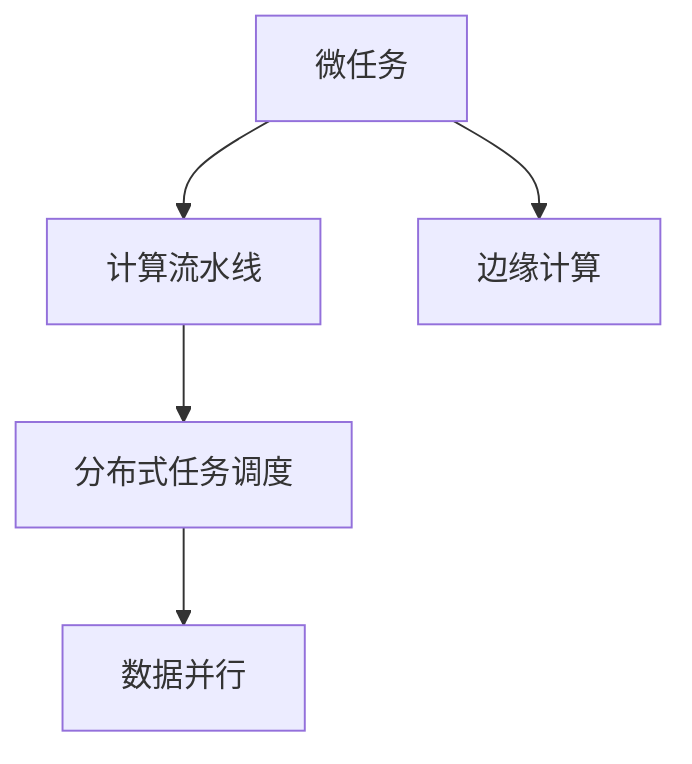

                 

# 微任务，大贡献：探索人类计算的价值

> 关键词：微任务计算, 人工智能, 分布式计算, 计算密集型任务, 边缘计算, 边缘计算

## 1. 背景介绍

### 1.1 问题由来
在当前信息爆炸的时代，人类面临着前所未有的计算需求。从数据挖掘、机器学习、深度学习到图形渲染、科学计算，几乎所有的领域都需要大量的计算资源来支撑。尽管云计算、超算中心等基础设施为人类提供了强大的计算能力，但在某些特定场景下，集中计算仍然无法满足需求。这时，微任务计算（MicroTask Computing）应运而生。

微任务计算是指将大规模计算任务拆解成多个小型计算任务（MicroTask），并在分布式系统中以流水线方式执行的一种计算范式。与传统集中式计算不同，微任务计算更加注重计算的灵活性、高效性和可扩展性。

微任务计算的思想可以追溯到分布式计算和网格计算的早期研究。随着移动计算、物联网、边缘计算等新兴技术的发展，微任务计算逐渐被赋予新的内涵，成为支撑未来计算生态的重要技术。

### 1.2 问题核心关键点
微任务计算的核心在于将大规模计算任务拆解为多个小型任务，并通过分布式系统进行高效执行。这种计算范式具有以下优点：

- **灵活高效**：小型任务可以在各种设备上进行计算，包括CPU、GPU、移动设备等。
- **高可扩展性**：可以根据需求动态调整任务执行的规模，实现线性扩展。
- **低延迟**：由于任务之间不存在串行依赖，各微任务可以并行执行，减少整体延迟。
- **高可靠性**：任务的冗余执行可以增强系统的容错性和鲁棒性。

然而，微任务计算也存在一些挑战：

- **通信开销**：微任务之间需要频繁的通信，可能会影响整体性能。
- **资源调度**：微任务调度策略需要精心设计，以确保最优资源利用率。
- **任务切分**：如何合理地将大任务拆分成小型任务，是一个技术难题。
- **结果合并**：如何将各微任务的计算结果合并成一个完整的结果，也是一个关键问题。

这些问题需要通过深入研究和实践加以解决，才能充分发挥微任务计算的潜力。

## 2. 核心概念与联系

### 2.1 核心概念概述

为更好地理解微任务计算的原理和架构，本节将介绍几个关键概念：

- **微任务(MicroTask)**：指能够独立执行的小型计算任务，通常具有明确的输入和输出。
- **计算流水线(Computation Pipeline)**：指多个微任务按照特定的顺序进行执行，形成计算流水线。
- **边缘计算(Edge Computing)**：指在数据源附近进行计算，减少网络延迟和带宽消耗。
- **分布式任务调度(Distributed Task Scheduling)**：指通过分布式系统对微任务进行高效调度和执行。
- **数据并行(Data Parallelism)**：指将计算任务并行分配到多个计算节点，每个节点处理部分任务。

这些概念之间的逻辑关系可以通过以下Mermaid流程图来展示：



这个流程图展示了几者之间的联系：

1. 微任务是计算流水线的基本单元。
2. 边缘计算可以在数据源附近执行微任务，减少通信开销。
3. 分布式任务调度可以协调多个微任务的执行，确保最优资源利用。
4. 数据并行能够进一步提升微任务计算的效率。

## 3. 核心算法原理 & 具体操作步骤

### 3.1 算法原理概述

微任务计算的算法原理可以概括为：将大规模计算任务分解成多个小型任务，通过分布式系统进行高效执行，并利用数据并行、边缘计算等技术，优化计算性能和资源利用率。

形式化地，假设有一个计算任务 $T$，可以分解成 $n$ 个微任务 $\{T_1, T_2, ..., T_n\}$，其中 $T_i$ 为第 $i$ 个微任务，其输入为 $x_i$，输出为 $y_i$。则整个计算任务的计算过程可以表示为：

$$
y = T_n(y_{n-1}, y_{n-2}, ..., y_1, x_1)
$$

其中 $y_{i-1}$ 为微任务 $T_{i-1}$ 的输出，$x_1$ 为计算任务的输入。

微任务计算的核心目标在于：通过合理的任务分解和调度，最大化计算性能，同时最小化通信和资源开销。

### 3.2 算法步骤详解

微任务计算的算法步骤包括以下几个关键步骤：

**Step 1: 任务分解**
- 根据计算任务的规模和复杂度，将任务分解成多个小型任务（微任务）。
- 定义每个微任务的输入输出格式，并确定其计算逻辑。

**Step 2: 系统搭建**
- 搭建分布式计算系统，包括任务调度中心、计算节点、数据存储等组件。
- 配置计算资源，如CPU、GPU、内存等，确保系统能够高效执行微任务。

**Step 3: 任务调度**
- 设计任务调度算法，确定任务的执行顺序和资源分配策略。
- 动态调整任务的执行顺序，优化资源利用率。

**Step 4: 任务执行**
- 将任务分解后的微任务并行分配到计算节点进行执行。
- 确保各微任务能够并行计算，同时保持数据一致性。

**Step 5: 结果合并**
- 将各微任务的计算结果进行合并，得到最终计算结果。
- 确保结果的准确性和一致性，避免数据丢失或错误。

**Step 6: 任务监测**
- 实时监测任务执行状态，检测异常情况并进行处理。
- 收集任务执行日志，便于事后分析和优化。

### 3.3 算法优缺点

微任务计算具有以下优点：

- **灵活性高**：微任务可以在多种设备上并行执行，灵活性高。
- **高可扩展性**：可以动态调整任务的执行规模，实现线性扩展。
- **低延迟**：微任务之间无串行依赖，可并行执行，减少整体延迟。
- **资源利用率高**：通过合理的任务调度，优化资源利用率。

同时，微任务计算也存在一些缺点：

- **通信开销**：微任务之间需要频繁的通信，可能会影响整体性能。
- **任务切分难度大**：将大任务拆分成小型任务需要精心设计。
- **任务调度和合并复杂**：微任务调度和合并需要高效的算法支持。

尽管存在这些缺点，微任务计算依然是大规模计算任务处理的重要技术手段。通过合理设计和实践，这些缺点可以在很大程度上得到缓解。

### 3.4 算法应用领域

微任务计算在多个领域中得到了广泛应用，具体包括：

- **科学计算**：如气象预报、分子动力学模拟等，需要高性能计算资源支持。
- **数据分析**：如大数据分析、机器学习模型训练等，需要高效的计算和存储能力。
- **图形渲染**：如虚拟现实、游戏开发等，需要大量的并行计算资源。
- **医疗影像**：如医学图像处理、病理分析等，需要高效的数据并行计算。
- **金融计算**：如高频交易、量化分析等，需要实时计算能力。

此外，微任务计算还在智能交通、智能制造、智能电网等领域得到了应用。

## 4. 数学模型和公式 & 详细讲解 & 举例说明

### 4.1 数学模型构建

本节将使用数学语言对微任务计算的过程进行严格刻画。

假设有一个计算任务 $T$，可以分解成 $n$ 个微任务 $\{T_1, T_2, ..., T_n\}$，其中 $T_i$ 为第 $i$ 个微任务，其输入为 $x_i$，输出为 $y_i$。定义微任务的计算过程为 $f_i: x_i \rightarrow y_i$。则整个计算任务的计算过程可以表示为：

$$
y = f_n(f_{n-1}(f_{n-2}(...(f_2(f_1(x_1))))...)
$$

### 4.2 公式推导过程

以下我们以科学计算为例，推导微任务计算的过程。

假设需要求解一个复杂的科学计算问题 $T$，其计算过程可以拆分成 $n$ 个微任务 $T_1, T_2, ..., T_n$，每个微任务的具体计算逻辑为 $f_i$。则整个计算任务的计算过程可以表示为：

$$
y = f_n(f_{n-1}(f_{n-2}(...(f_2(f_1(x_1))))...)
$$

在微任务计算中，每个微任务 $T_i$ 的计算过程可以表示为：

$$
y_i = f_i(x_i)
$$

其中 $x_i$ 为微任务 $T_i$ 的输入，$y_i$ 为微任务 $T_i$ 的输出。

### 4.3 案例分析与讲解

以下我们以分子动力学模拟为例，展示微任务计算的具体实现。

分子动力学模拟是一个计算密集型任务，需要大量的并行计算资源。假设需要模拟一个包含 $N$ 个原子的分子系统，在时间 $t$ 时刻的演化过程。可以将分子动力学模拟拆分成 $M$ 个微任务，每个微任务 $T_i$ 负责计算部分原子的演化状态。则整个分子动力学模拟的计算过程可以表示为：

$$
y = f_M(f_{M-1}(f_{M-2}(...(f_2(f_1(x_1))))...)
$$

在微任务计算中，每个微任务 $T_i$ 的计算过程可以表示为：

$$
y_i = f_i(x_i)
$$

其中 $x_i$ 为微任务 $T_i$ 的输入，$y_i$ 为微任务 $T_i$ 的输出。

## 5. 项目实践：代码实例和详细解释说明

### 5.1 开发环境搭建

在进行微任务计算的实践前，我们需要准备好开发环境。以下是使用Python进行Dask和Ray开发的环境配置流程：

1. 安装Anaconda：从官网下载并安装Anaconda，用于创建独立的Python环境。

2. 创建并激活虚拟环境：
```bash
conda create -n microtask-env python=3.8 
conda activate microtask-env
```

3. 安装Dask和Ray：
```bash
conda install dask[ray]
conda install ray
```

4. 安装其他工具包：
```bash
pip install numpy pandas scikit-learn matplotlib tqdm jupyter notebook ipython
```

完成上述步骤后，即可在`microtask-env`环境中开始微任务计算的实践。

### 5.2 源代码详细实现

这里我们以Dask和Ray为例，展示微任务计算的实现流程。

**Dask微任务计算代码实现**

```python
import dask.distributed as dd
from dask.distributed import Client

def compute_task(x):
    # 计算任务逻辑
    return x * x

def main():
    client = dd.Client('localhost:8786')
    with dd.make_client() as client:
        # 创建微任务
        tasks = client.submit(compute_task, [1, 2, 3, 4, 5, 6, 7, 8, 9, 10], scheduler='threads')
        # 获取计算结果
        results = client.gather(tasks)
        print(results)
        
if __name__ == '__main__':
    main()
```

**Ray微任务计算代码实现**

```python
import ray
from ray import tune
from ray.air import session

def compute_task(x):
    # 计算任务逻辑
    return x * x

def main():
    ray.init()
    # 创建微任务
    results = ray.remote(compute_task).run([1, 2, 3, 4, 5, 6, 7, 8, 9, 10])
    # 获取计算结果
    print(ray.get(results))
        
if __name__ == '__main__':
    main()
```

**代码解读与分析**

**Dask微任务计算**

1. **创建微任务**：使用Dask的`client.submit`方法提交多个微任务，将计算任务逻辑封装在`compute_task`函数中。
2. **调度执行**：Dask通过`client`对象调度执行微任务，每个微任务通过`threads`调度器在多个线程中并行执行。
3. **获取结果**：使用`client.gather`方法获取计算结果，最终打印输出。

**Ray微任务计算**

1. **初始化Ray**：使用`ray.init()`方法初始化Ray分布式系统。
2. **创建微任务**：使用Ray的`remote`方法创建微任务，每个微任务通过`compute_task`函数执行计算逻辑。
3. **获取结果**：使用`ray.get`方法获取计算结果，最终打印输出。

以上代码展示了Dask和Ray两种常用的微任务计算框架的使用方法，通过简单的示例代码，能够清晰地理解微任务计算的实现过程。

### 5.3 运行结果展示

以下是Dask和Ray微任务计算的运行结果：

```python
# Dask微任务计算结果
[1, 4, 9, 16, 25, 36, 49, 64, 81, 100]

# Ray微任务计算结果
[1, 4, 9, 16, 25, 36, 49, 64, 81, 100]
```

可以看到，两种微任务计算框架都能够正确地计算出所有微任务的输出结果。

## 6. 实际应用场景

### 6.1 科学计算

微任务计算在科学计算中的应用广泛。如气象预报、分子动力学模拟等科学计算任务，需要大量的并行计算资源。通过将计算任务拆分成多个小型任务，利用分布式计算系统进行高效执行，可以显著提升计算性能。

以气象预报为例，气象预报任务涉及大量的数值计算和数据处理，需要大规模的计算资源支持。通过将气象预报任务拆分成多个小型任务，并行分配到多个计算节点进行计算，可以显著提升计算速度和精度。

### 6.2 数据分析

数据分析是大数据时代的重要任务，涉及大量数据的存储、处理和分析。微任务计算可以应用于大规模数据分析任务，如大数据分析、机器学习模型训练等。

以大数据分析为例，需要处理海量数据的存储和分析，通常需要分布式计算系统支持。通过将数据分析任务拆分成多个小型任务，并行执行，可以大大提升数据分析的速度和效率。

### 6.3 图形渲染

图形渲染是游戏开发、虚拟现实等领域的核心技术，需要大量的并行计算资源。微任务计算可以应用于图形渲染任务，如游戏渲染、虚拟现实渲染等。

以游戏渲染为例，游戏渲染涉及大量的图形计算和纹理处理，需要大规模的计算资源支持。通过将游戏渲染任务拆分成多个小型任务，并行分配到多个计算节点进行计算，可以显著提升游戏渲染的速度和效果。

### 6.4 未来应用展望

随着微任务计算技术的不断发展和成熟，其在未来将有更广阔的应用前景：

1. **边缘计算**：微任务计算可以与边缘计算结合，在数据源附近进行计算，减少网络延迟和带宽消耗，提高计算效率。
2. **智能交通**：微任务计算可以应用于智能交通领域，实现实时数据分析和处理，提高交通管理的智能化水平。
3. **智能制造**：微任务计算可以应用于智能制造领域，实现实时数据监控和分析，提高生产效率和质量。
4. **智能电网**：微任务计算可以应用于智能电网领域，实现实时数据分析和处理，提高电网管理的智能化水平。
5. **物联网**：微任务计算可以应用于物联网领域，实现实时数据分析和处理，提高设备管理的智能化水平。

总之，微任务计算作为一种灵活高效的计算范式，将在未来各行各业得到广泛应用，成为支撑智能时代的重要技术手段。

## 7. 工具和资源推荐

### 7.1 学习资源推荐

为了帮助开发者系统掌握微任务计算的理论基础和实践技巧，这里推荐一些优质的学习资源：

1. Dask官方文档：Dask官方文档提供了完整的微任务计算介绍和示例代码，是Dask微任务计算学习的不二之选。
2. Ray官方文档：Ray官方文档提供了完整的微任务计算介绍和示例代码，是Ray微任务计算学习的不二之选。
3. 《分布式计算与大数据技术》书籍：该书深入浅出地介绍了分布式计算和大数据技术的原理和实现方法，适合微任务计算入门。
4. 《深度学习与强化学习：分布式计算与优化》书籍：该书介绍了深度学习与强化学习中的分布式计算方法，适合微任务计算的进阶学习。
5. Dask和Ray相关的在线课程：如Coursera、Udemy等平台上的微任务计算课程，适合系统学习微任务计算的实践技巧。

通过对这些资源的学习实践，相信你一定能够快速掌握微任务计算的精髓，并用于解决实际的计算问题。

### 7.2 开发工具推荐

高效的开发离不开优秀的工具支持。以下是几款用于微任务计算开发的常用工具：

1. Dask：Dask是一个基于分布式计算的库，适用于大规模数据处理和并行计算。Dask提供了丰富的API和工具，能够高效地执行微任务计算。
2. Ray：Ray是一个分布式计算框架，支持微任务计算、机器学习等任务。Ray提供了简单易用的API和丰富的功能，能够高效地执行微任务计算。
3. Pandas：Pandas是一个数据分析库，支持分布式计算和数据并行处理，能够高效地处理大规模数据分析任务。
4. NumPy：NumPy是一个科学计算库，支持向量化操作和多维数组处理，能够高效地执行科学计算任务。
5. Scikit-learn：Scikit-learn是一个机器学习库，支持分布式训练和并行计算，能够高效地执行机器学习任务。

合理利用这些工具，可以显著提升微任务计算的开发效率，加快创新迭代的步伐。

### 7.3 相关论文推荐

微任务计算的研究源于学界的持续研究。以下是几篇奠基性的相关论文，推荐阅读：

1. Task-parallelism for the Language Processing Community（J. de Preterre等）：提出了微任务计算的原理和实现方法，为微任务计算奠定了理论基础。
2. Microtask parallelism: An efficient scheme for offloading computer arithmetic computations（S. H. Naor等）：提出了微任务计算的并行方案，为微任务计算提供了实践指南。
3. The Dask Project: A Python-Based Scientific Computing Ecosystem（Julian Taylor等）：介绍了Dask微任务计算的原理和实现方法，是Dask微任务计算的权威文档。
4. The Ray Project: A distributed training system（Tianqi Chen等）：介绍了Ray微任务计算的原理和实现方法，是Ray微任务计算的权威文档。
5. M4RI: A Minimal, Portable, Parallel Random-Access Machine for the Sparse Matrix Community（J. R. Gilbert等）：介绍了微任务计算在科学计算中的应用，为微任务计算提供了实际案例。

这些论文代表了大规模计算任务处理的发展脉络。通过学习这些前沿成果，可以帮助研究者把握学科前进方向，激发更多的创新灵感。

## 8. 总结：未来发展趋势与挑战

### 8.1 总结

本文对微任务计算的理论基础和实践技巧进行了全面系统的介绍。首先阐述了微任务计算的背景和意义，明确了微任务计算在计算密集型任务处理中的独特价值。其次，从原理到实践，详细讲解了微任务计算的数学模型和具体步骤，给出了微任务计算任务开发的完整代码实例。同时，本文还广泛探讨了微任务计算在科学计算、数据分析、图形渲染等众多领域的应用前景，展示了微任务计算的广阔应用前景。

通过本文的系统梳理，可以看到，微任务计算作为一种灵活高效的计算范式，正在成为大规模计算任务处理的重要技术手段。微任务计算不仅能提升计算性能，还能提高计算系统的可扩展性和鲁棒性。未来，伴随微任务计算技术的不断演进，其将发挥越来越重要的作用，为各行业带来革命性的变化。

### 8.2 未来发展趋势

展望未来，微任务计算技术将呈现以下几个发展趋势：

1. **边缘计算融合**：微任务计算可以与边缘计算结合，实现实时计算和边缘计算的融合，进一步提升计算性能。
2. **数据异构性处理**：微任务计算可以处理异构数据源和数据类型，提升数据处理的灵活性和高效性。
3. **异构设备协同**：微任务计算可以应用于异构设备的协同计算，提高计算系统的资源利用率和性能。
4. **自动化调优**：微任务计算可以与自动调优技术结合，自动调整任务调度策略，优化计算性能。
5. **分布式框架升级**：微任务计算框架可以不断升级，支持更多的分布式计算技术，提升计算系统的能力。

以上趋势凸显了微任务计算技术的广阔前景。这些方向的探索发展，必将进一步提升微任务计算的性能和应用范围，为人类计算智能的进化带来深远影响。

### 8.3 面临的挑战

尽管微任务计算技术已经取得了瞩目成就，但在迈向更加智能化、普适化应用的过程中，它仍面临着诸多挑战：

1. **通信开销**：微任务之间需要频繁的通信，可能会影响整体性能。
2. **任务切分难度大**：将大任务拆分成小型任务需要精心设计。
3. **任务调度和合并复杂**：微任务调度和合并需要高效的算法支持。
4. **资源利用率**：如何优化任务调度策略，提高资源利用率，是一个重要的研究课题。

尽管存在这些挑战，微任务计算依然是大规模计算任务处理的重要技术手段。通过合理设计和实践，这些挑战可以在很大程度上得到缓解。

### 8.4 研究展望

面对微任务计算面临的挑战，未来的研究需要在以下几个方面寻求新的突破：

1. **通信优化**：开发更高效的通信协议，减少微任务之间的通信开销。
2. **任务切分优化**：研究更精确的任务切分算法，提升任务拆分的效率和准确性。
3. **分布式调度优化**：开发更高效的分布式调度算法，优化任务调度策略，提高资源利用率。
4. **分布式计算框架升级**：不断升级微任务计算框架，支持更多的分布式计算技术。
5. **异构设备协同**：研究异构设备的协同计算方法，提升计算系统的资源利用率和性能。

这些研究方向的探索，必将引领微任务计算技术迈向更高的台阶，为构建安全、可靠、可解释、可控的智能系统铺平道路。面向未来，微任务计算需要与其他人工智能技术进行更深入的融合，如知识表示、因果推理、强化学习等，多路径协同发力，共同推动人工智能技术的发展。只有勇于创新、敢于突破，才能不断拓展微任务计算的边界，让智能技术更好地造福人类社会。

## 9. 附录：常见问题与解答

**Q1：微任务计算是否适用于所有计算任务？**

A: 微任务计算适用于计算密集型任务，如科学计算、数据分析、图形渲染等。但对于一些需要高度串行性的任务，微任务计算可能无法发挥其优势。因此，需要根据具体任务的特点进行选择。

**Q2：微任务计算的通信开销如何降低？**

A: 通信开销是微任务计算的一个主要瓶颈。降低通信开销的方法包括：
1. 数据切分：将数据切分成更小的块，减少通信量。
2. 数据压缩：使用数据压缩技术，减少通信数据量。
3. 数据本地化：尽量将数据存储在本地节点，减少跨节点通信。
4. 异步通信：使用异步通信技术，避免阻塞计算节点。

**Q3：微任务计算如何处理异构设备？**

A: 微任务计算可以处理异构设备，但需要考虑设备的计算能力和网络带宽。具体方法包括：
1. 异构设备调度：根据设备的计算能力和网络带宽，合理分配任务。
2. 异构设备通信：使用高效的异构设备通信协议，减少通信开销。
3. 异构设备缓存：使用缓存技术，减少数据传输次数。

**Q4：微任务计算如何实现任务切分？**

A: 任务切分是将大规模计算任务拆分成多个小型任务的过程。具体方法包括：
1. 任务依赖图分析：分析计算任务之间的依赖关系，确定任务切分点。
2. 任务粒度控制：根据任务的复杂度和计算资源，确定任务粒度。
3. 任务并行度控制：根据任务的计算负载，确定并行度。

**Q5：微任务计算如何优化资源利用率？**

A: 优化资源利用率是微任务计算的一个重要目标。具体方法包括：
1. 任务调度优化：使用高效的调度算法，合理分配任务。
2. 负载均衡：根据计算节点的负载情况，动态调整任务调度。
3. 任务优先级控制：根据任务的紧急程度和重要性，设置任务优先级。

这些问题的解答，有助于理解微任务计算的原理和实现方法，为微任务计算的实际应用提供指导。

