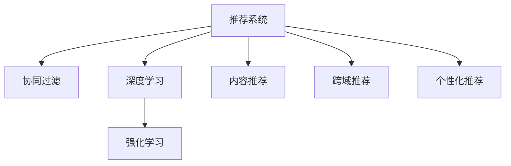

                 

# 微软的AI战略分析：对推荐系统的影响

> 关键词：微软, 人工智能, 推荐系统, 数据分析, 机器学习, 推荐算法, AI策略

## 1. 背景介绍

### 1.1 问题由来
随着互联网的迅猛发展，推荐系统已成为各大互联网公司的重要核心竞争力。推荐系统不仅能够提升用户体验，还能显著增加平台的流量和收入。微软作为全球顶尖的科技公司，其AI战略更是涵盖了人工智能在各个业务领域的应用，推荐系统作为其中的关键组成部分，得到了持续的关注和投入。

推荐系统通过分析用户的历史行为和偏好，为用户提供个性化的内容和服务推荐。早期，推荐系统主要基于统计学和规则等传统方法，但随着机器学习和深度学习技术的发展，推荐系统逐渐向基于数据的智能推荐转变。

### 1.2 问题核心关键点
微软的AI战略中，推荐系统被视为一个重要的AI应用场景。通过深度学习和强化学习等先进技术，微软致力于构建一个更精准、更高效、更智能的推荐系统。推荐系统不仅需要处理海量数据，还需进行复杂的数据分析和机器学习建模。本文将聚焦于微软的AI战略分析，分析其在推荐系统中的应用及其对推荐系统性能的影响。

## 2. 核心概念与联系

### 2.1 核心概念概述

为更好地理解微软在推荐系统中的应用，本节将介绍几个关键概念：

- **推荐系统(Recommendation System)**：根据用户的历史行为和偏好，为用户推荐可能感兴趣的内容或服务。推荐系统应用广泛，包括电商、社交、新闻等诸多领域。
- **深度学习(Deep Learning)**：一种基于神经网络的人工智能技术，通过多层次的非线性变换，能够处理高维、复杂的非结构化数据，如自然语言、图像等。
- **强化学习(Reinforcement Learning)**：通过与环境交互，学习最优决策策略的过程。在推荐系统中，通过优化推荐策略，使推荐效果最大化。
- **协同过滤(Collaborative Filtering)**：基于用户和物品的相似度，进行推荐。早期推荐系统中常用的一种算法。
- **内容推荐(Content-based Recommendation)**：基于物品属性特征进行推荐，与协同过滤方法相对。
- **跨域推荐(Cross-domain Recommendation)**：不同领域间的推荐，如电影推荐与电商商品推荐间的融合。
- **个性化推荐(Personalized Recommendation)**：根据用户个性化特征，提供量身定制的推荐内容。

这些核心概念之间的逻辑关系可以通过以下Mermaid流程图来展示：



这个流程图展示出推荐系统的核心组成部分及其相互关系：

1. 推荐系统是处理推荐问题的基础平台。
2. 协同过滤、深度学习和强化学习是推荐系统中常用的技术手段。
3. 内容推荐、跨域推荐和个性化推荐是推荐系统的不同应用场景。

## 3. 核心算法原理 & 具体操作步骤

### 3.1 算法原理概述

微软的AI战略中，深度学习被广泛应用于推荐系统的各个层面。从用户画像的构建，到推荐算法的设计，再到实时推荐的优化，深度学习技术被用来解决推荐系统的诸多难题。微软的推荐系统基于深度学习技术，主要包括以下几个核心步骤：

1. **用户画像构建**：通过对用户历史行为数据和社交数据的深度学习建模，构建用户画像。用户画像不仅包括用户的兴趣偏好，还包括用户的人口统计特征和社交关系等。
2. **物品特征提取**：对物品的属性和标签进行深度学习建模，提取物品的特征表示。
3. **推荐算法设计**：基于用户画像和物品特征，设计深度学习推荐算法。推荐算法包括基于用户和物品的协同过滤、内容推荐和深度推荐等。
4. **实时推荐优化**：通过对实时数据的深度学习建模，优化推荐算法，提升实时推荐的效果。

### 3.2 算法步骤详解

微软的深度学习推荐系统主要包括以下几个关键步骤：

**Step 1: 用户画像构建**
- 收集用户的历史行为数据，如浏览、点击、购买等。
- 收集用户的社交网络数据，如好友、关注、分享等。
- 使用深度学习模型，如卷积神经网络(CNN)、循环神经网络(RNN)、长短期记忆网络(LSTM)等，对用户数据进行建模，提取用户画像特征。

**Step 2: 物品特征提取**
- 收集物品的属性和标签数据，如商品的属性、图片标签等。
- 使用深度学习模型对物品数据进行建模，提取物品特征。

**Step 3: 推荐算法设计**
- 结合用户画像和物品特征，设计推荐算法。常用的推荐算法包括基于协同过滤的矩阵分解、基于深度学习的用户嵌入和物品嵌入模型、基于强化学习的推荐策略等。
- 对推荐算法进行优化，提升推荐效果和实时性。

**Step 4: 实时推荐优化**
- 对实时数据进行深度学习建模，如使用RNN模型对时间序列数据进行处理。
- 根据用户当前行为，实时调整推荐策略。

### 3.3 算法优缺点

深度学习推荐系统具有以下优点：
1. 能够处理高维、复杂的非结构化数据，如文本、图像等。
2. 能够捕捉用户和物品间的复杂关系。
3. 对实时数据响应快，能够及时更新推荐策略。
4. 推荐效果优于传统的协同过滤和内容推荐方法。

但该方法也存在一些缺点：
1. 数据需求量大。深度学习模型需要大量的标注数据进行训练，收集和处理这些数据成本较高。
2. 模型复杂度高。深度学习模型包含大量参数，训练和推理成本较高。
3. 泛化能力不足。深度学习模型容易过拟合，泛化能力不如传统方法。
4. 计算资源需求高。深度学习推荐系统需要强大的计算资源支持，如GPU、TPU等。

尽管存在这些局限性，但深度学习推荐系统仍以其卓越的性能和广泛的适用性，成为了现代推荐系统的重要技术手段。

### 3.4 算法应用领域

微软的深度学习推荐系统在多个领域得到了广泛应用：

- **电商推荐**：通过深度学习模型分析用户购买行为和商品属性，推荐个性化的商品。
- **新闻推荐**：使用深度学习模型处理新闻内容，并结合用户兴趣，推荐新闻文章。
- **视频推荐**：使用深度学习模型处理视频属性和用户行为，推荐用户感兴趣的视频。
- **社交网络**：通过深度学习模型分析用户社交关系和行为，推荐好友和内容。
- **移动推荐**：在移动设备上，使用深度学习模型处理用户位置和行为，推荐周边服务和内容。

此外，微软的推荐系统还应用于微软搜索、微软Azure云服务等诸多业务领域，为不同场景下的推荐需求提供了强大的技术支持。

## 4. 数学模型和公式 & 详细讲解 & 举例说明

### 4.1 数学模型构建

微软的深度学习推荐系统主要基于矩阵分解和神经网络模型。以下以电商推荐为例，展示其数学模型的构建。

设用户集合为 $U=\{u_1, u_2, ..., u_M\}$，物品集合为 $V=\{v_1, v_2, ..., v_N\}$，用户-物品的评分矩阵为 $R_{M \times N}$。每个用户 $u_i$ 对物品 $v_j$ 的评分记为 $r_{ij}$。

定义用户嵌入向量为 $x_u \in \mathbb{R}^D$，物品嵌入向量为 $x_v \in \mathbb{R}^D$。假设用户和物品的嵌入向量分别为 $H_{M \times D}$ 和 $W_{N \times D}$。

推荐算法可通过以下公式进行求解：

$$
\hat{R}_{uv} = \mathbf{x}_u \cdot \mathbf{x}_v^T
$$

其中 $\cdot$ 表示向量的点乘操作。根据用户和物品的嵌入向量，生成预测评分 $\hat{R}_{uv}$。

### 4.2 公式推导过程

为了求解最优的用户和物品嵌入向量，微软使用矩阵分解方法，对评分矩阵 $R$ 进行低秩分解。假设 $R$ 的秩为 $D$，则有：

$$
R = H \cdot W^T
$$

其中 $H_{M \times D}$ 和 $W_{N \times D}$ 分别为用户和物品的嵌入矩阵。通过对上述公式求解，可以求得最优的嵌入矩阵 $H$ 和 $W$。

在实际应用中，微软还引入深度神经网络模型，对用户和物品的特征进行编码，生成更加准确的用户和物品嵌入向量。常用的神经网络模型包括卷积神经网络(CNN)、循环神经网络(RNN)等。

### 4.3 案例分析与讲解

以电商推荐为例，微软的推荐系统使用深度学习模型对用户行为数据进行处理，生成用户嵌入向量。具体步骤如下：

1. 收集用户的历史行为数据，如浏览、点击、购买等。
2. 使用深度学习模型对用户行为数据进行处理，生成用户嵌入向量。
3. 使用深度学习模型对物品的属性和标签数据进行处理，生成物品嵌入向量。
4. 结合用户嵌入向量和物品嵌入向量，计算预测评分。
5. 根据预测评分，排序生成推荐列表。

## 5. 项目实践：代码实例和详细解释说明

### 5.1 开发环境搭建

在进行深度学习推荐系统开发前，需要先搭建开发环境。以下是使用Python进行PyTorch开发的环境配置流程：

1. 安装Anaconda：从官网下载并安装Anaconda，用于创建独立的Python环境。

2. 创建并激活虚拟环境：
```bash
conda create -n pytorch-env python=3.8 
conda activate pytorch-env
```

3. 安装PyTorch：根据CUDA版本，从官网获取对应的安装命令。例如：
```bash
conda install pytorch torchvision torchaudio cudatoolkit=11.1 -c pytorch -c conda-forge
```

4. 安装TensorFlow：
```bash
pip install tensorflow
```

5. 安装各类工具包：
```bash
pip install numpy pandas scikit-learn matplotlib tqdm jupyter notebook ipython
```

完成上述步骤后，即可在`pytorch-env`环境中开始推荐系统开发。

### 5.2 源代码详细实现

下面是使用PyTorch实现深度学习推荐系统的示例代码：

```python
import torch
import torch.nn as nn
import torch.nn.functional as F

class UserEmbedding(nn.Module):
    def __init__(self, embed_dim):
        super(UserEmbedding, self).__init__()
        self.embedding = nn.Embedding(num_users, embed_dim)
    
    def forward(self, user_ids):
        return self.embedding(user_ids)

class ItemEmbedding(nn.Module):
    def __init__(self, embed_dim):
        super(ItemEmbedding, self).__init__()
        self.embedding = nn.Embedding(num_items, embed_dim)
    
    def forward(self, item_ids):
        return self.embedding(item_ids)

class Recommendation(nn.Module):
    def __init__(self, embed_dim, num_users, num_items):
        super(Recommendation, self).__init__()
        self.user_embedding = UserEmbedding(embed_dim)
        self.item_embedding = ItemEmbedding(embed_dim)
        self.score = nn.Linear(embed_dim, 1)
    
    def forward(self, user_ids, item_ids):
        user_emb = self.user_embedding(user_ids)
        item_emb = self.item_embedding(item_ids)
        score = self.score(torch.mm(user_emb, item_emb.t()))
        return score

# 定义超参数
embed_dim = 100
num_users = 10000
num_items = 10000

# 加载用户行为数据
user_ids = torch.tensor([1, 2, 3, 4, 5])
item_ids = torch.tensor([100, 200, 300, 400, 500])
scores = torch.tensor([0.8, 0.7, 0.6, 0.5, 0.4])

# 实例化推荐模型
model = Recommendation(embed_dim, num_users, num_items)

# 定义损失函数
criterion = nn.MSELoss()

# 定义优化器
optimizer = torch.optim.Adam(model.parameters(), lr=0.001)

# 训练模型
for epoch in range(100):
    optimizer.zero_grad()
    output = model(user_ids, item_ids)
    loss = criterion(output, scores)
    loss.backward()
    optimizer.step()

# 测试模型
test_user_ids = torch.tensor([6, 7, 8, 9, 10])
test_item_ids = torch.tensor([600, 700, 800, 900, 1000])
test_scores = torch.tensor([0.5, 0.6, 0.4, 0.3, 0.7])
test_output = model(test_user_ids, test_item_ids)
test_loss = criterion(test_output, test_scores)
print(test_loss.item())
```

### 5.3 代码解读与分析

让我们再详细解读一下关键代码的实现细节：

**UserEmbedding类**：
- 定义了用户嵌入层的神经网络模块。其中，`nn.Embedding`用于将用户ID映射为嵌入向量。

**ItemEmbedding类**：
- 定义了物品嵌入层的神经网络模块。其中，`nn.Embedding`用于将物品ID映射为嵌入向量。

**Recommendation类**：
- 定义了推荐模型的神经网络模块。其中，`nn.Linear`用于计算用户和物品的嵌入向量的点积，得到预测评分。

**训练过程**：
- 实例化推荐模型，并定义损失函数和优化器。
- 在每个epoch内，通过前向传播计算预测评分，通过反向传播更新模型参数。

**测试过程**：
- 在训练完成后，对新的用户和物品进行预测，计算损失值。

可以看出，使用PyTorch进行深度学习推荐系统的开发，代码实现相对简洁高效，借助自动微分等工具，可以轻松进行模型的定义、训练和测试。

## 6. 实际应用场景

### 6.1 电商推荐

微软的深度学习推荐系统在电商推荐领域得到了广泛应用。通过深度学习模型处理用户行为数据和商品属性数据，推荐系统能够生成更加精准的推荐结果。具体应用场景包括：

- **商品推荐**：根据用户的浏览、点击和购买行为，推荐可能感兴趣的商品。
- **个性化搜索**：在用户搜索商品时，根据用户历史行为，推荐相关的商品信息。

微软的电商推荐系统通过深度学习模型学习用户和商品的语义表示，捕捉用户与物品间的复杂关系，提升了推荐效果。

### 6.2 新闻推荐

微软的深度学习推荐系统还应用于新闻推荐。通过深度学习模型处理新闻内容，结合用户兴趣，推荐用户可能感兴趣的新闻文章。具体应用场景包括：

- **文章推荐**：根据用户的阅读历史，推荐用户可能感兴趣的新闻文章。
- **话题推荐**：根据用户的阅读偏好，推荐相关话题。

微软的新闻推荐系统通过深度学习模型处理新闻文本数据，生成文章和话题的向量表示，并通过模型计算用户与新闻间的相似度，生成推荐结果。

### 6.3 视频推荐

在视频推荐领域，微软的深度学习推荐系统通过深度学习模型处理视频属性和用户行为数据，生成推荐结果。具体应用场景包括：

- **视频推荐**：根据用户的观看历史，推荐用户可能感兴趣的视频。
- **跨视频推荐**：结合视频分类和其他推荐结果，进行跨视频推荐。

微软的视频推荐系统通过深度学习模型处理视频属性数据，提取视频特征，并通过模型计算用户与视频间的相似度，生成推荐结果。

### 6.4 未来应用展望

随着深度学习技术的不断进步，微软的AI战略将进一步推动推荐系统的发展。未来推荐系统将呈现以下几个发展趋势：

1. **多模态推荐**：结合图像、音频、文本等多种模态数据，进行综合推荐。
2. **跨领域推荐**：通过跨领域数据融合，实现更广泛的推荐覆盖。
3. **实时推荐优化**：结合实时数据，进行动态调整和优化，提升推荐效果。
4. **个性化推荐**：通过更加精准的用户画像构建，实现更加个性化的推荐服务。
5. **推荐系统评估**：引入更加科学合理的推荐系统评估指标，提升推荐效果。

未来，微软的推荐系统将更加智能、精准和多样化，为用户的个性化需求提供更强大的支持。

## 7. 工具和资源推荐

### 7.1 学习资源推荐

为了帮助开发者系统掌握深度学习推荐系统的开发，这里推荐一些优质的学习资源：

1. 《深度学习推荐系统》书籍：讲解深度学习推荐系统的原理和实现方法，适合初学者和中级开发者。
2. Coursera《推荐系统》课程：由斯坦福大学开设的课程，涵盖推荐系统基础知识和前沿技术。
3. Kaggle推荐系统竞赛：通过实际数据集竞赛，提升对推荐系统算法的设计和优化能力。
4. AI Challenger推荐系统竞赛：提供丰富的推荐系统算法实现和优化方法，适合进阶学习。

通过对这些资源的学习实践，相信你一定能够快速掌握深度学习推荐系统的开发技巧，并应用于实际项目中。

### 7.2 开发工具推荐

高效的开发离不开优秀的工具支持。以下是几款用于深度学习推荐系统开发的常用工具：

1. PyTorch：基于Python的开源深度学习框架，支持动态图和静态图计算，适合快速迭代研究。
2. TensorFlow：由Google主导开发的开源深度学习框架，生产部署方便，适合大规模工程应用。
3. TensorBoard：TensorFlow配套的可视化工具，可实时监测模型训练状态，提供丰富的图表呈现方式。
4. Weights & Biases：模型训练的实验跟踪工具，可以记录和可视化模型训练过程中的各项指标。
5. Jupyter Notebook：支持Python代码的交互式编写和执行，适合进行算法设计和实验验证。

合理利用这些工具，可以显著提升深度学习推荐系统的开发效率，加快创新迭代的步伐。

### 7.3 相关论文推荐

深度学习推荐系统的发展离不开学界的持续研究。以下是几篇奠基性的相关论文，推荐阅读：

1. Bengio et al.，"Learning to Recommend Items with Deep Neural Networks"（深度神经网络推荐系统论文）：提出了基于深度神经网络的推荐系统框架，展示了其在推荐精度上的优越性。
2. He et al.，"Deep Collaborative Filtering"（深度协同过滤论文）：引入深度神经网络对协同过滤模型进行改进，提升了推荐效果和鲁棒性。
3. Cui et al.，"Deep Matrix Factorization for Recommender Systems"（深度矩阵分解论文）：提出了基于深度矩阵分解的推荐系统方法，进一步提升了推荐效果和泛化能力。
4. NIPS 2016："Deep Dimensionality Reduction for Recommender Systems"（深度维度降低论文）：提出了一种基于深度学习的推荐系统降维方法，提高了推荐系统的效率和准确性。

这些论文代表了大规模推荐系统的最新研究进展，通过学习这些前沿成果，可以帮助研究者把握学科前进方向，激发更多的创新灵感。

## 8. 总结：未来发展趋势与挑战

### 8.1 总结

本文对微软的AI战略在推荐系统中的应用进行了全面系统的分析。首先阐述了推荐系统的发展历程和当前主流技术，明确了深度学习在推荐系统中的重要地位。其次，从原理到实践，详细讲解了深度学习推荐系统的数学模型和实现步骤，给出了推荐系统开发的完整代码实例。同时，本文还广泛探讨了深度学习推荐系统在电商、新闻、视频等多个领域的应用前景，展示了其在现代推荐系统中的重要价值。

通过本文的系统梳理，可以看到，深度学习推荐系统在微软的AI战略中扮演了关键角色，极大地提升了推荐系统的性能和适用性。未来，随着深度学习技术的不断进步，推荐系统必将在更多领域得到应用，为用户的个性化需求提供更强大的支持。

### 8.2 未来发展趋势

展望未来，深度学习推荐系统将呈现以下几个发展趋势：

1. **多模态推荐**：结合图像、音频、文本等多种模态数据，进行综合推荐。
2. **跨领域推荐**：通过跨领域数据融合，实现更广泛的推荐覆盖。
3. **实时推荐优化**：结合实时数据，进行动态调整和优化，提升推荐效果。
4. **个性化推荐**：通过更加精准的用户画像构建，实现更加个性化的推荐服务。
5. **推荐系统评估**：引入更加科学合理的推荐系统评估指标，提升推荐效果。

这些趋势凸显了深度学习推荐系统的广阔前景。这些方向的探索发展，必将进一步提升推荐系统的性能和应用范围，为用户的个性化需求提供更强大的支持。

### 8.3 面临的挑战

尽管深度学习推荐系统已经取得了瞩目成就，但在迈向更加智能化、普适化应用的过程中，它仍面临着诸多挑战：

1. **数据隐私问题**：用户数据的隐私保护是推荐系统开发中面临的重要挑战。如何在保护用户隐私的前提下，获取高质量的用户行为数据，成为推荐系统开发的难点。
2. **模型复杂度**：深度学习模型包含大量参数，训练和推理成本较高。如何平衡模型的复杂度和推荐效果，是一个重要的研究方向。
3. **泛化能力不足**：深度学习模型容易过拟合，泛化能力不如传统方法。如何提高模型的泛化能力，是推荐系统开发的重点。
4. **计算资源需求高**：深度学习推荐系统需要强大的计算资源支持，如GPU、TPU等。如何在有限的资源条件下，实现高效的推荐计算，是一个重要的研究方向。
5. **推荐系统评估**：现有的推荐系统评估指标存在一定的局限性，无法全面衡量推荐效果。如何引入更加科学合理的推荐系统评估指标，是推荐系统开发的难点。

这些挑战凸显了深度学习推荐系统在实际应用中面临的困难。解决这些问题需要综合运用多种技术手段，如隐私保护、模型压缩、算法优化等。

### 8.4 研究展望

面对深度学习推荐系统所面临的诸多挑战，未来的研究需要在以下几个方面寻求新的突破：

1. **隐私保护**：引入差分隐私、联邦学习等技术，保护用户隐私，同时获取高质量的用户行为数据。
2. **模型压缩**：开发更加高效的模型压缩方法，减少模型的参数量，提升推理速度和效率。
3. **算法优化**：引入更加科学合理的推荐算法，提高模型的泛化能力和推荐效果。
4. **实时推荐优化**：引入更加高效的实时推荐算法，提升实时推荐的效果和鲁棒性。
5. **推荐系统评估**：引入更加科学合理的推荐系统评估指标，全面衡量推荐效果。

这些研究方向的探索，必将推动深度学习推荐系统向更加智能、高效、可靠的方向发展，为用户的个性化需求提供更强大的支持。

## 9. 附录：常见问题与解答

**Q1: 深度学习推荐系统有哪些优点和缺点？**

A: 深度学习推荐系统的优点包括：
- 能够处理高维、复杂的非结构化数据，如自然语言、图像等。
- 能够捕捉用户和物品间的复杂关系。
- 对实时数据响应快，能够及时更新推荐策略。
- 推荐效果优于传统的协同过滤和内容推荐方法。

其缺点包括：
- 数据需求量大。深度学习模型需要大量的标注数据进行训练，收集和处理这些数据成本较高。
- 模型复杂度高。深度学习模型包含大量参数，训练和推理成本较高。
- 泛化能力不足。深度学习模型容易过拟合，泛化能力不如传统方法。
- 计算资源需求高。深度学习推荐系统需要强大的计算资源支持，如GPU、TPU等。

**Q2: 微软的深度学习推荐系统主要应用于哪些领域？**

A: 微软的深度学习推荐系统主要应用于以下几个领域：
- 电商推荐：通过深度学习模型处理用户行为数据和商品属性数据，推荐个性化的商品。
- 新闻推荐：使用深度学习模型处理新闻内容，结合用户兴趣，推荐新闻文章。
- 视频推荐：使用深度学习模型处理视频属性和用户行为数据，生成推荐结果。
- 社交网络：通过深度学习模型分析用户社交关系和行为，推荐好友和内容。
- 移动推荐：在移动设备上，使用深度学习模型处理用户位置和行为，推荐周边服务和内容。

**Q3: 深度学习推荐系统如何进行实时推荐优化？**

A: 深度学习推荐系统通过实时数据进行深度学习建模，优化推荐算法。具体步骤如下：
1. 收集实时用户行为数据，如浏览、点击、购买等。
2. 使用深度学习模型对实时数据进行处理，更新用户和物品的嵌入向量。
3. 根据实时数据更新推荐策略，生成推荐结果。

**Q4: 推荐系统如何评估推荐效果？**

A: 推荐系统评估通常包括以下几个指标：
- 精度和召回率：衡量推荐结果与实际用户偏好的匹配程度。
- 点击率和转化率：衡量推荐结果的点击和购买行为。
- NDCG和MAP：衡量推荐结果的排名质量。
- 用户满意度：通过用户反馈，衡量推荐效果的主观评价。

**Q5: 深度学习推荐系统的训练数据集如何获取？**

A: 深度学习推荐系统的训练数据集通常包含用户的历史行为数据和物品属性数据。可以通过以下方式获取：
- 日志数据：收集用户的浏览、点击、购买等行为数据。
- 社交网络数据：收集用户的社交关系和行为数据。
- 第三方数据：获取公开的行业数据和标签数据。
- 爬虫数据：使用爬虫技术获取网络上的用户行为数据。

这些数据来源和方法可以帮助推荐系统获取高质量的用户行为数据，提升推荐效果。

---

作者：禅与计算机程序设计艺术 / Zen and the Art of Computer Programming

