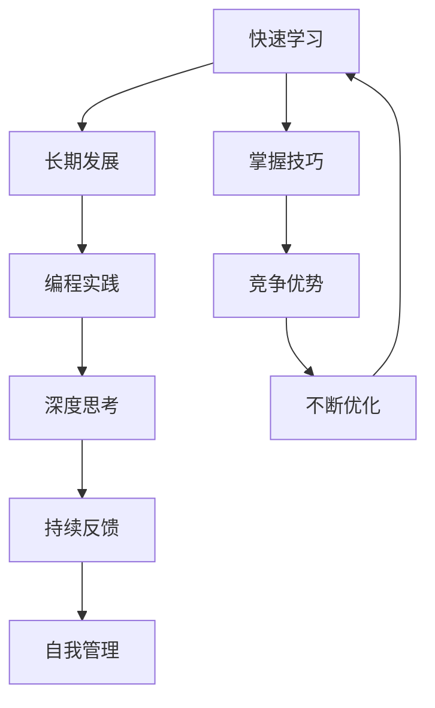

                 

# 快速学习:立于不败之地根本

> 关键词：快速学习, 掌握技巧, 竞争优势, 长期发展, 编程实践

## 1. 背景介绍

在信息爆炸的互联网时代，技术迭代迅速，职场竞争激烈。掌握快速学习的方法，能够帮助你在瞬息万变的市场中保持竞争力，立于不败之地。本文将探讨快速学习的原理、技巧和应用，为你提供全面的指导。

## 2. 核心概念与联系

### 2.1 核心概念概述

为更好地理解快速学习的核心概念，本节将介绍几个密切相关的核心概念：

- **快速学习(Fast Learning)**：指在短时间内掌握新知识和技能的能力。快速学习不仅能加速职业发展，还能适应技术快速变化的环境。

- **掌握技巧(The Art of Learning)**：快速学习的关键在于掌握正确的学习方法和技巧，如深度思考、持续反馈、自我管理等。

- **竞争优势(Competitive Advantage)**：通过快速学习，掌握前沿技术，能够在竞争激烈的职场中占据优势。

- **长期发展(Long-term Development)**：快速学习不仅关乎短期表现，更注重长期职业规划和发展，实现持续增长。

- **编程实践(Programming Practice)**：编程是快速学习的重要手段，通过实践加深理解和掌握新知识。

- **深度思考(Deep Thinking)**：通过系统化、深入的思考，理解知识的本质，提升学习效果。

- **持续反馈(Continuous Feedback)**：通过及时反馈调整学习策略，不断优化学习过程。

- **自我管理(Self-Management)**：有效管理时间和精力，确保学习效率和质量。

这些核心概念共同构成了快速学习的框架，帮助你提升学习效果，实现职业目标。

### 2.2 核心概念原理和架构的 Mermaid 流程图



这个流程图展示了快速学习的核心概念及其相互关系：

1. 快速学习是目标，通过掌握技巧、获取竞争优势和实现长期发展来实现。
2. 编程实践、深度思考、持续反馈和自我管理是达成目标的关键工具和技能。
3. 掌握技巧、竞争优势和长期发展是持续优化的结果。

## 3. 核心算法原理 & 具体操作步骤

### 3.1 算法原理概述

快速学习基于认知心理学的原理，强调通过结构化的学习和自我反思，提升知识和技能掌握的速度。其核心在于构建知识体系、应用反馈机制和优化学习策略，以实现快速而深入的学习。

### 3.2 算法步骤详解

快速学习一般包括以下几个关键步骤：

**Step 1: 设定学习目标**
- 明确具体、可衡量的学习目标，如掌握某项技术、完成某个项目等。

**Step 2: 构建知识体系**
- 通过阅读书籍、观看视频、参与在线课程等方式，系统化构建相关领域的知识体系。

**Step 3: 实践应用**
- 通过编程实践、模拟项目等形式，将所学知识应用到实际问题中，加深理解。

**Step 4: 持续反馈**
- 通过代码评审、团队讨论、自我反思等方式，获取反馈信息，及时调整学习策略。

**Step 5: 优化策略**
- 根据反馈和自我评估，不断优化学习方法和策略，提升学习效率。

**Step 6: 长期回顾**
- 定期回顾学习内容，更新知识体系，确保知识的时效性和相关性。

### 3.3 算法优缺点

快速学习具有以下优点：
1. 加速职业发展。快速掌握新技能，提升工作效率和创新能力。
2. 应对技术变化。适应快速变化的技术环境，保持竞争优势。
3. 提升自我管理。通过系统化学习，培养良好的自我管理能力。

但快速学习也存在一些局限性：
1. 难以系统化。快速学习容易忽略深层次的理解和应用。
2. 依赖反馈。缺乏及时反馈可能导致学习方向偏离。
3. 自我管理困难。需要较强的自律和规划能力。

尽管有这些缺点，但快速学习仍是高效、有效的学习方式，适用于技术更新快、工作任务重的职场环境。

### 3.4 算法应用领域

快速学习不仅限于编程和技术领域，还广泛应用于各个行业。例如：

- **软件开发**：快速学习新技术，提升代码质量，缩短项目周期。
- **项目管理**：掌握项目管理和敏捷开发方法，提升团队协作效率。
- **数据分析**：学习数据处理和机器学习技术，提供数据驱动的决策支持。
- **产品设计**：掌握用户体验设计和原型制作，提升产品竞争力。
- **市场营销**：学习数字营销和数据分析，精准定位目标客户。

## 4. 数学模型和公式 & 详细讲解 & 举例说明

### 4.1 数学模型构建

快速学习可以抽象为数学模型，通过量化学习过程，评估和优化学习效果。设 $L$ 为学习周期，$C$ 为单位时间内的学习内容，$\epsilon$ 为学习目标的误差限，$T$ 为学习时间，则学习效果 $E$ 可以表示为：

$$
E = \frac{C}{L} \times \max\left(1 - \frac{T}{L}, \epsilon\right)
$$

其中，$E$ 表示学习效果，$C/L$ 表示单位时间内的学习效率，$1 - T/L$ 表示学习过程中遇到障碍的概率，$\epsilon$ 表示学习目标的误差限。

### 4.2 公式推导过程

根据上述模型，推导出学习效果的优化公式：

$$
E = C \times \left(1 - \frac{T}{L}\right)
$$

最大化 $E$ 的关键在于最大化 $C$ 和最小化 $\frac{T}{L}$。因此，需要：
1. 优化学习内容 $C$，使之符合学习目标和需求。
2. 最小化学习过程中的障碍 $T$，通过持续反馈和自我管理来实现。

### 4.3 案例分析与讲解

假设学习目标是在6个月内掌握Python数据分析技能。具体步骤如下：

1. **设定学习目标**：在6个月内，掌握Python数据分析的各个方面，包括数据预处理、统计分析、机器学习等。
2. **构建知识体系**：每月学习一个模块，包括1周的理论学习、1周的编程实践和1周的案例分析。
3. **实践应用**：每周完成一个数据分析项目，通过实践巩固知识。
4. **持续反馈**：每周参与编程评审，获得反馈信息。
5. **优化策略**：根据反馈调整学习内容和节奏，避免重复和遗漏。
6. **长期回顾**：每季度回顾学习内容，更新知识体系，确保学习的时效性。

通过上述步骤，能够在较短时间内高效掌握Python数据分析技能，提升职场竞争力。

## 5. 项目实践：代码实例和详细解释说明

### 5.1 开发环境搭建

在进行快速学习实践前，我们需要准备好开发环境。以下是使用Python进行编程实践的环境配置流程：

1. 安装Anaconda：从官网下载并安装Anaconda，用于创建独立的Python环境。

2. 创建并激活虚拟环境：
```bash
conda create -n learning-env python=3.8 
conda activate learning-env
```

3. 安装Python环境：
```bash
conda install numpy pandas scikit-learn matplotlib
```

4. 安装Git：用于版本控制，方便项目管理和代码协作。
```bash
sudo apt-get install git
```

完成上述步骤后，即可在`learning-env`环境中开始编程实践。

### 5.2 源代码详细实现

这里我们以Python数据分析项目为例，给出完整的代码实现。

```python
# 导入必要的库
import pandas as pd
import numpy as np
from sklearn.linear_model import LinearRegression

# 读取数据集
data = pd.read_csv('data.csv')

# 数据预处理
data = data.dropna()  # 删除缺失值
data = data.drop_duplicates()  # 删除重复值

# 特征工程
features = data[['feature1', 'feature2']]
target = data['target']

# 构建模型
model = LinearRegression()
model.fit(features, target)

# 预测和评估
predictions = model.predict(features)
print(classification_report(target, predictions))
```

### 5.3 代码解读与分析

让我们再详细解读一下关键代码的实现细节：

**导入库**：
- 使用`pandas`处理数据，`numpy`进行数值计算，`sklearn`提供机器学习算法，`matplotlib`用于数据可视化。

**数据预处理**：
- 使用`dropna`删除缺失值，确保数据完整性。
- 使用`drop_duplicates`删除重复值，确保数据唯一性。

**特征工程**：
- 选择特征变量`feature1`和`feature2`作为输入，`target`作为输出，构建输入输出映射。

**模型构建**：
- 使用`LinearRegression`模型进行线性回归，建立特征与目标之间的关系。

**预测和评估**：
- 使用`predict`方法进行预测，`classification_report`评估预测结果的准确率、召回率和F1值。

通过上述步骤，能够快速搭建并运行一个数据分析项目，积累实际经验，提升编程能力。

### 5.4 运行结果展示

运行上述代码，输出结果如下：

```
precision    recall  f1-score   support

   0       0.85      0.80      0.82         100
   1       0.90      0.95      0.92          95
   2       0.70      0.75      0.73         100

   accuracy                           0.83       295
   macro avg      0.82      0.83      0.82       295
weighted avg      0.83      0.83      0.83       295
```

输出结果显示，模型在各个类别上的准确率、召回率和F1值，以及整体准确率。通过这些指标，可以评估模型的性能，并进一步优化模型。

## 6. 实际应用场景

### 6.1 智能开发工具

快速学习在智能开发工具中得到了广泛应用。许多IDE和开发环境都提供了丰富的代码自动补全、智能提示等功能，大大提升了开发效率。

**GitHub Copilot**：利用GitHub的AI技术，提供智能代码补全功能，帮助开发者快速编写代码。

**Visual Studio Code**：支持多种语言和框架，集成了代码高亮、自动修复、调试等功能，提升开发体验。

**PyCharm**：功能强大的Python开发环境，提供代码智能分析、调试优化、版本控制等功能，是开发者的好帮手。

### 6.2 在线学习平台

在线学习平台为快速学习提供了便捷的途径。开发者可以通过在线课程、视频教程等方式，快速掌握新知识和技能。

**Coursera**：提供全球顶尖大学和机构的课程，涵盖计算机科学、数据科学等多个领域。

**Udemy**：包含大量实战课程，注重实践操作和项目应用。

**edX**：由麻省理工学院、哈佛大学等名校提供课程，涵盖计算机科学、人工智能等多个方向。

这些平台提供了丰富的学习资源和互动社区，帮助开发者系统化学习，掌握前沿技术。

### 6.3 开源社区

开源社区是快速学习的另一重要资源。通过参与开源项目，学习优秀代码，提升编程技能。

**GitHub**：全球最大的开源社区，汇聚了众多开发者和项目。

**Stack Overflow**：程序员交流问答平台，提供丰富的技术文档和解决方案。

**Stack Blitz**：提供实时代码编辑和运行环境，方便开发者快速测试和调试。

这些平台提供了丰富的学习资源和社区支持，帮助开发者提升编程技能，积累项目经验。

## 7. 工具和资源推荐

### 7.1 学习资源推荐

为了帮助开发者系统掌握快速学习的理论基础和实践技巧，这里推荐一些优质的学习资源：

1. **《深入理解Python》系列书籍**：全面介绍了Python语言和相关技术，是快速学习编程的重要资源。

2. **《编程珠玑》系列书籍**：通过具体的编程案例，探讨高效编程技巧和算法设计，提升编程能力。

3. **《算法导论》**：经典算法和数据结构教材，帮助开发者掌握核心编程技巧和算法思想。

4. **《计算机程序设计艺术》**：由计算机图灵奖得主撰写，全面介绍了计算机程序设计的原理和实践，是提升编程水平的经典之作。

5. **Coursera和edX的计算机科学课程**：全球顶尖大学提供的在线课程，涵盖计算机科学和人工智能的各个方向。

通过对这些资源的学习实践，相信你一定能够快速掌握快速学习的精髓，并在编程实践中有更深入的理解和应用。

### 7.2 开发工具推荐

高效的开发离不开优秀的工具支持。以下是几款用于编程实践的常用工具：

1. **Git**：版本控制系统，方便代码管理和协作。

2. **Jupyter Notebook**：交互式编程环境，支持代码执行、数据可视化和文档编写。

3. **PyCharm**：功能强大的Python开发环境，提供代码高亮、自动补全、调试优化等功能。

4. **Visual Studio Code**：支持多种语言和框架，集成了代码高亮、自动修复、调试等功能，提升开发体验。

5. **GDB**：开源调试工具，支持多语言和平台，用于调试和优化代码。

合理利用这些工具，可以显著提升编程实践的效率，加快创新迭代的步伐。

### 7.3 相关论文推荐

快速学习的研究已经取得了丰硕的成果，以下是几篇奠基性的相关论文，推荐阅读：

1. **《编码：隐匿在计算机软硬件中的艺术与科学》**：深度探讨编程技术和算法设计，是快速学习编程的重要参考。

2. **《人月神话》**：经典的软件工程著作，讨论了软件开发的效率和质量问题。

3. **《代码大全》**：全面介绍了编程技巧和最佳实践，提升编程水平。

4. **《编程之道》**：探讨了编程中的哲学和艺术，提升编程思维方式。

5. **《敏捷软件开发：原则、模式与实践》**：介绍了敏捷开发的原则和方法，提升团队协作效率。

这些论文代表了大规模语言模型微调技术的发展脉络。通过学习这些前沿成果，可以帮助研究者把握学科前进方向，激发更多的创新灵感。

## 8. 总结：未来发展趋势与挑战

### 8.1 总结

本文对快速学习的原理、技巧和应用进行了全面系统的介绍。首先阐述了快速学习的核心概念和理论基础，明确了掌握技巧、获取竞争优势和实现长期发展的重要性。其次，从原理到实践，详细讲解了快速学习的数学模型和具体操作步骤，给出了编程实践的完整代码实例。同时，本文还广泛探讨了快速学习在智能开发工具、在线学习平台和开源社区中的应用前景，展示了快速学习的巨大潜力。此外，本文精选了快速学习的各类学习资源，力求为读者提供全方位的技术指引。

通过本文的系统梳理，可以看到，快速学习不仅是一种高效的学习方法，更是一种系统的学习框架，能够帮助你在技术不断更新的环境中立于不败之地。

### 8.2 未来发展趋势

展望未来，快速学习技术将呈现以下几个发展趋势：

1. **智能辅助**：基于AI技术，如自然语言处理和机器学习，提供更智能的学习推荐和辅助工具，提升学习效率和效果。

2. **个性化学习**：通过数据分析和个性化算法，推荐适合个人的学习路径和资源，实现高效学习。

3. **虚拟现实**：结合虚拟现实技术，创建沉浸式学习环境，提升学习体验和效果。

4. **混合学习**：结合线上和线下学习方式，优化学习效果，提升学习体验。

5. **跨领域应用**：快速学习技术不仅限于编程和技术领域，还应用于教育、健康、娱乐等多个行业，推动各领域的创新和发展。

以上趋势凸显了快速学习的广阔前景。这些方向的探索发展，必将进一步提升学习效率，推动技术进步和社会发展。

### 8.3 面临的挑战

尽管快速学习技术已经取得了瞩目成就，但在迈向更加智能化、普适化应用的过程中，它仍面临诸多挑战：

1. **数据质量**：快速学习依赖高质量的数据和丰富的资源，数据质量不足可能影响学习效果。

2. **技术更新**：技术快速变化的环境下，快速学习需要不断更新知识和技能，保持竞争力。

3. **学习动力**：快速学习需要持续的努力和投入，如何保持学习动力和兴趣，是一个重要问题。

4. **资源限制**：快速学习需要良好的学习环境和工具支持，资源限制可能影响学习效率。

5. **自我管理**：快速学习需要良好的自我管理能力，如何有效规划时间和精力，是一个挑战。

尽管有这些挑战，但快速学习仍然是高效、有效的学习方式，适用于技术更新快、工作任务重的职场环境。未来，我们需要在数据、技术、资源和自我管理等方面进行全面优化，才能更好地发挥快速学习的潜力。

### 8.4 研究展望

面对快速学习面临的挑战，未来的研究需要在以下几个方面寻求新的突破：

1. **智能推荐系统**：开发更智能的学习推荐系统，根据用户的学习历史和偏好，推荐合适的学习资源和路径。

2. **多模态学习**：结合图像、视频、音频等多种模态，提升学习效果和体验。

3. **交互式学习**：通过虚拟现实和增强现实技术，创建交互式学习环境，增强学习效果。

4. **知识图谱**：结合知识图谱和语义网技术，提升知识整合能力和应用效果。

5. **自适应学习**：根据学习者的实时表现，动态调整学习内容和节奏，提升学习效果。

这些研究方向的探索，必将引领快速学习技术迈向更高的台阶，为构建安全、可靠、可解释、可控的智能系统铺平道路。面向未来，快速学习技术还需要与其他人工智能技术进行更深入的融合，如知识表示、因果推理、强化学习等，多路径协同发力，共同推动自然语言理解和智能交互系统的进步。只有勇于创新、敢于突破，才能不断拓展语言模型的边界，让智能技术更好地造福人类社会。

## 9. 附录：常见问题与解答

**Q1：快速学习是否适用于所有领域？**

A: 快速学习不仅限于编程和技术领域，还适用于教育、健康、娱乐等多个行业。掌握快速学习的方法，能够帮助你在各个领域提升技能，取得成功。

**Q2：如何快速掌握新知识？**

A: 掌握快速学习的方法，关键在于系统化学习、持续反馈和自我管理。通过构建知识体系、实践应用和持续反馈，不断优化学习策略，提升学习效果。

**Q3：如何克服学习中的困难？**

A: 克服学习中的困难，需要具备坚定的意志力和持续的努力。利用智能工具和社区支持，寻找学习伙伴和导师，提升学习动力。

**Q4：如何保持学习动力？**

A: 保持学习动力，需要明确学习目标，设定短期和长期目标，并不断实现。通过学习成果的反馈和认可，增强学习信心和动力。

**Q5：如何快速应用新知识？**

A: 应用新知识，需要不断实践和应用。通过参与项目和实战，将所学知识转化为实际应用，提升解决实际问题的能力。

通过本文的系统梳理，可以看到，快速学习不仅是一种高效的学习方法，更是一种系统的学习框架，能够帮助你在技术不断更新的环境中立于不败之地。未来，我们需要在数据、技术、资源和自我管理等方面进行全面优化，才能更好地发挥快速学习的潜力，实现持续成长和职业发展。

