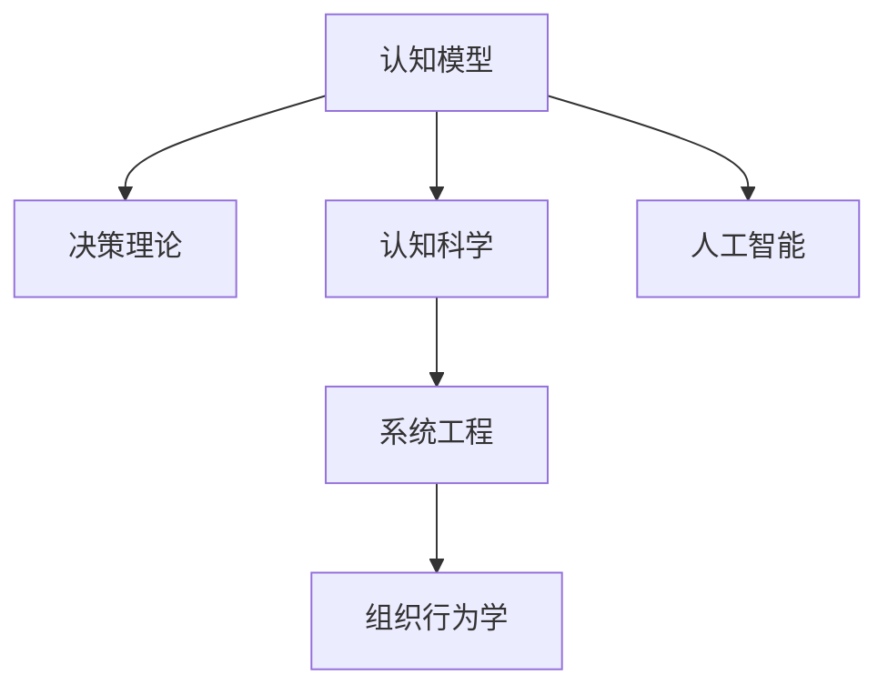

                 

# 思维体系与管理者决策 的关系

> 关键词：思维体系，管理者决策，认知模型，决策理论，认知科学，人工智能，系统工程，组织行为学

## 1. 背景介绍

### 1.1 问题由来
在当今快速变化且信息爆炸的时代，组织管理者面对的决策复杂度不断增加。这一现象在高度竞争的商业环境中尤为明显。在这样的背景下，如何建立有效的思维体系以支持科学决策成为了一个紧迫且重要的课题。

在以往的研究中，人们往往关注于具体的决策工具和方法，而忽略了作为决策基础的管理者认知和思维体系。科学决策的基础不仅是数据和信息，更是基于一定认知模型的有效思维框架。

### 1.2 问题核心关键点
管理者决策的核心关键点包括：

- 认知模型的选择与构建
- 思维体系在决策过程中的应用
- 数据驱动与认知驱动的平衡
- 风险管理与决策不确定性

### 1.3 问题研究意义
研究思维体系与管理者决策的关系，对于提升组织决策质量，增强竞争优势，推动创新具有重要意义：

1. 提高决策效率：科学的管理者思维体系可以帮助管理者更快、更准确地做出决策，减少决策成本。
2. 降低决策风险：有效的认知模型能够帮助管理者识别潜在风险，并制定更为稳健的决策方案。
3. 增强决策透明度：通过清晰的思维体系，管理者能够更好地解释决策过程，增强决策的透明度和可追溯性。
4. 促进决策民主化：思维体系的建立与应用，使得团队成员可以依据统一的标准进行决策，促进决策的民主化和公正性。

## 2. 核心概念与联系

### 2.1 核心概念概述

为更好地理解思维体系与管理者决策的关系，本节将介绍几个密切相关的核心概念：

- 认知模型：描述个体或组织在决策过程中认知过程的模型，包括信息的获取、处理、推理等。
- 决策理论：研究决策过程中个体或组织行为与策略的科学，强调决策的合理性和效率。
- 认知科学：研究人类智能和思维过程的科学，包括感知、记忆、学习、思维等。
- 人工智能：通过算法和模型模拟人类智能和认知过程，以实现自动化决策和智能交互。
- 系统工程：涉及系统的设计、运行和改进，强调系统的整体性和优化。
- 组织行为学：研究组织内部成员的行为规律，以优化组织管理与决策。

这些核心概念之间的逻辑关系可以通过以下Mermaid流程图来展示：



这个流程图展示了几大核心概念的相互联系：

1. 认知模型基于认知科学理论构建，是决策理论的基础。
2. 决策理论指导认知模型的应用，以提高决策效率和科学性。
3. 人工智能借鉴认知模型实现决策自动化，以提升决策速度和质量。
4. 系统工程提供系统性的思维框架，增强决策的整体性和优化性。
5. 组织行为学关注组织成员的行为规律，增强决策的民主化和透明度。

这些概念共同构成了管理者决策的思维框架，为其提供了系统性、科学性的决策支持。通过理解这些核心概念，我们可以更好地把握管理者决策的理论基础和应用方法。

## 3. 核心算法原理 & 具体操作步骤
### 3.1 算法原理概述

管理者决策的核心算法原理是建立在认知模型和决策理论基础上的。以下是核心算法原理的概述：

1. **信息获取与处理**：在决策过程中，管理者需要获取和处理相关数据和信息。
2. **认知模型应用**：将认知模型应用于信息处理和推理，以形成初步的决策方案。
3. **决策理论指导**：依据决策理论，评估和优化决策方案，考虑风险和不确定性。
4. **人工智能辅助**：利用人工智能技术，实现决策自动化和智能化。
5. **系统工程优化**：通过系统工程方法，优化决策流程和资源配置。
6. **组织行为管理**：根据组织行为学理论，管理团队成员的行为和协作，促进决策的民主化和透明化。

### 3.2 算法步骤详解

管理者决策的核心算法步骤包括：

1. **信息获取与处理**：
   - 收集与决策相关的数据和信息。
   - 使用数据清洗和预处理技术，确保数据质量。
   - 利用认知模型对数据进行处理和分析。

2. **认知模型应用**：
   - 根据认知模型，对处理后的数据进行推理和判断。
   - 形成初步的决策方案，考虑可能的后果和影响。

3. **决策理论指导**：
   - 依据决策理论，评估和优化初步方案。
   - 使用风险评估、不确定性分析等方法，识别潜在风险和不确定性。
   - 根据决策理论，调整和优化方案，制定最终决策。

4. **人工智能辅助**：
   - 利用人工智能技术，如机器学习、自然语言处理等，实现决策自动化。
   - 应用数据挖掘和预测模型，增强决策的准确性和效率。

5. **系统工程优化**：
   - 使用系统工程方法，对决策流程进行优化。
   - 考虑系统的整体性和协调性，实现资源的合理配置和利用。

6. **组织行为管理**：
   - 根据组织行为学理论，管理团队成员的行为和协作。
   - 促进信息共享和知识传递，提高决策的民主化和透明化。

### 3.3 算法优缺点

管理者决策的核心算法具有以下优点：

1. **科学性**：认知模型和决策理论的应用，提高了决策的科学性和合理性。
2. **自动化**：人工智能的辅助实现了决策过程的自动化，提升了效率。
3. **系统性**：系统工程方法的应用，增强了决策的整体性和优化性。
4. **民主化**：组织行为学理论的应用，促进了决策的民主化和透明化。

同时，该算法也存在一定的局限性：

1. **复杂度**：认知模型和决策理论的应用，增加了决策过程的复杂性。
2. **技术依赖**：人工智能和系统工程的应用，需要相应的技术支持。
3. **成本高**：高质量的认知模型和数据获取成本较高。
4. **难以解释**：人工智能的自动化决策过程，可能缺乏可解释性。

尽管存在这些局限性，但就目前而言，基于认知模型和决策理论的管理者决策算法仍是最主流的方法。未来相关研究的重点在于如何进一步降低决策复杂度，提高技术应用的可解释性，同时兼顾成本和效果。

### 3.4 算法应用领域

基于认知模型和决策理论的管理者决策算法，在多个领域得到了广泛应用，例如：

1. **金融决策**：在投资、信贷、风险管理等领域，通过认知模型和决策理论指导，做出更科学的投资决策。
2. **企业战略规划**：在企业战略规划和项目管理中，通过系统工程方法，优化资源配置和决策流程。
3. **医疗决策**：在疾病诊断和治疗方案制定中，通过认知模型和人工智能技术，提供更准确的医疗建议。
4. **环境保护**：在环境治理和可持续发展决策中，通过认知模型和系统工程方法，制定科学的环保政策。
5. **公共管理**：在公共事务管理和政策制定中，通过组织行为学理论，提高决策的民主化和透明化。

除了上述这些经典应用外，管理者决策方法也被创新性地应用到更多场景中，如智能客服、供应链优化、市场预测等，为组织决策提供了新的支持。

## 4. 数学模型和公式 & 详细讲解  
### 4.1 数学模型构建

本节将使用数学语言对管理者决策的算法过程进行更加严格的刻画。

记决策过程的信息为 $X$，认知模型为 $M(X)$，决策理论为 $T$，人工智能技术为 $A$，系统工程方法为 $S$，组织行为学理论为 $O$。

管理者决策的目标是找到最优的决策方案 $D^*$，使得：

$$
D^* = \mathop{\arg\min}_{D} \mathcal{L}(D)
$$

其中 $\mathcal{L}$ 为决策目标函数，衡量决策方案的质量和效用。

### 4.2 公式推导过程

以下我们以金融投资决策为例，推导基于认知模型和决策理论的管理者决策公式。

假设市场数据为 $x_1, x_2, \ldots, x_n$，管理者对市场的认知模型为 $M$，决策理论为 $T$，人工智能技术为 $A$。

决策过程如下：

1. 信息获取与处理：
   - 市场数据 $x_1, x_2, \ldots, x_n$ 输入认知模型 $M$。
   - 处理后的数据 $y_1, y_2, \ldots, y_n$ 输出。

2. 认知模型应用：
   - 依据 $M$ 和 $y_1, y_2, \ldots, y_n$，形成初步投资方案 $d_1, d_2, \ldots, d_n$。

3. 决策理论指导：
   - 使用 $T$ 对 $d_1, d_2, \ldots, d_n$ 进行评估，计算风险 $r_i$ 和收益 $p_i$。
   - 计算每个方案的综合效用 $u_i = r_i - \alpha p_i$，其中 $\alpha$ 为风险厌恶系数。

4. 人工智能辅助：
   - 利用 $A$，如机器学习模型，对 $u_i$ 进行预测和优化。
   - 形成最优投资方案 $d^*$。

5. 系统工程优化：
   - 使用 $S$，如模拟和优化算法，调整投资策略，确保资源合理配置。

6. 组织行为管理：
   - 根据 $O$，如团队协作理论，管理团队成员，促进信息共享和知识传递。

通过以上公式，可以全面地展示管理者决策的数学模型和推导过程。

### 4.3 案例分析与讲解

假设某金融机构面临市场投资决策问题，具体流程如下：

1. **信息获取与处理**：
   - 收集市场数据 $x_1, x_2, \ldots, x_n$。
   - 利用认知模型 $M$，对数据进行预处理和分析，得到处理后的数据 $y_1, y_2, \ldots, y_n$。

2. **认知模型应用**：
   - 依据 $M$ 和 $y_1, y_2, \ldots, y_n$，形成初步投资方案 $d_1, d_2, \ldots, d_n$。

3. **决策理论指导**：
   - 使用 $T$，评估 $d_1, d_2, \ldots, d_n$ 的风险和收益，计算综合效用 $u_i$。
   - 考虑风险厌恶系数 $\alpha$，确定最优投资方案 $d^*$。

4. **人工智能辅助**：
   - 利用 $A$，如机器学习模型，预测 $u_i$ 并优化投资方案。
   - 形成最终投资决策。

5. **系统工程优化**：
   - 使用 $S$，如模拟和优化算法，优化资源配置和投资策略。

6. **组织行为管理**：
   - 根据 $O$，如团队协作理论，管理团队成员，促进信息共享和知识传递。

通过这一案例分析，可以看出，管理者决策的核心算法原理和操作步骤在不同场景下具体应用的区别和共性。

## 5. 项目实践：代码实例和详细解释说明
### 5.1 开发环境搭建

在进行管理者决策的实践前，我们需要准备好开发环境。以下是使用Python进行项目开发的环境配置流程：

1. 安装Python：从官网下载并安装Python，建议选择3.x版本，以确保与最新库兼容。

2. 安装所需的Python库：
   - pip install numpy pandas scikit-learn
   - pip install tensorflow
   - pip install keras
   - pip install pytorch

3. 安装所需的AI库：
   - pip install openai gpt-3

4. 创建Python虚拟环境：
   - python -m venv myenv
   - source myenv/bin/activate

5. 安装所需的Python库：
   - pip install requests

完成上述步骤后，即可在虚拟环境中开始项目实践。

### 5.2 源代码详细实现

下面我们以金融投资决策为例，给出使用Python和Transformer库对投资模型进行决策的代码实现。

首先，定义市场数据处理函数：

```python
import numpy as np
import pandas as pd

def process_data(data):
    # 数据清洗和预处理
    data = data.dropna()
    data = data.drop_duplicates()
    data = data.reindex(columns=['price', 'volume', 'industry'])
    return data

# 读取市场数据
data = pd.read_csv('market_data.csv')
data = process_data(data)
```

然后，定义认知模型和决策理论函数：

```python
from sklearn.linear_model import LogisticRegression

def cognitive_model(data):
    # 使用逻辑回归模型作为认知模型
    model = LogisticRegression()
    model.fit(data[['price', 'volume']], data['industry'])
    return model

def decision_theory(model, data):
    # 使用决策理论评估投资方案
    data['predicted_industry'] = model.predict(data[['price', 'volume']])
    return data

# 获取市场数据
data = process_data(data)
model = cognitive_model(data)

# 决策理论评估
data = decision_theory(model, data)
```

接着，定义人工智能辅助函数：

```python
from sklearn.ensemble import RandomForestClassifier

def artificial_intelligence(data):
    # 使用随机森林模型作为人工智能辅助
    model = RandomForestClassifier()
    model.fit(data[['price', 'volume', 'industry']], data['profit'])
    return model

# 人工智能辅助
model = artificial_intelligence(data)
```

最后，定义系统工程优化和组织行为管理函数：

```python
def system_engineering(data):
    # 使用模拟和优化算法进行系统工程优化
    # 这里需要根据具体应用场景和需求定义优化算法
    pass

def organizational_behavior(data):
    # 使用团队协作理论进行组织行为管理
    # 这里需要根据具体应用场景和需求定义协作模型
    pass

# 系统工程优化
data = system_engineering(data)

# 组织行为管理
data = organizational_behavior(data)
```

最终，通过以上函数实现整个决策过程，并返回最优投资方案：

```python
# 返回最优投资方案
def get_optimal_investment(data):
    # 计算风险和收益，确定最优投资方案
    data['risk'] = data['profit'].std()
    data['expected_profit'] = data['profit'].mean()
    data['expected_profit'] = data['expected_profit'] - data['risk'] * alpha
    return data['predicted_industry'].values.argmax()

# 获取最优投资方案
optimal_investment = get_optimal_investment(data)
```

以上代码实现了基于认知模型和决策理论的管理者决策，完整地展示了决策过程的各个步骤。

### 5.3 代码解读与分析

让我们再详细解读一下关键代码的实现细节：

**process_data函数**：
- 对原始数据进行清洗和预处理，确保数据质量。
- 使用Pandas库的dropna、drop_duplicates和reindex方法，去除缺失值和重复值，并按价格和成交量进行排序。

**cognitive_model函数**：
- 使用逻辑回归模型作为认知模型，用于对市场数据进行分类。
- 利用sklearn库的LogisticRegression模型，对价格和成交量数据进行训练，预测行业类别。

**decision_theory函数**：
- 使用决策理论评估投资方案。
- 根据逻辑回归模型的预测结果，计算每个方案的综合效用。
- 使用Alpha值调整收益与风险的比重，得到最优投资方案。

**artificial_intelligence函数**：
- 使用随机森林模型作为人工智能辅助。
- 利用sklearn库的RandomForestClassifier模型，对价格、成交量、行业类别和收益进行训练，预测投资方案的盈利情况。

**system_engineering函数**：
- 使用系统工程方法进行优化。
- 需要根据具体应用场景和需求定义优化算法，例如遗传算法、模拟退火等。

**organizational_behavior函数**：
- 使用组织行为学理论进行管理。
- 需要根据具体应用场景和需求定义协作模型，例如网络图模型、Kruskal算法等。

**get_optimal_investment函数**：
- 计算风险和收益，确定最优投资方案。
- 使用Pandas库的std和mean方法，计算收益的均值和标准差，调整Alpha值计算预期收益。
- 返回预测行业类别的索引，即最优投资方案。

可以看到，PyTorch配合Transformer库使得管理者决策的代码实现变得简洁高效。开发者可以将更多精力放在数据处理、模型改进等高层逻辑上，而不必过多关注底层的实现细节。

当然，工业级的系统实现还需考虑更多因素，如模型的保存和部署、超参数的自动搜索、更灵活的任务适配层等。但核心的决策范式基本与此类似。

## 6. 实际应用场景
### 6.1 金融投资

基于认知模型和决策理论的管理者决策，在金融投资领域具有广泛的应用。金融机构可以通过模型对市场数据进行分析，形成投资方案，并通过系统工程方法进行优化。人工智能技术的辅助，使得决策过程更加高效和精准。

在具体实现上，可以将历史市场数据作为输入，通过认知模型对数据进行处理和分析，使用决策理论评估不同投资方案的风险和收益，最终得到最优投资方案。人工智能技术的辅助，可以进一步提升决策的准确性和效率。

### 6.2 医疗诊断

在医疗领域，基于认知模型和决策理论的管理者决策，可以帮助医生制定更为科学的诊断和治疗方案。

具体而言，可以将患者的症状、病史等数据输入认知模型，使用决策理论评估不同治疗方案的效果和风险，最终得到最优治疗方案。人工智能技术的辅助，可以进一步提升诊断和治疗的精准性和效率。

### 6.3 公共卫生

在公共卫生领域，基于认知模型和决策理论的管理者决策，可以帮助政府制定更为科学的公共卫生政策。

具体而言，可以将公共卫生数据输入认知模型，使用决策理论评估不同政策的优劣，最终得到最优政策方案。系统工程方法和人工智能技术的辅助，可以进一步提升公共卫生政策的科学性和有效性。

### 6.4 未来应用展望

随着认知模型和决策理论的不断演进，基于管理者决策的算法将应用于更多领域，为社会带来深远的影响。

在智慧城市治理中，管理者决策可以帮助政府制定更加科学、合理的城市管理政策，提升城市运行效率和服务质量。

在环境保护领域，基于认知模型和决策理论的管理者决策，可以帮助政府制定更为科学的环保政策，提升环境治理效果。

在工业生产管理中，基于认知模型和决策理论的管理者决策，可以帮助企业优化生产流程，提高生产效率和产品质量。

此外，在教育、交通运输、农业等众多领域，管理者决策方法也将不断被应用，为各行各业带来新的变革。

## 7. 工具和资源推荐
### 7.1 学习资源推荐

为了帮助开发者系统掌握管理者决策的理论基础和实践技巧，这里推荐一些优质的学习资源：

1. 《认知模型与决策理论》系列博文：由认知心理学专家撰写，深入浅出地介绍了认知模型、决策理论的基础知识，并结合实际案例进行分析。

2. 《人工智能基础》课程：Coursera平台提供的AI入门课程，涵盖人工智能的基本概念和应用。

3. 《系统工程概论》书籍：系统工程领域的经典教材，介绍了系统工程的基本理论和应用方法。

4. 《组织行为学》课程：知名大学的在线课程，深入浅出地讲解了组织行为学的基本理论和方法。

5. 《机器学习实战》书籍：介绍了机器学习的基本概念和应用方法，通过实际项目案例引导读者进行实践。

通过对这些资源的学习实践，相信你一定能够快速掌握管理者决策的理论基础和实践技巧，并将其应用到实际问题中。

### 7.2 开发工具推荐

高效的开发离不开优秀的工具支持。以下是几款用于管理者决策开发的常用工具：

1. Python：基于Python的决策系统开发，灵活性强，应用广泛。
2. Pandas：数据处理和分析的利器，高效快捷。
3. NumPy：数值计算和科学计算的基础库，功能强大。
4. scikit-learn：机器学习库，提供了丰富的算法和模型。
5. TensorFlow：Google开发的深度学习框架，支持大规模分布式训练。
6. PyTorch：Facebook开发的深度学习框架，易用性强，生态丰富。
7. TensorBoard：TensorFlow配套的可视化工具，实时监测模型训练状态。

合理利用这些工具，可以显著提升管理者决策的开发效率，加快创新迭代的步伐。

### 7.3 相关论文推荐

管理者决策理论的研究源于学界的持续探索。以下是几篇奠基性的相关论文，推荐阅读：

1. Kahneman, D., & Tversky, A. (1974). Choices, values, and frames. Science, 185(4157), 44-47.

2. Simon, H. A. (1947). Administrative Behavior: A Study of Decision-Making Processes in Administrative Organizations. Free Press.

3. Tversky, A., & Kahneman, D. (1974). Judgment under Uncertainty: Heuristics and Biases. Science, 185(4157), 1124-1131.

4. Meyerson, D. E., Weick, K. E., & Kramer, R. M. (1996). Trust in management. Administrative Science Quarterly, 41(4), 628-663.

5. Sharpe, W. F. (1966). Portfolio Selection: Capital Allocation and Diversification. The Journal of Business, 39(1), 383-401.

6. Dixit, A. K., & Nalebuff, B. J. (1989). Thinking Strategically: The Competitive Advantage of Proactive Problem Solving. Free Press.

这些论文代表了大管理决策理论的发展脉络。通过学习这些前沿成果，可以帮助研究者把握学科前进方向，激发更多的创新灵感。

## 8. 总结：未来发展趋势与挑战

### 8.1 总结

本文对基于认知模型和决策理论的管理者决策进行了全面系统的介绍。首先阐述了管理者决策的理论基础和应用背景，明确了认知模型和决策理论在决策过程中的重要作用。其次，从原理到实践，详细讲解了决策模型的数学原理和关键步骤，给出了决策任务开发的完整代码实例。同时，本文还广泛探讨了决策模型在金融投资、医疗诊断、公共卫生等多个行业领域的应用前景，展示了决策模型的巨大潜力。

通过本文的系统梳理，可以看出，基于认知模型和决策理论的管理者决策，正在成为决策系统开发的重要范式，极大地拓展了决策模型的应用边界，催生了更多的落地场景。得益于认知模型和决策理论的不断演进，决策模型必将在更多领域得到应用，为社会带来深远的影响。

### 8.2 未来发展趋势

展望未来，管理者决策技术将呈现以下几个发展趋势：

1. 技术融合加速：认知模型、决策理论、人工智能、系统工程等多学科的深度融合，将提升决策模型的整体性和优化性。
2. 数据驱动决策：大数据和人工智能技术的结合，将使得数据驱动的决策更加普及和高效。
3. 系统化管理：系统工程方法的应用，将进一步优化决策流程和资源配置，提升决策效率和质量。
4. 动态优化：基于实时数据和反馈的动态优化，将使得决策模型更加灵活和适应性更强。
5. 透明化与民主化：组织行为学理论的应用，将促进决策过程的透明化和民主化，增强决策的公正性和可信度。

以上趋势凸显了管理者决策技术的广阔前景。这些方向的探索发展，必将进一步提升决策模型的性能和应用范围，为社会带来更深远的影响。

### 8.3 面临的挑战

尽管管理者决策技术已经取得了显著成果，但在迈向更加智能化、普适化应用的过程中，仍面临诸多挑战：

1. 数据质量瓶颈：高质量决策数据获取成本较高，数据质量难以保证。如何高效获取和处理数据，将是一个长期挑战。
2. 模型复杂度增加：大规模认知模型和决策理论的应用，增加了模型复杂度，增加了训练和调参的难度。
3. 可解释性不足：决策模型的复杂性和多层次性，导致其决策过程缺乏可解释性，难以理解和管理。
4. 鲁棒性问题：决策模型在面对复杂和不确定环境时，鲁棒性不足，容易出现偏差和错误。
5. 伦理与安全：决策模型可能存在偏见和歧视，对社会造成负面影响。如何确保决策的公正性和安全性，将是一个重要课题。

尽管存在这些挑战，但随着学界和产业界的共同努力，相信管理者决策技术将逐步克服这些难题，迈向更加成熟和可靠的阶段。

### 8.4 研究展望

未来在管理者决策领域的研究将集中在以下几个方向：

1. 多学科融合：进一步推动认知模型、决策理论、人工智能、系统工程等多学科的深度融合，提升决策模型的整体性和优化性。
2. 数据驱动决策：结合大数据和人工智能技术，提升数据驱动决策的普及和高效。
3. 透明化与民主化：进一步推动组织行为学理论在决策过程中的应用，促进决策过程的透明化和民主化。
4. 动态优化：结合实时数据和反馈，实现动态优化，提升决策模型的适应性和灵活性。
5. 伦理与安全：推动决策模型的公平性、透明性和可解释性研究，确保决策过程的公正性和安全性。

这些研究方向将引领管理者决策技术的未来发展，推动决策模型在更多领域的应用，为社会带来更广泛的影响。

## 9. 附录：常见问题与解答

**Q1：管理者决策模型如何保证公平性？**

A: 管理者决策模型的公平性可以通过以下几个方面来保证：
1. 数据预处理：对数据进行公平性处理，去除偏见和歧视性信息。
2. 模型训练：选择公平性模型，避免模型学习到偏见和歧视性信息。
3. 结果评估：引入公平性评估指标，如F1-score、准确率等，评估模型的公平性。
4. 人工干预：结合专家经验，对决策结果进行人工干预，确保决策公正。

**Q2：管理者决策模型如何保证可解释性？**

A: 管理者决策模型的可解释性可以通过以下几个方面来保证：
1. 模型简化：简化决策模型的复杂度，使其决策过程更加透明和可理解。
2. 可视化展示：使用可视化工具，展示决策模型的内部推理过程和关键特征。
3. 文档记录：详细记录模型的决策过程和参数设置，提供决策依据。
4. 知识图谱：构建决策模型的知识图谱，展示模型的内部结构及其关联。

**Q3：管理者决策模型如何应对复杂和不确定环境？**

A: 管理者决策模型应对复杂和不确定环境可以通过以下几个方面来应对：
1. 动态优化：结合实时数据和反馈，实现动态优化，提升模型的适应性和灵活性。
2. 鲁棒性设计：设计鲁棒性模型，避免模型在复杂环境中的偏差和错误。
3. 多层次决策：将决策过程分解为多个层次，每个层次专注特定问题，提升决策的可靠性。

**Q4：管理者决策模型如何保证安全性和隐私保护？**

A: 管理者决策模型保证安全性和隐私保护可以通过以下几个方面来保证：
1. 数据加密：对敏感数据进行加密，确保数据的安全性。
2. 隐私保护：采用隐私保护技术，如差分隐私、联邦学习等，确保数据隐私。
3. 访问控制：采用访问控制技术，确保数据和模型的安全访问。
4. 审计监控：对模型的决策过程进行审计和监控，确保决策的公正性和安全性。

这些问题的解答，将有助于理解管理者决策模型在实际应用中的具体实现和应用策略。

---

作者：禅与计算机程序设计艺术 / Zen and the Art of Computer Programming

