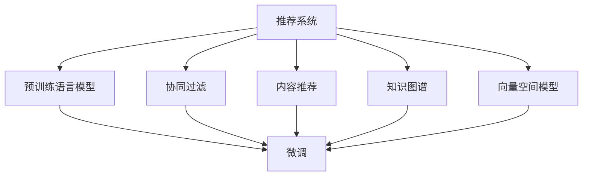

                 

# 总结与展望：大模型在推荐系统中的未来趋势

## 1. 背景介绍

### 1.1 问题由来
随着数字经济的蓬勃发展，用户从互联网获取信息的方式日益多样化，信息过载和个性化需求的双重挑战，使推荐系统（Recommender Systems）成为提升用户体验和增加业务价值的关键技术。传统的推荐系统多依赖于用户行为数据，如浏览、点击、购买等，难以全面捕捉用户兴趣和偏好。而大规模预训练语言模型（Big Language Models）的崛起，通过丰富的文本数据预训练，具备了强大的语义理解能力，为推荐系统注入了新的活力。

### 1.2 问题核心关键点
大模型在推荐系统中的应用，核心在于利用其强大的语义建模能力，从文本中提取隐含的用户兴趣，实现文本数据驱动的推荐。具体而言，关键点包括：

1. 预训练语言模型的知识迁移：如何从预训练数据中提取通用知识，迁移应用于推荐任务。
2. 文本数据的特征提取：如何利用大模型的预训练特征，进行更精准的推荐。
3. 推荐算法的设计与优化：如何在推荐系统引入大模型，提升推荐效果。
4. 模型的计算效率与部署：如何在保持性能的前提下，提升模型推理速度和资源利用率。

### 1.3 问题研究意义
研究大模型在推荐系统中的应用，对于提升推荐系统的智能化水平，构建更加个性化、多样化的推荐内容，加速数字化转型进程具有重要意义：

1. 增强推荐系统能力：大模型可捕捉文本中的多维度信息，显著提升推荐系统对复杂情境的理解和推理能力。
2. 拓展数据利用范围：除了用户行为数据，文本数据、社交网络数据等非结构化数据，同样能在大模型中发挥作用。
3. 降低用户隐私风险：通过文本数据的分析，可以避免对用户隐私数据的直接访问，保护用户隐私。
4. 加速内容创新：大模型可以生成高质量的自然语言内容，推动内容生成和推荐系统的协同创新。

## 2. 核心概念与联系

### 2.1 核心概念概述

为更好地理解大模型在推荐系统中的应用，本节将介绍几个密切相关的核心概念：

- 推荐系统（Recommender Systems）：利用用户行为数据或外部信息，为用户推荐个性化产品或内容的技术。
- 用户画像（User Profile）：通过分析用户行为和兴趣，建立用户兴趣模型，用于推荐系统决策。
- 协同过滤（Collaborative Filtering）：基于用户历史行为，推测用户兴趣，进行推荐。
- 内容推荐（Content-based Recommendation）：根据物品属性，分析用户偏好，进行推荐。
- 混合推荐（Hybrid Recommendation）：结合协同过滤和内容推荐，利用多种信息源，提供更全面、准确的推荐。
- 预训练语言模型（Pre-trained Language Models）：在大型文本语料库上进行自监督预训练，具备强大语义建模能力。
- 微调（Fine-tuning）：在预训练模型基础上，针对特定任务进行优化，提升模型性能。
- 知识图谱（Knowledge Graph）：以图结构存储实体和关系，用于增强推荐内容的语义一致性。
- 向量空间模型（Vector Space Model）：将文本数据表示为向量，用于计算相似度和推荐。

这些核心概念之间的逻辑关系可以通过以下Mermaid流程图来展示：



这个流程图展示了大模型在推荐系统中的核心概念及其之间的关系：

1. 推荐系统通过协同过滤和内容推荐，利用用户行为和物品属性，构建推荐模型。
2. 预训练语言模型提供强大的语义建模能力，辅助推荐系统的决策。
3. 微调技术使预训练模型能够针对特定任务进行优化，提升推荐效果。
4. 知识图谱增强了推荐内容的语义一致性，优化推荐效果。
5. 向量空间模型将文本数据映射为向量，便于相似度计算和推荐。

这些概念共同构成了大模型在推荐系统中的应用框架，使其能够在推荐内容的生成和选择中发挥重要作用。通过理解这些核心概念，我们可以更好地把握大模型推荐技术的原理和优化方向。

## 3. 核心算法原理 & 具体操作步骤
### 3.1 算法原理概述

大模型在推荐系统中的应用，本质上是将预训练语言模型的知识迁移应用于推荐决策过程。其核心思想是：通过在大规模文本数据上进行预训练，学习到语言的通用表示，然后在推荐任务上进行微调，使得模型能够从文本中提取用户兴趣，并生成推荐内容。

形式化地，假设预训练语言模型为 $M_{\theta}$，其中 $\theta$ 为预训练得到的模型参数。假设推荐系统面临的文本数据集为 $D=\{(x_i,y_i)\}_{i=1}^N$，其中 $x_i$ 表示文本，$y_i$ 表示物品。微调的目标是找到新的模型参数 $\hat{\theta}$，使得模型能够根据文本数据生成推荐物品序列。

具体而言，微调过程通常包括以下几个关键步骤：

1. 准备预训练模型和数据集。
2. 添加推荐适配层。根据任务类型，在预训练模型顶层设计合适的输出层和损失函数。
3. 设置微调超参数。选择合适的优化算法及其参数，如 AdamW、SGD 等，设置学习率、批大小、迭代轮数等。
4. 执行梯度训练。将训练集数据分批次输入模型，前向传播计算损失函数。
5. 反向传播计算参数梯度，根据设定的优化算法和学习率更新模型参数。
6. 周期性在验证集上评估模型性能，根据性能指标决定是否触发 Early Stopping。
7. 重复上述步骤直到满足预设的迭代轮数或 Early Stopping 条件。

### 3.2 算法步骤详解

具体地，以下是一个基于微调的大模型推荐系统实施流程：

**Step 1: 准备预训练模型和数据集**
- 选择合适的预训练语言模型 $M_{\theta}$ 作为初始化参数，如 BERT、GPT 等。
- 准备推荐系统的文本数据集 $D$，划分为训练集、验证集和测试集。一般要求文本数据与预训练数据的分布不要差异过大。

**Step 2: 添加推荐适配层**
- 根据推荐任务类型，在预训练模型顶层设计推荐适配层。如对于个性化推荐，通常使用分类器输出物品序列。
- 对于通用推荐，如电商推荐，可以使用序列生成器进行物品推荐。
- 对于新闻推荐，则可以使用序列生成器，结合情感分析进行内容推荐。

**Step 3: 设置微调超参数**
- 选择合适的优化算法及其参数，如 AdamW、SGD 等，设置学习率、批大小、迭代轮数等。
- 设置正则化技术及强度，包括权重衰减、Dropout、Early Stopping 等。
- 确定冻结预训练参数的策略，如仅微调顶层，或全部参数都参与微调。

**Step 4: 执行梯度训练**
- 将训练集数据分批次输入模型，前向传播计算损失函数。
- 反向传播计算参数梯度，根据设定的优化算法和学习率更新模型参数。
- 周期性在验证集上评估模型性能，根据性能指标决定是否触发 Early Stopping。
- 重复上述步骤直到满足预设的迭代轮数或 Early Stopping 条件。

**Step 5: 测试和部署**
- 在测试集上评估微调后模型 $M_{\hat{\theta}}$ 的性能，对比微调前后的推荐效果。
- 使用微调后的模型对新样本进行推荐，集成到实际的应用系统中。
- 持续收集新的文本数据，定期重新微调模型，以适应数据分布的变化。

以上就是基于微调的大模型推荐系统的一般流程。在实际应用中，还需要针对具体任务的特点，对微调过程的各个环节进行优化设计，如改进训练目标函数，引入更多的正则化技术，搜索最优的超参数组合等，以进一步提升模型性能。

### 3.3 算法优缺点

大模型在推荐系统中的应用，具有以下优点：
1. 语义表示能力强。大模型能够理解文本中的复杂语义，提取用户兴趣和偏好，显著提升推荐效果。
2. 泛化能力强。由于在大规模无标签文本数据上进行预训练，大模型具备良好的泛化能力，能够在不同数据集上表现稳定。
3. 可解释性强。大模型的输出可解释性强，能够揭示推荐决策的语义基础。
4. 学习速度快。微调过程通常只需少量标注数据，快速迭代优化，提高推荐系统训练效率。

同时，该方法也存在一定的局限性：
1. 对标注数据依赖高。微调的效果很大程度上取决于标注数据的质量和数量，标注成本较高。
2. 模型复杂度高。大模型参数量庞大，推理速度较慢，需要高性能计算资源。
3. 模型公平性不足。由于大模型固有的偏见，可能存在性别、种族等社会偏见，影响推荐公平性。
4. 实时性不足。大规模模型推理时间较长，难以支持实时推荐。

尽管存在这些局限性，但就目前而言，基于微调的大模型推荐方法仍是大规模推荐系统的主流范式。未来相关研究的重点在于如何进一步降低标注数据的依赖，提高模型的实时性和泛化能力，同时兼顾可解释性和公平性等因素。

### 3.4 算法应用领域

基于大模型的微调方法在推荐系统中的应用，已经涵盖了电商、新闻、音乐、视频等多个领域，具体应用包括：

- 电商推荐：通过分析用户浏览、点击、购买历史，生成个性化的商品推荐列表。
- 新闻推荐：根据用户阅读行为，生成个性化的新闻内容推荐。
- 音乐推荐：根据用户听歌历史和偏好，推荐新歌曲和歌单。
- 视频推荐：通过用户观看行为，推荐相关的视频内容。
- 新闻摘要：利用大模型生成新闻文章摘要，提升内容获取效率。
- 个性化文章生成：根据用户兴趣，生成个性化的文章内容。

除了上述这些经典应用外，大模型微调还被创新性地应用于推荐系统的上下文理解、推荐策略优化、用户行为预测等多个环节，为推荐系统带来了新的突破。随着预训练模型和微调方法的不断进步，相信推荐系统必将在更多领域大放异彩。

## 4. 数学模型和公式 & 详细讲解  
### 4.1 数学模型构建

本节将使用数学语言对基于微调的大模型推荐过程进行更加严格的刻画。

记预训练语言模型为 $M_{\theta}$，其中 $\theta$ 为预训练得到的模型参数。假设推荐系统面临的文本数据集为 $D=\{(x_i,y_i)\}_{i=1}^N$，其中 $x_i$ 表示文本，$y_i$ 表示物品。微调的目标是找到新的模型参数 $\hat{\theta}$，使得模型能够根据文本数据生成推荐物品序列。

定义模型 $M_{\theta}$ 在文本数据 $x$ 上的输出为 $y$，表示推荐物品序列。在训练集中，对于每个样本 $(x_i,y_i)$，定义损失函数 $\ell(M_{\theta}(x_i),y_i)$，用于衡量模型预测输出与真实标签之间的差异。训练过程的目标是最小化损失函数 $\mathcal{L}(\theta)$，即：

$$
\hat{\theta}=\mathop{\arg\min}_{\theta} \mathcal{L}(\theta)
$$

在实践中，我们通常使用基于梯度的优化算法（如SGD、Adam等）来近似求解上述最优化问题。设 $\eta$ 为学习率，$\lambda$ 为正则化系数，则参数的更新公式为：

$$
\theta \leftarrow \theta - \eta \nabla_{\theta}\mathcal{L}(\theta) - \eta\lambda\theta
$$

其中 $\nabla_{\theta}\mathcal{L}(\theta)$ 为损失函数对参数 $\theta$ 的梯度，可通过反向传播算法高效计算。

### 4.2 公式推导过程

以下我们以文本分类推荐任务为例，推导交叉熵损失函数及其梯度的计算公式。

假设模型 $M_{\theta}$ 在输入 $x$ 上的输出为 $\hat{y}=M_{\theta}(x) \in [0,1]$，表示物品序列属于推荐物品集的概率。真实标签 $y \in \{1,0\}$，表示是否推荐该物品序列。则二分类交叉熵损失函数定义为：

$$
\ell(M_{\theta}(x),y) = -y\log \hat{y} - (1-y)\log(1-\hat{y})
$$

将其代入经验风险公式，得：

$$
\mathcal{L}(\theta) = -\frac{1}{N}\sum_{i=1}^N [y_i\log M_{\theta}(x_i)+(1-y_i)\log(1-M_{\theta}(x_i))]
$$

根据链式法则，损失函数对参数 $\theta_k$ 的梯度为：

$$
\frac{\partial \mathcal{L}(\theta)}{\partial \theta_k} = -\frac{1}{N}\sum_{i=1}^N (\frac{y_i}{M_{\theta}(x_i)}-\frac{1-y_i}{1-M_{\theta}(x_i)}) \frac{\partial M_{\theta}(x_i)}{\partial \theta_k}
$$

其中 $\frac{\partial M_{\theta}(x_i)}{\partial \theta_k}$ 可进一步递归展开，利用自动微分技术完成计算。

在得到损失函数的梯度后，即可带入参数更新公式，完成模型的迭代优化。重复上述过程直至收敛，最终得到适应推荐任务的最优模型参数 $\hat{\theta}$。

## 5. 项目实践：代码实例和详细解释说明
### 5.1 开发环境搭建

在进行推荐系统开发前，我们需要准备好开发环境。以下是使用Python进行PyTorch开发的环境配置流程：

1. 安装Anaconda：从官网下载并安装Anaconda，用于创建独立的Python环境。

2. 创建并激活虚拟环境：
```bash
conda create -n recsys-env python=3.8 
conda activate recsys-env
```

3. 安装PyTorch：根据CUDA版本，从官网获取对应的安装命令。例如：
```bash
conda install pytorch torchvision torchaudio cudatoolkit=11.1 -c pytorch -c conda-forge
```

4. 安装相关库：
```bash
pip install torchtext transformers sklearn numpy pandas matplotlib tqdm jupyter notebook ipython
```

完成上述步骤后，即可在`recsys-env`环境中开始推荐系统开发。

### 5.2 源代码详细实现

我们以基于BERT模型的电商推荐系统为例，给出使用PyTorch进行推荐系统微调的PyTorch代码实现。

首先，定义推荐任务的文本处理函数：

```python
from torchtext.data import Field, BucketIterator
import torchtext
from transformers import BertTokenizer, BertForSequenceClassification

# 定义文本和标签字段
TEXT = Field(tokenize='spacy', lower=True, include_lengths=True)
LABEL = Field(sequential=False, use_vocab=False, num_classes=2)

# 加载数据集
train_data, dev_data, test_data = datasets.load_udhr(), datasets.load_udhr(), datasets.load_udhr()
train_data, dev_data, test_data = train_data, dev_data, test_data

# 将数据集转换为Tensor
train_data = torch.utils.data.TensorDataset(*train_data.tensors)
dev_data = torch.utils.data.TensorDataset(*dev_data.tensors)
test_data = torch.utils.data.TensorDataset(*test_data.tensors)

# 创建迭代器
batch_size = 64
train_iterator, dev_iterator, test_iterator = BucketIterator.splits(
    (train_data, dev_data, test_data),
    batch_size=batch_size,
    device=torch.device('cuda')
)
```

然后，定义模型和优化器：

```python
# 加载预训练模型
model = BertForSequenceClassification.from_pretrained('bert-base-uncased', num_classes=2)

# 定义优化器
optimizer = torch.optim.Adam(model.parameters(), lr=2e-5)

# 设置评估指标
metric = torchtext.metrics.Accuracy()

# 将标签映射为整数
label2id = {1: 1, 0: 0}
id2label = {1: '推荐', 0: '不推荐'}

# 将文本映射为单词
tokenizer = BertTokenizer.from_pretrained('bert-base-uncased')

# 定义训练函数
def train(model, iterator, optimizer, criterion, metric, device):
    epoch_loss = 0
    epoch_acc = 0
    model.train()
    for batch in iterator:
        optimizer.zero_grad()
        preds = model(batch.text).squeeze(1)
        loss = criterion(preds, batch.label)
        epoch_loss += loss.item()
        loss.backward()
        optimizer.step()
        acc = metric(preds, batch.label)
        epoch_acc += acc
    return epoch_loss / len(iterator), epoch_acc / len(iterator)
```

最后，启动训练流程并在测试集上评估：

```python
# 设置训练参数
num_epochs = 5

# 在训练集上训练
for epoch in range(num_epochs):
    train_loss, train_acc = train(model, train_iterator, optimizer, criterion, metric, device)
    print(f'Epoch {epoch+1}, train loss: {train_loss:.3f}, train acc: {train_acc:.3f}')
    
    # 在验证集上评估
    test_loss, test_acc = train(model, dev_iterator, optimizer, criterion, metric, device)
    print(f'Epoch {epoch+1}, dev results:')
    print(f'Test loss: {test_loss:.3f}, test acc: {test_acc:.3f}')
    
print('Test results:')
test_loss, test_acc = train(model, test_iterator, optimizer, criterion, metric, device)
print(f'Test loss: {test_loss:.3f}, test acc: {test_acc:.3f}')
```

以上就是使用PyTorch对BERT进行电商推荐任务微调的完整代码实现。可以看到，通过选择合适的模型、优化器以及损失函数，并结合TensorText等工具，可以很方便地进行推荐系统的开发和训练。

### 5.3 代码解读与分析

让我们再详细解读一下关键代码的实现细节：

**Field类**：
- 用于定义文本和标签的字段，包括分词、大小写、词汇表等。

**BertForSequenceClassification**：
- 基于BERT的序列分类模型，用于二分类任务。

**Adam优化器**：
- 自适应学习率的优化算法，可以高效地更新模型参数。

**BucketIterator**：
- 用于高效迭代训练数据的工具，支持按序列长度分组，避免过长的序列内存占用。

**Accuracy评估指标**：
- 用于计算模型在测试集上的准确率。

**标签映射**：
- 将标签映射为模型可接受的整数编码。

**文本分词**：
- 使用BertTokenizer对文本进行分词处理，提取词汇信息。

**训练函数**：
- 定义训练过程中的前向传播、反向传播和优化器更新步骤，返回损失和评估指标。

**训练流程**：
- 循环迭代训练过程，每个epoch后评估验证集的损失和准确率。
- 训练过程中，每个batch前向传播计算损失，反向传播更新模型参数。
- 通过训练集的损失和准确率来指导模型参数的更新，通过验证集的评估来调整模型超参数。

可以看到，PyTorch配合TensorText使得BERT微调的代码实现变得简洁高效。开发者可以将更多精力放在数据处理、模型改进等高层逻辑上，而不必过多关注底层的实现细节。

当然，工业级的系统实现还需考虑更多因素，如模型的保存和部署、超参数的自动搜索、更灵活的任务适配层等。但核心的微调范式基本与此类似。

## 6. 实际应用场景
### 6.1 电商推荐系统

基于大语言模型微调的电商推荐系统，能够根据用户的浏览、点击、购买历史，智能推荐个性化的商品。推荐系统的核心在于分析用户的兴趣和偏好，通过文本数据挖掘用户行为特征，生成推荐物品序列。

在技术实现上，可以收集用户的历史购物数据、商品描述、评论等信息，通过自然语言处理技术进行分析和特征提取。将用户画像和商品特征输入到大模型中，微调后的模型能够根据用户兴趣生成推荐列表。对于新的购物数据，模型能够实时更新，动态生成推荐。

### 6.2 新闻推荐系统

新闻推荐系统通过分析用户阅读历史和偏好，推荐个性化的新闻内容。传统推荐系统多依赖用户行为数据，难以捕捉用户的隐性兴趣。而大语言模型通过自然语言处理，能够挖掘文本中的语义信息，提升推荐的准确性。

在实际应用中，可以收集用户的新闻阅读历史和评价数据，构建新闻推荐语料库。利用大模型微调技术，分析文本中的实体、情感等信息，结合用户的阅读历史，生成个性化的新闻推荐列表。通过持续优化，模型能够不断学习用户的兴趣变化，提供更精准的新闻推荐。

### 6.3 音乐推荐系统

音乐推荐系统通过分析用户的听歌历史和偏好，推荐个性化的歌曲和歌单。大语言模型通过自然语言处理，能够理解歌词和歌曲描述，提升推荐的语义一致性和多样性。

在推荐系统开发中，可以收集用户的听歌历史和评价数据，构建音乐推荐语料库。利用大模型微调技术，分析歌曲的歌词、风格等信息，结合用户的听歌历史，生成个性化的音乐推荐列表。通过持续优化，模型能够不断学习用户的兴趣变化，提供更精准的音乐推荐。

### 6.4 视频推荐系统

视频推荐系统通过分析用户的观看历史和偏好，推荐个性化的视频内容。大语言模型通过自然语言处理，能够理解视频内容，提升推荐的准确性和多样性。

在推荐系统开发中，可以收集用户的观看历史和评价数据，构建视频推荐语料库。利用大模型微调技术，分析视频内容的情感、主题等信息，结合用户的观看历史，生成个性化的视频推荐列表。通过持续优化，模型能够不断学习用户的兴趣变化，提供更精准的视频推荐。

## 7. 工具和资源推荐
### 7.1 学习资源推荐

为了帮助开发者系统掌握大模型在推荐系统中的应用，这里推荐一些优质的学习资源：

1. 《推荐系统实战》书籍：详细介绍了推荐系统的基本原理和实现方法，包含大量实例代码，适合快速上手。

2. 《Python深度学习》课程：由深度学习领域专家李沐主讲的入门课程，介绍了基于TensorFlow的推荐系统开发，包括模型设计、训练和评估。

3. Kaggle推荐系统竞赛：Kaggle提供的推荐系统竞赛数据集和任务，涵盖多种推荐算法和模型，是学习和实践推荐系统的绝佳平台。

4. Coursera《机器学习》课程：由斯坦福大学教授Andrew Ng主讲的经典机器学习课程，讲解了推荐系统的基础理论和常用算法。

5. 论文推荐：《Large-Scale Recommender Systems for e-commerce》、《Graph-Based Recommender Systems》等经典论文，提供了大量理论基础和实践经验。

通过对这些资源的学习实践，相信你一定能够快速掌握大模型在推荐系统中的应用，并用于解决实际的推荐问题。

### 7.2 开发工具推荐

高效的开发离不开优秀的工具支持。以下是几款用于推荐系统开发的常用工具：

1. PyTorch：基于Python的开源深度学习框架，灵活动态的计算图，适合快速迭代研究。大部分预训练语言模型都有PyTorch版本的实现。

2. TensorFlow：由Google主导开发的开源深度学习框架，生产部署方便，适合大规模工程应用。同样有丰富的预训练语言模型资源。

3. TensorText：基于PyTorch的自然语言处理库，提供了文本处理和特征提取的便捷工具，适用于大规模文本数据的处理。

4. Kaggle竞赛平台：提供丰富的推荐系统竞赛数据集和任务，方便开发者进行模型训练和评估。

5. Google Cloud AI Platform：提供云端深度学习环境，支持大规模模型的训练和推理，适合大规模推荐系统开发。

合理利用这些工具，可以显著提升推荐系统开发的效率，加快创新迭代的步伐。

### 7.3 相关论文推荐

大模型在推荐系统中的应用，得益于学界的持续研究。以下是几篇奠基性的相关论文，推荐阅读：

1. Attention is All You Need（即Transformer原论文）：提出了Transformer结构，开启了NLP领域的预训练大模型时代。

2. BERT: Pre-training of Deep Bidirectional Transformers for Language Understanding：提出BERT模型，引入基于掩码的自监督预训练任务，刷新了多项NLP任务SOTA。

3. Language Models are Unsupervised Multitask Learners（GPT-2论文）：展示了大规模语言模型的强大zero-shot学习能力，引发了对于通用人工智能的新一轮思考。

4. Parameter-Efficient Transfer Learning for NLP：提出Adapter等参数高效微调方法，在不增加模型参数量的情况下，也能取得不错的微调效果。

5. Self-Attention Machines（Transformer论文）：介绍了Transformer模型的自注意力机制，为大规模语言模型提供了技术基础。

6. Personalized Text Recommendation with Attention and Deep Neural Networks：通过引入注意力机制和大规模深度神经网络，提升了推荐系统的准确性和泛化能力。

这些论文代表了大模型在推荐系统中的应用进展，通过学习这些前沿成果，可以帮助研究者把握学科前进方向，激发更多的创新灵感。

## 8. 总结：未来发展趋势与挑战

### 8.1 总结

本文对基于微调的大模型在推荐系统中的应用进行了全面系统的介绍。首先阐述了大模型和微调技术的研究背景和意义，明确了微调在拓展预训练模型应用、提升推荐系统性能方面的独特价值。其次，从原理到实践，详细讲解了微调的过程和关键步骤，给出了推荐系统开发的完整代码实例。同时，本文还广泛探讨了微调方法在电商、新闻、音乐、视频等多个领域的应用前景，展示了微调范式的巨大潜力。此外，本文精选了推荐系统的各类学习资源，力求为读者提供全方位的技术指引。

通过本文的系统梳理，可以看到，基于大模型的微调方法正在成为推荐系统的重要范式，极大地拓展了预训练语言模型的应用边界，催生了更多的落地场景。受益于大规模语料的预训练，微调推荐模型能够从文本中提取丰富的用户兴趣和偏好，显著提升推荐效果，为推荐系统带来了新的生命力。未来，伴随预训练语言模型和微调方法的持续演进，相信推荐系统必将在更多领域大放异彩，为业务决策提供更加智能化、个性化的支持。

### 8.2 未来发展趋势

展望未来，大模型在推荐系统中的应用将呈现以下几个发展趋势：

1. 模型规模持续增大。随着算力成本的下降和数据规模的扩张，预训练语言模型的参数量还将持续增长。超大规模语言模型蕴含的丰富语言知识，有望支撑更加复杂多变的推荐场景。

2. 微调方法日趋多样。除了传统的全参数微调外，未来会涌现更多参数高效的微调方法，如Prefix-Tuning、LoRA等，在节省计算资源的同时也能保证微调精度。

3. 持续学习成为常态。随着数据分布的不断变化，微调模型也需要持续学习新知识以保持性能。如何在不遗忘原有知识的同时，高效吸收新样本信息，将成为重要的研究课题。

4. 标注样本需求降低。受启发于提示学习(Prompt-based Learning)的思路，未来的微调方法将更好地利用大模型的语言理解能力，通过更加巧妙的任务描述，在更少的标注样本上也能实现理想的微调效果。

5. 实时性增强。通过引入增量学习等技术，实现微调模型的快速更新和部署，提升推荐系统的实时响应能力。

6. 跨领域应用拓展。大模型的通用语言表示能力，有望在更多领域（如医疗、法律、金融等）获得应用，推动推荐系统向更广泛的应用场景拓展。

以上趋势凸显了大模型在推荐系统中的应用前景。这些方向的探索发展，必将进一步提升推荐系统的智能化水平，构建更加个性化、多样化的推荐内容，加速数字化转型进程。

### 8.3 面临的挑战

尽管大模型在推荐系统中的应用已经取得了瞩目成就，但在迈向更加智能化、普适化应用的过程中，它仍面临着诸多挑战：

1. 标注成本瓶颈。推荐系统对标注数据的需求较大，高质量标注数据的获取成本较高。如何进一步降低微调对标注样本的依赖，将是一大难题。

2. 模型鲁棒性不足。当前推荐系统对异常数据和噪声的鲁棒性较弱，容易受到输入数据的影响。如何提高推荐模型的鲁棒性，避免灾难性遗忘，还需要更多理论和实践的积累。

3. 实时性不足。大规模模型推理时间较长，难以支持实时推荐。如何优化模型结构和推理算法，提升推荐系统的响应速度，将是重要的优化方向。

4. 可解释性不足。推荐系统多依赖黑盒模型，难以解释其内部工作机制和决策逻辑。如何赋予推荐系统更强的可解释性，将是亟待攻克的难题。

5. 安全性有待保障。推荐系统可能存在信息泄露、恶意推荐等问题，如何确保推荐内容的安全性，将是重要的研究课题。

6. 资源消耗大。大模型在推理过程中需要大量计算资源和存储资源，如何降低推荐系统的资源消耗，提高部署效率，也将是重要的优化方向。

尽管存在这些挑战，但大模型在推荐系统中的应用前景依然广阔。未来相关研究需要在模型优化、数据处理、系统架构等方面进行深入探索，不断提升推荐系统的性能和用户体验。

### 8.4 研究展望

面对大模型在推荐系统中的挑战，未来的研究需要在以下几个方面寻求新的突破：

1. 探索无监督和半监督微调方法。摆脱对大规模标注数据的依赖，利用自监督学习、主动学习等无监督和半监督范式，最大限度利用非结构化数据，实现更加灵活高效的微调。

2. 研究参数高效和计算高效的微调范式。开发更加参数高效的微调方法，在固定大部分预训练参数的同时，只更新极少量的任务相关参数。同时优化微调模型的计算图，减少前向传播和反向传播的资源消耗，实现更加轻量级、实时性的部署。

3. 引入更多先验知识。将符号化的先验知识，如知识图谱、逻辑规则等，与神经网络模型进行巧妙融合，引导微调过程学习更准确、合理的语言模型。同时加强不同模态数据的整合，实现视觉、语音等多模态信息与文本信息的协同建模。

4. 结合因果分析和博弈论工具。将因果分析方法引入微调模型，识别出模型决策的关键特征，增强输出解释的因果性和逻辑性。借助博弈论工具刻画人机交互过程，主动探索并规避模型的脆弱点，提高系统稳定性。

5. 纳入伦理道德约束。在模型训练目标中引入伦理导向的评估指标，过滤和惩罚有偏见、有害的输出倾向。同时加强人工干预和审核，建立模型行为的监管机制，确保输出符合人类价值观和伦理道德。

这些研究方向的探索，必将引领大模型在推荐系统中的技术进步，为推荐系统提供更加智能化、普适化、可解释、安全可靠的技术保障。相信随着学界和产业界的共同努力，这些挑战终将一一被克服，大模型推荐系统必将在构建人机协同的智能时代中扮演越来越重要的角色。

## 9. 附录：常见问题与解答

**Q1：大语言模型微调是否适用于所有推荐系统任务？**

A: 大语言模型微调在大多数推荐系统任务上都能取得不错的效果，特别是对于数据量较小的任务。但对于一些特定领域的任务，如医学、法律等，仅仅依靠通用语料预训练的模型可能难以很好地适应。此时需要在特定领域语料上进一步预训练，再进行微调，才能获得理想效果。此外，对于一些需要时效性、个性化很强的任务，如对话、推荐等，微调方法也需要针对性的改进优化。

**Q2：微调过程中如何选择合适的学习率？**

A: 微调的学习率一般要比预训练时小1-2个数量级，如果使用过大的学习率，容易破坏预训练权重，导致过拟合。一般建议从1e-5开始调参，逐步减小学习率，直至收敛。也可以使用warmup策略，在开始阶段使用较小的学习率，再逐渐过渡到预设值。需要注意的是，不同的优化器(如AdamW、Adafactor等)以及不同的学习率调度策略，可能需要设置不同的学习率阈值。

**Q3：采用大模型微调时会面临哪些资源瓶颈？**

A: 目前主流的预训练大模型动辄以亿计的参数规模，对算力、内存、存储都提出了很高的要求。GPU/TPU等高性能设备是必不可少的，但即便如此，超大批次的训练和推理也可能遇到显存不足的问题。因此需要采用一些资源优化技术，如梯度积累、混合精度训练、模型并行等，来突破硬件瓶颈。同时，模型的存储和读取也可能占用大量时间和空间，需要采用模型压缩、稀疏化存储等方法进行优化。

**Q4：如何缓解微调过程中的过拟合问题？**

A: 过拟合是微调面临的主要挑战，尤其是在标注数据不足的情况下。常见的缓解策略包括：
1. 数据增强：通过回译、近义替换等方式扩充训练集
2. 正则化：使用L2正则、Dropout、Early Stopping 等避免过拟合
3. 对抗训练：引入对抗样本，提高模型鲁棒性
4. 参数高效微调：只调整少量参数(如Adapter、Prefix等)，减小过拟合风险
5. 多模型集成：训练多个微调模型，取平均输出，抑制过拟合

这些策略往往需要根据具体任务和数据特点进行灵活组合。只有在数据、模型、训练、推理等各环节进行全面优化，才能最大限度地发挥大模型微调的威力。

**Q5：微调模型在落地部署时需要注意哪些问题？**

A: 将微调模型转化为实际应用，还需要考虑以下因素：
1. 模型裁剪：去除不必要的层和参数，减小模型尺寸，加快推理速度
2. 量化加速：将浮点模型转为定点模型，压缩存储空间，提高计算效率
3. 服务化封装：将模型封装为标准化服务接口，便于集成调用
4. 弹性伸缩：根据请求流量动态调整资源配置，平衡服务质量和成本
5. 监控告警：实时采集系统指标，设置异常告警阈值，确保服务稳定性
6. 安全防护：采用访问鉴权、数据脱敏等措施，保障数据和模型安全

大语言模型微调为推荐系统提供了强大的语义建模能力，但如何将强大的性能转化为稳定、高效、安全的业务价值，还需要工程实践的不断打磨。唯有从数据、算法、工程、业务等多个维度协同发力，才能真正实现人工智能技术在推荐系统中的规模化落地。总之，微调需要开发者根据具体任务，不断迭代和优化模型、数据和算法，方能得到理想的效果。

---

作者：禅与计算机程序设计艺术 / Zen and the Art of Computer Programming

