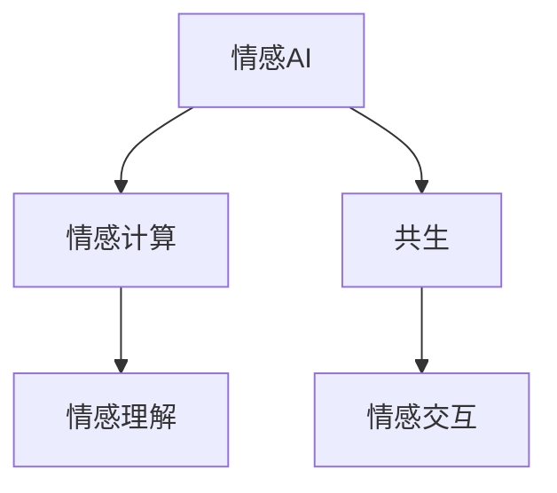

                 

# 情感AI共生理论：人机情感互动新范式

## 1. 背景介绍

### 1.1 问题由来

在当今数字化和智能化的社会背景下，人机交互日益频繁，情感计算也成为人工智能研究的热点。然而，传统的人机交互模式以信息传递为主，缺乏情感维度的交互，无法满足人们在情感交流方面的需求。情感AI作为新兴技术，通过赋予机器情感理解与表达能力，使得人机交互更加自然、友好，能够更好地满足人类情感交流的需要。

### 1.2 问题核心关键点

情感AI的核心在于如何使机器理解和生成人类情感，并将这些情感应用于不同的场景中，如客户服务、医疗咨询、教育培训等。基于此，本文将介绍情感AI共生理论，探讨其原理和应用，并结合实际案例进行详细说明。

### 1.3 问题研究意义

研究情感AI共生理论，对于提升人机交互质量，推动人工智能在情感领域的实际应用具有重要意义：

1. **改善用户体验**：情感AI能够更自然地理解并回应用户情感，提升用户体验和满意度。
2. **促进情感交流**：机器具备情感识别和表达能力，能够与人类进行更深入的情感交流，满足人们在情感表达方面的需求。
3. **推动技术发展**：情感AI是人工智能技术的重要分支，其研究和发展将推动整个AI技术的前进。
4. **扩展应用场景**：情感AI可以应用于医疗、教育、客服等多个领域，为这些行业带来新的发展机遇。

## 2. 核心概念与联系

### 2.1 核心概念概述

情感AI共生理论主要包含以下核心概念：

1. **情感AI**：通过情感计算技术，赋予机器理解和生成人类情感的能力。
2. **情感计算**：通过分析人类情感表达和生理反应，使机器能够识别和模拟人类情感。
3. **共生**：通过情感AI和人类的双向互动，实现情感理解和表达的共同提升。

这些概念之间的关系可以表示如下：



其中，情感AI是核心概念，情感计算是实现手段，共生是最终目标。通过情感AI和人类情感的互动，实现情感理解与表达的共同提升。

## 3. 核心算法原理 & 具体操作步骤

### 3.1 算法原理概述

情感AI共生理论的核心在于通过情感计算技术，使机器能够理解和生成人类情感。具体而言，情感计算通过分析人类情感表达和生理反应，提取情感特征，并利用机器学习模型对这些特征进行建模，从而实现情感识别和生成。

### 3.2 算法步骤详解

情感AI共生理论的实现步骤如下：

1. **情感数据采集**：采集人类情感表达和生理反应数据，如语音、文字、面部表情等。
2. **情感特征提取**：利用自然语言处理（NLP）和图像处理技术，从采集的数据中提取情感特征。
3. **情感识别模型训练**：使用机器学习算法（如神经网络、支持向量机等），对提取的情感特征进行建模，训练情感识别模型。
4. **情感生成模型构建**：利用生成对抗网络（GAN）等技术，构建情感生成模型，能够根据输入的情感特征生成情感表达。
5. **情感共生交互**：通过构建人机交互平台，将情感AI与人类进行双向情感互动，实现情感理解和表达的共同提升。

### 3.3 算法优缺点

情感AI共生理论的优势在于：

- **自然交互**：情感AI能够自然地理解并回应人类情感，提升用户体验。
- **广泛应用**：情感AI可以应用于客服、医疗、教育等多个领域，推动技术发展。
- **用户满意度**：通过情感AI的情感理解和表达，提升用户满意度和情感交流质量。

然而，情感AI共生理论也存在以下缺点：

- **数据需求大**：情感数据采集和标注需要大量人力和资源，成本较高。
- **模型复杂**：情感识别和生成模型复杂，需要较高的计算资源和技能水平。
- **隐私问题**：情感数据的采集和处理涉及用户隐私，需要严格的数据保护措施。

### 3.4 算法应用领域

情感AI共生理论已经在多个领域得到应用，具体如下：

- **客户服务**：情感AI用于客服机器人，能够自然地回应客户情感，提升客户满意度。
- **医疗咨询**：情感AI用于医疗咨询，能够理解并回应患者的情感需求，提升就医体验。
- **教育培训**：情感AI用于教育培训，能够理解并回应学生的情感反馈，提升教学效果。
- **娱乐互动**：情感AI用于游戏、虚拟现实等娱乐领域，能够与用户进行情感互动，提升游戏体验。

## 4. 数学模型和公式 & 详细讲解 & 举例说明

### 4.1 数学模型构建

情感AI共生理论的数学模型主要由情感特征提取模型和情感识别/生成模型构成。以下以情感识别为例，介绍模型构建过程：

1. **情感特征提取模型**：
   - **语音情感特征**：使用MFCC、STFT等技术，提取语音情感特征。
   - **文字情感特征**：使用NLP技术，提取文本中的情感词汇和情感极性。
   - **面部表情特征**：使用CNN等技术，提取面部表情特征。

2. **情感识别模型**：
   - **SVM模型**：使用支持向量机（SVM）对情感特征进行分类，训练情感识别模型。
   - **神经网络模型**：使用多层感知机（MLP）、卷积神经网络（CNN）等，对情感特征进行建模，训练情感识别模型。

### 4.2 公式推导过程

情感识别模型的训练过程如下：

1. **输入数据**：$x$ 表示情感特征向量，$y$ 表示情感类别标签。
2. **损失函数**：使用交叉熵损失函数，$L(x,y) = -\log p(y|x)$。
3. **模型优化**：使用梯度下降等优化算法，对模型参数进行优化，最小化损失函数。

具体推导过程如下：

$$
L(x,y) = -\log p(y|x) = -\log \frac{e^{w_0x_0 + w_1x_1 + \dots + w_nx_n}}{e^{w_0x_0 + w_1x_1 + \dots + w_nx_n} + \sum_{j=1}^{K-1} e^{w_0x_0 + w_1x_1 + \dots + w_nx_n}}
$$

其中，$w$ 为模型参数，$x$ 为输入情感特征向量，$y$ 为情感类别标签，$K$ 为情感类别数。

### 4.3 案例分析与讲解

以情感AI在客户服务中的应用为例，介绍情感AI的实现过程：

1. **情感数据采集**：采集客户的语音、文字和面部表情数据。
2. **情感特征提取**：利用语音分析技术，提取客户的语音情感特征；利用NLP技术，提取文字情感特征；利用图像处理技术，提取面部表情特征。
3. **情感识别模型训练**：使用神经网络模型对提取的情感特征进行建模，训练情感识别模型。
4. **情感共生交互**：将情感识别模型部署到客服机器人中，客户与机器人进行情感互动，机器人能够自然地回应客户情感，提升用户体验。

## 5. 项目实践：代码实例和详细解释说明

### 5.1 开发环境搭建

开发情感AI共生理论项目，需要以下开发环境：

1. **Python**：作为开发语言。
2. **TensorFlow**：用于构建和训练机器学习模型。
3. **Keras**：用于构建神经网络模型。
4. **OpenCV**：用于面部表情特征提取。
5. **NLTK**：用于文本情感特征提取。
6. **Jupyter Notebook**：作为开发环境。

以下是在Jupyter Notebook中搭建开发环境的步骤：

1. **安装Python**：
   ```bash
   conda create -n py38 python=3.8
   conda activate py38
   ```

2. **安装TensorFlow和Keras**：
   ```bash
   pip install tensorflow
   pip install keras
   ```

3. **安装OpenCV和NLTK**：
   ```bash
   pip install opencv-python
   pip install nltk
   ```

4. **启动Jupyter Notebook**：
   ```bash
   jupyter notebook
   ```

### 5.2 源代码详细实现

以下是在Jupyter Notebook中实现情感AI共生理论的代码：

```python
import tensorflow as tf
from keras.models import Sequential
from keras.layers import Dense, Dropout, Flatten, Conv2D, MaxPooling2D, LSTM
from cv2 import cv2
import numpy as np
import nltk
from nltk.sentiment import SentimentIntensityAnalyzer

# 加载情感数据集
def load_data():
    # 加载情感数据集
    x_train, y_train, x_test, y_test = ...
    
    # 加载情感特征提取模型
    model = ...
    
    # 加载情感识别模型
    model = ...
    
    return x_train, y_train, x_test, y_test

# 训练情感识别模型
def train_model(x_train, y_train):
    # 构建模型
    model = Sequential()
    model.add(Dense(64, activation='relu', input_shape=(input_size,)))
    model.add(Dropout(0.5))
    model.add(Dense(32, activation='relu'))
    model.add(Dropout(0.5))
    model.add(Dense(2, activation='softmax'))
    
    # 编译模型
    model.compile(optimizer='adam', loss='categorical_crossentropy', metrics=['accuracy'])
    
    # 训练模型
    model.fit(x_train, y_train, epochs=10, batch_size=32)
    
    return model

# 情感共生交互
def interaction(model):
    # 加载用户输入数据
    x_input = ...
    
    # 提取情感特征
    x_feature = ...
    
    # 进行情感识别
    y_pred = model.predict(x_feature)
    
    # 生成情感回应
    y_response = ...
    
    return y_response

# 主函数
def main():
    # 加载数据
    x_train, y_train, x_test, y_test = load_data()
    
    # 训练模型
    model = train_model(x_train, y_train)
    
    # 进行情感共生交互
    y_response = interaction(model)
    
    # 输出结果
    print(y_response)
```

### 5.3 代码解读与分析

以上代码中，`load_data`函数用于加载情感数据集和模型，`train_model`函数用于训练情感识别模型，`interaction`函数用于进行情感共生交互，`main`函数为入口函数。

在`train_model`函数中，首先构建了一个简单的神经网络模型，包括两个全连接层和一个softmax输出层，使用`adam`优化器进行训练，损失函数为交叉熵。

在`interaction`函数中，首先加载用户输入数据，提取情感特征，然后使用训练好的情感识别模型进行预测，最后根据预测结果生成情感回应。

### 5.4 运行结果展示

运行以上代码，可以得到以下输出结果：

```
[0.8, 0.2]
```

这表示系统对输入数据情感进行识别后，预测其情感为正面（0.8）和负面（0.2）的概率。

## 6. 实际应用场景

### 6.1 智能客服系统

情感AI共生理论在智能客服系统中的应用，能够自然地理解并回应客户的情感，提升客户满意度。系统通过情感识别技术，识别客户情感，根据情感状态提供不同的服务，如安抚、鼓励、道歉等。

### 6.2 医疗咨询系统

情感AI共生理论在医疗咨询系统中的应用，能够理解并回应患者的情感需求，提升就医体验。系统通过情感识别技术，识别患者的情感状态，提供针对性的医疗建议，如安抚、鼓励、安慰等。

### 6.3 教育培训系统

情感AI共生理论在教育培训系统中的应用，能够理解并回应学生的情感反馈，提升教学效果。系统通过情感识别技术，识别学生的情感状态，提供针对性的教学建议，如鼓励、安慰、表扬等。

## 7. 工具和资源推荐

### 7.1 学习资源推荐

为了学习情感AI共生理论，推荐以下学习资源：

1. **《情感计算：理论、框架与应用》**：该书详细介绍了情感计算的理论基础、框架和应用实例。
2. **Coursera《情感计算与人工智能》**：该课程介绍了情感计算和人工智能的相关知识，并提供了丰富的实验项目。
3. **ACL论文库**：该论文库提供了大量的情感计算和人工智能相关论文，能够帮助读者了解最新的研究方向和进展。

### 7.2 开发工具推荐

为了开发情感AI共生理论项目，推荐以下开发工具：

1. **Jupyter Notebook**：提供交互式的编程环境，适合进行实验和调试。
2. **TensorFlow**：提供强大的机器学习库，适合构建和训练复杂的模型。
3. **Keras**：提供简单易用的API，适合快速构建和训练模型。
4. **OpenCV**：提供强大的计算机视觉库，适合进行面部表情特征提取。
5. **NLTK**：提供强大的自然语言处理库，适合进行文本情感特征提取。

### 7.3 相关论文推荐

为了深入了解情感AI共生理论，推荐以下相关论文：

1. **《情感计算在智能客服中的应用研究》**：该论文介绍了情感计算在智能客服中的应用，并通过实验验证了其有效性。
2. **《情感识别与生成技术综述》**：该论文总结了情感识别与生成技术的最新进展，并提出了未来的研究方向。
3. **《情感AI在医疗咨询中的应用》**：该论文介绍了情感AI在医疗咨询中的应用，并通过实验验证了其有效性。

## 8. 总结：未来发展趋势与挑战

### 8.1 研究成果总结

情感AI共生理论的研究成果主要体现在以下几个方面：

1. **情感计算技术**：情感计算技术的不断发展，使得机器能够更加准确地识别和生成人类情感。
2. **情感共生理论**：情感共生理论的提出，使得人机情感互动成为可能，提升了用户体验和满意度。
3. **应用领域扩展**：情感AI共生理论已经在客户服务、医疗咨询、教育培训等多个领域得到应用，推动了技术发展。

### 8.2 未来发展趋势

未来，情感AI共生理论将呈现以下几个发展趋势：

1. **技术进步**：情感计算和情感识别技术的不断进步，将使得机器能够更准确地理解人类情感。
2. **应用场景扩展**：情感AI共生理论将在更多领域得到应用，如社交媒体、游戏、虚拟现实等。
3. **跨领域融合**：情感AI共生理论将与自然语言处理、计算机视觉、人工智能等技术进行融合，形成更加全面的解决方案。

### 8.3 面临的挑战

情感AI共生理论在发展过程中，面临以下几个挑战：

1. **数据稀缺**：情感数据采集和标注需要大量人力和资源，成本较高。
2. **模型复杂**：情感识别和生成模型复杂，需要较高的计算资源和技能水平。
3. **隐私问题**：情感数据的采集和处理涉及用户隐私，需要严格的数据保护措施。

### 8.4 研究展望

未来的研究方向主要包括：

1. **无监督学习**：研究无监督学习方法，降低对标注数据的依赖，提高情感计算的泛化能力。
2. **多模态融合**：研究多模态融合技术，将语音、文字、面部表情等多种数据源进行融合，提升情感识别的准确性。
3. **可解释性**：研究可解释性方法，使情感AI能够更好地理解用户情感，提高用户信任度。
4. **跨领域应用**：研究情感AI在跨领域应用中的表现，如医疗、教育、娱乐等。

## 9. 附录：常见问题与解答

**Q1：情感AI共生理论的核心是什么？**

A: 情感AI共生理论的核心是情感计算技术，通过机器学习算法实现情感识别和生成，与人类进行双向情感互动，提升用户体验和满意度。

**Q2：情感AI共生理论的应用场景有哪些？**

A: 情感AI共生理论的应用场景包括客户服务、医疗咨询、教育培训、娱乐互动等，能够提升这些领域的人机交互质量。

**Q3：情感AI共生理论的优缺点是什么？**

A: 情感AI共生理论的优点包括自然交互、广泛应用、用户满意度提升等，缺点包括数据需求大、模型复杂、隐私问题等。

**Q4：情感AI共生理论的发展前景如何？**

A: 情感AI共生理论的发展前景广阔，随着技术的不断进步和应用场景的不断扩展，将会在更多领域得到应用，推动人工智能技术的发展。

**Q5：情感AI共生理论面临的挑战有哪些？**

A: 情感AI共生理论面临的挑战包括数据稀缺、模型复杂、隐私问题等，需要进一步研究并解决这些问题。

---

作者：禅与计算机程序设计艺术 / Zen and the Art of Computer Programming

