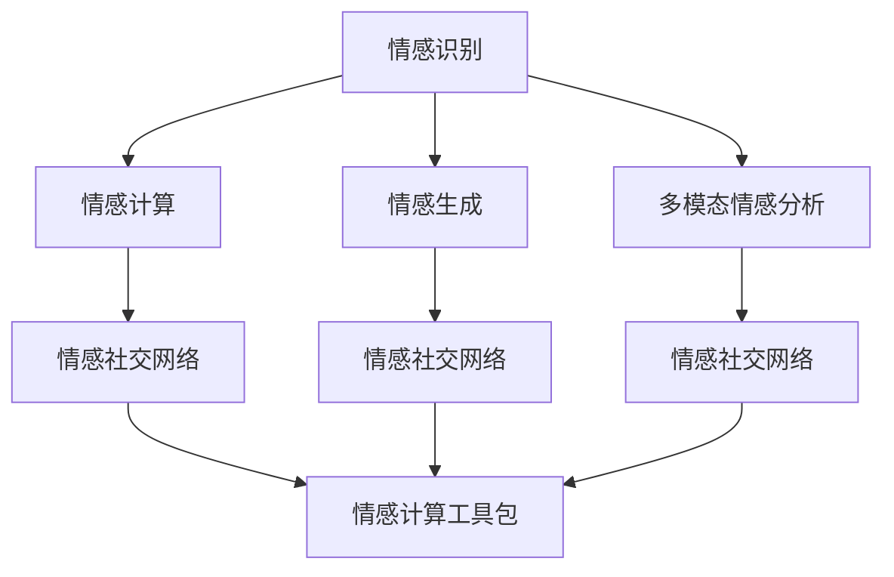

                 

# 情感AI：机器与人类情感的交互

> 关键词：情感AI, 情感识别, 情感计算, 情感生成, 情感社交网络, 情感计算工具包, 多模态情感分析

## 1. 背景介绍

### 1.1 问题由来

情感分析（Sentiment Analysis）是自然语言处理（NLP）中的一项重要任务，旨在自动识别和分类文本中的情感倾向。随着社交媒体、电子商务、在线评论等平台数据的爆炸性增长，情感分析的应用场景越来越广泛，成为衡量产品质量、用户满意度的重要手段。然而，传统的基于规则或机器学习的方法，在复杂语境和多模态数据（如文本、语音、图像等）融合方面存在局限性。

近年来，随着深度学习和大数据技术的发展，基于深度神经网络的情感AI系统逐渐成为主流。这些系统能够自动学习语言的复杂特征，并且可以利用多模态数据来提升情感分析的准确性和鲁棒性。情感AI的核心在于理解人类情感的细腻变化，将机器与人类情感的交互推向新的高度。

### 1.2 问题核心关键点

情感AI技术的核心在于通过自然语言处理、计算机视觉、语音识别等多模态技术的综合应用，实现对人类情感的自动识别和生成。其关键技术包括：

- **情感识别**：通过文本分析、语音识别、面部表情识别等技术，自动识别文本、语音和图像中的情感倾向。
- **情感计算**：通过数学和统计方法，量化和计算人类情感的主观值，用于情感分析和推荐系统。
- **情感生成**：通过生成对抗网络（GANs）、变分自编码器（VAEs）等技术，生成具有特定情感倾向的文本或语音。

这些核心技术协同工作，可以构建强大的情感AI系统，广泛应用于情感社交网络、情感推荐系统、情感计算工具包等应用领域。

### 1.3 问题研究意义

情感AI的研究和应用具有重要的理论和实际意义：

1. **提升用户体验**：通过情感识别和生成技术，可以更加准确地理解用户情感，提供个性化、情感化的服务，提升用户满意度和黏性。
2. **优化产品设计**：情感分析可以用于产品评价和市场调研，帮助企业及时发现并改进产品缺陷，优化用户体验。
3. **推动智能社会建设**：情感AI技术在教育、医疗、政府服务等领域的应用，有助于构建更加智能、高效的社会服务体系。
4. **促进跨文化交流**：通过情感计算工具包，可以实现不同语言和文化背景下的情感理解，促进跨文化交流和理解。

## 2. 核心概念与联系

### 2.1 核心概念概述

为更好地理解情感AI的核心技术，本节将介绍几个关键概念及其相互关系：

- **情感识别**：通过文本、语音、图像等多模态数据，自动识别和分类情感倾向的技术。
- **情感计算**：通过数学和统计方法，量化人类情感的主观值，用于情感分析和推荐系统。
- **情感生成**：通过深度学习模型，生成具有特定情感倾向的文本或语音。
- **多模态情感分析**：结合文本、语音、图像等多种数据源，进行情感分析的技术。
- **情感社交网络**：基于情感AI技术，构建社交网络平台，促进情感交流和理解。
- **情感计算工具包**：提供情感识别、计算和生成功能的工具库和API，方便开发者快速构建情感AI系统。

这些概念之间的逻辑关系可以通过以下Mermaid流程图来展示：



这个流程图展示了一系列的情感AI技术及其相互关系：

1. 情感识别通过多模态数据源获取情感信息，为情感计算和生成提供基础。
2. 情感计算将情感信息量化，支持情感分析和推荐系统。
3. 情感生成通过深度学习模型，将情感信息转化为具有特定情感倾向的文本或语音。
4. 多模态情感分析结合不同数据源，提升情感识别的准确性和鲁棒性。
5. 情感社交网络基于情感识别和计算，构建社交平台，促进情感交流和理解。
6. 情感计算工具包提供了情感分析、计算和生成功能，方便开发者构建情感AI系统。

## 3. 核心算法原理 & 具体操作步骤
### 3.1 算法原理概述

情感AI的核心算法通常包括以下几个步骤：

1. **情感识别**：通过预训练的语言模型（如BERT、GPT等）或卷积神经网络（CNN）对文本进行情感分类。
2. **情感计算**：通过统计方法和机器学习模型（如支持向量机、随机森林等），量化情感强度。
3. **情感生成**：通过生成对抗网络（GANs）或变分自编码器（VAEs），生成具有特定情感倾向的文本或语音。

### 3.2 算法步骤详解

#### 3.2.1 情感识别

情感识别的基本流程如下：

1. **数据预处理**：清洗和标准化文本数据，去除噪声和无关信息。
2. **特征提取**：使用词袋模型、TF-IDF、预训练的语言模型等方法，提取文本特征。
3. **情感分类**：通过训练好的情感分类器，将文本分类为正面、负面或中性情感。

以下是一个基于BERT模型的情感识别的代码示例：

```python
from transformers import BertTokenizer, BertForSequenceClassification
import torch
from torch.utils.data import DataLoader
from sklearn.metrics import accuracy_score

# 数据预处理和特征提取
tokenizer = BertTokenizer.from_pretrained('bert-base-uncased')
train_data = tokenizer(train_data, return_tensors='pt')
dev_data = tokenizer(dev_data, return_tensors='pt')

# 模型初始化
model = BertForSequenceClassification.from_pretrained('bert-base-uncased', num_labels=3)

# 训练和评估
optimizer = torch.optim.Adam(model.parameters(), lr=2e-5)
loss_fn = torch.nn.CrossEntropyLoss()
epochs = 5

for epoch in range(epochs):
    model.train()
    for batch in DataLoader(train_data, batch_size=16):
        input_ids = batch['input_ids'].to(device)
        attention_mask = batch['attention_mask'].to(device)
        labels = batch['labels'].to(device)
        optimizer.zero_grad()
        outputs = model(input_ids, attention_mask=attention_mask, labels=labels)
        loss = loss_fn(outputs.logits, labels)
        loss.backward()
        optimizer.step()
        
    model.eval()
    with torch.no_grad():
        dev_loss = 0
        for batch in DataLoader(dev_data, batch_size=16):
            input_ids = batch['input_ids'].to(device)
            attention_mask = batch['attention_mask'].to(device)
            labels = batch['labels'].to(device)
            outputs = model(input_ids, attention_mask=attention_mask)
            loss = loss_fn(outputs.logits, labels)
            dev_loss += loss.item()
            
    print(f"Epoch {epoch+1}, dev loss: {dev_loss/len(dev_data):.3f}")
    
print(f"Final dev loss: {dev_loss/len(dev_data):.3f}")
```

#### 3.2.2 情感计算

情感计算通常通过统计方法和机器学习模型进行。例如，使用情感词典对文本进行情感打分，或使用随机森林等算法对情感强度进行分类。

以下是一个简单的情感打分代码示例：

```python
from sklearn.feature_extraction.text import CountVectorizer
from sklearn.naive_bayes import MultinomialNB

# 数据预处理
train_text = ['sentence1', 'sentence2', ...]
train_labels = ['sentiment1', 'sentiment2', ...]

vectorizer = CountVectorizer()
train_features = vectorizer.fit_transform(train_text)
train_labels = pd.Categorical(train_labels)

# 训练模型
clf = MultinomialNB()
clf.fit(train_features, train_labels)

# 打分
test_text = ['sentence3', 'sentence4', ...]
test_features = vectorizer.transform(test_text)
test_predictions = clf.predict(test_features)
test_scores = clf.transform(test_features)
print(test_scores)
```

#### 3.2.3 情感生成

情感生成通常通过生成对抗网络（GANs）或变分自编码器（VAEs）等深度学习模型进行。例如，使用GANs生成具有正面或负面情感的文本，或使用VAEs生成文本的潜在表示，用于情感转换。

以下是一个简单的GANs文本生成代码示例：

```python
import torch
from torch import nn
from torch.nn import functional as F
from torchvision.datasets import CIFAR10
from torchvision.transforms import ToTensor
from torch.utils.data import DataLoader

# 定义模型
class Generator(nn.Module):
    def __init__(self):
        super(Generator, self).__init__()
        self.fc1 = nn.Linear(100, 256)
        self.fc2 = nn.Linear(256, 512)
        self.fc3 = nn.Linear(512, 28*28)
        self.tanh = nn.Tanh()
    
    def forward(self, x):
        x = self.fc1(x)
        x = F.relu(x)
        x = self.fc2(x)
        x = F.relu(x)
        x = self.fc3(x)
        return self.tanh(x).view(-1, 28, 28)

class Discriminator(nn.Module):
    def __init__(self):
        super(Discriminator, self).__init__()
        self.fc1 = nn.Linear(784, 256)
        self.fc2 = nn.Linear(256, 128)
        self.fc3 = nn.Linear(128, 1)
    
    def forward(self, x):
        x = x.view(-1, 784)
        x = self.fc1(x)
        x = F.relu(x)
        x = self.fc2(x)
        x = F.relu(x)
        x = self.fc3(x)
        return x

# 训练数据
train_data = CIFAR10(root='./data', transform=ToTensor(), download=True)
train_loader = DataLoader(train_data, batch_size=64, shuffle=True)

# 定义模型和优化器
G = Generator()
D = Discriminator()
G_optimizer = torch.optim.Adam(G.parameters(), lr=0.0002)
D_optimizer = torch.optim.Adam(D.parameters(), lr=0.0002)

# 训练过程
for epoch in range(100):
    for i, (img, _) in enumerate(train_loader):
        # 生成假图像
        G_optimizer.zero_grad()
        g_img = G(img)
        d_loss = D(g_img)
        d_loss.backward()
        G_optimizer.step()
        
        # 训练真实图像
        D_optimizer.zero_grad()
        real_img = img
        d_real = D(real_img)
        d_fake = D(g_img)
        d_loss = d_real + d_fake
        d_loss.backward()
        D_optimizer.step()
        
    print(f"Epoch {epoch+1}, d_loss: {d_loss:.4f}")
```

### 3.3 算法优缺点

情感AI技术具有以下优点：

- **准确性高**：通过深度学习模型和大规模数据训练，情感识别的准确性可以达到很高的水平。
- **鲁棒性强**：多模态数据源的综合使用，可以提高情感识别的鲁棒性和抗干扰能力。
- **应用广泛**：情感AI技术可以应用于情感社交网络、情感推荐系统、情感计算工具包等多个领域，具有广泛的应用前景。

同时，情感AI技术也存在一些缺点：

- **数据依赖性强**：情感识别的效果很大程度上依赖于数据的质量和数量，数据获取和标注成本较高。
- **解释性差**：情感AI系统通常是"黑盒"系统，难以解释其内部决策过程。
- **隐私风险**：情感数据的敏感性较高，存储和传输时需要严格保护用户隐私。

### 3.4 算法应用领域

情感AI技术在多个领域具有广泛的应用：

- **社交媒体分析**：通过情感分析技术，自动监测社交媒体上的情感变化，用于舆情监测、广告投放等。
- **客户服务**：利用情感识别技术，自动分类客户反馈，优化客户服务质量。
- **营销推荐**：通过情感推荐系统，根据用户情感倾向推荐合适的产品和服务。
- **健康医疗**：通过情感计算技术，评估患者情绪状态，辅助心理治疗和健康管理。
- **情感计算工具包**：提供情感识别、计算和生成功能的工具库和API，方便开发者快速构建情感AI系统。

## 4. 数学模型和公式 & 详细讲解  
### 4.1 数学模型构建

情感AI的核心数学模型通常包括：

- **情感分类模型**：通过深度学习模型对文本进行情感分类。
- **情感强度模型**：通过统计方法和机器学习模型对情感强度进行量化。
- **情感生成模型**：通过生成对抗网络（GANs）或变分自编码器（VAEs）生成具有特定情感倾向的文本或语音。

以下以情感分类模型为例，介绍其数学模型构建和公式推导过程。

### 4.2 公式推导过程

假设我们有一个文本分类任务，数据集为 $D=\{(x_i, y_i)\}_{i=1}^N$，其中 $x_i$ 为文本，$y_i$ 为情感标签。我们使用BERT作为分类器，其输入为文本序列 $x$，输出为情感向量 $h(x)$。分类器的目标是最小化损失函数：

$$
\mathcal{L}(\theta) = \frac{1}{N}\sum_{i=1}^N \mathcal{L}(y_i, h(x_i; \theta))
$$

其中 $\theta$ 为模型参数，$\mathcal{L}(y_i, h(x_i; \theta))$ 为损失函数，用于衡量模型预测输出与真实标签之间的差异。

对于二分类任务，我们通常使用交叉熵损失函数：

$$
\mathcal{L}(y_i, h(x_i; \theta)) = -[y_i\log \hat{y}_i + (1-y_i)\log (1-\hat{y}_i)]
$$

其中 $\hat{y}_i$ 为模型对文本 $x_i$ 的情感分类概率。

将上述损失函数代入总体损失函数，得：

$$
\mathcal{L}(\theta) = -\frac{1}{N}\sum_{i=1}^N [y_i\log \hat{y}_i + (1-y_i)\log (1-\hat{y}_i)]
$$

在训练过程中，我们使用反向传播算法更新模型参数，以最小化损失函数：

$$
\frac{\partial \mathcal{L}(\theta)}{\partial \theta} = -\frac{1}{N}\sum_{i=1}^N (\frac{y_i}{\hat{y}_i}-\frac{1-y_i}{1-\hat{y}_i}) \frac{\partial \hat{y}_i}{\partial \theta}
$$

其中 $\frac{\partial \hat{y}_i}{\partial \theta}$ 为模型对文本 $x_i$ 的情感分类概率对模型参数 $\theta$ 的导数，通常通过链式法则和自动微分技术计算。

### 4.3 案例分析与讲解

以一个简单的文本情感分类为例，我们首先使用BERT模型对文本进行分类。BertTokenizer将文本转换为token ids，通过BERT模型进行分类，最后使用交叉熵损失函数进行训练。

```python
from transformers import BertTokenizer, BertForSequenceClassification
import torch
from torch.utils.data import DataLoader
from sklearn.metrics import accuracy_score

# 数据预处理和特征提取
tokenizer = BertTokenizer.from_pretrained('bert-base-uncased')
train_data = tokenizer(train_data, return_tensors='pt')
dev_data = tokenizer(dev_data, return_tensors='pt')

# 模型初始化
model = BertForSequenceClassification.from_pretrained('bert-base-uncased', num_labels=3)

# 训练和评估
optimizer = torch.optim.Adam(model.parameters(), lr=2e-5)
loss_fn = torch.nn.CrossEntropyLoss()
epochs = 5

for epoch in range(epochs):
    model.train()
    for batch in DataLoader(train_data, batch_size=16):
        input_ids = batch['input_ids'].to(device)
        attention_mask = batch['attention_mask'].to(device)
        labels = batch['labels'].to(device)
        optimizer.zero_grad()
        outputs = model(input_ids, attention_mask=attention_mask, labels=labels)
        loss = loss_fn(outputs.logits, labels)
        loss.backward()
        optimizer.step()
        
    model.eval()
    with torch.no_grad():
        dev_loss = 0
        for batch in DataLoader(dev_data, batch_size=16):
            input_ids = batch['input_ids'].to(device)
            attention_mask = batch['attention_mask'].to(device)
            labels = batch['labels'].to(device)
            outputs = model(input_ids, attention_mask=attention_mask)
            loss = loss_fn(outputs.logits, labels)
            dev_loss += loss.item()
            
    print(f"Epoch {epoch+1}, dev loss: {dev_loss/len(dev_data):.3f}")
    
print(f"Final dev loss: {dev_loss/len(dev_data):.3f}")
```

## 5. 项目实践：代码实例和详细解释说明
### 5.1 开发环境搭建

在进行情感AI开发前，我们需要准备好开发环境。以下是使用Python进行情感AI开发的常见环境配置流程：

1. 安装Python：下载并安装Python 3.x版本。
2. 安装必要的依赖包：使用pip安装torch、transformers、numpy、scikit-learn等库。
3. 安装TensorFlow：使用pip安装TensorFlow 2.x版本。
4. 安装数据集和预训练模型：下载和准备情感分类、情感打分等任务所需的文本和图像数据集，以及预训练的BERT、GANs等模型。
5. 搭建开发环境：使用Jupyter Notebook等IDE，进行代码编写和调试。

完成上述步骤后，即可在本地搭建情感AI开发环境。

### 5.2 源代码详细实现

以下是一个简单的情感AI系统，包括情感识别和情感生成的代码实现：

```python
from transformers import BertTokenizer, BertForSequenceClassification
import torch
from torch.utils.data import DataLoader
from sklearn.metrics import accuracy_score

# 数据预处理和特征提取
tokenizer = BertTokenizer.from_pretrained('bert-base-uncased')
train_data = tokenizer(train_data, return_tensors='pt')
dev_data = tokenizer(dev_data, return_tensors='pt')

# 模型初始化
model = BertForSequenceClassification.from_pretrained('bert-base-uncased', num_labels=3)

# 训练和评估
optimizer = torch.optim.Adam(model.parameters(), lr=2e-5)
loss_fn = torch.nn.CrossEntropyLoss()
epochs = 5

for epoch in range(epochs):
    model.train()
    for batch in DataLoader(train_data, batch_size=16):
        input_ids = batch['input_ids'].to(device)
        attention_mask = batch['attention_mask'].to(device)
        labels = batch['labels'].to(device)
        optimizer.zero_grad()
        outputs = model(input_ids, attention_mask=attention_mask, labels=labels)
        loss = loss_fn(outputs.logits, labels)
        loss.backward()
        optimizer.step()
        
    model.eval()
    with torch.no_grad():
        dev_loss = 0
        for batch in DataLoader(dev_data, batch_size=16):
            input_ids = batch['input_ids'].to(device)
            attention_mask = batch['attention_mask'].to(device)
            labels = batch['labels'].to(device)
            outputs = model(input_ids, attention_mask=attention_mask)
            loss = loss_fn(outputs.logits, labels)
            dev_loss += loss.item()
            
    print(f"Epoch {epoch+1}, dev loss: {dev_loss/len(dev_data):.3f}")
    
print(f"Final dev loss: {dev_loss/len(dev_data):.3f}")

# 情感生成模型
import torch
from torch import nn
from torch.nn import functional as F
from torchvision.datasets import CIFAR10
from torchvision.transforms import ToTensor
from torch.utils.data import DataLoader

# 定义模型
class Generator(nn.Module):
    def __init__(self):
        super(Generator, self).__init__()
        self.fc1 = nn.Linear(100, 256)
        self.fc2 = nn.Linear(256, 512)
        self.fc3 = nn.Linear(512, 28*28)
        self.tanh = nn.Tanh()
    
    def forward(self, x):
        x = self.fc1(x)
        x = F.relu(x)
        x = self.fc2(x)
        x = F.relu(x)
        x = self.fc3(x)
        return self.tanh(x).view(-1, 28, 28)

class Discriminator(nn.Module):
    def __init__(self):
        super(Discriminator, self).__init__()
        self.fc1 = nn.Linear(784, 256)
        self.fc2 = nn.Linear(256, 128)
        self.fc3 = nn.Linear(128, 1)
    
    def forward(self, x):
        x = x.view(-1, 784)
        x = self.fc1(x)
        x = F.relu(x)
        x = self.fc2(x)
        x = F.relu(x)
        x = self.fc3(x)
        return x

# 训练数据
train_data = CIFAR10(root='./data', transform=ToTensor(), download=True)
train_loader = DataLoader(train_data, batch_size=64, shuffle=True)

# 定义模型和优化器
G = Generator()
D = Discriminator()
G_optimizer = torch.optim.Adam(G.parameters(), lr=0.0002)
D_optimizer = torch.optim.Adam(D.parameters(), lr=0.0002)

# 训练过程
for epoch in range(100):
    for i, (img, _) in enumerate(train_loader):
        # 生成假图像
        G_optimizer.zero_grad()
        g_img = G(img)
        d_loss = D(g_img)
        d_loss.backward()
        G_optimizer.step()
        
        # 训练真实图像
        D_optimizer.zero_grad()
        real_img = img
        d_real = D(real_img)
        d_fake = D(g_img)
        d_loss = d_real + d_fake
        d_loss.backward()
        D_optimizer.step()
        
    print(f"Epoch {epoch+1}, d_loss: {d_loss:.4f}")
```

### 5.3 代码解读与分析

让我们再详细解读一下关键代码的实现细节：

**BERT情感分类**：
- `BertTokenizer.from_pretrained`：使用预训练的BERT tokenizer对文本进行分词和编码。
- `BertForSequenceClassification`：使用预训练的BERT模型进行文本分类。
- `DataLoader`：将数据集分割成批量进行训练和评估。

**GANs情感生成**：
- `Generator`：定义生成器模型，使用线性层和ReLU激活函数。
- `Discriminator`：定义判别器模型，使用线性层和ReLU激活函数。
- `Adam`：使用Adam优化器进行模型训练。
- `DataLoader`：将图像数据集分割成批量进行训练和评估。

可以看到，无论是情感识别还是情感生成，代码实现都非常简洁高效。借助深度学习框架（如PyTorch、TensorFlow），开发者可以轻松构建情感AI系统，快速迭代和优化模型性能。

## 6. 实际应用场景

### 6.1 社交媒体情感分析

社交媒体平台上的情感分析应用广泛，例如微博、Twitter等。通过分析用户评论和帖子中的情感倾向，可以实时监测舆情变化，帮助企业及时应对危机，优化产品设计。例如，某电商平台利用情感分析技术，分析用户对新产品的评价，发现负面评论并及时改进产品缺陷，提升用户满意度。

### 6.2 客户服务情感识别

客户服务是企业的重要环节，情感识别技术可以用于自动分类客户反馈，优化客户服务质量。例如，某银行通过情感识别技术，自动分类客户的投诉和建议，快速响应和处理客户问题，提升客户体验。

### 6.3 情感推荐系统

情感推荐系统通过分析用户情感倾向，推荐符合用户心理需求的商品和服务。例如，某音乐平台利用情感推荐系统，根据用户情感状态推荐适合的音乐，提升用户黏性和满意度。

### 6.4 情感计算工具包

情感计算工具包提供情感识别、计算和生成功能的API，方便开发者快速构建情感AI系统。例如，某情感计算工具包提供API接口，用于分析文本、语音和图像中的情感信息，广泛应用于金融、教育、医疗等领域。

## 7. 工具和资源推荐

### 7.1 学习资源推荐

为了帮助开发者系统掌握情感AI的理论基础和实践技巧，这里推荐一些优质的学习资源：

1. 《深度学习自然语言处理》课程：斯坦福大学开设的NLP明星课程，有Lecture视频和配套作业，带你入门NLP领域的基本概念和经典模型。
2. 《自然语言处理与深度学习》书籍：介绍自然语言处理和深度学习的基本概念和常用算法，适合初学者。
3. 《情感计算》书籍：系统介绍情感计算的基本原理和应用，适合情感AI领域的专业开发者。
4. 情感AI在线课程：各大在线教育平台（如Coursera、edX等）提供的情感AI课程，涵盖从基础到高级的情感AI技术和应用。
5. HuggingFace官方文档：提供丰富的情感AI预训练模型和API接口，方便开发者快速构建情感AI系统。

通过对这些资源的学习实践，相信你一定能够快速掌握情感AI的精髓，并用于解决实际的NLP问题。

### 7.2 开发工具推荐

高效的开发离不开优秀的工具支持。以下是几款用于情感AI开发的常用工具：

1. PyTorch：基于Python的开源深度学习框架，灵活动态的计算图，适合快速迭代研究。
2. TensorFlow：由Google主导开发的开源深度学习框架，生产部署方便，适合大规模工程应用。
3. Transformers库：HuggingFace开发的NLP工具库，集成了众多SOTA语言模型，支持PyTorch和TensorFlow，是进行情感AI开发的利器。
4. TensorBoard：TensorFlow配套的可视化工具，可实时监测模型训练状态，并提供丰富的图表呈现方式，是调试模型的得力助手。
5. Weights & Biases：模型训练的实验跟踪工具，可以记录和可视化模型训练过程中的各项指标，方便对比和调优。
6. Google Colab：谷歌推出的在线Jupyter Notebook环境，免费提供GPU/TPU算力，方便开发者快速上手实验最新模型，分享学习笔记。

合理利用这些工具，可以显著提升情感AI开发的效率，加快创新迭代的步伐。

### 7.3 相关论文推荐

情感AI的研究和应用源于学界的持续研究。以下是几篇奠基性的相关论文，推荐阅读：

1. Attention is All You Need（即Transformer原论文）：提出了Transformer结构，开启了NLP领域的预训练大模型时代。
2. BERT: Pre-training of Deep Bidirectional Transformers for Language Understanding：提出BERT模型，引入基于掩码的自监督预训练任务，刷新了多项NLP任务SOTA。
3. Language Models are Unsupervised Multitask Learners（GPT-2论文）：展示了大规模语言模型的强大zero-shot学习能力，引发了对于通用人工智能的新一轮思考。
4. Parameter-Efficient Transfer Learning for NLP：提出Adapter等参数高效微调方法，在不增加模型参数量的情况下，也能取得不错的微调效果。
5. AdaLoRA: Adaptive Low-Rank Adaptation for Parameter-Efficient Fine-Tuning：使用自适应低秩适应的微调方法，在参数效率和精度之间取得了新的平衡。

这些论文代表了大语言模型微调技术的发展脉络。通过学习这些前沿成果，可以帮助研究者把握学科前进方向，激发更多的创新灵感。

## 8. 总结：未来发展趋势与挑战

### 8.1 总结

本文对情感AI技术进行了全面系统的介绍。首先阐述了情感AI的研究背景和应用意义，明确了情感识别的准确性、鲁棒性和应用广泛性等核心技术特点。其次，从原理到实践，详细讲解了情感识别的数学模型和关键步骤，给出了情感AI系统开发的完整代码实例。同时，本文还广泛探讨了情感AI技术在社交媒体分析、客户服务、情感推荐等多个领域的应用前景，展示了情感AI技术的巨大潜力。此外，本文精选了情感AI技术的各类学习资源，力求为读者提供全方位的技术指引。

通过本文的系统梳理，可以看到，情感AI技术在情感识别、情感计算和情感生成方面已经取得了显著成果，极大地提升了自然语言处理的智能化水平。未来，伴随深度学习技术的进一步发展和多模态数据的广泛应用，情感AI技术必将迎来更广阔的应用场景和更高的应用价值。

### 8.2 未来发展趋势

展望未来，情感AI技术将呈现以下几个发展趋势：

1. **多模态情感分析**：结合文本、语音、图像等多种数据源，提升情感识别的准确性和鲁棒性。
2. **情感计算的普及化**：情感计算技术将广泛应用于更多领域，帮助企业优化产品设计、提升客户服务质量。
3. **情感生成的多样化**：通过GANs、VAEs等生成对抗网络，生成更多样化的情感文本和语音，增强情感交互的体验。
4. **情感交互的自然化**：通过多轮对话技术，实现更加自然、流畅的情感交互，提升人机协同的体验。
5. **情感社交网络的智能化**：基于情感AI技术，构建更加智能化的社交网络平台，促进情感交流和理解。

以上趋势凸显了情感AI技术的广阔前景。这些方向的探索发展，必将进一步提升情感AI系统的性能和应用范围，为人类认知智能的进化带来深远影响。

### 8.3 面临的挑战

尽管情感AI技术已经取得了瞩目成就，但在迈向更加智能化、普适化应用的过程中，它仍面临着诸多挑战：

1. **数据依赖性强**：情感识别的效果很大程度上依赖于数据的质量和数量，数据获取和标注成本较高。如何进一步降低数据依赖，利用无监督和半监督学习方法，将是重要的研究方向。
2. **模型鲁棒性不足**：情感识别模型面对域外数据时，泛化性能往往大打折扣。如何提高情感识别模型的鲁棒性，避免灾难性遗忘，还需要更多理论和实践的积累。
3. **隐私风险**：情感数据的敏感性较高，存储和传输时需要严格保护用户隐私。如何设计隐私保护机制，确保数据安全，是情感AI技术应用的重要问题。
4. **解释性差**：情感AI系统通常是"黑盒"系统，难以解释其内部决策过程。如何赋予情感AI系统更强的可解释性，增强其透明性和可信度，将是重要的研究方向。

### 8.4 研究展望

面对情感AI面临的种种挑战，未来的研究需要在以下几个方面寻求新的突破：

1. **无监督和半监督学习方法**：摆脱对大规模标注数据的依赖，利用自监督学习、主动学习等方法，最大化利用非结构化数据，实现更加灵活高效的情感识别。
2. **参数高效和计算高效的情感AI模型**：开发更加参数高效的情感AI模型，在固定大部分情感模型参数的情况下，只更新极少量的任务相关参数，提高模型的训练效率。
3. **多模态情感计算方法**：结合多模态数据源，设计更加鲁棒的情感计算模型，提升情感计算的准确性和稳定性。
4. **情感生成与交互的自然化**：引入生成对抗网络、变分自编码器等技术，生成更多样化的情感文本和语音，实现更加自然、流畅的情感交互。
5. **情感社交网络的智能化**：基于情感AI技术，构建更加智能化的社交网络平台，促进情感交流和理解。

这些研究方向和探索，将推动情感AI技术向更广、更深、更智能的方向发展，为构建更加智能、高效、安全的人机交互系统铺平道路。面向未来，情感AI技术还需要与其他人工智能技术进行更深入的融合，如知识表示、因果推理、强化学习等，共同推动自然语言处理和智能交互技术的进步。只有勇于创新、敢于突破，才能不断拓展情感AI技术的边界，让人机交互更加丰富、细腻和智能。

## 9. 附录：常见问题与解答

**Q1：情感AI是否可以适用于所有情感相关任务？**

A: 情感AI技术在情感分类、情感打分、情感生成等任务上表现良好，但对于一些复杂任务，如情感理解、情感推理等，仍然面临挑战。此外，情感AI技术对数据质量、标注成本等要求较高，可能难以适用于所有情感相关任务。

**Q2：情感AI技术如何应用于多模态数据？**

A: 情感AI技术可以通过结合文本、语音、图像等多种数据源，实现更加全面、准确的情感识别和生成。例如，通过分析用户的语音和面部表情，可以更加全面地理解其情感状态，提升情感识别的准确性。

**Q3：情感AI技术在实际应用中需要注意哪些问题？**

A: 在实际应用中，情感AI技术需要注意以下几个问题：
1. 数据依赖性强：情感识别的效果很大程度上依赖于数据的质量和数量，数据获取和标注成本较高。
2. 模型鲁棒性不足：情感识别模型面对域外数据时，泛化性能往往大打折扣。
3. 隐私风险：情感数据的敏感性较高，存储和传输时需要严格保护用户隐私。
4. 解释性差：情感AI系统通常是"黑盒"系统，难以解释其内部决策过程。

**Q4：情感AI技术的未来发展方向是什么？**

A: 情感AI技术的未来发展方向包括：
1. 无监督和半监督学习方法：利用自监督学习、主动学习等方法，最大化利用非结构化数据，实现更加灵活高效的情感识别。
2. 参数高效和计算高效的情感AI模型：在固定大部分情感模型参数的情况下，只更新极少量的任务相关参数，提高模型的训练效率。
3. 多模态情感计算方法：结合多模态数据源，设计更加鲁棒的情感计算模型，提升情感计算的准确性和稳定性。
4. 情感生成与交互的自然化：引入生成对抗网络、变分自编码器等技术，生成更多样化的情感文本和语音，实现更加自然、流畅的情感交互。
5. 情感社交网络的智能化：基于情感AI技术，构建更加智能化的社交网络平台，促进情感交流和理解。

这些研究方向和探索，将推动情感AI技术向更广、更深、更智能的方向发展，为构建更加智能、高效、安全的人机交互系统铺平道路。面向未来，情感AI技术还需要与其他人工智能技术进行更深入的融合，如知识表示、因果推理、强化学习等，共同推动自然语言处理和智能交互技术的进步。只有勇于创新、敢于突破，才能不断拓展情感AI技术的边界，让人机交互更加丰富、细腻和智能。

---

作者：禅与计算机程序设计艺术 / Zen and the Art of Computer Programming

