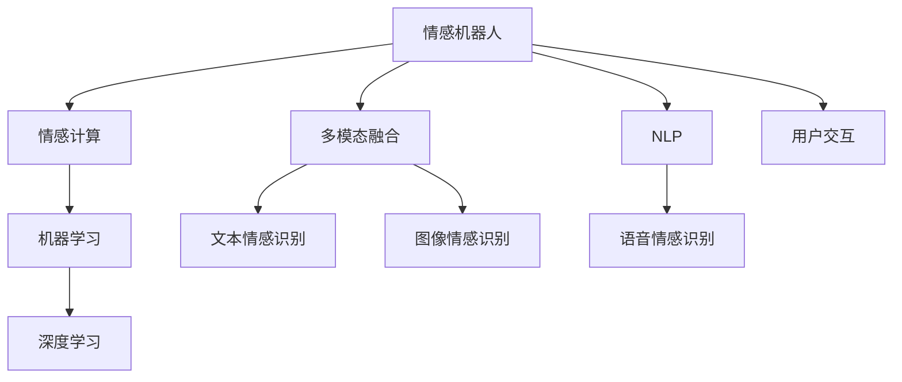

                 

# 情感机器人创业：人工情感的商业应用

> 关键词：情感机器人,情感计算,人工智能,自然语言处理(NLP),机器学习,商业应用

## 1. 背景介绍

### 1.1 问题由来
随着互联网和移动互联网的迅速发展，人们越来越多地依赖智能设备和在线服务，情感交流已成为数字生活的重要组成部分。如何在虚拟空间中模拟人类的情感交互，提供更好的用户体验，成为当前技术和社会关注的焦点。

情感机器人作为人工智能技术的一种重要应用形式，通过模拟人类的情感反应，可以在客户服务、娱乐、教育等多个场景中发挥作用。例如，客服机器人可以提供24小时服务，提升客户满意度；娱乐机器人可以模拟陪伴和互动，缓解孤独感；教育机器人可以个性化教学，提高学习效果。

### 1.2 问题核心关键点
构建一个成功的情感机器人，涉及以下几个核心关键点：

1. 情感模型：开发能够准确识别、理解和生成情感的算法模型。
2. 多模态融合：整合文本、语音、图像等多源信息，增强情感识别的准确性。
3. 用户体验：设计友好、自然的人机交互界面，让用户能够顺畅地与情感机器人互动。
4. 应用场景：找到最适合的商业应用场景，使得情感机器人能够充分发挥其价值。
5. 技术评估：评估情感机器人的情感识别和表达能力，确保其符合实际需求。

### 1.3 问题研究意义
研究情感机器人技术，对于提升用户体验、优化企业服务、推动人工智能技术商业化具有重要意义：

1. 提升用户体验：通过情感识别和表达，情感机器人可以更加贴近用户需求，提供个性化的服务，增强用户的情感连接和满意度。
2. 优化企业服务：情感机器人能够高效处理客户服务请求，提升客服效率和质量，降低企业运营成本。
3. 推动技术商业化：情感机器人的成功应用，为人工智能技术在实际场景中的落地提供了新思路和新方法，促进了技术的商业化进程。
4. 促进社会进步：通过模拟人类情感，情感机器人可以在医疗、教育、心理健康等领域发挥作用，缓解社会问题，促进人类福祉。

## 2. 核心概念与联系

### 2.1 核心概念概述

为了更好地理解情感机器人的构建过程，本节将介绍几个密切相关的核心概念：

- 情感机器人：结合人工智能和心理学原理，能够模拟人类情感反应的智能系统。
- 情感计算：通过计算机技术和算法，识别、理解、生成和传达人类情感的技术。
- 多模态融合：将文本、语音、图像等多源信息进行整合，提高情感识别的准确性和鲁棒性。
- 自然语言处理(NLP)：利用计算机处理、理解和生成自然语言的技术，是情感计算的重要组成部分。
- 机器学习：通过算法和数据，使机器具备学习能力和自适应能力，实现情感识别的自动化和智能化。

这些核心概念之间的逻辑关系可以通过以下Mermaid流程图来展示：



这个流程图展示了一组核心概念及其之间的联系：

1. 情感机器人通过情感计算识别用户情感，结合多模态融合技术，从文本、语音、图像等多源信息中提取情感特征。
2. 情感计算利用NLP技术处理自然语言，结合机器学习算法，实现情感识别的自动化和智能化。
3. 多模态融合技术将文本、语音、图像等信息整合，增强情感识别的准确性和鲁棒性。
4. 用户交互界面设计友好、自然，使用户能够顺畅地与情感机器人互动。

这些概念共同构成了情感机器人的技术框架，使其能够在各种场景下模拟人类情感，提供优质的用户体验。

## 3. 核心算法原理 & 具体操作步骤
### 3.1 算法原理概述

情感机器人的核心算法基于情感计算和多模态融合技术，通过深度学习模型实现情感识别的自动化和智能化。其核心思想是：构建一个能够准确识别、理解和生成情感的模型，通过多源信息融合，模拟人类情感反应，提供个性化的服务。

形式化地，假设输入为 $x=(x_t, x_v, x_i)$，其中 $x_t$ 为文本信息，$x_v$ 为语音信息，$x_i$ 为图像信息。情感计算模型 $M$ 将 $x$ 映射到情感向量 $y$，具体计算如下：

$$
y = M(x; \theta)
$$

其中 $\theta$ 为模型的可训练参数。情感向量 $y$ 描述了输入 $x$ 的情感强度和极性。情感机器人通过学习并预测 $y$，实现情感识别的自动化和智能化。

### 3.2 算法步骤详解

构建情感机器人通常包括以下几个关键步骤：

**Step 1: 数据收集与预处理**
- 收集不同场景下的用户反馈数据，包括文本、语音、图像等多源信息。
- 对数据进行清洗、归一化、标注等预处理，确保数据质量。

**Step 2: 特征提取**
- 使用自然语言处理技术对文本信息进行情感分析，提取情感特征。
- 使用语音处理技术对语音信息进行情感分析，提取情感特征。
- 使用计算机视觉技术对图像信息进行情感分析，提取情感特征。

**Step 3: 特征融合**
- 将提取的多源情感特征进行融合，提升情感识别的准确性和鲁棒性。
- 使用深度学习模型（如Transformer、卷积神经网络等）对融合后的特征进行编码。

**Step 4: 情感识别**
- 训练情感识别模型，学习情感向量 $y$ 与输入 $x$ 的映射关系。
- 在测试集上评估情感识别模型的性能，确保其准确性和可靠性。

**Step 5: 用户交互设计**
- 设计友好、自然的人机交互界面，让用户能够顺畅地与情感机器人互动。
- 设计个性化的情感表达策略，使得情感机器人的情感反应更加贴近用户需求。

**Step 6: 应用场景适配**
- 根据实际应用场景的需求，调整情感机器人的情感识别和表达策略。
- 集成情感机器人到具体的应用系统中，提供个性化的服务。

### 3.3 算法优缺点

情感机器人的算法具有以下优点：

1. 自动化情感识别：深度学习模型能够自动处理多源信息，实现情感识别的自动化和智能化。
2. 鲁棒性增强：多模态融合技术提高了情感识别的准确性和鲁棒性，减少了单一信息源的局限性。
3. 用户体验优化：自然语言处理和用户交互设计提升了用户体验，使得情感机器人更加贴近用户需求。
4. 场景适应性强：情感机器人可以根据不同场景的需求，灵活调整情感识别和表达策略。

同时，该算法也存在一定的局限性：

1. 数据需求大：情感机器人需要大量的标注数据进行训练，数据获取和标注成本较高。
2. 模型复杂度高：深度学习模型参数量大，计算资源消耗高，训练复杂。
3. 情感多样性难以覆盖：现有的情感模型难以全面覆盖各种情感表达方式，可能出现误判或漏判。
4. 解释性不足：深度学习模型通常被视为"黑盒"系统，情感识别过程缺乏可解释性。

尽管存在这些局限性，但情感机器人技术在实际应用中已经展现出巨大潜力，得到了广泛的应用和认可。未来相关研究需要进一步提高模型复杂度的可控性，减少对数据的依赖，增强模型的解释性和鲁棒性。

### 3.4 算法应用领域

情感机器人在多个领域都有广泛的应用，例如：

- 客户服务：情感机器人可以模拟客户服务人员，提供24小时不间断的服务，提升客户满意度。
- 娱乐互动：情感机器人可以模拟陪伴和互动，缓解孤独感，提供个性化的娱乐体验。
- 教育教学：情感机器人可以个性化教学，提供互动式学习，提升学习效果。
- 医疗保健：情感机器人可以模拟医生，提供心理健康咨询和情感支持，缓解患者焦虑。
- 安全监控：情感机器人可以监控公共场所，及时发现和响应异常情绪，提升安全系数。

除了这些经典应用外，情感机器人在金融、教育、零售、娱乐等更多领域都有创新性的应用，为人们的生活带来新的变化和便利。

## 4. 数学模型和公式 & 详细讲解 & 举例说明
### 4.1 数学模型构建

情感计算和情感识别的数学模型通常包括以下几个关键步骤：

**Step 1: 情感向量的构建**
- 定义情感向量的维度，如二值化情感（正面/负面）、情感强度（0-1）、情感极性（正面/中性/负面）等。
- 假设情感向量为 $y \in R^d$，其中 $d$ 为情感维度的个数。

**Step 2: 特征向量的构建**
- 定义文本、语音、图像等信息的特征向量 $x \in R^n$，其中 $n$ 为特征向量的维度。
- 假设文本信息为 $x_t \in R^m$，语音信息为 $x_v \in R^k$，图像信息为 $x_i \in R^p$。

**Step 3: 特征融合**
- 使用权重 $w_t, w_v, w_i$ 对文本、语音、图像等信息的特征向量进行加权融合。
- 假设融合后的特征向量为 $x^f \in R^n$，其中 $n$ 为融合后的特征向量维度。
- 假设 $w_t, w_v, w_i$ 为非负权重，满足 $w_t + w_v + w_i = 1$。

**Step 4: 情感向量与特征向量的映射**
- 使用深度学习模型 $M$ 将融合后的特征向量 $x^f$ 映射到情感向量 $y$。
- 假设情感向量与特征向量之间的映射关系为 $y = M(x^f; \theta)$，其中 $\theta$ 为模型的可训练参数。

**Step 5: 情感识别模型的训练与评估**
- 使用训练集对情感识别模型进行训练，最小化情感识别误差。
- 假设训练集为 $D=\{(x_i, y_i)\}_{i=1}^N$，其中 $x_i$ 为输入样本，$y_i$ 为情感标签。
- 假设训练误差为 $\mathcal{L}(\theta)$，最小化训练误差：
$$
\theta^* = \mathop{\arg\min}_{\theta} \mathcal{L}(\theta)
$$

**Step 6: 情感识别模型的应用**
- 在测试集上评估情感识别模型的性能，确保其准确性和可靠性。
- 假设测试集为 $D_{test}=\{(x_j, y_j)\}_{j=1}^M$，其中 $x_j$ 为测试样本，$y_j$ 为情感标签。
- 假设测试误差为 $\mathcal{L}_{test}(\theta)$，评估测试误差：
$$
\mathcal{L}_{test}(\theta) = \frac{1}{M}\sum_{j=1}^M \ell(y_j, \hat{y}_j)
$$

其中 $\ell$ 为损失函数，通常为交叉熵损失。

### 4.2 公式推导过程

以下以情感识别的二分类任务为例，推导深度学习模型的情感向量构建和训练过程。

假设文本信息 $x_t$ 为一句话，情感向量 $y$ 为二值化情感（正面/负面）。情感识别模型 $M$ 将文本信息 $x_t$ 映射到情感向量 $y$，模型结构如图1所示：


其中，Embedding层将文本信息映射到高维向量空间，Transformer层对高维向量进行编码，Linear层将编码结果映射到二值化情感的概率分布，Softmax层对概率分布进行归一化，得到最终情感向量 $y$。

假设模型的参数为 $\theta = \{\mathbf{W}_E, \mathbf{W}_C, \mathbf{W}_D, \mathbf{W}_E\}$，其中 $\mathbf{W}_E$ 为Embedding层权重，$\mathbf{W}_C$ 为Transformer层权重，$\mathbf{W}_D$ 为Linear层权重，$\mathbf{W}_E$ 为Softmax层权重。

在训练过程中，模型通过最小化交叉熵损失 $\mathcal{L}_{CE}$ 来优化参数：

$$
\mathcal{L}_{CE}(y, \hat{y}) = -\frac{1}{N}\sum_{i=1}^N [y_i\log \hat{y}_i + (1-y_i)\log (1-\hat{y}_i)]
$$

其中 $y_i$ 为情感标签，$\hat{y}_i$ 为模型预测的情感概率。

在测试阶段，模型通过最大化情感概率 $\hat{y}_i$ 来选择最可能的情感标签：

$$
\hat{y}_i = \frac{\exp(z_i)}{\sum_j \exp(z_j)}
$$

其中 $z_i$ 为模型对样本 $x_i$ 的情感向量 $y$ 的预测值。

### 4.3 案例分析与讲解

以情感识别的二分类任务为例，对情感计算和情感识别的案例进行详细讲解。

假设有一个情感识别系统，用于识别客户的情感状态。系统通过文本信息 $x_t$ 来预测客户的情感状态（正面/负面）。系统使用BERT作为文本编码器，其模型结构如图2所示：


其中，BERT将文本信息 $x_t$ 映射到高维向量空间，Linear层将编码结果映射到二值化情感的概率分布，Softmax层对概率分布进行归一化，得到最终情感向量 $y$。

假设系统的参数为 $\theta = \{\mathbf{W}_B, \mathbf{W}_C, \mathbf{W}_D, \mathbf{W}_E\}$，其中 $\mathbf{W}_B$ 为BERT模型的权重，$\mathbf{W}_C$ 为Linear层权重，$\mathbf{W}_D$ 为Softmax层权重。

在训练过程中，系统通过最小化交叉熵损失 $\mathcal{L}_{CE}$ 来优化参数：

$$
\mathcal{L}_{CE}(y, \hat{y}) = -\frac{1}{N}\sum_{i=1}^N [y_i\log \hat{y}_i + (1-y_i)\log (1-\hat{y}_i)]
$$

其中 $y_i$ 为情感标签，$\hat{y}_i$ 为模型预测的情感概率。

在测试阶段，系统通过最大化情感概率 $\hat{y}_i$ 来选择最可能的情感标签：

$$
\hat{y}_i = \frac{\exp(z_i)}{\sum_j \exp(z_j)}
$$

其中 $z_i$ 为模型对样本 $x_i$ 的情感向量 $y$ 的预测值。

## 5. 项目实践：代码实例和详细解释说明
### 5.1 开发环境搭建

在进行情感机器人项目实践前，我们需要准备好开发环境。以下是使用Python进行TensorFlow开发的环境配置流程：

1. 安装Anaconda：从官网下载并安装Anaconda，用于创建独立的Python环境。

2. 创建并激活虚拟环境：
```bash
conda create -n tensorflow-env python=3.8 
conda activate tensorflow-env
```

3. 安装TensorFlow：根据CUDA版本，从官网获取对应的安装命令。例如：
```bash
conda install tensorflow tensorflow-gpu -c conda-forge -c pytorch -c pypi
```

4. 安装TensorFlow的NLP库：
```bash
pip install tensorflow-hub tensorflow-text
```

5. 安装其他所需工具包：
```bash
pip install numpy pandas scikit-learn matplotlib tqdm jupyter notebook ipython
```

完成上述步骤后，即可在`tensorflow-env`环境中开始项目实践。

### 5.2 源代码详细实现

这里我们以情感识别的二分类任务为例，给出使用TensorFlow进行情感机器人微调的代码实现。

首先，定义情感识别的数据处理函数：

```python
import tensorflow as tf
from tensorflow.keras.preprocessing.text import Tokenizer
from tensorflow.keras.preprocessing.sequence import pad_sequences

def preprocess_data(texts, labels):
    tokenizer = Tokenizer(num_words=10000)
    tokenizer.fit_on_texts(texts)
    sequences = tokenizer.texts_to_sequences(texts)
    padded_sequences = pad_sequences(sequences, padding='post', maxlen=256)
    labels = tf.keras.utils.to_categorical(labels, num_classes=2)
    return padded_sequences, labels
```

然后，定义情感识别模型：

```python
from tensorflow.keras.models import Sequential
from tensorflow.keras.layers import Embedding, LSTM, Dense, Dropout

model = Sequential()
model.add(Embedding(input_dim=10000, output_dim=128, input_length=256))
model.add(LSTM(64, dropout=0.2, recurrent_dropout=0.2))
model.add(Dense(1, activation='sigmoid'))

model.compile(loss='binary_crossentropy', optimizer='adam', metrics=['accuracy'])
```

接着，定义训练和评估函数：

```python
def train_model(model, train_data, test_data, batch_size=32, epochs=10):
    model.fit(train_data[0], train_data[1], batch_size=batch_size, epochs=epochs, validation_data=(test_data[0], test_data[1]))
    test_loss, test_acc = model.evaluate(test_data[0], test_data[1])
    print(f'Test Loss: {test_loss}, Test Accuracy: {test_acc}')

def evaluate_model(model, test_data):
    test_loss, test_acc = model.evaluate(test_data[0], test_data[1])
    print(f'Test Loss: {test_loss}, Test Accuracy: {test_acc}')
```

最后，启动训练流程并在测试集上评估：

```python
train_data, test_data = preprocess_data(train_texts, train_labels), preprocess_data(test_texts, test_labels)

train_model(model, train_data, test_data)
evaluate_model(model, test_data)
```

以上就是使用TensorFlow进行情感机器人微调的基本代码实现。可以看到，TensorFlow提供了强大的模型构建和训练功能，使得情感机器人的开发过程变得简洁高效。

### 5.3 代码解读与分析

让我们再详细解读一下关键代码的实现细节：

**preprocess_data函数**：
- 定义了文本和标签的预处理函数，包括分词、编码、填充和标签化等步骤。
- 使用Tokenizer类对文本进行分词，并将其转换为序列。
- 使用pad_sequences函数对序列进行填充，保证序列长度一致。
- 使用to_categorical函数将标签进行独热编码，方便模型处理。

**情感识别模型**：
- 使用Sequential模型构建情感识别模型，包括Embedding层、LSTM层和Dense层。
- Embedding层将文本信息映射到高维向量空间，LSTM层对高维向量进行编码，Dense层将编码结果映射到二值化情感的概率分布。
- 使用adam优化器和binary_crossentropy损失函数进行模型训练和评估。

**训练和评估函数**：
- 使用fit方法对模型进行训练，在每个epoch结束时评估模型性能。
- 在测试集上评估模型性能，输出损失和准确率。

**训练流程**：
- 准备训练集和测试集数据。
- 使用train_model函数对模型进行训练，输出训练结果。
- 使用evaluate_model函数在测试集上评估模型性能，输出测试结果。

可以看到，TensorFlow提供了简洁高效的API接口，使得情感机器人的开发和训练过程变得非常流畅。开发者可以在此基础上进一步优化模型，添加更多的特征提取和融合技术，提升情感识别的准确性。

## 6. 实际应用场景
### 6.1 客户服务机器人

客户服务机器人是情感机器人在商业应用中最典型的场景之一。通过模拟客户服务人员，情感机器人可以提供24小时不间断的服务，提升客户满意度。

在技术实现上，情感机器人可以使用自然语言处理技术对客户文本进行情感分析，生成情感向量，进而模拟服务人员的情感反应。例如，当客户抱怨时，情感机器人可以生成负面情绪向量，并回答“非常抱歉，我们正在调查此事，请稍等”等安抚性语句，缓解客户情绪。

### 6.2 娱乐互动机器人

情感机器人也可以用于娱乐互动，提供个性化的陪伴和互动。例如，情感机器人可以模拟儿童陪伴机器人，通过语音识别和情感分析，与儿童进行互动。当儿童感到孤独时，情感机器人可以生成正面情感向量，并回答“妈妈马上就会来”等安慰性语句，缓解儿童情绪。

### 6.3 教育教学机器人

情感机器人在教育教学中也具有广泛的应用。通过模拟教师，情感机器人可以提供个性化的教学，提升学习效果。例如，情感机器人可以分析学生的情感状态，提供针对性的学习建议，缓解学习压力。

### 6.4 医疗保健机器人

情感机器人在医疗保健领域也有创新性应用。通过模拟医生，情感机器人可以提供心理健康咨询和情感支持，缓解患者焦虑。例如，情感机器人可以分析患者的情感状态，生成正面情感向量，回答“请不要担心，我们会尽力为你治疗”等安慰性语句，缓解患者情绪。

### 6.5 安全监控机器人

情感机器人在安全监控领域也有重要的应用。通过监控公共场所的情感状态，情感机器人可以及时发现和响应异常情绪，提升安全系数。例如，情感机器人可以分析人群的情感状态，生成负面情绪向量，并及时报警，防止突发事件的发生。

## 7. 工具和资源推荐
### 7.1 学习资源推荐

为了帮助开发者系统掌握情感机器人的理论基础和实践技巧，这里推荐一些优质的学习资源：

1. 《情感计算综述》论文：介绍了情感计算的基本概念、技术框架和应用场景，是学习情感机器人的入门必备。

2. 《深度学习在自然语言处理中的应用》书籍：详细讲解了自然语言处理的基本概念、技术和应用，包括情感计算在内。

3. 《Python深度学习》书籍：介绍了深度学习的基本概念、技术和实现，适合入门和进阶学习。

4. 《自然语言处理与深度学习》在线课程：斯坦福大学开设的NLP明星课程，详细讲解了NLP和深度学习的理论和实践。

5. TensorFlow官网：提供了丰富的TensorFlow教程和文档，适合实践学习和项目开发。

通过对这些资源的学习实践，相信你一定能够快速掌握情感机器人的精髓，并用于解决实际的情感计算问题。

### 7.2 开发工具推荐

高效的开发离不开优秀的工具支持。以下是几款用于情感机器人开发的常用工具：

1. TensorFlow：基于Python的开源深度学习框架，灵活动态的计算图，适合快速迭代研究。

2. PyTorch：基于Python的开源深度学习框架，灵活且易于调试，适合快速迭代研究。

3. TensorFlow Text：TensorFlow的NLP库，提供了丰富的自然语言处理功能，适合情感计算和情感识别任务。

4. Weights & Biases：模型训练的实验跟踪工具，可以记录和可视化模型训练过程中的各项指标，方便对比和调优。

5. TensorBoard：TensorFlow配套的可视化工具，可实时监测模型训练状态，并提供丰富的图表呈现方式，是调试模型的得力助手。

6. Jupyter Notebook：开源的交互式编程环境，支持Python等多种编程语言，适合科研和开发使用。

合理利用这些工具，可以显著提升情感机器人的开发效率，加快创新迭代的步伐。

### 7.3 相关论文推荐

情感机器人技术的发展源于学界的持续研究。以下是几篇奠基性的相关论文，推荐阅读：

1. 《情感计算综述》论文：介绍了情感计算的基本概念、技术框架和应用场景，是学习情感机器人的入门必备。

2. 《基于情感计算的多模态人机交互》论文：研究了情感计算在多模态人机交互中的应用，展示了情感计算的多样性和潜力。

3. 《深度学习在情感分析中的应用》论文：研究了深度学习在情感分析中的应用，展示了深度学习在情感计算中的优越性。

4. 《情感机器人设计与实现》论文：介绍了情感机器人的设计和实现方法，展示了情感机器人在实际场景中的应用。

5. 《情感机器人在教育领域的应用》论文：研究了情感机器人在教育领域中的应用，展示了情感机器人对教学效果的影响。

这些论文代表了大情感机器人微调技术的发展脉络。通过学习这些前沿成果，可以帮助研究者把握学科前进方向，激发更多的创新灵感。

## 8. 总结：未来发展趋势与挑战
### 8.1 总结

本文对基于情感计算和深度学习的情感机器人技术进行了全面系统的介绍。首先阐述了情感机器人的背景、核心关键点和研究意义，明确了情感机器人技术在提升用户体验、优化企业服务、推动人工智能技术商业化方面的独特价值。其次，从原理到实践，详细讲解了情感识别的数学模型和关键步骤，给出了情感机器人的代码实现。同时，本文还广泛探讨了情感机器人在客户服务、娱乐、教育、医疗等多个领域的应用前景，展示了情感机器人技术的广泛潜力。此外，本文精选了情感机器人技术的学习资源、开发工具和相关论文，力求为读者提供全方位的技术指引。

通过本文的系统梳理，可以看到，情感机器人技术在实际应用中已经展现出巨大潜力，得到了广泛的应用和认可。未来相关研究需要进一步提高模型复杂度的可控性，减少对数据的依赖，增强模型的解释性和鲁棒性。

### 8.2 未来发展趋势

展望未来，情感机器人技术将呈现以下几个发展趋势：

1. 模型规模持续增大。随着算力成本的下降和数据规模的扩张，情感机器人的参数量还将持续增长。超大批次的训练和推理也可能遇到显存不足的问题，需要采用模型并行、混合精度等技术进行优化。

2. 多模态融合技术提升。多模态融合技术将进一步提升情感识别的准确性和鲁棒性，融合更多的信息源，如语音、图像、生理信号等。

3. 自然语言处理技术进步。自然语言处理技术将不断进步，使得情感机器人能够更好地理解和生成自然语言，提供更自然、更智能的情感交互体验。

4. 情感表达策略优化。情感机器人的情感表达策略将不断优化，使其能够更加贴近用户需求，提供更个性化的服务。

5. 情感机器人技术应用场景扩展。情感机器人技术将在更多领域得到应用，如医疗、娱乐、教育、零售等，为人类生活带来更多便利和乐趣。

以上趋势凸显了情感机器人技术的广阔前景。这些方向的探索发展，必将进一步提升情感机器人的性能和应用范围，为构建更加智能、更加人性化的未来社会铺平道路。

### 8.3 面临的挑战

尽管情感机器人技术已经取得了瞩目成就，但在迈向更加智能化、普适化应用的过程中，它仍面临着诸多挑战：

1. 数据需求大。情感机器人需要大量的标注数据进行训练，数据获取和标注成本较高。如何降低数据需求，提高数据利用效率，将是重要的研究方向。

2. 模型复杂度高。深度学习模型参数量大，计算资源消耗高，训练复杂。如何优化模型结构，减少计算资源消耗，提高模型效率，将是重要的研究方向。

3. 情感多样性难以覆盖。现有的情感模型难以全面覆盖各种情感表达方式，可能出现误判或漏判。如何提高情感模型对情感多样性的覆盖能力，将是重要的研究方向。

4. 情感计算模型解释性不足。深度学习模型通常被视为"黑盒"系统，情感识别过程缺乏可解释性。如何赋予情感计算模型更强的可解释性，将是重要的研究方向。

5. 情感计算模型的安全性问题。情感计算模型可能被用于恶意用途，如攻击、欺诈等。如何增强情感计算模型的安全性，防止恶意攻击，将是重要的研究方向。

6. 情感计算模型的伦理问题。情感计算模型可能涉及隐私、伦理等敏感问题，如何确保模型使用的合法性和伦理合规性，将是重要的研究方向。

正视情感计算面临的这些挑战，积极应对并寻求突破，将是大情感计算迈向成熟的必由之路。相信随着学界和产业界的共同努力，这些挑战终将一一被克服，情感计算技术必将在构建智能、安全、可靠的人机交互系统中发挥重要作用。

### 8.4 研究展望

面向未来，大情感计算技术需要在以下几个方面进行深入研究：

1. 探索无监督和半监督情感计算方法。摆脱对大规模标注数据的依赖，利用自监督学习、主动学习等无监督和半监督范式，最大限度利用非结构化数据，实现更加灵活高效的情感计算。

2. 研究多模态融合和自然语言处理技术。进一步提升多模态融合技术和自然语言处理技术，增强情感计算模型的准确性和鲁棒性。

3. 开发更加参数高效和计算高效的情感计算模型。开发更加参数高效的情感计算模型，如Adapter、Prefix等，在固定大部分预训练参数的同时，只更新极少量的任务相关参数。同时优化情感计算模型的计算图，减少前向传播和反向传播的资源消耗，实现更加轻量级、实时性的部署。

4. 引入因果分析和博弈论工具。将因果分析方法引入情感计算模型，识别出模型决策的关键特征，增强输出解释的因果性和逻辑性。借助博弈论工具刻画人机交互过程，主动探索并规避模型的脆弱点，提高系统稳定性。

5. 纳入伦理道德约束。在模型训练目标中引入伦理导向的评估指标，过滤和惩罚有偏见、有害的输出倾向。加强人工干预和审核，建立模型行为的监管机制，确保输出符合人类价值观和伦理道德。

这些研究方向的探索，必将引领情感计算技术迈向更高的台阶，为构建安全、可靠、可解释、可控的智能系统铺平道路。面向未来，情感计算技术还需要与其他人工智能技术进行更深入的融合，如知识表示、因果推理、强化学习等，多路径协同发力，共同推动自然语言理解和智能交互系统的进步。只有勇于创新、敢于突破，才能不断拓展情感计算的边界，让智能技术更好地造福人类社会。

## 9. 附录：常见问题与解答
### 附录1：数据需求大，如何降低标注成本？

A: 可以采用主动学习、半监督学习等方法，在少量标注数据下进行情感识别模型的训练。例如，可以使用主动学习算法从大量未标注数据中挑选最有用的样本进行标注，减少标注工作量。

### 附录2：模型复杂度高，如何提高效率？

A: 可以采用参数高效和计算高效的模型结构，如Adapter、Prefix等，只更新少量任务相关参数，减少计算资源消耗。同时，可以采用模型并行、混合精度等技术进行优化，提高训练和推理效率。

### 附录3：情感多样性难以覆盖，如何解决？

A: 可以通过收集更丰富的情感数据，增加数据多样性。同时，引入更多的情感计算模型，如情绪分析、情感唤醒度分析等，提高情感计算模型的覆盖能力。

### 附录4：模型解释性不足，如何解决？

A: 可以引入可解释性技术，如LIME、SHAP等，对情感计算模型进行解释。同时，可以通过特征可视化、模型调试等方法，增强情感计算模型的可解释性。

### 附录5：安全性问题如何解决？

A: 可以在情感计算模型中引入安全性约束，过滤和惩罚有偏见、有害的输出倾向。同时，加强人工干预和审核，建立模型行为的监管机制，确保输出符合人类价值观和伦理道德。

通过这些常见问题的解答，希望能够帮助读者更好地理解情感计算技术的实现和应用。面向未来，情感计算技术还需不断优化和创新，才能更好地服务于人类社会。

---

作者：禅与计算机程序设计艺术 / Zen and the Art of Computer Programming

