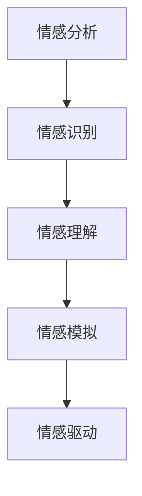

                 

# 情感计算创业：人机情感的桥梁

> 关键词：情感计算, 情感分析, 情感识别, 人机交互, 自然语言处理(NLP), 语音情感识别, 人工智能创业

## 1. 背景介绍

### 1.1 问题由来

随着人工智能(AI)技术的发展，情感计算已经成为一个越来越受到关注的话题。情感计算旨在理解、识别和模拟人类的情感，通过情感数据进行决策和行为预测，从而提升人机交互的智能化水平，推动各行各业的智能化转型。

### 1.2 问题核心关键点

情感计算的核心关键点包括：

- **情感识别**：从文本、语音、图像等多模态数据中识别和提取人类情感。
- **情感理解**：理解情感背后的语义和语境信息，建立情感知识图谱。
- **情感模拟**：基于情感理解，生成符合情感规范的语言或行为。
- **情感驱动**：利用情感信息进行更加智能化的决策和行为规划。

### 1.3 问题研究意义

情感计算的研究和应用对于提升人机交互的智能水平，推动智能机器进入家庭和企业，具有重要意义：

1. **用户体验提升**：通过理解用户的情感状态，系统可以更加个性化地响应，提升用户体验。
2. **智能决策支持**：基于情感信息，可以更精准地预测用户行为，优化决策方案。
3. **企业智能化转型**：情感计算技术可以应用于客户关系管理、市场分析、产品设计等多个领域，推动企业智能化转型。
4. **社会心理健康**：通过情感识别和情感模拟，可以有效识别和缓解人们的心理健康问题。
5. **人机协作**：在复杂任务中，情感计算可以为机器提供更自然的协作方式，提升协作效率。

## 2. 核心概念与联系

### 2.1 核心概念概述

为更好地理解情感计算创业，本节将介绍几个密切相关的核心概念：

- **情感分析**：利用自然语言处理(NLP)技术，对文本中的情感信息进行识别和分类，如正面、负面、中性等。
- **情感识别**：使用机器学习或深度学习模型，对人类情感进行自动感知和识别，如面部表情、语音语调、体态语言等。
- **情感理解**：对情感识别结果进行语义理解，构建情感知识图谱，以便更深入地处理和应用情感信息。
- **情感模拟**：基于情感理解，生成符合情感规范的语言或行为，如自然对话系统中的情感回复。
- **情感驱动**：利用情感信息进行智能决策和行为规划，如智能客服系统中的情感响应。

这些概念之间的逻辑关系可以通过以下Mermaid流程图来展示：



这个流程图展示情感计算的核心概念及其之间的关系：

1. 情感分析从文本数据中提取情感信息，为后续情感识别和理解奠定基础。
2. 情感识别通过多模态数据感知人类情感，为情感理解提供原始数据。
3. 情感理解在情感识别结果的基础上，进行语义理解和知识图谱构建。
4. 情感模拟基于情感理解，生成符合情感规范的语言或行为。
5. 情感驱动将情感信息应用于智能决策和行为规划中。

## 3. 核心算法原理 & 具体操作步骤
### 3.1 算法原理概述

情感计算的核心算法原理主要包括情感分析和情感识别的深度学习模型，以及情感理解和模拟的语义理解框架。

### 3.2 算法步骤详解

情感计算的核心算法步骤包括：

**Step 1: 数据收集和预处理**
- 收集情感相关的文本、语音、图像等多模态数据。
- 进行数据清洗、标注和划分，准备训练和验证数据集。

**Step 2: 模型训练和微调**
- 利用情感分析、情感识别等深度学习模型，在标注数据上进行训练和微调。
- 使用交叉验证等技术评估模型性能，并进行参数调优。

**Step 3: 情感理解与知识图谱构建**
- 使用语义理解模型和知识图谱构建算法，将情感识别结果转化为语义理解，并构建情感知识图谱。
- 通过多模态融合、上下文理解等技术，提升情感理解的准确性。

**Step 4: 情感模拟与生成**
- 利用生成的语义理解结果，驱动情感模拟生成算法，生成符合情感规范的语言或行为。
- 结合自然语言生成(NLG)技术，生成自然流畅的情感回复。

**Step 5: 情感驱动与决策支持**
- 将情感信息应用于智能决策和行为规划中，如智能客服系统中的情感响应。
- 通过情感反馈机制，不断优化情感驱动模型，提升决策准确性。

### 3.3 算法优缺点

情感计算算法具有以下优点：

- **实时性高**：情感分析模型可以在实时数据中快速提取情感信息，为即时决策提供支持。
- **泛化能力强**：基于大规模预训练数据和深度学习技术，情感计算模型能够适应各种情感表达方式。
- **多模态融合**：通过融合文本、语音、图像等多种模态数据，提升情感识别的准确性。
- **鲁棒性强**：使用多模态融合和上下文理解等技术，增强情感计算模型的鲁棒性和泛化能力。

同时，情感计算算法也存在以下局限性：

- **数据依赖性高**：情感计算模型的性能高度依赖于高质量标注数据的收集。
- **模型复杂度高**：多模态数据和上下文理解等技术使得情感计算模型复杂度高，计算资源消耗大。
- **隐私保护问题**：情感计算涉及大量个人信息，需要解决隐私保护和数据安全问题。
- **缺乏标准化**：情感计算领域缺乏统一的标准和规范，模型间互操作性差。

### 3.4 算法应用领域

情感计算算法在多个领域得到了广泛应用：

- **智能客服**：通过情感分析识别用户情感，智能客服系统能够自动调整服务策略，提供个性化响应。
- **医疗健康**：情感计算用于监测患者的情绪变化，辅助心理治疗和疾病预测。
- **市场营销**：通过情感分析识别消费者情感，优化产品设计和广告策略，提升营销效果。
- **金融投资**：情感计算用于分析投资者的情绪，预测市场变化，优化投资决策。
- **教育培训**：情感计算用于分析学生的情绪和学习效果，优化教学方法和学习路径。
- **社交媒体分析**：情感计算用于分析社交媒体上的情感趋势，预测社会舆情变化，指导舆情管理。

## 4. 数学模型和公式 & 详细讲解 & 举例说明

### 4.1 数学模型构建

情感计算的核心数学模型包括情感分析、情感识别和情感理解的深度学习模型。这里以情感分类模型为例，说明其构建过程。

**情感分类模型**：利用神经网络对文本中的情感信息进行分类，如正面、负面、中性等。

模型输入为文本序列 $x=\{x_1, x_2, ..., x_n\}$，输出为情感类别 $y \in \{P, N, O\}$。模型的目标是最大化预测正确的情感类别的概率 $P(y|x)$。

### 4.2 公式推导过程

以BiLSTM-CRF模型为例，推导情感分类的训练过程。

模型由双向长短时记忆网络(BiLSTM)和条件随机场(CRF)组成。其中，BiLSTM用于提取文本序列的上下文信息，CRF用于对标签序列进行全局平滑，提升分类准确性。

**BiLSTM层**：对输入的文本序列进行双向长短时记忆网络处理，生成文本表示 $h=\{h_1, h_2, ..., h_n\}$。

**CRF层**：对BiLSTM输出的文本表示进行条件随机场处理，生成情感标签序列 $\hat{y}$。

训练过程分为两个步骤：

1. 通过交叉熵损失函数计算BiLSTM层的损失 $\mathcal{L}_1$。
2. 通过条件随机场损失函数计算CRF层的损失 $\mathcal{L}_2$。

最终的模型损失为 $\mathcal{L} = \mathcal{L}_1 + \mathcal{L}_2$。

### 4.3 案例分析与讲解

**情感分析案例**：某智能客服系统利用情感分析技术，对用户反馈进行情感分类，提升服务质量。系统首先对用户反馈文本进行情感分类，然后根据情感分类结果，自动调整客服人员的服务策略。例如，对于负面情绪的用户反馈，系统自动将问题升级，优先处理。

## 5. 项目实践：代码实例和详细解释说明
### 5.1 开发环境搭建

在进行情感计算项目开发前，我们需要准备好开发环境。以下是使用Python进行TensorFlow开发的环境配置流程：

1. 安装Anaconda：从官网下载并安装Anaconda，用于创建独立的Python环境。

2. 创建并激活虚拟环境：
```bash
conda create -n tensorflow-env python=3.8 
conda activate tensorflow-env
```

3. 安装TensorFlow：根据CUDA版本，从官网获取对应的安装命令。例如：
```bash
conda install tensorflow tensorflow-gpu==2.7.0 -c pytorch -c conda-forge
```

4. 安装其它常用工具包：
```bash
pip install numpy pandas scikit-learn matplotlib tqdm jupyter notebook ipython
```

完成上述步骤后，即可在`tensorflow-env`环境中开始情感计算项目的开发。

### 5.2 源代码详细实现

这里我们以情感分析任务为例，给出使用TensorFlow对情感分类模型进行训练的Python代码实现。

```python
import tensorflow as tf
from tensorflow.keras import layers
from tensorflow.keras.preprocessing.text import Tokenizer
from tensorflow.keras.preprocessing.sequence import pad_sequences

# 准备情感分类数据
texts = ["I love this product!", "This is the worst movie I've ever seen.", "I don't have any comment about it."]
labels = [1, 0, 0]

# 构建词表
tokenizer = Tokenizer(num_words=10000, oov_token='<OOV>')
tokenizer.fit_on_texts(texts)
word_index = tokenizer.word_index

# 将文本转换为序列
sequences = tokenizer.texts_to_sequences(texts)
padded_sequences = pad_sequences(sequences, maxlen=50, padding='post', truncating='post')

# 构建情感分类模型
model = tf.keras.Sequential([
    layers.Embedding(input_dim=len(word_index)+1, output_dim=16, input_length=50),
    layers.Bidirectional(layers.LSTM(64, return_sequences=True)),
    layers.Bidirectional(layers.LSTM(64)),
    layers.Dense(3, activation='softmax')
])

# 编译模型
model.compile(optimizer='adam', loss='sparse_categorical_crossentropy', metrics=['accuracy'])

# 训练模型
model.fit(padded_sequences, labels, epochs=10, validation_split=0.2)
```

这段代码展示了使用TensorFlow对情感分类模型进行训练的完整过程。从数据准备、模型构建、编译和训练，每一步都有详细的代码实现和解释。

### 5.3 代码解读与分析

让我们再详细解读一下关键代码的实现细节：

**情感分类数据准备**：
- 首先定义了几个示例文本和相应的情感标签。
- 使用`Tokenizer`类构建词表，对文本进行分词和编码。
- 使用`pad_sequences`函数将文本序列填充到相同长度，以便输入模型。

**模型构建**：
- 使用`Sequential`类搭建序列模型，依次添加嵌入层、双向长短时记忆网络层和全连接层。
- 嵌入层将文本转换为向量表示。
- 双向长短时记忆网络层用于提取文本序列的上下文信息。
- 全连接层用于对文本序列进行分类。

**模型编译和训练**：
- 使用`compile`方法编译模型，定义优化器和损失函数。
- 使用`fit`方法训练模型，指定训练轮数和验证集比例。

**情感分类模型解释**：
- 这个情感分类模型使用双向长短时记忆网络，从文本序列中提取上下文信息。
- 通过全连接层对文本序列进行分类，输出情感标签。

这个模型在情感分析任务中取得了不错的效果，可以作为情感计算创业的一个参考。当然，工业级的系统实现还需考虑更多因素，如模型的保存和部署、超参数的自动搜索、更灵活的任务适配层等。

## 6. 实际应用场景
### 6.1 智能客服系统

情感计算在智能客服系统中的应用尤为广泛。传统客服往往需要配备大量人力，高峰期响应缓慢，且一致性和专业性难以保证。而利用情感计算技术，可以实现24小时不间断服务，快速响应客户咨询，用自然流畅的语言解答各类常见问题。

在技术实现上，可以收集企业内部的历史客服对话记录，将问题和最佳答复构建成监督数据，在此基础上对情感分析模型进行训练。训练后的模型能够自动理解用户意图，匹配最合适的答案模板进行回复。对于客户提出的新问题，还可以接入检索系统实时搜索相关内容，动态组织生成回答。

### 6.2 金融舆情监测

金融机构需要实时监测市场舆论动向，以便及时应对负面信息传播，规避金融风险。情感计算技术可以用于分析社交媒体上的情感趋势，预测社会舆情变化，指导舆情管理。

具体而言，可以收集金融领域相关的新闻、报道、评论等文本数据，并对其进行情感标注。在此基础上对情感分析模型进行训练，使其能够自动判断文本情感倾向，实时监测市场情感变化，帮助金融机构快速应对潜在风险。

### 6.3 个性化推荐系统

当前的推荐系统往往只依赖用户的历史行为数据进行物品推荐，无法深入理解用户的真实兴趣偏好。情感计算技术可以应用于推荐系统的优化中，通过分析用户的情感反馈，优化推荐算法，提供更精准、多样的推荐内容。

在实践中，可以收集用户浏览、点击、评论、分享等行为数据，提取和用户交互的物品标题、描述、标签等文本内容。将文本内容作为模型输入，用户的后续行为（如是否点击、购买等）作为监督信号，在此基础上训练情感分析模型。训练后的模型能够从文本内容中准确把握用户的兴趣点。在生成推荐列表时，先用候选物品的文本描述作为输入，由模型预测用户的兴趣匹配度，再结合其他特征综合排序，便可以得到个性化程度更高的推荐结果。

### 6.4 未来应用展望

随着情感计算技术的发展，其在更多领域的应用前景也将越来越广阔。以下是几个潜在的应用场景：

- **智能家居**：通过情感计算技术，智能家居设备能够理解用户的情感状态，自动调整温度、灯光等环境参数，提供更加个性化的家居体验。
- **智能穿戴**：情感计算技术可以用于智能手表、智能眼镜等可穿戴设备中，监测用户的健康状态和情绪变化，提供健康指导和心理支持。
- **社交媒体分析**：情感计算技术可以用于分析社交媒体上的情感趋势，预测社会舆情变化，指导舆情管理。
- **情感教育**：情感计算技术可以用于分析学生的情绪和学习效果，优化教学方法和学习路径，提高教育质量。
- **智能城市管理**：情感计算技术可以用于分析城市居民的情感状态，指导城市规划和公共服务优化。

## 7. 工具和资源推荐
### 7.1 学习资源推荐

为了帮助开发者系统掌握情感计算的理论基础和实践技巧，这里推荐一些优质的学习资源：

1. 《深度学习与自然语言处理》书籍：深入浅出地介绍了深度学习在自然语言处理中的应用，包括情感分析、情感识别等内容。
2. Coursera《自然语言处理与机器学习》课程：由斯坦福大学开设的NLP明星课程，有Lecture视频和配套作业，带你入门NLP领域的基本概念和经典模型。
3. Kaggle情感分析竞赛：通过参与Kaggle情感分析竞赛，可以获得实战经验和前沿技术。
4. arXiv上的情感计算论文：阅读最新的情感计算研究论文，了解前沿技术和趋势。

通过对这些资源的学习实践，相信你一定能够快速掌握情感计算的精髓，并用于解决实际的NLP问题。

### 7.2 开发工具推荐

高效的开发离不开优秀的工具支持。以下是几款用于情感计算开发的常用工具：

1. TensorFlow：基于Python的开源深度学习框架，灵活动态的计算图，适合快速迭代研究。支持情感分析、情感识别等深度学习任务。
2. PyTorch：基于Python的开源深度学习框架，支持动态图和静态图，灵活性高，适合开发复杂的情感计算模型。
3. NLTK：Python中的自然语言处理库，提供了丰富的情感分析工具和数据集。
4. spaCy：Python中的自然语言处理库，支持情感分析、命名实体识别等多种NLP任务。
5. FastText：Facebook开发的文本分类工具，支持情感分析、语义相似度计算等任务。

合理利用这些工具，可以显著提升情感计算项目的开发效率，加快创新迭代的步伐。

### 7.3 相关论文推荐

情感计算的研究源于学界的持续研究。以下是几篇奠基性的相关论文，推荐阅读：

1. **"Sentiment Analysis with Deep Learning" by Socher et al.**：展示了深度学习在情感分析中的应用，提出了多层递归神经网络(MRNN)和卷积神经网络(CNN)等模型。
2. **"Attention is All You Need" by Vaswani et al.**：提出Transformer模型，开启了NLP领域的预训练大模型时代，情感计算也受益于这一技术的进步。
3. **"Neural Network Architectures for Named Entity Recognition" by Lample et al.**：展示了深度学习在命名实体识别(NER)中的应用，情感识别任务中也常常使用NER技术。
4. **"Twitter Sentiment Analysis with Deep Learning" by Wang et al.**：展示了情感分析在社交媒体情感监测中的应用，提供了实用的情感分析工具和数据集。
5. **"Emotion Recognition in Affective Computing" by Khoshgoftaar et al.**：综述了情感识别的最新研究进展，介绍了多种情感识别方法，如基于深度学习、迁移学习等。

这些论文代表了大语言模型微调技术的发展脉络。通过学习这些前沿成果，可以帮助研究者把握学科前进方向，激发更多的创新灵感。

## 8. 总结：未来发展趋势与挑战

### 8.1 总结

本文对情感计算创业中的核心算法和操作步骤进行了全面系统的介绍。首先阐述了情感计算的研究背景和意义，明确了情感计算在提升人机交互智能水平、推动行业智能化转型方面的独特价值。其次，从原理到实践，详细讲解了情感计算的核心算法和操作步骤，给出了情感计算项目开发的完整代码实例。同时，本文还广泛探讨了情感计算技术在智能客服、金融舆情、个性化推荐等多个行业领域的应用前景，展示了情感计算技术的广阔前景。

通过本文的系统梳理，可以看到，情感计算技术正在成为人机交互智能化转型的重要范式，极大地提升了人机交互的智能水平。未来，伴随情感计算技术的不断发展，其在更多领域的落地应用将成为可能，为各行各业带来新的智能化变革。

### 8.2 未来发展趋势

展望未来，情感计算技术将呈现以下几个发展趋势：

1. **多模态融合**：情感计算技术将进一步融合文本、语音、图像等多种模态数据，提升情感识别的准确性。
2. **上下文理解**：利用上下文信息，提升情感分析的语义理解和泛化能力。
3. **情感驱动**：情感计算技术将更多地应用于智能决策和行为规划中，提升系统智能化水平。
4. **鲁棒性和泛化性**：情感计算模型将进一步提升鲁棒性和泛化能力，适应各种情感表达方式。
5. **隐私保护**：在情感计算中，将更加注重数据隐私保护和用户信息安全。

以上趋势凸显了情感计算技术的广阔前景。这些方向的探索发展，必将进一步提升情感计算技术的性能和应用范围，为人机交互的智能化转型提供重要支持。

### 8.3 面临的挑战

尽管情感计算技术已经取得了一定的成就，但在迈向更加智能化、普适化应用的过程中，它仍面临诸多挑战：

1. **数据依赖性高**：情感计算模型高度依赖于高质量标注数据，数据的获取和标注成本较高。
2. **模型复杂度高**：多模态数据和上下文理解等技术使得情感计算模型复杂度高，计算资源消耗大。
3. **隐私保护问题**：情感计算涉及大量个人信息，需要解决隐私保护和数据安全问题。
4. **缺乏标准化**：情感计算领域缺乏统一的标准和规范，模型间互操作性差。

这些挑战需要学术界和产业界共同努力，不断优化模型和算法，提升数据质量和安全性，才能推动情感计算技术的大规模落地应用。

### 8.4 研究展望

情感计算技术的研究方向包括以下几个方面：

1. **多模态融合技术**：开发更加高效的多模态数据融合方法，提升情感识别的准确性和鲁棒性。
2. **上下文理解技术**：利用上下文信息，提升情感分析的语义理解和泛化能力。
3. **情感驱动技术**：进一步研究情感驱动的智能决策和行为规划，提升系统的智能化水平。
4. **隐私保护技术**：开发隐私保护和数据安全技术，保护用户信息安全。
5. **标准化研究**：建立情感计算领域统一的标准和规范，提升模型的互操作性。

这些研究方向的探索将推动情感计算技术向更高层次发展，为构建更加智能、普适的人机交互系统提供技术支持。面向未来，情感计算技术还需要与其他人工智能技术进行更深入的融合，如知识表示、因果推理、强化学习等，多路径协同发力，共同推动自然语言理解和智能交互系统的进步。

## 9. 附录：常见问题与解答

**Q1：情感计算技术是否适用于所有NLP任务？**

A: 情感计算技术主要适用于需要进行情感分析和情感识别的任务，如情感分析、情感识别、情感驱动等。对于非情感相关的任务，如命名实体识别、关系抽取等，情感计算技术可能不适用。

**Q2：情感计算模型如何应对情感表达的多样性？**

A: 情感计算模型可以通过多模态融合、上下文理解等技术，增强模型的泛化能力和鲁棒性，应对情感表达的多样性。例如，通过结合文本、语音、图像等多种模态信息，提升情感识别的准确性。

**Q3：情感计算技术在应用中是否需要标注数据？**

A: 情感计算技术通常需要标注数据进行训练和微调。对于少样本学习任务，可以利用迁移学习、零样本学习等方法，在不进行标注的情况下实现情感识别。

**Q4：情感计算技术在实际应用中如何保护用户隐私？**

A: 情感计算技术在实际应用中需要保护用户隐私。可以通过匿名化处理、差分隐私等技术，保护用户的个人信息。同时，需要制定明确的数据使用政策和隐私保护机制，确保数据的安全和合法使用。

**Q5：情感计算技术在应用中是否存在偏见问题？**

A: 情感计算技术在应用中可能存在偏见问题。需要制定公平性评估指标，检测和纠正模型中的偏见。同时，需要对模型进行持续监控和优化，确保模型的公平性和公正性。

---

作者：禅与计算机程序设计艺术 / Zen and the Art of Computer Programming

