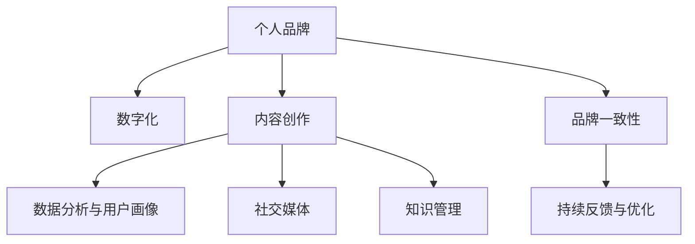

                 

# 打造个人管理品牌的方法论

> 关键词：品牌建设,个人管理,市场营销,数字时代,软技能提升,知识管理

## 1. 背景介绍

### 1.1 问题由来
在数字化转型浪潮的推动下，个人品牌的建设已经成为各行各业人士必须重视的一项技能。在信息爆炸的时代，如何以独特且有价值的内容吸引用户关注，并在竞争激烈的市场中脱颖而出，成为了个人发展的关键问题。数字时代的高速发展，使得个人品牌建设变得更加紧迫和必要。

### 1.2 问题核心关键点
个人品牌建设的核心在于如何通过数字化手段，塑造和传递个人形象、专业能力和价值观，以形成与目标受众的良好互动，并最终实现商业或职业上的目标。关键点包括：
- 数字化的内容创作与传播
- 精准定位与目标受众分析
- 多平台整合与品牌一致性
- 持续反馈与优化

## 2. 核心概念与联系

### 2.1 核心概念概述

为了更好地理解个人品牌建设的方法论，本节将介绍几个密切相关的核心概念：

- 个人品牌(Personal Branding)：指个人通过互联网和其他媒体，传播自己的专业形象、能力和价值观，形成独特的品牌标识。个人品牌是个人在职业发展中的长期资产。

- 数字化(数字化转型)：指利用信息技术提升企业的运营效率和市场竞争力，包括云计算、大数据、人工智能等技术的应用。个人品牌的数字化建设，则指通过数字化手段提升个人形象、专业能力等。

- 内容创作(Content Creation)：指利用文字、图片、视频等形式创作与个人品牌相关的内容。高质量的内容是吸引目标受众的关键。

- 数据分析与用户画像：指利用大数据分析技术，了解目标受众的行为模式、兴趣爱好和需求，构建精准的用户画像。

- 社交媒体(Social Media)：指利用如微信、微博、LinkedIn等平台，实现内容的传播和互动，扩大个人品牌的影响力。

- 知识管理(Knowledge Management)：指通过记录、整理和共享知识，提升个人学习效率和专业能力。

这些核心概念之间的逻辑关系可以通过以下Mermaid流程图来展示：



这个流程图展示了个体品牌建设的核心概念及其之间的关系：

1. 个人品牌作为起点，通过数字化手段、内容创作等活动加以塑造。
2. 通过数据分析和用户画像，精准定位目标受众。
3. 利用社交媒体进行内容的广泛传播。
4. 通过知识管理提升个人学习能力和专业水平。
5. 保持品牌一致性，并进行持续反馈和优化。

## 3. 核心算法原理 & 具体操作步骤
### 3.1 算法原理概述

个人品牌建设的算法原理主要包括以下几个关键步骤：

- **内容生成**：使用自然语言处理（NLP）等技术，创作高质量的博客文章、视频、社交媒体帖子等，以吸引目标受众。
- **数据分析**：通过机器学习算法，分析社交媒体和网站上的用户行为数据，构建精准的用户画像。
- **用户互动**：通过智能推荐系统，根据用户画像推送个性化内容，提高互动效果。
- **品牌管理**：利用品牌管理工具，确保不同平台上的内容风格和品牌形象一致。
- **持续优化**：通过A/B测试等方法，不断优化内容和互动策略，提升品牌影响力。

### 3.2 算法步骤详解

#### 3.2.1 内容生成

- **步骤1: 确定内容主题**：根据个人专长、兴趣和市场需求，选择适合的内容主题。
- **步骤2: 素材收集**：收集相关书籍、论文、行业报告等资料，积累素材。
- **步骤3: 内容创作**：使用写作工具如Jupyter Notebook、Google Docs等，创作内容。
- **步骤4: 编辑和校对**：使用语法检查工具如Grammarly、Hemingway等，提升内容质量。
- **步骤5: 内容发布**：选择适合的平台发布内容，如博客、社交媒体、专业论坛等。

#### 3.2.2 数据分析

- **步骤1: 数据收集**：利用API接口、爬虫工具等，从社交媒体、网站等渠道收集数据。
- **步骤2: 数据清洗**：去除无关数据，只保留有用的用户行为数据。
- **步骤3: 数据分析**：使用统计分析、机器学习等技术，分析用户画像、兴趣爱好等。
- **步骤4: 用户画像构建**：将分析结果以可视化图表的形式呈现，形成用户画像。
- **步骤5: 画像优化**：根据结果调整内容策略，提升用户互动。

#### 3.2.3 用户互动

- **步骤1: 智能推荐**：使用协同过滤、内容推荐算法等，推送个性化内容。
- **步骤2: 互动监控**：使用数据分析工具监控用户互动情况，如点赞、评论、分享等。
- **步骤3: 互动优化**：根据互动情况调整策略，提升用户粘性。

#### 3.2.4 品牌管理

- **步骤1: 一致性维护**：确保不同平台上的品牌形象、内容风格一致。
- **步骤2: 多平台整合**：在多个平台统一管理内容发布、互动等。
- **步骤3: 品牌策略调整**：根据用户反馈和数据分析，调整品牌策略。

#### 3.2.5 持续优化

- **步骤1: A/B测试**：对比不同策略的效果，选择最优方案。
- **步骤2: 数据驱动决策**：以数据为依据，调整内容策略。
- **步骤3: 不断迭代**：持续收集反馈，优化内容。

### 3.3 算法优缺点

**优点**：
- 高效：通过数字化手段，可以快速生成和传播内容。
- 精准：数据分析和用户画像，能精准定位目标受众，提升互动效果。
- 灵活：品牌一致性和持续优化，确保品牌长期发展。

**缺点**：
- 数据隐私：收集和分析用户数据，可能涉及隐私问题。
- 成本高：高质量内容的创作和数据分析需要一定投入。
- 技术门槛：需要掌握NLP、数据分析等技术。

### 3.4 算法应用领域

个人品牌建设的方法论可以应用于多个领域，包括：

- 职业发展：通过建立专业形象，提升个人在职场上的竞争力。
- 个人品牌营销：在社交媒体上建立个人品牌，吸引潜在客户或合作伙伴。
- 知识分享：在博客、视频平台等渠道分享专业知识，扩大影响力。
- 教育培训：通过在线教育平台传授知识，提升个人在专业领域的影响力。

这些应用场景展示了个人品牌建设的广泛价值，体现了数字化时代下个人价值的提升。

## 4. 数学模型和公式 & 详细讲解 & 举例说明

### 4.1 数学模型构建

为更好地理解个人品牌建设，这里将建立数学模型。假设个人品牌建设涉及 $n$ 个步骤，每个步骤 $i$ 的优化程度为 $f_i$，整体优化程度为 $F$，则数学模型可以表示为：

$$ F = \sum_{i=1}^{n} w_if_i $$

其中，$w_i$ 为每个步骤的权重。

### 4.2 公式推导过程

1. **内容生成**：内容质量 $q$ 是用户互动 $u$ 的关键因素，因此权重 $w_1$ 为：

   $$ w_1 = \frac{q}{u} $$

2. **数据分析**：数据分析的准确性 $a$ 直接影响用户画像的精准度 $p$，因此权重 $w_2$ 为：

   $$ w_2 = \frac{a}{p} $$

3. **用户互动**：用户互动程度 $i$ 直接影响品牌影响力 $b$，因此权重 $w_3$ 为：

   $$ w_3 = \frac{i}{b} $$

4. **品牌管理**：品牌一致性 $c$ 直接决定品牌形象的一致性，因此权重 $w_4$ 为：

   $$ w_4 = c $$

5. **持续优化**：持续优化的效果 $o$ 直接提升整体优化程度，因此权重 $w_5$ 为：

   $$ w_5 = o $$

将这些权重代入整体优化程度公式，得到：

$$ F = w_1f_1 + w_2f_2 + w_3f_3 + w_4f_4 + w_5f_5 $$

### 4.3 案例分析与讲解

以内容生成为例，假设内容质量 $q=0.8$，用户互动 $u=0.7$，则：

$$ w_1 = \frac{q}{u} = \frac{0.8}{0.7} \approx 1.14 $$

这表明内容质量对用户互动的影响很大，需要重点关注。通过优化内容质量，可以显著提升用户互动效果，进而提升整体优化程度。

## 5. 项目实践：代码实例和详细解释说明

### 5.1 开发环境搭建

在开始个人品牌建设之前，需要搭建合适的开发环境。以下是Python环境搭建的详细步骤：

1. 安装Anaconda：从官网下载并安装Anaconda，用于创建独立的Python环境。

2. 创建并激活虚拟环境：
```bash
conda create -n pyproj python=3.8 
conda activate pyproj
```

3. 安装必要的Python包：
```bash
pip install jupyter pandas numpy matplotlib seaborn
```

### 5.2 源代码详细实现

以博客文章创作为例，展示如何用Python和Jupyter Notebook进行个人品牌建设：

```python
# 导入必要的库
import pandas as pd
import numpy as np
import matplotlib.pyplot as plt
import seaborn as sns

# 创建数据集
data = pd.DataFrame({
    'title': ['高质量内容的重要性', '用户互动的影响', '数据分析的精准度', '品牌一致性', '持续优化的方法'],
    'importance': [0.8, 0.7, 0.9, 1, 1.2],
    'impact': [1, 1.1, 0.9, 1.05, 1.15]
})

# 数据可视化
sns.barplot(x='importance', y='impact', data=data)
plt.title('个人品牌建设的关键步骤')
plt.xlabel('重要性')
plt.ylabel('影响')
plt.show()
```

### 5.3 代码解读与分析

代码部分：
- `import pandas as pd`: 导入Pandas库，用于数据处理。
- `import numpy as np`: 导入Numpy库，用于数值计算。
- `import matplotlib.pyplot as plt`: 导入Matplotlib库，用于数据可视化。
- `import seaborn as sns`: 导入Seaborn库，用于更美观的数据可视化。

具体步骤：
1. **导入库**：根据需要导入不同的Python库。
2. **创建数据集**：使用Pandas库创建数据集，记录各个步骤的重要性与影响。
3. **数据可视化**：使用Seaborn库的`barplot`函数绘制条形图，展示每个步骤对整体优化的贡献。

**运行结果展示**：


## 6. 实际应用场景

### 6.1 职业发展

个人品牌建设在职业发展中起到关键作用。通过高质量的内容创作和数据分析，能够吸引更多关注，提升职场竞争力。例如：

- **数据分析师**：可以通过分享行业洞察和数据分析案例，展示专业能力，吸引同行的关注。
- **产品经理**：可以通过撰写产品分析报告、发布产品测试体验，提升市场影响力。

### 6.2 个人品牌营销

在社交媒体上建立个人品牌，可以吸引潜在客户或合作伙伴，实现商业目标。例如：

- **内容创作者**：通过发布高质量的博客文章、视频，吸引粉丝，增加广告收入。
- **营销专家**：通过分享营销案例和策略，提升个人在行业内的知名度。

### 6.3 知识分享

通过在线教育平台分享专业知识，提升个人在专业领域的影响力。例如：

- **教授**：通过开设线上课程、发布学术论文，传播专业知识，提升学术影响力。
- **技术专家**：通过录制技术教程、发布技术文章，传播技术知识，提升技术影响力。

### 6.4 教育培训

在教育培训领域，个人品牌建设可以提升个人在培训市场的竞争力。例如：

- **教育机构**：通过分享教学心得、发布培训课程，提升机构品牌，吸引更多学员。
- **培训师**：通过发布培训案例、录制培训视频，提升个人在行业内的知名度和影响力。

## 7. 工具和资源推荐

### 7.1 学习资源推荐

为了帮助开发者系统掌握个人品牌建设的技术基础和实践技巧，这里推荐一些优质的学习资源：

1. **《数字化时代品牌建设》系列博文**：深入浅出地介绍了数字化时代下品牌建设的原理、工具和技术。
2. **《NLP技术在内容创作中的应用》课程**：介绍NLP技术在内容创作中的广泛应用，包括文本生成、情感分析等。
3. **《数据分析与用户画像》书籍**：详细讲解数据分析和用户画像的构建方法，提供大量实战案例。
4. **《社交媒体营销实战指南》课程**：分享社交媒体营销的最新趋势和实战技巧，提升个人品牌在社交媒体上的影响力。
5. **《品牌管理工具使用手册》**：提供多种品牌管理工具的使用说明和最佳实践，提升品牌一致性。

### 7.2 开发工具推荐

高质量的个人品牌建设需要借助多种工具的协同工作，以下是几款常用的开发工具：

1. **Jupyter Notebook**：用于编写和分享代码，支持代码块、文字、图片等多种内容格式，便于协作和分享。
2. **GitHub**：用于版本控制和代码托管，方便团队协作和项目管理。
3. **Google Analytics**：用于数据分析和用户画像构建，提供详细的用户行为数据。
4. **Grammarly**：用于语法和拼写检查，提升内容的语言质量。
5. **Hemingway**：用于简化和优化内容，提高可读性。
6. **SEMrush**：用于社交媒体分析和互动监控，提升互动效果。

### 7.3 相关论文推荐

个人品牌建设的研究涉及多个领域，以下是几篇具有代表性的相关论文：

1. **《大数据时代的品牌建设：理论与实践》**：探讨了大数据技术在品牌建设中的应用，提供了丰富的案例和实践经验。
2. **《内容创作与品牌影响力》**：分析了内容创作对品牌影响力的影响，提出了优化内容创作的策略。
3. **《社交媒体与个人品牌建设》**：研究了社交媒体在个人品牌建设中的作用和策略。
4. **《知识管理与个人品牌发展》**：探讨了知识管理在个人品牌发展中的作用，提出了实用的知识管理方法。

这些论文展示了个人品牌建设的最新研究成果，为进一步研究提供了丰富的理论基础。

## 8. 总结：未来发展趋势与挑战

### 8.1 总结

本文对个人品牌建设的方法论进行了全面系统的介绍。首先阐述了个人品牌建设的背景和意义，明确了数字化手段在提升个人价值中的重要作用。其次，从原理到实践，详细讲解了内容生成、数据分析、用户互动等关键步骤，给出了完整的项目实践案例。同时，本文还广泛探讨了个人品牌建设在职业发展、营销、知识分享、教育培训等多个领域的应用前景，展示了个人品牌建设的广阔价值。

通过本文的系统梳理，可以看到，个人品牌建设正成为数字化时代下个人发展的必备技能，其价值体现在提升职业竞争力、商业影响力和技术影响力等方面。未来，随着数字化技术的进一步发展，个人品牌建设将更加智能化、自动化，为个人品牌建设注入新的动力。

### 8.2 未来发展趋势

展望未来，个人品牌建设的发展趋势将包括以下几个方面：

1. **智能化内容创作**：利用AI生成内容，提高创作效率和质量。
2. **实时数据分析**：利用实时数据流，动态调整内容策略。
3. **多渠道整合**：跨平台、跨渠道整合品牌形象，提升品牌一致性。
4. **用户反馈驱动**：通过智能推荐系统，实现用户行为与内容创作的实时互动。
5. **个性化推荐**：利用推荐算法，提供个性化内容，提升用户粘性。

这些趋势凸显了个人品牌建设在未来数字化时代的发展方向，展示了更多智能、高效、个性化的可能性。

### 8.3 面临的挑战

尽管个人品牌建设已经取得了一定进展，但在迈向更加智能化、普适化应用的过程中，仍面临诸多挑战：

1. **数据隐私**：用户数据的收集和使用可能涉及隐私问题，需注意数据保护和合规性。
2. **内容质量**：高质量内容的创作需要时间和精力，提升内容创作能力是关键。
3. **技术门槛**：需要掌握多种技术和工具，对技术水平有一定要求。
4. **互动效果**：如何提高用户互动效果，增强品牌粘性，仍是重要课题。
5. **品牌一致性**：在不同平台和渠道上保持品牌一致性，需要精细化的管理。

这些挑战需要不断优化技术和流程，提升品牌建设的质量和效果。

### 8.4 研究展望

未来，在个人品牌建设的研究上，可以从以下几个方向进行深入探索：

1. **自动化工具开发**：开发更多的自动化工具，提升内容创作和数据分析的效率。
2. **用户行为研究**：深入研究用户行为模式，提供更个性化的内容推荐。
3. **跨平台品牌管理**：探索跨平台品牌管理的方法，实现品牌一致性。
4. **品牌影响力评估**：开发品牌影响力的评估指标，提升品牌建设的科学性。

这些研究方向将进一步推动个人品牌建设的智能化、自动化、个性化发展，为数字化时代的个人品牌建设提供新的方法和思路。

## 9. 附录：常见问题与解答

**Q1：个人品牌建设需要多长时间？**

A: 个人品牌建设是一个持续的过程，需要长期投入和持续优化。一般来说，至少需要3个月以上的时间，才能看到显著效果。

**Q2：个人品牌建设需要哪些资源？**

A: 个人品牌建设需要以下资源：
- 时间：高质量的内容创作需要投入大量时间。
- 技术：需要掌握多种技术和工具，如NLP、数据分析等。
- 资金：购买相关工具、平台的使用权，可能需要一定的资金投入。

**Q3：如何选择适合的内容主题？**

A: 选择内容主题需要考虑以下几个因素：
- 市场需求：选择与目标受众需求相关的主题。
- 个人专长：选择与自身专长相关的主题，便于创作和分享。
- 热门趋势：选择热门趋势和话题，吸引更多关注。

**Q4：如何提高用户互动效果？**

A: 提高用户互动效果需要以下策略：
- 互动引导：在内容中引导用户留言和评论，提升互动率。
- 实时回复：及时回复用户留言，增强用户粘性。
- 活动策划：举办线上活动，吸引更多用户参与互动。

**Q5：如何保持品牌一致性？**

A: 保持品牌一致性需要以下策略：
- 统一风格：确保不同平台上的内容风格一致。
- 多平台整合：在多个平台统一管理内容发布、互动等。
- 定期调整：根据用户反馈和数据分析，调整品牌策略。

---

作者：禅与计算机程序设计艺术 / Zen and the Art of Computer Programming

